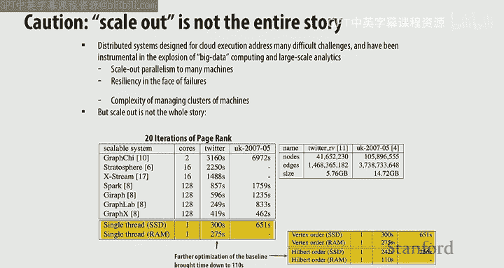
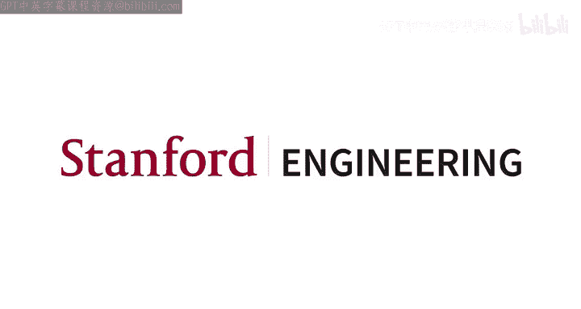

# 斯坦福大学《并行计算｜Stanford CS149 I Parallel Computing 2023》中英字幕（gpt-4 - P11：Lecture 11 - Cache Coherence.zh_en - GPT中英字幕课程资源 - BV1Y5V5zjEsX

Alright， so the main event today is we're going to discuss cash coherence。

 But before we get into cash coherence， let's finish up our discussion of Spark。😊。

You notice that， you know， instead of me teaching。On Thursday， Can did。

 and that's because originally we thought that based on when the programming assignment would be out that you would need to know about optimizing DNN code on the GPU。

 but given that we've delayed the program assignment3 and so4 is delayed turned out that we didn't quite need the order of lectures and so things are a little not as。

Smooth as we might like。 But nonetheless， you guys can context Sw， right， Allright， So back to Sp。

 right， So where we left off， we were talking about how to。

Design a system for doing distributed computing on a cluster。

 remember the characteristics of a cluster of courses。

 you've got separate nodes or servers that are connected by a network and each of the servers is running its own operating system and has its own independent memory system。

 right So， and the way that we communicate is by using message passing as opposed to shared memory。😊。

Okay， so the idea of， you in memorymory fault tolerancerant distributed computing。

 the goals of Spar what if you have an application that makes lots of use of intermediate data right。

 so we know that we can make it fault tolerance by using the map reduce system。

 So what were the characters how did we keep fault tolerance in the map reduce system。

Where do we put the intermediate data？Yeah on the hardr right on the distributed fst in the HFS system。

 which we know is fault tolerant because it's replicated。

 but the problem as we saw from by looking at the system it's slow especially compared to the memory it's a0s x slower than the memory and so the question is can we if we want an application that makes loss of use of intermediate data such as a iterative algorithm or a query where where you've got the data in that you want to continuously make ad hoc queries to。

 then the map reduce system is actually pretty inefficient right so how can we make something that's much more efficient but still keep quality that we want in the distributed system is something that is still fault tolerant right and so the key abstraction we said was the resilient distributed data set。

W was this read only ordered collection of records right。

 So essentially the sequence and the way that we get RDDs is we start with some data on in in on the disk on the HFS。

 And when then we apply transformations to it so we can extract the lines from the text file and get an RDDD called lines。

 we can filter， which is another transformation to get mobile views。

 and we can filter again to get safari views。 and then finally。

 we can create account from that which is not a transformation。 And so of course。

 So the result is a single scalar instead of an RDD。😊。

AlrightAnd so we were looking at sort of how we implement RDDs and we said that you know the problem was if you didn't do things efficiently。

 you could end up with huge amounts of memory for the intermediate data and so of course this course is all about improving parallel performance and we said that parallel performance comes from you know。

 you've got to have lots of parallelism， lots of things to do at the same time。

 but you also have to optimize for locality right we've talked about a couple of mechanisms for optimizing for locality and you just saw these used in the last lecture。

One was the idea of fusion， loop fusion right and here of course we're trying to minimize the need for external memory access and we're trying to improve or increase arithmetic intensity and as an example。

 we saw that here in this example and you saw it in doing。😡，Attention， right？ So。

 so Calin talked about flash attention。 And that's essentially a combination of fusion and tiling。

 right， And so tiling was the other locality optimization mechanism that we， we talked about。

 And we said that essentially， in order to get these sorts of transformations。

 you have to understand the the application because you potentially have to globally restructure things。

 And so the nice thing about the spark。😊，Implementation is that you have the ability to do fusion with RD Ds since you've got a set of bulk operations。

 these transformations and RDDs and the runtime system。

 the spark runtime system can look at what is happening and optimize these things。

 So in this example， we've got these transformations to create lines， lower mobile views。

And then finally， an action to create how many。 and what youd like to do， of course。

 is implement it in a fused manner， such as this in which you just fetch one line from the file system。

 and then everything else is kept in memory and you only do it line at a time right And so。

So this is ideally what you'd want to create and the Spar runtime system will do this for you。

 and it does it when it can analyze the transformations and determine that you have narrow dependencies and in narrow dependencies。

 one IDDD only depend the partition of what one IDDD only depends on a single previous partition。😡。

Right， for instance instance， the。Lower partition。0 only depends on the line's partition 0。

And the mobile views partition0 only depends on the lower partition 0。 right。

 So you can imagine then that the runtime system confuse all of these transformations such that you don't have any extra memory accesses。

Or external memoryor axis。So， so there's no communications between nodes of the cluster。

 And so everything can be fully optimized and run very efficiently。

 So the problem is is that that you can have transformations that have wide dependencies， right。

 and which would require communication between the different nodes in the system。

 So an example would be grouped by key， right， where in order to determine the。😊，Grouped by。

partition0 for RDDB， you would have to communicate with all the other nodes in the system to get the data from the different partitions from partition1。

 partition2 and partition 3， for example， right， So in this case， of course。

 you can't do the fusion right， within a single node And so， you know。

 this is something that would have a lot of communication， right。

 So the question is in what cases can you optimize operations like group by key。

 So look at this example in which we are trying to do a join， right。

 So you're gonna to join by key and depending on how the。😊，TheRDDA and RDDB。

 which you're trying to join to create RDDC， you know。

 if you didn't know anything about the RDDA and RDDB。

 then clearly you would have to communicate across all the nodes in the cluster in order to compute IDDC。

😡，Okay， so in what cases might you be able to get away without communicating？😡。

If you're trying to do a join， for example。So as shown here， you have to communicate， but。

Could you imagine a situation where you didn't have to communicate。对呀。

Like a specific key would be like only in zero v D A and only in zero v D B and not unlike the other exactly。

 so that's the this situation which you if you had if you partitioned if you oddity A and oddity B。

 such that the keys only the common keys only existed in a single partition。

 then you would have narrow dependencies， okay。So that is shown in in the second。

Example here so you know， essentially Adiity A and Aity B have the same hash partition right And so that's shown in this example all this code here。

 So you have an explicit hash partitioner right and you've named it partitioner and you use it to partition mobile views。

😡，And you use it to Po client info， right？Right， so， so when you do the join， then the。

Runtime system says， hey， these two ID Ds are being。A partitionian using the same hash partition。

Partitioner， right， So it can detect that these are equal and it will determine that there are only narrow dependencies。

 and then it will make sure that that you can do fusion。Right。Everybody， follow that， any questions？

对呀。😡，There might still be an imbalance of keys， like monarch eating a few keys than the other one。

A lot of entities are the same right， right， so there is this question of low balance。But you know。

 to a first order， probably low balance is less of a problem compared to communication。

So that's a good point。All right。So， so now we have a way of sort of scheduling the computation for locality to improve performance and reduce the amount of memory required。

 Now let's talk about fault tolerance right， So we said that， you know。

 the whole goal of the the spark system was to give you high performance in memory computation with fault tolerance right。

 So then the question is sort of how do you maintain the fault tolerance。

 So remember this idea of lineage right， So you've got these transformations， which are these bulk。😊。

deterterministic operations on RDDs， right？ And so the lineage then or the set of transformations that you apply starting with the data load from the distributed file system is a set of transformation。

 you know， gives you a log of of the operations you need to perform to get to any particular RDD。

 right， So you know that if you want to get to timests， you first you know。

 load from the HDFS do the filter do another filter and then the map。

 And so this list of of transformations， then is known as the lineage， right。😊。

So you've got lineage which' is essentially a log of transformations that can be used to recreate any RDD。

 right， And we know what property did we say that RDDs had， right？Veryied only。

And transformations are。Functional， right， which means they do not mutate their inputs。

RightSo we know that it's always possible given an RDD to， you know， recreate it from from the。

 from from the hard disk， from the， the persistent data that we know what will never go away in the system because it's replicated across all the nodes in the system question。

So if we're only all， we're not storing underneath we' rest storing them。

The law we have right so when do we actually？I materialize all this data。Do a another the。5。

So so why do you want to materialize data because。Yeah， yeah。 So some， some point in in in this case。

 what does the user want。Timets， probably， right， Does the user。

Necessarily care about the intermediate data。 you tofuse as as you can right。

 you'll get afuse as much as you can and， you know。

 not not keep intermediate data that the user hasn't asked for。 The user ask for it。 Yes。

 and you've gotta， youve got to provide to them。 But if the user didn't ask for it。

 it's intermediate。 and， and it could potentially go away， The only issue is， you know。

 what happens if you lose that intermediate data before you create the final result that the user wanted。

Right。Okay， so what happens in this situation where， oh， we're not dumb with the computation。

 but there's a node that crashes。😡，Right， so this is the example here。

 So we've got a set of transformations that give us a lineage that allows us to recreate any of the RDDs that we have in our computation。

 and you know， in the middle of computing the timestamps， you know， node one crashes。 right。

 So it crashes and we lose the partition2 and partition 3 of timestamps and mobile views。 Okay。

 so now what do we do。😊，Yeah， kind of with us。それあの。We run the log so we run the log。

 we assume that the data exists somewhere else because it's replicated in the HDFS right and we have a log of operations which is fairly coargraed right so it's not a huge number of things that we have to remember and we reapply the log。

In order to。Create the partitions。2 and three of times stampamps， right？

 And so we we recreate that from the。Partitions of。Of mobile views。 And while we start with lines。

 we get good to mobile views， Chrome views， and then we recreate times stampamps， okay。

So that's the way that we recover from a crash question。そ。回ね。

The be for soldiers sort of the hospital。Yeah， the positive vote is keeping track of it。

we assume that that's one of the nodes and it's not likely to fail or it may be replicate。我먹过。

Wai to few意。I kind of like this stand cord right。Yeah。

 it's just a lot of three other transformations。 So is it like like if you wanted to like。

 you know functions on， you know kind of data like if you wantedt like。We complete us functions。Well。

 remember， you've got to live within the S world， which means is you have to do transformations on RDDs。

😡，Which are functional right So if you do things that are non functional。

 you start mutating your input， then you've broken the spark abstraction and things won't work。

 right if I， let's say a function that input input。Here you've got a set， your day and type is oddD。

 the set of things you can do at transformations if you go outside that。😡，Abstraction。

 you've broken things and it spark his things， hey， you're on your own。Right。Other questions。

All right， so， you know， we have a way of recovering from from crashes and we get the you know。

 the nice thing about Sp， of course， is that you， you get to use memory and you get the performance benefits of memory。

 but you don't lose fault tolerance， which is critical if you're doing data processing。

 So how much performance improvement do you get Well， this is you know。

 the spark paper when it came out you know 2000。😊，12 or something like that。 You know。

 they compared to Hadoop and Hadoop is always a good whipping boy because it's so slow， right。

 And so in Hadoop， this is the case they're doing logistic regression， right。

 which is very simple M L operation。😊，And， and K means， which you're very familiar with because。

 of course， you've played with that。 And so we see the Hadoop， the。First iteration is 80 seconds。

 and subsequent iterations don't get much faster。 And， of course。

 each iteration requires an HDFS read and an HDF S， write the Hadoop。

Binary memory basically keeps a binary memory copy instead of a text copy。

 And so it's slightly faster on the second iteration， but still has to access the disk。

 And then Spock only has to do the HFS3 doesn't do the right。

 Just write state straight to memory and so subsequent iterations are much faster。 So， you know。

 Spock is， you know， is significantly faster。 orders of magnitude， at at least one。

 maybe two compared to using the disk， which is consistent with the performance you know。

 Delta we saw in the bandwidths between S the the。😊，The the storage system and memory。

 D Ram and SDFS。Okay， so we also see K means give you the same sort of performance benefit。 But。

 you know， as I said， Hadoop is easy to beat because it is kind of， you know。

 using the the file system so intensively。But， you know， Spock has gotten a huge amount of。

 of traction in the data processing world， right， so it enables you to compose a bunch of different domain specific frameworks together with this underlying RDD Sp implementation。

 which is it works pretty well。 And so you can combine the the transformations with SQL。

 So you can do database processing。 There's a spark， M Llib。😊。

Which has a bunch of machine learning operations or library to do machine learning based on the spark extraction。

 So of course， you can use distributed。Distributed clusters and get the all the benefits of the spark system while doing machine learning。

 And there's also spark graphex， which adds graph operations to the spark ecosystem， right。

 And in in， you know， previous versions of this class， you did graph。😊，As。Breakfast search， right。

 made you do do make， you you don't do it。 This， this corner is no breakfast search， right。Right。

Yeah， in previous iterations， you had to do graph analytics operations。

 And so you might have be more familiar with the sorts of things that are in graph X。Alright。

 so in summary， then， you know， Spar introduces this idea of the ID as its key abstraction and you know。

 the observation is that you know using HFS as a place to put intermediate data when you're trying to do these iterative kinds of computations or when you're trying to continuously modify or query or sorry query a particular set of data to do data analytics source of operations。

 you know， the HFS does not work as a good place to store intermediate data。

 And so IDDs are a much better idea and they can be used as a mechanism for creating fault tolerance because。

 you know you've got these。😊，Transformations， which are these bulk deterministic functional operations on RDDs。

 and they can give you a log that you can replay whenever there's a failure and you can make sure that you can both get high performance and fault tolerance。

Okay and as we saw， you know， Sp can be extended beyond the set of things that we showed in terms of transformations and actions to do all sorts of things like graph analysis and database operations。

😊，So one thing to be aware of is that scale out is not the whole story。

 So scale out was invented because people wanted to be able to analyze data that would not fit in the memory of a single server。

 right？ So how much memory can you put on a single server today。

Somebody give you somebody give me a number。Typically， what might you see in a large server。

 how much memory？Gabytesterabytes， right， So maybe one half to two terabytes of main memory on a big server。

 right， So there are a lot of studies showing how spark could be used but the data sizes weren't really big enough。

 right，5。7 GB for this Twitter graph and 14。7 to gig for this you know， synthetic graph。

 And so if you can fit your data in memory then you don't want to use the distributed system to operate on it because you're gonna have a lot of overheads。

 And so that's what this table is showing it's showing that for 20 iterations of page rank on these graph。

 which fit in memory you can run。😊，Spark on an128 core。 and youre still， you know。

 two times slower than running on a single thread。Okay， so clearly， if the size of your data。

 you know， does not demand using a distributed system， then clearly， you don't want to use it， right。

And so there's a。

Reseearer called Frank Mcchere， who kind of really took this。

 this took aim at the distributed systems people。 He has this quote， right， he says， you know。

Published work on big data systems has fetishized scalability over everything else。And basically。

 he says you know， they've been creating all these overheads and then， you know。

 coming up with mechanisms to reduce the overheads， which they have grade， right。So， and， you know。

 he's arguing for let's look at performance as the metric instead of just scalability。

 So it's an important point。 But the point is that you don't want to use these distributed systems。

 if the size of your data doesn't call for it。 So if you've got hundreds of terabytes of data， then。

 you know， the only way that you're going be able to process it is by using a distributed system。

 But if you just have。You know， less than a terabyte of data then， you know。

 a single system is going to be much more efficient。 So keep that in mind。Any questions？对呀。😡，すげわ。

Scale out is as we've been describing where you've got individual servers connected by a network。

 right So there's sort of two dimensions to scale。 people say scale out is when you are connecting those together by a network and scale up is when you are connecting multico together in a shared memory system。

 So until now you've we've been foot well until the discussion of spark。

 We've been basically talking about scale up right where we are， you know。

 thinking about how to program multiple core that are sharing a memory。 So if you share a memory。

 it's scale up if you are not sharing memory， it's scale out。All right。So， now， let's。

Change our topic to to know main topic of today， which is cache coherence。

 which is a very important topic because it both has performance ra ramifications and it has correctness ramifications and it's important from the point of view。

 of software developers because， you know， they need to you need to think about how you write your programs in the face of cache coherence。

 So how many people here have heard of cash coherence。😊，Oh， good。

 How do people here know about cash coherence protocols。Okay， good。 Allright。 Well。

 then you can help me teach this class。All right， so cash coherence。So you know。

 if you look at at a modern processor like the ones in your myth machine， you'll see that， you know。

 a large fraction of the chip is cash， 30% or more is cash and we've talked about the importance of caches and locality in getting performance because of course。

 if you have to go outside the chip to access the data that you need。

 it's going to take you hundreds or maybe you know on very modern chips several hundred cycles。

 and you know if the CPU is stall while this is happening， then of course。

 there's a lot of time that you wastet in your performance is not going be that good。

 All right so let's return to I think K1s first or second lecture。

 which is on this cash example right and so we're looking。At an array of 16 values in memory。

And we said that we were going to divide the memory addresses into cache lines。

 okay so cache lines are multiple bytes or multiple words that are contiguous or consecutive addresses in memory okay and lots of reasons that you want to have cache lines。

 but one of them we said what was one of the reasons that you wanted cache lines。Yeah。

 exploit special locality。 That's one of the reasons you want want cash lines。

 Okay the other reason you want cash lines is it helps you do the implementation of cache coherency more more efficiently。

 And it makes use of the data pause within the memory system because you move whole cache lines and moving things in bulk is more efficient than moving things one at a time。

😊，All right， so we talked about we define what was a cold myth。😡，It's cold myth。 somebodybody back。

 yeah。When it's for the first time you haven't loaded anything。 The first time that you had。

 you access an address， it cannot be in the cache。 right。

 So the cache is said to be cold as far as that address is it's concerned。 So it's a cold niche。

 Allright， so then。We get and we get access form and we get another cache mess。

 We talked about spatial locality。 So while on the topic of spatial locality， you know。

 architects think about hardware mechanisms to exploit program behavior。

So what kind of program behavior leads to spatial locality？😡，Scrial access。Where。時間。In。One of问。

Exactly so thats sequential where's the other place that you see special locality？Yeah。

In the instruction access stream。 So both in data and instruction。

 you're going to see spatial locality and and it's exploited by by by having a cache line。

Okay so we said coldness， then temporal locality is the other type of locality。

 where might this exhibit itself in program behavior？😡，Temple will。 Yeah， counter variable Yeah。

 the counter variable that you keep accessing， maybe stack accesses。

When you're doing a recursive function， right， So repeated access to the same address is temporal locality。

 Okay， so we said that we had cold misses。And then。At some point in this。Cash。

 we needed to replace something because we had run out of places in our cash。😡。

And I think this was mislabeled a conflict Miss， but it was actually called a capacity Miss， right？

If we had a bigger cache。We could。Contain。3 or four cache lines。

 but we can only have two cache lines。 And so we have to replace one， and we have a capacity miss。

 right。So， we have。Two types of misses， cold misses and capacity misses， okay？

And now let's talk about a third type of myth。There's a mis model that was createded by。

A researcher named Mark Hill and it is called the three Cs model right so you've heard about cold。

 you've heard about capacity。 now let's talk about the lost， which is conflict， Okay。

 so in order to talk about conflict， let me introduce roughly the design of the Intel Sky Lake chip。

 which is the chip in the myth machines okay so it's got three levels of cash。L1 data cache。

Which is 32 kilobytes in size。An L2 cache， which is per core。 So four core。

 the data cache is private per core， the L2 cache is private per core。

 and then there's a ring interconnect， which is as you might expect， is a ring。

 right that connects all of the different L2 caches together and they connect to a shared L3 cache。

Which is 8 megabytes in size。Okay， so。What do we mean by a conflict miss。 Well。

 it turns out that in order to simplify how you find things in caches。

You limit the number of places that any line could go。😡，This is called associivity。

 So the L1 cache here in the data in in the Sky Lake chip is8 way set as sosociative。

 And that basically says that I only need to look in eight places for any particular。😊，Line， okay。

 so in this case， our line size is 64。Bs。😡，So if I have a 64 byte line size。You know。

 a favorite thing to do is sort of cache arithmetic， right， which says， okay。

 if I've got 64 bys in my cache line， how many lines do I have in my 32 kilobyte cache？512， right？5。

12 lines。 Okay， so if， if I have 5，12 lines in in in my。Cash。Then。

A fully general way of finding lines in my cache。 I would have to look in 512 places。

At the same time， Okay， this is expensive。 Okay， And so to make it less expensive。

 I'm going limit it to 8。Places。However， the difference between having a cache where I can look in 512 places versus 8 places is going to lead to more misses。

These misses are called conflict misses。So conflict misses are the extra misses you get because your cash is not what is called fully set associative。

 which means。😡，a line could go anywhere in the cache。😡，Right。

 in this eightway sense of Ca can only can only go into one of eight places。 Okay。

 so now you know about coal capacity and conflict。Okay， yeah。to restore deepNo no。

 it's just saying that there's only eight places any particular address could go。Right。

 so I don't have to look all over the cash。 I only have to look in eight places。

 turns out it's cheaper to look in eight places than 512 places。Okay， that's the intuition。

 We could go into details， but that's the intuition。 Yeah， you have Yeah，8s think about it。 Yeah。

 mean would be rare like。😊，そ。You， you mean some some those pockets could be unutilized。 Yeah。

 potentially。 Yeah， yeah， but usually not。 Yeah， yeah。所以 look at of branch know。sorry。

their buckets you know， they eight buckets and basically you look at the address you say which bucket you're to go in so when you're have larger larger caches。

 do you have like multiple levels of these buckets？No， no， don't No， no， You're still gonna do it。

You're still gonna look， look and have a way of usually you just have one level of set of sociivity。

 right， You don't have multiple levels， right。Unless you've got another level of cash。Yeah。

This is kind of weird， actually， because what you'd expect is as you get bigger。

 the set of sociivity should get， should increase， but， you know it starts with 8。

 goes to 4 and then goes to 16。 It's kind of strange。 don't know why the designers did it that way。

 but that's not what you would typically teach， you say， hey， as you get bigger。

 you get more set of sociative right because you're trying to because remember。

Higher higher set of sociattivity means lower conflict mis rate because as you increase the set of sociivity。

 you're going to decrease the mis rate。😡，Alright， so let's talk about cash design。 So you've got and。

A line in the cache， there are two pieces to the line， one is the data。😡。

Right that is gonna be contained in the cache。 and the rest is the metadata， right。

 which basically tells you about the context of the cache line， right？ So a key cost part of the。

 the， the metadata is the tag， which is essentially the address of the。Data， right？ So you。

 you got this data from memory， and you need to know which。Address is， which cache line， sorry。

 which memory line is in the cache， right？ So the tag is gonna tell you that。

Right and then there's a dirty bit， which tells you about the whether the data in the cache has been modified or not。

And so in this example， we are going to write1 to integer X， which exists at the address shown there。

 He 1，2，3，4，5，6，04。And the four indicates that， you know， it's the the fourth element。the。

 that's the address of the by in the line。Okay。Right， so reading from caches is。

Fairly straightforward。 Wt is a little more complicated because writing is always a little more complicated。

 Allright， so there's。Two types of writing。Can anybody tell me the difference between a right back cash and a right through cash。

Yeah。Through questions responded by that。And today like that gas you only okay。데。都微定。

Exly so right through says when we do the right to the cache。

 we also write to the main memory and right back says we only write to the cache and later the data is actually written to main memory because after all。

😡，You want to write to memory。 That's the whole goal。 right。

 The cache is just this intermediate storage buffer。

What about right allocate versus no right allocate？Does anybody know what that is， yeah？ただけ。

Like when you ever have a gas， to the gas and like。大だけ都ど。去对不对？so the question is。

 what happens when I？😡，Right to the cache and the line that I want is not there。😡，Do I。Alloccate。

 do I actually。Fettch the rest of the line and write into the cache。

 Or do I just write directly to main memory， okay。So with that in mind。

 let's look at an example where right， allocate， right back cash on a right miss。

 and I'm going to write to1 to the address X， so what happens？😡，So the process of performs a right。

 but it misses in the cache。The cash selects a location。

 If there's a dirty line currently in the location then， of course。

What does the dirty bit indicate about the data in the cash line？Yeah。

It's different than what's in memory。 It may be the only place that this data exists in the memory system。

 Should we lose it， No， we should not lose it。 And the makes to make sure we don't lose it。

 we indicate that it's dirty。 And then when we replace the line。

 we know that we can't just drop it on the floor that we need to write that data back to main memory。

 And so that's what we do。 And then since since this is right， allocate， we need to， you know。😡。

Alloccate the line。 We need to go get the data from the main memory。

 but we know that the the data in the main memory is not up to date。 So， of course。

 once we bring that data into the cache， we then write。The， the， the data。In this case， one。

 And then we set the dirty bit to。1。Any questions？Yeah。

 did you just explain against the right back was in right through。 Yeah。

 it's right back versus right through。 So right back is this example， right。

 where we had a miss in the cache。And we。呃。So right back versus。Right through。

 I should I was thinking allocate。 So right back first versus right through。 So right back says。

I'm going to write into the cash and set the dirty bit。Right？And then later。

 that data is going to be written to memory when the line is replaced。 That's right back。

 right through says when I write into the cache， I also write to memory。😡。

And so that means I don't need a dirty bit， right， because I know memory up to date at that point。

All right， so so the shared memory abstraction， right。

 we said that essentially what we're going to do is we're going to share。😡。

We're going to communicate and yeah， question。so remember， it's allocate。

 So allocate means that we want to on a miss， we are going to allocate a line in the cache。

So of course， we only have 32 bits of data that we're writing from the processor。

 So what about the other words or bytes in the cache line？😡，Those have to be updated。

 Those have to be valid， right， So we have to go and get the data from main memory。Essentially。

 you you perform the read， right， as if you， you were doing a read miss。 So you。

 you get the full context of the cache line， and then you update the particular。Word。

That's being written。By the store。我这个。So it's for the update and it needs just to load into。The cash。

Yeah。Oh。Loads line for yeah。It seems a little redundant。Yeah。😊，We为就。So。Load's live of memory。Yeah。

 okay， so。So maybe we do this to make it right。Is that better？What was this T？

Tag essentially is the address of X。Goes in here。Address。So remember。

 how do you know what's in the cache？😡，Right。It's not。

It can't have all the contents of memory so you need to tag the cache lines to tell the system what data is in the cache。

 right？😡，Yeah。ていや。We'll get tobacco。That's the topic of the rest of the lecture。😊，This the产。

I that is a cash thing。我只以为。No， it's the address of the memory。

The address of the cash is kind of unimportant。It's an array。

But what' the way to really think about caches is that content addressable。A raise， right？

And the contents that you're after is the tag。Right。

You're saying given an address that gets generated from the processor。Does the cash contain it？Right。

So I essentially the action that's going to happen is I'm going to take the address that was generated from the processor and I'm going to compare it across all of the tags in my cache。

😡，And if any of them match will typically one。And not more than one， then I'm going to say， hey。

 I've got to hit。So do I really care about the particular address the location in the cache？

Not really， right。 I only care that it has a tag for， for the data that I'm off。 Yeah。

 if you like memory that's right adjacent to the one in the tag。

 that might still be in the cash line。Because it's a continuous memory。 Yeah， yeah。

 So so I've kind of glossed over a bit in that this is not the address of X。

 It's the address of the cache line。Right？Because if it were the address of X， then then， then。

 then how would I be able to exploit spatial locality。So every， every。

Every address that falls into this cash line。Is going be represented by the tag， right。

And you basically use drop off bits。From the address in order to get the the address that actually goes in there。

 Yeah going。of that I said， we could go into details here， but believe me， they're not necessary。

 We could talk about it later。 Yes， there's， this whole。

Set of things that you have to do to actually get the data。

 right and actually actually do a cash lookup。 And that has to do with set of socitivity。 But。

 you know， as I've explained it here， you know， we won't go into the， into the details。

 But the thing to remember is that higher set of set of socialcitivity will give you lower mis rates。

And that the， the higher the set of sociativity， the more difficult it is to do the lookup。All right。

 good。We said essentially that shared memory programming。

 thread based programming is we're going to share addresses。

 we're going to make sure that we access the data when we want to properly using synchronization。

And now we want to talk about sort of， you know， how we expect the shared memory multiprocesor to behave。

 right， So you're gonna， we're gonna read and write to shared variables by the processor is going to issue loads and stores right？

 And so if I said。Hey， here are a bunch of processes。 They communicate over some interconnect。

To memory， you know， how do you expect these processes to behave right and you know your intuitive answer would be something like。

 well， if I store a value to a variable X。😡，And I then on one processor and I load that value from another processor。

 I should get the last value that was stored to that variable， okay？😡。

And so that's kind of intuitively what you'd expect a multi a shared memory， multiproces。

 the the way you'd expect it to behave。 Okay， so the problem is that once you introduce caches into the。

 into the system。😊，Now， you have more than one place that the。

Data or the addresses in the memory system can be， right？So， and， you know。

 if you have any particular memory location， you can now get into trouble， right， So in this example。

 we've got these processes with， with their individual private caches and they're connected via an interconnect to the main memory。

 and we have a variable fo， which is stored at address X， right。

And so let's track how the processes access this variable or the variable fo at address X。

Process of one loads X， and it gets a cache mix。 And so it goes to memory and gets the value。

 And so now there's zero in process of one's cache。So abbreviation of cash is， of course。

 dollar sign。Okay。And。Then processor 2 does the same thing。

 also gets a cache miss and gets the value 0。 Okay， now processor 1。A does a store to X says， hey。

 cash hit。 I'm gonna update is the right back cache。 I'm gonna update my value of x to one， okay。

Then processor3 does a load of x， and it gets a cache miss， goes to memory， it also has a value of 0。

😡，Okay。Now， processor。Three does a store。😡，Of x。 And it says， hey， cash hit。 And now the value is 2。

And processor。2 does a load of x。And it gets the value of 0 because it's got it in its cache。

And it's， it's a cash hit。 And then processor。1 does a load of why。

 Let's suppose we only have a single entry in our cache。 So we have a capacity miss。 And so it。Gets。

Yeah。Oh， yes。 So it gets replaced， right？ And so the value that it had goes back to memory。 Okay。

 so now we have in our memory system。😊，The value of x in memory is1。

 the value of x in processor3s cache is 2， the value of x in processor 2 cache is0。

 and processor one does not have the value address x in the cache。This looks like a。Disaster， right？

Okay， so this is not a memory system that we could use。 And so the question is。

 could we fix this problem by using locks。No， no， we we can't fix it by using locks because fundamentally。

 the problem is inherent to the fact that we've got multiple places in the system that have。

Addresses that correspond to memory。 And we have multiple places in the system that are changing those addresses。

Okay， you have multiple processor changing their private copies of the。

 the addresses in the memory system。Okay， so。How do we fix this problem？ So we have you know。

 a memory coherence problem。As I said， you know， what you want intuitively is that readinging the value and address x should return the last value written by x。

😡，But because we've got the。Main memory being replicated by local storage and processor of caches。

 And then we have updates to this local copies share， you know， sharing the same address space。

 we get incoherence。🤧Okay， so。You know， you can get。Incoherence， even on a single CPU system。

 whenever you have places that ever have a situation where you have multiple places that you can read or write from。

 So， for example。In， in the， in the case of I an I O card。

 if you the I O network card delivers data into。A message buffer using direct memory access。

 It could happen that the addresses in the message buffer are also in the cache。

 they could be stale in the cache， right， So stale because they've been updated in memory and those updates have not been reflected in the cache。

So this happens rarely enough that you could probably fix it using software mechanisms， right。

 So you， the software could。Fluush all of the entries in in the cache corresponding to the addresses in the message buffer。

 for example。 Okay， so you could solve it with software。

 and this might be a reasonably performance solution， given the frequency of occurrence of of IO。

 But if I'm actively sharing memory with with multiple processes。

 doing things with software is not really a solution。So so the question then is you know。

 we talked about this intuitive notion that I should get the lost value of any address that was written by some other processor in the system。

 the problem is what exactly does last mean right So what if to processes you know right at the same time。

 you know who should be which processor should be the lost？😡。

You knowWhat if a right from Pro one is closely followed by a read of Pro two such that it doesn't have time to get that value。

How do we make sure that that this situation works correctly， so。In a sequential program。

 last is determined by program order， right， And so this is also the way that we want to think about the ordering in a thread of a parallel program。

 Okay， and now we need to think about how these threads values or these thread updates are going to be be interleaved。

 right。So the way to think about coherence。😡，Is coherence， remember。

 is just talking about a single memory location or maybe a single cache line。😡。

So for any single memory location， we want to serialize accesses to that location such that。

 you know， for any right。In this case， P0 writing value 5， you know if in the serialization， the P1。

Reading comes off to the right。 Then it should get the value 5。And P2 comes off to that right。

 So should get the value 5 and so on。 all subsequent read should get the value 5 until P1 does a right of 25。

 And then all subsequent read should get the value 25。

 So you have to be able to serialize access to a particular address。Such that you can you know。

 and the notion is that the reads and writes。Should for any particular thread should occur in the order issued by the processor。

😡，Okay。And then the value that you read is given by the last right in the serial order。

Does that all make sense？Okay， so that's kind of what。Behavior that we'd like to see。

 And the question then is。You know， how do we get the serial order and how do we make sure that that you get the right values from Res to rights。

 right？ So one way to provide you know， coherence is to think about it in terms of invariance。

So what invariance do I want my system to hold， right？ And so。The two invariants that are important。

 So for any address X or any cache line address X， we want to have a single rid。

 multiple reader invariant。 So this means at any point in time， you are in a。

Read write Epo where there's only one processor that can change the state of that cache line。😡，Okay。

 so readr Epo， only one processor can change the state of the cache line。

 or you're in a read only Epo where any number of processes can read that cache line。😡，Okay。

 so single rider。😡，Multiple reader。Okay。That's the first invariant。

 The second invariant is called the data value invariant。 And this just makes sure that。

The value that was written in the last read， write epoch is what every subsequent reader will see。

 Okay， so in this example， address X we have a read， write Epo P0 writes to。Address X。

 and in the following read only E， the value that was written by p 0 is the value that。

Is seen in the Re only epo， right？And then。We have a readWrite Epo where only P1 can write。

 and then the value that is written by P1 or the last value written by P1 is the one that is seen in the Read only Epo following the Readwrite Epo。

 yeah。😡，H， it was some sort of like flush more switching you like reader on the dry。Well。

 we will switch， Martin that says we could flush。But there may be slightly more efficient ways of doing things。

 but there has to be a mechanism of sishing between。Read， write epochs and read only epos。

 So that part of the U intuition is exactly right。Yeah。He discovered he made about lots。でて全では。

It hascur right， it feels like if you have multiple processors accessing the same or writing to the same point。

 the same address and memory， you should anyways be like having some kind of lock in the mechanism。

I guess I'm having trouble visualizing why this is still a problem。

IfWhen you're kinds of parallel rights it is possible for。

Me to say you can write and he can write and you can write。

 and you can can't all do it at the same time。 But you could still have an incoherent system in that he could write to his own cache and you could write to your own cache and she could write it of their own cache and you still have an incoherent system。

 even though it was synchronized right So the two issues are independent。

 One is a function of the fact that you've got two multiple places that the data can exist and and that is kind of inherent in a cashbased multiprocessor system in which you are caching shared data right So you can imagine a system that did not cache shared data and you wouldn't have a cache coherence problem。

 What problem would you have。Yeah。A performance problem， right？ You have a performance problem。

 but you wouldn't have a catchco hearing problem。 But yeah， so every， every。

Reference would have to go to every shared memory。 reference would have to go to have to go to。

 to memory， right。And they said， oh， I would design a very careful system to minimize the amount of shared data。

 But， you know， you're kind of， you know， this is not， not a useful system， right。Okay。All right so。

How can you implement coherence， Well， theres some software based solutions。

 You could try and do things on the groundularity of virtual memory pages and make use of the operating system。

 but。It would be slow， right， It'd be slow。 and you'd also have a problem that we're going to talk about later。

 which is called full sharing。So what you want is a fine grained hardware based solution based on cache lines and so we're going to talk about two different ways of doing cash coherence or fixing the cache coherence problem or implementing cache coherence。

 one is called snooping， which is a classic way of implementing cash coherence。😡。

And then the one that you know， is used most often today in most systems is a directory based system。

Okay， but we're gonna start with snooping since I think it's slightly more interesting and easier to understand。

 okay。All right so。We have us， you know， one way of of。

 of dealing with cash coherence is kind of back to。Not having separate caches。

Having a single shared cache。 Okay， and so what would be the problem of the single shared cache。对呀。

Performance， right， so you have a bandwidth bottleneck because all of these processes are trying to hit the same cache and you've got a limited number of amount of bandwidth。

 you can gather cache。 And so you might be able to do it for a couple processes。

 But if you wanted to scale number of processes， you would quickly run out of bandwidth or that that that cash would be extremely expensive。

😡，The other issue is that what if the cash contains data for that is not being shared。

 then you can imagine one processor you know， conflicting or having capacity misses caused by another processor。

😡，Okay， so this is called interference。Or destructive interference。

But you can also have constructive interference。 So imagine you had a for all loop like this in which you were had the iterations interleaved across the processes。

 right？ So in this。Code， you can imagine that。You know。Iteration， I would fetch the。

 the data associated with， with following iterations。 assumed that， you know， you didn't have you。

 you had cache lines that were were was， was small。Say1，1 word。Just for the sake of of argument。

So you can have constructive interference。As in addition to destructive interference。 Okay。

 so shared caches。Don't really work that well for level one caches。😡。

But you can use them for a level 2 caches。 So this is a process I designed many years ago called the Sun Niagara 2。

 And it had a shared cache。A set shared second level cash。

And the way that you provided enough bandwidth to that shared cash was by having a cross bar。

 and a crossbar is kind of an all to all network that provides you a lot of bandwidth。

 But it takes up a fair amount of the area on the chip。And it doesn't scale， right， You could get。

 in this case， you could get to 8 cores。 But if you wanted to go to more cores。

 then you'd have to come up with a different mechanism because。

Cross bars are quadratic in the amount of， of， of wires you need， right， because it's all to all。

All right， so let's talk about snooping cash coherent schemes in the time that we have left and we will course not finish it today but we'll come back to it on Thursday。

 so the idea is that you've got a processor with its individual cash。and the the the cash。

Cashs all the processes are connected by an interconnect， which is just this。You know， set of wires。

😡，Or way of communicating between the， the processes and the processes and memory。 Okay。

 so the processor issues loads and stores to the cache， right。And then the cash receives coherence。

Messages from the interconnect， right， associated with other actions that other processes are making。

 okay。So a very simple coherence mechanism would be a right through mechanism。

 right where upon a right。😡，The cash controller broadcasts an invalidation message， right。

 which says， hey， I'm writing。Address X。 if you have address X in your cache， get rid of it。

 invalidate it， right， So then we're sure that nobody else in the system。

 No other cash in the system has that address。 Okay， so what is the problem。

Of the right through cash mechanism。Yeah。All the other processors do they have to keep kind of like pulling the Internet。

 Yeah， so assume that the cache is responsible for that， right。

 So the cache kind of decouples the processor from the interconnect。

 So the the cache is always looking at the interconnect saying， hey， you know。

 is there an invalidation message on on， on the interconnect。 If so， let me check my cache。

 Do I have that address。Yes， invalidate it。 No， ignore it。Yeah， what's the problem？Yeah。

Broadcast the validation for the same。Addres the same time。Well， somebody has to win， right， right。

 So assume， assume that this interconnect only allows one message at a time， and there's a winner。

 right。Okay， so， so the problem with this right is is the right through cash， right。

 It says every right that the process makes has to appear on the interconnect。😡，Again。

 we're gonna run out of bandwidth。 So this is a low performance solution。So。What we want then。

Is how do we do coherence with right back caches？Okay。So first of all。

 we're going to change this interconnect to a bus。😡，Okay， so bus has two very nice properties。

Does anybody know what they are？Yeah， can they have lots of bandwidth？

But from point of view coherence， what properties do buses have。Right。

 so there's only one transaction at a time。 So somebody asked about that， right。

 So bus by definition， one transaction at a time， not true for a ring。

 not true for an arbitrary network， but true for a bus。1 transaction at at a time。 So what。

Does that mean？When somebody says one at a time， what's the first thing that comes to your mind。

Serilization， right， So the buses act as a serialization point。Okay。

 what's the other benefit of a bus。Kind of like。The air in this room。It's a broadcast medium， right。

 One processor says something。 and everybody else hears it。Right。

Two properties of a bus。We。啊。We have broadcast and serialization。

What we want then in our write back cash is we want to make sure that whenever a processor is writing a value that is the only processor in the system that is actually allowed to write okay。

😡，So so one way of doing that is by indicating exclusive ownership of the cash line。

 And let's assume the exclusive ownership is is indicated by having the dirty bit set， right。

 So what we need to ensure， though， is that only one cache in the system can ever have that dirty bit set at any time。

 right， Otherwise we you going to violate that invariant that says， hey。

 there's only one processor in the readr Epo。So we only have one。Okay。

 so we need a way of enforcing only one right and the way of enforcing only one processor at a time is in the read。

 write Epoch is called a cash coherence protocol。😡，So it maintains the cash coherent invariance。Itつ啊。

Assumes that there's。Some hardware logic that's going to look at loads and stores made by the local processor and messages from other caches on the bus。

Okay。So in an validation based。Right back protocol， which is what we're going to describe。

 There's a set of key ideas。 Somebody asked about what other state is in in the metadata for the cash line while you need some cash。

😡，Coherency state， right and。The idea is that you're going to have some cash coherency state and you're going to be able to allow only one processor to be in a certain state at any one time。

😡，And you need to， to be able to tell the other processes to， to。Not be in that state。 Okay。

 so let me see。 we have time to just introduce the idea。 right。

 So we talked about dirty bit and we talked about the fact that we need some cash coherency line state。

Let's talk about a。Protocol， cash coherency protocol for a right back invalidate based cash。

 right so。Key tos to the protocol。Ensuring that one processor can get exclusive access for a right。

And locating the most recent copy of the cache line， you know。

 based on the cash lines data on a cache miss。 Okay， so in the MS S I protocol。

 there are three states。Modify。Shared and invalid。Hence the name。

 and in invalid is the same as you know， the cast line is is not there。

Sed is this state where multiple processes。Can only read the line。

 So read only and modify the line as valid。 It only one cache。Or it's in。

What we've been calling the dirty or exclusive state，Inval， the cache line is not there， shared。

 read only， modified， valid in exactly one cache。All right， so we have two processor operations。

 processor Read and processor write。😡，Free coherence。Bus transactions right。

 So these come from the bus。 So these come from the processor， processor read and processor right。

 and then bus read。Bus read exclusive bus ride back come from the bus。

 And these are caused by actions of other processes。 So bus read means， hey。

 give me a copy of the cache line because I want to read it。Boss Reed exclusive says。

 give me a copy of the cash line because I want to write it。😡，So， first of all。

 before I can write it， I need the whole cache line， but I'm gonna write it。

 And then bus ride back says， hey。This is a cache line that was dirty in my cache that I'm writing back to memory。

Okay， so keep this in mind， we're going to continue with the story on Thursday and talk about how exactly we maintain coherence using these three states and these actions。

