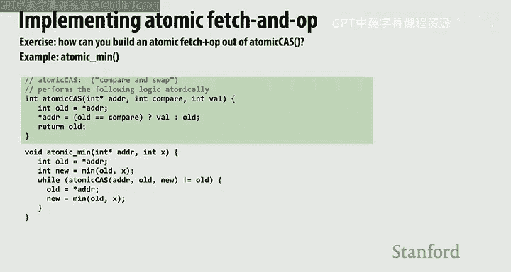
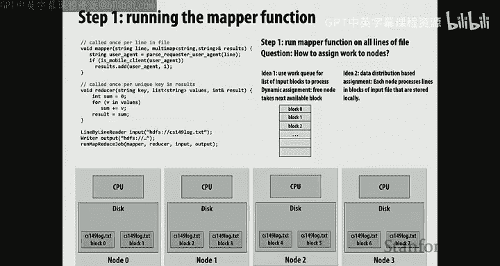

# 斯坦福大学《并行计算｜Stanford CS149 I Parallel Computing 2023》中英字幕（gpt-4 - P14：Lecture 14 - Midterm Review.zh_en - GPT中英字幕课程资源 - BV1Y5V5zjEsX

Any， any questions about logistics first。

ok。So， I mean， I think there's some broad themes of the course， right。

 So one broad themes of the course is kind of lecture 1，2，3。

 Do you understand multi core architecture。 And you better believe that we're gonna ask you something about。

 do you understand that。 So that's a topic we can go over today。

 Another major theme is just general tactics for optimizing parallel programs。 Now。

 most of that stuff is stuff that you kind of get in your programming assignment and it' just sort of like。

 you know， you just kind of figure it out。 So in general， when students come into my office hours。

 we don't spend as much time on that before the exam， I'm like。

 if I give you a program it has workload imbal， like try and identify it。

The other set of optimizations typically are you have a program that might have a very bad cash performance。

 can you improve the order of some loops or something like that to improve the cash performance？

Then we talked a little bit about what else do we talk about， so we talked about。GPU architecture。

 which。First of all， you should think of as just like everything from the first three lectures。

 Just you had it again。 And it's not no surprise that GPSUs work the same way。

I'd like you to understand the basics of the Kupa programming model in that there's an organization in the thread blocks。

 There are threads in those thread blocks， but it's something you're presumably well acquainted with after the third programming assignment。

嗯。We had a lecture on deep neural networks。 Now the specifics of any deep neural network are not anything that you need to care about。

 but what was like maybe the two or three main concepts from the deep neural networks lecture。

 One was cash locality really matters。 So we talked about blocking。

And the other stuff was kind of all specialized hardware and things like that。

 We'll spend more time on that。 And in the course。 So I think that's more of a finals topic than anything else。

 we talked about data parallel thinking。 So there's the possibility， you know。

 it's fair game for me to ask you to go through a data parallel thinking exercise， You know。

 that reinforces were you the one on your programming team that actually did find repeat。

 So did you delegate that to your partner。 And now it shows So。

 and then we talked about the last lecture I gave was fine grain locking。😊。

And we talked about compare swap and implementing some locks。

 We talked about the relationship of that to how cache coherence works。

 some interesting relationship。 And we talked about using locks and like a fine grain locking setting。

 And I've given you some practice problems on that。 I can tell you thats at the midterm level。

 the fine grain locking practice problems will be simpler。

 Like probably nothing more sophisticated if， if I give you one on maybe a linked list or something like that。

 But， you know， you see some practice problems on hash tables and graphs and trees and other stuff。

 I'd like you to have a little bit more time to wrestle with that before I think it's reasonable for me to ask you。

😊，A tough question。 So in light of that。And then， of course。

 Kunlei definitely talked about the M S I protocol and what cache coherence means and the main ideas behind that。

 And we talked about the idea of relaxed memory consistency， which is even though a program。

 a thread might write X and then read Y。😊，Other processors might see those ri or reads in different orders。

 and there's some interesting implications of that。go。So in light of that。

 I'm happy to go over anything。And so I think those that raise their hand and vote with their vote quickly will get more topics of their coverage。

 otherwise I can start making some topics up， but it may not be well。 So sir。

 you are the first to raise your hand。should we briefly touched on block programming yeah， I mean。

 obviously anything that we did not stress in class， I'm not going to bang you with。Yeah。Okay。

 so we talked about this idea of compare and swap。 This is something I would like you to know。

So up until this point in the class。We。Basically did all of our synchronization in two ways。

We said that there were locks。And what does a lock in， or in other words。

 what does mutual exclusion mean。Question for the class， yeah。One is only run by one dread at a time。

 And this is a really important detail。 Mutual exclusion means， as was just said。

 that only one thread，1 actor， one worker， whatever。

 is allowed in a particular section of code at one time。

 which means that if I'm in that section of code， all of you are prevented from running it。Okay。

And an atomic operation is basically of that mentality， right。

 because an atomic operation says is usually used on a read modify right。

 And it says that if I am modifying reading modifying this variable。

 nobody else is reading and modifying this variable。😊。

And compare swap is is one form of an atomic operation。 It says I'm going to， it's a read。

 modify or really read， compare， right。It says， I'm going to read the value of this variable。

 And if it has a particular value， if it has， in this case， the value given by the argument compare。

I'm going write this new value to that position。 Otherwise。

 I'm essentially going write the old value to the position and leave it unchanged。

 That's an atomic operation。 It's all the heart， whatever hardware platform you are running on。

 If you call compare and swap， it will guarantee that that is runatomically。

 That's what you can take as a given。😊，And then I asked。we。

 we talked about given atomic comparison swap。How can we implement an atomic min operation？

So one way we could think about the atomic man operation as the hardware just gives me a new primitive。

Atomic men。 And it ensures mutual exclusion because atomic is like。

 if I'm doing a min on this variable， it's gonna make sure that no other threads or cores can read to write to it。

But look how I implement。 you know， that's a little bit。 You know， that's not how we design systems。

 We don't build a bunch of new primitives for every single thing that we want to do。

 We like to have one primitive that's rock solid and maybe fast and use it in a variety of context。

So look at this atomic min operation and let's go over the philosophy of what happens。

 So what does men require， Men requires me reading the value for memory。

Checking if the value for memory is less than the new value than I'm trying to min with it。

 And if my value is smaller。We need to update the value of memory into something smaller， right。

 And that all has to be atomic。Now， first of all， I want you to make sure you can confirm to yourself。

That， if。You could do this easily without comparing swap if I gave you a lock。

You would take the lock。 You would read the value。 You would check to see if it was smaller。

 You would potentially update the value， and then you would unlock。

 And that would be absolutely correct。And it would ensure mutual exclusion。 Only one。

1 thread is trying to do the atomic men at once。So look。

 can someone describe to me what this code is doing。

 It's not ensuring mutual exclusion on the entire men operation。It's definitely not true。

Different threads can have read that value from memory and be checking if their value is less than it at the same time。

啊。If like if you look at the predicate upon which the main conclusion was reached is ensuring that that predicate is still valid when it writes that。

Right， so the idea is saying， if I read the value from memory。

 then I start doing whatever work I need to do。 In this case， it's computing the min of something。

 But maybe it was like atomic。Test primity or something like， you know。

 that probably wouldn't work because I'd return a bull， But， but anyways， But， but let's say it's。

's a more expensive operation Then I have to atomically perform some math。

 And then I write the value back to。I do my work。 In this case， I do the work。

 which is to take the men of the old value and the value that I have。And then I go back and I say。

 all right。If the value in memory is still the value that it was when I got started。I can be assured。

That no one else has come in， or if they've come in， they at least haven't updated the min value。

 Okay， and that's what the atomic cast does。 It says if the value in this address is still the same as old。

 please update it to new。And I know if that is true because atomic cache returns old。

 And so I check to see if the old， if it's still sorry， it returns the the value in memory。

 And if that's old， that's the check。Okay， so let's think about this。 Like。

 will that atomic comparison swap succeed if while I was trying to do my atomic men。You。

 as another thread， came in， read the value， checked it and decided that you didn't need to update it because your value was too large。

My atomic men succeeds。 So what happened here is there's no mutual exclusion。

 We're both running at the same time in， in so called this important， synchronized section。

But unless are both of our actions create a situation where synchronization is needed。We can proceed。

 In other words， we are speculating。We're hoping that we're not going to conflict。

And we're just going to go ahead。And then the last second， before I do my right。

I'm going to go check to see if that assumption was true。And if it's true。

 all the work I did is great。😊，And I move on， if it's false， what's the cost of this。

I have to do it again。 And all the work that I did on that old value is potentially wasted。

 So what if this function was not men。But with something really expensive， like， you know。

 compute some exponent on that value and then store the exponent value backward。 Then I've done work。

 And I should， I just got to throw it out。 essentially， you know， like I， I essentially。

 every time I go through this wild loop， I throw out my min work that I did， and I do it again。

So this lock free thinking is more like， hey， I need to make sure that I give the appearance。

That I get the same results as mutual exclusion， but I'm actually not enforcing mutual exclusion。

And that's the big mental difference。 And so what you're gonna to see after Thanksgiving is actually。

 Konley is gonna to give a bunch of lectures。 And two of them are actually going be about the idea of transactional memory。

 which kind of extends this idea to an arbitrary function， writing to many variables。

 So you just write your function。 It may read and write a bunch of variables and the system figures out if any of those reads and writes conflict with another processors reads and writes and will actually abort and back one of the processors out。

😊，Okay， that's the level that I'd like you to know lock free for tomorrow's assessment。

And later in the lecture， if you're interested， I show you how to implement lock free stacks and stuff like that。

 Like a lock free linked list is given in some parallel competing classes。

 It would be complicated enough to get right that it would take me the entire lecture would only be insert and delete on a lock free link list。

 So I would not ask you how to do a lock free insertion and deletion on an exam， for example。

 because it's actually incredibly tricky to get right。😊。

I'm not sure but I could do it off the top of my head on the exam。Yeah。

Could you say that block free program like leads to maybe a higher risk of？嗯。Well， I mean。

 there's nothing in this implementation。 It's good。 So what's， first of all。

 what's the idea of starvation， Starvation is that the system is making progress。

 Some threads making progress， But for whatever reason， one thread does not。

 like the one thread never succeeds here， right。And there's nothing in this provision in this implementation to。

 to ensure fairness amongst the threads。 But if you just had atomic lock and unlock implemented like we did last time。

With the exception of that ticket lock example， there's also no provision of fairness。

 So lock free versus， you know， mutual exclusion is not really。 It's orthogonal from， from fairness。

 I could do something here which says after I've iterated through this loop， if I fail。

Maybe I should sleep。You know， or something like that。 I could do like an exponential back off here。

 just like I could do an exponential back off in a lock。对。Actually， did I miss anybody？Yeah。

 go ahead。 look at here。 is there any expert。I heard that's caused and cold come。

Like regardless of whether， well， let's talk about it。What is the overhead of atomic cast？

Does that just feel like good？So， first of all， let's think about it in terms of a cash coherence protocol。

 So， first of all， actually， how would you implement atomic ca if you didn't have cash coherence。

But it's atomic。 How do you even implement。呵。😊，It's not just a read。 It's a read and a write。

You'd have to have some special provision in your system that kind of could say this is a current atomic operation on this。

 this address。 And so no other core can access this address。 right， You basically build like。

 a simple version of cache coherence for like a single address or something like that。 So。

 but if you did have cache coherence。😊，What is the， the， the cost of， of a cath。I mean。

 it's certainly a bus read X。 So it's a right， even if it fails， it's gotta be a right。

 And that's expensive， right， And it's also a， yeah， yeah， basically， it would be。

 and it's not just a bus read X。It's a bus read X that。You read the value。

 and then the cache coherence protocol cannot let that line be ripped away。By another processor。

 until。This comparison and potential right has happened in the same way that the cache coherence protocol。

 if you call bus rex， Bu rex puts the data in your cache line。

 and it's also kind of assumed that that processor is actually gonna execute its right before it gets ripped away。

Becauseuse if you didn't guarantee that， you might get into live lock situation of two processors are just constantly bus read X。

 bus read X。 And then they， they the line gets ripped away before they actually do the right。

 And so they're both sitting there on the same instruction just continuously。

 So you should think about it as once I do， once I get the line in the rightable state here。

 there needs to be a comparison with another value and a right。So the cache logic has to， you know。

 the processor just has to be a little bit more complex for that。O。New topic， any other questions。

 Well， here， let's go here and then here， yeah。找人。Back into a couple time arguing we could go over like map use from distributed data parallel yeah。

 absolutely let's see， let me cut this off。And what specific is the question？嗯， so。

Run map would use like implementation， the job with like a bunch diagraming have the key values and other。

You talk about map reduceuce itself， right。They kind of looked a little bit like this。Yeah。

Let just throw on。 Okay， so。In all of these programming systems， the first thing to think about is。

 you know， kind of what is my API and what is the meaning。Of the API functions。 And in Mareduce。

 there actually is only two。 So the history of this。

 And I won't spend too much time on the history is Mareduce was a very simple paper that came out of Google。

 And I can't remember what it was。 It was probably like the early 2000s。 This was before Spar。

 before a lot of， and the Google folks were saying that there's a lot of jobs that have to run at Google on an insane amount of data。

😊，And they is like， well， to handle an insane amount of data， like our entire index of the web。

 we've actually built big T。 We've actually built this shared file system。Right， so basically。

 all the data in the world is in this file system， and the file system is distributed across a ton of computers。

And they basically had a bunch of applications， like you can just imagine if you're like Devops or something。

 You have a bunch of applications that are kind of data mining stuff on， on this big database。

 So the canonical example here would be like mining through a bunch of Web logs or something like that。

 Like， so imagine you just had a huge file， terabytes of text and every line in the file was。😊。

It was like a log from Apache， excuse me。Okay， so there's two function calls， right。

 The first function call was called map。 And it was called map because it was inspired by data parallel map。

 And the second function call was called reduce， which was inspired by reduce。

 But they're very different than the a little bit different than the definitions that I gave you in the data parallel thinking lecture。

😊，Map is the following。 Let's say we're going a map in this case， it was right， yeah。It was。

We're gonna iterate over all lines of all files。 Imagine youd have this just gigantic terabyte file with a ton of lines in it。

 and different pieces of that file were just spread across different machines。And so before， like。

 if you were a programmer at Google， you had to like somehow like get the data from the machine。

 bring it in and do a bunch of stuff。 right， Like it was just complicated becauseuse your files were spread out all over the machine。

So map just says for every line in the file in this case， or for everything。

I want you to run this function， F。Just like map。 Okay now in map produce specifically。

 the output of map， you know， if the input is like a line of the file。

 the output is not just like some arbitrary type T， but is actually a key value pair。Okay。

 so in this case， if I remember the example correctly， the， the input was a string。

 a line in the file。 and then the F， the， the function that was mapped onto all the lines of the file for every line in every file basically produced a key value pair。

 And in this case， the key was like the user agent， the browser。

And the value in this case is actually just the number one。

But you could actually imagine like the key value pairs were like browser。

 error message or something like that。 So you produce keys and values。

And then there's some magic that happens。 And this is where。

 you know mapp producedduce was really clever in that so much simplicity was able to work for a lot of things or really janky in that this is very hard coded is that the system then takes all of those key value pairs。

 Now， keep in mind that that map function can run across all of the machines。

 If your file is distributed across 1000 machines。😊，Well。

 it'll just run that map function on the lines of the file。

 on the machine that already holds the file。 so the data doesn't move。

And now comes the big data communication part。Every little， you。

 every imvocation of F produces a key in of value。And then what Maproduce says is hard coded by design in the API。

 We're going to organize all of the tus that have the same key。Into a file。

So I have different files now for all of the different keys。

And that file is just a list of all the values that match that key。

 So that's where the data just moved everywhere。 It's like a big resort。 In spark。

 this would be called。Group by key or shuffle。 Yeah， so map produces keys and values。

And they get shuffled all。 and they're reorganized。 Here's all the data for this key。

 Here's all the data for that key。 Here's all the data for that key。

 And because they had a shared file system。 They already had it built。

They actually stored this information in files。And so your parallel file system was exactly the transport mechanism to get all this data shuffling around。

Okay。Okay， then you have reduce。And reduce takes us arguments the key and a list of values and produce as a result。

 So the reduce function is actually mapped onto all of the unique keys。😊。

So the reduced function gets as input。 the key that it's working on。 Plus。

 the list of values that were associated that key。Essential， the contents of a file。

And now， at this point， it does whatever the heck it wants and produces a result。 And presumably。

 it was called reduce because in this case， it takes all of those values with the same key。

 And in this case， just aggregated the the number of。

 the number of lines with that key and returned the result。

So the name reduce is actually not parallel reduce or anything like that。 It's actually map followed。

 It's actually map group by key map。😊，From a， you know。

 a map where every element of the map gets a list and returns it to a value。So that like， in。

 in modern parallel programming， that's what it is。 And so if youre like， that's pretty weird。

 I had all these computers。 My data was distributed amongst all the computers。Really， our。

 our way of communicating would be to write to the file system and then read it back in from another node。

That's what Spark said。 That's stupid。And said， oh， we， we should just like。Do all this in memory。

And that was the whole idea behind Spark。And do it with a proper set of data parallel operators。

 not just map Red group I key。Yeah。little more like why not produce required to this this was how it was implemented。

Like， the only thing you can write in map produceuce is map to produce a bunch of key values。

 Then the system does a group by key for you。 You have no， no question about that。

 And then you run another map， which is actually called the reducer function。

 which is map the reducer function onto all unique keys to produce one output per key。😊。

So the reducer function for a given key takes all of the values with that key and reduces it to something。

 But that's mapped over all keys。嗯。We have not。I think one reason why they're using。

Con to the original about the because at commercial however。

 this was really cheap at the time and was like my at beginning they don't be about like the latency because the demand data is not that huge to that to my now like。

The original Google files system imagination money that no refuge。It's December， it's this。

It I can single a point of view there。 so so the comment here was about some of the motivations of map producing。

 I wasn't there。 so， you know， I can't speak authoritatively at all about it。

 But there was comments about， oh， like the disc latency wasn't so bad。 But but first of all。

 that gives me a teaching opportunity。 let's first think about this is。

 am I worried about going to disk because of latency。I'm not worried about disc latency at all。

 Why am I not worried about disc latency。Why am I a heck of a lot more worried about disk bandwidth？

😡，自看到。I care about throughput， but latency can impact throughput， right， Like。

 if I do one operation and then wait for a long time and then do the next operation。

 latency can definitely impact throughput。 In this case， I'm only worried about throughput， though。

 get you have a ton of node all trying to write back to this。 like that's a huge bottleneck。Right。

 but first of all， that's why I， that's why definitely I care about bandwidth。

 But I guess my one thing I wantan to stress here is why do I not care about latency。

Can you just hide this is massively parallel， right， There's billions of lines in a file。

 If I have to write a key value pair out， I send the write out and I go start working on something else or in the reduced phase。

 if I'm reducing over all the different keys， I start loading the data for the next key now。

 while I'm working on this key。 So all of our ideas of multi threadreading。

 whenever you have massive parallelism。😊，B latency can be hidden。

 You care about bandwidth and throughput。 So the real problem is that in between these phases of computation。

 the entire data set， A terabytes of data is read from disk and put back on disk and then read back in。

Right， and that's， that's true， even if like。The group by key doesn't really do much at all。 Like。

 it's all narrow dependencies。And so people at the time were like， wow。

 I can write code in like 10 lines of code that use 10 machines。Like， there's no， like。

 I get fault tolerance。 I get this perilism。 It's all handled in those two abstractions。 And the。

 you know， some of the folks that did Spark。 And there's this paper that I have in my lecture slides about or in Kumley's lecture slides now。

 I guess about this paper that somebody wrote that said， yeah。

 but the applications that you like people were like， oh， we can do。

 we can do everything in spark and Mareuce。😊，Because it's so parallel， and so awesome。

But so low bandwidth。And then， some folks。Ppped open a laptop。And said。

 you're using 5000 nodes in a sparkar or map reduced cluster to process a data set that's like 500 GB or something like that。

500 GB fits in memory in my laptop。😊，And they showed that one core of a laptop could outperform a 5000 node S cluster just because people were getting enamored with parallelism and forgetting about locality in bandwidthla。

嗯。What kind of laptop makes 500 to get？I think the actual experiment was， was they。😊，It was a laptop。

 Actually， I could go break it up。 I'll send it is， is they streamed it。

So they streamed it off disk and showed that instead of going back out to disk every time。

 just keep a chunk in memory and then do five iterations。 And then you can。

 you can keep up with a smart cluster。 Another version of it would be these days in 2023。

 it would be for 3 bucks an hour。 I can go get a machine on A W S with 512 GB on memory。

 And most of us， most of the time are not working on problems that are exceeding what you can buy for pennies。

😊，And so it makes a lot more sense to think about locality。

 and that and maybe scale to 4  TB size machines instead of trying to make your code robust default fault tolerance and failure on 10000 nodes in the cluster。

There's a great article by Amazon Web streaming， the video folks。

 like a prime video where so some of you may have heard of like Amazon Lambdas。😊。

So Amazon Lambdas is like you just give them a function。 sayy， hey， like whenever。

 whenever I need to run this function， I'll let you know and run it for me。

 I don't want to think about servers and stuff like that。

 So the idea is to do like a computation like， you know， maybe a second or so less。

 It's great because if like， I have a website and I wanted to always be running and nobody ever comes。

 I don't pay a dime if nobody's coming。😊，And if people， if， if people burst。

 it's really great because like， they'll just execute all of those parallel functions for all these requests。

 And I don't have to worry about scaling。 even though the cost of those functions is。

 is actually quite high。 Okay， so prime video built their whole system out of these microservice and Lambdas。

 Like it was like， here's a chunk of a little chunk of video。

 go do it with a Lambda and stuff like that。 And， and this is Amazon who's trying to sell the Lambda service。

 And their prime video team has this great blog post from like a year and a half ago。

 which says we built a whole system on Amazon Lambda Sc out massively。😊。

And now we've returned it back to a few small servers because of locality and other things。

 And so they said they're 10 times more cost efficient with a small number of big servers than they are with thousands of tiny servers because communication just bites you over and over and over in any system。

 Yeah， they still get the same level of performance。 Yeah， yeah， like like Io performance。

10 x lower cost。And that's similar to some of these observations with Spar。

 So these systems that are scale out。 There's one reason why you always want to。

 you want to think about scaling out if you believe that the data sets you're gonna to work on are gonna be so big that you have no chance of keeping them in memory anytime soon。

That's the reason why these systems are super valuable， right， Like。

 if I have a database of terabytes and terabytes of data。

 I have no hope of ever keeping that in one node。 so I should build fundamentally from day  one in terms of this data can't fit anywhere and let's scale out。

Okay， but I do want to get this back on topic。 So let's， let's move to another question that I yeah。

Question on the default MSI without like let's actually do a cash gohan1。

 I think that would be a good。I actually did it in my lock free lecture recently。

 So let's just pull up those slides。 So we started the lock free lecture。😊。

In terms of this MSI protocol。Let me go ahead and pop it up。 Now， on the exam。 Well， first of all。

 it's open notes。 And second of all， if we've ever asked you to do anything with the M I protocol。

 I've given you this diagram on the exam。 So memorizing the diagram probably not necessary。

 But in general， like it's hard for you to answer a question without that diagram fully in your head。

 So they're kind of the same， right， Like if you're learning the state transitions often。 So。

 so should we just go over it or。这说数据。Okay， we were saying how it was like a bus freex。

 but I thought。就语音好。Just the default MSI has to do the busary and then the busary。Is that incorrect。

 That is incorrect。 So let's just say I have a， let me make sure I， I believe it's incorrect。

 So let's just say we have an address that is not in my cache。 So if it's not in my cache。

 that address is conceptually in what state。It's invalid。 Now， keep in mind， like I have a cache。

 and every line in the cache says this is the current address。 So it's not like the cache has。

 you know， a bit for invalid on all possible addresses。 just if it's not in the cache， it's invalid。

So then I do a read。And if I do a read， I will read it into the shared state。Correct。And then。

 let's say I want to write to it。 If nobody else has written readdit。

It can be in the modified state now。 Okay， so what is the question。The question was like。

That seems like a two stage process。 It is a two stage process。 So for atomic cast。

 It's worth reading and then writing， is it that two stage Absolutely not。

 That's why I'm saying it's a right bus transaction， right， because think of what can happen here。

 Let's say we we don't implement Cas atomically。The processor will elevate to the shared state if it's not atomic。

Some other processor can now do whatever it wants， which might， it might generate bus traffic。

 It might write to the value。 It might read from the value。 and it will do its thing。

 And then when I do the right， perhaps it's still in shared or or not。 And it will then get elevated。

 So that's why the nature of ca or test and set or any of these things being atomic means you need to think about them from the performance protocol as a right。

Iregardless of whether the variable is actually updated by the transaction， right， So it would。

 if I wanted it to， to cast a variable， it's gonna go from I all the way to M right at once。

Otherwise， I would need special other logic to， to ensure the adimity of that operation。

In light of M I， this is something we did last time。 Would you like to go through a sequence。No。

 are there any higher priority items。 I see some yeses。Yes， okay。 seems to be general。 Okay。

 so this is the same sequence as last time。 I mean， I。

 I think it's we didn't even do the whole thing last time。 Let's go ahead and just do it。Okay。

 and I think this actually makes sense if we have like， like， I just。

Physically feeling it is if someone wants to come up here and be the other or two。

 if we have two caches， it can be very helpful。So let's just do it。 Yeah， I have somebody else right。

 you know， come here。😊，I need， two folks。If you're sleeping， you need some energy。

It's like the first day of class。 So you're gonna be cash 1。 nice。 And I need cash。

 I can be cash 2 or somebody else can be cash 2。😊，Oh， we got cash too， why not， Okay， so here we go。

And， and this is what I wantanna。Nice。はは。😊，You' gotta be about 6 feet tall to be a cache in this class。

That's why I'm not volunteering。 Okay， so， so here's the sequence， which you can look at it。

 So let's say that just to keep you guys in the same city。 So let's have U B 0 and U B 1。

 I'm forgetting names。 sorry I forget。😊，这以。Cash 0 and cache 1。 And let's get started here。

 And what I want you to communicate like the the protocol。

 And then you can write on the board like the state that your line is in， right。

 So you can write on the board something like， you know， I have X in the shared state。😊，Okay。

 so at the moment， you get nobody has anything in their cash。 So you have nothing。Okay。

 and then so let's just say the first thing happens is you say you want to load。 I havet， not yet。

 not yet。 You actually have to say， I want to load I want to load。And now you have to acknowledge。

And and once you get the acknowledgement， you're like， oh， that's cool。

 I know that nobody's writing to it。 So now I can put it in the shared states。

 Let's go ahead and write X and shared there。😊，对。All right。

 so we got that acknowledgement and then again。You load X。So what do you do。You don't to do anything。

 right and that's an important detail。😡，There's not even a message that has to be sent。

 Why does a message not need to be sent。We have by the nature of cash 0。

 having it in the shared state， we are guarantee。Ted that everybody else might have it in the shared state。

 but they certainly don't have it in the modified state。 And it's okay to continue to read。

 So nothing changes and we're good。 Okay， so now you need to write。对啊。But want。Okay。😀Yeah。It対人じなぜ。

Yeah， so youre， you're gonna do nothing。 And why do you shrug this off。

You don't even have in the cash。 You can be like， look， do whatever the heck you want。 Like。

 I'm not doing anything。 So what are you gonna do in your cash now。😡。

We're gonna move from the S to the M state。And that M state means now that cash 0 is guaranteed that no other cache。

Has the value。 So you can proceed with your right。 And in this case， actually。

 let's go ahead and write the value。 You just updated the value。 So it's X and M and has the value 1。

And so if I'm like the third party， you know， the under6 foot memory system。You know， like there's。

There's a value of X and Y out here in memory。And what's the value of x？It's actually still 0。

It's still。Okay， now let's keep going。 So processors0， okay， so you're， you're being greedy。

 You're gonna write again。And you're going to update the value to2。Which， again， no update。

 no coherence traffic needs to happen because we're guaranteed that cash1 does not have the data。

 And there's no business telling somebody something that they don't need to know。Values 2， right。

 cool。 Okay， now processor 1， now you're gonna read it。Did I get that right。 Oh sorry， Yeah， yeah。

 yeah， you you're storing。 Okay， so now some interesting stuff that has to happen。い子。Yeah。So hold on。

 let's， let's sequence this very precisely。 You correctly said， hey， I need to read。How do you react？

あ生。Yeah， so you've got a flush。So in some sense， you send the value back to me。

And I update this with the value。2。You can， and then what do you do about your cash line？And then。

Yeah， okay， and it's invalid。 And And now now you have the value of this cache line。

 which you read from memory and it has the value 2。 And then you update its value to 3。

You see that whole sequence。 Now， if those of you are wondering。

 why did this have to go back to memory and then all the way back。

 why not just like sort of transfer the cache line from one cache to the other。

 Any modern system has this， So you studied MI。 You studied M E SI。

 And let's talk about that for a second。 Intel AMD modern cache coherent systems are actually five stage systems。

 and that fit stage is a special shared state， which basically says if someone else needs the line。

 and I have it， I will provide it to them without them having to go get it for memory。

 So it's just an obvious optimization that you're own。 But that optimization is not an MSI。Okay。

 where are we now？あ。I just readSo yeah， so your next one is you just read and that's that's。

 you know， like we're good and now。Processor0 wants to load。 I got tell you to write Yeah。

 so first of all， you go， I got it。 hold on。We got to do a flush。We flush the three。And now。あセ this。

Okay， so this is an interesting detail。 So you went to invalid。 Now， first of all， here's a question。

 this is not the M I protocol you executed。But is it co correct， as in like。

 is it correct cash coherence。It's absolutely correct。 Ca coherence。 Well。

 I want to make it clear that what you did is correct and that cash coherence is still working。

There's just an inefficiency。And the inefficiency is， you could have kept it in your shared state。

 Keep in mind that the fact that processor1 is invalid。This being in the shared state okay。

Becauseuse all this guarantees is that cash 0 can't write to the value。 right， So it was correct。

 just not a correct application of the MI protocol。 So， yes， if you were following MSI。

 you would have said， I'm gonna keep this around in shared state because there's no reason for me to drop it。

 And I might read from it again。 And if I read from it again。

 it'd be great not to have to go get it for memory。 right， so now we're in a nice shared state。 Okay。

 and now it might get a little repetitive。 Let's go ahead and do it anyways。 So we have store。

 So you are storing。😊，I exclusive access。没意。比间。Do you have it， Let's see， Let's look。

 look at your caches。 So， and actually， you， remember you're doing all of this without ever seeing the other caches data structures。

 How， Well， how do you know that he， that another cache may have it。😊。

With your only your own data structures。 and I'm， I'm blocking everything。 right。 Yeah， look here。

 Yeah， since shared。 So you have no guarantees on perhaps somebody has it。 right？ So that's。

 that's how you know what you can and cannot do。 But in this case， there's a store。 So you have to。

Oh。好论。Notify everybody first， causeuse now， keep in mind， notice， like， what happens if。

 if cash1 updated that value and changed its state before notifying cash 1。😊，Right。

 like it may have proceeded with the right processor  one。

 if it doesn't know that it needs to tear down and invalid might continue with reads。

 And that read may be potentially out of date。 right， So before you update that variable。

 you have to get exclusive access to get exclusive access。 You have to say， I intend to write。

 Everybody else playing all the other caches playing the game and go， oh， okay。

 I gotta get rid of this thing， go ahead。 and now you can perform your right。😊，Good。

And then was you about that to memory now or I guess？Well， let's， let's talk about it。

 So there's a difference between what the MI protocol is and what would be correct to do。

 but potentially inefficient。So we didn't write to memory after the write last time。

And we didn't do that because why are you guaranteed to get the updated value whenever you read in the future。

Let's think about it。 So what's the process for reading in the future， And， in fact， actually。

 the next line is you reading。 So let's just go ahead。The next line is processor 1 loads X。

 So you're reading。Memory is out of date with  three。 You have the invalid cache line。 correct。

 So you state your intent to read。一个op。And the memory， yeah， you're gonna flush to me。

 The other thing we're not writing down is whether or not it's dirty。

 But I guess if it's in the M state， it's dirty。 So it was it4。 Okay， yeah，4。 now you can get 4。有。

Mmhmm。And we're good。Okay。Now， there's one more detail here。

 This is the first time that it's a load of y and not X。 So both of you have y X in the S state。

 And now there's a load of y。But you have to say you have to learn one and you shrug it off。Yeah。

 and you shrug it off because you don't have Y。 So just keep in mind that coherence is actually about that diagram or that that M I diagram is about keeping coherence between the same address。

 right， There's in instance there's another copy of this diagram。

 another state machine rolling around for any other address because， you know。

 there might be multiple values in cache。 in this case， like you're keeping Y and S and X and S。

 And then finally， when processor one goes to write Y。😊，Why did you modify why Mo why。

 you shrug it off because you don't care。 And then if you ever write why now you're gonna。

 you're gonna have to request it。 There'll be a tear down。 There'll be a flush of one。

And then so on and so on。 Exactly。 Okay， any， this is， this is the whole， So it's very important to。

 to think about of any change in state to my local cash。

Will result in shouting to all the other caches because the data structures of the other caches have state in them that allows those caches to make decisions about what they can and cannot do。

 And if my state changes， I got to tell everybody else。

How we tell everybody else is not something we talk about in this class。

 We talk about it as shouting as if it's a broadcast， but typically under the hood。

 it will be point to point messages and stuff like that。 like。

 and that's a different detail for another class。 Allright。

 thank you very much for your demonstration。 But any other questions on cash coherence， yes。😊。

 one cache has the data in a modified state， okay？Other guys wants we have to the data back to。

we try to great guys the more flex。So let's say that cash zero has the data in the modified state。

Cash one wants to write to it， and what's the question？

Like why does the data need to come from the memory。

 like why does the first processor need to flush the data back to memory and then。

Processor when gets it from memory that is processor video。Is your question。

 why does processor 0 not give the data to processor 1。 Well。

 that's what I was saying earlier in a more complicated cache coherence protocol。

 five state protocol。 It's called like Meive from Mo E E。 There's a fifth state。

 which says if you're trying to get data from memory。

And another cache has a up to date copy of the data。That cash will provide the data。But I。

 I do want to be， be， be clear about one thing。Remember， we're talking about cash lines here。

 even though we， we kind of assumed in that exercise that the cache line size was one value。

So when we say load X， we really mean the cache line。Containing X。So let's say x is here。

And I write 4 to X。Keep in mind that there's data here。In the rest of the cache line。

 that is untouched。So the reason why I write it back out the cache line all the way back out to memory is that I need to update that whole cache line。

Like， I can't just send4 because I don't know what's dirty in this cache line at all。

 So just make sure， even though that demo was in terms of single single values。

 the information that's being flushed or communicated in a more advanced protocol our entire cache lines。

Okay， you would have to have a more advanced cache that was gonna track。

 track dirtiness at the bit or at the， the bite level， yeah。So you just是 mentioned。

see the new study is actually the pizza state， which can allow us cashing transferred for。Of course。

 does that take care of this situation？mean， what that does is avoids the flush。It avoids the flush。

So if I'm a cash and I have the line in the shared state that you need， if you read it。

 I'll just give you the line。 and now we both have it shared。

If I have a line in the modified state and you need it to read。

I will give it to you and flush it to memory and will both be shared。Right。

 if I have it in the modified state and you want it in the modified state。

 I can actually just give it to you without flushing。 and you have it in the modified state。

 And now you're responsible for flushing it。对。Y， so that's。

 that's more advanced details that we don't。 Okay， so what about this， this messy。

 this four stage protocol， This might be a good check your understanding。 Do we have。

I don't know if I have Kes slides， so hold on one second。So in M SI。

 you still have the same modified， shared and invalid states as before。

 but there's this little exclusive state。Did we talk about what that？ Yeah， we did， right， And what。

 what's the advantage of this fourth state。 And let's think about a particular use case where you read a value。

 And then at some point later， you write to it。 Very common case in computer science， yeah。Correct。

 so let's think about M S I in the case where a thread reads and then writes。 If a thread reads。

 I bring it in as a shared state。All I know at this point is that there may be other processors with the data。

 So if I go to write to it， I also have to speak up and say， hey， I'm gonna write now。Okay。

M E S I says， when you load data。When I say， hey， I want to load the data。You。

 you look at what the other person says。 and you， if the other person says， oh， yeah。

 I've got that in the shared state， you go， okay， I should have it in the shared state， too。

 because I know that it's possible for other people to have the data。

If nobody says I have it in the shared state， if everybody goes， I don't care why you telling me。

 I can load it in the E state， which says that it's not dirty。 I haven't written to it。

 but I'm guaranteed that nobody else has it。And so if I ever want to write to it without telling anybody。

 I can just flip from E to M。Becauseuse nobody else has it。

 So nobody cares about what I have to say about that one。Yeah，我。

So if I have it in the exclusive state and， well， I haven't finished the diagram。 Sorry。

 if I have it in the exclusive state and I hear someone else's read， what do I do。

I dropped a shared and hope that should be on the diagram now。 I still haven't finished the diagram。

 Sorry， Okay， so if I'm in the exclusive state and I see a bus read。I don't do anything。

 And I drop to S。这这好。The cash is ready the value can you never go back to school6。

He never so offs with herers Miller。And you can see it from this diagram and that there is no transition。

Right， what it would take to do that， Let's talk about， Let's design a cache coherence protocol。

 That's better。 What would， what would it take to be able to elevate from S to E。ちう。Make invalid。

You'd have to tell all the other processors to go invalid， so you would have it in your shared state。

And then every time you wrote to it， you' would have to tell all the other processors， hey。

 I'm writing again。You have it still？So that kind of almost defeats the value of the shared state。

 But what we could do is that whenever any processor went to invalid。Normally。

 when you go to invalid， it's in reaction to other things。Let's let you go to invalid， because like。

You got evicted from your cash， not based on anybody else。

 You could tell everybody else I'm going to invalid。

 And that could be a trigger for all the caches to report。 do I have it in the shared state or not？

 And if only one cash had it in the shared state， then you would know you could elevate to E。

Just be a more advanced cash coherence protocol。Yeah。哦。that x not in modified state。

 but if when we loaded Y Xs already in a modified state。

 would we be required to first flush X This is a great question。

 I want to make sure everybody understands it。 So the question was we have X in some state。

 Let's say it's the modified state in the cache line X。If the cache line Y is loaded into the cache。

Does that change the behavior of X in any way， no。Right， because they're just。

 their different coherence is about a state machine for every address in the system。

And different addresses do not interact。The only way they interact is nothing to do with parallelism is maybe bringing cash line Y into the cache cause an eviction of cache line X。

 And then that would be something that caused X to invalidate。And then， it would have to flush。

But that's unrelated to the discussion of cash coherence。 That's just a normal cache behavior， right。

 okay。All right。If we have like an example where our cash is cool and then we're going to do like some operation。

 is that like a capability right back？YouYou do like a processor。SomethingAbs， like like， like。

 let's， let's say， and this is， we could talk about normal cash behavior， unrelated to coherence。

 So imagine that the cash you， you， and by the way， the cash is always full。

 but you read a new value， which means you're gonna have to kick out an existing value。

 you decide which one to kick out using whatever policy。 And if it is dirty， the process is。😊。

Right or or you， okay， So if it's dirty， it's already in the modified state。

 So the process will be flush the data and go to invalid and then bus read X on the new thing。

 or sorry， bus read on the new thing。会。No， because the other line is some other address。 And again。

 this is a， this is how we take this one address。 So from the perspective of this cache coherence diagram。

 you just would not initiate the bus read X on address X until all the appropriate room in the cache has been made to put X in your cache。

So there would be some other diagram for statewide that would now be moving from modified or shared to invalid。

 Yes， okay。So， your mentioned that this is state's making address per per cash flow。Okay。

 should we move on on a different topic or still， yeah。

 let's move on unless you had one last follow up。Oh， okay。

 so maybe shout out some different topicscause I think if we go an extended session。

 we could either get two more in or one more in。 So let's aggregate。 What are some topics。

Saigon scan， okay。Data parallel thinking， anything else。Kuta in general。

 you might need to be more specific than that。好的。How are wars organized onto a machine， Okay。

 and then consistency to solve the problem know secret sauce。 Just think about all。 I mean， okay。

 so one， okay， let me answer that one first， because I。

 I don't think doing a problem will be the best。 I think you're just doing it on your own will be best is one of the things in this class is very much a skill that we want you to have is think through what operation is running on a machine at what time Like。

 what's the schedule So you're like， oh， like this thread is running this instruction on this core when this thread is running this instruction on this core okay。

😊，So there was a practice problem if I remember correctly this week。

 which was instruction interleaings。 right， So we said， instruct， you know。

 let's say I just have a thread。T0。That does instruction  one，2， and3。

 And I have another thread T1 that does four，5， and6。Okay。

 so the only thing that's required is that T 1 better do one before， you know。

 better observe 1 than 2 than 3。 And T 1， maybe on a different processor or a different thread on the same core。

 has to do 4 then 5 and 6。If I put these into a timeline， there's nothing preventing， you know。

1 coming before，4，4 coming after 2，3 happening in here and so on and so on。

 We want you to be able to think through all the possibilities of what could happen and what the observed results would be。

Okay， so what I just did there kind of assumes sequential consistency， right。

 Like there's like some total order that that exists。 When we go to relax consistency。

 what can happen is there is not a possible way to put all six operations just on a timeline when you say the effects of the program are consistent with this being the order。

😊，That's what relaxed consistency is。 is like， if this is a right and this is a right， well。

 this processor clearly has to do one before two， because that's the program。But the values。

 those updates might。Appear in different orders to somebody else。 So that's。

 that's the whole concept。 There's not a lot of magic about it。 And it's different from coherence。😊。

Because here we're talking about the order of the effects of one and the effects of two operations to different addresses。

 Coherence is all about operations on the same address。 So they are orthogonal concepts completely。

 Okay， so segmented scan and a little bit of just coa mapping。Yes。啊。Even for relaxed consistency。

 we follow up the order。Its not always too ready。 you can reorder the andize， for example。

Let me be very precise about this。If we have one thread of control。Your compiler， your hardware。

 is broken。If you get results that are in the opposite order or that are not consistent with program order。

 So nothing about relaxed consistency can be visible if you only have one thread。Right。

 in the same way that superscalealar execution is broken。

If a processor decides to execute instructions out of order or in parallel and you get different results。

In a single thread。Ras consistency is saying if t 0 believes it sees right to X and then right to y。

If you read。If you， if you read a value in here， you would see the X done and the Y not done。

If you read a value here， you would see both of them done。

What relaxed consistency says is that if T1 ever reads X and Y。

It can observe if if you are relaxing right， right ordering， for example。

 T1 might see the value of y being updated before it sees the value of X being updated。Okay。

 and I want to be really clear that this is。Only something that when we're talking about the observation of another processor's rights。

 right， because if we're talking about my own rights and I compile a freaking program and it gives me an answer that's not consistent with C semantics。

 I throw out the computer and the compiler and say this is all broken， right。Exactly， so。

 so I want to be very clear about that。 And， and keep in mind that within a thread on the first day of class。

 I told you that instructions were reordered。 Superscalealar does that bunch of reasons done that。

 But you never， ever observe that they are ordereded。 So it's still。Completely in program order。

So it just kind of going。I would like to see if we can't go over， just in general possible。H。

The cat son on called the so。Like you just increased scope in the last 12 minutes here， considerably。

😊，so what are you asking？for example，But this way， it's extremely hard to even create questions that do much more than right right right。

 right reordering。 So， so theyre。😊，Extremely hard。So I think right， right reordering is a big one。

 So but basically， not not even right right， reorder。 Just think about if you have a right。

Think about the implications of moving reads or other rights above or below it。

RightI think that's a good， good guidance。 Like if we tell you。

 or it can be easy to just say everything is relaxed。

 Like like just no guarantees on anything other than program order。😊，Yeah， but。

 but the easiest questions to write are definitely right， right reordering。嗯。O， so呃。Oh， I see。

 like this is the data parallel lecture。 So there was a quick comment on segmented scan。Okay。

All I want you to know on segment and scan。 and you have it on the slide is the definition。

So segmented scan is just a scan。 Imagine that we sequentially。We had a list of lists。 or， you know。

 if I wanted to be more precise， a sequence of sequences。 So here's a sequence of two sequences。

 The first sequence is three elements， and the second sequence is five elements。Right。

Imagine we did a scan on the first three。The the first sequence。 What would we get。

Let's say it's a sum。 I say an exclusive sum。 So if it's an exclusive sum， we would get 0，1，1 plus 2。

3，3 plus 3，6。And then so we know what the scan is。Now。

 imagine that now I just do a scan on the next thing。And I'd get again，0，4，9，15，22，30。

So I just two scans。 So if you know scan， you know what the right answer should be for segmented scan。

Now， segment and scan algorithm that I gave you on the page。

Is a way to compute those two scans with O of n parallelism。

 where n is the total length of all the sub sequenceequences。

And that algorithm looks a little bit like this。 I visually described it like this。

 I put this in the lecture because I thought you might find it cool。

 What I want you to be able to do。 however， is， yes， if I gave you the definition。

 if I gave you the bottom half of this slide， and I asked you to use segmented scan in some higher level algorithm development。

 that is fair game。😊，But I won't be like， hey， you need to， you need to implement data parallel game。

Or if I， if I ask you to implement it， it's， it's gonna to be some very guided thing where the real principle is something else and not the seist scan。

Okay， so that was that。 And then kuda。 So let's， let's。

 let's try and let's see what we can do with kuta。Okay， so I hope you all remember from assignment 3。

That when you， and really， from your assignment  too， So in assignment 2。We have these bulk tasks。

 right。 So in some sense， you had a task system and the application sent you a command。

And the command was run this task。En time。Right， and then it can send you multiple commands。

 which said， okay， here's a new task that you need to run n times。

 but you can't do any of these until you're done with all these previous bulk launches。

 So Kuta is a bulk launch system， much like your， your tasking API。 It just kind of has。

 instead of the number N tasks。 It just kind of has two numbers in there。 It says。

 I want you to run n thread blocks。 And each thread block has T threads in it。

So it's the same bulk launch concept where you say， here is the number of thread blocks。

 And I think thread block and like kind of your task or an IS PCC task and a bit of correspondence。

And inside that task， you're gonna do parallel work using T threads。

So the fact that you can do this in 2D versus 3D versus 1 D is not significant。 right。

 It's just create this many thread blocks。And every thread block needs this many resources。

 It needs this much shared memory， and it needs this many threads。So in this setup。

The details of the program are not important， but we wrote a couda program that if I remember correctly yet。

 had1 28 threads per block and needed。I can't remember it needed like a little bit over 5。

 I think it needed like 5， it needed a little bit over 500512 B of storage。So in other words。

 if we have on every core of the GPU， every S M of the GPU。

 if we have execution context for 384 threads， how many thread blocks can we fit。What128， just。

 you know， you do the math。 We fit 2 or 3。 I can't remember we can fit we can fit 3。 Yeah。

 we can fit 3 thread blocks worth of threads。And if those thread blocks needed a little bit over one third of this shared memory。

 how many thread blocks can I fit from a storage perspective。Just two， right， So in this case。

 the number of thread blocks that we can get onto this processor at one time is actually limited by our shared memory。

But， for example， if you use0 shared memory， I can fit3。So I say that this ex。

 there's an execution context for 384 coupa threads here。 And so the Nviddia scheduler， you know。

 their version of your assignment  too is gonna say， alright， here's some， here's some work。

I want you to run 1000 thread blocks worth of this program。And at this point。

 it just starts handing it to its worker core right and so or really it it's worker execution context on its course。

 And so step one is to say， well， look， there's nothing allocated right now。

 Let's get the first thread block right on core0 and we're going give it 128 threads worth of execution contexts。

And we're gonna give it a little bit over a third，520 B of storage。

And there's still a lot more worker capability in this machine。

 So we're gonna sign the next thread block over here on core 1。 We're gonna sign now question。

 a good exam question would be， why did this scheduler， which was an implementation detail。

 But why is it a fairly sane decision。To put block 0 on core 0 and block 1 on core 1。それ。

If I were to put block 0 and block 1， both here， what is the performance implication of that。

 So remember， these are 128 threads。 These are 128 threads。 We have one core。 and that core in。

 in this case had a 32 wide Sim D capability。What's the problem with loading this up with a bunch of threads and leaving the other core idol。

有。may within that one because remember， these， these threads are interleaved onto these processing resources。

 So I'm having everybody that I'm creating， telling to do work。

 share the same resources while I have resources over there that are idle， exactly， exactly。😊，Okay。

 so I， I have more room。 I can fill up this chip， and this chip can simultaneously support four concurrent thread blocks。

Okay， and I cannot put further thread blocks on here because I'm out of resources。

So when a thread completes or sorry， when a thread block completes， just like in your assignment。

 when a task completes， that opens up the ability to put another task on the machine。

 So let's say we pull， let's say the first block completed first， which makes sense。

And the scheduler can fill that gap。Notice that the fact that all thread blogs have the same number of resources and the same allocations is useful for filling this gap。

 Otherwise， you have an allocation problem。 Okay， and we just continue with that， You know。

 just putting stuff on， putting stuff on until we're done。Okay。

 so that's the thread block scheduling part of kuta。

 Is there any question about warp scheduling part of ka。Or are you good there？Asstor West。

 why is it a single war？At a single clock。How many words。Okay， so， and I'm， Im， I'm gonna， there's。

 I want to preface thiscause this is recorded， and I don't wantan to be。嗯。呃。

Doced because I'm saying the wrong thing about modern Nvidia GP Ps。 But for most NviDdia GP。

 it's perfectly fine to think about it in the following way。😊，Is that the chip has a bank of A L Us。

 Now， this is not an Nvidia GPU。 I made this up。 My proxy Nvidia GPU here has 32 C As。

And the way it runs kupa threads is it takes 10 it takes 32 kuta threads， which is called one warp。

And it runs them。1 one instruction for each of those 32 coupa threads on this A L U and makes progress on the warp。

And then the next clock， it might choose a different orp。

So you can think about a warp's worth of execution as 32 coupa threads all doing the same thing at the same time and concurrently running on the。

 on the chip。Okay，Does it always the stress or what's not。嗯。I'm gonna answer the question was。

 does does the Nvidia GPU always choose threads from the warp in the same thread block， Off。

 Nvidia says nothing about their implementation， So I cannot definitively tell you do they do that or not。

 His， the answer about their implementation has been absolutely yes。

 The threads that are used to run at the same time are thread I Ds 0，1，2。

3 all the way to 32 mod  know， like thread I D mod 32，0 to 31。Now。

 this might be elite mode way to to finish up here。 But in the last minute。

 let's think about this way。 Nvidia has full flexibility。😊，By writing。

 by since you wrote things as threads， if they want to change thes with and cut the number of A L U by half。

 you would never know。Right， because you just created 128 threads。 You didn't think about warps。

 You didn't think about any of that stuff。So when you compile your thread block code。

 it's just a regular sequential scalar thread， and it happens to run as many as you ask for concurrently。

That's different from the implementation detail of Sdi instructions on a， on a machine。

 If we went next year and Intel produced a processor with like 64 wide sdi。You would go back to ISPC。

 You would change the gang size to 64。 You would recompile your code。

 and it would produce one thread with 64 wide vector instructions。

That's the one difference between GP Cd and CPU Cd in CPU C。

 it's the responsibility of the compiler to generate instructions that are exposed by the machine architecture。

 In GPU assembly， the compiler doesn't do nearly as much。

 it just generate sequential things and says like in your programming assignment。

 we're going to do thousands of them at once in group in block sizes of in this case，128。

 It's up to Nvidia to decide how it wants to run that。 His。

 it's taken all your threads in a thread block， Chopped them in the groups of consecutive 32 addresses and run those in parallel。

 These days， they actually do have the ability to rearrange things for you in order to try and discover better S coherence if you have divergence and if statements。

 The extent to which they can successfully do that is complete trade secret and and not something that's well documented。

