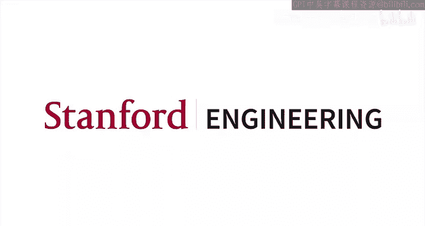
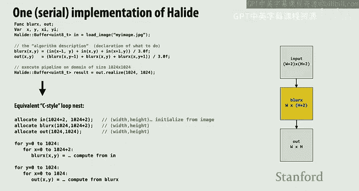
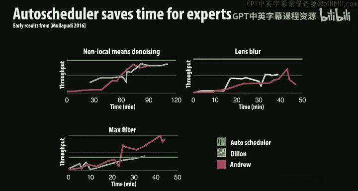

# 斯坦福大学《并行计算｜Stanford CS149 I Parallel Computing 2023》中英字幕（gpt-4 - P15：Lecture 15 - Domain Specific Programming Languages.zh_en - GPT中英字幕课程资源 - BV1Y5V5zjEsX

Well， I think the okay， so here's the layout for the rest of the class。 There's。

 there's two lectures right after Thanksgiving on transactional memory And those are real kind of heavyweight lectures。

 you know there will be exam problems on them or almost certainly the exam problems on them。

 the other three lectures that we have before now in the end of the quarter today's lecture on domain specific programming systems。

 And then in the last week， who talking more about specialized hardware。 you know。

 not as programmable processors and the energy efficiency of them。

 These other three lectures are a little bit more like we want you to know about them and be aware of them as you proceed further。

 but you know exam questions would be more conceptual and not like you know work this out or something like that。

 So here's。😊。

So I'll just get started， and。The systems we' describe today are actually pretty cool so the goal of what I'm trying to do today is two things One is so far in this class you have implemented code and what I consider to be fairly low levell programming systems essentially C++ you know kuda is basically that ISPC is basically that and more or less you've done everything。

😊，You know， like the one thing that you got that was really convenient was both IS PCC and Kuta basically took over the responsibility for generating S0 instructions for you At the very least。

 you don't have to worry about that。 But most of the rest of the major decisions were made by you。

 and that was， that was intentional。 You know you know。

 you now know how the threadpo might be implemented。 So when you call IS PCC tasks。

 you know exactly what they're doing and so on and so on。 So， so now we're gonna say， okay。

 you kind of know how you would implement。You know， things from scratch。

What are the higher level abstractions that would be good to present people that might be experts in a domain。

 but not the folks that have taken 149 or really are interested in implementing things。

 So I'm going to talk about that today and largely I'm going to talk about it through the context of two case studies。

 two examples。 both of these actually have some Stanford relation we're going to talk about the programming language that's used to author all of the image processing。

 the photo app in Google Android phones。 So every image that' or at least to my knowledge。

 at least a couple years ago， every image that went through Instagram was going through filters and processing from a language called Hyide and then there's this research language developed at Stanford called list which is it was a research language to be honest you probably never ever encounter it。

 but it's actually got some great examples of the value of highlel abstractions in it。

So that that's what we're going to talk about。 So that the premise here is that， you know。

 we haven't used all of these programming systems。 Some of them might be familiar to you， but。

If I am you know， if I'm trying to develop a high performance application。

 I need some pretty smart people to be able to optimize it。 You know， I need C 149 students。

 And in the grand scheme of programmers， C 1，49 students are pretty few and far between right And if you look at the range of performance that even CS 1。

49 students produce on the on their assignments really， really。

 really code optimizers are even fewer and far between So proof by assignments 1。

2 and3 and probably even proof by assignment 4 for sure。😊，And and throughout computer science。

 whether you're a systems person， whether you're a programming languages person or compilers person。

 there's kind of always been the sort of holy grail or this unicorn of characteristics of a programming language right like first of all you'd like。

😊，You'd like to be able to just productively express the program you want to write and in fact these days with LOMs know there's a lot of interest in that saying I want a program that adds a bunch of numbers that it spits out the Python code so you'd like to be able to go from an idea to a working correct program very quickly you want to be productive and many of you use Python as you're probably your most frequent language because it's a pretty productive programming language。

😊，And then you know some many you probably like a high performance programming language because these days machine learning。

 data science， big graph algorithms on terabyte size graphs， etc cetera， etc cetera。

 or image processing on 10 megapixel images， you're going to want performance because it's got to run on an iPhone it's got to run on a data center and then last。

😊，historically people said， well， programming language should be general。

 you should be able to write whatever program you want。

And there were these kind of three axes of rating the programming language and like you know what is the programming language that nails all of these that scores really high of these fronts and if you look at many widely used programming languages and really this has been changing over the last five five to10 years。

 but if you look at a lot of the long term ones， they kind of go on，😊，On some axis。

 right like if you're a web developer， you might write a lot of code in JavaScript。

 you write whatever you want in JavaScript， but you can hack some stuff up pretty quick and you can hack basically whatever you want。

 but it's not going to be that fast。Or if you're writing here in C plus plus or rust。

 and I'll even put Java Kuta in this category。 know， these are all different levels of performance。

 to be honest。 But you who you want again and you'd choose to use C or C plus plus that would be like this seems to be fast。

 I'm going write it in C， or it needs to be GPU accelerated。 I'm gonna write it in Kuta。😊。

And so a lot of the， the more successful languages were kind of。On these， these axes。

And so what I want to talk about today is this empty line here between productivity and performance。

 So we're interested in， yeah， I put Ruby down there as well in domain specific languages where we say。

 you know what， we care a lot about being productive。😊，Like for example， Pytorarch。

I want to be able to hack up a new neural network very quickly。 I want it to be extremely efficient。

 not just like parallel efficient， but if we're talking about PyTtorch。

 we're like we want to use GPUs or we want to use accelerated TPUs or something like that。

But I'm willing to give up the fact that I can kind of express anything I ever want right And so some of the examples here。

 you know， you probably have encountered a bunch of them， right。

 like Pytorch is not the language that you would use to build anything you want。

 It's a language that you use to express your tensor operations SQL， you know。

 very constrained language， but it's a great language for querying the database。

 And you don't think at all about how those queries are executed in parallel on a big database。

 you just hope oracle or Postgres does the right thing。

 you just say I'm looking for you know all records in my database where the first name is is fubar or something like that。

😊，Even something like Matla， I would fit put， put in this in this， this example。

 Anything else come to mind as， as things that you commonly use that you might sort of。

Cateorized as being similar in spirit to some of these things on the left， this left edge。じ。

G actually don't know for geospatial databases。 Yeah， Okay， so。

 so that's that's another database query language except it's it's centered around the notion of 2D space。

 Okay， yeah， so any kind of database query language kind of fits in the thing。 if you're in graphics。

 something like open G L and we're used to writing and fairly domain specific languages in graphics。

 these days， machine learning。 all of it is done and fairly And there's different levels。 You know。

 there's like pietorrch。 And then there's a whole bunch of things built on top of the pietorrch to make your life even easier if you want less and less flexibility。

😊，So that's kind of the idea of today is the thesis is and these days I think you're seeing the results of about five to1 years of emphasis on domain specific languages and if we go back about 10 years it was probably a little controversial to say。

 hey， like we're going to give up on the flexibility of CDC++ Java and we're going to force you all down a narrow path so this is the big promise。

😊，And and usually in this class， we actually give you this lecture after we've talked about specialized hardware。

 We haven't talked about specialized hardware yet。 But just keep in mind。

 like that that high performance is not just parallel， but it could be like using a TPU。

 It could be using an accelerator。 It could be using any of the five different processors that are in my Apple Watch。

 things like that。😊，All right， so you know here are some examples you pointed out a few a few to me already。

 I added a few more here。 so the idea is to write a program quickly。And write it once。

And I'm going to write it using primitives。That the compiler。

 the system knows about and it knows enough about what I mean by various primitives， like。

 for example， Pytorch knows what an N D tensor is， for example。

 SQL knows when you say select this row， it knows a lot about what selection means。

And it's going to leverage that knowledge。To give you the best possible implementation on whatever system you're running on。

So if I say select everything from this database。YouLike how is the data laid out。

 What is the algorithm， the index structure used is it a binary tree， is it a Be tree。

 think of all these decisions that go into implementing that database as the programmer， I just say。

 please give me a relation， give me a table that has all of the results of this filter。

And on different systems， that implementation could be very， very different。In Pytorrch。

 you're going to say something like， please take this tensor and pass it through this con layerair。

And if you're running on a GPU， that's going to be some coyN implementation。

 If you're running on Intel， it might be a completely different implementation。

 If you're running on a Google TPU， it could be a completely different implementation。So。

Let's just kind of go through some examples to think about some of the decisions that folks make when designing these domainspec sets of abstractions。

 And the first example I'm gonna give is is a little bit from like sort of my nick of the woods in graphics and image processing。

 and it's a language called haide， which is the language that's used in practice to implement the camera application on Google's Android phone。

 So if you have an Android phone and you take pictures， you are running haide code。

 I don't I'm not up to date， but as of like four or five years ago。

 if you uploaded photo a picture to Instagram and it went through an image processing filter many of those were running in haide code at Meow。

 So this is actually it's not a widely used language。

 but it's it's a language that's used by a bunch of people that care a lot about performance。

 And it was it had origins at Stanford， even though it was mainly developed at Mit and then later at Google。

So before we start talking about what are the primitives Heylight gives you？

We actually have to talk about what is the workload that people in this domain are trying to write。

So here's an example， and I'm curious in 30 seconds or less。😊，Can you tell me what this code does？

Any sense？国人。I it blurs an image which you can tell from the function name， yes。

 but how does it blur the image？Like what's the filter size？How is it paralyzed？How's it vectorized。

 it's pretty gnarly pretty gnarly and this is like you know if we were in the assignment one time frame and we replace MMM load 128。

 which is your MMX intrinsic so we changed that with like CS149 in trend you would have done this yourself you would have done this yourself now let me ask you a different question。

😊，What does this code do， this is C， this is regular C。

I'm going to give you the function name this time so you can't cheat。This is a convolution。

 I this is a 2D convolution for I give you an image， a 2D array， a matrix of pixels。

 in this case it's a monochrome image because there's not red， green and blue。

 it's just a single intensity per pixel and every output pixel at the same location is the average of all the surrounding neighboring pixels。

😊，So this is the for every output pixel loops。And then for every output pixel。

 please loop over the three by three block of neighboring pixels and average them together。

 add them all up， and then divide by or multiply by weights， and weights is one ninthth everywhere。

And back in the DN lecture， I told you if you ran this C++ code。

 you would blur an image and it look a little bit like this。😊，All right。

 so okay so here's that code and so here's my question to you， let's analyze it a little bit。

 what is the amount of work done per pixel？How many arithmetic ops？It's doing this again。

How many arithmetic ops per pixel？In other words。Look here。晓得。Floating point or arithmeticoffs。

There's basically one multiply here。And an ad。So I'm doing nine multiply adss。

And then a store right so the cost to do this is nine times width by height。

Or if we decided to think about the filter being an n by n filter and not a three by3 filter。

 it would be n squared with pi height。 That's the amount of work we do。

So that's the total number of ops。Now， now I need to give you just a small piece of information。

 if you knew this about graphics， if you look at this filter， you can actually separate this filter。

 which is a 2D convolution。 You can separate it into 2，1D convolutions in this case。

 So I'm gonna to write it a little bit differently just to be optimal before we start paralyzing it。

 So I can do thing I can get the same result by actually just blurring 1D convolution across all the rows。

😊，So every pixel is the average of its， of the 3， you know， the left and right neighbor in itself。

And then I take that result and I blur vertically。And if you think about it after the horizontal blur。

 I've added up three numbers， and then after the vertical blur。

 I've taken those partial sums and added three of them together so I'm doing the exact same math。

So that code might look a little bit like this， so let's be I wrote it and C here。

 and then on the right side I'm showing you the allocations。😊，So the input is size width by height。

 the plus2 is not that significant。 I just didn't want to deal with boundary conditions in my output。

 Then I basically shrink it by two elements。When I'm blurring horizontally。

 and then I shrink it by two elements when I'm burning vertically。

So what is the amount of work I do now， so it used to be n squared with time height。Now， what is it？

Now it's two in with time type， which dropping from nine operations per pixel to six might not seem all that significant。

 but what if it was a seven by7 filter？Now， that's 49 operations per pixel versus 14。

 We're starting to get like a factor through， you know， through little more in terms of math。

 And if you blur an image in Photoshop， you often might do something that's like 100 by 100 blur radius filter。

 And so things can get get gnarly pretty fast。😊，Okay， so。So that's good。

 we've reduced the number of math operations we need to get this thing done。

Do you see anything that may be not so good？If we think about some of the other things we think about in this class。

是啊。Okay， so one thing that is unfortunate is that I basically increased my memory footprint by 30，3%。

RightSo I used to need an input and output now I need an input and output and a temp buffer of the same size and that actually could be non not a significant thing if I'm dealing with like a 12 megapixel image on my phone right like I'm allocated another 12 megapixel buffer。

12 megapixels times red green blue often in red greeneen blue alpha is arguably 48 megap floats or 48 mebytes if so I just allocate 50 mebytes in memory on a phone that can matter。

 can definitely matter。😊，Anything else that you notice so what are the things we often think about we think about so parallelism there's no parallelism here。

 we haven't talked about that yet， but we talk about work done， we talk about memory footprint。

 we talk about memory bandwidth and arithmetic intensity， we talk about sDcoherence。

 but again we're not and there's no parallelism here yet yeah。😊，Yeah。

 so we before keep in mind that let's look at this program， how many times does every input get read？

Technically every input gets read nine times。Effectively。

 how many times will it get read from memory？Probably once and youve got to be a little bit careful about that to be honest。

 because we talked about this blocking thing， so it means that if you can hold two rows in cash，😊。

Of the then， then you'll be able to hold the data around long enough so that you're only gonna read it for memory once。

 right， So as long as a couple rows can fit in cache。

 this thing is gonna read every input element once and certainly write every output element exactly once。

 okay。😊，And now这 this one。This one reads every input element once， writes every tempt buffer once。

 then reads every tempt buffer element again， and then writes the output once。

So my arithmetic intensity， not only has my memory footprint increased。

 my arithmetic intensity has sort of decreased by a factor of about two。

 So if we were bandwidth bound before， we are now even slower， if we were compute bound before。

 okay maybe we made an improvement。😊，Okay。O。So。What的。Yeah， so we actually kind of。

I already talked about this a little bit， I sort of pointed out all the places where data gets reused。

 exactly。Okay， so question for the audience。Is there a way to do better and let me seed the thinking just a little bit with an algorithm that looks a little bit like this。

 and I'd like you to try and make sure just take a look at this。

 so this might be nice to talk over with someone。And I've given you some hints to help you understand this。

 What is this implementation doing。It does not allocate more than three rows of tent buffer。

Yeah it takes a little bit of time to digest。If you want to talk it with somebody or if you just want to puzzle through it yourself。

I'll give everybody about 30 to 45 seconds to kind of push through here。

The key things are the things I've highlighted notice that the outermost loop is over。Rs。

 and then this loop is over 0 to 3。Okay。So what's， what's going on here。

 How could we like explain this， like， like， tell me， like。

 if you were trying to explain this to me in office hours and like high level language。

 What's going on here， yeah。Oh， sorry no yeah， I thought you were you were volunteering anyway。😊，Yes。

 I guess one way I thinking about it is like you're doing the same algorithm as the last slide。 Yes。

 but you's doing it a bunch of times on different chunks of the El。 Yeah。

 so what I'm doing is that look at this。 So what I'm doing is I'm saying。

We don't need the whole tempt buffer。Like the whole intermediate。

What I'm doing is I'm doing the first pass， but I'm only producing three rows of output。

So I'm taking three rows and blurring them horizontally。And that's all the information I need。

To then blur those vertically and get one row of final output。So in other words。

 you can think about it as like a。You can read the code in the following way。

 The outermost J loop is for every row of output。Then。

Generate three temporary rows that are needed to produce that row of output。

And then take those rows and compress them and blur them vertically in order to produce that row of output。

So the way I like to think about this piece of code is like I just think about the for loops and I say。

 oh， look， for every row of actual output， first produce the inputs that are needed。

And then consume those inputs to produce the row of output and then start over again。

So the nice thing about what I did was my temp buffer allocation moved from the entire size of the image down to approximately about three rows。

 which are good because those three rows probably can fit in cache now。

And I got my arithmetic intensity back。So I'm doing this two phase algorithm。

 which I thought was good。Without the extra allocation。

 and I made the tempt buffer small enough that writes to that temp buffer and later reads will hip the cash。

But how did I what was the cost that I paid？Rose multiple times sometimes if they overlap because you're doing free every time。

 Yeah， so notice what's happening is like every row of tempt buffer。

What really can be reused three times。But I'm producing a whole row of temp。Three rows of Tamp。

Using it， then throwing out all that information and then computing another three rows of temp over and over again。

 So I'm recomputing a bunch of things。Wwhichch is diminishing the benefits of sort of this two phase approach。

 in fact， if I said how many operations per pixel do I compute， you know can you compute what it is。

 or maybe how many operations per row？That might be an easy way to think about it。

So for every row of output， what do I first do？I do three operations per pixel for three rows。

And then I do another three operations here。 So I do three times 3 plus 3。

So I end up doing 12 math operations per pixel。Which is actually worse than I started。

So I've gone backwards。But it feels like I'm getting closer。So what are some ideas。

 like so I want to minimize the math that I do？I'd like to get it down close to this 2N。

But I want high arithmetic intensity and low footprint。What can I do？Poential your。

Per the last two and then right。Okay， so if we're thinking sequentially。

 one thing we could do is we could just think about that red buffer as a rolling buffer。 You。

 slide 2 rows down and possibly a new one。 And then we're off to the races。 Now。

 we are gonna pay the cost of sliding the two rows down。 just the mem copy。 cache。

 like so that could get a little bit annoying。 or we could actually just have this code like sort of use indirect to refer to the。

 to the data。 But now this code's gonna get a little ugly。😊，And in fact， by the way。

 like if you do this， you will find that the extra math indexing you put into this code will slow you down more than other stuff on almost any modern computer。

Any other thoughts， by the way， if you do this sequential。

 if you do this this sort of like sliding window rolling buffer thing。

 you all of a sudden it now and you just create dependencies between every row。

And we didn't have dependencies between every row。 So that could come back to bite us so we want to paralyze this thing。

客人。Any other ideas？Yeah。thenOkay， so by splitting up the buffer into three。

 are you suggesting that let me cut the input into。It。Horizontal， like three columns。です。I'm not okay。

 so let me make sure I understand。 So the temp of buffer is currently three rows。

 and you're proposing to cut it horizontally into three columns as well， three chunks。

3But that's the same thing exactly a memory。 Yeah， that's exactly the same。

 You just are using the convenience of 2D indexing and C， and I'm just flattening it myself。

 But under the hood， the compiler would flatten it the exact。

 So I think we're saying the exact same thing。😊，Like actually would be No。

 it would be contiguous allocations， but maybe not not contiguous in the heap each of those but but I don't think that solves my problem。

 My problem is that either I have to copy contents from those buffers to each other or I have to index index into the appropriate buffers here。

 so we're still in the same place， you actually just spread out the data more a little bit yeah。

Any other ideas？kind of just like walking into maybe like squares or something。

 and you will have some overlap on the edges where you precomp。You could then have smaller buffers。

Okay， and and that's actually，'s， there's a couple of ways we can go。 And I and I like that idea。 So。

 first of all， like， think about how I've set up the problem here。😊，In kind of a row wise thinking。

 like the way I would say is for every row of output。Independently。

Compute the three rows of temp that you need and then process that row of output。

And then do that for all rows of output。What you're saying is the problem with my solution is that for every row of output。

 we kind of compute an extra row above and below。And so for everything I do。

 I have two rows of overhead。Well， what if instead of just thinking about every row of output。

 we said for every 10 rows of output？Compute 12 rows of intermediate。And then bang through the。

 then bang through it。 We're still computing some extra stuff。

But now it's only two extra things for every 10 instead of two extra things for everyone。

And that's where I'm going to go next in the next slide。

 So here's all I did here is now now look at the temp buffer。

The temp buffer is chunk size plus two times width。So mentally in my head。

 I'm saying for every chunk size row of output。First， produce chunk size plus two rows of town。

And then produce your output。And what's the overhead now？ you know。

 as chunk size gets bigger and bigger， this is going to trend towards my original2 n algorithm。

So I'm encouraged to make chunk size as big as possible。

But what happens if I make chunk size too big。Chunk won't fit in the cash。

 and I get no benefits of the chunky at all。 right， This is the exact same， you know。

 similar to this blocking idea。So this is a way for me to change the program and if let's say if the chunk size is 16 if the chunk size is 16。

 we roughly if you actually work through the noneven math， it's about 6。4 operations per pixel。

 so a little bit more than 2N but certainly not nine and certainly not n squared for larger chunk sizes。

Go。So this is like know that same producer， consumer fusion trick that you saw first in Sp。

Then we saw it in the matrix multiplication lecture， and now you're seeing it again。

 reordering the computation to to maximize arithmetic intensity。

 but here we're actually saying we're willing to recompute a little bit in order to maximize arithmetic intensity。

 so that's not something that's appeared in the other things。Okay， now we're still not done， right。

 because haven' we haven't talked at all about Cdy。We haven't talked at all about parallelization。

And and a bunch of other small scale things， How would you parallelze this computation， by the way。

First of all， what can be paralyzed and how I've set it up？Can every output chunk be parallel？Yes。

 and if you needed more parallelization， you could actually break the output chunks horizontally as well into chunks。

And then I just need， you know， I don't need three rows。 I just need I need， I need。Chunk size rows。

 but not the whole width of the row， just like the width of the chunk plus 2。Now。

 there's another way to go about this that suggests the sequential thing。

 I could have not done this at all。I could have。De to back of this algorithm where there's only a single temp buffer of a few rows。

 and I could have taken your idea。Of we're just gonna slidey window the thing。

And then I'll get my parallelism by chunking the output in the columns。

I'm just going slide down every column。 hope that I have enough parallelism across my， my chunks。

 And that's another way to do it。 So there's a couple of different ways you could， you could do it。O。

Yeah， so essentially， if you look carefully at this code。😊。

What it's doing is exactly what we came up with。 It's same for every chunk of the output and every chunk of the output is actually 256 by 32。

For every chunk of the output， first compute a chunk of1 that is two elements wider and two elements higher。

 That's what these two four loops are doing。 So it's kind of saying produce the output in tiles。

 And if you look at the outermost loops， it's for every tile and y and X。

 first compute something that's 256 plus 2 by 32 plus 2，32 plus1 and3 minus1。

Produce that using S0 instructions， this chunk size is fits in ca。

 and then take that chunk and produce the output。Would have been hard to see。

But pretty easy to actually explain in English。嗯。So that's where we get into the domainspec language and by the way。

 every single time you wanted to try something a little bit different， maybe you said oh。

 I want to go with like this option and then you say， oh， I want to try that sliding window thing。

 imagine how long it would take you to get to a sliding window implementation from this you if you're a good really proficient it might take you a full day or something just to try this thing up。

Okay。So Haylight is a language that's not really designed。

 like it's not like Pytorch that's meant to allow people that don't know much about parallel programming to get to performance。

 it's a language designed to allow 149 students to finish their assignments much more quickly。

So it's a language for people that basically are like， oh。

 I know I want to try and block it in this way and go vector across this loop。

 but I don't want to write code。So if ISBC says， I don't want to write this。

That's what it helps COA Hayide for image processing says I don't even want to deal with all these loops。

😊，And things like that。So give me you some examples of some hayide code。

And haylight is completely functional。So notice that there's no loops in this code at all。

And Haylight has the concept of。What they call a function， because this is functional。

 But you could think about these things as tensors if you wanted to。

 So let me look at the code for you。 So blur X is a function that's parameterized on X and Y。😊。

So in other words， saying bore x is a function that if you give me of x and a Y value。

 the function will give you the value of the pixel at that x and Y。

It's what function does And the function is defined in terms of inputs and outputs of other functions。

 So this says that the output of the blur X function at X。

 Y is one third times the value of the in function at x minus1 y plus or onet times quantity the these three values。

 or in other words， the average of those three values。 And there's another function， blur y。

 and its value at X Y is the average of these blur x values。😊。

So I'm building up the expression tree to say。If you want to know the value at blur X Y。

 this is the expression defined in terms of predecessor functions and how you get it and notice that in here is in is technically a buffer。

 which basically is a special function that was loaded from the actual input data itself。

How you handle edge this is here， Because if you put x and Y0s， you're going to get n-10。

 that's correct。 So that's a great question。 I'd like to not really deal with it。

 You should just say you should look up at in negative1。Exactly as you wrote the program。

 So the real question you're asking is what is in negative one， I that an error。

 Like if it was an array， it's an error。Bdling balls。you you can。

 But since this is a domain specificific language and domain specific language are meant to be productive。

 Something I'm not showing on the slide is I could easily set blur y do boundary condition equals0。

 or something like that。 And Hay like compiler will emit the math that detects the boundary conditions and outputs the right value。

 So that's why I don't want to deal with for the rest of the lecture。

 But that is a productivity benefit of the language of handling boundary conditions efficiently for you。

 And really what Hala will do is it potentially will generate code not where there's an if statement in the inner loop。

 but itll actually generate a loop for I equals1 to n-1 that has no if statements and then generate a other loops for the boundary conditions and stuff like that。

 which would be absolutely messy if I showed it to you in this So that's the productivity part of this。

 And I just want to give you some more examples。 So this says that if I have a function blur Y。

 which is defined on X and。😊，And has some value at X and Y。

 Then here's a function called bright of X， Y， which is defined as the value of blur Y times 1。

25 value clamped to 255。So bright X， Y is just blur Y times1 point all pixels， times 1。25。

 but make sure you clamp them to 255。And then there's even a gather。

 We talked about data parallel gather output at X Y could be use the value of bright X。

 Y as an index to look up the pixel location in this function。 So this is a gather。

 All of these other ones are maps over all X ands and Y。😊，So it's。

 it's a functional programming language。 And so we're defining the expression for how to compute X Y。

 And then this last line of code just says， give me an actual sea style buffer where the values are。

 I have evaluated the function out at all values between 0 and 1，24 and x and 0，1，24 and y。😊。

It's this delayed evaluation， basically。And so the nice thing about this is like。

 you know we have these functions。 and if you think about image processing。

 if I explain to you like what is a blur， I don't give you a convolution。

 I typically say the way you compute blurs， you take every pixel and you average everything around it。

😊，And that's exactly what this code looks like。Right。

 so the expression is productive in that it handles boundary conditions。

 but the code looks like the math and the way we talk about the algorithms。So in some sense。

 the code looks a lot like nu or something like that。 But just keep in mind that these are functions。

 These are not arrays or tensors。 You can think about them as such， but I'd be careful， but， but。

 but don't。Okay， so if I wanted to think about this program as a daAg， a list of tasks。

 I would think about it as every one of these functions as a node。

 and they depend on prior functions。 So I would say that in this case looks。

 we have an input function blur X is derived from in blur Y is derived from blur X。

 Bright is derived from blur Y， and out is derived from lookup and blur and bright。

 So let's check that yep， so I have a chain of just dependencies。

 and output came from values in bright and values in lookup。Quions。Nope， oh。

 it might have been an iPhone。Okay， so first of all。

 does everybody kind of at least cursory understand what this program should compute。

And being specific about what it should compute， not how it should compute it。

 but what it should compute。If I populated in with a bunch of pixels and I populated lookup with a bunch of pixels。

 like loaded an image into it， you would say， yeah， I have an idea of what out XY should be。

And this graph kind of gives it to you。Okay。So here is the heide representation of the two past blur that we've been talking about。

We have an input。Which came from an image。We have our first function blur X， which says blur x at Xy。

 well every pixel should just come from the average of these three pixels and in。

And then I have Alt X Y， which comes from the average of these three vertically oriented pixels in blur X。

So my entire C code， which， if we go back， this algorithm in C look like this。And hey liide。

 it looks like。那。So it kind of just follows the mathematical formulation of it So that's pretty cool you know。

 first of all， it's a little bit more elegant like you can kind of read the code if you' are an algorithm developer。

 you probably know what this meant Now this code in it has one two functions it' has two stages that's like the dependency graph on the right If you take a look at more realistic image processing programs。

 they have a lot of stages。😊，And at least about six or seven years ago。

 your Google HDR plus your camera application， that application was about 2，000 hide staged。嗯。

So when you think about what this Hide program means， if you were the Halide compiler。

You might in your head right now be thinking， okay。

 if I'm the hayide compiler and this was my program at the top， but I showed you on the last slide。

 I'm mentally translating that program to this implementation in a seed like language for every function。

Alloccate an array。Just turn to function into a a tensor， You know， A2D array or matrix。

And then for every equality statement， for every expression。

 that is an operation that runs for every pixel in the output array。And confuse values。 right， So。

 you know， in some sense。Can you confirm that this makes sense like this isn't。

 This is a valid implementation of that code up above。

 So the Haylight compiler basically just writes these loops for you。P。Right。It's coming。

 So first of all， just like like this is now precise。

 this compilation has generated a sequential C program。Like assume these are four loops。

That allocates these three buffers， exactly what we said。 I wrote this in C earlier in the lecture。

So I first am establishing that this is a valid compilation of that program。

 and there might be additional valid compilations。😊，All right。

 so a key aspect of any of these DSL systems is thinking about who your users are and thinking about what is hard for them。

 what do you want to make easier？So I would say that even though what I just showed you on this slide。

It's kind of nice that I can write things in two lines of code。

You could have written the C code in 10 minutes。Right。

 so if I write two lines of code versus I write the C code in 5 to 8 minutes。

 that's not that big of a benefit。 right， There's some nice syntactic sugar and stuff like that。

 but it's not that big of a benefit。 Maybe if we get boundary conditions in there。

 it might help you a little bit and stuff。 But that's not the real thing。 The hard thing is。

 if I go back。How long it would take you to come up with this。Right。

 even if you knew what you were doing in1 49， you don't know what the right answer is for a particular machine。

 Like， think about all the iteration you do on your programming assignments。So what heide is。

 the ha li programmers had written a bunch of these things in assembly， Okay， right。

 and they say what we want is we don't， you know， like like。

 it'd be nice to have a nice compact syntax。 But what we really want is to explore the optimization choices that we know are likely optimization choices and we want to do it very quickly。

😊。

So the job is not expressing the image processing calculation， the task at hand。

 the challenge at hand is to do your 149 assignment， which is to make it fast。

And Haylight introduces a set of ideas that allow you to describe how you want to make it fast at the level that we kind of talk about it in lecture。

Okay， so what Haide has is if the stuff that's in the white background is the haide program that expresses what to compute。

 like expresses the algorithm。That is complemented by another study programming primitives。

 which I'm not going to explain just yet， which is called the schedule and the schedule is the explicit direction on how to generate code for this。

Okay，And I'm gonna read this off to you， you know， quickly in English。

 and then I'll break it down over the next couple slides。 Here。

 the programmer has said has specified exactly the solution that we came up with， which is。

 I want you to compute output in tiles of 256 by 32。

Please go ahead and call the loops of those tiles X and y and then x inner and y y inner。

 so X and y are the tile or which tile we are and X I and Y I are the inner loops within those tiles。

 and then I want you to vectorize the loop that's called X I with8 wide sMD and I want you to go thread parallel across the Y loop。

The result of that will be the code that I gave you on the previous slide。And if you're like。

 I don't know if this is working， maybe I should change my tile size。

 You just change the parameters here and you get a new tile size， and it reizes it for you。

Or if you say， oh， I don't want to vectorize the X I loop。

 Let's actually go ahead and do ours over the outermost loop or something like that。

 You just change those parameters。 So that's where we're going with this， right。

So these scheduling directors give you a couple of different types of primitives。

 so some of the primitives are related to how do you iterate over the elements of a function。

Row major， column major blocked and so on and so on。

 So these are just some different examples of iteration。 Like。

 I want you to go serial over the y dimension。 You know， I want it to be X major and serial。

 So just what you'd think。 Or I want it to be column major。

 or I want it to be serial along all the Y's， but along the X direction， you're gonna be vectorized。

 or I want it to be thread parallel along all the rows。😊，Yeah。

 all the different Ys are different threads， but vectorized in this direction。

 So you have the ability to express all the different permutations that you think you might want。

 Okay， Alright， so let's get into actually some details。

So let's look at this one line of the schedule and again。

 like I don't care if you walk away knowing this， but these concrete examples give you a sense of what's possible is we said that oh。

 this out dot tile basically says I want you to compute the output not in row major order by default。

 but in tiles， in tiles of size 256 by 32。That's what that says。

 And we decided we were going to do that。And we might need to name the loops of the variables。

 so we're going to call it。The code says if you need a handle in the future， we're going to create。

 you know， enling the code and remember there's four loops。

 and we're going refer to those loops as X， Y and then x inner and y enter。And then。

So you can think about every one of these haide schedule statements as actually manipulating a loop nest that exists in the program。

 So by default， we had a loop nest， which looked like。This， by default， if that was the program。

 Hayide had this loop nest， which was for all X Y， create blur X， and then for all X Y， create out。

And so what that statement did said， oh， hey， you know the loop nest that creates out？

That's what our code did。 It said I want you to modify it so that it was a tiled loop nest and I want you to call the four loop loops that would result from that tiling X。

 Y and X， I and Y I。So haylight is actually， there's a language for specifying your algorithm。

 and then there's a language that's imperative that describes a sequence of transformations on the loop nest that you want to create。

So imagine that we did a transformation that created four loops here with an output that iterated over tiles of 256 by 32。

Okay。Now once you have that loop nest。So that outdot tile like kind of returns the new loop nest。

 And then I say， oh， please vectorize， you know， And when you generate code for the X I loop。

 I want that to be vectorized。And when you generate code iterating over Ys。

 I don't want it sequential。 I want that paralyzed over a thread tool。

That's what that whole line says。And so the result of that would be some code for the blur X loop that used to be for all X。

 and then O Y now notice it has four loop variables， and the XI loop is vectorized。

And this loop just imagined it was paralyzed with threats。

So you're telling the compiler at a high level how you want to do this。Okay。

 so loop ordering is one class of things you do。 and then the other class what was the other big thing we did is we did fusion。

And fusion is like putting some loops inside of others。😡，So。

Here I said out dot tile that created this foot loop nest。

And then remember for every tile in my solution， I first had to compute the tempt buffer that was needed。

reduceuce the output。That's this loop nest。So by default， if I say the blur X loop nest。

 there's this command called compute root， which basically means compute it at the root of the hierarchy。

 which means don't compute it within anybody else's loop nest。

So what this code would do is it computes the entire temp buffer。

Notice that we've allocated the temp buffer。And then just accesses that temp buffer while iterating in tiles。

😡，It's a valid program doesn't make that much sense why you would do this， but it's valid。

And now what I'm going to do is I'm going say， hey， this blur excellent。

Let's go ahead and shove it right here。So that for every tile of output。

 we first just generate a tile of temp， and then we use the tile of temp。So I'm going to say， hey。

 blurx。Actually， I want you to compute it at the Xi loop of Al。

 which actually I shoved it in even further， I shoved it into the innermost loop。

And so now Hayla goes， oh， for every innermost loop， every output pixel needs three pixels of temp。

 so I'm going to create three pixels of temp， and then we're going to use it。😊。

I'm going to take three pixels of temp and we're going to use it。

And to get to the code that we actually talked about， I actually want to do blur Xtt compute at one。

I would actually want it to be blur X compute at X。Mmbular x compute at X。

Would shove that into the X loop。And so it says for every tile， first compute2，56 by 34 elements。

And then use them and then throw it out and compute another set of elements， and then use them。嗯。

So the summary of actually getting to the loop nest that I showed you in that assembly code would be those two lines of heylight schedule。

You set up the loop nest for output and then you figure out where to put the producer inside that loop nest。

So this is actually kind of interesting， right is not the most typical of systems。

 the philosophy here is the programmer is responsible for describing an image processing pipeline。

 that's the algorithm。😊，But the programmer is also responsible for doing all the conceptual thinking about how to optimize it。

And that's the schedule。And there's like kind of two cooperating domain specific languages to do those two things。

And then the compiler is responsible for basically carrying out its orders。 If you're on arm。

 generate these intrinsics and this threaded code， if you're on X86， do this。

 handle the boundary conditions and the allocations appropriately and stuff like that。

 So by knowing all of the dependencies by being functional basically。

 there's no pointer chasing or anything like that。 The compiler has knowledge that it can move these loop nest around and change all your indexing for you and never change the correctness of the program。

 So the idea in heylight is that if you modify the scheduler， you will never change the output。😊。

It's just an optimization。And then some really early results， which are now basically a decade old。

 the initial papers show that， oh we could write less code and actually get higher performance most of the time than handted assembly。

 even if the compiler doesn't generate as good of assembly code is what a good programmer would do by hand。

 the programmers able to iterate over the high levelvel design space more rapidly and try more things。

 so the global structure was better even if the code might have been 10， 20。

 30% slower than a good programmer。And so， so that was the thing。 And then Google， you know。

 some of the folks that did this went to Google。And they did it full time at Google。

 even though it stayed open source for a long time。

 And this became robust enough to be the compiler for the Google image processing pipeline。

 So that's the history here。 So again， I want to emphasize if we take， if we take a step back。

 like Haline does not help you write fast code。 Well， it helps。

 It doesn't help a naive nonperformance orion programmer do anything。 Like。

 like if you haven't taken 1，49。 What do you have the heck to even write a schedule， You't know。

 You don't know any of the concepts。But it helps someone like you all who kind of know what the space of things you want to try。

 get through that space of things in， you know， in a couple hours in an afternoon for more complex functions。

 right， And it， it did turn out that。There aren't very many 1，49 programmers。 There were。

 even at Google， there were about 80 programmers that wrote helight algorithms and a very small number of of programmers that actually wrote the schedules。

😊，And I think by very small number of， like， three。Like， like literally。

 like when one of them went on fraternity leave， like nobody wrote schedules for a while at at Hala。

 right。Now， since about  in the last three to four years。

One of the things that these abstractions of the schedule will notice what they do is they give you this very structured organized design space。

the process of optimizing a program is choosing the loop nestest and choosing where to put things in that loop nestest。

 and that extremely structured design space has turned out to also be incredibly useful to guide automated search。

And so there's been this idea of how the heck do we。

 do we actually get rid of those three programmers at Google for almost most of most of these computations。

 right， And we did a little bit of early work on this。 And then 20 in 20 like16 and then 2019。

 those paper that was LED by one of the co-creators of Google， I did help with it。

 But it really was this person， Andrew Adams， who who was the。😊。

Who is the big worker on it that was able to come up with some algorithms that just kind of used game plane techniques like treese and stuff。

 you know， from an AI class to search the space of schedules and come up with schedules that were pretty darn good as in like all of you would work really hard to get good know as good a schedules。

 And I'll show you just some fun results from not this paper。

 the results I'm about to show you are not as good as this paper。

 Well we'll step back two years because this paper didn't have a graph like this。 Here was the human。

 the human study and assistance paper。 The X axis is time。😊。

The y axis is throughput in pixels per second。 So higher is better。

 And these are three different image processing applications。 doesn't matter what they are。

 So we went to two of like these three people at Google。

 it were the best in the world at optimizing schedules。 And we said。

 you never seen this program before。 Here's the heylight algorithm。 Please write the schedule for it。

 And basically the way these folks work is they write the schedule the obs jump look at the assembly and go。

 yeah， that's not the right assembly。 Let me let me So they're actually looking at assembly。

 but never writing assembly。 And it's kind of funny is this is what the auto schedule kicked out。

 you know， like in a millisecond。 That's the green line。 That's why it doesn't get any better。

 It's just what the algorithm did。 And then this is Andrew and Dylan's performance over minutes。😊，嗯。

Of what they were able to get to。 So they were just like writing schedule， run performance profile。

 Okay， that's not working。 But we tried this other thing。 So it's like an interactive1。

49 assignment kind of situation they were in。 And it's pretty impressive。 So the auto scheduler 1。

2 out of three。 I mean， obviously， we only gave them an hour。 Like if they would have kept going。

 they would have would have beaten these things for sure。 But the the。

 the newer auto schedules even better than this。 It'll schedule a co better than most people。 Yeah。😊。

And the grass themselves white。Of the program like the。

 the program that I'm writing got this score on my1，49 scoreboard。Well。

 this is just what they were trying at the time。 So they're exploring the design space。

 That's why it's going down。 Yeah， Andrew is's not dumb。 He created haylight。 He's not dumb。

 but he's trying different things。 And so that that's him Gota going。 I got a good program。

 Let me see if I can do a little bit better going in another direction。 and like 45 minutes in。

 He's like， I'm good。 I quit。 This is not， this is not going well。 I quit。😊。

Yeah。They actually write but they look at the conversation。 Well， what what they。

 what they do is they， their methodology。 I I I'm channeling them。

 And this is a while ago now is they were like， oh， okay， I got this performance。 I wonder why。😊。

I wonder if it's doing a good job with that inner loop， let me go look at it。Not。

 They're just obs jumping in in their head。 they're stepping it。

 Yeah but like they have a halight schedule open here in a text editor and they have a compilers jump open here and then they're running code and looking at their output。

're just like oh， I know sometimes when I do thist loop allocate or unroll this loop。

 So let me see if L is gonna unroll for and like that excuse so just to keep it going is sort of so many people so interested in high performance image processing。

 there's the question of why are we even compileiling to CPU at all。

 And so there's a bunch of work a bunch of different Here's one from Stanford where they took a language that look a lot like halight if you look at it is a simplified version of halight in some sense and no。

 we're not gonna instructions at all're gonna FPGA circuits directly。😊。

RightSo we're just going to skip the programmable processor and just generate hardware directly from the high level the high level representation in the last week of class will come back to this this topic a little bit more generally is if you care about performance。

 why are you taking the baggage of all of these these Like in some sense you can think about the ISA。

 the instructions of a programmable processor， that's the interface between the hardware implementation and the software implementation。

 But if you're writing in a high level DSSL， Why do you need that interface at all。

 Why don't you directly just have the compiler be aware of the hardware implementation and just generate it directly。

😊，But。And this is the same philosophy behind a lot of these systems that you're using。

 like for example， most of you， Tensorflowlow or Pytorch or something like that is probably the most common domainspecific language that you're used to working with。

 maybe others of use SQL is probably the most common domainspec language you're working with and the point being is you can't do a whole lot in those languages compared to the space of programs that you can write and see or Java but the compiler and the system knows about the semantics of the key operations and because they know about those semantics they can do some pretty intelligent things for you。

 things that it might be hard for many of us to even do because maybe not as experienced or as elite in the domain and so this is very much where the world is going especially in an era where there's so many different types of processors like imagine you came up with one haide schedule and then you go to an arm processor you probably need another one。

 you want something that knows enough about the type of programs you're writing to try。

Take some of that off of you。So yeah， so those are kind of some of the summary。

 So we we have 12 minutes。 Let me just give you another example just really quickly。

 just because I want to talk a little bit about the magnitude of optimizations that can occur in highlel languages So this was a project done as part of a Stanford lab probably almost 50 still 12 years ago。

 actually about the same time heylight was being developed to be honest。

 And the reason why I like to just use this example because there's some pretty pretty big things the compiler does。

 So this was a high level like the early goal was to simulate a jet engine。

 which means you need fluid dynamics and you need finite element analysis and stuff like that。

 And how many people in here have like a scientific computing background every class。

 there's always a couple that are here because like I'm in a CPD or not a CPD ICME or something like that。

 anybody。😊，Okay， not， not， not present today。 but so。

 so there's almost always a couple folks in the class that actually do this type of work。

 And if you've done any kind of physical simulation。

You would know that that jet engine is going to be represented by a mesh。

And we're going to perform operations on the mesh。So the domain that we're working on now is the set of programs where there's not pixels that we're dealing with。

But。Operations on meshes。And one of the hallmarks of all of DSLs tends to be the system of the compiler knows what your data structure is。

 So in Haide， it was like。Everything was a function and the compiler handed the allocation in Pytorch。

 everything is a dense tensor and that's it in some of these in list or in any of these graph processing DSLs。

 the only thing you can operate on is a graph。So all of them give you some abstract notion of a graph and there's 10 different ways I can represent a graph in a computer in the same way that there's 10 different ways that I can represent an ND tensor in haliide。

 we never allocated the whole tensor， we just allocated the chunks that you actually needed that could be true of graphs as well。

 So list will never give you a graph structure， it'll only give you a set of functions that allow you to access elements of that structure。

 So the first thing I want you to look at is this is a program and list that says while not done while I equals 0 to 100。

 this is time steppingping1 thousand times for every edge in the mesh。😊，Do this。

So we don't know what the representation of that mesh is at all。

 we don't know if it's a graph with pointers， we don't know if it's a compressed sparse row。

 we don't know how the particular computer wants to represent the mesh。

 All we know is that we have the ability to query for edges and for every edge we have the ability to query for the surrounding vertices。

And for every vertex， we have the ability to query for the surrounding edges。

 And then the other thing we can do is not only get the parts of the mesh。

We can programmatically say I'm going to store data on those various parts。

So on every edge of the mesh， I might or every vertex I might store position。Or。

A temperature like a heat or for every edge。I guess there's nothing stored on edges in this。

 Everything is stored on vertices here。 And so the data is， you know。

 I could have said V1 dot temperature， but they've decided to， to write it this way。

 which was more familiar for physicists。 It's more like a field。

 So I have a field called temperature， a function temperature that's defined at all points。

 And I give it the point as a parameter to get the actual temperature。

So you can kind of look at this thing。 And so like this is just an algorithm that takes position in temperature from the vertices on both sides of an edge and then compute some computation on those values to compute the flux over that edge and distributes that flux to the various vertices。

😊，Details of the computation at matter。 But given an edge。

 the loop body axises and modifies fields or data on all of the parts of the relevant meshed。

So a list program only can describe operations on reading and writing fields of a mesh。

 that's the only thing that they can do。Right，But scientists writing these scientific codes。

 that's how they think about writing， writing their codes。

 And the mesh representation is chosen by list for you。Based on whatever computer you're running on。

Okay， so let me give you some examples of that。So what the compiler has to do or really what you need is the compiler has to identify parallelism。

 the compiler has to identify data locality and the compilers has to now reasoning about what synchronization is required。

 this is exactly what you've done in all of your program so far except the reason why you've had to do it is because for arbitrary C。

 I can write code looks like this like I want you to access a subindex where index is some function dependent on data that's not known at compile time。

So these are the types of things that prevent regular C++ or even Java from doing sophisticated analyses for you。

In L， you can't write this code， the only way you can read and write values is by querying them from positions of the mesh。

So the list compiler can look at this program and say， okay。

 this is a parallel loop over all the edges。😊，AndEvery body of the loop is only going to access information on the vertex on either side of the edge。

 So now all the dependencies are known。 And it even knows that we're going to read some values and then we're going to write some values。

 And so here is actually a challenge， right， Every edge is going to update values on the vertices。

 which means what there's at more than one edge connecting every vertex。

 So now we have multiple writers into this field。😊。

So the compiler will need to know that there needs to be some protection or some atomic here。

So let me just give you really quickly two ways of paralyzing this code on two completely different machines。

 And the first machines is I want you to think about a cluster of computers。

 don't have a shared address space at all。 The only way to communicate is with meshes。

So the program is， hey list， here's my mesh topology， here's my graph。It might be 100 billion nodes。

 You go figure out how to fit it on the cluster。 And here's my program that says for I'm going to do work for every edge and for every edge。

 we touch these vertices。 Or I'm going to do work for every face and for every face。

 we're going to touch these vertices。 And list will go， oh， okay。

 I'm going to take your big old mesh。 And I will distribute it across the cluster with like equal number of node equal number of mesh elements per cluster。

 And I'm coloring the different regions of the mesh。 according to what node they went with。😊，Okay。

And since Lith knows that you every edge here is going to need maybe a vertex over here， well。

 that means L can also if we zoom in， we zoom into a region。

 we know that these cells might need this information and these cells might need this information so those are those ghost cells。

 so that's the data that's copied to other nodes in order for you to read the correct data。

 and that's the data that has to be written back to exchanged with other nodes。

 every single iteration or step。So this is like you。

 you get the message passing from the list compiler if you're running on a， on a cluster。

And believe me， that's a mess。 like that's not fun code to write。

But imagine we're compiling this with code to a GPPU instead。Single address space， many tiny threads。

I'm not going to divide this big mesh into like all these tiny little blocks。 What I might do。

 what might be much more natural would be to take that loop and say， you know。

 it used to be for all edges and mesh。Well， I should probably do something like there's a couda thread per edge。

But there was this problem where we said that for every edge in the mesh。

 we're going to write some value to the vertex on one side of the edge。And to the other。

 So we have multiple threads that have to write the same value。

So one solution would be this right needed to be an atomic right。

So the compiler could just emit that。 But what listed is you know， atomics can be kind of slow。

 And this is a graph of the numbers are edges and the letters are vertices。 So certain edge。

 multiple edges write to the same vertex。So instead of using atomics。

 which they determined to be too slow， they said， here's what we're going to do on a GPU。

 we're going to pre process the。The dependencies， so again， like the numbers are edges。

 the letters are vertices， and I said， we're going to analyze that and we're going to actually look at which edges share the same vertex。

And we're going to encode that in a graph where E1 and edge5 have a line， an edge between them。

If edge1 and edge5 in the mesh share vertex， so you can so one and5 have an edge in this graph because one and5 both right to see there。

And notice that there's no edge between。E and2， so8 and2 do not write to the same values。

And then what they do is they take this graph down here and they run a graph coloring。

And graph coloring is an algorithm to say I'm going to color。

 and there's no two adjacent nodes that get the same color。

And then that four loop over edges is actually going to be broken into if we have one，2，3。

 four colors， four parallel four loops， which means for all edges colored blue completely in parallel with no locks or no atomics。

 then for all edges colored orange for no locks or no atomics and so on and so on。

 and they do this and they show that the same list program。

 you know the folks in mechanical engineering don't have to take 149 at all and they can run a code on a cluster。

Or they can run with this mini course。Or I'm not showing you here。

 but they could run a code on the GPU and without any modifications。

 they got pretty good performance in both of those cases。

So that's you know the benefits of these high level abstractions and that's just a quick summary of some of the ideas behind behind list。

 And again， it's sort of typically most of these DSLs are we're going to handle the data structure。

We're gonna give you accessors into the data structure that don't actually let you make any assumptions about its format。

You write your program in terms of the accessors。And we'll go to town because we know some details about dependencies or the data structures used from that point forward。

And， and that pattern just repeats， like， if you look at Pytorrch， what's the data structure。

A tensor， right， And you're not allowed to manage any of that allocation or anything like that。

 You just ask for tensors and they say， well， we'll handle it。

 You just tell us what you're accessing。 So there's just a few things just for。

 for some just some riffing is。These languages work out well when the structure of the primitives。

Match the natural thinking of the user。So like physicists think in terms of operations on meshes。

Image processing people think about operations on pixels， machine learning people talk about。

 think about operations on tensors。And you really want to get the operations aligned with the thought process。

 That's that's really， really important， right， But you also want to think about the the process of opt the performance right。

 So a parallel programming system that is really convenient allows you to elegantly express things。

 but precludes the best known implementations almost always fails。

 So the way we like to develop these things is like we write the code down in terms of how would the user want to write things。

And then we write the code down again in terms of how do we want it to execute on a real machine？

And we start thinking about， is it possible for a compiler to go from point A to point B。

 What does the compiler need to know， And then we start adding a little bit more to the front end so that the user can just declare that information。

 That's kind of the process on how to think about it。

 And then the other thing is that a lot of these systems are incredibly simple。

Good systems tend to have only a couple of derivatives。That are well optimized。

 And the power comes from composing them。 So if you're ever designing one of these things。

 people are going to come up to you and say， hey， can you just add this， Can you add that。

And good architects actually are really crumudgenly。They say， no。

 like show me why you can't do it and what you have。😡。

Becauseuse they know that like once you get more than a couple of primitives。

 like you just start losing control of this thing。 like all the beauty of。

 of being able to make a few things fast starts going away。

 So most of these systems have a very small number of primitives。😊。

And if you have a small enough number of primitives， they can pose。

And so the other thing that really good architects at， you come up to them say。

 if I just had this primitive， you know， my thing would run 10 times faster and a good architect didn't think about it and go。

 But if I added that， it doesn't compose with the four other things that I have。

Let me go figure out how to do it a little bit differently than what you're suggesting。

 because we want to be able to compose And almost every good design that like lasts for a decade or more。

 the creators kind of come up and go。I had no idea people were going to use it for that。

 Like I was trying to write this thing for processing meshes or， you know， in the case of graphics。

 I was trying to write this program for like rendering pictures。

 and these weirdos at Stanford and UNC started using it for doing protein folding。

That means you've actually had a good system。Right。

 because you have a few small primitives they composed and people started using them in ways that you never thought possible。

 right And in some sense， you know like that's one of the beauties that's been so impressive about these LLMs is they were kind of designed to do one thing。

 And people are starting to figure out very different ways to do it than I'm sure the folks that open AI and other places ever imagined。

 And so you know， somethings powerful and you're onto something when someone teaches you a way to use your own system that like I didn't know you could do that in this thing at all。

 So I'll stop there。 But there's more philosophical today than than anything else。

