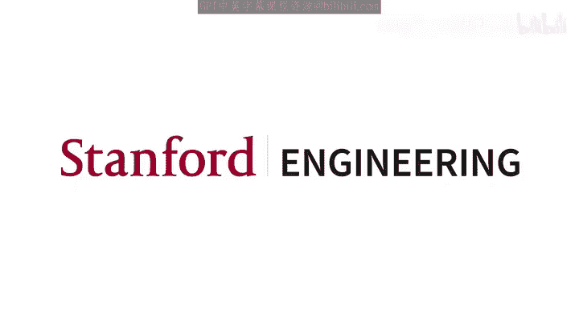
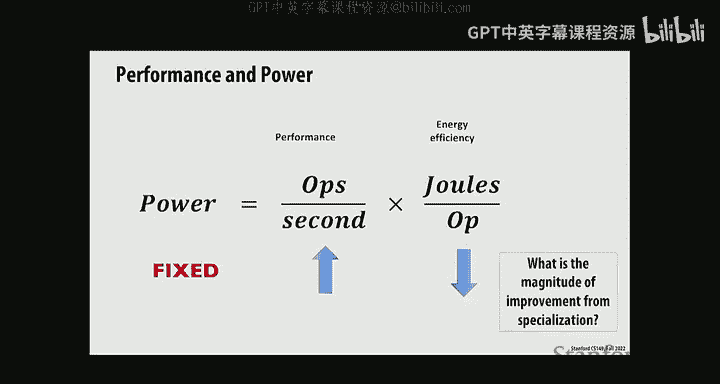
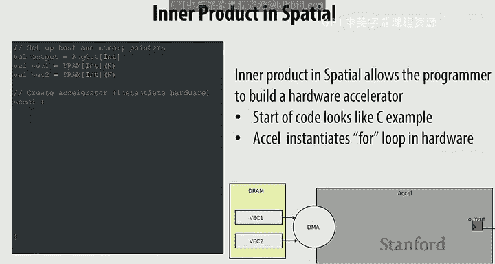
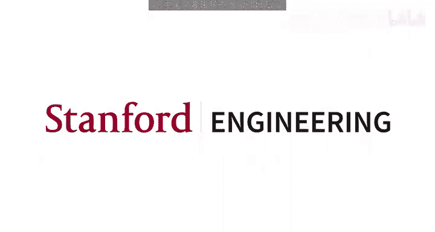

# 斯坦福大学《并行计算｜Stanford CS149 I Parallel Computing 2023》中英字幕（gpt-4 - P18：Lecture 18 - Hardware Specialization.zh_en - GPT中英字幕课程资源 - BV1Y5V5zjEsX

Okay so today we're going to continue our discussion of energy efficient computing。

 at the end of the last lecture we talked about heterogeneity and we said that the motivation for heterogeneity is because you had different kinds of program characteristics that could be exploited by more specialized architectures and the key one that we've been focusing on so far is the idea sort of data parallel computation that can be exploited by architectures like GPUs and the key capability you get is high performance and much more importantly。

 energy efficiency and we're going to kind of dig into energy efficiency in a little more detail today and sort of talk about why this is such op pressing concern in modern computing environments。

😊，Okay， so hardware specialization and algorithm specific programming， which， you know。

 would be kind of the next step beyond a heterogeneous compute environment would be one that's very specialized for a particular application right So energy efficient computing right。

 So we're constrained by energy today because of the state of the underlying semiconductor technology。

 right， So there was a time when as you got new generations of processing technology。

 every generation gave you more transistors， but those transistors dissipated less power right。

 And so you could get more performance for the same amount of power。 This was called denard scaling。

 So that ended about 10 years ago。 So now every time you increase them of transistors。

 you dissipate more power。 And now you're constraint right So we're in this power， energy constraint。

😊，Environment and to kind of understand how this works， right， So energy is power times time。

 So amount of power we have is fixed。 I don't know why this is is going on its own。

So。We're at this point where in order to increase performance， right， we have to。Decrease the。

 the amount of energy per operation， right？ So this is fundamentally where we are where if we want to given a fixed amount of power。

 we can dissipate， if we want more performance， then we have to improve our energy efficiency and the key mechanism for increasing energy efficiency is to become more specialized to get rid of the excess power we dissipate by doing things that don't focus on moving the the computation forward。

 Alright， so。😊，So why are we energy constraint across the computing landscape we've got energy constraints right So if you're thinking about supercomputers where you've got thousands hundreds of thousands of course in the data center and you have to supply power and cooling to keep the whole system all the systems running and this。

 of course， has a huge energy cost so you're constrained in large supercomputer environments。

 you're also constrained in data centers beyond behind the large websites like Google and Facebook there again。

 the cost of supplying the energy for powering and cooling the computing possibly you know over time over say the three-year lifetime of the computing resources is more than the cost。

Of actually acquiring the computation when we talk about mobile devices。

 your energy constrained because， of course， you have no fan in your mobile device because a fan would be inconvenient。

 And so， you know， the the heat dissipation has to happen passively。 And then， of course。

 you have a battery that has to provide the power， the energy to the compute。

 And so there you're also energy constraint。 So across the computing landscape。

 your energy constrained。 And so this is the equation we were looking at。 So energy。

 you said is power times time。😊，Right， and we said power was fixed for semiconductor processing constraints。

 And so if we wanted to improve performance。Then we have to become more energy efficient。

 And the way to do that is to do specialized functionality that reduces the overhead。

 And the question is， sort of what is the magnitude of this improvement that you can get from specialization over a general purpose processing environment composed of CPUs。

 So let's dig into that， right？ And so we've already looked at specializing for data parallel applications using GPUs you know。

 at large scale， and， you know， of course， within the architecture of a GPU， we see Cindy processing。

 which is also exploiting data parallelism。😊，And so the rules of thumb that you can get a tremendous improvement will come back to this about sort of what improvement we we can get。

 But the question is， you know， we spend a lot of time。

Talking in this class about how to get the most performance you can for a particular algorithms from a modern CPU and and and GPs。

 right， So the question is， sort of why are CPUs so fundamentally inefficient， right， So let's。

Look at this， right， So if you look at the energy dissipated in executing an instruction， right。

 say a multiply ad where you， you'll see that most of the energy actually does not go into performing the actual computation。

 right， So in this case， it's 6%。 and the rest of the， the energy is spent。

Dealing with the instruction and figuring out what the instruction is going to do。

Fting the and dealing with the data， moving the data and the overhead of controlling the circuitry and distributing the clock。

 which， of course， keeps everything。S synchronous， right。

 So if you look at all of the things that one has to do to execute instruction。

 You've got to read the instruction。 You've got to figure out what the instruction is gonna do。

 You've got to check to see how the instruction is dependent on other instructions are being executed。

 You've got to figure out whether the resource that you want to use to execute this instruction is available。

 You've got to figure out where the operas are。 You've got a fetch from the reify。 You've got to。

 you know， if this happens to be a load or store。 You may have to move data from caches。

 And then way down here is the actual。Perform the arithmetic operation。 And then you still have to。

 you know， move the results， right。 And so at the end of the day。

 you end up spending very little of the energy for a particular instruction。 And so the question is。

 sort of how can you make this situation better， So how does， how does S D make this， this。

 this pie chart look better， Yeah。I better read give instructions to vertical thick because you' pushing on instruction。

Right， right， So you amortize all of the parts that are not green over more green stuff， right。

 So you are executing across more data elements， right。

 and the width of your Cd is going to tell you how efficient potentially you can be right？

 And so what， you know， So if if if if I can do。8 data operations in one instruction。 Why don't I do。

16 or 32 or 64。Yeah。How to realize why？Right exactlyact right the wider you make it， You know。

 your peak is great， but your average is gonna be a lot worse because you you may not be able to fill up all of those Cdy slots。

 right And so， So this is the question， right， is that， hey。

 you can do better and you might go to extremes， but you know。

 ultimately you're not going to see the data parallelism or the Cdi data parallelism that you need to keep all the CD units busy right。

 So the question is sort of， you know， does Cdi make improve things。 Well， it does。

 So this is a study from a few years back that was done at Stanford that looked at， you know。

 how much。Energy gets consumed in a CD enabled CPU for H stop 2264 video encoding。

 which is a pretty data parallel CD friendly application。 And you see that， you know， the。

 the components of CD energy shown by the the red boxes is not that high。😊，So the question is。

 you know， if you want to do better， then you need to think about actually implementing more specialized components。

 right， and so。What we want to look at is to look at some some other types of architecture。

 you see that the best in this case for doing phosphoria transform。

 which is the core of many signal processing applications and and you it's really well studied algorithm。

 Some people call it the most important algorithm ever and so you can think about implementing specialized hardware for that and you can get a tremendous improvement in terms of the use of your silicon area and the energy efficiency right so in this case。

 this is a fairly old study 40 nanometers， which is you know ancient but what you see is that you know the AsI。

 which is this。😊，Diamond。You can see these diamonds then represent。In terms of compared to a CPU。

 which is the。Core core I 7。 So so the CPU is， is the core I 7， which is the。

 the lowest in terms of gigapflps per per millim squared。 and the star asic is， is， is the highest。

 right， So I。😊，Reverse what I was saying a moment ago。 And so the diamonds， which is the CPU。

 gives you the lowest energy efficiency and the lowest use of the the chip area。 And， you know。

 basically， it's factor of 1000 in terms of the use of the chip area and a factor of 100 in terms of energy efficiency that you get with a CPU versus something that's very specialized for a particular algorithm。

 So what's the downside of the AsIic approach。Yeah。You can only use it for that one algorithm。

 and you have to design it， right？ And so if you want to get your application going and you've got a new idea。

 you're gonna wait 18 months to go design an AsIic。 And then， well， you you。

 it better be a really important algorithm like FFT， you might， you know。

 So in order to kind of justify Asic implementations。😊。

But there are other ways of getting more efficiency than CPU。

 So one of the ideas that gets used extensively is this idea of digital signal processes。

 And that's the idea that hey， you want to do a lot of processing of signals using DSP algorithms like FFT and filtering IR filtering And it turns out that the instructions and the addressing modes in general purpose computers can be improved upon right So that's what DSP do very complex instructions that do just what you want for specific algorithms they have very complex addressing modes that allow you to you know。

 do the bit reversed addressing that you need for FFT， for example， now the question is。

 if I gave you this complex instructions set could you write a compiler for it。

 And the answer is probably no。 So you as you know so so along with the very complex instructions that these。

😊，D SP have come with low level programming that has to be done for implementing all these algorithms。

 right， but it's a hell of a lot easier than， you know， developing an Asic， but it's。

 it's also much more difficult than programming a general purpose CPU。

 So there are these trade offs now between efficiency and programmingability that you get。

Another example of a specialized compute unit is one that was developed by D Shore。

 So D Shore made a bunch of money in the financial area and decided that he was going spend some of that money doing things for humanity And one of the things he decided to do was develop a specialized accelerator for molecular dynamics right So if you want to understand how proteins fold you know it comes down to figuring out the interaction between molecules right And so molecular dynamics is is an important area in chemistry。

 know people have won Nobel Prizes for it and so on。

 and so developed this accelerator called Anton and you know by carefully designing the algorithm with the hardware。

 they got tremendous performance improvements over CPU and G。😊，P right。

 so you w to do an embody simulation， given an emboies figure out the interaction between between them and。

 and they've got specialized hardware for doing that。 And they， you know。

 I think they've got three generations of， of Anton at this point and each one is better。

 And so the aside is， of course， there are ways of doing this with accelerators。

 But there are also ways of of solving the problem statistically。

 And so there was this tension between the group of people who are doing accelerators and the group of people who are doing you know。

😊，Proscale statistical approaches these days， machine learning is all the rage。

 as you may have noticed， right So in fact， your last programming assignment was around machine learning。

 one of the accelerators that kicked off a lot of the interest in developing new architectures for machine learning was the accelerator from Google called the Tensor processing unit。

 And the way to think about the Tensor processing unit is that it made dense matrix multiply go very fast right and but dense matrix multiplies that are large like 128 was they started out at 256 by 256 integer matrix multiplies。

 and then you know， future TPU versionins had a， they went to 128 by 128。

 but then you were doing 16 bit floating point multiplies。😊，But you know， lots of， you know。

 is this is a few years old in terms of the citations。

 but lots of work in the architecture area to try and understand how to develop new specific architectures。

For the machine learning domain。 So most of these architectures are， in fact。

 somewhat programmable because you need to adapt to the， the。

 the changes in the machine learning algorithms。But fundamentally。

 they are focused on doing the core compute kernel in in these M L algorithms。

 which is matrix multiply， right， could be dense。 Most of most of the cases dense， but。

 but there are sparse versions that are interesting， too。All right so。There's this issue of。

Doing hardware that is fixed for a particular algorithm。 And the question is。

 is there a middle ground that will allow you to develop hardware that is somewhat programmable。

 right， So this is the whole reason and motivation for。

Hardware architectures that are called fill programme or gateators。 And some of you， of course。

 may have played with these this sort of technology in in in a digital design class。

 And the key idea is that you've got a bunch of what are called configurable logic blocks。

 which are basically look up tables for bullin。Algebra， right。

 so we'll give you a some function of some number of inputs in this case。

 a four input boolean function can be computed using the lookup table and then combined with a combinational block is a register。

 which gives you storage right And so then you put these kinds of configable logic blocks in an array。

 and you connect them together。 and then you can connect them into more complex logic blocks for instance。

 if you had a six input lookup table and you wanted to to generate a 40 input and gate。

 you could cascade these 6 input logic blocks together to create a more complex function。😊，Okay。

 so look up tables is basically just maps a binary number to an output and allows you to compute functions of of a different variety。

 So modern。😊，FPJs combine the configurable logic blocks with more dedicated functions。

 such as dense memory and also multiplies what are called DSP blocks， right？

 So the problem with constructing everything out of configable logic blocks is it gives you the most flexibility。

 But it turns out there's a lot of overhead， right。

 There's the overhead in connecting these blocks together。

 and there's the overhead of actually implementing the the compute elements using this CB source of technology。

 And so if you want to have a more dense， more efficient use of the silicon area， then you come。

 then you want these hard macro blocks for memory and for。😊，For multiplication。Right。

 and so you can buy， combine these together。 And then， you know， if you actually want to use them。

 you could， you know。Come visit my lab。 I can show you， you know。

 how to access them or you could go to Amazon， E C2， and they also provide FPG resources， right。

 And so they've got some quite advanced FPJ capabilities that you can access using cloud services。

 and then these have both， of course， links to memory DDF4 we haven't said a lot about memory。

 but but maybe we have time at the end of this lecture。

 We can talk about the different kinds of memory technologies interfaces to CPUs through PCIe and links to other FPGs。

 and then they have a whole environment that allows you to do。😊。

The software development in order to actually program these FPJs。

So youre looking across the spectrum here from easiest to program general purpose CPU to AsIic。

 right， we see this tradeoff between energy efficiency and programmability。

 right across the space of computing technologies that that you could apply And， you know。

 as a system designer， you need to， you know， pick the right one， right， which is sort of。

 you know what the constraints that you have in terms of the energy efficiency you need and how quickly you need to get your application。

 Well， how much effort you're willing to to to spend to get your application working， right。

 so you can imagine that， you know。If you can get the performance you need with a CPU， hey。

 just go do it， right， I mean and program your application using a high level。😡，Language。

 if you need more performance， right， then you keep going to the right GPUs。

 You may have to write some couda， DSP。 You might have to do assembly language programming domain specific compute。

 Well， this might work quite well if your domain is something might like machine learning。

 And you can program this accelerator using a framework like Pitorrch or or Tensorflow。

 that might work。 If you have to。Do an FPJ。 Then you basically have to become a hardware designer。

 And， and Asic is yeah， definitely you're a hardware designer。 Right， So， you know。

 as you move to the right， you get more energy efficiency， you know。

 dramatically more energy efficient。 if you do an Asic。 But then you have to work much harder。

 And you've got to spend a lot more money， right， in order to to move to， to the right。😊。

Especially if you move all the way to the right。Okay， any questions so far on sort of the。

 the space of you know， trade offs between energy efficiency and programmability。

TheDifferent points in the space。Yeah。Obviously， for talking about thesesis。

 it's like thousands years。It's much better， but middle there， it's kind of。

I get the Steing Valley okay。The T关。Why not just get it like two deep things？Well。

 I I think the jury is out right between sort of weather。Clearly。

 the GPU is is is taking pages out of the T you， right， It said， okay。

 it was this general purpose thread thing。 Oh， but oh。

 let's put these tensor core units in in and make it more specialized。

 But now you as a coer program and try to program those tensor core units。 I mean。

 we didn't do that in this class。 But it's actually pretty challenging， right， So， you know。😊，The。

 the， the， the， the spaces in flux and is driven by， you know。

 the this really high value application called machine learning， Right， everybody's kind of。

 you know， tilting their architecture to exploit that。Yeah。Because like DSP can Well， I mean。

 it it tends to be more focused on on DSP。 and it's got got a lot of specialized addressing mechanisms and and compute for that。

 So given that you're trying to do digital signal processing， it's gonna be more efficient。

But if you're trying to do machine learning， probably not。Alright。

 so now let's you know kind of look at sort of what it would take to move to the right a little bit more right so so we spent a lot of time in this class thinking about how we program the fixed set of resources that we provide you in a existing architecture such as a general purpose processor or or a GPU。

 but now let's think a little bit about what it would take to either specify or program a accelerator where you get to specify a bunch of things that you don't get to control if you're thinking about a general purpose environment in particular。

 you get to have some custom memory system a lot of the performance improvement you can get in any particular piece of hubware it has to do with with how you organize the memory to exploit the particular。

😡，Characteristics of locality and access behavior that you see in your application。

And you get a specialized compute that matches what what you need in your application。 Right。

 So the question is sort of， you know， how do we think about or how do we program you know。

 specialized processes or accelerators， Right， So， traditionally。

 you know you have to become a hardware designer and think about things that at the level of what's called the registered transfer level or or the hardware description level level。

 Right， So you you have to write in， in languages like VHDL or Verlog。

 How many people have written Verlog。😊，No， good share number of you， good fair number of you。

 So you understand the pain involved in programming at the very log level， right now。Recently。

 there has been this idea called high levell synthesis。 And the approach is， hey。

 I'm gonna write a C program。 And then I'm gonna have some smart compiler convert that in into hardware。

 There are two things wrong with this idea。 One is that C programs were not intended to be descriptions of hardware。

 right， So you have to make all kinds of inferences about what the hardware should be doing because the C program was designed for a general purpose processor。

 It was not designed for hardware。 So that's the first problem。 The second problem is that。😊。

In order to kind of get around the deficiencies of C， they put in these pragmas， right。

 And so you get to direct the compiler to do certain things。 Well， the problem is。

Putting in all these pragmas， you essentially have to know a lot about hardware to put in the pragmas in the right way。

 And so you've kind of defeated the whole purpose of kind of rising up to to the level of high C。

 and then in fact， in order to get anything that's worthwhile and performs well。

 you've got to kind of descend down to the level of hardware by using these pragmas。 Okay so today。

 instead of kind of looking at high level synthesis。

 what we want to look at as a language that we call spatial。

Which is a high level language for designing hardware accelerators thats designed to enable performance oriented programmers to specify hardware。

 So everybody in this class at this point is a performance oriented programmer， right。

 that's what you've been doing all quarter。 And so you guys qualify。😊。

And so the key thing that performance oriented programmers like to think about is parallelism right。

 and locality。 This is what we've been dealing with in the whole quarter， right。

 And in terms of locality want to think maybe about some specialized memories and how you do the data movement。

 So his spatial。 So the quick one slide description。😊。

Of spatialial is its design for it's a domain specific language for accelerator design。

And it has contracts to express parallel patterns， which you're also pretty familiar with， right。

 So data parallel patterns over， sorry， data parallel patterns over collections， So map， zip， reduce。

 These are all concepts that you， you're familiar with。

 And what we want to do is we want to think about how to execute these parallel patternss using two types of parallelism。

 One that you're very familiar with， which is independent parallelism， right。

 So thinking about taking a map and running the the map with independent computation units。

 and the other is。😊，Depenent parallelism， which I think some of you are quite familiar with， too。

 right， Dependent parallelism is where you've got parallel units that are dependent on each other。

 So how would you execute dependent parallel units。Those of you whove。How do you execute things。

 How do you execute a set of。啊。Computation in which the components of the computation are in fact。

 dependent。😡，Yeah。do some sort of like dynamic stuff。

it's a concept we haven't talked about explicitly here。 So so it's not something that you。

 unless you you've heard about it in some other context， maybe a hardware design context， yeah。

Do you do kind of what you do with the CP？M right， right。

 So the different components of an instruction execution pipeline are all dependent。

 but you've got a bunch of independent instructions and you execute them the same way you would。

 if you were doing in a factory and you were working on a car。 You create an assembly line。

And each of the stations do things independently， and then you get parallelism across the different sections of the pipeline。

 So pipelining is the other way of doing parallelism where you've got dependencies， right。

 So we want to look at how to do pipeline parallelism。

 parallel patterns can be nested so you can get hierarchical control。

 which said that one of the key mechanisms that a hardwareware designer or a or somebody who wants to control the locality or exploit locality in the application is to be able to explicitly specify the memory hierarchy and how that gets used。

 There's also this notion of being able to look at the whole design space using parameters。😊。

And you be want to expose these to the compiler and allow the compiler to potentially explore the design space for you。

😡，So the key here is that。Let's focus on what is interesting and important in terms of getting high performance。

 which as we said repeatedly， is about how you exploit parallelism。

 both independent parallelism and dependent parallelism and how you manage and figure out the locality and I would claim that it's kind of more intuitive than thinking about things from a thread level for these kinds of applications that you might see in a machine learning context。

😡，Al right， so let's talk about the spatial language。 and let's start with the memory templates。

 right， So as I said， you have this explicit memory hierarchy。😊。

So you get to specify what memory is on chip。Ah， my pen's back。And what memory is off chip。

 so you might have SRAM on chip and you might have a data type。😡，Right， in this case。

 unsigned in 8 and a。In this case， it's an array， so you might specify how many elements。

And then you can also specify。DRAM。Right， in this case， again， it's 8 bit value。

 and this is a two dimensional array。 So you have， in this case， image and buffer。And then。

 of course， you've got reddishes， you've got variety of different kinds of reddishes。

 You've gotccumulators。You've got Pfos， which are just Qs who will say a lot about using Pfos。

 You might， if you're doing image processing， have the idea of a line buffer。

 which is this two dimensional array that can be shifted by by lines。

 And then you might have a shift register， which is similar in spirit to the line buffer。Alright， so。

When we're dealing with CPU， there's only only the main address space。

 the address space of memory that is visible to the programmer， right， And then you。

 as the programmer can write code that is cache friendly。

 but you don't control how data moves between the main memory and the cache right That's handled automatically by the underlying hardware controller In spatial。

 that's not the case。 You， the programmer， have to explicitly move data back and forth between the different levels of the memory hierarchy。

 And in this case， you're moving data from the DRA from the image to the buffer， right， with a load。

😊，Operation， right， Okay， so the so this is a dense。Data movement。 The next is a gather， right， so。

We've talked about Ga。 So can someone tell me how gather works here。You的デ。Sport three。Right。

 so you're saying that you're going to get it from image and in this case。

 10 elements and the addresses or the locations are going to be specified in some array A right and then you're going to so essentially you are taking sparse data and making it dense。

😡，In buffer， right so you can imagine there's load and gather and then there's store and scatter。

 right？😡， and then you can also create streams。And you can stream data in and out and streaming will be a key。

Component of getting efficiency。 Allright， what about control templates。 Well， the idea is that， oh。

 by the way， the spatial language is embedded in a。

 in a language called Scalar for historical reasons。 We won't get into it。

 But Scalar is actually a very nice language to embed DS SLs into it because it's very flexible。😊。

We've actually seen Scalop when we've talking about Spar right so you have in fact seen it before and so it was very popular one time as embedding languages go。

 but it has certain deficiencies around the use of the JVM， which kind of limited its wide use。

 widespread use，So you've got these Excel blocks right which are going to divide your program into parts that are accelerated and parts that just run on the CPU。

 And the question is whether you run the Excel block once or whether you run it continuously。

 which is the Excel star syntax。 And then there's this idea of finite state machines。

 which we are not going。😡，Focus on at all。 What we will focus on is the key mechanisms for doing parallel patterns。

 which is for each， which is essentially a map。And then reduce， which is a reduce， right？

And this says， you know， for， you know， all the elements in C and you're gonna step through it by。

 by one， do the following。呃。Code， which is the。Block the， the block of the the fall loop。

 the core the for Fo loop。specified within the braces。Okay。

So there are a bunch of design parameters that you can specify。 You can specify how much particular。

For each and reduces are paralyzed， you can specify how they get scheduled。

 you can say that you want this to be pipelined or you want it to be streamed and we'll say a little bit about each of these in just a moment。

 you can specify parameters such as you want the size of the buffer to be the default to be 64 but you might want the range to be 64 to 1024 and that can be explored then potentially by the compiler。

😡，All right。If you specify things that require the use of memory banking。

 the compiler will handle it for you， right， So if you parallellyze something and the parallelization implies that you have multiple accesses to a particular memory unit。

 then it's the responsibility of the compiler to make sure that you can actually achieve that parallellyization factor by duplicating memories or figuring out how to bank the memories appropriately。

 but that's a detail that that you don't have to consider something that the compiler deals for you。

 Allright， so let's look at an example to bring these concepts home。 right。

 So we're gonna do in a product your favorite little kernel。

And we want to build an accelerator in spatial， right， And so we're have these three。

 We have the code here。 We have the sketch of the generated hardware below。

 And let's see what happens。 So let's start with the C code， right。

 just to make sure everybody's clear。 So we're gonna mallet two vectors， V 1 and V 2。

 and then we are going to compute the in a product using this simple fold loop， right。

 we multiply each of the elements。 and we add them all together。😊，Okay， that's clear， right？

So that's what you do if you're writing for a C code， right， So what。

 what do you do if you want to build an accelerator for this， right， was you， I remember。

You now have to control all the memory。 So let's assume that V 1 and V2 are integer arrays in DRA。

 right， And so it's clear here by this specification of DRA that these two arrays are going live in DRA。

 right。AndNow we haven't said exactly how DrRA works。

 but let's assume that we have a way of moving data between the DRA and the accelerator using direct memory access。

 which is an efficient way of moving data between the main memory and the accelerator。

And so we have an Excel block， which is where we are going to do the acceleration。And。Alright。

 so the first thing we're going to do is we need to。Move data from the DRA into the accelerator。

 And we need a place for that data to land， right？ So we have to define some。

Da some data structure within the accelerator for that。

 And we're going to create two S Ram blocks for this purpose， right， tile 1 and tile 2。

 And these are going to have size， tile size。And they are going to be an SRAM， right？And， you know。

 there's a question of sort of how how large they should be。

 But let's talk about that in just a moment。So then the first thing we need to do is to think about because we。

 we are gonna do these things by tiling。 We need a doubly nested loop， right。

 S nest won't work because we're gonna compute in a product using by tiles， right？

 So why would we want to。Ftch a tile of data from D Dr Ram， instead of single elements。Yeah。啊是证据。

You're gonna get much better use of the interface between the Dr Ram and the accelerator。 right。

 It's like going to the grocery store。 You never just pick up one thing that would be really wasteful。

 You take the effort to go all the way to the grocery store。

 You get a whole bunch of things and bring them and put them in your in your fridge or your pantry。

 right so that that you don't have to go back to the grocery store every time you want to get eat something right。

 So same idea here， costly to go to D Ram。 You want to get more than one thing。

 you might want to get a whole tile size amount of a beta and， and so you need to have a place。😊。

In your memory to hold that， right。 So， of course， if this was a CPU。

 this might just be general purpose cash， right， And the movement of data would be controlled by the caching algorithms here。

 you get to explicitly move the data and program the data movement。😊，Alright， so。

 so the first thing now we do is， is we're gonna have a a reduction over tile sizes ties。

 because at the end of the day， we need to reduce the。

Elements using addition in order to to generate the the output。Right， and so， so first of all。

 we're going to load the。To vectors， right？LoadA tile size element of data from V1 into tile 1 and a tile size element of vector 2 into tile2。

😡，Right？Then we are going to reduce。Within the tile。Right in step two。

And then reduce across the tiles in step 3。Okay。So now we've got the kind of this three step。

Process where we load a tile。 We do the intra tile accumulate。

 and then we do the accumulate across the tiles。 Okay， so now the question is。

I want to improve the performance of my hardware。 And for that， I'm gonna， you know。

 need need to exploit parallelism。 So where is the parallelism in this algorithm。Yeah。12。

I'm producing person Okay so that would be an example of pipelining， right。

 so you could pipeline that so that's one place that we could exploit parallelism this in a product representation。

 Where else。Yeah。Pro small hotels。So what thing you should tell？Okay， so you're saying。

So within each tile， we can do what？So this its reduce and the current cost be。aa the inmost reduce。

 is only within a tile。I'm sorry。Do go several times。Yeah， right。

 so you want to parallellyze step two。😡，ok。Yeah， so we can parallellyze step 2。

 how might what might be the best way to parallellyze step 2。Given what you don't。

What would be the most efficient way of paralyzing step two？

Pull something out of your pocket that you are very familiar with。Yeah。

If it's you're always the same churches of Cin， Cindy。

 Cindy would be a good way of paralyzing step two since we're doing the same operation to all of the the elements in the tile。

 right？😊，AndAnd that is， so we are doing this multiplication and reduction， right？

 So if you want to think about this reduce what， if you want to paralyze this， reduce what you do。

You're going to need some sort of parallel multiply followed by a reduction tree， right？Okay。

 so spatial allows you to do that。 It's got this notion of reduction right。

 It's got this notion of reduction trees and so you can paralyze by two in this case， you know。

 there's not much of a tree， but you're doing tu multilies， but you you can go wider right。

 goes as wide as you want and what would be the down the downside of going wider。

Reduction tree is larger。 What else is larger。What。The hardware， right， you get。

 you use more resources， right， you get to control， right， you say， hey， I want more parallelism。

 You know， there's There's no free lunch here， right， You're gonna to use more resources。😡。

But you get to control how many resources you use based on how much performance improvement you want。

Okay， so let's hold this idea of pipeing for just a second。

 but you could also control the tile size such that you could decide how much data you want to fetch every time you go to memory and optimize that so you could specify what tile size you want to use。

😡，And lastly， this idea of， you could say， hey， instead of running the outer reduce one step at a time。

 let's overlap them by specifying a pipeline schedule， right。

 So pipelineing here would say now I want to overlap Now。

 what is the key thing that you need for pipelineing to work。

 And it's kind of shown in this picture here。 And maybe you could read。 But。😊，Yeah。

 but we know they are no hazards， right because okay， but what extra resources do we need？对呀。😡。

It is justYeah， we need， we need to be able to， we need some double buffering， right。

 So while stage one is working on some filling data from memory， right。

 stage  two has to be able to work on data that has been generated from the previous execution of stage1。

 right， So you essentially need some sort of double buffering And so that that's extra。

 So pipelineing is as close to a free lunches， you might get in hardware。

 but it's not completely free because you add memory， right。

So you decide the pipeline and it's you get， you know， in this case。

 best case would be you pipeline to adapt for3 and you get a 3 x improvement in performance。 That's。

 of course， not always true。 But the overhead to doing that would be the extra tile memory that you need at every。

Stage interface in order to make sure that data doesn't get overwritten while you're doing the pipeing。

Does everybody follow that？Good， so you， so we saw kind of three types of optimization。

 parallelization， how we deal with the the data locality and pipeing。Okay。

 so just to make sure that you all understand then so spatial programme is responsibility。

 what as a spatial programmer are you responsible for？Yeah， what you're actually。Yeah。

 can you be a little more specific about what you're actually missing？😊，What's an offer how you。

These is different types of hardware。我い。Right， you've got to be able to express your algorithm in using the for each and reduce constructs。

What else are you responsible for， yeah。Handling memory， the explicit memory hierarchy。

 figuring out where the data should live。In the different memories that you define， what else？

ifying parallelism， how much？And where。诶。Think that's about it， right？specialifying the algorithm。

 specifying the memory hierarchy， doing the explicit data movement。

 and then picking the tiling factors parallelism and scheduling right and then the compilers responsibility is this banking and buffering of memories to maximize the performance and minimize resources and some lower level things about generating configurations for explicit targets。

And， of course， if you want to improve performance and understand performance。

 you need some way of getting feedback about the performance that your particular code can achieve on any one of these targets and then what sort of resources they might use。

Okay， so， you know， spatial has being used to convert Tensorflow representations of machine learning algorithms into hardware。

 I think more interesting might be， you know， something that you're very familiar with。

 which is sort of how to optimize an algorithm like。Flash like attention。 Okay。

 so this is something that you've just been thinking about。 So we talked about fused attention。

 right？ And so what was the big benefit of fused attention。Yeah。

You don't have to materialize the fuel attention matrix， you kind of tile things into blocks。😡。

And then you compute a block at a time， and then you also get this idea of fusing the different。

Components。Of the attention algorithm together and， and minimizing memory bandwidth by doing that。

 And then also you。呃呃。You minimize very bandwidth and that gives you the benefit， right。

Get this performance and memory。Size benefits。 So it turns out that if you kind of。

Wr things using this spatial。Program streaming programming model。

 You can get a lot of these benefits with， with a simpler programming model， right。

 so that you a model where you don't have to write an explicit。Fused kernel。

 So let's see how that works， right， So let's kind of go back to the time before flash attention。

 right and。You know。Before flash attention right， you have this kernel based execution model and。

 and the flash attention， you know， as we said， prevents the materialization of the full matrix。

With the streaming execution model， you also get these benefits。

 but you didn't have to write the flash attention。Colonnel， and in particular。

 you didn't have to pay extra comm computation， Right， So turns out that to deal with the。呃。

The softmax， you had to do extra computation in order to deal with the fact that you had this。

 this row computation that you needed the whole row in order to compute the softmax。

And it turns out that that we're streaming， you can get away from doing this at the cost of having potentially a little bit more memory。

Alright， so let's see how that works， right， So if we think about softm， right， as you know。

 it's actually a three step procedure， right， So， first of all。

 you've got to compute the exponential for the particular。😊，Values of S I J。

 And then you have to do the row row wise reduction。

 And then you have to do the division of the exponential by the row wise information， right。

 And so this three step process。is shown here pictorially， right。 So first， the exponential。

 then the reduction， which is row wise， and then the division。So if you do this。With。

Out the optimization of flash attention， right， then you have this materialization of the whole matrix。

And of course， that increases your memory footprint and increases your memory bandwidth。

And so this kind shows you the overview。 It shows all the data that has to be both materialized and moved between the accelerator。

 which you can think is happening up top and the the GPU memory， which is happening which is below。

 right， And so all。The data that crosses this line then is memory bandwidth that has to be。

Used in order to compute the。The attention。Right， so with the streaming execution model。

 you can avoid the materialization of the matrix。 So let's show you how that works。

 how how the streaming works， right， So essentially you know in this example。

 we're gonna compute the exponential， and then we are going to compute the row sum right。

 by reducing the row。 And so the way that you would write this in spatial， right。

 is that you're going have the first for each， which is kind of a map do the computation of the exponential。

 right。😊，And but then， instead of。Putting the output into another matrix。

 we're just going to incu the output in a Pfil。Right。

And so the semantics of spatial are this for each and this for each are executing at the same time。

 right？So now you can think of， of， of， of， of the。First， for each as being the producer。

And the second for each is consuming the output of the producer。And so， you know， essentially。

 the the reduction then happens by decoqueing an element from the first。呃。For each and， and。

Keeping having this continuous sum。 And then finally， when you're done， you generate the output。😡。

Also in a FiIO。Right， so there's a single element。 So everybody follow how this works， right。

 You essentially have these two four reaches and they're operating in a pipeline， right？

 And between the pipeline are a fiIO。Right so so initially what happens is we define the on chip memory for S。

 and we define the two Pfos。We do the。And Q， we compute the exponential。Element here。And then we do。

In queue the， the， the the data on the FiO。We de queue。The PO in， in the second。For each， right？

And so this just shows。How things work。With streaming， right？ So before streaming。

 you would materialize the whole of the N by N matrix with streaming data just moves through in this case of two element5O。

 So this is the equivalent of the double buffering that we showed in the first example。

 But here you've got an explicit FiIO。 And so because you have have figured out that that that's all you need。

 you get a tremendous reduction in the amount of memory you need。 But in order for this to work。

Your programming model has to think about these two kernels operating at the same time。

 being connected with a PIO。😡，Which is a very natural hardware way to think about things。

 But it's not a natural software way to think about things， right。

 So spatial kind of allows you to think about。This idea of pipeline parallelism in ways that match what you would want to do in an efficient hardware implementation。

 which don't match what you typically would do with software。😡。

So back to the original kernel by kernel scheme in which you are materializing all the memory。

 you've got all this memory that gets materialized。

 you've got all this data movement that's happening which we showed was unnecessary and that if you do things with streaming。

 then the data can just move through PIfos between the different kernels because one kernel puts data in a PIFO。

 the next kernel picks it up and does the compute and you never have to materialize the whole matrix and in cases where you need data for instance。

 for doing the row operation， then you've got to be able to accumulate a whole row of data and your fiIFO and so the limit is that you need to be able to have this PIO be the length of a row of the matrix right？

😡，Okay， now that could potentially become a limit and you can go through the details and the details will be clear。

 right， And so the question is。😡，So you need a， this is just showing that you need a row。Of。

 of data in order to compute the。P。Matrix or， or so an element of the P matrix。

And you can look at at the allia。 And so the question is， you know。

 could we do better with flash attention， And The answer is yes， right。

 So there's still room for optimizations like flash attention， because maybe at some point。

 if your matrix size， your sequence length gets really long， then even a row of data is too much。

 right？ And so if you want to， you know， limit the size of your fiIO， you can。😊，You can。

 you can apply flash attention to this sort of optimize to a streaming based optimization。Okay。

Flash attention， know reorders the operations and uses a running sum and rescaling instead of naive reduction in order to do this computation。

 And now we can dramatically reduce the need for this row amount of data in our fifo。 right， Alright。

 so if you were kind of sort of compare streaming。😊，Versus kernel by kernel。 So what you get with。呃。

With a streaming implementation is you get this idea that you can exploit more parallelism right because you have this ability to overlap the computation of the kernels between each other using this pipeline type of execution。

 you get more the ability to exploit more parallelism。😡。

And you can spatially map each computation without with pipeline communication， right。

 And so this is what you get with a streaming execution model。 and then you can overlap。😊，And。

 and pipeline the computation for different output tiles。 right。

 So you get the extra dimension of parallelism and performance with a streaming implementation。

The other benefit that you potentially get with a streaming implementation is that you don't have to explicitly create a fused kernel right so you can imagine these kernels implemented individually and you can either use the capability of the compiler to do this double buffering technique。

 but then if you want even further optimization， then you can replace the double buffer with a PIO like programming expression as I just showed you in this example and get even more efficiency and that's easier than creating this you know explicitly fused kernel as you would have to do with a traditional programming model right so the streaming execution model gives you this extra degree of freedom。

 you know operations get fusesed automatically if you write things using PIfos or。

Even if you write them using buffers， the double buffering technique can be employed and then the compiler can automatically generate the fused execution。

😡，Okay， so any questions here， yeah。So just to confirm the streaming execution model is independent from the notion of accelerated design。

 like you can write a streaming program， but it can run on like pre existingisting。Yeah， it can。

 It can。 I mean， you can imagine it running on a existing。Architecture， the question is。

 sort of whether。So so it's very difficult in Kuda to write a streaming program， right？ I mean。

 you fundamentally don't have the ability to have different parts of the kernel operating independently and in ways。

 so what you typically would write is you would write some sort of fu kernel right。

 And so you need you， you， you could imagine that I think you。

 you talk to to the people developing Kuda。 They're trying to enable this kind of execution。

 But I don't know how to do it yet。 You know， I'm not saying， will never be possible。

 but it's not not possible today。Yeah。training execution model。

 What if the5 depth iss getting too large， then is there an alternative gap scaling profile file code。

呃。then you might you could use buffer， right， you could just use SRA instead of redishes。

And you might have to write your application slightly differently。Or you would try to think about。

 you know， using techniques that fundamentally reduce the the Fi0 size， like flash attention， right。

So， you know， sort of you can get it。In in a sort of brain dead way just by using the PIFO and you don't have to work too hard。

 but then eventually maybe the PIO gets too big and then you have to have to work harder and do something that actually transforms the application。

😡，Yeah。But the examples he gave were using spatial， but spatial is like kind of give you like。

No you could target all sorts of things Yeah， yeah， yeah， yeah， yeah， yeah。

It was intended as a hardware。Model。It works very well for a new style of architecture that we define called reconfigable data flow。

 it doesn't really match。GPUs。You of course， make it run on CPUs。But yeah。

Other questions but but the whole point I want you to get is this idea of the streaming execution model。

 this idea of having kernels that operate in parallel at the same time in a pipeline execution mode and the notion that you can get the benefit of fusion and tiling without it being explicit。

😡，Okay。Okay， so the accel summary is a significant energy efficiency improvements from acceleration right so you can get you know100 to 1000 x improvement designing accelerators is all about understanding your application。

 which is something that we've been focusing on the whole of this course and then figuring out how to exploit you know。

 the specific parallelism and locality that is is exhibited by your application right and we kind of have seen that but now in the context of accelerator design you get to define explicitly what resources are going to be used to exploit parallelism and then how the memory hierarchy is going to be designed to make sure that you can get maximum locality and so you get to define the sizes。

 you get to define when the data moves from one part of the memory hierarchy。😊。

To another part of the memory hierarchy。Okay， so you need insight into the application。

 Wheres the bottleneck， is it memory bound， is it compute bound。

 How does that change as I change my algorithm or has I change my implementation and then spatial is kind of a way of programming model and a way of thinking about how to explore the design space when you want to make these sorts of tradeoffs right So it's kind of you know a small step beyond what you've been doing here and that you now understand the application。

 you understand parallelism and understand the different types of parallelism。

 Well now what would you do if you actually had control over the hardware that you get to define and then you think about what that means。

😡，Okay， so we don't have time to talk about the design of memory。

 Maybe Can will talk about it on Thursday， Maybe not。 it's up to him。

 But as far as sort of acceleration in heterogeneous compute， we're done with that。 alright。Thanks。

