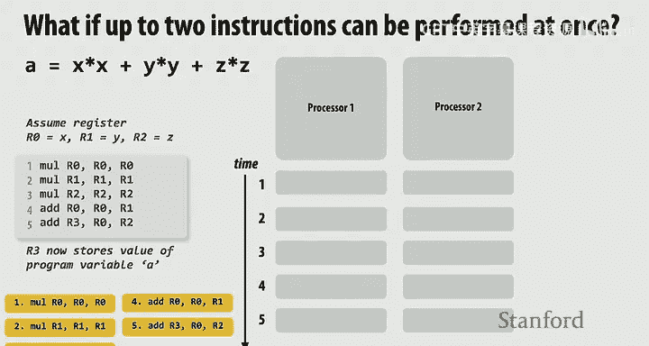
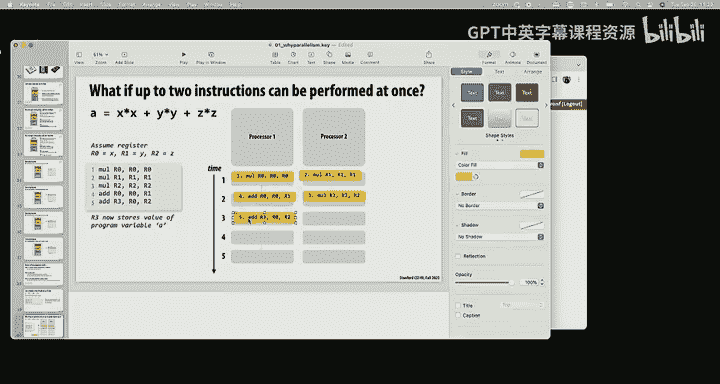
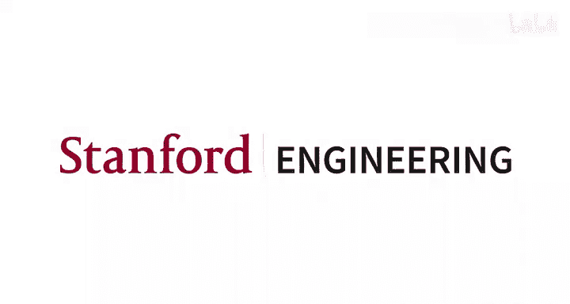

# 斯坦福大学《并行计算｜Stanford CS149 I Parallel Computing 2023》中英字幕（gpt-4 - P1：Lecture 1 - Why Parallelism_ Why Efficiency_.zh_en - GPT中英字幕课程资源 - BV1Y5V5zjEsX

All right， so welcome， my name is Cavon。 I'm a pretty casual guy。

 so Cavon is a perfectly reasonable way to address me。😊，Hi， I'm Kunle。 I'm the other instructor。

 You know， K's the software。 half。 I'm the hardware guy。

 I'll be doing a lot of the lectures at the front of the class。

 which are a little bit more software oriented and then you get the 18 in the back half of the class to tell you about how hardware really works。

 So you're gonna have right now we have 90s you're gonna have 10 or 11。

 So hopefully get everybody pretty good good support okay， so'm I'm a big person on motivation。

 So I thought that we would start by okay， so first of all。

 I like to try and make lectures as interactive as as I can for a big class like this。

 So one thing I'd like to start is why don't you just turn to your neighbor who hopefully is a friend or maybe not a friend or you've never seen them before。

 you might be working through a few things with them today。

 So why don't you turn over introduce yourself， say hi。

 suggest that you're a pleasant person to be around。 and and then and then。😊，One thing is。

Why don't you tell everybody why you are here？Okay， all right， so， so hopefully you've。Great。

 very good job， very good job。Okay， so here's a question for all of you we have 270 people in this class which is more than we've ever had before。

 it's always good to know why people got their butt up this morning decided to take this class。

You know。Why are you here， This is actually a class where we have pretty different people showing up。

 We often have hardware architects。 We have software programmers。

 We have people in machine learning that are tired of waiting for training to to go。

 We have graphics， folks。 So， so who's， who's here， Why， why are you here。😊，Yes， sir。

 sitting in the front。没。えそれ。I can plan。これもます。But I see feedback from people in the industry that you。

And I think that would be do better last minute。I think so。

 I think one of the things that I'd like people to take away from this class is that computers are a hell a lot faster than they actually think。

And so having especially if you never built a system in your life， I'm not saying that you will。

 but for folks their applications focused， I think that having a little bit of an intuition about how fast something should be is extremely important Like when someone working for you goes look this computation is taking all day you should be like I mean I kind of understand what that workload is that should be a five second thing on pin cores can really be helpful Anyone what else。

就是。My money use hardware or software。What that's great。

 So we are going to talk a lot about the interface between hardware and software。 Typically。

 getting that interface right is step one to the key to performance a lot of times。😊。

Any else in the back？You got some machine learning interests。

 you got some hardware software or boundary interests， anybody else？Is have any graphics filter here？

系得。Yeah just。I mean， graphics like machine learning has always been this field。s。

 we got to get the algorithms right， but we also got to run really efficiently。

 So a lot of the technologies that that we'll talk about have some genesis in in graphics。 So okay。

 so some of the things that we're gonna talk about。 this is actually， first of all。

 how many people have spawned a thread before in their life。😊。

And in what class did you spawn a thread for。1，10， and you spawn a thread in 110 in the context of what？

You're writing a thread pole okay， and did I actually forgot you wrote the thread pull for what application。

 or was it just a generic thread just to piece up？So you didn't create a thread pool to actually have a concurrent application at all。

 Yeah we're trying to do or something like thatright so right So so you wrote a thread pool for exactly the reason on this slide。

 which is you wanted to use as many cores as you could in order to get stuff done faster makes sense。

 a number of you have probably also written thread pools for web programming or something like that before。

 like anybody like web proxy or web server or something like that。

 A lot of the times we we spawn threads to hide latency to do something else。 But in this class。

 we're gonna be talking about multiple uses of why we're creating parallelism And this class even though it's called parallel computing。

 we're gonna talk about efficiency as much as as we're gonna talk about parallelism sometimes is a lot more important than parallelism。

😊，So I like， to play a little game in the first day of class， just kind of。

Make some things a little bit more explicit， at least while everybody's here。 So how， who。

 who can handle pressure。Lo some people。You name in the back。

So would you mind coming to the front of the room。Cause there's no bigger pressure than doing something in front of everybody else。

 And it even gets worse because I'm gonna have you do math in front of everybody else。

So if if it was me， I'd be quaking in my boots right now。Okay， so。

 so here's we're going to use you as a little processor。 Okay。

 so there are 16 numbers on pieces of paper right here。And I'm going to ask。To just add them up。

 as all you got to hold on one second。 And I'm going to time you。

And what we're going to do is we're going to see how fast one person can add up all these numbers and then we're going to see if we can do better。

 Okay so prepare yourself and whenever you're ready。

 I'll start the timer and we'll time how quickly you can add up 16 numbers。

 So whenever you feel comfortable， go right ahead。Okay， go for it。 timer has started。

And I'll be quiet。那个咋整。That's very， very close， close enough， but very， very。

👏It's a very high pressure activity。O。👏So you were able to add all these numbers up。

 and approximately， if I sort of， I'm gonna to remove a little bit of time when you were just kind of getting started。

 but it was about 40 seconds， about 40 seconds to add up all the numbers。 Okay。

 so I'm gonna to thank you and we'll keep going with the lecture。 So thank you。 Thank you again okay。

😊，So 40 seconds。 And， you know， this is our first parallel program of the class。

 And I might suggest that how can we do better？ So one way we could do better is we could ask。😊。

Practice a bunch over the next couple days。 And we can call back up next week and say。

 let's try it again and let's see if we can get those 16 numbers done even faster， right。

 so you can work on arithmetic tables or something like that。

 But what are some other ways we could maybe do faster。😊，So， so yeah， so， you know。

 obviously where I'm leading you is let's， let's try this with with more people， right， So。

 so luckily， I have sitting here with another set of 16 numbers。 The answer is different。

 So you can't just repeat the same number。 And I， and I'd like to have two more volunteers to see if we can use two people to do better than about 40 seconds。

 Allright， So you seem very confident。 come please come on up。😊，Nice。

 I'm going to put these space down so you can't， you know， at least precompute some of them。

 And we need another volunteer。 Oh， by the way， what's your name。😊，Okay， so first of all， thank。

 thank。And thank。👏And。I'd like another volunteer， but I in particular want to volunteer from the back of the room。

Yes， sir。 Okay， so you're going to be working with your name is。That's great。

 but I don't want you to go to the front of the room。 I want you to stay back here。 good。 Okay。

 so you can't look at these things。And what I want to know is I want to know what the sum of these 16 numbers is。

 I believe both of you have eight of them。😡，But here's the catch。Somebody give。

A piece of paper and a pencil。 Or if you have one。I'm sure we can figure it out。

 We have 270 people in the room。All right so。You two can't talk。😡，But I want to know the total sum。

So whenever you're ready， feel free to grab your pieces of paper。 One second， let me reset my timer。

And ready， Yeah， yeah， he's getting the。 No， you guys have different sets of eight numbers。

 and I want to know the sum of all 16。Well， he has a piece of paper。You can communicate。

 You just can't talk。Okay， okay， you ready。 Go for it。You solve the problem。 I look me。可。收到。Hund12。

 that's actually exactly correct， and。Very good， very good。嗯。

And I can prove it to you becauseuse I wrote  hundred and 12 right here。 So that is correct。

 Allright， great job。 Now， how the the neighbor knows how long that took。😊，My stopwatch says 41。

7 seconds。So we had one person that， you know， I gave you a little bit of credit because it was actually more like 45。

 but I tried to get rid of some of the wrestling of the papers。 But let's， let's call 45。

 And let's call。😊，41。So we have two people， twice the resources， twice my CA budget， you know。

 And I got， you know， how much better did I do。 I did what， like 10% better。

So what was what's going on here， What would we have expected if we assume that everybody could do math at approximately the same rate。

Super separate。Sorry，60% of Okay， why do you say 60% have it and then add it for some resource communications Okay。

 and then ideally， like the best we could do if you had some telepathic connection or something like that would have been it should have been about two times faster right。

 two people twice the resources two times faster， but we actually basically weren't faster at all。

And so what， what caused that， Did anybody notice how long it took the second group to do the math。

 It actually was at about 21 seconds when， when you started throwing up your hands， going。

 I'm not sure what to do next。 And I think it' was like 23 seconds finished his math and started walking towards you。

So what's the deal， Yeah， communication between the two。 We had to do some communications。 So。

 so this is actually a problem that is pretty trivial in some sense， to paralyze。

But just something as simple as getting one number from one side of the room to the other significantly blew up all of our speed up immediately。

 right， Like， you know， we had， we had students twidling in their thumbs。 Now， if we wanted， if I。

 if I gave you the opportunity to do it again and you could sort of do whatever you wanted。

 how would you maybe speed things up。😊，Go and walk over。Okay。

 so we could walk towards each other while adding the numbers。

 We can sort of start communicating essentially while we're still doing the math。

 What if I gave you other rules like you could yell or you could use Wechat or something like that。

How you。Yeah， so， so there's some way like if we could， if we could shout or if we。

 if we were sitting here on Whatsapp， like we could reduce the amount of communication significantly。

 right， So， so what we saw here is something that， you know。

 I don't even have to prop this equation up on the slide right， This's pretty obvious to everybody。

 I said， what should the speed up be with two people。 And you all were like， well。

 it should probably be about 2 x。 And we got that speed up for the time for one person。😊，You know。

 the time that Tina took divided by the time using two people or in this case， P equals2。

 right And the observations were that it was really this minimizing the cost of communication would actually be the hard part of trying to use two people under these conditions。

So if two people is hard。Maybe we should try four。Okay， so luckily I have。

4 groups of of things set up。 So I'd like four volunteers。

 And so first four people to come enthusiastically run in the front of the room will get to participate in this activity。

😊，Okay， so here's what we're gonna do。 Im， I'm giving you some， I'm giving you all some work。

You each have your things。Let me can't start。 And so， you know， ideally now they're。

 you're all right next to each other。 And， you know， I'm fine with allowing you all to talk。

 like you all， you're all right next to each other anyway， I'd like to know how fast you can do this。

 And we expect， you know， maybe on the order of 12 seconds or something like that。 If we're。

 we're in good shape。😊，So let's give it a shot so we got four workers go。Okay3。So so what happened。

Well what was the first was the reason why this didnt over I got a load of numbers you got a lot more work than everybody else I also give you bigger numbers。

哦 o 啊。These people were adding up like four and five。And okay， so why did that work？

Because my agency was higher than the other。I took more time because I had more work and the world distribution was a。

You more， you have more work， so everybody else is waiting for you。

And they didn't have anything to do Okay so I'm going to unlike you know unlike the other phones。

 I'm going to give you all out to diet so I have different。Now。In this case， actually。

 I do know it comes out with doing the same stuff。Okay， so I'm going to redistribute to everybody。

Now， before you do your work， why don't you all talk a little bit about how you're gonna do this。

 And with your friends over there， I'd like you all in the audience to come up with a scheme about how you would do it if you were standing up here trying to coordinate for people。

 And there's a number of different strategies。So I'll give everybody like 45 minute seconds or a minute to talk it over if you were up here with four people and you had no idea what were in those piles。

How would you do this？And feel free to talk about it in groups。Okay。

I think that's enough planning time。Take your packets。And one second， let me get ready。

 Are you ready， go。Okay， I'm looking to see what they're doing， I'll explain it to you in a second。

34 thirty464，35。B6。99 plus 26 is 125。You're off by 10， but that's fine， you know。10% air。

Not to be used in banking。 It was 115， but you know， whatever。

 sometimes we don't check correctness on assignments。 Okay so so you did it all。

 they did it in 19 seconds and I think like things were a little bit occluded let me actually why don't you summarize to the crowd how you did it we got packet we just them all like and then once all the packets were gone just them all together so everything that thrown into a big pool and then everybody just took the next available thing as they were adding。

 that was their scheme。 Now it might you know you would have run the risk and maybe you would have bumped into each other's hands or something like that。

 but it actually didn't seem to be the case。 And the reason why that didn't seem to be the case is that by the way。

 that took 19 seconds to do but at 12 seconds。😊，All of you had finished your individual mat。

 Actually。 So you almost were perfect up until there。

 And then it took 7 seconds to add up the partials， the partial sums。

 So your parallelization scheme was actually quite executed quite well。 So anyways， thank you to the。

 to the。😊，👏到。Did anybody else in talking over。 I mean。

 there's a number of ways people could have done this。

 were there any alternative schemes that were devised in the crowd。 So again。

 the scheme here was throw everything into a pot and take your， take the next thing out of the pot。

Yes I think we forgot to do one thing that once all of us added our numbers together。

 I think we us should have added together first。 then the other two and then It is true。

 You all kind of waited around until all the partial sums were done and。

 I bet you could have shad up two or three seconds if if you did that。

 Any other strategies in general。あわいいですか。You could distribute it into four pool beforegrounds。Yeah。

 so another way would have been just like anybody that had more than four pass to people with less than four。

 get four to everybody and then do the work Now in practice。

 like they ended up probably with about four items per person just by grabbing the next and what if one of the students would have been just really bad at math or maybe one of the students got some numbers that was very large and harder to add So so your scheme which is great and actually the one that I anticipated them to use was redistribute all the work up front do things independently and then come back together what they chose is they actually decided to just sort of sync up constantly by taking the next thing Any other strategies。

😊，No other strategies。We were thinking。readpat have one person is just waiting ready to sum the other so one person okay the for your sum and then as they come in the person sum See you can have one person holding the total sum in the head okay that would actually potentially work now what's the cost of this scheme of using three people to add up the numbers and one person to do the other one。

lot more than 16 Yeah， you're， you're， you're basically letting someone wait while everybody else is doing work。

 Now， in practice， I think your solution might have worked quite well because that person was waiting for a very short period of time。

 And's only one person waiting for a short period of time。

 Where what they had at the end with three people waiting for， for a short period of time。 Co， Yeah。

 makes sense。 Any other comments。Ways of going about this Yes Well the scheme was we're going to let one person just stand off to the side and do nothing。

And that person will recognize when the three other workers got done with their partial sums。

 and that person is only responsible for adding those up。

RightSo presumably they can start adding numbers up in parallel with the long worker。

So another another possibility seems perfectly valid to me。 Okay， all right。

 one more before we get on to some class logistics。

 And this is the more interesting one that I want you all to decide as a class。😊。

What I want to know is how many people are in the room right now。Okay。

 so I'm going to give you one minute， minute and a half to talk it over with everybody else。

 as a class， you need to design a strategy。😡，For how you're going to do this。

 and I'm going to put the timer on you。And we're going to try and estimate how many people are in the class right now。

 Let's say there's 150 people in the class。 if we can do。15 number。

16 numbers and 45 seconds around up to a minute。 Well。

 that means that we should be able to do the whole class of like 1 60 and 10 minutes， right。

 divided by 100 people。 So this should be just a few seconds to add everybody's up。😊。

So how一 going do。Thank everyone。け。Okay。All right， so let's come back together。

Let's make sure we have agreed upon a scheme Have。 have we converged to an algorithm with 150 people in 90 seconds。

Some will be assertive and say， here's how we're going to do it。😡，How the number of road。

 the number of people in road。so that's what you can do is that the plan want to I mean that's a perfectly fine plans want to add anything to it plan two three separate row every section add to row send the subback and then the back rowgam is the。

Okay。Are you sure？Because I feel like there's a lot of the class going to be sitting around what's not ideal here is that the fact that the class is not doing anywhere quite we are working here。

Yeah， the back of the class is going to be doing a lot of waiting while this partial sum is rolling back Okay。

 okay， so there's a proposal to start in the back and push forward and start in the front and push back。

You all somewhere in the middle are going to have to produce it that not okay anymore。

Send it to our section in the middle。I see sorry I didn't quite get it。

 so are we still doing row first？For the front like section of like front rows and then another person for the back rows。

 okay， and then can find that。So okay but how is that only two people are going to do the work？

Kind of observing yeah。で。I''m not I think I know what you're saying。

 but I'm not sure if I can translate it into pseudocode for 150 people in 10 seconds， but okay。

 one more thing， And then I think we're at a scheme and let's just see how well it goes。

 Yeah finally just called now we're doing something different。 So the proposal is get your butts up。

 get into groups of 10 and then count the number of groups。😊。

So who wants to is there a strong feeling， I think people want to move around。よし。や。

Everyone sitting in the middle row。 the other thing was everyone precompute the number of chairs per row and everybody fill up the front rows。

Encount the rows， okay， I'm going to get these are actually get a lot more creative than previous year。

Yeah， what's。Yeah。That's a good idea too， right？I think you could probably do that one in parallel with the in person algorithm too and see which one converges first。

Sometimes it's called speculative execution。 You do two strategies。 You see which one wins。 Okay。

 so which one do you want to go with。Buildilling up。All right filling up her rolls， okay。

 are you ready？1。2。3 go。Didn't expect that。I was serve。ど我明ね。Anyway， two minutes。

10 minutes is a serial algorithm。ついつい？24，30，36。I。All right， all right， all right， all right， right。

 just do the poll on Er。All right， about two minutes so far。😊，Yeah。てる。はは。I like the Perseverance。

😀Yeah。全部。そで。29 wfi。There's 45 in this second。All right， all right。

 I think I think for the sake of finishing the lecture。1 of all。

 I actually think this is a very creative solution。 I also thought， I mean。

 I thought all of these solutions were gonna to work pretty well。 This has never been proposed。

 I think in my time of the class。 And the groups of 10 also never been proposed ever in the class。

 So what do what'all think， actually， So like， let's maybe do a little bit of a postmortem here on what was good。

 what was bad about this。😊，Yeah， it was good。 I think there should have been like one or two people that are just dedicated to counting everyone while they're PC。

 I do have a feeling of this idea of just separating somebody off to the side to ir responsible counting。

 given this number of people probably would have been helpful Yeah。

 exactly I have also a feeling which will be somewhat embarrassing that if your algorithm was one person just count everybody in all the rows。

 they probably could have done it in two minutes。What else did you notice about this？😊，Yeah。

 so you kind of had like an allocation problem。 You also had a big data movement problem just to get everybody into the appropriate seat。

 So I actually think in hindsight that groups of 10 might have actually gotten people to accountable set a little bit quicker because you't didn't have these dependencies to get everybody in rows。

 So I have a feeling that like if you're getting hot things like that。

 why don't you file back to wherever you you feel most comfortable。 But you， Thank you very much。😊。

So if I assume there's like 160 of you here right now。

 that was like only 10 times more work than we originally asked。To do， for example， right。

 And so it shouldn't have been more than about 6 or 7 minutes to add it all up sequentially。

 It should have been much less because now it's just plus one， it's not adding a harder number。

 But we were nowhere close to that， right， like in terms of 100 x feet up over over the the sequential algorithm。

 And it was largely because of the cost of communication， synchronization moving all of you。

 And so this is something I want you to keep in mind because although the class is about parallelism。

😊，I mean， the reality is that it's really about moving things around。

Like every system that I think I've ever built， I'm sure I bet Kumi probably would agree is kind of the only thing that really matters is communicating and moving stuff around。

😊，OkaySo let me get into just some summary and some logistics real quick。

 you know theme number one of this course is we're going to get you thinking kind of like you were just thinking now like we're going give you problems。

 you need to compute this problem and you need to do it as efficiently as possible and so we're going to want you thinking about how to decompose things in parallel and how to synchronize and were I like some folks interested in the hardware software boundary because we're going to talk about programming mechanisms that help you organize that thinking that make it a little bit easier to solve problems like this。

Now， some of you are computer scientists， your day jobs or you write software。

 Some of you are E E and design hardware。 Another aspect of this course is about the fundamentals of how hardware works Because you can't make things go fast if you don't know how things are running under the hood。

 So the hardware is a little bit about why code has to be structured in certain ways in order to run fast。

 So software hardware designers you to know about hardware because they like to build this stuff。

 Soft folks need to know a little bit about hardware to go， wait a minute。

 how why am I making my program structured this way。 It seems hard or it seems difficult。

 why can't I write it in another way。 And more so than in previous years。

 there's gonna to be a stronger component in this class of actually designing hardware itself。

 So there may be an extra credit assignment at the end of the quarter where you can actually make a piece of hardware on a。

On an FPGA or some program will substrate。And then the last thing I want to just really emphasize is I care a lot about teaching people about efficiency。

In some cases， like in this exercise where we added up the number of people in the room。

 if it would have been easier for one person just to scan the rows and add them all up。That's great。

 That's a faster， potentially more efficient solution than a solution that was highly parallel。

 but had a lot of communication。 So don't， let's not get too hung up on parallelism because efficiency is often what matters。

 So here's an example。 Imagine that you go off to your next internship or full time job for whatever and。

😊，You were asked to write to speed up a program on a 10 core processor， something like that。

 And you came back a month later。And you were able to get two X speed up。 You went to your boss。

 and said， look， it's two times faster。😊，Do you get fired。Or do you get a raise？Okay。

 so we have a very negative class。 Some people want to fire you。

 What's a rationale for getting fired。You had 10 processors， you only got 2 x out of it。

 maybe you're using those processors very inefficiently， they say you're fired， go back， take CS149。

嗯。Any reason to give the person a raise？不事。别的。I'm just saying not all programs are like so easilylyzed like the one we just did right。

 like that's a pretty hard program to paralyze， is there a reason why you might be satisfied with2 x？

Yeah， if the performance gains， by that offset the additional cost of using it the1 processor？Yeah。

 like maybe computers are cheap and like being able to reduce the response time of your website by a factor of two translates into a ton of sales。

You might be really happy。Or like like Google search results have to be returned in a certain amount of time。

 Otherwise people lose interest and go somewhere else。Another example。

 imagine you had a computer game that ran at 15 frames per second in， you know， in a game。

 And you made it get to 30 frames per second。 You know。

 that might be the difference between the game shipping or not shipping， right。

 So sometimes we care about raw performance。 Sometimes we care about efficiency。 Ily。

 we'd like to have， have both。😊，Okay， yeah， okay。Yeah。

 and hardware designers care a lot about efficiency because they're like。

 the more hardware we put into the chip， the more expensive this chip is going to be to manufacture。

 so I'd like to put in the minimal amount of hardware that I can get by with and still meet my performance goals。

Alright， middle of the lecture， let's take a breather for a second and just go through some logistics。

 It's be a good time to ask any questions about logistics。

 Getting started is that all information on the course will be via the website。 So CS 149。

 know here's the website All the lectures are posted so we try and make sure that your lecture slides are posted prior to lectures so you can follow along while you're in the classroom。

 notice that there's a mechanism to comment under the slides。 So you you can add a comment。😊。

And typically， the reason why we do this under the slides is you can ask an actual question specific to the slide。

 So like intellectual questions， like I didn't understand this。

 Can someone explain multithreading very much prefer them to to come in via the slides so that other people can see them and respond as opposed to making those on Ed。

 Ed is for like logistics and stuff like that to me。

 And you can always go up here to the course feed and see all the comments that people have。😊，O。

Back to my lectures。So that's that。 There's no textbook。 The slides are basically the textbook。

 The Internet is full of great resources。 And so a great way to make a helpful comment would be to say。

 hey， I actually learned it from this website。 The explanation in class was pretty bogus。

 This is way better。 go be this Allright So you're gonna be doing four programming assignments。

 It's the bulk of the grade。 The first programming assignment will come out on Thursday。

 It's a little shorter the next three are significantly longer。

 You will be writing a much more elaborate version of a threadpo where we give you dependencies and everything。

 You're actually gonna be writing a render yourself that will make pretty pictures via in coa as fast as you can。

 not made yet， but intended to do so assignment4 is definitely very new this year。

 You're gonna implement the transformer module of D and you're gonna try and do it as fast as possible so that you can have a chat bot kick out tokens and maybe well have all the chatbots chat with each other or something like that。

 So theres。😊。

Of four assignments， typically after Thanksgiving， we release a fifth。

 which means you can use the fifth because it's awesome and fun。

 or you can use the fifth to boost the score of one of those by a few points。

 usually about 10 or 15 points。 Okay Most of your grade is there。😊。

We do written assignments that are graded on a， did you make a reasonable effort。

 that written assignments are all previous yearss exam problems。 So about every two weeks。

 there'll be a written assignment plus practice problems。

 So we distribute practice problems throughout the quarter。

 You can think about this as a participation grade largely。

And then the last part of your participation grade is I do not want people studying for the final exam and not thinking at all about the course between now and the final or the midterm exam。

 So just to force you a little bit to engage with the lecture in the same week as the lectures。

 we require one reasonable comment per lecture， approximately in approximately the same week as the lecture。

 So no hard rules on this。 But I hope that you average about two comments per lecture throughout the quarter。

 And if you really like a lecture and want to do a bunch of comments on one lecture and skip the next lecture that week。

 That's fine。 but no， it's not cool to do 35 comments when you're studying for the midterm and only then。

And so you can kind of see some of the interaction that happens like these are real comments from from students before。

 And so we， we expect you to do that。 And I think， you know， I think good architects typically write。

Well， right clearly， not not elegant English language prose。 but as an architect。

 you're constantly communicating to other people about technical things。

 And I think this is a very useful thing to be doing。 So you can take this offline。

 But here are some examples of fodder for comments in a big class like this。

 The comments actually works pretty well because somebody asked the question。

 and then other people answer it。 Don't worry if someone has already answered the question。

 You could answer it again in your own words or something like that。

 There are bunch of ways to interact。 A lot of people postcool links。

 Like I saw this on stack overflow。 It's a great example of this concept and stuff like that。😊。

Grading distribution is here。 So 58% programming assignments。 that's most of it。

 examams are about 30。 And then these two participations are just like last year。

 about 10% of the grade。Okay， the only last thing I， I you know， I wanted to say now is we do 8。

 late days per quarter。 You can use your eight days for programming assignments or for。

 for the written。 Most people use them for the programming assignments because the written are just。

Particip， that's pretty generous。 That's eight days throughout the quarter。

 So we expect that those late days are for most life situations， you know， minor illnesses。

 getting busy and other stuff， taking athletic trips and things like that。

 I was a college athlete myself。 So I understand， and I'm sympathetic。

 But I think that the eight late days should handle most cases without asking。

If you get yourself in a situation where this is gonna be trouble， come talk to us in advance。

 I mean， multiple days in advance。 You're like， I foresee this me not being able to complete my work willll handle on a case by case basis。

 but I bet 95% of the time。 I'm gonna say， just use your late days。 That's what they're there for。

 No problem if you turn in your assignment3 or four days， three days late。

 I think we have a rule that programming assignments。

 writtent assignments can only be one day late because I want to release solutions and they're for credit only。

Programming assignments I think can be up to four days late。

 I can't recall what it was on the website， it's three or four。Okay。All right。

 any questions about logistics， that's all I was going to do about。One not a question， but kind of。

该你。In both the programming and written science， could you indicate like which question or which component could be completed after which event？

哦，嗯。Sure， yeah， I could even do that in lecture。I mean， it it's， it's。

 it's not super modular like that。 actually。 So it might be a little hard。 but in general。

 the programming assignments。With exception of assignment 1， all the content， I believe。

 is released prior to the all the lecture content exists prior to the assignment coming out in assignment 1。

 you'll have。Conceptually everything you need on Thursday。And logistically。

 with a little bit of programming example， comes next Tuesday。有。Yes。

 exam Fi exams in person at the university slot。 That is the one thing that we are a little bit strict on。

 It is hard to run asynchronous assignment。 So if you're an in person student and don't have an extremely。

 extremely strong reason， we expect buts and chairs during the exam slot。Okay， so， you know。

 I accidentally bought a ticket to go home early。 Don't accidentally buy a ticket to go home early。

We've actually accommodated them in the past and it just makes for a mess in the TA grading。

 and then you'd never know if the solutions get out and stuff like that。Okay， guess what。

You got a code to make an account， I just wanted to double check a few things before I had everybody sign up。

 yes。O。All right， so keep going。All right， so， so the last 20 minutes here，25 minutes， maybe。

 let's go into a little bit more technical material that。Is perfectly fine if it's new to you。

 but some of it may be stuff that you have seen。 So I like to。

 to set the stage for tomorrow or Thursday's lecture。 Okay， so， you know， sometimes。

 it's kind of useful to think historically about things。 And when I was。😊。

Approximately sitting in classes like this。 And I was really interested in parallel computing。

 And I actually had professors tell me， why are you interested in parallel computing。

 Just wait a year for processors to get faster。😊，And so this is a very old plot that Kunley made more than almost 20 years ago now。

Of processor performance as a function of time。😊，And it's a log plot， so you see the exponential。😊。

You you just waited and Intel would ship their next CPU。 and next year。

 it would run your program faster。So you spent all this time taking CS S 1，49， you got some skills。

 and then all of a sudden， like your parallel program had to now be even faster to to improve over the the sequential program and。

Do you know why that was the case？I give bit of we。Maybe some of the hardware architects in the room。

Tranistor sizes were getting smaller， but that's not a direct translation to performance。So。

 you're correct。But you took a couple steps。So transistor size is getting smaller。

Allowed for a couple of things。It allowed for them to be clocked higher。 So frequency could go up。

 It also meant that more transistors could go on the chip。

 and architects had to have clever ways to use those transistors to translate into performance。

 Okay And in this class， I'm oversimplifying a little bit。

 But you can kind of think about two major reasons as。😊。

Paralyzing your code for you without you ever knowing it。And two， increasing CPU clock frequency。

 So this is where I get to a few questions that may seem really dumb。But。

One of the reasons why I like people writing comments is sometimes when you sit down to write something。

 you realize that your thinking is not as precise as it may seem。So you know。

 look to your left or right， and I want you to spend 30 seconds answering this question。

 what is a computer program？But from the， from the perspective。Of a computer。From the， you。

 here's definitely a program written in C。No problem， this is a computer program。

But from the perspective of a computer。😡，What is this， you know。

 what is a program and just go ahead and give that a shot， like spend 45 seconds。 What is a program。

 Can you define it yourself。はい。So someone who hasn't said anything yet。If， if， you know。

A talk show host found you on the street while you're walking around San Francisco。 They said。

 what is a computer program here on camera， What might you say。I just want to see some new new hands。

 hands。What is a computer program？A piece of text。That's a piece of text。

That can be translated to hardware instructions。 And I think that the text aspect doesn't really matter too much。

 What's important is the back half of your comment is a program is just a list of instructions。

RightSo if I take this program， it certainly has a meaning。

 it has some semantics and a compiler might get to it at the end of the day。

 whether or not it's a compiler or interpreter doesn't matter， but at the end of the day。

 a computing machine runs a list of instructions。So here are some examples of X 86 instructions that you might have seen So in CS S1。

11 now like like folks so 7， you've you've looked at a bit of assembly。 This is X 86。 Most you know。

 if you have an Apple laptop these days， it would be arm assembly， but at the end of the day。

All a computer does is it gets a list of commands。And it executes those commands。So it's， you know。

 kind of like me making Carda， which I have to make 12 night because I'm， I'm up for dinner。

 I get a list of instructions。 I have a set of commands。 and what do。What do those commands do or。

 or maybe another way to ask this question。 What does a processor do， So I'll throw it back at you。

 Talk it over for a second。 If I asked you。 and I said， I get， you know， like。

 what does a processor do if a program is a list of instructions。What does a processor do？

will you talk it over for a second。And and for those of you that just said。

 executes the instructions， which is a perfect first answer。 My follow up is。

 what does it mean to execute those instructions。 What does executing an instruction do。😊，Okay。

 let's， let's talk about this。 So I heard a lot of people immediately say a processor executes instructions。

 which is exactly where I wanted you to think about it。 And now let's dive a little bit deeper。

 What does it mean to execute an instruction。 What does executing instruction。Do。

Either performing a computation。Okay， so it perform some math like what you did when you came up here。

 okay？Okay， or it jumps somewhere else， okay？Anybody want to add， I think I can't。

 I can't disagree with any of those。 Those are two examples of instructions。

Changes the register's value。What are other things instructions might memory might read or write to memory。

 So at the end of the day， we can boil all of this down to instructions perform some operation like arithmetic or math。

 And the result of those operations is a change in state。

And what I mean by state is either values in memory。Or values in processor registers。 So when we。

 if I go back。Let's look at。This instruction sequence here， oops。Oh， there was。

you see some instructions which are referencing registers。

And like moving a value from one register to another is changing the value of the target register。

 There's other instructions in there。 When you see the parents。

 Those are accessing memory at at certain addresses and stuff like that。

So what I want you to think about， this is a diagram I'm going to use heavily throughout the rest of this lecture and the next lecture。

 And this is a really cartoon diagram of how to think about a processor。

 But for most software people， this is pretty sufficient。

 I like to think about three pieces of blocks in any modern processor。 One of them。

 which I'm always gonna color orange throughout this class， is about control。

 figuring out like it's managing where we are in the instruction stream and figuring out once I get the next instruction。

 what do I do。😊，Then I have this yellow box， which is responsible for the arithmetic。

 maybe adding some numbers or carrying out a move or multiplying some numbers。

 And I'm always going to call that yellow。 And then I have stuff that's blue that state。

And I am calling this the execution context。 It's the context in which we run a program。

 which is just a big set of values of bindings from Register 1 has this value。

 Register 2 has this value， as well as memory has all these values。

And the simplest possible way to think about a processor is it determines。

 given where we are in the program， where we are in the recipe， what to do next。

 it grabs the appropriate values from registers， it performs some math。

 and then it updates the value。For example， if I have a simple instruction。

 like add the contents of r 0 and R1 and put the result in R 0。 Well。

 that processor will reference the two， know R 0 and R1。 see it's in red here。 it will do the math。

 It will compute what。Yes， and what is that？Compute 96。

 and then it will update the value of so it can gets the contents of those registers。

 It updates the value， and then it modifies the state of the program to 96。Very。

 very simple instruction， you know，And so for now， I want you to think about this processor as every single clock tick。

😊，It's just grabbing the next instruction， executing it and updating registers。

 That's all it's doing。Okay，So my review here is hopefully this is review from 1107 or 111 is what is a computer program。

's just a list of instructions， What are instructions， their commands。

 their operations to the processor， and those operations are about performing arithmetic or modifying state。

 And when we talk about state， I'm talking about the values of data in registers or in memory。 Okay。

 there's a question。😊，你完子任OK可嗯。Right， so this program has five instructions in it。

 so it will take five steps，5 processor clocks to execute it。 Make sense。

Is there any way we could do better？What if。I had two processors。Okay， this is your program。

 This is what let's say I'm a computer。😡，And you hand me this program to run。

 What does this program mean， This program says you must do instruction 1。

 Then you must do instruction 2，3，4，5。 That's the order。 If I do。

 if I like trying to make my carne Asada， and I do things out of order。

I will be unhappy with the results。Right。So the meaning of this program is。

 is that the results have to be such that we did these things in this order。

 But what if we had two processors。Yeah。A you want multi apply Step Carol and I'll be Stepie Carol。

Yeah， so and maybe not the answer。So you're looking at this and you're realizing that like this multiplication only depends on Regs zero。

 this one only depends on this value R1， so maybe if I want to do assign work to processors I could do something like this。

Now what can I do next。You know， three can go where。

You actually can go anywhere I'll even put it here because I like process the too though and then what？

哎。right， because this only depends on one and two， so we can do。And then five has to come after。

Four and three。

So it's possible for me to do better。Even if。Even if I have a program that looks sequential because it's written in the line。

 if you look carefully at it， there's some parallelism there。So the first major， and by the way。

 you notice what I'm saying is the program says here's the program。

You better compute results that are the same as if you ran them in the order that I told you。

But if you run them in a different order and I can't tell the difference。Then， it's okay。

And that's a really big difference。 This program that I have， right here。Is a sequential program。

 I have written this program， which says the output that I want is as if you did this and then this and then this and then this。

 I didn't think about perilism at all when I wrote my program。

But I wrote a program where someone can muck with the order， in particular， make it parallel。

And I'd get the same result， I would never know。But my program would be faster。喂。So like。

 for example， what if we had three processors， could we do better？Well， before， what did I do。

 I did it in three cycles。If we have three processors。How long would it take？A you sure？Why 3。Well。

 I can definitely paralyze the first three operations all I want。

 but I have a chain of dependencies that keeps things three cycles。

DoestEach processor have its own like in this example I'm speaking very abstractly right now just imagine that like we have the ability to execute three things at once and I'll come back to that in one second。

 Good question right So conceptually when I look at my program。

And that instruction sequence that I gave you， Actually。

 I'm just rewriting it now as something that may be a lot more familiar。

 like a dot product between 2，3 vectors， key machine learning operation。

 These are the true dependencies。 And this program has different amounts of parallelism at different points。

So this gets to key idea number one today， we've had a few key ideas today。

 but it gets to the reason why more transistors did translate into more performance。Which is。

Processor architects were designing hardware that were looking at the programs that you gave it and said。

 they didn't do any perism。 But hey， look， what I found。I happen to have multiple。

Instruction units that I can do multiple things at once。 I will go find it。

And I will reorder the program to be parallel for you， without looking。You know。

 without you ever knowing。 And so to your question about registers and stuff。

 really what I mean here is we replicated， you know， we still have one core。

But we have two execution units and ability to execute two instructions per clock now。

And I added this out of order control logic box just to say that now there are some smarts in the processor to figure out what's going on。

 And if we look back like 20 years， you look like for a simple pentium 4 processor。

 This is a diagram from a long， long time ago。 And I draw my color scheme on it。

 It's not all that different from my little cartoon。They have the ability to。

 to execute up to four different instructions at the same time。And or。

 are three instructions at the same time with， with a variety of units。

And real programs are a lot more complex。 Here's a longer instruction sequence。

 A good thing to do on your own is to kind of verify that this is the dependency graph for that instruction stream。

And that dependency graph is limiting the total amount of parallelism that you could ever find with this technique of automatically paralyzing within a single processor without you ever knowing it。

 yes。I to understand better how that actually happens。Well， super scalar execution is the first one。

 and then you need a good reordering algorithm。 You could start with Tma Sulus or something like that。

 I don't know of these days if that's the best。Basically。

 out of motor execution is the key go to Henness and Patterson。

 read the out voter execution Cha and and then you're well prepared for E280。But there's a problem。

 Remember when I said if we had the ability to do three things at once。

 we ended up in the same performance as two things at once。

 That's because if I write just like a sequence of instructions。

 they're kind of usually as fundamentally in order to it。Right，And so folks studied， you know。

 here at Stanford， actually， the early days of parallel computing。

 they did a lot of studies of how much parallelism could we automatically extract。

If we asked the programmer to do nothing and we found what perils and exist in their program。

 and they found that the X axis here is the number of operations this processor could do at the same time。

 and the Y axis is the speed up。And they found that once you build about three or four operations at the same time into your processor。

 if you start building more， you can't use them because programs don't have that parallel of it。は。

So all of a sudden， they could stop they couldn't play this trick for you anymore to。

 to speed things up。O。嗯。Alright， so so here's， you know。

 a graph that that you probably would have seen。 Again， It's X axis as know。

 it's a fancier version of Konlay's old graph of X axis is performance。 This sorry， X axis is time。

 and the y axis is actually transistors， not， not performance。 It's transistors per per chip。😊，And。

 you know， in general， okay， now now we're starting to fall off for the last five years or so。

 But in general， we've been able to shrink transistors for。

 for pretty reliably for up until very recent times。 like more and more transistors。

 like in a modernvidia chip has something like， I think 100 billion transistors on it。

 I think it's like 85 billion is the last one。😊，So。

But we can't turn those transistors into more execution units because we know we can only do about three of those things。

So that's sort of this green line， this green line is transistors per chip。

The blue purple line here is operations per clock， and they stopped adding operations per clock because it didn't help anymore。

Now the dark blue line。You know， correlatedrelate， both blue lines are actually。

 they were increasing clock speed。 you know， like 500 MHz，750 MHz， gigahHz，2 GHz，4 gigHz。

 And that's what really stopped moving about 15 years ago。Right。And for the architects in the room。

 do you have an idea why。Clock frequency stop， because So we couldn't turn more transistors into free parallelism。

 and we couldn't make your instruction stream go faster。

Because we couldn't increase the frequency of the， of the machine， right。

 And that's completely power driven。 Like these processors that you see today are nontri。 Like。

 if you take an R T X 40，90 GPU and you take the the microwave in my kitchen。

You are within a factor of two。😡，Of， of running that thing， you know。

 in a machine learning workload at full tilt versus microwaving your yesterday's hamburger。

 You are in the same ballpark of energy being spent and that energy translates into heat。

 Heat translates into the the need to coal to cool that thing。

And so you just cannot continue to increase frequency。 And we'll talk a little bit more about that。

 But a nice rule of thumb is that power is going go as the square of frequency。

 So X axis here is clock speed。 Y axis is power consumption。😊。

So it's a very inefficient way to go faster to try and increase that clock。

So this is where we were not， not so long ago， you know， when I was in grad school。Software。

 all of a sudden， the only way to use all these transistors。Would be， I， as the programmer。

 have to tell the processor， here are two things we can do at once。

Now luckily in machine learning and computer graphics and image processing and photography。

 that's going to be pretty easy。😊，And so that's when people started building processors with。

Chps with a bunch of processors in it， where they took that one single instruction stream and allowed for more and more things to go in parallel。

 So one of the things you could do in this class starting on。

 on Thursday is the first thing is you gonna go， wow， if I actually just write code properly。😊。

On a machine that you're used to， like a laptop or the quad corere myth machines。

 the difference between C plus plus code， you know， compiled C plus plus。

 I'm not talking about Python or or lure or anything like that。

 compiled C plus plus and well written properly paralleled C plus plus is about 30 to 40 x on your laptop。

 even with four cores。 So we'll talk about why that's the case next time。

And you're just seeing some big chips out there， like you can go buy an AMD chip these days with 64 processor cores in it。

 we'll talk in the class about how NviIDdia processors are more of the same thing。

 just a little bit different point in the design space。

 There's 18000 floating point multipliers on a 1490。

So that's a lot of parallelism you have to have in order to use this thing。

 If you look at how many cores are there in the world's largest supercomputers today。

 these are megawatt。 These are basically power draws of small towns and we're in the orders of hundreds of thousands of CPU cores。

 This is not just a big iron thing， go crack open your iPhone or go crack open your favorite Android phone。

 you'll find multicore processing。 both CPU and GP。 If you're working embedded。

 you'll find multi core processing。Allright， so last thing in the last few minutes。So so far。

 we've been talking about parallelism and communication and stuff like that。 In this class。

 it's not enough to be parallel。You got to be efficient。And。

One thing we're going to talk about in multiple lectures this year is how the architects of the world are saying。

 we are not if we have to be more efficient， we cannot provide you general purpose course。

We're going to have to provide you much more specialized cores that do specific tasks。So here， again。

 this is that iPhone。 now I'm highlighting some of the stuff down here。On this processor。

 there are 6 CPUs， two of which are big CPU cores that are really good are supposedly good at running single threads。

 There are four small CPU cores that are lower power and and good for background stuff。

 And then there's a whole bunch of stuff on there for camera， neural networks。

 sensing your heart monitor， All this other stuff that's never even run on the CPU。

 It's run on specialized processing。😊，That's true in the small。

 It's also true in the large with Google building TPUs and Facebook announcing that they're building their own neural architectures。

 as well as in the valley these days， the large number of companies that are building special purpose processing infrastructure just for machine learning。

So we'll have lectures about all of this throughout the course。O。All right。

 so I'll close up on the thing that I think is perhaps the most important。As you saw in you're。

 you know， walking around the classroom， moving data to the right place is going to be the most important thing we talk about in the class。

 When you think about parallelism， you're gonna be thinking about。

 what do I do at the same time and how do I get the data there。Okay， and here's some example。 So。

 so this is where I need to bring up memory， a term that I've used without defining so far in this lecture。

 so。I've asked you， what is a program。I've asked you。

 what is an instruction and what does a processor do， And at some point。

 we've said things like a processor issues instructions that modify state。And I said。

 one of the aspects of that state could be values in memory。What did I mean by memory？嗯。

Like what is memory if you're a programmer，Or is an implementation of memory。Like when I。

 when I look at my X 86 code， when I say store this value in memory。

I'm not saying it's stored in DDR4。I'm not saying it's stored an on chip H PMM。

What am I actually saying， it's like a scratch pod where you just specify the address。It's a bite。

At the end of the day， all memory is logically， abstractly。Is an array of values？

If you give me an address， memory will provide you the value stored at that address。

 We haven't talked about how memory is implemented。 In fact， we will。

 but I have not told you how it's implemented。So here's an example of that abstraction。

 I have a table of addresses。 In this case， they're referring to the address is the address of a byte。

 And for every address， there's a value in memory。 In that case。

 I've given you some values that are bytes between 0 and 2，55。Okay。

So memory provides the abstraction is that the byte stored at this address has this value and a load in store a memory。

Let's say if we're just talking about bite size loads and stores， it says the address at this， sorry。

 the value of this address needs to be set to this value。That's all memory Ever it。

So a processor has two places where it can store values。 It can store values in its registers。

 and it can store values in memory。And there's example of an instruction might be move the value from memory into a processor register。

 So I say， go ahead， Hey， processor， take the value stored at this address。

 which happens to be 42 and move it to a register。 for example， register R 0。

And what's the effect of that operation？ How will my state change。

How will the state of this program change if we execute this instruction？R0 R0 will have what value。

2 will have 42。 It says go ask memory for the value at 42 and you get it exactly。 So I sorry。

 I didn' I didn't show the update。Okay， so you should think about a processor asks memory for information。

 and memory provides it。 Now， for implementation reasons， memory might take a while。😊，And so。

 for example， if a processor asks for the data， it may come some point in the future。

So in this diagram， memory had a very long latency， two seconds。But。

 but the latency of memory and if， for， for like if it was stored in D Ram。

 which is a very common implementation of memory， can be hundreds of processor cycles。

So imagine if you had a sequence like this， load from memory， this address into this register。

 load from memory in this address into this register。 then add those two values。

 You might have to wait hundreds of cycles to actually get that data。😊，Co。

So what can we do about that， A processor has a detail in it， So I have a processor with execution。

 registers， fetch and de and memories off over here。What is a cash？What is a cache？You know。

 not not this。A small amount of。I frequently。So， if D Ram。Is storage for memory。

A D Ram holds a lot of data。But is as a storage mechanism that has high latency。

A cache is another storage mechanism。😊，Can't hold that much data， but has very low latency。

 So if D Ram is my garage。Cash is my desktop in my office， right， less space。

 but much faster to access。 So now we're talking about implementation of memory。

A processor not only has stuff to execute instructions。 It has a little bit of storage in it。

 a little bit of storage that's used to keep values in memory。

 a copy of those values to make it easier to access。Okay。So in this example。

 I might have a memory address space that in this case， is 16 B。

And I have a data cache that can hold 2 B。See that。

So there's a little bit of a question of what data goes in this cache。

 and we're not going to even talk about it in this class very much。

 but I want you to just think about it as the cache is going to function of whenever it needs to put something in there。

 it's just going to kick the last thing out。Okay， so if you give me one minute or two minutes， I'll。

 I'll ship you able to。Finish up on time。 So imagine that this is memory。These are look memory。

 I'm not telling you how it's implemented。 It's just an array of 16 V B。

And now I want you to imagine that a processor issues instructions to access these addresses。

 So there's an instruction to access 0，1，2，3，2， back to 1，4，1， and so on and so on。

 So the program's order is kind of going down this way。😊，谁。So when the program accesses the value。

 I need the value at zero， address zero。It's going to need to load some data from memory。Now。

 here's one implementation detail that we can't get around。

Cashs transferred data is transferred from out in memory on to on chip caches in the granularity of some number of bytes that typically is called the cache line。

 So in this illustration， let's just say that that cache line is four Bs。

 and I have a cache with room for two cache lines。Okay so when my program accesses address 0。

It will bring an entire cache line。 all the data for that pink box。In the cash。

So what happens when my program accesses address one？The data is already there。And three。

 the data is already there。And so on and so on， right？So these cash lines。

 these caches provide an interesting benefit。They assume that if you've access some data。

 you're going to access the data right next to it。So there's some value。

 in reading through memory completely in the same order。Now。

 what happens if I go back and want to access to again， it's already there。

So they also have a benefit of when I access things over and over， it's really quick。

What happens if I hit one again， it's there，1， again， it's there and so on and so on。

So I'll finish this sequence up tomorrow， but I want to end with one fun thing。

This is the effect of caches。So if the data is stored out in DRA memory。

 you're going to have to wait for a while。 If it's stored in certain processor caches。

 you don't have to wait at long at all。 So I made this to scale if data is in cache and the closest cache to the processor might hold a few kilobytes。

That's how long it takes to access。A nearby cat， you know， of a little bit farther cash。

 a little bit longer。If data is not in cache。This is relatively how long it takes a load instruction to work。

I in there， I'll let Ron get started and well actually do some we'll get into some details of why this is the case and the implications next time。

