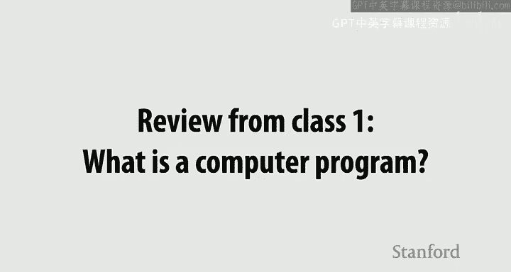
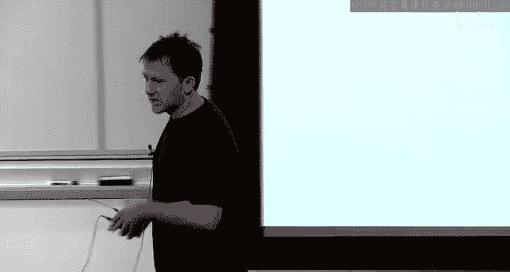

# 斯坦福大学《并行计算｜Stanford CS149 I Parallel Computing 2023》中英字幕（gpt-4 - P2：Lecture 2 - A Modern Multi-Core Processor.zh_en - GPT中英字幕课程资源 - BV1Y5V5zjEsX

So let， let's get going from a review from last time because， you know， sometimes it's， it's。

 it's good to， to page back in what we learned。Okay， so I asked you a couple of trivial questions。

 One of those questions was， what is a computer program， And really， I meant。

 what is a computer program as we're going to think about it in this class from the perspective of a computer。

So what was a computer program？

It's in the habit of just shouting out things that are， you know， maybe even obvious。

 And it'll just keep the。So a list of instructions or if you want to even you know I could ask you what's an instruction。

 you know if we want to be more abstract， it's just it's a list of commands。

 a program is a list of commands telling the machine you will do this。

 you will do that right so I have here the slides of a list of processor instructions at the end of the day。

 this program text turns into a list of commands。

Yeah。All right， and。What did a processor do？Given a list of commands， what does a processor do。

It executes those commands。 I'll give you that one。 But when we talk about executing the commands。

 what are the effects of those， those commands， What do they do。Modify state。

 and we talked about two types of state， right we talked about registers。

And we talked about main memory。No right。So this processor， it executes instructions。

 I gave you this really simplistic notion， just just enough detail to help us think about it it like it's useful to think about there's components of the processor that are about control。

 given the program， what do I do next？😊，Like what's the next operation or if there's like a branch。

 where do I go next， I typically I just have that as my orange boxes here， fetch and decode。

 then you have a part of a processor， some of the hardware is actually responsible for doing stuff。

 So I'm calling that the execution unit and we have two forms of context。

 We have the register state of the processor。And then not shown on the diagram， we have memory。

And my simple processor last time was going to execute one instruction every clock tick making progress。

Right？But then he said something else， we said， well， if we look at the instructions in a program。

 if we look at those instructions。And this was a larger program。We can take a look at them and say。

 you know， not all the instructions depend on the previous one in the sequence。

So this was a sequence where I really recommend that you。

 you go offline and confirm to yourself that if these are the numbers of the instructions and I'm representing those instructions as a node in the graph。

 there are certain dependencies， I have to do instruction 2， for example， you know。

 after I do instruction 0 and1， because I I can't add two numbers if I haven't brought them in for memory or something like that。

😊，And so we said that in the same way that you could look at this program and go。

 I know I'm supposed to get an answer， that's the same as if I ran these all and serially。

But if I had extra resources sitting around， I can do some of these things in parallel without really telling anybody that I changed the order and they'll never know all they'll see is that this program goes a little bit faster。

And so we talked about this one idea last time of super scalar exc。😊，And if you break down the word。

 you know， it's kind of a weird word term。 but if you think about it， it's like scalar execution。

 which is like doing one thing at a time。 And then the superscalear is kind of like a fancy。

 you know， like technical term for say， we're actually doing a little bit more than that。

 but your program is still saying I'm doing one thing at a time。😊。

So it's something that's going on under the hood。 So this was the first thing that we talked about where there was a little bit difference between the abstraction。

 the meaning of a program， a program is a list of instructions and says if you perform these operations on this state at the end of the day。

 you should get this answer。Then there's the implementation in a modern processor that says。

 we can do them in a little bit different order。 It'll be better for you， and you'll never know。

So that was a little bit what we talked about with processing。

We also talked a little bit about memory and I asked you what was memory。

 so in the same way if I ask you what is a program。

's just a list of commands where those commands modify state in a machine。What is memory？Yeah。

 memory is just eologically， abstractly， it's just an array of bys。

It's part of that state for that program。 and if a program says， please read the value at address 42。

Memory says， well， address 42 has some value。 And sure I'll give you that value。

 If a processor says write the value to address， you know， write the value fo bar to address 42。

 Well， everybody says， okay， I'll take that value。 and I'll put the value fo bar there。 Okay。

 so we talked about memory just being a big array of bys。But we didn't talk very much about， Oh。

 right。 And I even showed you， you know， like， okay。

 but we didn't talk very much about implementation。 So notice I'm setting this up over and over。

 there's what something means it's semantics。 like add these two numbers。 then add those two numbers。

 Or there is an array of， of address and every address has a value。

 And then the underlying implementation of that。So if I tell you memory。

 many of you might say the word DRA or remember a big stick of memory that you might have shoved into a laptop at some time or something like that and so what a DRA chip does is it provides it's the implementation of this abstraction you send that DM chip a command it says give me the value thats stored at address you HexB and this memory chip will send 255 back。

😊，But we talked about last time how it could take a while to go get that message out there to memory and come back。

And so all modern systems have。Some form of， of a cache。

And this cache is another form of storage that's part of the implementation of memory。

But if the processor says， I need address4。Well， that value might be stored in cash。

 and it can get the answer much， much faster。So that was kind of right where we left off last time。

Any questions？Just trying to， you know， like， I often overlap just a little bitcause it's good。 Yes。

 Sir。😀呵。😊，dynamic ra， just dynamic ram， and it's dynamic in that if you cut the power。

As opposed to something that's persistent， like SSD or。O。That's true。 Even reading a value。

 it destroys the destroys the value。 when you read a value， you actually got to put it back。

 otherwise you lose it。 But for fun， we actually have 30 minutes on D Ram very。

 very much at the end of class。 But for now， you should think about it as it's far away。😊。

And since it's far away， it's like it's standing in the back of the room or it's storage in your garage or something like that。

 If you w to go get something there， it's gonna take a little bit。

 And you should think about the cash is like， what's right on my desk。So these you distinguish。

Don't think about implementation。 They're just addresses。 I have something， you know。

 I have this concept， I have memory， memorym takes a value address。 It gives you a value。

DM is one way to implement that。 A cache is going me another one， a way to implement that。

 And there's something we haven't stressed very much in the class in previous years。

 And so this is kind of we're trying to set the stage a little bit more this year。

 So there's two kind of details of how a data cache works that are kind of useful to think about。😊。

One is， even though memory says if I， if you give me an address， I'll give you a value。

The underlying implementation in any modern system that I know about will move data from memory into the cache。

At some larger granularity of cache lines。 So in this figure。

This cache holds data for two cache lines。 Each of those cache lines is 4 Bs。So the bys store。

 you know， beginning at address 4。 So 4，5，6，7， These are the values out in memory that are replicated in the cache。

 You should be able to confirm that if I did not mess up my figure， right，0，0，6，0。 Okay。

 so this is a cache that has the ability to replicate 8 B。

 It's organized into  two cache lines of 4 by each。

And what I'm highlighting in red is sort of the the place in the address space that corresponds to these two cache lines。

 I've seen a bunch of questions。 Yeah，we just the next floor this Yeah good question。

 Think about you're gonna access and move data from off you know from DRA memory onto the chip in the granularity of4 Bs rooted at address mod 4。

 So if you want address 5， the actual command out to memory is give me the cache line of four。😊，Yeah。

Yeah。Do different execution workers have different caches or is their own not going to answer the question just yet I just want everybody to learn it for one processor just yet absolutely yes。

 but and you probably already thinking about how the heck if I replicate data all over the place。

 how do I keep things consistent， you are correct， but not today。Keep the Ram so far away。

Why not put a garage on my desk？够。没啊。Maybe you could explain one more time exactly what cash shot definitionly and so what is memory？

Memory is an address space and a value at every address。Somehow， we have to implement that。

So somewhere in the system， I need to have storage for every address。And typically。

 that is your off chip memory these days。 Okay， O， now。

 a cache is just keeping a copy of this information。Right on my desktop。Okay。

 now the organization of， of almost any modern cache， any。

 anything you get on any chip that you're probably gonna run is that data is gonna move between memory and the cache at the granularity of lines So on an Intel chip。

 that's a 64 by cash line on my diagram。 it's a  four by cash lines because I didn't want to draw 64 numbers。

😊，And so if you want address5 in myC。You're going to go ask memory。

 give me all the information for the line starting an address for。😡，That makes sense。

And Im going to next slide I'm going to get into why we work at granularity too things is basically all this。

we're gonna work that because we don't want to have a dynamic allocation situation here。

 this is gonna be hardware。 you know， the whole point is to be able to access like when this processor says I want address 5 and we say load address 5。

 Okay here let's think about this What happens if the cash if the processor says I want to load address。

 actually I'm gonna go with something else address。 Yeah， let's say address 5。😊，Conceptually。

 it's asking memory。Please give me the value at address 5。

 But what it's first going to do is it's going to ask the cash， Hey， do you have address 5。

And the cash is gonna go， yeah， I do。 actually， It has value 0。

RightIf the cache doesn't have the value， now we're gonna to go get it。And on the cache。

 it's going to ask memory， hey， can I get the line that contains5。

And that's when those four values come in in this case。 So let， let's think about it in a。

 in a slightly， you know， richer situation is what we were going through right at the end of class。

 In the class。 Nobody knows， you know， everybody's tired。 Nobody remembers anything anyways。

 So we're doing it again。 Okay， so here is the value of memory。😊，Notice that I'm。

 I'm really saying memory。 and I'm not saying D Ram or any implementation。

 even though almost all of us， if we say memory and computer architecture。

 we're probably thinking about off chip stuff。 Okay， so this is just the state。

 This is the state of my program， these values。 And here is a list of an addresses that my program is gonna access。

😊，So it's gonna be like， I'm gonna access address 0， then address 1， then address 2 in time。Okay。

 and what I'm going to show here is what is the cache doing in response to those processor actions。

So let's say that the program says please load the value at address0。

And let's just start from the place where there's， there's nothing in the cache or everything sort of invalid in the cache。

 Well， the cash is gonna go， hey， wait a minute， I don't have that value。

So it's gonna go ask memory for， for a cache line or D Ram right， So and these are my cache lines。

 Sorry， I didn't。 I didn't draw up for you。 right， So when we say， hey， I need address 0。

The cash goes， you never asked me for that before。 Why would I have it。

This term called so it's a cache miss， the value is not in the cache。

 And if you read a computer architecture textbook， they taxonomize the reason for these misses。

And so in this case， you know， I wrote on the slide cold mist because like。

 we have never even touched that data before。 There's really no reason it should be in the cast。

 Like， you know， the the idea is that the data is cold compared to data that's hot that you're often accessing。

Okay， so notice what happened in the cache state， the cache now has one valid line in it。

 and it's the line beginning at address 0。So that may have taken a while。

 There might be some real latency in that operation。Now。

 what happens when the processor says in some later instruction？Sometime later in the program。

 the cache hasn't changed。 Nothing's changed。 It's done no other memory and says， you know what。

 I want to read address 1。What was the cache day？It was like I got address one， that's a hit。

 nothing happens， right？So that can potentially be really， really fast。

 And the same is going to happen for 2，3。And then what happens if I go back to two。We're good。

 it's another hit， one， another hit， four。Don't have that。 That's got to get brought in。

 And now my cache in this example has capacity for two lines。 So we'll just put that other thing in。

 When I go back to one， what happens。I'm good。 exactly。

 So one thing I want you to take away from this slide is actually。

 the cache is sort of solving two problems at the same time。

I'm actuallym going to go to the second one first。 The one that I've kind of set this up for is if you've already touched data。

 you've already accessed data。The cache has it， which means all subsequent accesses will be faster。

So in general， one of the big reasons for a cache。Is that if I'm touching stuff a lot。

 the paper that I'm working on right now， the homework that I'm grading。

 That's why I keep it on my desk。 I don't take it to the garage every single time。 I， you know。

 wantanna， want to look at it。So that's this notion of temporal locality back to back aes in time。

That data is sitting there。 So that's what it's helping me with。 It's prevent， you know。

 preventing me from going out and looking at it。 The other thing that you might have noticed is that this granularity of operating at the granularity of lines。

😊，First of all， bulk transfers are almost always efficient。

So I can transfer data efficiently to the cache， but it's based on the assumption that if I access address zero。

 oftentimes programs then go access one， two， and3。

 two because they're like running right down an array， for example。

So there's actually two forms of the way reducing latency here。

 One form is almost like the line is functioning as a prefetch for the next items in the in the array。

The second one is， by bringing the data in now， I'm assuming you're probably going to touch it again。

Like a common thing would be to read something， do some logic， and then update。

So there's already two memory accesses。Now， I wan， I want to throw out one more pattern for you。

 which is kind of interesting。 Sam cache。And now all I'm going to do is I'm going to read write down an array。

 notice that the addresses are just increasing by a byte every time。Except I am， yeah， okay。

 So let's， let's just do this。 So hit。Right， hit， hit， hit。 Now what happens。Miss， good， hit， hit。

 hit。But what do I do？My cash is full。So now we got to throw something out， right？

 And and last time I told you that we're gonna take in this class， we're gonna assume a very。

 you know， simple policy of least recently used。 There some questions on the website about this。

 So the line that I have touched least recently， the longest time ago。

 is the one that I'm least likely that's the assumption to touch again。 And in this case。

 what color would it be。😊，It's red， so we're going to drop red and bring in green。

So this is a cold miss on green， right， because I've never touched green before。

First I' to touch this data。So this will continue。Hit， then we get to address 12 or hex C。

It's another cold mess， and we got to throw out。Blue。Exactly。This question somewhere， yes。

IIn computer architecture is in this call the capacity myth since you're throwing something out。 No。

 this is， this is a cold miss。 It's the first time you've touched the data。

 The name of the myth is relative to the data that I'm accessing。 I have like。

 if we would have had an infinitely sized cache。😊，I still would have missed here， right。

It's first time I' touched it。But your question is relevant now。Your question is relevant now。

 So what happens when I go back。Yeah呀哎 will。😊，So here， look what's happened。

 I have already accessed address zero right at the very beginning。😊。

If I had an infinitely large cache or arguably a cache that could have that could store 16 bys。

 that would have been a hit。So that's a myth that occurred because of actually。

 I even got that wrong， That's a capacity myth， sorry， little。😊，One second。Yeah， my bad。Yeah。

 so this is a myth that occurred only because a cache has a finite size。

If I could have put my garage on my desk， I would have been， you know， hitting on everything。

You asked me about a capacity miss， a capacity miss is actually a miss that we will not talk about in this class。

 but comes from the fact that the cache might have been big enough。

 but the organization of where data goes doesn't allow the data to still be there So we'd have to talk。

カフ。Oh， sorry， yeah sorry， yeah， sorry。A conflict miss is one where the organization of the cache means that like。

 hey， I could have put it somewhere if I could have put any data anywhere in the cache。

 but increasingly large caches tend to have policies that say this data can only go here and this data can only go here。

😊，や。Besides to changing your names。 I that I think the print transfer for business。There's only no。

 I mean， the name is giving you a reason。And， and really， if you， yeah， if。

 if you think about it as so when you evict something， when you evict a line。

 your behavior will be different based on whether or not that line has been written to because if it hasn't been written to and only read。

 you just toss it。 If it has been written to， you got to push that data back out to memory。

 So that's the biggest difference。ましの？好意思。So we got0，1， two， three， four and then we do it 05。そておかしろ。

我I wonder like。晚最 like。so and this would be a good thing for you to just work out。

 but what I do want to say is this is similar to the earlier question。

 the mapping of cash lines to addresses。That that is fixed。 like like， you know。

 like a cache doesn't even think about addresses really。 It thinks about cash lines。

 And so I've just divided my address space up into these cache lines。 mod cache line size。

 So if you decided to go， I want to read 0，1，2，3，5。5 would trigger a load of the blue cash line。Y。

 so what you've done is you've actually reduced the spatial locality of your aes。 So if you did 0，1。

2，3，5，6，7，8，10。😊，You just would be loading four values in this case。

 the cash line and never touching one of them。So you're incurring memory traffic or communication that you didn't need。

 but that's just the way the underlying implementation works。Okay， I'll take two more questions。

 and I'll keep it keep it moving。 Yeah， I'm wondering if you could say a little bit more about the difference between capacity conflict I'd rather not actually。

 I don't believe that anybody has had any kind of set of sociativity or that kind of stuff。

 So I yeah， I'm not you're asking questions about how to design real caches now。 And yeah， so maybe。

Unmbeli at the point point。When we talk about capacity， this it poor makes it good。

The processor doesn't know it was doesn't matter。 Yeah， maybe maybe in hindsight。

 maybe I should just said this but for the sake of the classes of this， either way。

's I don't have the data， I've got to go get it and I need to invoke my eviction policy to figure out who's leaving。

😊，要嗯。The reason for that doesn't matter。The only thing that the reason matters for would be like。

You might be able to like， if you knew the reason， you might be able to change your program a little bit to。

 to。To avoid the mess。All good， all right， last one。Sure what's the overhead for like？

And if there's a significant over there's a ratio of loads that you need in order for to be we're going to slowly graduate towards all that because the reason why I'm spending all this time on a cash is for those kind of reasons but the main thing that I want you to take away is that。

Cashs exist。😡，They an implementation detail， if I took the cache out of a computer。

 you would get the same results。😡，It just may run slower。That's the most important thing。

And the caches exist to reduce the latency of memory access。So that this processor is not waiting。

 Now， under the hood， if I had to elaborate a little bit more in the same way that like I have a desktop。

 a filing cabinet， a hallway closet in a garage， and I put different stuff in those different storages based on how often I might need them。

 Most modern computers have a hierarchy of various caches。

And I think a reasonable rule of thumb is that if if a unit of storage is bigger。It is farther away。

 and has higher latency to access。And we'll also talk about how it actually has higher energy to access and stuff like that。

 but for example， if you rip open most modern machines。

 you usually see like a L1 cache that's pretty small。

 a few kilobytes right next to the processor that can be accessed in a few cycles。If you miss the L1。

 you'll ask the L2， if you miss the L2， often you'll see an L3， and if you miss the L3。

 you'll go out to DRA。 and this is something I showed you to finish class up。

 You asked that you started a hint about what are the consequences of missing。

So these are all this graph is to scale of the number of cycles a few years ago now on Intel CPUs that it took。

 if you issued an instruction， how long would it take to get the data and an L1 cache hit was about four cycles。

Pippeline。 you can， you could actually really cover that。 No， you know， like， if I。

 if I did it in animation got that fast。If you get it out of the next level of cash。

 it's going to take a little bit longer。The next level of cash is could take a little bit longer。

 And if you miss this cache hierarchy， you're waiting。You're definitely waiting。

 So consider a system that's like， load， do some math， load， do some math。

 We're worried about using four cores， getting a 4 x speed up。 And if you get your memory wrong。😊。

You could potentially be off by a factor of 250。So the scale of these effects that deal with data movement are enormous。

Okay， so I want you to just， that's， that's like us finishing up last time， yeah。

You are taking it from now you putting in that。Well， that's the latency that I'm talking about。

Like like think about it this way is if the data is in DRA and the processor says I want address X。

 let's think about the you know moving it from DRA into the L3， bringing it from the L3 to the L2。

 L2 to the L1 all the way to the processor that's 250 there to bring。There are ways。 Yeah。

 there are ways。 There are， there are instructions， you can say， is read this data。

 and I want you to bypass all the caches。 I don't think there're as much about reducing latency as they are about not polluting your caches。

 I think I don't I have a feeling like it actually probably goes through the whole path and then just doesn't get stored would be how I would implement it。

 I guess yeah。😊，Okay。Oops， shoot。All right， I'm going to reemphasize this。

 but apparently Keynote won't let me go through until the animation is done。😊，Yeah。

 while we're waiting， yes。Good。I simply just leave the data and you win instead of just throughout the day。

Yeah， that was the question here is like are there really any benefits on a modern system of bypassing the whole thing。

 they're not going to be latency benefits。跟哪。Okay， so I wanna， I wanna， let's put memory aside。

 It's coming back at the end of the day。But now let's go back to processing a little bit。

 So the rest of the lecture is going to be talking about kind of three major ideas。

On parallelism on how we start adding more and more capability to do more stuff into a machine。

And we're going to come full circle and end up saying some of these ideas。

Are about combating this latency problem。 So I already gave you caches as one way to combat the latency problem。

Okay， and then so here's an example program and I'm gonna to use is the running example for the next 50 minutes or the next 47 minutes。

 Okay this is some straight line C code。 Take a look at it。 make sure you know what it does。

 what it does is it takes this input and array X。 It reads values， n values from the array X。

 It writes n values to the array Y。 and what it does is for every input value X。

 it computes the s or approximates the s of x。 given a numerical approximation using the Taylor expansion。

 So like how it computes the sine of x doesn't matter。

 The only thing that matters is really you look at the C code。 you go， okay。

 I've got a piece of C code for I equals sorry outermost loop for I equals 0 to n for every input element perform a computation that ultimately computes value and is stored to the output element。

😊，The inner for loop is just an iterative algorithm to approximate sign。

So what what this is doing doesn't really matter。 You could just think about this as some function that takes this input x sub I and outputs sine of x sub I。

Any questions about the code I might need any more time to Okay。

 so that's all I want you to think about。 And， and you know。

 my illustration on the right just shows you all the input values of x and the output values of Y。

 okay。So it just does that。Okay， so if we compile this program， we want Kang or GCC。

 pick your favorite compiler， we're going to get out a sequence of instructions。

 right for this program。😊，And I want you to kind of focus on the sequence of instructions。

 That's the basic block inside the for loop。So， at the moment。

 we're going think about there's a sequence of instructions that says once I load X sub I。

 here's all the stuff I have to do to produce the value that is then stored to y sub I。And。

 given that sequence of instructions， we we're going to execute it。 right。

 Like so that sequence of instructions， the processor is going to say， okay， what's the next one， Oh。

 it's a load to this value， Then there's a multiply and so on and so on。

 It'll run those instructions。 It'll produce a value。 And then at some point at the end of that。

 there will be a store instruction， which to store this value to the address given by X sub I。😊。

And just to repeat myself， if that processor is smart。It might look into that program。

 into that instruction sequenc and go， yeah， there's some of those instructions that can be done in parallel。

 right， Let me back up and let's look at it， like。We， we certainly can find some stuff， right。

 like this computing the numerator。Is independent of computing the denominator， right？

 So there's a little bit of instruction level parallelism there。

 And so one way for me to run this program a little bit faster would be to take the superscalealar idea。

 I'm going build a processor。 It still has like one set of registers。 It has access to memory。

 but it has the ability to kind of figure out if there's two instructions that are can be done in parallel。

 and it has two execution units to do them if it wants to。Again， like you compile your program and C。

 you see a sequence of instructions。 processorsor Intel does this or AMD does this under the hood。

 You never know。Right， but in this program， or at least in this region of the program， at least。

There's， there's not any。ILP， you know， like just in my， in those instructions that I chose。

 they are all dependent。So this processor， if it was running that sequence of instructions。

 is only going to be making use of one of these execution units and one of these。

 these fetch and decos， right， There's no ILP here。So。This gets back to。The broader thing。

 But there's tons of parallel in this program， right。

 because we can process every in element of this array completely in parallel。

But if all the processor is doing。It's kind of looking at like micro instruction sequences。

 All it sees is dependent instructions。 It doesn't have the ability or it would be intractable to kind of to have the ability to look over a huge window of the program。

 like that outer for loop and go， oh， even though this is a for loop in C plus plus。 And technically。

 every loop iteration is dependent because there's I plus plus。

They all seem to be accessing different input variables。

 That's the type of analysis that goes well beyond what could happen， in a clock tick in a hardware。

 in hardware。So what？Hardware architects did， as they said， you know what。

 Let's just assume that the programmer。Tells us。What， where that parallel is。

 So we don't have to work so hard for it。So this is。

 I made that diagram that I had on the last slide just a little bit fancier。 I said， look， like。

 you had this out of order execution logic。Outside of this class there all this other fun stuff that's in a processor to make an instruction stream go faster。

 A lot of it's about not accessing memory。 like you might put a big old data cache that has a ton of transistors to hold a bunch of data on cache。

 You might actually have logic that predicts what memory you're gonna access in the future as a prefecher and all this fancy stuff in there to try and make the inner loop go as fast as possible。

😊，But there's this outer loop that's trivial in a paralyze。

So idea number one is let's take some of this fancy stuff out。Maybe a little bit smaller data cache。

 We're not going to maybe do as much out of order execution or anything like that。

 And if we clear all that stuff out。We just have our basic processor， with just a few， you know。

 which which needs far fewer transistors。And I'm going to use all those transistors I have on a modern chip。

To just replicate this， to make more of these processors。So now I have， you know， a processor。

 but it's a parallel processor。 And this is， you know， I'm gonna use the term core。 but there。

 there's nothing precise about this in the industry。

 So now I have a multi core processor that just duplicated everything that was needed to run one instruction stream。

So if I give this processor there two instruction streams。And say， hey， you know， core 0。

 run this instruction stream and core 2， do that instruction stream。I might be better off， right。

 Like， for example， maybe these cores because they don't have all the fancy stuff in them can run one instruction stream 25% slower。

Right，Maybe they take more cash misses because the cash is smaller。 Maybe they。

 they mis predicteddicted a branch or something like that。But now with those same resources。

 I could have two of these things。And if I put both of them running on different elements of the array at the same time。

 I have a two core processor that might run 1。5 times faster。Okay， I see some questions。

we just duplicated everything We duplicated the hardware for executing instructions。

 we duplicated the registers， there's an R0 r1 r2 here。

 there's an R0 R1 r2 here and there's the ability for each of these processing course to take a look at the instruction stream that they're supposed to run and say my little executive unit here needs to run this instruction next and if that instruction is multiply R0 and R0 and R1 that's modifying in these registers I just think compared to what。

execution I'm not sure if Yeah we'reupating everything， we're duplicating everything。Y。

So talking basically simple Now， notice that both my multi core processor and a super scalar processor both have two fetch and decocode units and two execution units。

 right， But I've decided to organize them a little bit differently and now duplicate the execution context。

So I got rid of all that logic to try and find ILP。I got rid of logic。

 maybe to have a really big data cache， to avoid stalls。But now I have the ability to。

 if you gave me two instruction streams， I'll guarantee that you'll run both of them and get double the performance。

 yeah。 but then it's only working on stuff that it knows statically。In this case。

 modern advanced compilers probably could。 But the then I throw a small wrinkle in that program。

 The compiler is going go， I don't know。 I can't reason about this anymore。

 And we have to rely on the hardware， yes。would you like to really just started by just saying that okay instead like on these dude and chunks your hand like。

 okay， it's certainly isn't like I love these comments because it's fun， you say。

 can't you trivially just do it？That's the point。In a program like this。

 which looks a lot like a tensor operation， right， it's trivial for you。

 the programmer or maybe even a software compiler to generate code that says this is different from this。

 it's parallel， trust me。😊，We don't need to rely on hardware to do it。

 So the observation is that doing that automatically in hardware is not an efficient use of resources。

 What's better is to have push that up the stack。 Okay， Now， right now， this is C code。

 This is valid compilable C code。 If you compile it。

 clientang will kick out unless you're turning on some very fancy stuff。A single instruction stream。

 because the semantics in this program are serial。 Okay。

 So if I take this program and I run it on my dual core processor。

 I'm going to create one instruction stream to run on one of those cores。

 and those cores are wimpy cores。 It's going run slower。😊，Some x。so I've got to change my program。

 So let's do it in the only way that we know how， assuming that you've taken 1。

11 is let's spawn some threads。So take a look at this program。Take a break。 You know。

 I've been talking a lot。 Talk to your partner for， for。

 or your friend or your enemy or whatever for， for 45 seconds。

 And I want you to tell me what this program does。 And specifically。

 what I mean is it computes the same answer as everything I've shown you。But there's two threads。

 There's the original thread， and there's the thread that I spawn。

 One thread deals with some elements。 Another thread deals with some other elements。

 What thread does what？ Take 30 seconds to just talk that over。对。All right。

 so tell me how does this program divide the parallel work？じゃす先て。which is Sex。

 the main program does the second half， and the threat does the first half push。

So I have two threads， they both call Sine X。The main thread actually works on。

The pointer at x plus N。Which is actually N over2， or N。 So the thread I spawned as the first half。

 the thread that I already had does the second half。😊，That doesn't matter。

 What does matter is as the programmer I've created two threads。

And from the programmer's perspective， a thread， from the machines perspective。

 to instruction streams， the operating system here， which we're not gonna to talk about， just says。

 oh， look， here's a program with two threads， two instruction streams， Hey， processor。

 Here's two instruction streams。 And the processor goes， okay。

 I'll run one on core 0 and the other one on core 1。😊，Okay。

 but without me explicitly creating parallelism or some magical compiler explicitly creating parallelism。

 this processor is not given to instruction streams to want to run。😊。

Now another way to think about this is you're like， gosh， like this is kind of gnarly。

 I even had to ask you to parse the code。 really， the way you want to think about it is like if I go back to the original program。

 you'd probably be like it's a lot more intuitive just to like have some way to say that outer for loop is parallel。

😊，Or as independent， like by saying， look， everything is outer for loop。

 you can do independently on different threads if you want to。

 you go figure out what threads should do what。 And so you should assume that in， you know， modern。

 modern programming languages， whether it be you know like pytorch or or any kind of programming language that has parallel constructs。

 there's almost always some way to have some form of a for loop， an iterator where you。

 the programmer， declare， trust me， I know you can do all the loop iterations in parallel if you want to。

Okay， so what I did here is I made up， I made up syntax。 This is not valid C anymore。

 And I just said， imagine a for all loop。Where instead of you know， saying I plus plus。

 instead of empirically saying， here's how we iterate all the loop， I just said， look。

 there's a for all loop。 there's going be iterate。 There's going to be n iterations。

You can identify your current iteration by the variable I。

And I guarantee you that I wrote the program。 I know that all those iterations are potentially parallel。

Like you can do them in parallel and you will get the same answer or good。

And if I write code in this higher level of abstraction。Shoot， like it's not hard at all。

 All of you could sit down and go， I know how I would do that。 I would actually， like。

 if I was running on a machine with two cores， I would create two threads。

 and then I would create a floor loop on each。 and one of them would do half。

 You could kind of think through how you would transform this program。😊，Into this program。

 if you knew you were running out a two core processor。RightNow。

 imagine we weren't running on two core processor。 you were running on a four core processor。

 If you wrote code with P threads like this， you would be like， shootot。

 I'm only actually going to use two of those four cores。

Whereas that's why it's kind of useful to sort of think about how the programming model can give me a much more abstract way to just say this stuff is independent and however you want to schedule it in parallel you can。

Because if I start writing code like this。If I happen to run on a four core machine under the hood。

 that that runtime can spawn four threads， or if I'm running on a 16 core machine。

 it can spawn 16 threads。I don't need to know as a programmer。 All I'm doing is I'm saying， trust me。

 these iterations are independent。 Create as many instruction streams as you feel appropriate on the computer that you're running on。

So I can scale up to a lot of core pretty quickly if I take out a lot of the fancy fancy stuff。

 if I start like getting rid of a lot of superscalealar execution。

 if I kind of maybe move to smaller caches， I do all the things that architects have done to make single instruction streams run fast。

😊，I can rip some of them out。 And in a modern era， I can get a lot of cores on a chip。 So， you know。

 here's a Intel CPU。 If you look at a chip diagram。

 you can kind of just see where the where the the transistors for the various cores are。😊，嗯。

That's a 10 core Intel。 This is actually the R T X 4090。 And if you look closely。

 the replicated unit is about this size， we've got 144 of them on there。

 Intel like sorry Nvi likes to call them S Ms for shared multiprocessors。

 But that's the granularity of the duplication。 You know， pull out your iPhone。

 And if you look at Apple's bionic chip， there's six CPU cores in there。

 they're actually heterogeneous，'re not even the same design。

 So you have two cores that are bigger cores have more of the big caches。

 the out of order execution in order to run single threads fast。

 And then for stuff where you have more parallel and they have additional four small cores。

 or more of that superscalealar stuff has been ripped out and things like that。😊，对。Alright， and yeah。

 we've kind of already discussed this a little bit。 Okay， so I said that like， if I。

 if I write code in this kind of manner， I said， here's what we need to compute。

 But here are the computations that could be done independently。

There's another property of this code。 that's pretty nice。

I'm saying that everything that is being done independently。It's actually doing the same thing。

The body of the loop is being done。 The same body of the loop is being done by all threads。

 If I executed this thing。 The only thing different is that they're loading and storing different values。

So that gets me to the next major idea here。So what folks said is， you know。

 in a lot of these modern applications， machine learning for sure， graphics， for sure。

 any kind of numerical computing or data science or anything like that。

 You're often working on code that looks a lot kind of like this。 Like。

 I've got a big array of values。 I've got a tensor。 I need to do the same thing on everything。😊。

So what they decided to do。And now there's a change to my diagram。

 no change at all to the orange box。There's still a processor that grabs one operation per clock can kind of like do the control。

 Like， okay， what， what is， Oh， it's an ad， Oh， it's a multiply。 Oh， it's a load。

But now I've actually replicated my ALUs。So I have8 A Us on this diagram or 8 execution units。

 And what's going to happen is like， if the N instructions is an ad。

We're not just going to do one ad on one value。 We're going to do 8 ads on8 different values。

 So all of these are kind of locked together with the same control。And for now。

 one way to think about it is I also took all the registers， R0， R1 or whatever。

 and I turned them into8 wide vector registers。So when I say add pro， So， so let's see here。 So。

 so I used to have a program that when we compiled it。

 we would compile it to instructions that worked on scalar registers。

 like 32 bit values or 64 bit values。That's what the C code does。But now I have a processor。

That has the ability to run an instruction that runs on a vector of 8 values and should read and write vectors of registers。

So one way I can get the compiler to generate。These new instructions that I need。

Is I can open up my favorite parallel programming library。

 and I can change every variable of my program。😊，2， the equivalent variables using these macros。

 these intrinsic macros that every variable here is a 256 B or an 8 by 32 B flow vector。😊。

So all I did is I rewrote the program where I took here an int or a float。

And I turned it into a float vector of 8 things or an int vector of 8 things。

 And then notice that my for loop， my outermost for loop is not for I equals 0 to n。

But I equals 0 to n by 8。So every time through this for loop， I'm actually doing the same logic。

 but I'm doing it for eight things。And I've also made the code almost impossible to read。Right， okay。

Yeah， so this is a。 So now when this program gets compiled by a compiler that supports these。

 these little macro functions， the output。Our instructions。That modify vectors。

Not instructions that modify scrs。 So you see the difference。

 I changed my R  zeros to these X M Ms just to indicate that they were something different。So。

My compile program processes  eight elements， simultaneously， using vector instructions。

With one instruction stream。 So I still have， I have one instruction stream。

 but the instructions now are these wide ones。Now， I can combine that。

With multiple instruction streams。 So if I take this new type of core。

And I apply it to my 16 core processor。 I have a 16 core processor that runs 16 on instruction streams。

 but the instructions in those streams are processing eight pieces of data at once。So altogether。

 my chip。Has 16 core，16 instruction streams。16 times 8 or1 hundred and 28 execution units。

 which means I can do work on 1 hundred and 28 pieces of data at once。So arguably。

 I could maybe be going 128 times faster on the 16 core chip。Notice that。

You could imagine if I asked you to if you knew this was a for all loop。

 you could turn this for all loop if you were a little compiler， and in fact， assignment1。

 you' will do this into 16 threads and those vector instructions inside those threads and change that for all loop for equals zero to n to for equals zero to n by 16 by 8。

So you can imagine how if I ask you to do this in one assignment。

 the value coming comes from you being told what is potentially independent。

 The value is not from the mechanical transformation into vector instructions or threats。Question。

 if you only were kind of just taking through green that we could serve。re have I mean。

 we've got to move that data。 We are suspending disbelief temporarily on how how costly it is to move data。

 and we're first getting set up on how to crank on that data。

And then we're gonna to come back with the question at the end of， can we get the data there。Okay。

 so this wast kind of like a pretty big intellectual change。 I'd like everybody to， to。

There is a good time to raise your hand， if you can't。Mentally think through。What's going on here？

Right， I have 16 threads running on a 16 core chip。And those threads， the instruction stream。

 contains instructions that are processing eight wide vectors。

 And if I think of what's going on at any moment in time。

 there's 128 pieces of work getting done at any point in time。

So if I if I perfectly paralyze and I compare my performance to my original starting processor that had one core and one AOU for a core。

 I might be up to 128 times faster。😊，有。それがるわかして。没事か。忘了。

The first answer to your question is now I have eight execution units that can do eight things per core instead of one execution unit that can do one thing。

Yeah， real question is， well， why didn't people， Why， why don't we just make eight times more core。

 right？ And so what's going on is we're amortizing a lot of the costs of controlling our processing and instruction stream over these eight execution units。

 And like in my cartoon diagram， notice that there's still one fetch and decocode unit。

Like you still do。 what's the next instruction。 Okay， that instruction， great。

 Now you're just gonna say， I'm gonna run that instruction on vector registers with my vector of A。😊。

So this is an like， this is a good idea because I can amortize a costs of a processor across many execution units。

 And I can do that if my code does the same thing and needs the same logic for all of the elements。😊。

Lo also resources and all， I think like。A single leg 16， single cook processor。せが？6。好。

SoIt's a came important part that arem messing up the we。Basically 16 you would be surprised。

 I know what you're getting at， how few resources are needed to produce an arithmetic unit。

Compared to everything else， especially when it's not high precision floating point。Yeah。

 so the idea here is those things are cheap。 We can pack a chip full of those。

If the code is set up to use them。That's the main idea。

And now we're going get to something that might， oh， sorry， I meant to go this way。Okay。

Now there's this question of is the code set up to use them？

 So I'm going change the example for just one slide。

Imagine that this was my piece of code for all N elements。 do this logic。So for all N elements。

 every element can be processed independently。 Do this logic， read the value。

And then maybe you need to do the if statement， and maybe you need to do the else。

But I just built a processor that has。 Every core has8 execution units that have to do the same thing。

And now I have iterations of the loop that some of them need these instructions and some of them need these instructions。

 So I'm gonna diagram this out for you as going down the slide is like time as we execute the program going across the slide is what each of the A L Us are doing。

 This is just about what's going on in one core。😊，So at the beginning of the program。

 the AL user just they're doing what what I just told you like they loaded X sub I all in one big vector operation。

 They actually even can do the if T is greater know if if for every iteration。

 if the value loaded is greater than 0 and they'll get a vector。😊。

A bo vector of truths and falses as a result of those tests。

 notice that some of these iterations evaluate to true， and some of them evaluate to false。

What do you think happens next？Any ideas？对。only the because the rules of my underlying implementation are I only。

 I execute 8 things at once， and they got to be the same， same instruction。And in this case。

 what I might do is I might say， you know what， I know that。

This code that I have to run has to run the instructions in the if branch。 So let's do it。

Let's run those instructions in the if branch。And then let's just mask off or not even run maybe cancel out the operation of any AOU that's responsible for data that actually doesn't need that instruction。

And then we're going to run the else branch。And we'll flip that， flip that mask。

And so at the end of the day， not all ALUs are doing useful work。

 I built this chip that has eight things in it。Cause I know that if， if I could do 8 things at once。

 I got a really big。 I got a lot of compute for free。

But if code isn't set up to do eight things at once。

I'm essentially just spinning my wheels on some of those execution units that don't have anything to do。

Can you see why the worst case is 1，8。Right， question。shouldnt always did。True Ca and beautiful。 Oh。

 I see。 Well， Well， first of all， two clarifications。Oh， because if none of the。

 if none of the iterations need the if case， we can be smarter about it and， in the skip of thing。

 Yes， yeah so here's a question for you。 That's let to talk over。

 Can you give me the simplest piece of code that you can think of， And by simplest piece of code， I。

 I actually say， can you do it with one if statement。😊，That overall， on average。

 this processor will be running at1/8。Notice that it's not in this scenario because it's running at 3/8 efficiency up here and five/8s efficiency down here。

Can you give me a piece of code？That will create a situation where。We're at 1，8 efficiency。

 Give yourself some time to talk about it。 And you only get to use one if statement。All right。

Any thoughts？Let's go that， yes sir。Could we take whatever is in the yellow block。

 like fit into one equation and multiply it by team greater and00 Okay say that again， so okay。

 so we have this code here。And what goes to the yellow box multi。

Boleing statement in the bone plus that bullole statement times whatevers in the else。

 so if it's true， it'll be one times。Whatever you need the yellow box put zero times that thing。O。

It not a proper answer and then in the other case it will be 000 rooms in the yellow box plus 100 rooms。

And then we'll get what' reason out so we can we don't。You're trying oh， oh， I see。 Okay， So， okay。

 so what you said was， I see what you're doing here。

 So I set up this thing where there's an if statement in the code。😊，And what you're proposing is。

 let's remove the if statement and the L statement altogether。

The code is just the orange box followed by the blue box。And we get the same effect。😡。

If we multiply these results by 0 at the appropriate time and these results by 0 at the appropriate time。

 Okay， so that is a good implementation of this if statement。

But what you've created is you've created something that still does all the same instructions。

And it has the same cost。So what you've said is like。

 if you want to compile this to a machine that has no if statements。In the instructions， you， you。

 you actually given me a good lowering of the if statement to predi， what's called predication。

So good compiler optimization。 But we're still running exactly the same performance as before。

 So what I'm looking for is a solution that given that if statement or given your implementation of that if statement gets me running it one。

8th utilization。😊，100% utilization is every ALU is doing useful work on every step。18 utilization。

8 at any given time or one eighth at all times on almost all times。いや。や嗯。

Should you modify it like if exit I is larger than exit I might this one？

the next branch has to put on the use。So x of I， I mean， there's no dependency。

But we don't know the values of the data。So what data would you give me to make that？yeah。

 I send you like you do the same。All。you decide to put a sequential dependency between every iteration？

Yes， you， okay。 But， by that definition， yes， you are running a worst case performance。

 but youve made the entire program non parallel。 I'm actually thinking about something that stays with the parallel program。

 Yeah， you just did if eyes。😊，If eye is odd， then we're half and half， right？Yeah， everything here。

So I'm 50% utilization in both rear。Okay， yeah。X sub I equals x of zero。

If x sub I if x sub I equals x sub0， you're either going to be all true or all false， right？

So I'm going to run an 100% utilization because everybody's either going to go true or false and then the other block gets skipped。

Could make it if I is0 mod 8 mod I is mod 0 mod 8， or let's say I changed my input data such that every eighth item is is going to trigger a true。

 And all other ones okay， so that'll get me。One orange bar and seven blue bars。

I'm still not guarantee if those are equal cost things I'm running 50% utilization just half the time on 78 the other half of the time I' one I thought it was with just an if statement and no so we're only running the if' or we were discussing Oh I see if you're only running the okay yeah。

 you're only running the if but I was thinking about it if it's an if but you're almost there we've almost got it。

 so if you send one eighth of the iterations down the if，7/8s down the L。

I'm still 50% utilization unless he make some assumptions about the。

If I send one iteration down if and if is a billion instructions。And 7，8s down else。

 And that's the cheap path， which is almost the same， Basically is， as what you are doing。 Yeah。

 exactly。这 you先咧。So I can make this chip with an ifL run at 1/8 performance。And it's yeah。

 by essentially making the if clauses very cheap。The else clause is very expensive and making sure when I'm running the if clause。

 only one out of 8 are actually running。 But yes， so that that is conceptually equivalentvalent to your your suggestion。

This can be a problem， right， And on modern Intel hardware and AMMD hardware， the vector width is 8。

 So on modern GPU hardware， that vector width could be as high as sometimes 32。😊。

So you might be like， well， if I mess things up， if I'm running at 1，32 of my total peak performance。

 that's that's a little frustrating sometimes。Just some terminology。 you'll hear。

 especially if you read a lot of GPU programming stuff。 You'll hear people go。

 you have to have coherent execution， You have to have coherent execution。

 Coherent execution is just a kind of a jargon and slang for saying。

 I have a program or all of the iterations of my loop。

 Everything that's going on needs the same instruction stream。

 And the lack of coherence It's often called divergence。 Me。

 like you think about it as like different control paths are needed。

 So divergent code will not run well on a Sd architecture like this。

 Coherent code will run at high utilization。😊，And here this slides just an extra fax that you can see on your own where you know widths vary from about four wide Sd on mobile chips。

 especially a lot of the arm Sd instructions all the way out to about 32 wide Sd on a modern high end GPU I will create a supplemental video talking a little bit about some slight differences between how GPs implement this concept and how CPUs implement this concept。

 So I'll talk about it。 I'll do an offline kind watch the video to get into that。

 Okay so thiss kind of interesting。 We have three different ideas that were mixing and matching together。

 They are orthogonal ideas。 We have the idea of superscalear execution。

 which is a hardware implementation detail that requires no change to the program at all。

 which is if there are independent instructions in one instruction stream。

 the hardware figures it out and can execute two of them in parallel inside the same core。😊。

the same instruction stream。We talked about CMdy， which is the program itself， most of the time。

 says here are eight operations or 32 operations that can be done in parallel。

 I have one instruction stream usually。And it's just issuing these vector or larger operations。

 again， with an asterisk on， I will clarify that statement's not precise for GPUs， but conceptually。

 it's the same。And then you have the idea of multi corere。

 which is taking one of these cores that can run one instruction stream。

 maybe with vector instructions， maybe with superscalear and copying that as many times as you have the resources to fit on a chip。

So here are some examples， right， this processor， one core。Super scalar。This processor down here。

 two cores， no vector， no superscalear。This processor here， four cores，8 wide vector。

 no superscalealar。And I can keep mixing things together。

 like if I had to do draw a diagram of the myth machines， not quite that four cores。

 three way superscalealar，8 vector。😊，4 cores， every core can run three instructions per clock。

 Those instructions might all be vector instructions。Invidia GPU， about 80 of these cores。

 each one of those cores has about 128 A L Us that are actually organized in 32 wide 70 instructions。

All the same ideas just different scales。 Some of these scales cause keynote to crash because you can't draw the diagram。

Yeah。你 feel个旅。But cold。Super scalar execution is the core is given one thread。

 That thread has a sequence of instructions。 If it finds one。

 because those instructions are in one thread， they're all reading and writing the same registers。

 There's only one thread in one execution context。If there happens to be the ability to find a couple those instructions that can be run in parallel。

 this chip may find up the three。Itsterrifying how many vectors is one core run in this study。

4 cores。 Its often I want you to think about what's going on in a core because like multi core is just replicating things insideside a core。

 I have one instruction stream registers right here。

This core is running instructions in the instruction stream。 Every ticket runs the next one。

 If it happens to find instructions that are independent， maybe it can run3。

If those instructions are8 wide vector instructions， you'll get8 wide vectors。So。If you count here。

 there's 24 execution units。 Peak performance of this core is 24 operations per clock。

 Peak performance of this chip is four times 24，96 operations per clock。😊。

Peak performance of this chip is 128 times 80， and I can't do the math operations per clock。😊，Yes。

Any point vector operation team。And 8， like， I want in this I want you to think about an8 wide vector in instruction is an instruction。

 just like， you know， there's ad instruction and an ad instruction usually is add this scalar register to the scalar register。

 which means like add 42 and， and 10 and you get 52。

A 70 vector instruction is an instruction that says。

 please add this8 wide vector to this8 wide vector， element wise。

So a single instruction does eight scalar operations。Like imagine， like the same。

 like imagine you're writing code in nupy or pi torch。

 and you have an8 wide tensor and another 8 wide tensor and you use the plus operation。That's。

 that's a machine instruction。Okay， when will this change like when this change happen。

On Act 86 it was something called the SSE In and I don't know they were four wide。

 I feel like they were probably early 2000s， and they were four wide for RGBA for simple graphics operations。

Y， okay， so I've kind of beaten in early in the lecture about the effects of latency， right。

And we motivated caches as being this thing in a processor that is critical to not running at one 250th of peak performance。

 waiting on these things。And。Yeah。And I also told you a little bit about， well。

 one of the major hogs of resources in a modern ship is putting these big caches everywhere you can in order to avoid stalls due to memory。

Right， and we talked a little bit about this access pattern。

 where even though it was like really predictable and going right through the array。

 when we came back around。We still missed。We still missed， even though。

Another thing that processors have in them。In addition to caches， is they actually have。Prefes。

 they actually analyze your program in the same way that they're looking for independent instructions and superscalealar。

 they might look at your access pattern and go， I'm pretty sure you're gonna to be accessing this variable next。

 So I'm going to go ahead and preload that address for you。😊，And so in a predictable access pattern。

 like I just showed you here， where we're kind of running right through the loop。

It's very possible that this may not。 I had to fix that。 It's not a conflictness。

 It's very possible that that last load might have been pre pre predicted and actually might be there。

But。You know， not all code runs like this， right， like sometimes it's hard to predict something。Like。

 imagine you're walking through a linked list or you're， imagine you are you know。

 you have some value。 and like， you just computed a value and you're gonna do an array look up based on that value。

 A very common thing is like， give an array of indices。

 go look up the data at that index or something like that。 So， you can't。

In these throughput computing ideas， you can't really assume that you can predict what's coming。

 And in order to make room for all of these cores， we might have taken out of the prefetching logic。

 We might have shrunk the size of the cache。 So we've made it even more likely that we're gonna take cash misses。

 yet we pass the machine full of A LUs， which means we're gonna make even more memory accesses and need to make them even faster to keep all these things busy。

😊，So we've really created ourselves a little bit of a problem here。

 We have these amazing processors that have all this stuff yet that are waiting on memory。😊。

And so in my house tonight， I had a PhD student graduate a couple weeks ago。

 and we're inviting him and his girlfriend over for hotpot。

 And so there's gonna be like a lot of prep going on。

 And so I want you to think about some real life examples。 Let's say you're cooking in a kitchen。

 Let's say you're doing your laundry tonight because you know， it's already day4 So you know。

 it might be on that。😊，How many of you when you're doing your laundry。

 put the load in the washer and sit there and wait。

How many people start boiling water and sit there and wait until it is ready before you put the food in。

What do you do instead？I maybe some of you do Wait， I don't know。If not。

 you're gonna come away from this class with a good life hack。So what do you do。

 You put your laundry in， you boil your water。 what's going on。You sit around and wait。I mean。

 you watch all of my lectures on 2 X。 So I know you don't sit around wait wait while。

 So what do you do。you do something else， right？You did your homework in 149。So the main idea is if。

 if， if you know something that you need to be done is not going to be done for a while。

You just go do someone else。Now， that means you have to have something else to do。

 like maybe all of your lives are such that， you know， given anything else I have to do。

 I'd rather sit here and wait。 But most of us have multiple things that we can do that we'd rather do。

 So this gets the last idea today。We're gonna build processors that remember， like。

I just gave you a chip that， you， what did I say it had 16 cores times 8 wide 70。

 So it had 128 execution units in it。Which means it can do 1 28 things at once。

But imagine you're doing some machine learning operation。

 Imagine you're processing a 4 megixel photo off your iPhone， or I guess it's 8 or 12 these days。

 You have millions of pixels。 You have way more things that you need to do。😊。

Then the things you could actually do at once。And so if you're going to sit there and wait on some of those things。

Let's just go do start working on something else。 Okay， so here's the main idea。

 We're gonna take that core that we had。 Notice that in my this diagram。

 it's a single instruction stream。It's got super no super scar， one instruction per clock。

 but I'm gonna allow that to be a vector instruction just for the sake of things。 Okay。

 and now what I'm gonna do is I'm gonna take the execution context， the registers。

And the address space associated with them。Now， I'm gonna duplicate this。Okay， so remember。

 I said that an instruction stream。The execution context represents the state of the instruction stream。

 Or in other words， we could say the state of a thread。Now。

 what I'm going to do is I'm going the processor of the orange and the yellow is staying exactly the same。

But I'm going to give that processor the ability to hold state for four instruction streams。

 for four threads。 So we're going to start executing normally。So now we're going to say， look。

 for this processor。Your program is going say， create four threads now。For one core。

 four execution context here， have four threads to do。And so the processor is going to move along。

 and it's going to run a thread。 That's what I'm kind trying to show you here。

 It's going to run this thread。 Maybe it's executing70 instructions。 that at some point。

 it gets to a load。Cash miss。This thread cannot make progress for a long time。

 Let's say this is the point at which it becomes runnable again because the data came back from memory。

 That was a 250 cycles that we were waiting。Okay。So do you think this core is going to stay idle？

Nope， the minute it's like， I can't make any progress since I got to wait。

 I'm like I got three other threads that I can go make progress on， so we're going to swap。

And when I say swap， I'm talking about the hardware just。

 just starts executing instructions from the next thread。 like no， no delay or anything。 It's just。

 oh， I can't make any progress with with this instruction stream。 I've got another one sitting here。

 next cycle， I'm gonna run that one。 gonna run whatever it's available。

 And then maybe that one stalls。 But we got another one。😊，Maybe that one stalls。

 We got another one By the time that fourth one has stalled。

We are past the point in time where this one is ready。So we can get going again。

 We can just start working on that other thread。 and let's say it finishes and we move on and so on。

What is the utilization of this processor？😡，H0red percent。

What is the latency of actually finishing any one thread。

 it's actually longer because it actually had this time where it could have started running here。

 but it actually runs here。That's the last big idea here。

Is we're actually slowing down the amount of the wall clock time to get anything done in order to get everything done quicker because we're running at 100%。

I'll stop there。 Okay， so we'll review this again next time。 We'll start and then we'll get into。

Combining the memory and the super skateator， but you have everything you need to get started and do 90% of your homework assignment。

