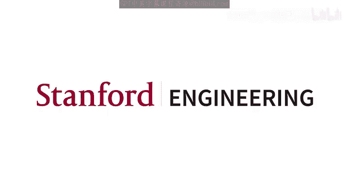
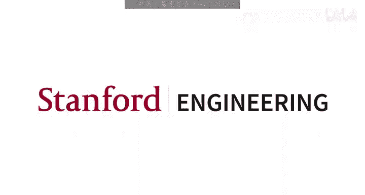

# 斯坦福大学《并行计算｜Stanford CS149 I Parallel Computing 2023》中英字幕（gpt-4 - P8：Lecture 8 - Data-Parallel Thinking.zh_en - GPT中英字幕课程资源 - BV1Y5V5zjEsX

So today we're going to talk about something a little bit different more more of an algorithms lecture than anything else。

 actually， not a systems lecture。 And reminder when we get together next week。

 we're basically moving the course back to hardware for a little bit。

 So Konlay is gonna take over next week。 We're gonna talk about cash coherence。

 I think is the next lecture。 No， no， sorry， you can do spark。 actually you gonna do spark first。

 Yeah yeah Yeah because follows the so sorry we're not gonna actually talk about hardware just yet。

 but Coonley will be lecturing next time。 Okay so but everybody's doing okay。😊。

Alright， let's kind of get to it then。 So this lecture， sometimes like people come up to me and go。

 I've never thought about things that way。 So what we're going to talk about today about everything in the course so far has been thinking about parallel computation in terms of。

Of threads。Or in terms of a very， very simple sort of organization of let's do something to every piece of data and array。

 that's basically all we've done so far is I've given you a arrays of stuff and you you've essentially performed a loop body on those arrays or you've thought about。

 okay， I'm going to create these threads and this is what this thread is going to do。

So today I want to。Elaorrate on and go into more detail about this way of thinking of。

 I have a big array， and we're gonna do something for everything on the array。

 except instead of just run a function on every element of array。

 we're going to start expressing computation in terms of。😊，A richer array of。

 a richer set of primitives on， on arrays or collections of data， okay， so。First of all。

 just to ground this， remember last time when we talked about GPUs。

 and I said something about the total number of execution contexts is about 163000 on one chip。

So that means that you probably want to be working on data sets of at least that size。

 otherwise you're not going to get the full complement of parallelism or latency Heidi。

 So hopefully at this point in the class I have established。😊。

That even if you're working on a single chip。You need a lot of parallelism。

Like you need to actually be working on programs that have hundreds of thousands or more pieces of parallel things to do。

 otherwise you're going to be in a bit of trouble。And actually using these things。

 So what we're talking about today is， is not gonna be outlandish at all。 right， Like， so， you know。

 like， if you're just gonna write code for a reasonable sized GPU， we're talking about。

 you gotta have parallelism in the 200000 regime， okay。All right。So。Also so far in this course。

 just a little bit more of a background， I think that whenever we throw a piece of code up on the board or I ask you to do a programming assignment。

 step one is almost always where the heck are the dependencies in my program because if I know the dependencies or equivalently if I know where there are not dependencies that's where I'm going to get the perism。

So here's an example of just like a simple set of expressions。

 And I just wrote out the fundamental dependencies here in this graph。

 Like I cannot execute an operation。 That's a node in that graph until I have executed the prior ones。

 And then you know， in part or I guess part B of your assignment， that's， in fact。

 you're understanding dependencies and respecting them。😊，Okay。So everything we're going to do today。

It's about。Writing code in some operations。Where we're going to just assume that someone。

Has really good， widely parallel implementations of those operations。

So instead of thinking necessarily about the dependencies。At a fine grain， I'm just going to say。

 I'm going to try and boil my program， my algorithm down into calls to these functions。

And these functions are known to be written in a manner that they can execute highly。

 highly parallel。So the thought process is， well， if all my code calls these functions and and all these functions are highly parallel。

 then any of my programs are also highly parallel。 That's the basic gist of things。Okay。

 and you do do this all the time， right， for any of you writing nu code or。

 or pick your favorite tensor language or something like that。

 You allocate variables like the like some big array A or some big array B。

 and you use operations that are。😊，Operating on those arrays， those collections。

 right like in this class， if this example， if A B and C are these big nup vectors。

 then the operation plus is an operation that you hope is implemented as fast as possible on those two arrays。

 You don't think about threads。 you don't think about dependencies or anything like that。😊。

So I want to just generalize this notion of a numpy array a little bit and to give it a name I'm going to call I'm not going to call it tensors or vectors because the kind of vector has a specific meaning in C++ I like the term sequences which I've adopted from from other researchers and other colleagues of mine and so I want you to just think about a sequence as an ordered collection of elements so it's not a set it's ordered。

😊，And different languages have different data types that basically embody this concept。

 Like in C plus plus， there's actually a sequence in Scala， It's lists in Python。

 you can use data frame or an ump array， arguably in in Pytorrch or tensorflow， you have tensors。

 the important thing is that unlike arrays。 So in an array， you can， you can just say。

 I want the element 43 at this position。 And you go， you get access to it。😊，Unlike arrays。

 programs can only access elements of sequences。Through very specific operations。

 And that's the big difference。 right， So when you write your IS PCC code， you write your ka code。

 your C code， if I give you an array， even though you can think about it as for every element in the array do X。

You can actually， in your code， you can write a sub I。

Which means you could access any element at any time。Now we're going to restrict that。

 right and the ability to access A at any time is the way you create dependencies that can really blow up your program。

 You're like， oh， this iteration of the loop accessed a sub I。

 but next you want to access a sub I again， maybe there's a dependency there。

 So we're just not going to let you do that so that your code is free of dependencies。Okay。

So let's talk about the first of these specific operations that you are very familiar with。

 we just didn't really call it as such， so that's an operation called map。😊。

Almost every piece of code we've written in this in this class so far was， was basically a map。

 It's taking a function and applying it to every element of an input array to produce an output array。

 Now， how many people have seen this more functional language syntax。 You know。

 like the A or O B syntax。 have you seen that。 So a couple people has has everybody seen it。

 I not seen it。 just， okay， so plenty of people have not seen it。 So map is。

 is a higher order function。😊，Because it takes input variables。 So in this case。

 the arguments to map are the input array A and maybe B， and this output array B。

And mapP also takes another argument， which is a function。So let's just say the input collection。

 excuse me。 The input collection is a collection of integers。So then。

 now imagine a function that adds。2 to an integer。Okay， so it takes this input and integer F of x。

 and it returns x plus 2。So that function has signature int to int， right。

 inputput argument is an integer。 The output argument is an integer。So this notation here。

 this Aarrow B， just says it's a function that takes this input， something of type A。

 like an integer。And output something of type B， which in my example here is is also an integer。

 So if we look at the actual signature of the map function。The map function takes two arguments。

 It takes a function。Like， add2 to something， which in this case， let's say is a。In my， yeah。

 so sorry。 in my， in this program， what is my program doing， It's adding 10， Excus me。

 So in this case， my function is adding 10。 So the function takes an integer to an integer。😊。

And so map takes that function， which is integer to integer plus a sequence of integers and produces what。

Out another an output sequence， which is of type sequence of integers。

 If I gave map a function that took integers to strings and applied it to a collection of integers。

 what would my output type be。😊，Question of strings， right， exactly。

 So all I'm doing here is this is， a functional notation that says map takes two arguments。

 The first argument is a function of A to B。 The second argument is a sequence of type A。

 and the output is a sequence of type B。😊，So if you take programming languages or much better a class if you'll see that。

 And you know， it's not quite so elegant in other languages like C plus plus。

 but we have all that functionality。 like， okay， there's no actual， know I have a sequence here。

 which I'm actually representing as an array。 and I have a function from the standard library transform。

 which takes in some sense， this is a pointer。 is yeah this is iterator starting at the beginning of a。

 and this is a plus 8。 So 1，2，3，5。 This is the end of the array。

 So basically this is just defining a sequence。😊，And it says。

 please apply the function F to all elements of the sequence and put your results here in pointed to by this iterator。

 So it's the same idea， just， you know， like everything in C plus plus and a little bit jankier syntax。

😊，You know， a lot， lot more clean in a functional language like Haskecoll。 I have a sequence A。

 I have a function X， which takes x to x plus 10。😊，And then if I map。F onto a。

 I get a new sequence B。Despite me ripping on C++， I would still write this code。Okay。

 so here's a question。😊，Now， put your head， you know， as the implementer of map。

So now you're implementing the map library。 Is this something that you feel very confident about being。

Parallel。Absolutely， because by the definition of the function。Every invocation of the argument， F。

Is peril。 And by the way， F is only given access to individual elements of the array， right。

 like F is just x plus 10。 The only thing F knows about is x。So there's nothing F can do。

Accidentally， for example， to create a dependency。And not only that。

 the implementer of F doesn't even have to think about operating on collections。 Theer F just says。

 just give me one element， and I'll tell you how to， how how to process it。 And that's a nice。

 clean way to think。 Okay， so how would you let's say I gave you， I told you to implement map。

 And I said， it needs to work on sequences of arbitrary length。😊。

And you're going to get some black box function F of x。How would you implement that？

If you want to do it in parallel。で、なか。Yeah， we could if we have so you could actually say。

If I had like the source to F， I could recompile F in a Cdy mode。That'd be pretty cool。

 But that Sim thing is only gonna let's say， let's say it's only gonna do 8 things at once。

 So what are you gonna do about the fact that I could give you a collection that might have 100000 things in it。

😊，哎。 I could spawn threads。 I could spawn like I， I could create a worker pool of threads and those threads could all execute this thing。

 You know， when I first asked the question I was thinking about is imagine I gave you a C plus plus function already。

 know， a header file。 know， didn't necessarily even have to recompile the thing。 You just call F。

 and you can call it sequentially or you could spawn a bunch of threads and call it in parallel。

 You know， in general， like here's my little implementation of map given F on sequence S would be partition sequence S into P smaller sequences。

 Let's say if I had P processors or P threads。 And for each sub sequenceequence S I in parallel sequentially just apply map to。

😊，To produce a partial output。 And now I can catnate all the outputs， which is basically like。

 I'm going to create a worker thread tool。 and those threads are going to process different elements of the sequence。

😊，Nothing too fancy here。So this is pretty easy。All right。

 so now let's go to some more interesting operations。

So here's another operation that's extremely important， used all over the place， it's called F。

So fold， if you read that signature， takes a B， takes a function。And that function F now。

 instead of taking A to B， takes a pair。ItTake an A and a B and produces a B。So I see people nodding。

 that's good。 And so fold takes sort of like a starting element B。

 that's not all that important right now， but it takes that function F and a sequence A and produces what。

Single elements。 I'm having a little bit of a problem here。 One second。 Okay， so if we， you know。

 if we write this in Scala， you know， here， here's an example of F left takes an A and a B。 Yeah。

 exactly。 So it， it takes a sequence of A's。😊，A function that takes a A and a B。Produces a B。

 and then essentially， iteratively applies this。 So hopefully， you know。

 just make sure that you can confirm that fold left with the function 10。

As sorry with the function plus， not the function 10。 The function plus takes an A and an A to an A。

 right， int an int to an int。😊，So this function is expecting a sequence of integers and produces a single integer's output。

 And the result is what the sum of everything in the array。😊，Okay， so in this case。

 fold fold of 10 on this sequence is is 53。So here's an interesting question。Can you paralyze fold？

So I see some disagreement， actually， some people are like， no way， other people are， yes， we can。😊。

It's marked the first problem of the first lecture we can。Do some small songs and then。Someで small商。

Okay， so good point。 So we have definitely computed the sum of a bunch of integers in parallel in this class。

 Abolutely， does anybody agree with this？Andbody disagree with this。

We have a little bit of disagreement， we don't know that the function were being passed as we don't know that the order in which we apply it will be the same every time if we have。

List of true and false under a function is exclusive more。て。Right。

 so if you interpreted my question as can fold。Plus。Be paralyzed。Yeah。

 we can think of some ways to do it。 as you pointed out， we've done it。

But this is general fold on any arbitrary function F。And we don't know the properties of that。

And a parallel implementation， for example， that chop this sequence up into sub sequenceequences。

In parallel。Folded maybe sequentially， the sub sequenceequences and then folded those results is not guaranteed to get the same answer unless you know certain properties about F。

 And in particular， in this case， F needs to be。啊。As。So there's。Some other versions of。

 of a fold where you give fold a little bit more information。Right， where you say， well。

 I'm gonna give you a combiner function。Also。And in this case， the combine or not in this case。

 the combiner function actually needs to take B to B。Right。

And so now I can split up my input sequence， do all of these sequential but parallel versions of this。

😊，And then on each thread， I'm going to get a single B's output， right？And then I can combine those。

 if I want。But I' pushed this off to the user a little bit， right？Often。

 it's the case that you care about that F being B to B to B， like the plus operator。And if F is B。

 a pair of B's to a B， then you basically also can specify F and combine with one function。

Does that makes sense。 And so as long as that F is associative。

You can perform a parallel fold by just giving a single F。

 And the way it will be implemented is that it'll apply F， F， F， F， F。

 and then it'll use F to combine everything。Note that F does not need to be communutative。Right。

 because I actually am still doing all if I， if I implement it correctly。

 I'm still doing all the math in the same order。Just needs to be associative。So all of a sudden。

 you know， for some fs， you， so for some potential Fs like plus。

We've got a parallel implementation of this thing。And now we have the ability to map data in parallel。

 and we have the ability to do sort of forms of data reduction。

 sums and averages and stuff like that。Now there's actually something that's cool that I don't have on on the slides or in this lecture。

 But think about the following。 Imagine you wanted to do like。😊，啊。

A dot product or something like that。 So you you first had a map。And the map actually took the pair。

 you know， a pair of elements。 or that's a bad example。

 But imagine you want to multiply all numbers by like 10。 That's a map and then compute the sum。Okay。

 so you would write that in the， in these primitives right as map times 10 on the sequence。

 you get out what a new sequence。And then you apply fold with the plus operator to compute the sum。

But if I， if I know the definition of these operators and I saw a program that was map and then fold。

You could imagine that I could perform a transformation to that function。

Which turned it into something kind of interesting， right， Like。

 like I would turn it into a fold that actually did the multiply。By。

 by some number and then immediately fold in the results。

 So you could start thinking about transformations that I could do。

 but don't actually require two passes over all the data。Provided that， you know。

 the definition of map and fold。And that's actually what these more sophisticated Giit compilers are actually doing on your Pytorrch code and stuff like that。

 Just so you you know。Okay， so let me give you another one。 So we have fold。

 which is sequence to scalar。Now let's think about scan。

So scan is sequence to sequence for an associated binary operator that takes an A and an A to an A。

 So let's just kind of simplify it here that that operator， let's just say that operator plus again。

😊，And so what scan compute is the repeated application of that operator up to and including the current element。

So if we look at this result here， the result of scan with a plus operator is the first element of the output is the sum of the all elements up to it。

 including this element and the input。😊，The second element output。

 the second element of the output sequence is the sum of all elements up to and including the same position in the input element。

😊，So the last element of the scan is going to be the， the fold。

But now I'm producing all of the partials。So first of all。

 do you see the difference between fold and scan， Like fold produces a single value。

 Sc gives you all the partials。 And if I had to implement scan sequentially。

 it might look a little bit like this。 You know， like youd do this in a second。

The first element of the output is the first element of the input。 and for I equals 0 to n。

 the output element is the previous output element plus the new input element。

So the question is going be， you know， is this parallel。

And things start getting a little bit trickier now。 before we move on， just as a detail。

 sometimes in some libraries， a scan will be an exclusive scan。

 and sometimes it will be an inclusive scan。 I have inclusive here。

 which is up to and including the current element， an exclusive scan is up to but not including。

 So it excludes the current element。 If you have an exclusive scan。

 how do you compute an inclusive scan。😊，大几份。Yeah， exactly。

 like you just take the output of the exclusive scanning， you would add the current element， cool。

Okay， so you probably have a sense of where we're going here。Now。

 we need to figure out how to paralyze something like S。Alright， so let's。

 let's think about this a little bit。 So， and again， let me get a little bit more formal。

 Here are two different definitions of， of scan， inclusive and exclusive， the output element。

Is always just gonna be the repeated application of that binary operator to。

 to everything that I've gotten to so far， including me， okay。All right。So。ignore my。

A broken and build， so let's just think about it。 So how did you go about this？

This is gonna be an inclusive scan， by the way。 And like you said， we can always just， you know。

 minus the the element if you want the exclusive。So let's think about this， how would you do it？

Any thoughts on how you go about it？I would like to start finding the sum Okay。

 so you're going to find the total sum。 Okay， so and how you well。

 we actually already have a really good implementation of total sum。 We know how to do that。Like。

 you don't even have to do。 Well， you do divide and conquer onto your threads and add them up。 Okay。

 so let's just say that we have a subrout that competes the total sum。 That's fine。

And that would cut take cost what that would be basically， if this is of length n。

 it would be n over number of threads。 would be the total time， right。

Becauseuse I would just break the array up into T pieces。 Everybody computes a partial sum。

 I combine the results， pretty easily paralyizzable。 So yes， we can do that。IWell。

 it's a reasonable starting point， but okay， let's keep going any other ideas。

I was thinking like one of the steps you could do is like imagine you split the sequence up it happen。

どうしか。I Okay， so what one thing we could do is we could just say。

 let's just say we magically had the sum of the first half。 Is that right。

 Is that what you're saying， And if we knew the sum of elements a 0 through a 7。

 I could definitely apply that sum to all of these elements in parallel。😊，It's kind of interesting。

Pform can can something with。多。Okay， and so basically that you're just taking this idea of dividing the thing in half because essentially if we performed a scan over the first half。

Then we could just take that result， and then we add it in the scan results for this half。

That's correct。 And we could break that up into as many pieces as we want。や。

the proposed one of the course。You can whatever you want thats。

Yeah that fold is basically this way to do the parallel sum， right Okay， I like this。

I think there's some good。Good answers here。What if I make it even harder？And say。

 let's imagine we're running this on a GPU。And。And I'm going to come back to some of those ideas that you just told me。

 and we have the same number of threads as we have elements。

Let's think about this in the massive parallelition machine。I want a really parallel solution。

So let me just start hinting at a few things。What did I do？So parallelism that's now， you know。

 this O of N and， you know， I just added up every neighbor。Now， what did I do？

So the notation in my slide is a value。 I'm showing you the the value。

 like all the values that go into the sum at a current location， right， So after the first step。

 the sum of a 0 and a 1 is in the second element。 And after the second step， the sum of。😊，A0。

1 and 2 is in the second， or really actually should look here after the first， at the two steps。

 the sum of a0 through three is there。And if I keep going。At some point。I have my scan。

So first of all， what is the？If I did a scan sequentially。How much work do I have to do。

 Remember that C code I just put on the slide。How much work did I do if beside the array was n。

 the cost of the algorithm was？Oh that。Walked down my array。

What's the cost of this algorithm in terms of the amount of work done。

N log n because the first step I do n work or n over two work， and then I do N over4 work。

 and then I do。Oh， no， sorry， sorry。 I don't do N over four work。 I basically do N over two work。

 And then I do similar work。 Yeah， So， so it's n log N cost。 I have O of N work， and I have N steps。

Now what's the longest chain of sequential steps， which is often something we call span in a parallel algorithm。

 like if you had an infinite number of processors， this would take log n time。

The total amount of computation you do is N login。So I'm doing an O of N where N steps。그。

I don't like the fact that I asymptotically。Increased work that I'm doing。Because like。

 you know I mean， if I'm a parallel machine。And I have like， n is a million。Well， again。

 it's not trivialal。So it turns out that there's a very， there's a way。

 And this is actually a pretty clever algorithm that was came up with a guy I think this was guy Bullock that did this。

 where I can do。😊，I can keep my log in span。And I can be more cleverber。And get it an O event work。

And here's a little bit what the algorithm looks like。😊。

And this is something that I think is a lot easier just to stare at。On your own。

But the gist of this is that there's two phases now。There's like。

 if you think about there being a combining tree in phase 1 and then like a splating tree， you know。

 an inverse tree on phase 2， There's there's And if you read documentation of this on the Internet。

 people will will say that there's an upset phase and a downset phase。

 So the upweet phase is computing these partial sums in this tree where。😊。

Kin of to the point that you all were alludding at， look at this。

 here is the sum of the first the second half of the array。

Here is the sum of the first half of the array。And then along the way。

 we've computed some partial sums。So if you look at it， I have the first half here。 Sorry。

 the second half there， the first half there。 And then I still have these interesting partials throughout。

Throughout the result of my combining tree。And then very much to your point earlier。But you said。

 what we're going do is we're gonna to take that partial sum， like the back half of the array。

 And if we just had some way to apply it to the appropriate elements。

Or the partial sum from the front half of the array， for that matter。

 And apply it to the appropriate elements。We could just kind of rebase everything。

So look what happens after you do this up sweep， first of all， we're almost done here。

We're done here。And so we take that partial sum and shove it over here。Now this step， I just overrot。

 and then it basically becomes， take your partial sum and bring it back。And then， propagate it。

This's kind of the way the combining tree works。And if you look at this， this actually only does。

A total of O of N operations because the first step is n。 The next step is n over 2。

 The next step is n over 4 and so on and so on。 And that telescoping series。

 as you might know from 1，61 or something like that。😊，Is O event， right。

 Now there's an extra coefficient。 And's actually two times that because I take twice as many steps。

 So it's still log n in steps。 but it's actually theres a constant there， which is， which is 2。😊。

So this is something we're gonna have you implement as like your warm up coupa programming assignment before we get into the meat of assignment 3。

 So you'll be intimately familiar with with this now。Yeah。

 so I think some interesting things to point out is like， it's awesome if you're a theoretician。

 O of N work。😊，Log n steps。 But if you look closely。You know， there's， there's an extra。

There's a factor at two here。Theres a factor of two here。

 And there's also some other things that are kind of not great， like。

You are not using all your processors every single moment。 So even though I said。

 let's make use of an infinite number of processors。You know， as the series goes down。

 you're using fewer and fewer them every step。 And also。

 data is kind of moving around all over the place。So there are some reasons why if I actually ask you to implement this in practice。

 like in your homework， you're actually just gonna do this， this algorithm， you're not meant to like。

 make it really fast。 It's just more of a programming exercise。

 If you are actually working at NviD and trying to make the library for scan。😊。

You would have to work a little bit harder。Okay， and now let's's。

 let's talk about that just a little bit。 So now let's think about a simpler problem， actually。

 paralyzing this onto two cores。Right， so， you know， let's just say we cut it in half。

 We only had two processors， and we were running this algorithm。Well， first of all。

 you have perfect workload balance。 That's not a problem。

 You actually don't have a lot of communication between those processors， which is pretty cool。😊。

If you look carefully， look at those red arrows， the only data that ever moves are two elements。And。

 but you are bouncing around memory all over the place。

So even though one processor is doing this side and the other processor is doing the other side。

 you're bouncing around memory。 And I think as you're starting to to get in this class。

 that's probably not such a great idea。Okay。And so in the spirit of doing the simplest thing first。

 if you gave me two threads and said computer scan。I would probably do something like this。

I would divide the array in half。 I would do two sequential scans， which is O of N。

Running straight through memory。 I would get the base。For the first half。

And then I would parallelze the application of the base to the second half of the array。

If we're on a shared memory multiprocessor， the fact that information computed by P2 has to get over to P1 is not that big of a deal。

 I'm just reading from the same memory system Okay so you know the the very， very。

 the thing that you would do probably in one hour， if I gave you this as assignment would probably work pretty well。

Oh， sorry it' all my line。Now it's clear。Okay， so。Let's think about a different type of machine。

Let's imagine that you are trying to compute a scan in IS PCC。Or actually a scan in Kuta。

 where you kind of know that all of your threads， your workers are actually operating in SIMdi。Okay。

 so instead of saying I have two threads and they're gonna be on different cores or8 threads they be on different course。

 just imagine if your workers were sim lanes。OkaySo let's take a look at this piece of code。

 It's written in Kuda， but you can think about it just as ISPC if you want。 It really doesn't matter。

 This is pretty interesting。 Look at this。 So this is scan。 It's called scan warp。

 because this is something that's called by all every couda thread individually in all the threads in a warp。

 which sort of share the same instruction stream。 or you can think about this as if I wrote this as ISPC code。

 it would be scan of a program a gang。😊，And so every instance in a gang would be calling this function。

So for now， just imagine that like。A bunch of， a bunch of threads were calling this function。 And so。

 first of all， every thread computes its lane。Which is basically its program I D or your program index。

 And since remember last time your， your thread index in Kuta could be whatever anything in your thread block。

 you， you can make a thread block of 2000 threads or 256 threads。

 But those 2000 threads were gonna be running in these little groups of 32 warps。😊，So what I do here。

 and this is pretty low level hacky code， is I first compute my ID in the warp。😊。

Which is to take my thread I D， mod my 32 to get my actual location in the warp。Okay。

 so now I I'm making assumptions about the underlying implementation。

And so then I write basically this five lines of code， which says if I am if my lane is0， do this。

 if my lane is one， do this and so on and so on。 And can you confirm that this code takes five steps。

 So first of all， why is there five steps。Log of。32， right？

So there's five steps and every step is just an addition of two numbers。

And based on my thread I D or my index in this case。

 some some threads stop participating after a while。Okay。So how much work does this do。And log N。

 right， like same thing， right， Like in other words， there are five instructions。

 Let's ignore the if statements。 Let's just say they're free for a second。

 There's five instructions of actually doing math。😊，That's log 32。

 and every single one of these sort of lines of code is doing how much work。In an orb。Not all。

 it's one thing per thread。 And there's 32 threads。 So， you know， N， oh that total， right。

 But every thread is doing one thing with our n threads。 So I'm doing overall n log N work。😊。

And my span is。5。Or in other words， like， if you put a stopwatch on this program。

 you would say it gets done in five steps。Okay， so。What would you。

 What would this code look like if I changed it to use the more advanced O of N algorithm。

How many lines would it be？There be five lines for the up sweepep。

 and then another five lines for the down sweep。So。Wait a minute。 That's weird， right。

 So my n log n algorithm。Took five cycles。My O of n algorithm takes how many cycles。菜。

How can that be the case？投资。Well， yeah， the coefficients， too。 But where did the what happened， Like。

 I'm using the same number of resources， right， I have like， I have like the， you know。

 in some sense， I have this simdy block of execution units that can do 32 things at once。

And that 32 things at once takes five cycles to do N log N work and 10 cycles to do O of N work。

Right， so， so the fact that like the only thing this processor can do is the same instruction。

So the fact that I'm like doing kind of some redundant work。Is actually kind of O。

 The fact that I did better would mean that I would have all this underut of my s lanes。

And so I do less work， but I spread it out over multiple sort of highly incoherent instructions。

So it's loss。So you really have to think if you are implementing a library for scan。

Is depending on how the parallel work gets mapped to a machine。

Different approaches may be very different。 Like， if I'm running on a machine that has thousands of independent processors。

 I might use that work efficient formulation。If I'm running on a machine with just two processors。

 I probably do the simple thing that you all suggested。 You know， like I divide it in a half。

 Comp a scan， Comp a scan， move the data over and then finish this up。

 If I'm running on a S processor， this N log N thing is actually the best thing to do。😊，Yeah。

So maybe instead of separating into。With the big off and let's go back。

Well you split it into between like the8 first in the8 master。

 instead we literally so that we do80 and8 at the same time， it's the same operation。

And as long as have a barrier at the of each， you friends don't take Well。

 I think that's the the problem that you're solving was is not。Well。

 the problem that I just discussed is， is a different problem。 The problem is the following。

 Imagine that， like， okay， so this is 16 wide， right？ Imagine you had a 16 wide 70 unit。

What are the lanes doing？Here。There's nothing to do。 That's the actual problem， right。

 Whereas if I had a machine that only had two execution， two threads or something like that。

 The fact that we're not doing much in in in every step is great because like the processor gets done with the step and then moves on really quickly。

So your， your work efficiency， actually， like， like whether or not you care about work efficiency or raw perils and can actually kind of changed based on how the machine works。

And if I was to do this for real， I me go back to Rai。If I was to do this for real on an Nvidia chip。

 for example， I would take that little piece of code that I gave you。This one right here。

 that can compute a scan of 32 elements in 5，5 s steps。And then if I had to do something for。

 let's say。128 elements。 How would you do it？Yeah。We could do the n log N thing， but I'm actually I。

 I， I would rather not take this N log N。 Like， I only want to take that n log n asymptotic if I don't have to pay for。

 you know， I don't have to pay for it in some sense。 Like， so what I would do is like。

Here's what I do。 If I have a sequence that one warp can get something done in five cycles。

 and I get 128。 Give me 128 things to do。I'll just have four different orps do a 32 wide scan。

And now I have four partials。Let me just scan those。And then I push the bases back out。

 and then in parallel， I update everything。So， you know， I did this for 128。

 but imagine you had a 32 squared scan，1024 elements you would do in parallel。

 a bunch of warps produced 32 scans in five cycles。

 and you stick those partials together into 132 wide block。

5 more cycles scan that and then take those 32 partials and put them back to the blocks and then in parallel。

 do that。😊，So it would take five cycles to do the original scan，5 cycles to scan the scans。

 and then one cycle for every thread to add。The the partial back to itself so I could do it an 11 cycle。

For 11024 elements。And just for kicks， that's， that's the code for doing it。

 I actually give you this code。 You call it as a subroutine， if you wish in assignment 3。

 you don't have to understand how it works。 But， and then if I wanted an even larger scan。

 I would take my blocks at 32。😊，Then do 1024 by breaking it into blocks of 32。

 and then I distribute my blocks of 32 across all of the co of thread blocks。

And I would do that in parallel and scan those。 So I'm actually mixing this data parallel scan with like a more conventional。

 sequential algorithm。 So I'm doing data parallel when it helps， the D when it helps。

 And then when I have far more parallelism than I have processors。

 I'm kind of backing off and doing the more conventional thing。😊。

So I just wanted to kind of go through that sequence just to let people know that like there's some real sophistication in implementing these data parallel primitive very efficiently on a machine。

 And I encourage you in assignment 3 to like basically， we， we say， hey。

 learn how to program some kuda by doing the O N algorithm。😊。

And then you move on to the actual assignment。 And they say， by the way， if you have some extra time。

 why don't you try to make your， your scan really fast。

 And here's the Kuda library for scan and see how close you can get to it。😊。

And I have a feeling under the hood， they're doing this kind of stuff， I don't know。

 but it'd be interesting to see if anybody can beat Kuta's standard library function for scan。

But as a programmer， you just kind of think if I call scan。

 it'll be as fast as a good programmer can make it。Im write late on9 school， so actually poverty。

Probably not so much within a tiny little simdy block。 And me ask。

 do you think there's any value to if we were running a Simdi instruction。

And we knew Elaine was dead。Do we gate it dynamically？I mean。

 according to Bill Doley these days with the sparse tensor stuff， yes。一く。

So I think it's not astronomical savings， but if you're probably trying to say the factor of 1。

5 of power or something like that， you probably do。

 I'm sure NVdia chases those types of optimizations。

Probably the bigger the same with is probably the more you consider doing something like that， but。

You're better off optimize。You know taking advantage of the the war capable that to optimize the use of the。

嗯，OK。So let's let's just ramp up the complexity a little bit more because， that's fun。

 And we're now in the back half of the class。 So here's a more interesting primitive。 So。

 so let's say say we have scan。😊，A very common sort of thing that you might do in applications is you don't deal with sequences。

 but you might deal with sequences of sequences。 So let me give you some examples。

 like for every vertex in a graph， for every edge of that vertex。 So I have a sequence of vertices。

 and for every vertex， I have a sequence of edges， standard graph representation。

 or like if you're in scientific computing， for every particle in a simulation。

 for every particle within some range of it。😊，So it's like a sequence of sequences。

RightFor every document， D in a collection for each word and D。

 So I have a sequence of sequences and the sub sequenceequences that are all of different length。

Okay， so there's kind of two levels of parallelism of these problems or sort of the parallelism over the outermost loop。

 And then there's potentially， if you care the parallelism over the innermost loop。So imagine。

 for example， you're running on a GPU。 and you need 200000 things。 Imagine if you had a graph with。

500 vertices or 1000 no， not if it's too small。 like 10000 vertices。 but each vertex had on average。

 like 10 to 20 edges。So if you paralyze just over the vertices， you don't have enough parallelism。

You need to actually find that parallelism over the edges。So these are the types of problems that。

That fit into this fold。 So a segmented scan takes this input， a sequence of sequences。

And then applies the scan operator in parallel across all of the outer sequences。

But apply scan individually to each of them。Right， so， so what's going on here。 This is the plus。

 So let's take a look。 Let's confirm that this is correct。 My first sequence is  one and 2。So the。

 the scan exclusive should be 0 and  one。 And that's correct， right。

 because like the exclusive first element is nothing。 that's 0。

 And the exclusive second element is just everything up to and include and excluding the second element。

 So it should just be one。😊，The exclusive scan here is 0， and then the exclusive scan here is 0，1。

1 plus 2 is 3， and 3 plus 3 is 6。Okay。So that's segmented scan。

 And you can think about implementing segmented scan often is you get as input a a sequence of as sequences might be encoded as two sequences。

The first sequence is just a list of， you know， a regular flat list of numbers。

 and the second sequence might be some binary flags on which， which one to start。

On where the sub sequenceequs start。 So in this case， the first element is the start of the sequence。

 and then 1，2，3， third the one fourth element is the start of the sequence。

 So imagine that this was just given to you as an array。And you got that bit flag。 You can say， oh。

 I know the first sub sequence starts here and the second sub sequence starts here。

It's a very compact representation of a sequence of sequences。 If you care about performance。

 you're doing any graph processing， this is how you implement a graph。

Is like these numbers would just be the list of edges。

And then you just basically get a number of edges per vertex here。 And thiss very common thing。 Okay。

 so we're not gonna go over how we implement it， but there is an algorithm。

 which is really fun to read on your own。😊，That adapts the work efficient scan that I just showed you and makes it work on sequences of sequences。

So you just give it a sequence and you give it these flags and the output in O of N time and log n span。

Is。That result， the sequences of sequences。 And the work efficient scan looks a little bit like this。

 segment of scan looks a little bit like this。 The way to understand the algorithm is this figure。

 which you can think of， I mean， looks complicated。 But really all it is， is it's the old algorithm。

😊，Except actually， you're just propagating those subsequent start flags along with the information。

 And what you'll see here is that whenever you need to like have a back edge。

If there is a start flag， you just skip the propagation of the back edge。

 So if you go into the code that I had， it basically is there's some if statements which say if the flag is one。

 do something else don't， don't do something。 So， if you understand the segmented scan。

' sorry the regular scan， you actually will understand the segmented scan。

 if you just think about it with the information， I need to process to pass these flags。

 And if I ever see a flag， that should stop me from propagating information over a boundary。

 So it's actually not not too big of a deal。Now， why do we care about segmented scan。

 here's a great example， Sprse matrix multiplication， something that we do all the time。

 and know these guys are nodding their heads because they're a big fan of sparse matrix multiplication。

😊，So here's a matrix， so here I have a dense vector， my x's， and I have a sparse matrix。😊。

And by sparse， I mean， most of these values are zeros。Okay，And this is pretty important， right， Like。

 if this was an n squared matrix and like 99% of the values are zeros。I can store it much。

 much more compactly and sparse matrices appear everywhere in the world whenever you have sparse connectivity。

 like for example， the way Amazon might store customer recommendation information。

 I have me and I have all the products that I have bought。😊，But like the。

 the cross product of all their users and all of their products would be a very big matrix。

 But in practice， very few people buy very few products。

 So they might implement it or represent it sparsely。😊。

So one way we can express this sparse matrix is in a in a format called compressed sparse row。

 So let's break this down。 First of all， it's compressed because it's we're not going to store all the zeros explicitly。

 and it's sparse row。 So the way way this is going work is I'm going store all my nonzero values。😊。

As a sequence of sequences。So if you look carefully， the first row has non zeros，3 and one。

That's my first sub sequence。 The next row has a non0，2。 The nextix row has a non 0，4。

 The last row has three non zeros。So I have my rows are stored as sequences of sequences。Now。

 this is not a sufficient encoding the matrix， because for every nonze。

 I need to know what column it's in。Right， so I also have for every every non zero。

 I have another sequence of sequences that that is what's column it's in。Right， so or equivalently。

 I'm sting for every nonze。 and I'm storing a value in a column。

And then I have basically an array which tells me in this array。

 where is the instead of a bit vector。So before I， I give you， let me， let me。 I I have， I'm showing。

 I， I noticed I just made a skip a big jump。 Okay， so here。

I use these Boolean flags to tell you where the start of the sequences are。Okay， so if you gave me a。

 as I， if I just scan through this array， I get all the starting points。

Another way to encode the same information would be if it's a matrix。For every row。

 just give me the starting point of the row。So here's what I did here was since this is a 2D matrix。

Where is the start of row0？In this big flat array， like were the the sub sequenceequence of row 0 starts at 0。

 The sub sequenceequ of row 1 starts at index 2。 Sub sequenceequence of row 3 starts at index 4。

 Subsequence of row 4 starts at index 5。 Okay， so I'm encoding my sparse matrix as a list of non zeros。

😊，The column index of those non zeros。 And for every row， where does it start in these arrays。

So this is commonly called a compressed sparse row format。

 compressed sparse rows because it's row major， like all these data structures are where the rows start。

So if you had segmented scan and map and some other things。

 let's see how we can do this in terms of our primitiveence that we have in the lecture so far。 Okay。

 so first of all。嗯。Given all the non zeros， I need to multiply them by some X。So for every non zero。

 I know the column of the nonzero。Because it was down in my columns array。

And so I first need to perform an operation that takes all of the X's and produces a list or a sequence。

 that's the same length。😊，As my sequence of nonzes。

So I actually haven't told you about an operation called Gaer。

 But you should just let's just assume for now that I have the ability to， basically。

 for every column here。I need to make a new sequence that is pulling elements given by this。

Pie of data， the column index， I pull x sub columnn index， and I make a new array of x values。

So that means that I'm going to be duplicating， oops。Elements from X。Into this array。

And then I just do a map with the operation multiply。

 So I need to map every non zero in values against my gathered array from X。

 So now I have a product of every non value。😊，Now I need to sum across the rows， right？

So that's a segmented scan with a plus operation， so I have all my products。

I can create the flags array that we need to say， where's the start of all of the rows。

 and segmented scan of this data with this start array gives me all these partials。

And then the last element of every segment。Is the sum of all of everything in the row。

So if I go grab the appropriate values out of this array， I get the sum of everything in the in row。

 So I've done a sparse matrix multiplication that has parallelism proportional to the number of non zeros。

😊，Not proportional to the number of rows。And that can be quite cool if my total number of non zeros is a lot higher than the total number of rows。

😊，And this is going to basically paralyze about as fast as map does， no problem。

 and about as fast as segment and scan does， which is also going to be no problem if we have good implementations of those things。

Yeaher。I mean， that that could get you a little bit。 That could get you a little bit。

 But you have to do the gather some， like， if you wrote this in like normal C code。

 you would have to go get that gather。The only difference here is that we are actually materializing that gather as a length and dense array。

And then iterating through the dense array， whereas if we did it with a memory access。

 we would never create a dense array。 We would just go get the data， go get the data again and again。

So this just hopefully gives you like a taste of how fun like some of these primitives can be that you can。

 you can boil down irregular parallelism。😊，Like now I can have different rows with wildly different numbers of non zeros per row。

 I flatten the whole thing and treated a big data parallel computation。

 And that could be pretty cool。 That could be pretty cool。😊，Yeah。

 so so I talked about you know this fictitious gather。 And really。

 I should have thrown this up earlier in the slide。

 Two other really useful operations are gather and scatter and gather and scatter your data movement operations when you're thinking data parallel。

 So let me illustrate these for you。 So gather takes an index sequence and a source data sequence and produces an output by。

 you know for every input element and the input sequence uses that as the index value and it grabs the data in order to densify data all over the place。

 That's what we did for that matrix the vector X just a second ago。

 and then scatters just the opposite， given a dense set sequence in memory。

 And a list of indices on where to put it scatter potentially sparsely the data out to a bigger array。

😊，And these can be very costly operations because on one end of the fence。

 you are definitely moving data to some unpredictable data dependent place。嗯。These days， actually。

 on CPUs， you have an actual A V X 2， a SimD instruction which performs a gather。

So that S instruction takes a index vector。 So here's a vector register with indices in it。

 It takes a pointer M base。And the result of executing the gather is that it will de referenceence me based sub。

Index element and bring that data into the result here in the the。In the， in the vector register。

 So in IS PCC。When your program just says。Program index， food does a sub something。

That's potentially a gather operation。 right。 And if you think about how this can be tricky。

 these are arbitrary indices to be whatever they want。

 So it's very possible for every single lane of the vector to trigger a cachem on a different cache line。

😊，It's very possible for every lane of the vector to trigger a different page fault handler。

So this can， this can be a nasty operation to get right。

So that's why it's very nice that when all of those program instances in ISPC or in KUuda access the adjacent elements of the array。

 you don't need to gather， you could have a vector load which just says load the eight elements starting at this base pointer。

😊，So there's a big difference between vector loads and non vector loads。

There are some fun tricks on like， it's like I always， when I learned all this stuff， I would。

 I would kind of go through a lot of this stuff。 Like if you have gather。

 can you turn it into it like a scatter。😊，Well， it's pretty easy if the scatter is actually a permutation。

 right， So if the scatters a permutation， meaning that all of the indices are unique。

And they cover everything， and they cover all elements of the array。 Well， scattering。

 according to an index is actually just sorting the data according to the index array。

So you might find yourself on platforms where you have a gather， but no scatter。

And so a common trick is to turn one into the other。Another version。

 if you don't have scatter is pretty fun is But， let's say you don't have scatter。

 but you you do have sort map and segmented scan。So here's a scatter opt。

 So what it means is scatter the value to this location and perform an op。

It's actually pretty common if you're doing like a histogram， right。

 Like you compute a bin that you need to add in。 and I need increment1 to the bin。So look at this。

 okay， so for all elements in the sequence。😊，Yeah， what we。

 what we the the operation we w to do is for all elements in the sequence， compute， take the index。

And I want to put the value into that target location， but not just store it there。 like， do some op。

 like， take the current value and add the new value into it or something like that。Okay。

 so let' the first thing I decided to do here。Is。I decided to sort the index array。

So I have the list of indices。Where I need to put those things。

 And I decided to sort them and notice that those indices are not unique。 So I'm。

 I'm pushing multiple values to the same location。 So you can imagine we have a parallel sort。

 We didn't talk about parallel sort today， but you can imagine that the the data parallel library has sort。

 So now I have the input sorted by the index。So I did a sort of the input data according to those indices。

Now， the next thing is I can compute the start。Of each range of values with the same index number。

So this is my。Sored index array。 And you could think about doing some form of a map that said， okay。

 if I am the same as this one， I'm not a start， but if I'm different from this one， I am a start。

 So you can think about in parallel。Figuring out every single element of the array says。

 am I the start of a new sequence。I just made that bit vector。Completely in parallel。

 So imagine a coa program， which for every element in the vector or in the in the sequence。Says。

Take my thread I D， get the value in my position， get the value in the previous position。

 And if they're different， I'm gonna to start the sequence。 So return 1， else return 0。

 perfectlyect paralyzable operation。😊，Now， given this sequence and given this sorted。

Now perform a segmented scan on that sequence。And now I have all of those operations。

Conscerted in the appropriate memory address。That interesting。Oh。

 and then I guess the last thing I have to do is I would have to scatter the results back out to the。

 to the target locations。 So now I'm starting to do some pretty interesting stuff。

 which is these basic parallel operations。 And， you know。

 there are other parallel operations like filter， which is take a sequence。 Give me a。

 There's a function。 that's a predicate。 and remove everything from the sequence。😊。

Lets fit that property。Or a common operation in， in a lot of database kind of systems is given a sequence。

 create a sequence of sequences。 So given a sequence of pairs。

Create a sequence sub a sequence of sequences， where the sub sequenceequences are the key。

 followed by all values of the same key。😊，So imagine the key is a document and the value is a bunch of words。

 This would be like， sort all the words by document。So very common operation。

 a lot of data processing stuff。Okay， so let's talk about why the heck I you know。啊。

Why being able to think in terms of reducing complex things into these primitives can be quite useful。

 And I'm going to give you an example that is going to be shockingly similar。

So your homework assignment。So here's a problem that I took from a physics application。

So imagine I have a particle。 I'm trying to like， I'm doing some galaxy simulation or something like that。

 And I have all these particles representing stars or you know， Im doing a fluid simulation。

 I'm representing fluid by particles。 So in this case， I have a bunch of particles that are red dots。

😊，And the name of the game is， I want to create a data structure。Where。Okay， right。

 And then I've divided space up into 16 cells。So there's a grid over all of space， 16 cells。

4 by four grid。And then I have all these particles at arbitrary locations， X Y。

And what I want to do is I want to create a data structure where for every grid cell。Basically。

 this table over here for every grid cell， I create a list of particles that are in that cell。😊。

So in some sense， this is a sequence of sequences， right。

 The outer sequence is a6 a blink 16 and has cells。

 The inner sequences are the number of the particle I Ds in each cell。😊。

So that's what we want to create。 I want to create a sequence of sequences or a grid of lists。

 That's the data structure。 And I'd like to create this data structure completely in parallel。

 assuming that I have tons of processors， a lot of particles， but maybe not a lot of grid cells。😊。

The reason why this is a cool problem is this data structure is super helpful for any kind of physics simulation when you want say。

 I want to compute the forces on this particle based on nearby particles。😊。

And then what you might do is you say， oh， well， if I'm in this cell。

 give me only the neighboring cells。 and I'm only going to iterate over those particles。

 So it's a common end body simulation kind of task。

 So they have to make these data structures all the time。Okay， so let's think about the the dumbest。

The dumbest not dumbm。 It's probably exactly what I' would start with， right。

 probably the smartest first implementation。Which is this for every particle in P。

 Let's assume there's millions of particles。 Compute the cell containing P。

And let's just say I have a lock or something like that。

 take the lock on the cell or take the global lock and append P to the cell list see。

Pretty straightforward solution。 What are。Problem performance problems with my solution。

 Firsts of all， do I have a lot of parallelism。In of， well no， I mean。

 I have tons of parallelism over particles。That's true。 I can paralyze that for loop。

 but do I really have a lot of parallelism？People are saying， no， why not？

Because this parallel loop is basically going to synchronize on this log。Absolutely。O嗯。

How do I make things a little better？ So I'm， I have contention on a shared thing。

It's the shared lock。How do we alleviate contention？You can just duplicate that cell list。

 like think you mention that。Okay， so the one suggestion would be。

 I'm gonna make a different cell list for every particle for every threads， excuse me。And。

 and then we'll just in parallel。Deal with all the different cell list。 Now， in this case。

 this is for each particle in parallel。 So you can make a different cell list per particle。这什么意？で。

For every worker thread on the machine， let's make a different cell list。 Thats one。

 that's a good approach。 So what are the cost of that。

You have to have all those have to allocate all the steriles。

 And then I'm gonna have like some merge process at the end。

 And so if we were running on a machine that only had a small number of processors。

 or small number of threads， I love your solution。 Looking good。

 If we were on a machine that had a ton of processors。

 maybe creating 10000 cell list is not tractable。 And then maybe actually even merging those is gonna be a good fraction of execution time。

😊，Without dramatically changing the code， are there any other options。

 we have contention for a shared log。 Okay， so one thing we could do is have a walk for every individual cell。

 right， because like if I want to update the data structure in the cell， I should really。

 I'm not gonna to collide with people touching other cells So I could at least get 16 times less contention here。

😊，Maybe that will work。 Maybe it won't， or to certainly work with small number of processors for a large number of processors。

 It may not work because there' still be contention for， for these locks。 likes say。

 I have 100000 coa threads trying to grab 16 locks。That can be a problem。Okay。

 so we have massive contention with you saw and you told me already that we could actually move to a list of different locks or start to multiple different locks。

 You also suggested that if we have a small number of threads I don't quite have a I do have a slide on that。

 but it comes later is we could just duplicate the data structure， but again。

 like both of these solutions are probably not going to scale it hundreds of thousands of threads。😊。

If we wanted to scale to hundreds of thousands of threads， any other ideas？

Oh probably something Mike we did earlier。Yeah， we going have to go data parallel。

 but I want to hear I was just saying if they're all like equally can we just。Here you go this。

 Alice。Well， there's only 16 cellists。RightSo one interesting take here， by the way。

 not not a great solution， but I actually could change the ask the。The axis of parallelism。

I could say I'm going to paraze over all the cell lists。 And for each cell list。

 I'm going to iterate over all the particles。 And if that particle is within me。

 I'm just going to add to my own cell list。😊，Notice how there's no contention at all now。

What's my problem here， Well， One problem is I've defined this thing to say there's only 16 cells。

 that's not enough parallelism。 But there's actually an even more frightening thing。

What if I actually had 10000 cells， I might be feeling good about myself。😊，But is there a problem。

Every thread on a unique cell basically doing the whole problem is looping over all P particles。

So that's， that's trouble。 And then a fourth answer was the one that that you all gave me。

 which was we could duplicate the cell list into multiple cell list and merge them at the end。

 which I also thought was a good solution。 But again， like。

 I don't think any any of these the ones you're offering the ones I offered。

 none of us is gonna get us to a good solution with 100000 threads。😊，Alright。

 so let's think about how to do this in terms of data parallel concepts。 Okay。

 so let's start here and let me just show you some data representations。 Let's say that we have。

Particle indices， those are my red numbers。 So that's like particle。0，1，2，3，4，5。 You know， thats。

 that's what I'm right here。 Now， imagine I run a map。😊。

On every particle and compute what cell it lies in。That's， that's an easy computation。 right。

 If you give me the X， Y of a particle， I can give you the cell。

 and the results of that map are now represented here in the sequence grid cell。

So now I know I have these particles need to go into these cells。No communication。

 That's pretty trivial。I just reply on that。Yeah， so， we're getting there， right， Yeah。

 So how are we gonna implement this group by。 And now I'm not gonna give you group by。

 I'm thinking about like， well， you could just group by on this。 But now I want to do it really。

 really fast。 So let's think about what is a really good implementation of group by and to do a really good implementation of group by。

 we need that to be parallel。😊，So。grouproing and sorting are kind of the same thing。

 So let's invoke a really high performance sort。Okay。

 so now we're going to sort all of the indices by the grid cell。

So I did a sort here based on I sorted the array grid cells。Which if you look at the grid cell。

 you get piss。 but also notice that I， I kept the particle index with it。

 because I need to know that this particle。3 goes into grid cell 4。

 and particleicle 5 goes into grid cell。 So I've essentially done a group by。V sorry。

But my goal is to have this data structure， not just。Kind of there。

So now I need to figure out where are the starts of the bins。

Because I don't have a sequence of sequences right now。 I just have a sortrdid sequence。

So I need to find the starts of the bins or the starts of the sub sequenceequences。How do I do that？

I told you。嗯。Yeah， so I could run a map on this code and say。

 if my value is different from my neighbors， I'm the start of the sequence。😊，Alright。

 so Im gonna run that code and just trust me that that's what this isca we're running starting to run out of time。

 And so I'm writing basically， if。I at index， you know， Fo， if that value is different from the left。

Then my， you know， like my position in the array is where the start of bin Fu is。

So I'll let you kind of take a look at this， maybe offline。 But at the end of the day。

 I end up with these cell starts and cell ends。So my goal here is this is an array of 16 values。

And this code updates some of those values based on whether or not。The current。

 the current thread is looking at an element that's the start of the banner or not。 Okay。

 So what I've done is I've done a map， a sort。Another map。And I have my data structure。

 So just confirm this is the data structure。 So this is a data structure that says if you give me a cell。

0，1，2，3，4， 5， whatever。 I look up there， I look up the cell start and the cell end into the original particle array。

Okay， and just from the diagram， the reason why most of these cells are empty are because in my。

 in my problem， most of the cells are empty。So it's a completely data parallel of making a uniform grid。

Where your parallelism is proportional to the number of particles and not the number of cells。

Now Ron Feca， who in the back probably had his students do this a bunch of times because he loves to have particleistss hanging around。

Give me a particle Tell me what's next to it。 Okay， now I'm gonna stop。 you know。

 we're basically done。 I'll actually give you a couple minutes back。 But the rest of this lecture。

 which I I did not plan to get to。 These slides are here only for your reference is some fun stuff of how do you make a histogram with only these primitives。

😊，And like so here， here's a way to make a histogram。

And I think going over this histogram example is pretty helpful， actually。

 because you have to count the bins and do other things。😊，Ptty close， pretty close。 Yeah， like。

 like histogram is， is about the is about the same。 Yeah， but you'll， you'll use this in your。Well。

 the only difference between the histogram and what I just did。

 what I just did is I found all of the particles that go into the same bin。

 The histogram needs to actually finish it off with a segmented sum to actually compute the total sum of those things。

 It's more like the sparse matrix multiply example I gave you。And when you're doing the。

 the segmented scan， you gotta be a little careful because some of your bins can be empty。So yeah。

 there's a special case in here for what happens the when they have empty bins。Okay， anyways。

 point of the day is there's just kind of a whole other way to think about parallel algorithms。

 which is how do I reduce irregular data structures， irregular parallelism。😊。

2 regular parallelism that's sort of embedded， encapsulated in some library of these data parallel operators。

 And depending on your platform， you will have different libraries。 So， for example。

 if you're programming a GPU Nvidia has implemented this library called thrust and just go Google and go look at the API documentation。

 you will find things that look very familiar giving these lectures。 know， it's itss map， It's sort。

 it's scan， it's segmented scan， It's all of these things。

And if you don't really want to do crazy ka hacking。

 you can just express your algorithm in terms of those highlel primitives。 All of Apache Sp。

 which you may have heard of for distributedtriive programming。

 is based on the idea that all of your spark programs are done in terms of these sequence operators their sequences are called these RDDs and RDD as a sequence。

 And they only give you this set of operations to do things on RDDs and the whole premise of Sp because if you use these RDDs。

 you get perilism across a cluster， you get tolerance and redundancy。

 and these operations are enough to do a whole bunch of cool data analytics。

 And so that's why S got so popular。 But just different implementation。

 basically the same ideas as thrust。😊，So you'll get a little bit used to this in programming assignment3。

Alright， okay， good luck finishing up2， and we'll be shipping you Simon on Monday。

