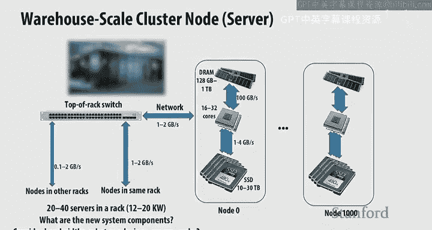
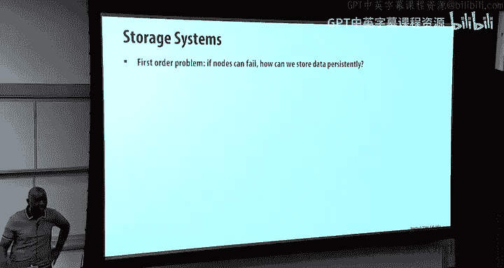
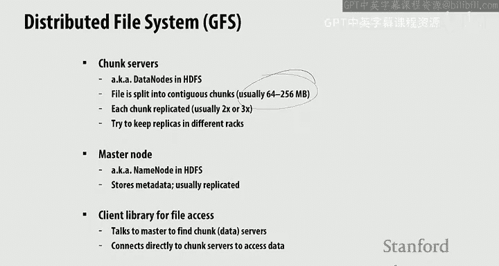

# 斯坦福大学《并行计算｜Stanford CS149 I Parallel Computing 2023》中英字幕（gpt-4 - P9：Lecture 9 - Distributed Data-Parallel Computing Using Spark.zh_en - GPT中英字幕课程资源 - BV1Y5V5zjEsX

Okay so today we're going to talk about distributed computing with Spark and to put this in context right。

 you spent a lot of time thinking about how to optimize the performance parallel performance of single cores so single chips。

 composing multiple cores with Cindy units using ISPC and thread based programming。😡。

You thought about how to write data parallel programs with hundreds of thousands of threads using CoUa。

 we've also talked about how you can use data parallel programming ideas to generate the large number of threads you need to take advantage of GPU and today we want to think about how you use data parallel programming ideas to program a distributed computer right so a computer composed of multiple separate operating operating system instances。

And the main programming model we're going to be talking about is one called Spock。😡。

And I wish there was a podium up here and I could raise this to be higher， but anyway。

 I'll fix that in future lectures。And so the way to think about this is how are we going to program hundreds of thousands of cores right And so the question then is sort of you know something might fail。

 and you want to make sure that you don't lose data。

 especially if you think about the main use of distributed computing in this context is data processing And so you want to make sure you don't lose data So we're going to revisit this whole idea of data parallel or functional data parallel primitives as the way in which we program these distributed computers right so the question then is given the data parallel programming model。

 we want to think about how do we make it scale to hundreds of thousands of core and do that efficiently and then how do we make sure that we can handle faults cases where parts of the system fails and we can recover from that in a elegant way and lastly。

 you want to make sure。that we efficiently use memory， because， of course。

 that is going to be the key component that determines the performance that we get。So， you know。

 the main motivation then is you why， why would you want to use a cluster of machines as opposed to a single machine right And so the key thing。

 of course， is if you want to process huge amounts of data， hundreds of terabytes of data。

 for instance， if youre looking at processing the log data from a large website like Facebook So you could do it with a single node and you know。

 your performance would be limited by the IO rate that you could get the bandwidth to to the disk。

 And if you did it with a single node， it would take you 23 days at the rate of sort of 50 mebytes per second。

But if you had 1000 nodes， then， of course， you have 1 thousand fold speed up in the bandwidth from your storage system。

 And so that goes down to 33 minutes。 right， So kind of this is the motivation。

 If you want to process hundreds of terabytes of data。

 then you need to do it across multiple machines because you need the IO bandwidth to solve the problem。

 So it was just something we haven't really talked about up to this point。

 We've talked about compute， we've talked about memory， but we haven't really talked about IO。

 And so one of the real， really big reasons to use a cluster is to get IO bandwidth， right。

But the problem now is that you need to figure out how to program these hundreds of thousands of。

 of course， right， And so you need to think about how to deal with with the fact that things break。

 right？ So even at the meantime， the failure of a single server is 25 years。

You put10 of them together and then something breaks every hour and so you want to make sure that you can recover from that and you need it to be you know efficient。

 you need it to be reliable and you need it to be a usable framework。

 a framework that you programmers can， you know after taking course like this can think about how how to use。

😡，Okay so the whole idea of clusters is actually being elevated to what is called warehouse sizeized computers or warehouse sizeized clusters。

 And so these are the computing infrastructure behind large websites like Google Facebook。 Amazon。

 and of course， there are a huge data warehouses with racks and racks of computers network together in a way that gives you a single computing environment。

 And the pioneer of this idea is a guy named Louise Burroso。

 And he came up with this idea of sort of thinking about the whole computer as a single sorry。

 the whole warehouse， which is composed of of hundreds of thousands of computers as a single computer that could be optimized together。

 So you think about the networking you think about the power and the cooling and the programming model。

 And I mentioned Louise because he's he's a great computer architect。 he recently passed away。😊。

And he was a good friend of mine， so you know， this is somebody。

 if you want to kind of go look at his book， it's called you know Data Center as a computer。

 it's a great book， a great primer on sort of how to design systems like this。😡，Okay。

 so warehouse scale computers， what are they all about。 Well， you know。

 they came out of this idea of a cluster， right， so you could take a commodity PC and you connect them together with Ethernet right and so the idea is now you've got the scalable computer right and and it's fairly cheap because it's based on these commodity PC components which you know everybody in the world。

 you know， you know， especially when this idea was kind of first invented in the early 200s had a PC on their desk。

 and the idea is， okay， well， if we network them all together。

 we can get this large scalable computer right And so the ethernet networks of those times when were not that fast。

 today you were in the 10 to 40 gigabbits regime And the notion is that now you could build this large scale computer and you could build out these cheap components。

 And so the whole thing was relatively cheap compared to the big。😊。

Computers that were used in scientific computing， high performance computing computers， right。

 it turns out that as people started to think about programming these computers and using these computers in places like Google and Yahoo and Facebook。

 they found out that really the big thing that differentiated the clusters from the supercomputers was the network。

 And that having a really powerful hide bandwidthm network could could dramatically make the development of applications easier。

 And so it turns out that they actually kind of took a page from the supercomputer systems when they were building these warehouse scale computers。

 And they decided to use a customized， expensive network。 and so now， of course。

 the cost of these warehouse warehouse scale computers kind of you know， edging up into the realm。😊。

Of high performance computing supercomputers。 right。

 So the question then is sort of given this style of， of computer。

 how you organize computations on this architecture and mask this issue of you know。

 how you balance the load across 100000 CPUs and then how you mask failures， right。

 So the first thing we need to understand in order to figure out how to do this is sort of how these kinds of of systems are organized。

 right， So the way I think about， as I said， you've got， you know， hundreds of racks of computers。😊。

And each of the racks is organized in the following way at the top of the rack， sorry。

 the top of the rack， you've got this top of rack switch。

 which is the networking interface to the rest of the racks in the system and then within the rack。

 you've got a stack of computer servers and you can have 20 to 40 servers know and how many servers you can fit in the rack is really dependent on the amount of power that you can actually deliver to the rack。

 and that will be dependent on what infrastructure you've built in the data center right so that could range from 12 to 20 kilowatts And if these racks。

 know today if you're you're in the ML regime and have GPUus in them then of course。

 the number of computers you can fit in the rack is dramatically lower。Right。

 because GPUs take a lot more power， right， So then the way to think about then is， okay。

 so within the rack， you've got the nodes or servers are connected by between today between one to2 gigabs of bandwidth。

 right And then you know， between the racks， right， So outside the racks， you know， early on。

 it was maybe a 10th of a gigabyte today， it might go up to 2 GBaby。

 So let's look at you know what an individual node looks like， right。

 So you've seen this picture before in the sense that you've got maybe two socket system。

 which means two CPU chips， each of those chips could contain 16 to 32 CPU cores。

And then they're connected to DDR chips which provide the main memory and you might have 1128 to you know two terabytes of DRAM main memory。

 and the bandwidth channel between that is roughly 100 to 200 gigabytes per second and then from the IO point of view。

 then you've got IO， which is to storage， which is solid state disk。😡。

Which would give you 10 to 30 terytes of， of storage。

 and then the other IO interfaces to the network， right？

 And so you can imagine then racking and stacking these servers to create these racks of computation。

So any questions at this point？Yeah， say are use an interchangeable。Okay。

 you click about a node as a。Computer， which， which which is running an operating system， right， set。

 So all of these。Nos are running a separate operating system。 Okay， so that's it's important to。

 to understand that。 So one thing that that I should point out then is kind of you。

 take a look at this picture。 So， you know， what are the new system components that we've mentioned that have。

 we haven't really introduced before。Yeah， network and solit say storage right so these two IO components right so what's the other thing you notice about when you kind of look at the bandwidths that are shown in this diagram。

😡，What conclusions do you make about the bandwidths that we see in this picture？😡。

The main bottlemakers networks is slower， potentially the rating to hard right so what you see is that the network especially in the early days when you've got 0。

1 gigabytes of bandwidth between the racks。This is maybe a tenth0th of the bandwidth you get from going to your local disk。

 okay？So that's one thing to point out that the network you know。

 is potentially has lower bandwidth than accessing your， your local disk。

 What's the other point to make， I was going to ask。

 why is there a difference between the bandwidth for the network and the notes in others， Like part。

 isn't the communication between notes the。Yes， but what you have is you have a you've got， you know。

 within the rack， you have a higher bandwidth network than you have between the racks。

Right at least to a first order。 Okay， but then we're gonna to make another point in just a moment。

 Okay， so so what other other point before we we talk about about the network。

 What other things do you you see here when you're looking the bandwidths。

What's the relationship between the memory bandwidth and the network and disk bandwidth？Yeah。

Tos of magnitude， right， that's a big difference， right？Alright， so， so so that's the one point。

 But the point about networks。 So I made this point about the fact that， you know， in the early days。

 it was kind of commodity ethernet and then the warehouse scale computer guys really got serious about their networking capability and they started making the network。

 know， much higher bandwidth right And so if you were in the two gigtes per second。

 then that's roughly the bandwidth that you're getting from the solid state disk， right。

 And so at you know this point， So at this point， it may be the same bandwidth to get data from another nodes disks as as it is from your local nodes disk。

 right So in the early days that was certainly not the case， when you're down at 0。1。

But when you get up to two gigabytes per second， now the picture is changing， right？😡。

Because now you can get potentially the same bandwidth。😡，To a remote nose disc as to your local disc。

 Okay， so good point， something to keep in mind。All right。Okay， so。So， I said that。

All of these nodes are running different operating systems， okay？😡。

So what does that mean about how they can communicate。Can they share memory。They can't share memory。

 right， They're not touching the same address faces at all。

 And so what we need to do is we need another mechanism for communication。

 And that mechanism is called message passinging， Okay。

 which is like kind of sending a letter or sending a note to your friend。 Okay。

 and so the abstraction is。I'm a thread in some address space。

 and I've got some variable X that's in my address base。

 And I want it to send it to another thread that doesn't share my address base。

 And so I issue a send call。 and that I give it the address of my variable X in my address space。😊。

I say which thread I want to send it to， and I might give it some， some message Id tag Okay。

 and that will be the send and that will go over the network and， you know， a land at the thread。😡。

OrYou know， you， of course， you can't get can do message passing on the same node。

 But if you'veve got separate address spaces。 But let's assume that， you know。

 it's going over the network。 And then on the thread running on a different node， thread 2。

Does it receive。And it receives the， the message and puts it in its variable in its local address space。

 Y， okay。So it receives the message， right and so this communication then happens with sends and receives。

And。The question is。😡，If you've got message passing， do you need synchronization。

See somebody shaking their head， yes， somebody shaking their head， no。So what's the someone who says。

 yes， why do you think you need sync synchronization？😡，All right。그最近。Because see。

Thank you send the message before you get get on。Because if you don't go there things can look。

You could potentially deadlock if you're waiting for a message that that that you that is never going arrive。

 But， but do you need explicit synchronization。And you would say no， no， really。

 no because the message， the act of sending a message is the synchronization， right？Okay。

 so you don't need explicit。 You can get deadlock。 So that was the the issue you were thinking about that that's true。

 Could， You could deadlock， but you don't need explicit synchronization。Okay。

 so we've got send and receipt， so we have a mechanism。

 an abstraction for communicating between these separate address spaces that could potentially live on the same machine。

 but you know in this large distributed system are typically going to be on different nodes。😡，Okay。

 so first order of business， right， We're gonna use this data this distributed computer system for doing data processing。

 right？ And so the data is got to live somewhere and it's gonna to live somewhere in the storage system。

 But we said you've got。Potentially hundreds of thousands of components。 And， you know。

 the components could break， right， and you could lose a node or you could lose a whole rack because the networking at the top of rack you know。

 breaks。 And now the question is， how do we ensure that we don't lose any data。

 We're using this process， this computer for data processing。 And， you know， if we lose data， then。

 you know， it's kind of failed in its first go， right， So how can we store the data persistently。

 So the answer is， well， let's build distributed file system。 So any of you been。

Introded to the idea of a distributed file system。Okay， yes， some of you。 Alright。 so， so。

 so we'll just talk briefly about it here。 So the idea of a distributed file system is that。

 you know， you've got some global file namespace and kind of the idea was。

Piononeered by Google with the Google file system， GFS。

 the open source version was was Hadoop distributed file system， HFS， right And so， you know。

 it was predicated on a particular usage model， right And the model is that you've got large files。

 know， potentially you know，1 hundred tens or hundreds of terabytes and that the data that you write to kind of access patent that you use with these files is you basically just append data to the files in terms of rights and then you read So it's mostly read and append and very rarely do you update the data in place because big use of this is for storage of log data right So log data just essentially as the new entry for the log gets generated。

 it gets appended to the log file， right。😊，Okay， so。

 so reads and and appends the dominant access mode for this distributed file system。 Okay。

 so the idea then of the distributed file system is to， you know。

 divide your huge file up into chunks。Or blocks。 And these are usually 64 to 256 MBgabytes in size。

And then in order to make sure that you don't lose data， you replicate the chunks。😡。

And where would you， you know， what kind of replication scheme would you。

 would you want to come up with。Here。

Would you put all of them all of the replicates in the same rack， Probably not， right。

 So you want to distribute it across all little racks， So if you lost a top of rack switch。

 you wouldn't be wouldn't lose the data。So then the idea then is you've got a master node。

 The master node is going to tell， is basically he's got the metadata。

 the the directory for all of the where all the replicas are stored？

 And so the idea then is you've got a global name space。

 right across the whole distributed file system。 And the way that the clients access files is they talk to the master They find out where the replicas are。

 and then they go read directly from the replicas。 So this is kind of shown in this this figure here。

 right， So you've got a name node or the master node。😊，And the that has the metadata。

 And you've got a client that wants to read。 So， first of all， it goes to the name node。

 finds out where the replicas are。 That's step 1。 And then in step  two。

 it goes to the particular data nodes， which actually have the the data and it picks up the block from one of the replicas。

 And then if it's， that's client number one， client number two wants to do it right。 And so。

 of course， it has to update all the replicas。 right。

 because it got that information about where the replicas exist from the name node question。😊。

队隐出呢个改革。We're facing like a single computer response system you kind of bufferuffle the rights and make sure that hey。

the same di。選挙。I have some dogs。How do you make sure that the mobile clients aren't syn？Well。

 typically you make sure that sort of only one of the clients is writing to， you know。

 you handle that at the application level， right？两。It hurt like the local。Ma。

there's a single master node that may be replicated right， turns out that you know。

 if you've only got a single node， the chances of failure are not that high。 The issue is， of course。

 if you've got thousands of nodes， Yeah， of course you may want some duplication， you know。

 maybe to handle the load right if you can imagine that in a system with enough high enough。

Usage right that you might need to duplicate to make sure that you can handle the load and you might want some duplication to make sure that if a node fails。

 you still have a backup。Yeah storage， yeah， yeah。Is this research very similar to the file address table the FA storage you have like an address table for where on if you file the any tool？

Is it very or to walk F？Fin fire。Yeah， it's similar， Yeah， but it's distributed。Yeah。Okay， so。

 so now we have a way of persistently storing data such that we never lose data if one of our components in our distributed system fails。

 okay。😡，So now here's the problem we're trying to solve。 Supp you know。

 C149 gets even more popular than it is today。 Everybody who made is in Cs and everybody outside wants to understand and learn about parallel computing。

 And so you you know， you know the website is getting you know， tons of page views， right。

 So so here's a log of page views from the course website。 And。

Your goal is to understand something about these page views， right。

 so you imagine right that we're going to store these page views on a cluster of four nodes。😡。

So' our tiny cluster here， butll give you an idea， right。

 and so each of the nodes has a 10 terabyte SSD。And you've got some number of blocks， you know。

 associated with each of the nodes in the system， right， So you've， you know， youve divided the。

Large。Log file into。256 MBby chunks that we're gonna call blocks。

 And then we're going distribute the blocks across all the nodes in our cluster。 In this case。

 four nodes。 Okay， so we've got we divided the the file into into four blocks into8 blocks and distributed across the four nodes。

Okay。All right， so。So what we want to know is， you know who's accessing the site rather than whose access you know what type of device are they using to access the site。

 So what type of mobile phone are the students using because of course。

 know who accesses websites using anything else these days Okay so you could potentially write a program to analyze the log file using message passing right So we're not going to talk about it in this class。

 but you know you can program these distributed computers using message passing using send and receive and what's called collective operations。

 there's a API called the message passing interface MP。

 I encourage you to go look at it if if you're interested， but believe me it would be painful。

 And furthermore， it wouldn't necessarily handle fault tolerance right So there's one thing。You know。

 we've got this persistent， distributed file system。

 which makes sure that you don't lose any data once you put data in the file system。

 But what happens if in the middle of your computation， you lose one of the nodes。

 right and and the data that you have is in memory， right， then you've lost that。

 So MPI doesn't help you there right， So you need some other way of dealing with fault tolerance beyond just having a file system that doesn't lose data。

Alright， so MPI is an option， but it's not a very good one， and it's not not easily programmable。

 So let's think about how you might want to， you know。

 how you might want to think about programming the applications。

 So let's go back to the idea of data power operations， right， in particular， map。And reduce， right。

 So to， just to refresh your memory， Right， So the map is going take a collection or a sequence in this case of type A and。

😊，Create or produce a， a sequence or collection of type B。

 And the way that it's going to do that is gonna take each element of the input sequence and convert it to an element of the output sequence。

 right， So what do we said， there are two things we said about map that we could do。😊。

that are important。What's important about math？Yeah。す。It's easily parazizable right。

 so because of course， so we know there are no dependencies between the different。Elements， right。

 so we can we can do the elements。 we can create the output sequence in any order。

What's the other important thing about map？😡，W塞。So to fight for you。Ah side threatret free。

 so what does that mean？😡，And why is that？Because like this。can access that piece。人災がこれなて。

Because map does not mutate its input， right， doesn't change its input。

 So the input never changes so you can run run it as much as often as you like and generate the output。

 right。Good， so that's an important point to remember that sort of these。

Data parallel functional operations， the key thing about functional。呃。

Programing models is they don't mutate their input。😡，Okay， and because they don't mutate their input。

 you know， it has all these， these， nice properties of side effect freeness and， you know。

 which well have， I you think you're， alluding to the fact that that has some fault tolerant benefits that we'll。

 we'll definitely talk about。😊，All right， so the other。Operation is reduced， right。

 So reduce will take a sequence of type A and produce a single element of。

 of type B by using some sort of reduction function。All right。

 so now let's think about the map reduced programming model and a way of counting the page views of a different type of each type right so the key elements of the map reduced programming model。

 of course， are a mapper function。😡，Which is shown here。Yops。And a reduceive function。

Which is shown here， Right， So the map a function is called once per line of the log file。

And it passes the， the， the line and figures out whether the line is from a the。

 the entry is from a mobile client。 Okay， so it figures out whether it's from a mobile client。

And if it is， figure it records。😡，A entry or update an entry in the result。Map， right。

 So you the input to Maper is is a is a single line from the log file， and the output is。A map。

Of results。Right， and so。It's going to add an entry to the map。Data structure。And then the reducer。

Function is going to be called for。Unique。Value， unique keys。

 all the values associated with with the unique key。

 and it's gonna be called once for each unique key。

 And what it's going to do is it's going to take the string of values and just add them up， right。

 to create a sum。Right， which is the result。Okay， so the idea then is we。

 we generate these key value pairs in the。Mapper function。

 And then we reduce these key value pairs in the reducer function。Right。

 and so the code at the bottom shows how things get called。 First of all。

 we get the input from our distributed file system and then the。

Write the output again back to the distributed file system。😡。

And that happens when we run map produce job with the map a function。

 the reducer function and the input and output。Yeah。

Is there a map been used here mutating its inputs soon as it's adding to the map and setting the result？

So the way to think about this is that the input to the map is really the data that you get from the distributed file system right so you can think about in this case。

 you can think about the kind of results as sort of internal to map reduce and so the interface is really。

😡，The API really has to do with the data that you give to the run that produced job， right， And so。

 you know， the input doesn't get mutated。Okay， so let's think about actually implementing run map reduced job and so the way to think about things that you know so I'm going to show you the kind of classic you know。

 map Red 101， which is word count， right？😡，Alright。

 so the idea is that you have one map task per block of the input file right， And so in this case。

 we've got three blocks and so we've got three map tasks。😡，And the map task。😡，You know。

 read lines from the input blocks and they create this。Set of key value pairs。

 And so here we want to count the number of word occurrences in the input file and it creates an entry。

 a key value pair， which has a one associated with all of the words that it found in the input files。

😡，Right， and so you've got three sets of。Or three maps。

 three instances of key value pairs associated associated with each of the mapa tasks， right？😡，Okay。

 so now。In this case， we've got two reduced tasks， right， And so the question the map of toss。

 the parallelism is obvious， right， It's associated with each of the input blocks。😡。

How about the reducer tasks， Where do we get the parallelism from for the reducer tasks？た。Right。

 so you're gonna do， you're gonna to associate some number of keys to each of the reducer tasks。

 right， And so that's where the parallelism is going to come from。 But what happens when you do that。

 yeah。实际手写。Like if we start giving some rent to reduce function。

 how do we know that we actually split it up and get the same thing？So you I。

 it won't work unless you have an associate producer， yeah。That's right。

So that's kind of part of the limitation of lab produce。If you want to paralyze it， at least， yeah。

So what happens once you do this？Who said we want to？

You get the parallelism by having multiple keys being being operated at the same time by different reduced tasks。

 So what what do we have to do in order to make that happen。Yeah， somebody said something synchron。

Synchronization of what sort。Somebody back theres。What's the answer if we've got to paralyze across keys。

 what do we have to make sure happens in order for the reduction to be correct。

 all the keys of the same type or the same value have to go to the same reducer task。😡。

Right and so the way to think about this is map reduce is really map group by key reduce right or there's this big sort or shuffle in the middle to make sure all the keys with the same value go to the same。

😡，Reducuce task， right？And so that's the way I think about mapreduce。 It's really。Map group by key。

 reduce or some people say sword or shuffle， right in the middle in which you've got a lot of communication that is potentially going happen between the mapper tasks and the reducer tasks。

 right？ And then we're gonna talk more specifically about sort of how you make sure， you know。

 that the keys of the same value go to the same reduce tasks。Okay， so let's run the mapa function。

 So here's our map reduceuce code。 and we want to run the the map reduce job， right。

 And so the first question is， you know， we've got these map of tasks associated with each block。

 how should we run them。😊，Anybody have ideas about how we should run them？第二， and not to say。

That's one idea we could run the same how do we make sure things get low bounced？😡。

What if we were're really concerned about load balance， what would we do？Yeah。

 you could do something like the I has made one note like a play。

messages use a work queue or some sort of distributive work queue to make make sure that we had extreme low bouts and this might work well。

In the case where we had a really powerful network， right， that that second case I talked about。

 about having bandwidth in the network equal to what you might get to your local hard disk。

But what if， you know， in the early days of mapreduce， when the network was much？

Had much less bandwidth than the bandwidth you get to your local disk。 Then we had another idea。

 which was proposed first， which was what。Yeah， run the task associated with a block。😡。

On the CPU that actually contains on the node that actually contains the block， right。

 So this idea is sort of data distribution or task distribution。

Each processor in node processes lines or blocks in the input file that are stored locally。Okay。

All right， So so now we。So now now we've got all the Maa tasks and we've created all these key value pairs associated with the different mobile clients。

 and now we have to do the reductions， right， So we've got all these keys。

 which have being generated by the Maper function。😊，Okay。

 and so now we have to make sure that we can do the reduction。 So there's two questions， right。

 How do we assign the reduce of tasks？And then how do we make sure we get all the data for a key value to the correct worker node？

So who has ideas about what we should do to assign the reducer task to nodes to run？😡，对呀。

Use a hash function， and then group by。しょ。I think that's answering the second question。

Whathy about the first question？😊，About where the toss are going to run。😡，Yeah。

See what threads are spinning with no can be done and' available or I guess a few in this case and you sign up for them Right。

 so we do some sort of scheduler， which is looking at at that the。

You have some set of nodes which are going be reducer nodes， right。

 and you have a scheduler in which is going to assign tasks， right。

 But the question then still is sort of who is actually going to how you going to make sure that that the data gets to the right node。

Right so， so somebody had， you had an idea for that， right， which was。Use some hash function。

 right based on the key value。😡，And then use that as the partitioner to or use that as the information given to the map mapping task nodes。

 and that will indicate where those nodes should send the key value data to be reduced。

 depending on the key。 So example is a sign。😡，Safri iOS to node zero。

 and then we know where to send the data to and where the task is going to run。

 where the reduce the task is going to run。Okay， so in different systems that work in some ways kind of decide up front。

😡，And so the mapper you know， declares what key value pairs it has。

 but it knows where to send them ahead of time， and others might decide。

 you know once all of the Maper tasks are complete right because you can't do any reduction right until all the Maper tasks are complete。

 so there has to be a barrier between the Maper tasks and the reducer tasks， yeah。😡。

Would this system be aware of so in this case Safari values are all equally distributed among the four nodes but say like three of the Safari values were a node one and one of them was a node two it would be more efficient to get it Yes you could imagine the localityware scheduling mechanism that took that into account good point yeah。

Alright， so we have a mechanism for deciding you could use the scheme that was just suggested where we take we try and group the reducer task。

 We put the reducer task on on the place where most of the key value pairs already exist in order to minimize data movement or we could。

you know， in the instance of， hey， I've got a really powerful network。 It may not matter， right。

All right， so we've solved the。You know， you know， key problem of executing the mapper and reducer function。

 you know， using these different tasks associated with either different blocks of the input file or different keys。

 But what if I've got you know， thousands of nodes， there are a couple of issues that can crop up。

 One is that， you know， some of the nodes may fail， as we've talked about， right。

 during the computation。😡，Right so we're not going to lose any data right。

 because we have made sure that that we've got a file system that is fault tolerant。

 but we need some way of making sure that we can recover the computation and make sure that the computation will complete successfully。

😡，So that's one issue， the other issue is that if I've got a huge data center。

 I'm not going to have all the nodes in the data center be of the same vintage right then you might maybe refresh the data center over time over the period of maybe three to five years。

 and so I'm going to have some older nodes maybe with you fewer cause and maybe a lower clock rate and some newer nodes with more cause and maybe a higher clock rate and so some of those nodes may finish foster than other nodes and so how do I make sure that I can deal with this problem。

😡，And so the key thing then is to have a job scheduler that handles these issues so it exploits data locality。

 you know， runs a map of jobs close to input blocks， runs reducer blocks says reducer jobs or toss。

 as was suggested close to the place where you've got most of the data and in particular。

 it handles node failures right So basically you've got a hotbeat。

 which is you know which is each of the nodes regularly sends message saying， hey。

 I'm alive to to the master node and the node is doing the job scheduling at some point if that hotbeat goes away。

 then the node is declared to be dead and and the scheduler has to figure out what to do。Okay。

 so what can you do， Well， once you detect the failure of a mapa node， what should you do？😡，对呀。有業我。

The computers that has copies of the storage and。RightSo you you go somewhere else and you fire up the tasks that we're running on that map a node and the data will come from blocks that have being replicated in the system。

 right and the fact that you've got this。😡，Data parallel。

 functional data parallel model in which the inputs are not mutated guarantees that that's a safe thing to do。

 and so now you're going to create a new set of key value pairs that can be reduced。😡。

So what happens if a reducer fails？Yeah， what if it fails after it's done？不怎么。

If the reduce tasks are complete， then it doesn't matter， right， but if they're in the middle。

 then you've got to restart them and the data has to be either it's got to go get the data again from the file system where the key value pairs were were stored。

😡，So how do you handle slow machines while the scheduler can just replicate。😡，Multiple。

Reduccer or Maper jobs if the machine is taking too long，'ll say I'll just far off a new job。

 and then it'll be a race， right？ So if the slow computer finishes first。

 then that result will be taken and the replicated job will be killed， otherwise。

 if the replicated job finishes first， then you know you can kill the slow machine。

So duplicate and you know， handle multiple machines。

 And this is all possible because of this kind of data parallel functional programming model。 Yeah。

 couldn't we have some sort of aada or theuristics to avoid baseball computation like in this case。

 theyre killing on， which is not doing any use of work。

Like if you hand metadata that question does generally cost， this question does simply。

What are you like schedule for。I suppose you could。

 but that you then you's extra extra sort of complication in your scheduler right yeah and you know what happens when the machine。

 you know and it's got to keep track of sort of what machines or of whatt vintage and so on and so forth and how loaded they are。

And it becomes more of a scheduling issue， yes。😊，When a job scheduler fails， then you're out of luck。

 your whole。Well， I mean， so， as I said， if you've got a single no。

 the chance of that failing is not that high， but， you know， you might duplicate it。Alright， so。

 so the advantage of map produce then， of course， is that， you know。

 gives you this nice data parallel programming model。 map reduce。 It's fairly easy to understand。

 you know， I you know， can explain map produced to most C S undergrads。

 and they would get it right away， whereas I introduce them to message。

 it would be difficult process。 right， So you've got this automatic division of of jobs of the job into tasks。

 see the map of tasks or reducer tasks。 You've got this low balancing that happens because you've got many reduce many map tasks and and many reducer tasks。

 You've got locality aware scheduling。😊，And you've got this idea of being able to recover from failures and stragglers。

 So it's a pretty nice programming model。 And it， you know， made it possible for mere model。

 mere models to program hundreds of thousands of CPUs。 for sort of doing these data processing tasks。

 So it really took off。 and it became an idea They actually got had widespread use even beyond distributed computing。

 right， You know， where we've already seen it in the context of， of sort of GPU computing。

 And it's being used in in other， other areas， too。😊，However。

 it does have some issues and the first issue being the program model is pretty splistic。

 The only thing you can do is have a map followed by reduce。

 followed by a map followed by Reduce and so on so it's a fairly kind of this linear arrangement of map and reduce functions which kind of limits what kinds of applications you can write and so there was a extension to a directed tocycl graph。

 the the work was called drive link and you know it suddenly had some academic impact but it didn't get much。

😊，Adoption， as far as I can tell。 but， but it's an interesting idea。 if you're interested。

 go and look up the dry drag link paper， It's a pretty interesting paper。 Okay。

 and how about iterative program， iterative algorithm。 So Page rank， everybody's heard of page rank。

 right， you want to understand the the importance of a particular website that you compute page rank。

 It was originally invented by Larry Page， and one of the founders of Google。😊。

And the idea is it's an iterative algorithm。 And if you implement it using the mapreuce model。

 then every iteration requires a distributed file system read。

 followed by a distributed file system right， Okay， and you could this could go on for。

 for many iterations。 And so it becomes fairly inefficient。To run this algorithm using MaRduce。

Another is area where Macreduce doesn't work so well is if you've got a set of data or and that you want to query in some sort of ad hoc way。

 And this is often happens in。Interactive data processing applications， right。

 So you've got some data that exists in the file system and you've got a bunch of ad hoc queries。

 and each of them requires this access to the file system， which is not very inefficient， right。

 So even though then this map produced has all these nice properties。 And as I said， had you know。

 a huge impact in the ability for programmers to develop develop these distributed applications。

 these kind of limitations。You know， led to， you know。

 people thinking about more efficient ways of using the computation。 and sorry for the font。

The way the fonts look on this slide， but the key point is to remember what we said about the relative bandwidth between the memory versus the network and the storage devices。

 and so what we want to do is to say is to think about how we can make much more intensive use of the highest bandwidth interface on this picture。

 which is is the memory。😡，So what is the problem， Well， before we， we talk about the the problem。

 let's talk about kind of further motivation for why we potentially could use the memory more intensive。

 So this is a。Table from a paper called Dislocity in data center computing is considered irrelevant right And that's from a paper published in 2011 So part of the reason that it was considered irrelevant was the point that we've already made。

 which is the networks were getting much more bandwidth capable right。

 But the other reason is showing in this table， which you know， is data from from 2009。

 and it's looking at the working set of the big data applications at Facebook， Microsoft and Yahoo。

 and it's showing that was 64 gigabtes of memory 97% of the working sets of data at Facebook can be contained in the memory。

98% of Microsoft and 99。5% at Yahoo right So the point here。😊。

that you really can keep most of your data in the memory。 The memorys big enough。

 but the programming model forces you to shuttle this data back and forth between the storage devices and the memory right？

 So the question is， could we come up with a programming model。

 which is just as nice or even better than mapre， but allows you to use the memory much more intensively。

 What would be problem yeah。😡，I was thing all the day of business remote。

But the data fits it like all。All the nodes disk， all all the yeah。

 so for all the nodes that you're running， the data will fit in the local memory， not disk。Okay。

 yeah，The replicas have to do with the file system。😡。

It's talking about you're actually doing the computation。 You're in the middle of the computation。

 will the data fit in your local in the memory or will you have to， you know。

 make use of of the disk。😡，It turns out you can actually do the computation。

by keeping the data in memory。Okay， yeah， still depends。Im sorry it can't dance other nu。

 memories still have to be。Yeah， I mean， you still， I mean， this is a talk about working set， right。

 which is sort of most of the accesses are to data that lives in memory。😡，Okay。

There's not all the accesses， right， So you still got to move some of the data from other places。

 The question is， you know， weve talked about locality， right， So you've got reuse。

 you've got spatial locality， right， So this is just talk about working set， right。

 which is a concept that that you should have， you know。

 we should should have talked about in an operating systems class， right。

 There's notion sort of what is the set of data that you're actively using， right。

 and that is what they're trying to measure here， right。😊，Okay。

 so what would be the problem with using memory？😡，Instead of the。

Storage system to hold the intermediate data in your computation， yeah。

If you lose power and your screwed。 If you lose power you're screwed， right。

 You're gonna lose your computation， right， So， so the whole idea of spark was in memory。

 full tolerant distributed computing， right， with the emphasis on the full tolerant piece being once you lose power。

 you don't want to be screwed。Okay， so， so the goals were， you know。

 can you have support for iterative machine learning algorithms。

 data mining algorithms that that in which you will kind of keep your， your data in memory。

So you don't want to incur the inefficiencies of writing the intermediate data to the disk because we said that's a low bandwidth。

 low performance data path， and what you want to make sure is intensively use the high performance high bandwidth data path between the CPU and memory。

😡，Okay， so the challenge， then， of course， is how do we make sure that we can do this efficiently and we can efficiently implement fault tolerance for this large scale distributed memory。

 right， So the solution that we've come up so far is， oh。

 we know how to do a fault tolerance storage system。 So let's just use that。

 That's the map producer solution。 But that's a low performance solution， right。

 So what we want is a higher performance solution that， you know， relies on memory。 And so that's，😊。

Sk， right， so you know， we talked about you could kind of checkpoint。And roll back。

 But then the question is sort of how do you do that and how do you make sure that you distribute your data to different racks so it could be network intensive。

😡，You can maintain a log of updates。😡，But it could be a high。

 high high overhead to maintain these logs。 So that probably is not going to work so well。

 And then you could go to a low performance solution like we've talked about in the case of Mac reduce。

Okay， so in this case， we're going to checkpoint after each map reduce。😡。

By writing results of the file system。 and then， you know， the scheduler is gonna make sure that。

 you know， it's keeping a list of sort of what needs to， to。

 to complete and it will rerun things that that fail。

And the functional structure of programs allows for the restart at the groundularity of the Maper or reduced task。

Okay， allright， so how does Spark solve the problem？

 So the first thing Spark does is introduce this idea， which is central to the approach。

 which is the idea of a resilient， distributed data set， R DD。 So this is the Sparks， you know。

 key programming abstraction。And what is an RDD， It's a read only ordered collection of records。

 So it's immotable。 So it's so this idea of the RDD is a。it's functional in nature， right。

 So once you think about functional programming， RDD is a fairly natural construct， right。

 And so RDDs can only be created by the transformations from other RDDs or from persistent storage。😊。

Okay， so for instance。😡，If I start with CS1。9 log。😡，Which is a text file。

 which is stored in our distributed file system。Right I can get the lines from that file to create an RDD called lines。

😡，Okay， so that was a transformation from the file system to an oddDD called lies。 Then I can。

Use a filter transformation， right？ So I have lines。The lines I DD。

 And I'm gonna apply a filter transformation to see whether this is a。Mobile client and。

 and then the what I mean to get is mobile views， lines that that that correspond to mobile views。

And so this is another odddiD。Okay。And then I'm going to take the mobile views RDD。

 and I'm going filter it again to see whether the string contains safari， And if that is true。

 I'm going create it's gonna to be entered into this new RDD called Safari views。 And then finally。

 I'm going to take safari views are going to apply a action which will essentially give us accounts kind of a reduction。

 which of course， it's going create this in， which is not an RDD， right， but the RDDs are lines。

 mobile views and Safari view views。 And the sequence of operations that create the RDD is called a lineage and we'll come back and revisit this idea。

😊，Okay。So this is the main way that you program using SpOock。😡。

You start with some data in the file system， and then you apply transformations to that data to create different IDDs to encode the logic of your program。

 right？😡，And each of the RDDs is， of course， read only and it's ordered and it's immotable and these turn out to be very useful properties when you're trying to build a fault tolerant system。

😡，Alright， so we talked about the fact that。诶。You so you know， you can write using Sca。

 you can write all this in a fairly functional way and you can create， in this case。

 you create an RDD from the file system。And you can。

Don't have to explicitly call out the RDDs and the sequence of operation or transformations。 then。

 as I said， cold lineage。So in this case you do your operations as a filter map。

Reduce buy and collect。Sorry， reduced by collect is is an action。 It's not a transformation。Okay。

 any questions？So you've got this concept of the。IDD， the。Resilient distributed data set。

 You've got this concept of a lineage。啊。So how can we kind of optimize things with Spock， Well。

 we have this notion of persist， which says keep the RDD in memory。RightAnd so in this case。

 we create mobile views RDD。And then we're going to use it twice。

Once we're going to filter for Chrome。😡，And then collect， you know。Take that the lines。

 the strings in in， that are in the。RDD created from the filter and extract time counts。😡，Timetamps。

 I should say。 and， and then the other case， we're gonna filter based on safari and figure out the number of views。

 page views that came from a safari client。So here are the set set of， you know。

 transformations that you can use in Spock， right， So you've got mat filter， flatm sample。

 reduced by key。Join。Sot partition by， which we're going to talk about in just a moment。

And then you've got actions， right， which， of course， create data back to the host like count。

 collect， reduce。Look up， save。Alright， so， you know， with these operations。

 you can write very sophisticated applications。So let's think about now any questions on sort of the。

 the programming model and abstraction that Spark presents， right。

 So it's the notion of the RDD and then these transformations and actions， yeah。

High default every transformation consume the like it。The why do you need a specific process？

So persistists just says， keep the odddiD in memory。😡，It will be。リアるけど great。Well。

 it may not keep it in memory， right？So it's not going to， I mean， the RDD will exist。😡。

Potentially in。呃。In the file system， right？The question is， will it stay in memory？😡，Right。

And that's what persist says。Keep the oddDD in memory。😡，Well， you can say it explicitly， right？

The scheduler can make them some decisions， or you can say explicitly。

One question is like if you don sleep persist and you'll ask for it again to that you。

Yeah probably safe the storage。So it will be inefficient。Right， so in the case of。

 of the the example that we showed here。If you didn't persist mobile views。😡，Right。Then。

Mobile views would get written to the file system。And you would have to go fetch it again in order to do。

 let's suppose you did did the left hand side first， then to do the right hand side。

 you'd have to fetch it again， yeah。まこれ示すないよ。这反了可要的。い数。

If youre like a collect and spirit on encounter or something like if can make a environment make some sort of lazy。

I part the optimization of audio。Do what if you know if Spar knew that mobile Vi is used by two operations。

 then can it not just like even in merie do it both than I do that automation？

Sometimes you've got to help help the system， but other times the system can analyze。

 and as I'll describe， the Sparock run system does a bunch of analysis and we'll do optimizations for you and we'll talk about one in just a moment。

Okay， so let's think about how we can implement RDDs， right。

 So imagine that that here are the oddDDs。 We got lines， lower mobile views and how many is is is。

Is not an RDD， but lines lower and mobile views， right？

 So if you think about the fact that this is gonna be part。

 these are gonna be partitioned across the nodes， right？

 So let's assume that there are two partitions on， on every node。Right， so lines。呃。Partition creates。

 is used to create the lower partition。Which is used to create the mobile views partition。 right， So。

 so one way would be we could think of these as。Arays， right， that get duplicated in memory。

But that would lead to a lot of memory use， right？Right。And so the question is。

 how can we implement this data parallel RDD abstraction in an efficient way such that we minimize the use of memory。

 but we still keep all of the fault tolerant capabilities that we want。😡。

Don't keep the partitions that we're done with like we're if we finish。

If we're computing lower or you finish computing lower。

 we don't need to then also eat the data from mine because we already have to。After all。

 and so we're already。喂。两。That would be a good first step， right。

 but we might maybe be able to do even better than that Yeah。

 instead of duplicating the array each time you're doing a filter or any sort of I guess function you can kind of just have one general array and change the references to the elements in it each time do the filter so that you don't have to duplicatelic the array each time。

呃。In which case。In terms of efficiency， you probably don't want references going all over the place。

 right。I mean， you want things to be concatenated and you want things to be dense。

So having references is probably not a very efficient way of doing things。Yeah。Other questions？

Where are we？Rang at a time。All right。Let's figure out how we can do things efficiently。

So one of the things we could do is think about the dependencies， right？

And the dependencies go from the data in the file system through the different partitions of the different RDDs。

 right from lines to lower to mobile views。Okay。So the question is， you know。

 thinking about the fact that we've got these dependencies。

 can we optimize the implementation of IDs， And the way to think about it is think back to some of the optimizations that we've talked about so far。

 So we've talked about the fact that。This program is better than that program， right。

 and why is that？😡，That's， that's reason， right to。

 we've done fusion of these loops and we have reduced。😡，Within reduce the rice memory。

 and so improve the arithmetic intensity。 Okay， And so we also talked about this。Optimization。

Where we use。Tilling。To optimize the use of memory such that we reduce the amount of memory we need to。

To support the。The blurring， right？And so， these two ideas of fusion and and tiling are pretty important。

 and they can be。Implemented in the Sp runtime system。 Okay， so the question is， you know。

 when can you apply these transformations Well they fail， if you。

 if you try and do these transformations on arbitrary C programs， they're difficult to do， right。

 usually you as the programmer， I have to implement them。 However。

 if you start from a high level representation like Sp。

Or pietorrch or something that gives you more semantic information about what is actually going on。

 Then you could do some of these transformations automatically， right。

 So fusion with RD Ds is possible。😊，And however， you need to know what the dependencies are between the different RDDs。

 So we have this notion of narrow dependencies where one RDD only depends on a one other partition。

 right， So these are called narrow dependencies， right， So partition 0 of mobile views。

 is dependent on partition 0 of lower， which is dependent on partition0 of of lines。

 which is dependent on blocks 0。 So these are narrow dependencies in that RDD only depends on one other partition of an RDD。

Wide dependencies are a case where you've got an LED， which depends on multiple。RDDs， right。

 So in this case， if I do a group by key， right， I may have to get elements of the partition from multiple places。

😡，And so if I have narrow partitions， then potentially I can have the system automatically do the fusion。

😡，At this point， we'll run out time， so what we'll do is。After probably next Tuesday。

 I will finish up this discussion of SparRC and move on to cash coherency and on Thursday Kavon will be back to talk about efficient implementation of Ds。

 right？😡，Thursday this Thursday yeah， right and then on Tuesday I'll come back and we'll wrap up Sp and we'll start talking about cash coherency so sorry for going over time。

 but it's really interesting stuff。

