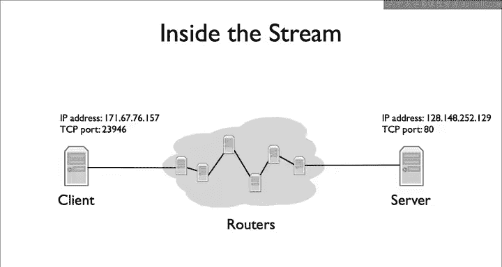
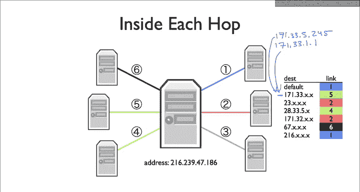
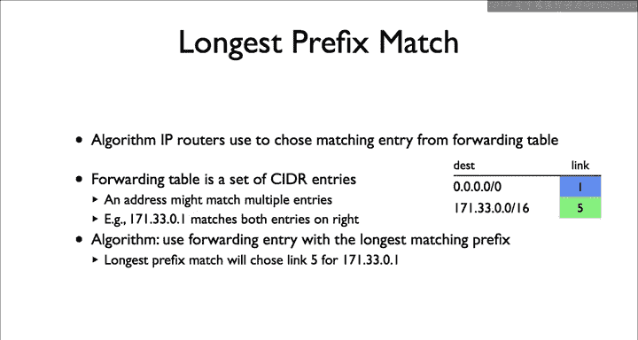
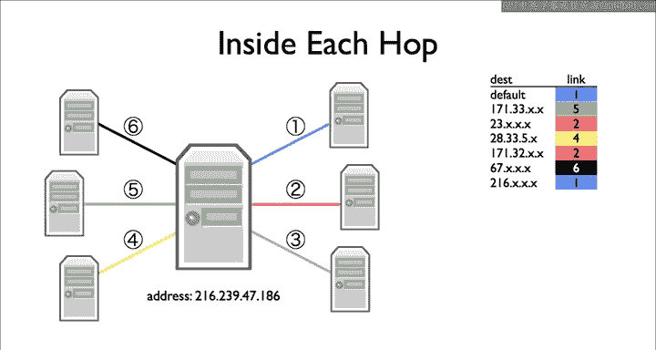
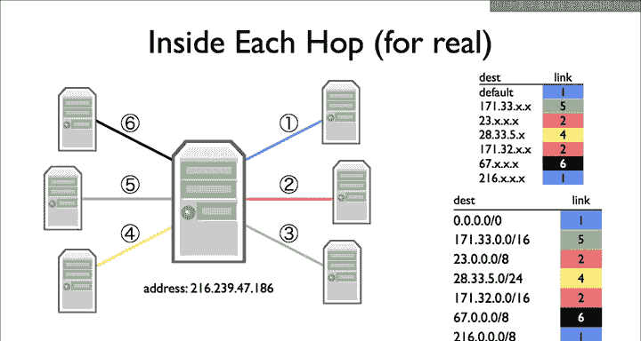

# 斯坦福大学《计算机网络｜Introduction to Computer Networking CS 144 2018》中英字幕deepseek - P17：-017-Longest prefix match LP.zh_en - GPT中英字幕课程资源 - BV1bVqNYFEGg

Internet routers can have many links， so they have many options for which direction to forward a receive packet to select which link to forward a packet over routers today typically use an algorithm called longest prefix match。

In this example， a client wants to open a TCP connection to a server on port 80。

 the typical port for web servers， the packets to set up the connection and transfer data take many hops between the client and server on each hop of each packet。

 a router decides which link to forward the packet over。

How does a router make this decision， it does so through something called a forwarding table shown here on the right。

A forwarding table consists of a set of partial IP addresses。

 the xs showed that the addresses are partial， the xs represent wildcard， for example。

 the second entry reading 171。33。x。x means any IP address whose first bite is 171 and whose second by is 33。

This particular entry， for example， includes 171。33。5。245 as well as 171。33。1。1。

When a packet arrives， the router checks which forwarding table best matches the packet and forward the packet along the link associated with that forwarding table entry。

 By best， I mean most specific。 The default route is effectively all wild cards。

 It matches any I address。 If when a packet arrives。

 there isn't a more specific route than the default route， the router will just use the default one。

Longest prefix match， or LPM is the algorithm IP routers use to decide how to afford a packet。

Every routeder has the forwarding table， entries in this forwarding table have two parts。

 a cider entry describing a block of addresses and a next top of packets that match that cider entry。

 an adder might belong to multiple cider entries。For example， in this routing table on the right。

 there are two entries， one for the default route， which has a prefix of length0 and one for 171。 33。

0。0 s 16。 By default， all packets will match the top entry and go over link1。 However。

 the first 16 bits or twoocts of the packet destination address matches 171 33。

 The router will send it over link 5。 This is because of 16 bit prefix is a longer prefix than 0 bits。

 It's more specific。 So let's go back to our earlier example where we should a forwarding table with X's denoting wild cards。

 Here's the router and its forwarding table。

If we represent this forwarding table as cider entries， this is what it looks like。

 since in this simple example， all the prefixes are in terms of bytes。

 all of the prefixes have length 0，8， 16 or 24 bits。

