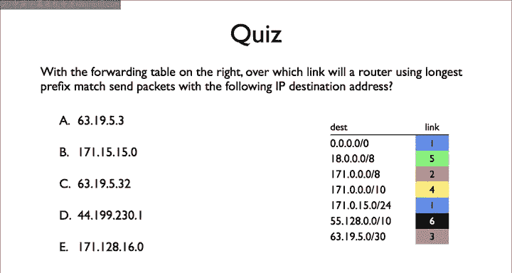
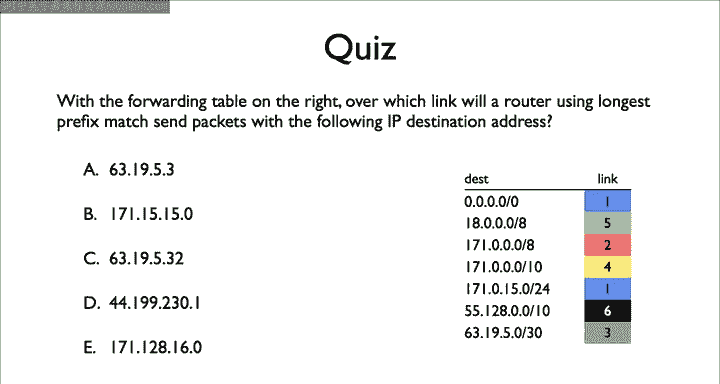

# 斯坦福大学《计算机网络｜Introduction to Computer Networking CS 144 2018》中英字幕deepseek - P18：-018-Longest prefix match LP.zh_en - GPT中英字幕课程资源 - BV1bVqNYFEGg

With the forwarding table on the right， over which link will a router using longest prefix match send packets with the following destination IP addresses？

