# 斯坦福大学《计算机网络｜Introduction to Computer Networking CS 144 2018》中英字幕deepseek - P19：-019-Longest prefix match LP.zh_en - GPT中英字幕课程资源 - BV1bVqNYFEGg

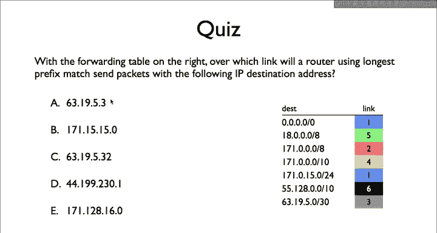

The answer for 63。19。5。3 is link 3。

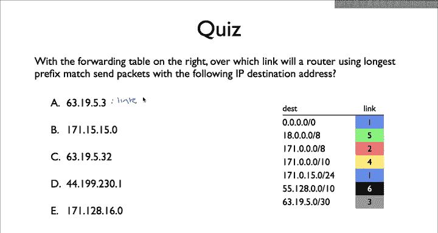

63。19。5。3 matches two prefixes， the default route and prefix 63。19。5。0。

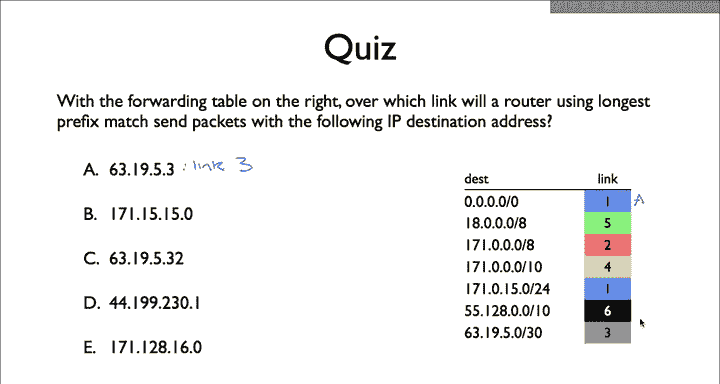

The prefix is 30 bits long， and 63。19。5。3 differs in only the last two bits。

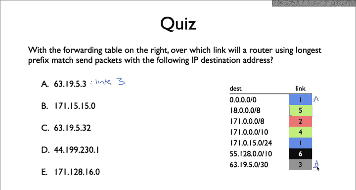

Flash 30 is a longer prefix than slash0， so the router will pick link 3。

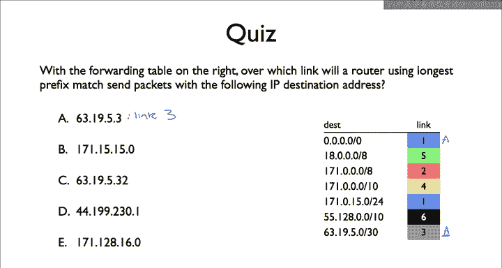

The answer for B 171。15。15。0 is link 4。

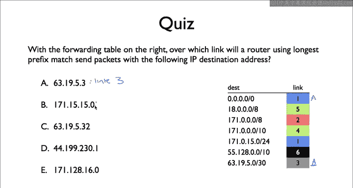

B matches three entries。 It matches the default route 1 set 171 dot 0 dot 0 dot 0 slash 8 and 171 do 0 dot 0 dot 0 slash 10。

 It does not match 1，71 dot 0 do 15 dot 0 slash 24， because B secondoct is 15 not 0。 The third match。

171 dot 0 0 do 0 is the slash 10 is the longest prefix 10 B。

 So the router sents the packet along link 4。

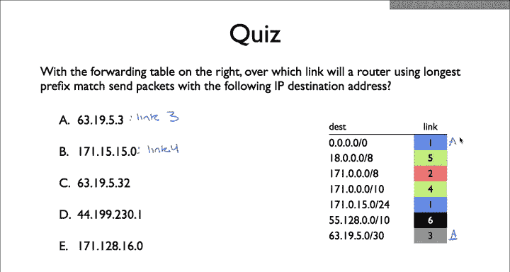

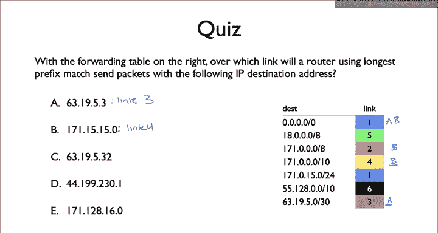

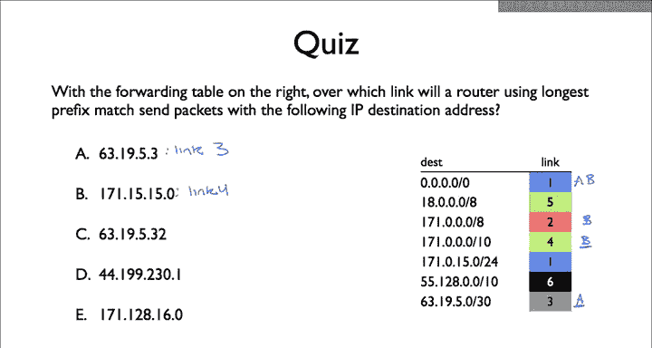

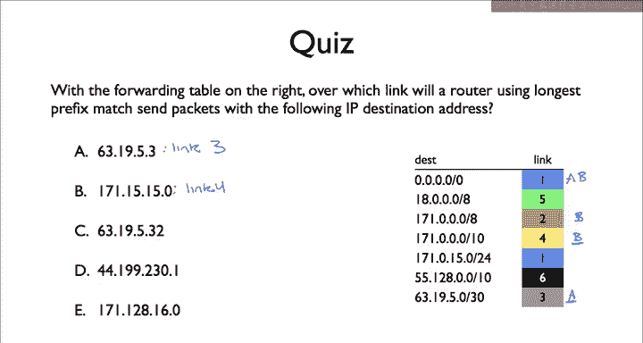

The answer for C 63。19。5。32 is link 1， the longest prefix matches the default route。

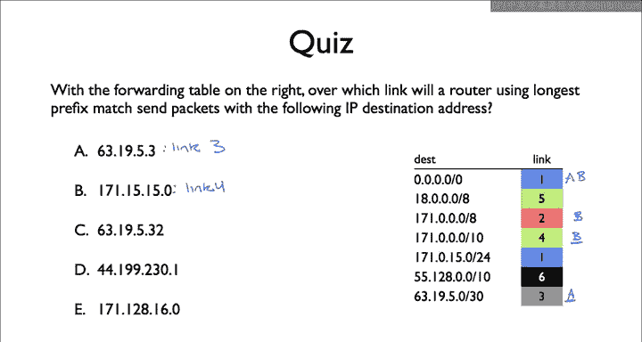

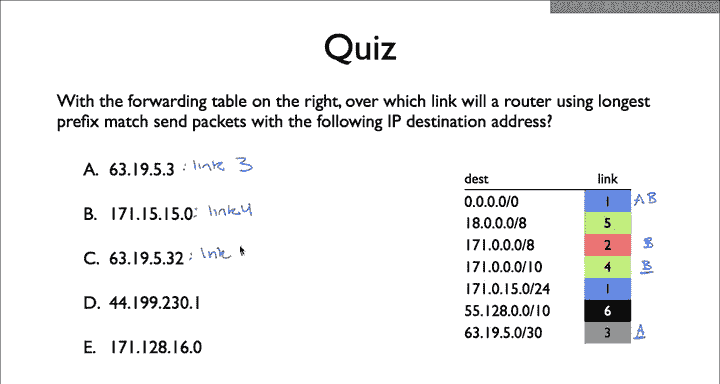

It does not match 63。19。5。0 because it differs in the 26th bit。

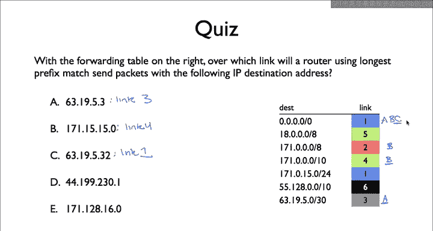

The answer for D 44。199。230。1 is link1， the longest prefix match is the default route。

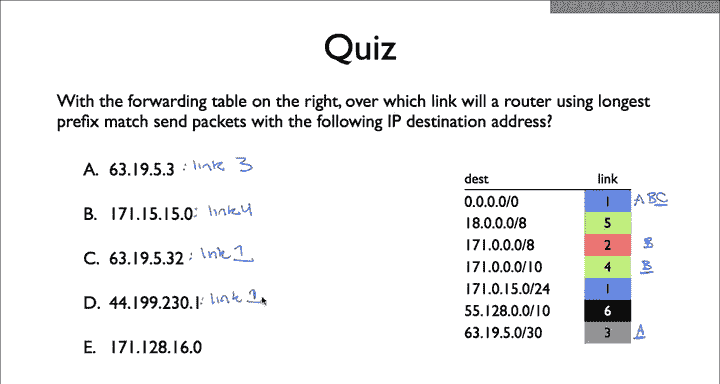

The answer for E171。128。16。0 is link2。 This address matches two prefixes， the default route and 171。

0。0。0 slash 8。 It doesn't match 171。0。0。0 s 10 because it differs in the 9 bit171。 0。0。

0 slash 8 is the longest prefix So the router of4 this packet on link 2。

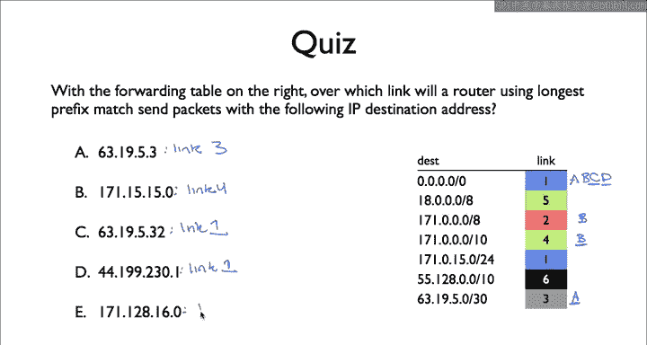

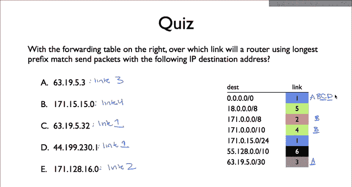

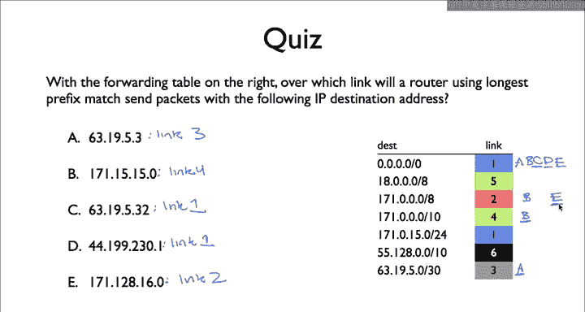

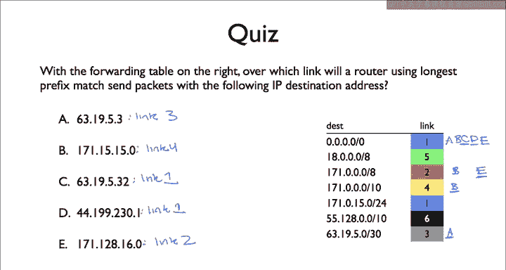

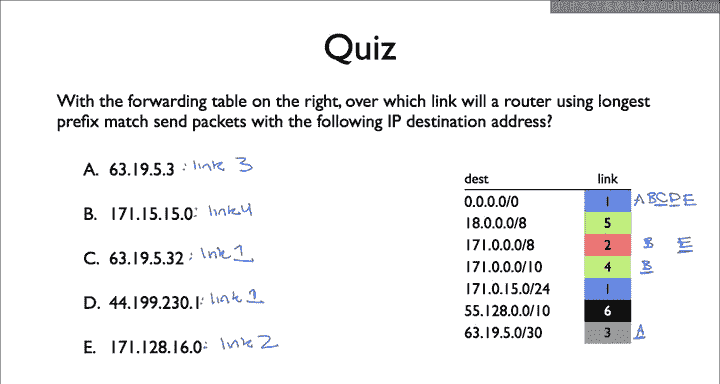