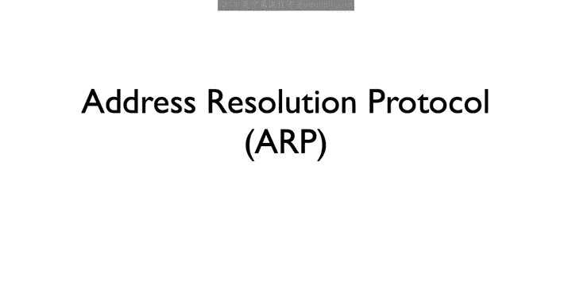
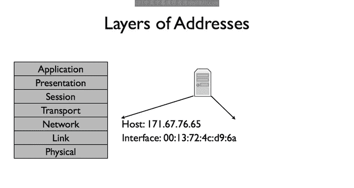
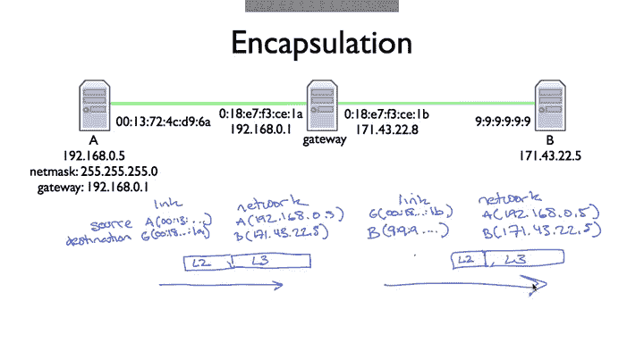
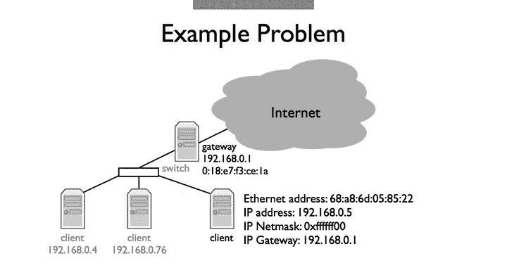
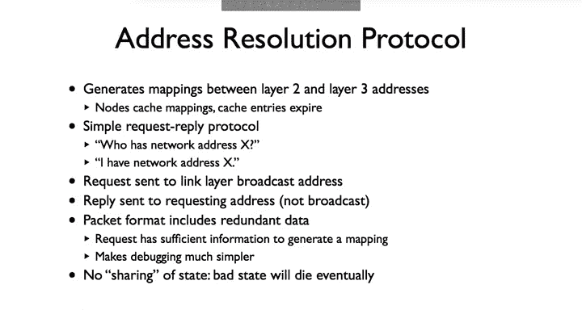
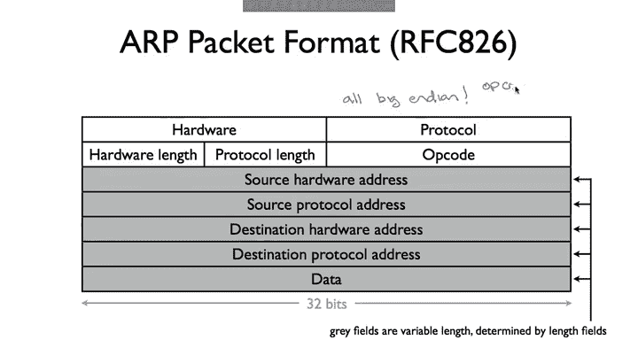
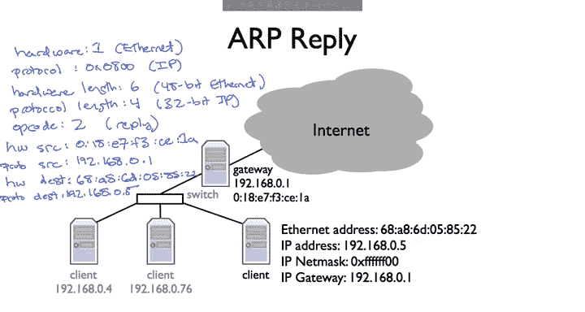

# 斯坦福大学《计算机网络｜Introduction to Computer Networking CS 144 2018》中英字幕deepseek - P20：-020-Address Resolution Proto.zh_en - GPT中英字幕课程资源 - BV1bVqNYFEGg

The address resolution protocol or ARP is the mechanism by which the network lyric can discover the link address associated with the network address it's directly connected to。

Butut another way。 It's how a device gets an answer to the question。

 I have an I P packet whose next top is this address。 What link address should I send it to。

ARP is needed because each protocol layer has its own names and addresses。

 An IP address is a network level address。 It describes a host a unique destination at the network layer。

 A link address in contrast， describes a particular network card。

 a unique device that sends and receives link layer frames。 Ethernet， for example。

 has 48 bit addresses。 Whenever you buy an ethernet card。

 it's been preconfigured with a unique ethernet address。 So while an IP address says this host。

 an ethernet address says this ethernet card。

48 bit ethernet addresses are usually written as a colon delimited set of six octes in hexedadecimal。

 such as0 colon 13， colon 472， colon 4C， colon D9， colon 6A， as in A in this example。

 or 999999 as in the destination B。One thing that can be confusing is that while these link layer and network layer addresses are completely decoupled with respect to the protocol layers in terms of assignment and management they might not be。

 For example， it's very common for a single host of multiple I addresses。

 one for each of its interfaces。 It needs to， because of the concept of a net mask。 For example。

 look at this hypothetical setup with A B in a gateway。

 the gateway in the middle has a single IP address 192。168。0。1。 It has two network cards。

1 connecting at the destination 171。43。 22。5，1 connecting it to the source on the left，192。168。0。5。

Now， the gateways address，192。168。 0。 1 can really only be in one of these networks。

 The network on the left， the source network A the network mask needed for 192。 168。

0 1 to be in the same network as 171 43 22。 5 is 1，28。 0。

0 do 0 or just 1 bit of network mask It can't be that all IP addresses whose first bit is 1 are in the same network as 171。

 43。22。5。1，92。 168。0。5， for example， needs to be reached through the gateway。So instead。

 we often see setups like this， where the gateway or router has multiple interfaces。

 each with their own link layer address to identify the card and also each with their own network layer address to identify the host within the network that that card is a part of。

For the gateway， the left interface has IP address 192。168。0。1。

 while the right interface has IP address 171。43。22。8。

The fact that link layer and network layer addresses are decoupled logically。

 but coupled in practice is in some ways a historical artifact when the internet started there were many link layers and wanted to be able to run on top of all of them。

 these link layers weren't suddenly going to start using IP address instead of their own addressing scheme。

Furthermore， there turns out to be a bunch of situations where having a separate link layer address is very valuable。

 For example， when I register a computer with Stanford's network。

 I registered its link layer address， the address of the network card So what does this mean in practice let's say note A on the left wants to send a packet to node B on the right it's going to generate an IP IP packet with source address 192。

168。0。5 and destination address 171。43。22。5。Note A checks whether the destination address is in the same network。

 the net mask tells it that the destination address is in a different network。2，5，5， that 2，5，5。

 the 2，5，5。This means node A needs to send the packet through the gateway or 192。168。0。1。To do this。

 it sends a packet whose network layer destination is 171。43。22。5。

 but whose link layer destination is the link layer address of the gateway。

 So the packet has a network network layer destination 171。43。22。

5 and a link layer destination018 E7 F3 C E1A。The network layer source is 1092。168。0。5。

 and the link layer source is 013724 c D96A。So we have an IP packet from A to B encapsulated inside a link layer frame from A to the left gateway interface。

 When the packet reaches the gateway， the gateway looks up the next top。

 decides its node B and puts the IP packet inside a link layer frame to B。

 So the second IP packet from A to B is inside a link layer frame from the right gateway interface to B。

😊。

So here we get to the problem Ap solves My client knows it needs to send a packet through the gateway that has IP address 192。

168。0。1。To do so， however， it needs to have the link layer address associated with 192。168。0。1。

 How does I get this address， We somehow need to be able to map a layer 3 network layer address to its corresponding layer 2 link layer address。

 We do this with a protocol called ARP or the address resolution protocol。

ArRP is a simple request reply protocol Every node keeps a cache of mappings from IP addresses on its network to link layer addresses If a node needs to send a packet to an IP address it doesn't have a mapping for。

 it sends a request who has network address X？The node that has address that network address responds saying I have network address X。

 The response includes the link layer address on receiving the response。

 the requester can generate the mapping and send the packet。So that every node heres the request。

 a node sends request to a link layer broadcast address。

 every node in the network will hear the packet。Furthermore。

 Ap is structures that it contains redundant data。 The request contains the network and link layer addresses of their requester That way。

 when nodes here a request sinces a broadcast， they can insert or refresh a mapping in their cache。

 nodes only respond to requests for themselves。 This means assuming nobody is generating packets incorrectly。

 the only way you can generate a mapping for another node is in response to a packet that node sends。

 So if another node crashes or disconnects， it state will inevitably leave the network when all the cache mappings expire。

 This makes to bugging and troubleshooting a much easier。

So how long these dynamically discovered mappings last， It depends on the device。

 Some versions of Macos 10， for example， keep them for around 20 minutes。

 while some Cisco devices use timeouts of 4 hours。 The assumption is that these mappings do not change very frequently。

 This is what an a packet actually looks like。 It is 10 fields。

 The hardware field states what link layer this request or response is for。

 The protocol field states what network protocol this request or responses for。

 The link field specify how many bytes long。 The link layer network layer addresses are。

 The op code specifies whether the packet is a request or response。

The four address fields are for requesting and specifying the mappings。

Remember all of these fields are stored in network order or Big Indianian。

 so if you have an Op code of 15， itll be stored as 0x000 f in the Op code field。

So let's say our client wants to send a packet to the broader internet through its gateway。

 but it doesn't have the gateways eitherther in that address。

The R requestquest will specify that the hardware is ethernet， which is value 1， the protocol is IP。

 which is value 0 x0800， the hardware address length is 6， and the protocol length is 4。

The Op code will be request whose value is one。The source hardware field will be their Queer's Ethernet address。

 68A86058522。The source protocol field is the requester's IP address 192。168。0。

5 the destination hardware address can be said to anything。

 it's what the packet is trying to discover。The destination protocol address is the address that client is trying to find a mapping for192。

168。0。1 The client sends this frame on the ethernet。

 Every node of the network receives it and refreshes the mapping between the sender's link layer address 688860058522 and its network layer address 192。

168。0。5， or it inserts a mapping if it or doesn't already have one。

The client will generate our request whose linkai source address is its address， 68 A86 D058222。

 The destination link layer address is the broadcast address， FF， FF， FF， FF， FF， FF， all ones。

The gateway sees that the request is for its IP address and so generates a reply。

Like request like the request， the ARP apply will specify that the hardware is ethernet。

 which is value 1， the protocols IP， which is value 0 x 0800。

 The hardware address is length is 6 and the protocol length is 4。The op code will be reply。

 This value is2。 The our source hardware field will be the reply's Ethernet address，0。

18 E7 F3 C EA 1，1 a， sorry。The source protocol field is the answer，192。168。0。1。

 The destination hardware address is the source address of the request，68，88，6058522。

 The destination protocol address is the source protocol address of the request， 192168。0。5。

It's an open question what link layer address you send the response to The original Ap specification stated that the reply should send it to the requester's link layer address。

 so UniIcast， it's common today to broadcast that， however。

 as doing so can more aggressively replace cache entries if the mapping needs to change。

Notes also concern were called gratuitous art packets。

 requesting nonexistent mappings in order to advertise themselves on the network。

So we've seen how in order to route packets one needs to be able to map network layer addresses to linkL addresses。

 the address resolution protocol or ARP provides the service through a simple request reply exchange If a node needs to send a packet to or through an IP address whose link layer address it does not have it request the address through ARP。

