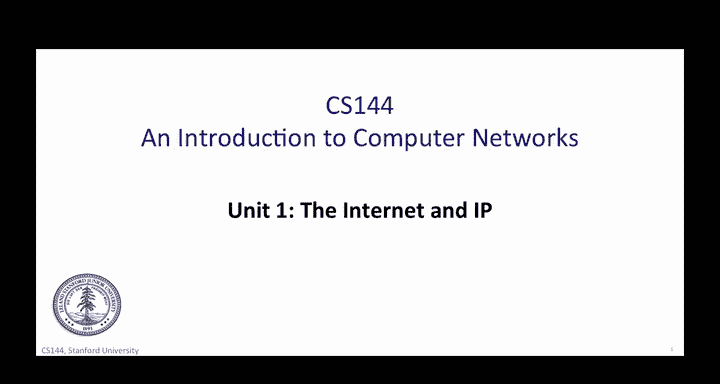
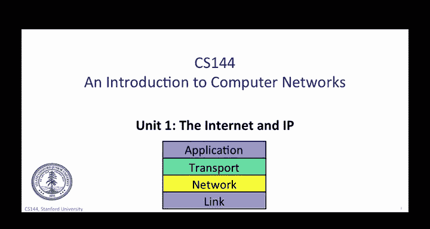
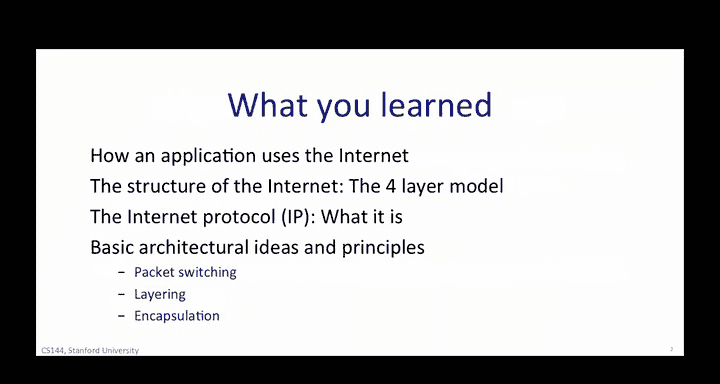
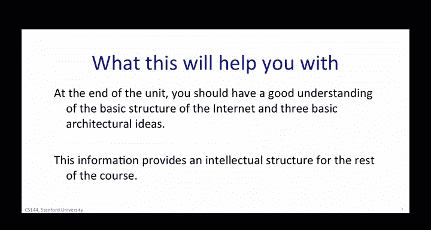

# 斯坦福大学《计算机网络｜Introduction to Computer Networking CS 144 2018》中英字幕deepseek - P21：-021-The Internet and IP Reca.zh_en - GPT中英字幕课程资源 - BV1bVqNYFEGg

In this unit， you learn some of the basics of how the internet works。

 you learn how applications like web browsing and SkyPk， how an application uses the internet。

 and the basic structure of the internet itself。

You learned some of the fundamental architectural principles of networking。

 perhaps by now you know which one of us is Phil and which one of us is Nick。

Now if you've finished the first unit， you should be familiar with this picture of the four layer model of the internet。

 you now know that the internet is broken down to these four distinct layers。

 what they are and how they work together， but even more importantly than how they work。

 you hopefully understand why the internet works this way and why layering is a good idea in all networks。

 not just the internet。You've seen that the internet works by breaking up data into small units called packets。

 When you request up the web page， your computer sends some packets to a web server。

 The internet decides how these little pieces of data arrive to the right dress destination and how the packets the web server responds with containing the page make their way to you correctly as well。

You've learned how two architectural principles， layering and packets come together in the architectural principle of encapsulation。

 encapsulation is how one it takes layers and lets them use packets in a clean and simple way such that each layer's use of a packet is independent of the others。

 We'll talk about a few more architectural principles in future units。

So to be specific， what we've learned so far in this unit， we've started four main topics， first。

 how an application uses the internet。Phill explain the common way in which a variety of different applications such as Skype。

 Bitand and the web all use the internet in a very similar manner。

 you learn that most applications want to communicate over a reliable bidirectional by stream between two or more endpoints。

The second thing that you learned about was the structure of the internet。

In specifically the four layer model， you learn what the four layer model is。

 the responsibility of each layer。 You also learn why we use the Internet protocol or IP every time we send packets across the Internet and why we call I the thin waste of the Internet。

The third thing we learn about was specifically the internet protocol， what it is。

 and because IP is so important we spent several videos describing what IP does for us and how it works。

So far we've discussed just IP version 4 because it's the most widely used version of IP today。

You've learned about IP addresses， how routers look up IP addresses and so on Later on。

 we're going to be learning about a newer version of IP called IP version 6。

The fourth topic was basic architectural ideas and principles you've studied three fundamental principles of networks。

 all of which are very relevant to our understanding of the internet， the first is packet switching。

 which is the simple way in which data is broken down into self-contained packets of information that afforded hop by hop based on the information in the packet header。

The second is layering， which was mentioned and seen in detail， the third is encapsulation。

 which is the process of placing a packet processed at one layer inside the data portion of a packet in the layer below。

This helps provide a clear separation of concerns between how data is processed at each layer in the hierarchy。

You should now have a good understanding of the basic structure of the internet and three basic architectural ideas。

 you understand how applications like your web browser works。

 and now the internet delivers packets between two computers。

You now know what TCP is and what IP is and why they're related。At first glance。

 these might seem like grungy low level details， but it turns out that these are the bedrock of what the internet is。

Every year new applications and uses of the internet emerge。

 but all of them use these basic principles you're learning about。

 and almost all of them use TCPIP by starting with these fundamentals that have remained amazingly constant。

 you'll learn the knowledge that will continue to be important even as we move on to 5G wireless networks's web 3。

0 in the Internet of things。And that's part of what's exciting。

 the internet and what it can do is always expanding and changing。

 but there are some core ideas and principles which are constant through all of that evolution by learning them。

You not only learn how the internet works and how networks today work。

 but most likely how they will work even in 20 years or more。

