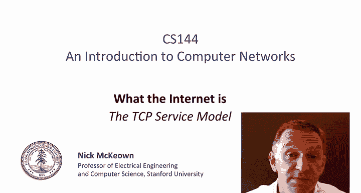
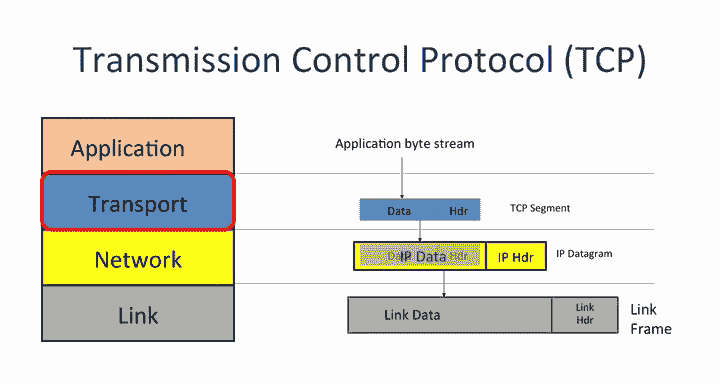
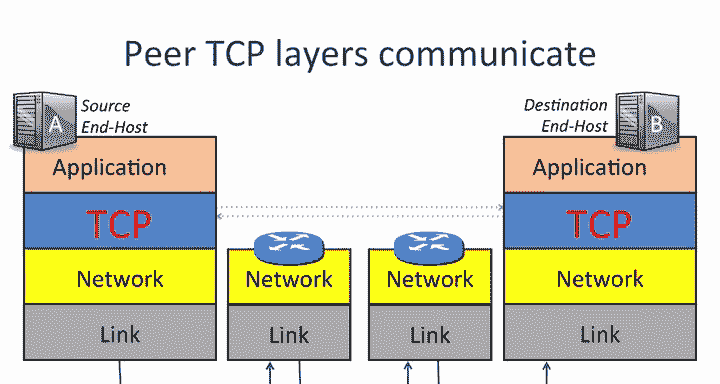
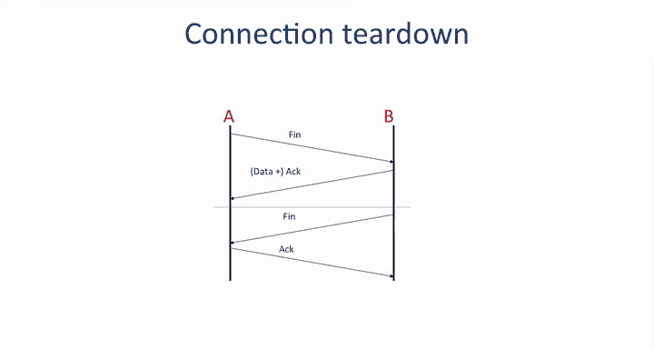
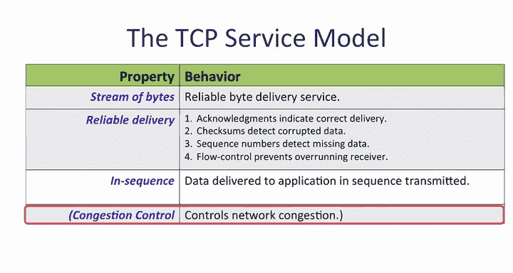
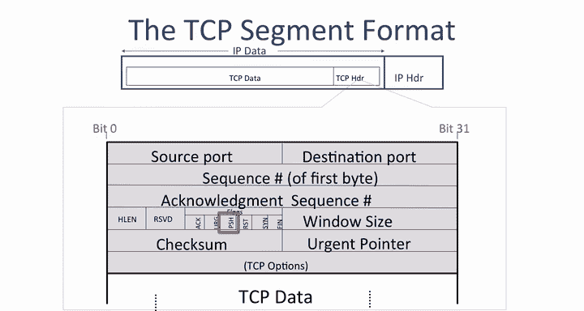
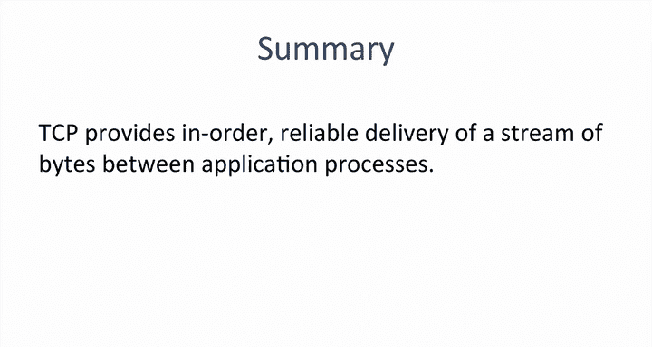

# 斯坦福大学《计算机网络｜Introduction to Computer Networking CS 144 2018》中英字幕deepseek - P24：-024-TCP service model 64.zh_en - GPT中英字幕课程资源 - BV1bVqNYFEGg

In this video， you're going to be learning about TCP， the transmission control protocolto。

 which is used by over 95% of all internet applications。

TCP is almost universally used because it provides the reliable N to end bidirectional by stream service that almost all applications want。

TCP is an example of the transport layer。When an application calls TCP。

 it hands it some bytes that it once delivered to the other end TCP places these bytes into a TCP segment and then takes it from there。

TCP hands the segments to the IP layer， which encapsulates it into an IP datagram。

 the IP addresses are added。The IP datagram is handed in turn to the link layer。

 which builds the link frame， adds the link address， for example。

 the Ethanhead addresses and then it sends it onto the wire。

When two applications use TCP， they establish a two way communication channel between the TCPP peers at both ends。

First， TCP establishes a communication channel from A to B。

 Then it establishes the channel from B to A。We call the two way communication a connection at both ends of the connection。

 TCP keeps a state machine to keep track of how the connection is doing。

 We'll see how the state machine works in a separate video。

The TCP connection is established using a three way handshake between hosts A and B。 First of all。

 host A sends a message to B， indicating that the TCP layer at A wants to establish a connection with the TCP layer at B。

The message is called a S message SYN， which is short for synchronize。

 because A also sends along the base number it will use to identify bys in the by stream。

If it sends0， then the numbers will start at0。 if it sends  a000， then they will start at 1000。

B responds with what we call a sin plus act。B signals an act because B is acknowledging A's request and agreeing to establish the communication from A to B。

The TCP at layer at B also sends a S back to A to indicate that the TCP layer at B wants to establish a connection with the TCP layer at A。

It sends a number  two， indicating the starting number for the by stream in the reverse direction。

Finally， a responds with an act to indicate that it is accepting the request for communication in the reverse direction。

The connection is now set up in both directions。 They're now ready to start sending data to each other。

Thes the hosts send data to each other as if it were from a continuous stream of bites。

Assume time is increasing from left to right， and the stream of bys next to A represents the bys it wants to send to B。

The stream of bys might exist in advance。For example。

 they are read from an HTML file describing a static web page。

 or it could be a stream being generated on the fly， for example， from a video camera， either way。

 TCP sees it as a stream of bys。Data from the application on A is delivered to the application at B the TCP layers on A and B work together to make sure the stream of bytes is delivered correctly in order to the application at B。

The stream of bytes is delivered by TCP segments。A puts bytes from the stream into a TCP segment。

 hands it to the IP layer， which delivers it to B。The TCP layer at B extracts the bytes to recreate the byte stream and delivers them to the application at B。

In practice， the TCP segment may need to be transmitted multiple times in the case a segment is dropped along the way or if A doesn't receive an acknowledgement。

The TCP segment can be as small as one B。 For example。

 if you're doing typing characters in an SSH session。

 each character is sent one at a time rather than waiting for the whole segment to fill up。

This isn't very efficient when we have lots of data descend。

 so we can fill the TCP segment all the way up to a maximum IP datagram size。

When A and B have finished sending data to each other， they need to close the connection。

 We say they tear down the connection， which means they tell each other they are closing the connection and both ends can clean up the state associated with the state machine。

The TCP layer at Hos A can close the connection by sending a f message， which is short for finish。

Host B acknowledges that A no longer has data to send and stops looking for new data from a。

This closes down the data stream from A to B。But B might still have new data to send to A and is not ready to close down the channel from B to A yet。

So the message from B to A carrying the act can also carry new data from B to A。

B can keep sending new data to A as long as it needs to。Sometime later。

B finishes sending data A to a and now sends its own f to tell A they can close the connection。

Hosay replies by sending an act to acknowledge that the connection is now closed。

Because both directions have finished， the connection is now fully closed。

 and the state can be safely removed。

Here is a table summarizing the services provided by TCP。

The first three are services TCP provides to the application。As we just saw。

 it provides a reliable stream of bys between two applications。

TCP uses four mechanisms to make the communication reliable。 In other words。

 to make sure the data is correctly delivered。When a TCP layer receives data。

 it sends an acknowledgement back to the sender to let it know the data arrived correctly。

Check some to detect corrupted data。The TCP header carries a checkum covering the header and the data inside the segment。

The checkum is there to detect if the segment is corrupted along the way， for example。

 by a bit error on the wire or by a memory fault inside a router。

Sequence numbers detect missing data。Every segment's header carries the sequence number in the stream of bys。

 of the first byte in the segment。For example， if the two sides agree that the sequence starts at 1000。

 then the first segment will have a sequence number of 1000。

 if the segment carries 500 bytes of data， then the next segment will carry the sequence number 1。

500。If a segment gets lost， then the sequence number will be incorrect。

 and the TCP layer knows some data is missing。It is possible it will show up later。

 Perhaps it took a longer path where it might have gone missing。

 in which case the sender will need to resendd the data。

Flolow control prevents overrunning the receiver。If host A is much faster than host B。

 then it's possible for host A to completely overwhelm host A B by sending data so fast that host B can't keep up。

TCP prevents this from happening using something we call flow control。In TCP。

 the receiver keeps telling the sender if it can keep sending。Specifically。

 it tells the sender how much room it has in its buffers to accept new data。

If host B is falling behind， the space drops， possibly all the way to 0。When it has more room。

 it tells a， and it can send more data。TCP delivers data to the application in the right sequence。

 In other words， whatever sequence the data was delivered from the application to TCP at hostA。

 this is the same order in which it is sent from TCP to the application at B。

If segments arrive at B out of order， the TCP layer resequences them to the correct order using the sequence number。

Finally， TCP provides a service to the whole network by controlling congestion。

TCB tries to divide up the network capacity equally among all the TCP connections using the network。

The congestion control mechanisms in TCP are very complicated and will devote the whole of unit 4 to studying congestion control。

The TCP segment header is much longer and more complicated than say， the I and ethernet headers。

That is because a TC P connection is reliable in order to make the communication reliable。

 the two ends of the connection need to exchange more information so they know which bites have arrived。

 which are missing in the status of the connection。

Here's a quick summary of the most important fields in the TCP header。

 you don't need to remember the layout of the header， but you should learn what each field does。

If you need a reference， I'd recommend Wikipedia or the Corrosian Ross textbook。

The destination port tells the TCP layer which application the bys should be delivered to at the other end。

When a new connection starts up， the application tells TCP which service to open a connection with。

For example， if TCP is carrying web data， it uses port 80， which is the port number for TCP。

 you'll learn more about port numbers later， but if you're curious。

 you can look up the well known port numbers at the Iana that spell IANA website。

 Search for Iana port numbers。You'll find thousands of port numbers defined for different well known services。

 for example， when we open a connection to an SSH server， we use Destination port 22 for SMTP。

 the simple mail transfer protocol， we use port 23。Using a well known port number。

 let's host B identify the application it should establish the connection with。

The sourceport tells the TCP layer at the other end。

 which port it should use to send data back again。In our example， when host B replies to host A。

 it should place host A's sourceport number in the destination portfield so that host A's TCP layer can deliver the data to the correct application。

When when a new connection starts， the initiator of the connection， in our case。

 host A generates a unique source port number to differentiate the connection from any other connections between host A and B to the same service。

The sequence number indicates the position in the by stream of the first byte in the TCP data field。

For example， if the initial sequence number is 1000 and this is the first segment。

 then the sequence number is 1000。The acknowledgement sequence number tells the other end which bite we're expecting next。

 it also says that we have successfully received every byte up until the one before this bite number。

So， for example， if the acknowledgment sequence number is 751。

 it means we've received every bite up to and including byte 750。

Notice that there are sequence numbers for both directions in every segment。

 this way TCPPback's acknowledgements on the data segments travelling in the other direction。

The 16 Bs checkum is calculated over the entire header and data and helps the receiver detect corrupt data。

 For example， Bi errors on the wire or a faulty memory in a router。

You'll learn more about error detection and checkums in a later video。The header length field。

 the one on the far left， tells us how long the TCP header is。

The TCP options fields are well optional。They carry extra new head of fields that were thought of and added after the TCP standard was created。

The head of length field tells us how many option fields are present， usually there are none。Finally。

 there are a bunch of flags used to signal information from one end of the connection to the other。

The Act flag tells us that the acknowledgecknowledgment sequence number is valid。

 and we're acknowledging all of the data up until this point。

The S flag tells us that we are signaling a synchronise。

 which is part of the three way handshake to set up a connection。

And the fin flag signals the closing of one direction of the connection。Finally。

 the push flag PSH tells us the TCP layer at the other end to deliver the data immediately upon arrival。

 rather than wait for more data。 This is useful for sending short segments carrying time critical data。

 such as a keystroke。We don't want the TCP layer to wait to accumulate many keystrokes before delivering them to the application。

A TCP connection is uniquely identified by five pieces of information in the TCP and IP headers。

The IP， source and destination address uniquely identify the endpoints and the IP protocol ID for TCP tells us the connection is TCP。

The TCP source and destination ports identify the application processes on the end hosts。 together。

 at any instant， all five fields uniquely identify the TCP connection Internet wide。Now。

 the unique ID only holds if a few things hold。First， we need to make sure host A。

 the initiator of the connection， picks a unique source port I D。

 We need to make sure it doesn't accidentally pick the same source port number it already used with another connection to the same service on host B。

Hos A uses a simple method to a minimise the chances。

 It increments the source port number for every new connection。The field is 16 bit。

 so it takes 64K new connections before the new field， the field wraps around。

There's also a very slight danger that if host A suddenly creates a lot of new connections to host B。

 it might still wrap around and try to create two connections with the same global I。

If this happened， the bys from one connection might become confused with the bites from another connection。

 This could happen， for example， if a TC P segment somehow lived for a very long time in the network。

 stuck inside a router buffer or circulating in a temporary loop。To reduce the chances of confusion。

 TCP connections initialize with a random initial sequence number to refer to bys in the bys frame。

While not totally foolproof， it does reduce the chances of confusion。

When host A initiates the connection to B， it includes the initial sequence number it will use in the stream of bytes from A to B When B replies and initiates the connection from B to A。

 it supplies its own sequence number， initial sequence number from the stream of bytes from B to A。

So to summarize how sequence numbers work， the sequence number in a segment from A to B includes the sequence number of the first byte offset by the initial sequence number。

The acknowledgement sequence number in the segment from B back to A tells us which byte B is expecting next。

 offset by A's initial sequence number。Let's summarize how TCP port numbers work。

Imagine the host that hostt B on the right offers two services， a web server and a mail server。

When the Web client， for example， a Chrome browser on Host A wants to request a page from the web server on B。

 it sends the data to TCP。We'll assume TCP has already established a connection with B。

 so now it just needs to send the data， it creates a segment and uses destination port 80 to tell B it is requesting the data to be sent to the web server。

Host A uses a locally generated source port number for B to use when sending data and acknowledgecknowgments back again。

As usual， the TCP segment is encapsulated into an I datagram and sent the be。

The I and TCP headers carry the unique idea of the TCP connection internet wide。

When the IP Datagram arrives at B， the TCP segment is removed。

The TCP layer sees that the segment is for port 80 and sends the data to the web server。

The TCP sliding window。You' will learn about other TCP features in upcoming videos。

 you'll learn about window based flow control to stop us from overwhelming the receiver。

You'll learn about retransmission and timeouts and different mechanisms to accomplish it。

And you'll learn about congestion control in unit 4。So in summary， TCP provides。In order。

 reliable delivery of a stream of bytes between application processes。

