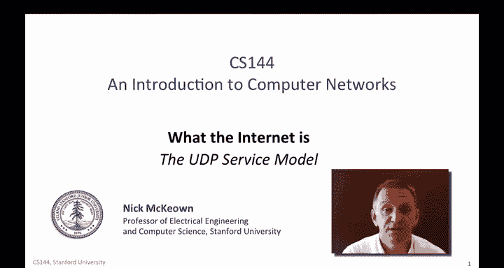
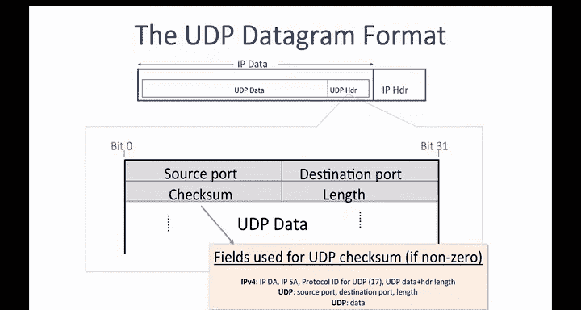
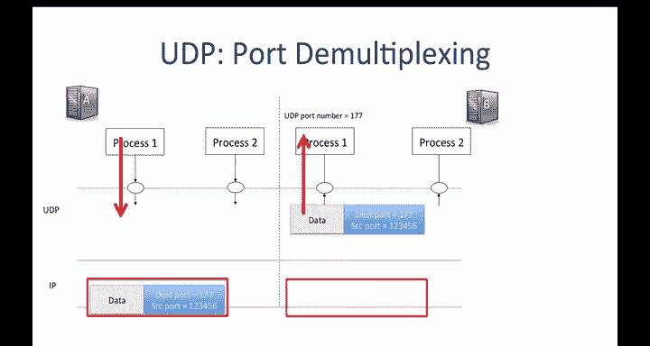
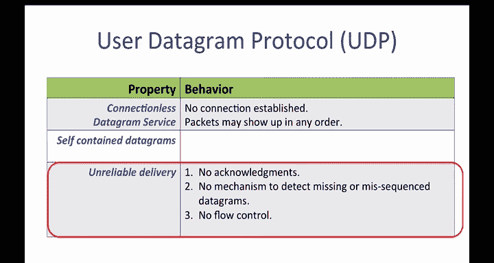
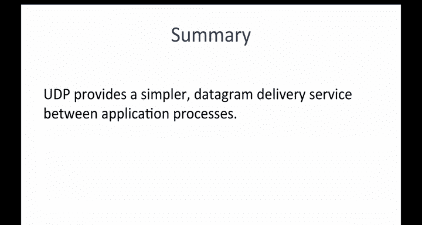

# 斯坦福大学《计算机网络｜Introduction to Computer Networking CS 144 2018》中英字幕deepseek - P25：-025-UDP service model 64.zh_en - GPT中英字幕课程资源 - BV1bVqNYFEGg

In this video you're going to be learning about the second transport layer UDP or the user Datagram protocol UDP is used by applications that don't need the guaranteed delivery service of TCP。

 either because the application handles retransmissions in its own private way or simply just doesn't need reliable delivery。

UDP is much， much simpler than TCP， which is why this video is much shorter。

All UDP does is take application data and create a UDP datagram。

Then hands it to the network layer the UDB Datagram simply identifies the application that the data should be sent to at the other end that's really about it。

As we have come to expect， the UDB datagram is encapsulated inside the data field of the IP Datagram。

UDP provides a very simple service， it should be clear from the small number of fields in the UDP header。

 unlike TCP that has over 10 header fields， UDP has just four。

The sourceport indicates which application the data comes from， if the far end replies。

 it will send a datagram with this port number as the destination so that it can find its way back to the correct application at A。

The destination port indicates which application the data should be delivered to at the other endho。

The port numbers in UDP serve the same purpose as in TCP。

 they direct incoming packets to the correct application process。

The 16 bit length field specifies the length of the whole UDP Datagram header+ data in bytes。

The value must be at least8 bytes because that is the length of the UDP header。

The UDP checkum is optional when using IPV4。 If the sender doesn't include a checkum。

 the field is filled with all zeros。 If a UDP checkum is used。

 then it's calculated over the UDP header and data。In fact。

 the UDB checkum calculation also includes a portion of the IPV4 header as well as shown here。

The calculation includes the I source and destination addresses and the protocol I。

 which has the value of 17 and tells us that the IP datagram carries UDP data。

You might be wondering why the UDP checkum includes part of the IP header。

Doesn't that violate the clean separation of layers？Oh， yes， it does。

The rationale for violating the layering principle and using information from the layer below is that it allows the UDP layer to detect dataograms that were delivered to the wrong destination。

In summary， the UDP header is small。Because the service it offers the application is very simple。

 it provides a simple message protocol for sending data from an application on one host that may or may not be delivered to an application on a remote host。

Port numbers in UDP work the same way as in TCP。If process 1 on hostst A has data to process wants to send data to Pro 1 on hosts B that uses port 177。

 the data is placed into a new UDP datagram with destination port 177。

HostA adds its own source port number so any replies could be sent to process one on Ho A。

The datagram is encapsulated in IP Datagram and sent to hostB。

HosB removes the UDP data and directs the data to process one。

It's useful to think of UDP as merely a demxing mechanism to divide up the stream of UDB datagrams arriving at hostB and send them to the correct process。

 in fact， some people call UDP the user de multixing protocol for this reason it's essentially all UDP does。

To sum up UDP's service model， we say that it has the following three properties shown here in the table。

First， it provides a connectionless datagram service。

 no connection is established because none is needed。

 all of the information is self contained in the datagram。It means packets may show up in any order。

 so if the application cares about in order delivery， it will need to resequence the data itself。

UDP is an unreliable delivery service。 It doesn't send any acknowledgments to let us know data reached the other end。

 It has no mechanism to detect missing datagrams。 If an entire datagram is dropped along the way the way。

 UDP will not inform the application and it will not ask the source to resend the datagram。However。

 the application might choose to ask for the data again by itself。

 essentially building a retransmission mechanism on top of UDP。Early versions of N NFS。

 the network file system did exactly this。 They detected they decided they didn't want to use the sliding window used by TCP。

 So they created their own inside the application。UDP should sound very much like the service provided by the IP layer。

That's because UDP is offering little more than a simple wrapper on top of the IP layer with a means to direct the arriving data to the correct application at the other end。

So why do we have UDP？UDP is used by applications that don't need reliable delivery。

 such as simple request for response applications。 DN S， the domain name system used by the Internet。

 turn a host name into an I address uses UDP because the request is fully contained in one UDP datagram。

You'll learn how DNS works later。But now for now， you just need to know that if we send a DNS request containing a host name。

 the DNS server will respond with an IP address we can use to send IP datagrams to the host。

If the request is successful， then using UDP as lightweight and fast。

 there's no need to set up a connection before making the query。If the request is unsuccessful。

 it simply times out and is resent。This makes DN S simple and fast， most of the time。

The DHTPE or dynamicynamic host configuration Pro uses UDP for the same reasons。

The network Time protocol or NTP also uses UDP because it too is a request response protocol。

Some other applications use UDP because they have their own special needs for retransmission。

 congestion control， and in sequence delivery。For example。

 a few real time streaming audio and video services use UDP。

This is much less common than it used to be， because most video and audio streams of HtTP today。

Use TCP instead of UDP。 That's because they're built on top of HTTP。

In summary， we say that UDP provides a simpler datagram delivery service between application processes。

