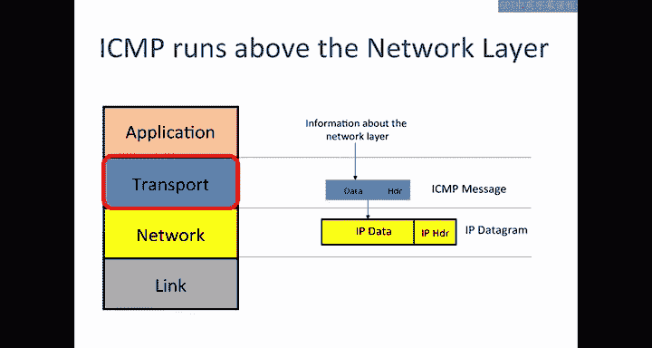
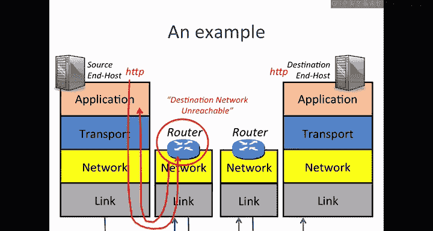
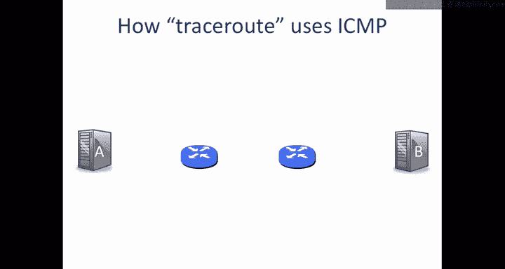
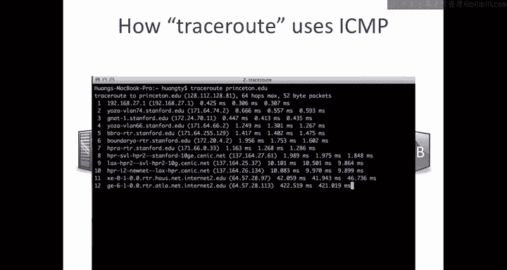
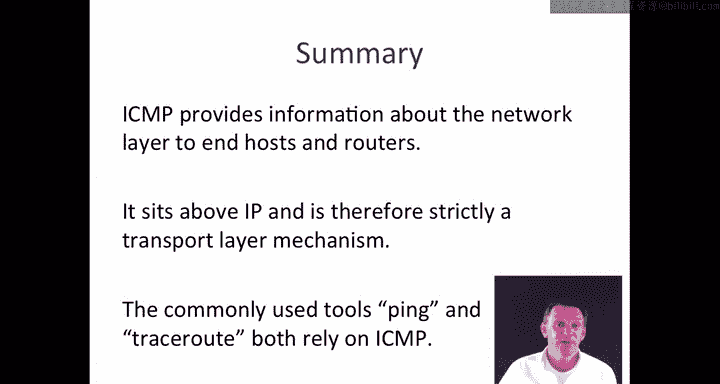

# 斯坦福大学《计算机网络｜Introduction to Computer Networking CS 144 2018》中英字幕deepseek - P26：-026-ICMP service model 64.zh_en - GPT中英字幕课程资源 - BV1bVqNYFEGg

In this video I'm going to continue the topic of the four layerer internet model and I'm going to tell you about the ICMP service model ICMP is the Internet control message protocol and it's used to report errors and diagnose problems with the network layer you'll recall that IP doesn't provide any guarantees about delivery but it does help and it will prove to be a very valuable tool to get some hints and some information back from the network layer to tell us about when things are going wrong。

There are three mechanisms that we use to make the network layer work in the internet。

 The first we've already seen is the internet protocol or IP。

This creates IP dataograms and then delivers them hop by hop from end to end。

The second are the routing tables sitting inside the routers。

 there are algorithms that run to populate these route of forwarding tables so that the routers know how to deliver them hop by hop to the other end。

The third mechanism which is the purpose of this video is ICMP or the Internet control message protocol ICMP helps communicate information about the network layer between the end hosts and the routers and I'm going to show you a couple of examples of those in a minute it's typically used to report error conditions and helps us diagnose problems。

 figure out the path taken by packets and so on。ICMP runs above the network layer and so strictly speaking it's a transport layer protocol when an end hostst or router wants to report an error using ICMP。

 it puts the information that it wants to send back to the source into an ICMP payload and hands it to IP to be sent as a datagram。

Let's look at an example， as I said ICMP typically gets used as a method for error reporting and in fact you've seen it if you've ever seen the message destination network unreachable so let's look at an example。

 imagine that I have a web client running as the application here so I've got an HTTP or web client here that's going to be accessing an HTTP server over here at B。

So as we've seen before， the application bytes that for HTTP get put into the transport layer as usual into TCP comes down to the network layer goes out along the link comes up to the router along here。

 imagine that the address that is put in here。It's actually to a network that this router has no information about in its forwarding table。

Now this would be a pretty bad situation because that router doesn't know how to forward the packet to be。

But if that happens， then the router will send back a message and so this will come back down through the network to a。

 and it will say in it。Destination。Network。Unreachable。

And that's simply saying that it has no means to deliver that packet to B so it's alerting A by sending that back。

😊。

And we'll see the format that it uses in a moment so basically the ICmpP service model is very very simple。

 it allows it to send a reporting message， a self-contained message reporting the error。

 it's unreliable in the sense that it sends a simple datagram， it doesn't attempt to resend it。

 it doesn't maintain any state of the messages that it sent it simply sends back a digest if giving an indication of what the problem was。

And in fact how it actually works is when a message comes in so for example an IP datagram。

 so here is my IP datagram here is the header here is the payload or the data portion of my IP datagram so this is my IP datagram let's say that this has just arrived and in my previous example this has arrived from a to the first router If the first router wants to send back an ACCMP message what it does is it takes a it takes the header now this header here has source address A and destination address B。

And it will populate this into， it'll place this into an ICMP message。

 so it will take this header and put it into the ICMP message， so this is my ICMP message。

And it will also take the first eight bytes of the IP payload and it'll put this into the ICMP message。

 and then it marks it with a type。And a code， and we'll see some examples of these types and codes in a moment。

And then the whole wt gets placed into a new IP Datagram， so this is the data of the new IP datagram。

And this is going to be sent back， so this is the header， and so the IP source will be the router。

So I'll just put R for router and the IP destination in my example will be a。

 it's going to send it back to a to tell it that this was the error， this was the type of error。

 this is how it figures out what type of error it was， this was the data associated with that error。

 it's the IP datagram that was originally causing the problem。

 that's all placed into the data of the IP datagram that goes back again to A。

There's a good example of some particular ICMP message types， there are a lot of message types。

 this is just a sampling of them， these are the six most important that we see and you don't need to remember the types or the codes you'll find those in the internet RFC 792 and you can just look that up online if you want。

These are the ones that are most commonly used and I'll just go through examples we've already seen the network unreachable。

 this was type 3 code Ze and there are two other destination unreachable ones， host unreachable。

 that's if IP datagram gets to the last router but then the last router doesn't know where the host is Port unreachable means that the port that's contained inside or the protocol ID that's inside the IP datagram。

 it doesn't know what to do with it it doesn't recognize it at the other end。We'll see how ECcho Re。

 ECcho Re and TTL expired are used in a moment。Okay。

You've probably used the ping command before and ping is used just to test the liveness of another host and it also checks that we've got connectivity to that host so imagine that we're sending a ping message from A to B so we're sitting at A and we run the command ping B。

And you've probably done this if you haven't just tried this on your computer。

 pick the name of a computer like www。tanford。edu and just type pingwww。tanford。u。

The Ping application callss ICMP directly， it sends a ICMP echo request。

 and so that will be a message that goes into the network， so this is an ICMP。So this is ICMP。

And it's a。Happens to be a message of type8。Code zero。

 and if you look on the table before that's actually a echo request。

And then that gets encapsulated at a into an IP data。

So this is my AP datagram and it's going to go off to B。As this goes through the network。

 it's going to go across 2 B， we hope eventually it over reach B and then B is going to see this and what Ber is required to do is to send an echo reply so it will send back a。

Towards a， it will send the ICMP and the ICMP will be a， I think it was type zero code zero。

 which is the echo reply。This gets placed into an IP diagram。

So this will all be placed into the IP dataogram。And it'll be sent back to a nice and simple。

 so that's how ping works。Now let's have a look at how trace Ro works。😊。

Traceroute is an application that tells us the path that packetett to take through the network and the routers that it visits along the way。

 you can try this by simply typing tracero and then the name of a web server or some other server on the network into your computer as I'm showing here。

Tra Rak is going to tell us not only the path taken by packets。

 but the round trip delay to each of the routers along the path。

So traceroute uses ICMP in quite a clever way， so the goal here of traceroute is to find the routers on the path from A to B so it's trying to identify the two routers along the path and measure the round trip time of packets from a to each of those routers。

So trace Out does this by sending UDP messages and I'm first of all to describe what it does and then we'll see why it is that that works。

So A is going to send a UDP message， so it's going to send a UDP message and that UDP message is going to be sent doesn't actually matter what it contains。

 but it will go be encapsulated into an IP diagram for which the TTL。

 the time to live field in the IP header is set to one。

So this will be sent over the link from a to the first router and as you recall the router is required to decrement the TTL and then discard the packet if the TTL reaches zero。

 so it will set TTL equals0， discard the packet。One more thing that the router is required to do is to send back an ICMP message。

 so an error reporting message back to A。And it sends it back with a message of。

 I think it's type 11 ICMP。Okay， so it's going to send back a F 11 message， which is the TTL expired。

That's the ICMPA message TTL expired this is going to tell a and in order for that packet to reach a。

 it's going to take just as before， it's going to take the IP header the one that was sent。

It's going to take the first eight bytes of the IP payload and it's going to populate that into a message along with this ICMP so let's draw this like this。

 So this is going to be the the ICMP message coming in here。

 this is going to be that digestg of the original IP message' going to put this into an IP datagram and it's going to send it back to a So when this reaches a it's going to know from this message there was a TTL expired。

And from this portion from the payload portion of the ICMP message， it's going to know aha。

 this came from a message I originally sent from A， it's going to come from the router。

 so the IP source address of this datagram is going to be the router， so I'll put that in as R。

So that knows that it was this router， it can look up its name and now it knows that the first hop router is R and by measuring the time that it took from when it sent the original IP message until it received this ICMP reply。

 it now knows the round trip time to that router。The next step is probably pretty obvious。 Next。

 A is going to send a UDP message put into an I data， and that is going to have a T TL of。2。

So this is the IP datagram that goes out， so it'll go through to the first router。

 it'll decrement the TTL to one， come through to the second one， it'll decrement it to zero。

 and then this one will send back an ICMP message so the datagram will look like this I'll now draw the IP datagram with the ICMP message inside so this is the IP datagram。

This is going to be going。2 a。From let's call that R2。And inside is going to be the ICMP message。

 so this is the ICMP message that it's carrying。It's going to say type 11。

 which was the TTL expired and then it's going to have the original IP header plus8 bytes。

So that when it gets back away， it knows what message this was referring to。

 it can measure the round trip time now it knows based on the message coming from R2。

 it knows what this router is。So can look up its name and now it knows the round trip time to that router and it'll do this until eventually the message finds its way to B the UDP message that it sends is using a port number which is a weird destination port number that deliberately picks one that B is not going to know so that B will send back a message that says and it's going to be an ICMP message which is。

Port unreachable。And so when it sends back to the port unreachable。

 a knows that the message got the trace route made it all the way to B and knows that the trace route is complete。

So in summary， ICMP， the internet control message Pro。

 provides information about the network layer to end hostss and routers。

 it sits above the IP layer and therefore strictly speaking it's a transport layer mechanism although it's really there to serve the network layer。

The commonly used tools ping and trace route both rely on ICMP。

 and I'd encourage you to try both of them out and play with them。

 they give you a huge amount of information about reachability and paths through the internet。

That's the end of this video。

