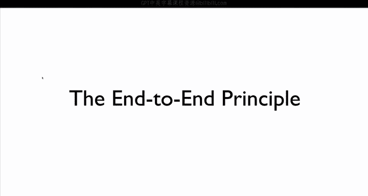
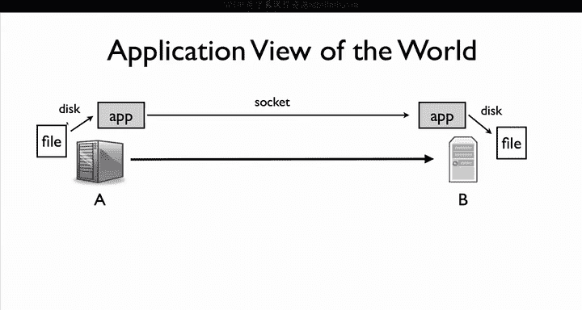
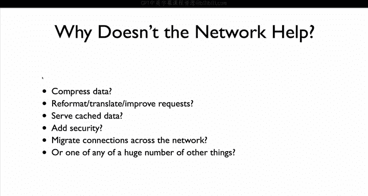
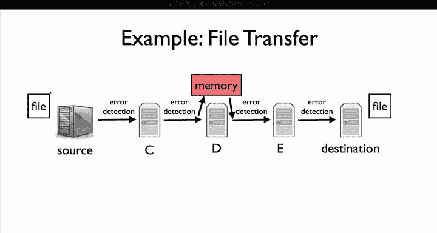
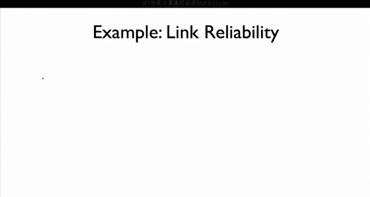
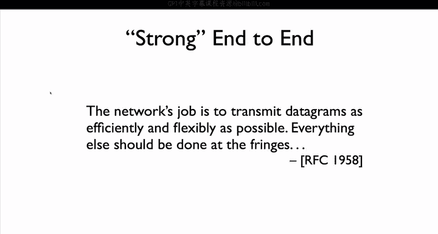

# 斯坦福大学《计算机网络｜Introduction to Computer Networking CS 144 2018》中英字幕deepseek - P27：-027-End to End Principle 64.zh_en - GPT中英字幕课程资源 - BV1bVqNYFEGg

The end to end principle holds a very special place in the design of the internet This is because it really refers to two different principles。

 the first deals with correctness if you don't follow the end to end principle when you design your network system the chances are it has a flaw a might transfer data incorrectly The second which we call the strong end to end principle is much broader and general。

So let's say we want to transfer a file from one computer to another。

 our application opens a connection between A and B。

It reads a file on Comp A and writes it to the TCP connection。

B reads the data from the socket and writes the data to a file on computer B。

The network in this case does very little， it just fors packets from A to B。

 A and B set up the connection and the application reads and writes the data。

Why doesn't the network do more turns out there are a lot of things it could do to make the file transfer faster。

 The network could automatically compress packets between A and B。 If the file is plain English text。

 this could reduce the transfer size tenfold the network could reformat or improve requests。

Let's say A wants to transfer two files to B， then network we could see this and combine the two transfers into a single request。

Or it could be the A's files already stored in another computer C that's closer and faster to B than A is the network could transfer the file from C rather than A。

Or the network could automatically add security， encrypting the data so bad guys can read the file。

 if the network does this for us， then we don't have to worry about it in our application。

The network could add mobility support such that computer as computer A moves through a network。

 routes automatically update and packets continue to flow to it with a support。

 we could even possibly migrate connections across the network。

  moving something like a Skype video stream from our phone to our laptop。

It turns out that there are many things the network could do to improve our application and make designing it easier。

 but generally speaking， it doesn't。Bye。

The reason is the end to end principle。The end to end Pri was first described by Salultza Reed and Clark in a 1984 paper。

 you'll meet David Clark later in the course when he gives a guest lecture。The end to end principle。

 as they describe it， is shown here。The function in question can completely and correctly be implemented only with the knowledge and help of the application standing at the endpoints of the communication system。

Therefore， providing that question function as a feature of the communication itself is not possible。

Sometimes an incomplete version of the function provided by the communication system may be useful as a performance enhancement。

 We call this line of reasoning the end to end argument。Put another way。

 the network could possibly do all kinds of things to help， but that's all it can do help。

If the system is going to work correctly， then the endpoints need to be responsible for making sure it does Nobody else has the information necessary to do this correctly。

The network can help you， but you can't depend on it。For example。

 if you want to be sure your application is secure。

 you need to have end to end security implemented in the application。

The network might add additional security， but end to end security can only be correctly done by the application itself。

 so making security a feature of the network so that applications don't have to worry about it is not possible。

Let's go back to our example of transferring a file between two computers。

It was this exact problem along with others that led Sulsa Clark and Reid to formulate the end to end argument。

You want to make sure the file arrives completely and uncorrupted。

 the file data is going to pass through several computers between the source and the destination。

So the file coming from the source passes through computer C， D。

 and E before arriving at the destination。Each link， source to C， C to D， D toE。

 and EO destination has error detection。If a packet of data is corrupted in transmission。

 then the recipient can detect this and reject the packet。

The sender will figure out the packet didn't arrive successfully， for example。

 through TCP acknowledgecments and resend it。Now one could say look。

I know the packet won't be corrupted on any link because I have my checks。

Since it won't be corrupted on any link， it won't be corrupted at all。 therefore。

 if it arrives successfully at the destination， there's no corruption and the file has arrived successfully。

This is exactly what some programmers at MIT did， since the network provided error detection。

 they assumed it would detect all errors。This assumption turned out to be wrong。

 and because of this mistake， the developers ended up losing a lot of their source code。

This is what happened。😡，One of the computers on the transfer path， let's say Comp D had buggy memory。

 such that sometimes some bits would be flipped。Do you receive packets of data。

 check them and found them correct？It would then move them into main memory at which point they would become corrupted。

D would then forward the packet， but because error detection occurs in the link from the Li's perspective。

 the packet looked fine and it would pass E check。The link error detection was designed for errors in transmission。

Not errors in storage。The only way to be sure the file arrives correctly is to perform an end to end check when the source sends the file。

 it includes some error detection information。When the destination reassembles the file。

 it checks whether the file in its entirety has any errors。

This is the only way one can be sure to arrive correctly， the network can help。

 but it can't be responsible for correctness。As another concrete example， think of TCP。

 TCP provides a service of a reliable by stream。But the reliability isn't perfect。

 there's a chance that TCP delivers some bad data to you， for example。

 because there's a bug in your TCP stack or some error creeps in somewhere。

 so while it's very unlikely TCP will give you corrupted data， it might。

 and so you need to perform an end to end check on the data that it sends。

So if you transfer file TCP， do an end to end check that arrives successfully。Bittorn does this。

 for example， it uses TCP to transfer chunks， and after each chunk is complete。

 it checks that it arrives successfully using a hash。

So let's go back to TCP and reliability。If you want end to end reliable data transfer。

 then you need an end to end reliable protocol like TCP。But following the end to end argument。

 while you must have end to end functionality for correctness。

 the network can include an incomplete version of a feature as a performance enhancement。

Wireless link layers provide such a performance enhancement Today， wired link layers are highly。

 highly reliable unless your wire connector is bad。But wireless ones aren't for a lot of reasons。

 so while usually 99。999% of packets sent on a wired link arrive successfully at the next top。

 wireless links can sometimes be more like 50% or 80%。

And it turns out TCP doesn't work well when you have low reliability。

So wireless link layers improve their reliability by retransmitting out the link layer when your laptop sends a packet to an access point。

 if the access point receives the packet， it immediately， just a few microseconds later。

 sends a link layer acknowledgement to tell your laptop the packet was received successfully。

If a laptop doesn't receive a link or acknowledgecment， it retransits。It does this several times。

Using these link layer acknowledgecledments can boost a poor link with say only 80% reliability to 99% or higher。

 this lets TCP work much better。TCP will work correctly。

 it will reliably transfer data without this link area help。

But the linknk layer help greatly improves TCP's performance。

So that's the antenna principle for something to work correctly， it has to be done end to end。

 you can do stuff in the middle to help us performance improvements。

 but if you don't rely on end to end， then at some point it will break。

There's a second version of the end to end principle described in the IETF request for comments number 1958。

The architectural principles of the internet。We call it the strong end end principle and it says。

The network's job is to transmit datagrams as efficiently and flexibly as possible。

 everything else should be done at the fringes。This end to end principle is stronger than the first one the first one said that you have to implement something end to end at the fringes。

 but that you can also implement it in the middle for performance improvements。

This principle says not implemented in the middle， only implemented at the fringes。

The reasoning for the strong principle is flexibility and simplicity。

If the network implements a piece of functionality to try to help the endpoints。

 then it is assuming what the endpoints do。For example。

 when a wireless link layer uses retransmissions to improve reliability so TCP can work better。

 it's assuming that the increased latency of the retransmissions is worth the reliability。

This isn't always true， there are protocols other than TCP where reliability isn't so important。

 which might rather send a new different packet than retry sending an old one。

 but because the link layer is incorporated improved reliability。

 these other protocols are stuck with it。This can and does act as an impediment to an innovation and progress。

 as the layers start to add optimizations， assuming what the layers above and below them do。

 it becomes harder and harder to redesign the layers。In the case of Wifi。

 it's a link layer that assumes certain behavior at the network and transport layers。

 If you invent a new transport or network layer， it's likely going to assume how Wifi behaves so it can perform well in this way。

 the network design becomes calcified and osified and really hard to change。

In terms of long term design and network evolution。

 the strong end to end argument is tremendously valuable。

 The tension is that in terms of short term design and performance。

 network engineers and operators often don't follow it。 So over time。

 the network performs better and better， but becomes harder and harder to change。

