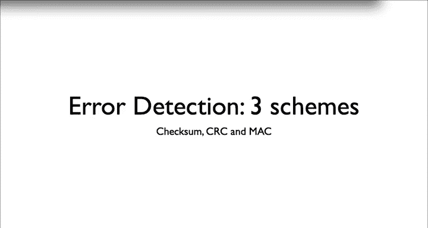
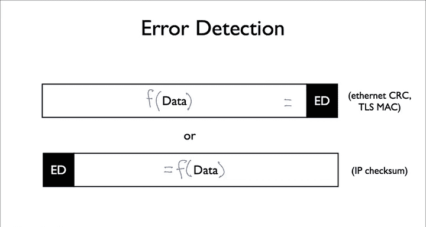
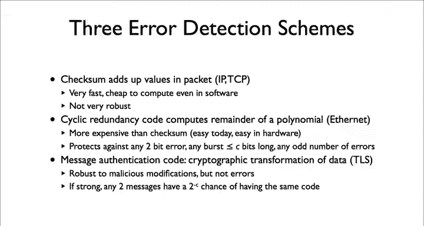
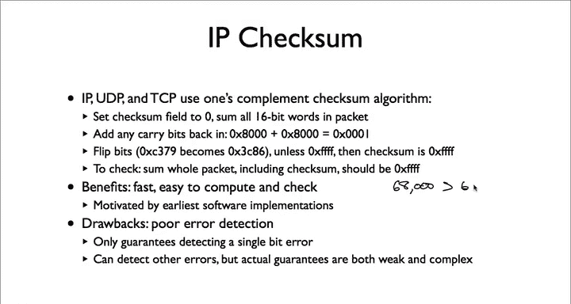
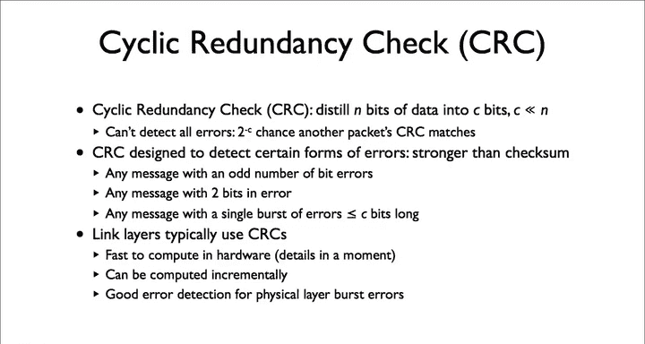
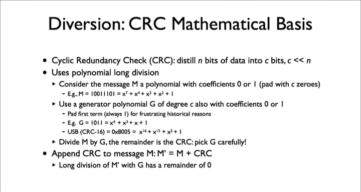
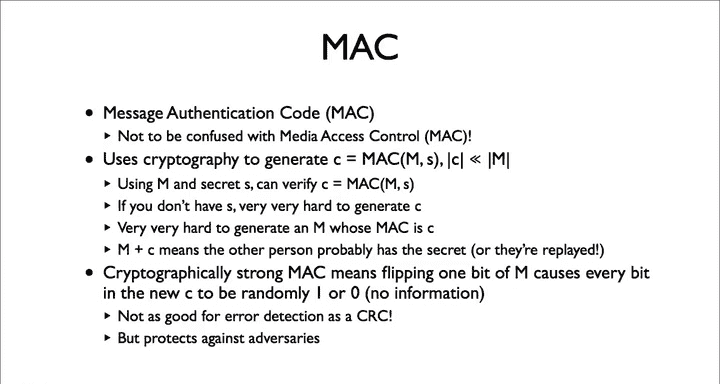
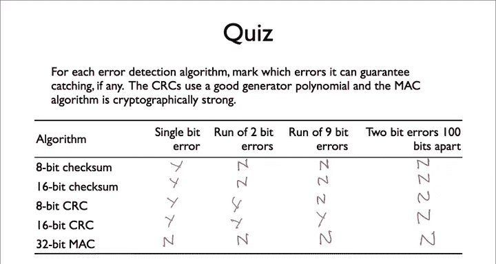

# 斯坦福大学《计算机网络｜Introduction to Computer Networking CS 144 2018》中英字幕deepseek - P28：-028-Error detection 64.zh_en - GPT中英字幕课程资源 - BV1bVqNYFEGg

Networks aren't perfect， and neither are the host one on them。They can introduce errors。

 And for a network to be able to run properly， it needs to be able to detect these errors。

 For example， let's say that a router along our path has a bad memory cell。

 such that sometimes it flips a bit in a packet。Imagine， for example。

 if the bit flipped is the most significant bit of the amount of charge of credit card。

We need to be able to detect that error occurred so we don't accept the corrupted data as correct data。

Networks today usually use three different error detection algorithms， check sums。

 cycl redundancy codes， or CRCs， and message authentication codes， or Macs。

Each of them has very different characteristics Understanding their differences is important I've actually been at meetings in the IETF where a few people weren't aware of the differences if you don't know you might make a bad protocol decision or protocol analysis。

At a high level， error detection looks like this。 we have a payload of data Well calculate some error detection bits over that data and either append or prepen it to the payload。

 For example， Ethernet appends a cyclic redundancy code or CRC。

 while transport layer security TlS appends a message authentication code。

 an IP prepens a check some which places in the I header。TLS and Ethernet have a footer。

 portal which follows the payload， which is where they put the CRC in Mac。

The first of the three commonly used error detection algorithms is a checkum。

 You just add up all the data of the packet。 It's what TCP and IP use。

 Checkums are nice because they are very fast and cheap to compute， even in software。

 Back when the Internet started and everything was in software， This is valuable。

 Their major drawback is that they have pretty weak error detection guarantees。

 While they can catch a lot of random errors is easy to fool check some of as few as two bit errors。

 If the two bit errors cancel each other out。 For example。

 if one bit error adds 32 and another bit errors subtracts 32， the checkum won't catch the error。

 So checkum can catch a lot of errors， but it turns out to have very weak guarantees on what errors that will catch。

The second of the three commonly used error detection algorithms is acyclcorundancy code or CRC。

 A CRC is much more computationally expensive than a checksome， but also much more robust。

 It computes the remainder of a polynomial。 I'll show what this means in how it works in a few minutes with today's processors。

 it's easy to do and it's really easy to do on hardware。

 It's with internet and many link layers use In some ways。

 TCP and  IP can get away with checkss because link layers use CRCs。

 If you have CRC that C bits long， A CRC can detect any one bit error。

 any2 bit error and any single burst of errors less than or equal to c bits long。

 as well as any odd number of errors。So you can detect a lot of errors。

 much stronger guarantees than a check some。The final algorithm is something called a message authentication code or Mac。

 A message authentication code combineds the packet with some secret information to generate a value。

 In theory， someone can only generate or check the Mac if they have the secret。

 So if you receive a packet and the Mac is correct。

 Then you're pretty sure the computer to the computer， the Mac has the secret。

 unless I have the secret， it's amazingly difficult to generate the correct Mac for a packet。😊。

So a bad guy can't easily generate a new packet。 In fact， if you have a strong Mac algorithm girl。

 then given one packet and its Mac， I have zero information on what the Mac will look like if I flip a single bit。

 messagessage authentication goods are therefore robust of malicious modifications。

 messagess authentication goods are used in transport layer security， Tls。

 which is what you use when your browse web pages securely， H TPS。😊。

But they're actually not great for catching errors。 If I flip a single bit in the packet。

 there is one in two to the C chances that the changed packet will have the same Mac。

I've seen people make this mistake witht about error correction thinking a Mac is just as good as a CRC。

 It's not if I have a 16 bit CRC， I'm assured that I'll detect a burst of errors that is 16 bits long or shorter。

 If I have a 16 bit Mac， I'm only assured that I'll detect bit errors with very high probability99。

90% or one in 65536。 That's high but think about how many packets you watch just receiving this video。

I'll now go into each of these algorithms in greater detail。Let's start with a checkum IP。

 UDP and TCP use one's complement checkums， This means they add up the packet using one's complement arithmetic。

 a version of binary arithmetic some older computers used most today use twos complement arithmetic。

The algorithm is pretty simple。 You start by setting the checkum field of a packet to0。

 Then you add every 16 bit word in the packet anytime you have to carry because the sum is greater than2 to the 16 or 65535。

 you carry back the bit back in， so 60，000 plus 8000 is 6800-65535 plus1 or 2466。

Once you've added up the complete packet， flip the bits in your sum and make this the checkim of the packet。

Then if you add up the complete packet， including this check some value， you should get0 x， FF， FF。

 all onces。There's one edge case if the computer checkum is all ones。

 you don't make the checkum field zero and you make it all ones， in IP UDP and TCP。

 a checksum field of zero means there's no checkup。

That's it You can write this in just a few lines of C code it's fast easy to compute and easy to check all you need to do is add the bytes of a packet and check that the check them is all ones。

 given that most early early internet implementations were in software， this is really helpful。

The drawback is that it's not really that robust， while it definitely detects a lot of random errors。

 the guarantees it can give on what errors that the text are really weak in practice it can only promise to catch single bit errors。

 but it works pretty well and link layers do a lot of heavy lifting for us。

Link layers do their heavy lifting with something called a cyclic redundancy check or CRC。

The idea of a CRC is that I want to take the n bits of source data and some would distill them down to C bits of error detection data where C is much smaller than N。

 for example， I might have a 1500 byte ethernet frame with a 4 byte 32 B CRC。

USB and Bluetooth use 16 bit CRCs。Of course we can't detect all errors。

 given some other random packet， the chances the CRC matches is2 to the minus C or 1 and2 to the C。

 For example， if I use an 8 bit CRC， then out of the space of all packets，1 in 256 or a 0。

4% have the same CRC as my packet。But CR Cs are stronger than check sums。

 They can detect there's an error in any packet with an odd number of errors。

2 B errors or any single burst of errors equal to or less than C Bs long。

 They can't guarantee detecting errors besides these， but they do a good job at it。 For example。

 a 16 B CRC can't guarantee you'll detect2 bursts of 3 B errors faced far apart the packet。

 but it's likely it will detect it。Link layers typically use CRCs。

 they're pretty robust and as many link layers are vulnerable to burst survivor errorss。

 the burst detection capabilities of CRCs is useful。

 it's not hard to make hardware compute them quickly and you can compute them incrementally as you read or write the packet。

So how does the CRC work It distills these n bits and to C bits using something called polynomial long division。

 you take the bits of a message and use them to describe a polynomial M。

 Each bit in a packet is the coefficient of one term or the polynomial If the bit is0。

 the term is absent if the bit is1， the term is present。So， for example， a message of 1，0，0，1，1，1，0。

1 is the polynomial x to the 7 plus x to the fourth plus x to the third plus x squared plus 1。

 which is0 is x to the 0。 This is because the 7， fourth， third。

 second and 0th bits are set in the message。When we calculate a CRC。

 we have something called a generator polynomial， This is defined by the CRC algorithm， For example。

 the CRC up 16 algorithm used by USB has a generator polynomial of x to the 16th plus x to the 15th plus x squared plus1。

For frustrating historical reasons the generator polynomial is one term longer than its number of bits。

 the first term is always one， so the CRC16 generator polynomial is written as 0x8005。

 even though it has an X to the 16th term。To compute a CRC。

 you take the message M paded with zero is equal to the CRC length and divide this padded value by G。

The remainder is the CRC， which you append the message to check a CRC。

 you divide the message plus CRC by the generator polynomial G。 If the remainder is 0。

 then the CRC passes。 I won't go into the details of how this works mathematically。

 but it turns out it can be implemented very quickly and efficiently in hardware。

The strength of your CRC algorithm depends on what geneative polynomial G you pick there's been a lot of study of this and so many good options which have the error detection properties I mentioned earlier。

 but you might not get the same error detection strength if you pick your own generator polynomial。

The third and final kind of error detection algorithm you commonly see in networks is a message authentication code or Mac。

 like CRCs。 there's a deep and rich mathematical background on how message authentication codes work。

 There are good ones and bad ones。 So you generally want to use an existing scheme rather than in own。

 thankfully， standards usually specify what Mac to use。

 And though there are some mistakes in the late 90s or standards picked per algorithms， nowadays。

 security is important enough that everyone relies in a small number of really well studied approaches。

😊，Message authentication codes use cryptography， a branch of mathematics that deals with secrets。

 The idea behind most message authentication codes is that the two parties share a secret S。

 This secret is just a set of randomly generated bits。

 random so it's hard to guess to calculate a message authentication code C。

 you apply the Mac algorithm to the message M and the secret S。

Mac algorithms of the property that if you don't have S。

 then it's really hard to generate the correct C for a message am。Furthermore。

 it's really hard to create a message M whose message authentication code is C By hard， I mean。

 is that the best case you just have to exhaustively try having M and C gives you almost no information on what S is。

This means that if you receive a message M with the correct message authentication code。

 this means the computer that generated the message probably has the secret or someone replayed a message generated by that computer。

Because the goal is to keep S a secret， cryptographically strong message authentication cause of an interesting property。

 You change a single bit in M。 Then this results in a completely new CRC。

 where the probability any bit in C is 01 is seemingly random and independent of the earlier C。

If this weren't the case， then someone could take a message， flip a single bit。

 so change a dollar value， and it wouldn't be that difficult to generate the correct C。

This means that technically message authentication codes have no error detection guarantees if you flip a single bit。

 you could end up with the exact same Mac。Message authentication goods are very useful。

 but they're first and foremost a security mechanism。

 being able to get both error detection and security with one mechanism is efficient and nice。

 but their security properties mean that their error detection isn't as good as other approaches。

Let's go over the answers。Both check Ss can detect a single bit error。

 Remember this is one of the errors a checksim guaranteear is detecting。

Both CRCs can also detect a single bit error。A Mac can't guarantee that it'll detect a single bit error for security reasons。

 It could be that the new Mac is the same as the old one， so it can't guarantee detecting it。

 In fact， a Mac a Mac can't guarantee detecting any errors So we can mark no for all the columns for the message authentication code。

So how about two bit errors check sums can't guarantee detecting two bit errors。

 so no for both of them CRCs though can detect guaranteeing bit errors runs less than or equals to the length of the CRC Since two bits is shorter than both 8 bit and 16 bits。

 both CRCs can detect a run of two bit errors。Correspondingly。

 an 8 B CRC can't guarantee detecting a run of 9 B errors， but a 16 B CRC can。 So no。

 for the 8 B CRC。 And yes， for the 16 B CRC for a 9 B error runs。 How about 2 B errors，100 B apart。

 It turns out none of these algorithms can guarantee detecting this error。 So no for all of them。

 Looking at this matrix， You might think error detection is a waste。

 The algorithms promise very little。 But guarantee is a very strong statement。 Well。

 an 8 B check some can't guarantee itll catch a run of 9 B errors。

 there's a high probability it will。Similarly， a 16 B CRC has a very high probability of detecting 2 bit errors 100 bits apart。

 and in practice， high probability is often good enough。 If failures are rare。

 then you only sometimes have to do something more expensive to recover。 But it means in practice。

 you tend to have multiple layers of error detection。 The link layer detects them with CRCs。

 IP detects them check sums， TCP takes them with check sums。

 and then off the application has its own error detection So all put together the chances of errors creeping through is very。

 very low。 So we've seen three error detection schemes， check sum。

 CRCs and message authentication goods。

Data error detection is a great example of the end to end principle。

 It's actually what originally motivated the principle。

 the only way a layer can be sure that it communicates data correctly is to perform an end to end check。

Ethernet needs to be sure that its frames don't have errors so it can parse them correctly。

 so it has a CRC。IP needs to be sure that his packets are a so it can parse them correctly。

IP can't depend on what Ethernet is doing to check。For its own check。

 the Internet Car driver might introduce an error after the driver checks the packeting。

 so IP has to do its own end to end check at the network layer。

TLS using message authentication codes is another example。

 it's especially interesting because TLS has very different error detection requirements than IP Ethernet。

 it wants security， so it has to provide its own end to end error detection scheme as that it's the only way it can be sure its requirements are met。

