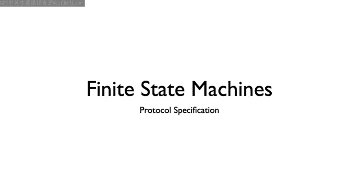
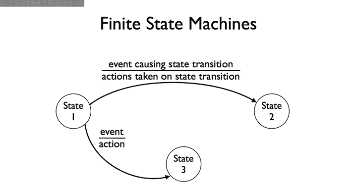
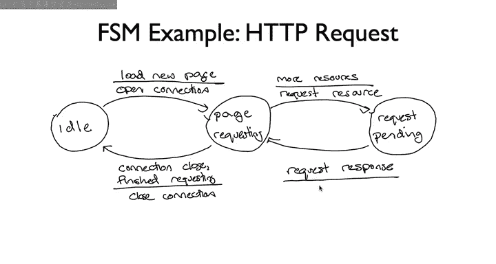
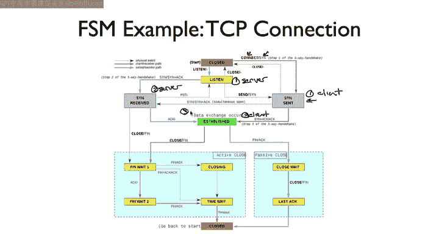

# 斯坦福大学《计算机网络｜Introduction to Computer Networking CS 144 2018》中英字幕deepseek - P29：-029-Finite state machines 1.zh_en - GPT中英字幕课程资源 - BV1bVqNYFEGg

嗯。I'm going to explain finite state machines， something very commonly used when specifying network protocols and systems I'll also explain the common way they're drawn in network protocols I'll conclude by showing you the finite state machine that's part of the TCP specification which defines how TCP connections are set up and torn down。

So you'll see how you can describe something like the threeway handshake of TCP in a finite state machine。

 As the name suggests， a finite state machine is composed of a finite number of states。

 A state is a particular configuration of the system。 I'm going to start with an abstract example。

 In this example， we have three states， state 1， state 2， and state 3。

 So our system can be in one of these three states。

Edges between the states define how we transition between them When we draw an edge。

 we first specify what events cause the transition to occur。Below this。

 we can state what actions the system will take when that transition occurs。

The second part is optional because not all transitions have actions associated with them。

 but if there is an action， you should specify it。Otherwise， you have an incomplete specification。

 and people might not test or implement it correctly。

 if the system is in a state and an event arrives for which there is no transition described。

 then the behavior of the FSM is undefined。 There can be multiple transitions from a single state。

 So here we have a transition from state 1。 A different event that will take the system into state 3。

For any given state， the transition for an event must be unique。 In this example。

 an event can cause state 1 to transition to state 2 or transition to state 3。

 but you can't have the same event associated with both transitions。

 otherwise the transition is ambiguous if the event occurs， Would you be in state2 or state 3。

 The system can only be in one state。

So let's walk through an example an HTTP request。In practice。

 ETTP requests are a bit more complex than this， they are all kinds of options。

 so for this example it's used a very simple form。Let's describe our system this way。

In our starting state， we are viewing a page or otherwise idle。We want to load a new page。

 we transition to the page requesting state。So the event is load New page and the action is open a connection to the web server。

Once we've opened a connection， we're now in the page requesting state。

 we'll transition back to the idle state when the connection closes or we finish requesting every resource on the page。

We need one more state which describes where we are in requesting a page。

On the event of having more resources to request， we take the action of requesting a resource within an ACTB get。

This puts us in the requesting pending state。On the event of receiving the response。

 our system transitions back to the page requesting state。So here we have a three state system， idle。

Page requesting。And request pending。On one hand， this is a nice， simple FSM。

 but if you were try to implement it， it leaves a lot uns set。

 specifically of four events in the system， page request more request re receive response and connection closed。

So what happens if the connection close event arrives when we're in the request pending state？

Or when we receive a page request while on the page requesting state or receive response in the idle state。

If you want to be completely explicit and careful， you should specify what happens on each day for every event。

But this can lead to complicated FSM， which have tons of edges。So often， instead。

 you'll write down just the common cases in the FSM for ease of understanding。

And have some supporting text about other transitions。Or in some cases。

 it can even be acceptable to leave something undefined。The Internet engineering task course。

 for example， the ITF， often doesn't completely specify every FSM。

 The idea is that by specifying only the parts that are necessary for interoperability。

 you can leave the specification flexible for future exploration。If people use the protocol。

 they'll figure out if something is important and if so， can specify that extra part later。

So let's walk through a real example of an FSM， probably the most famous FSM on the internet。

This diagram here describes the finite state machine of TCP。I know it looks very complicated。

 it has 12 states， but I'll walk through it bit by bit and you'll see how it all fits together。

First off， the diagram really has four parts， which we can look at separately。These top four states。

Or what describe how you open a TCP connection， this center state established。

Is when TCP is sending and receiving data。It's after the connection has been established but before it's been closed。

These six states。Describe how connections close。They state at the bottom， closed。

Denotes the connection is closed and the node can forget about it。

 Note that the top state is also the closed state。Before we open the connection。

Recall that you start a TCP connection with a three way handshake， S， Sin act， act。

The client or active opener sends a S synchronization message to a program listening for connection requests。

When this node receives a sin， it responds with a syn Act。

 synchronizing and acknowledging the original synchronization。

The active opener on receiving the Sac responds with an acknowledgement and act。

The state diagram here describes how TCP behaves on both sides of the TCP3way handshake。

A passive opener is a listener， is a server。It listens for requests for connections from active openers。

 clients。So in a program calledLi， the sakea transitions from the orange closed state to the yellow listen state。

The protocolcol takes no actions when this happens， it doesn't send any messages。

If the server calls close on the socket when it's in the listen state。

 it transitions immediately to the closed state。Let's walk through the threeway handshake。

 starting with a first step when a client tries to open a connection and sends us impact to the server。

We can see that this first transition for the client side of the connection is this orange arrow from closed to the sin sense state。

This happens when the client program calls Connect the event。And the client sends a sin message。

Once the first send is sent， the client is in the S S state and the server is in the listen state。

When the sin arrives at the server， this leads to this blue transition。

You can see the event is receiving a send message。The action is to send a S act message in response now the server is in the S received state。

Let's jump back to the client， remember it was in the S sense state。Now。

 when it receives the SinAC from the server， it transitions to the established state。

Its action is to send an AC message， the third message of the SN SAC act Handshake。

 Now the client can start sending data to the server。Finally， let's go back to the server。

 which is in the S Re state， when receives the act from the client。

 it transitions to the established state and it can send data。

