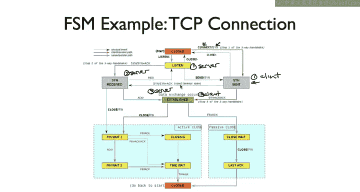

# 斯坦福大学《计算机网络｜Introduction to Computer Networking CS 144 2018》中英字幕deepseek - P30：-030-Finite state machines 2.zh_en - GPT中英字幕课程资源 - BV1bVqNYFEGg

嗯。

Here's a quiz for this quiz， assume there is no other documentation of the TCB finance state machines。

 there's no supporting textual description which defines other state transitions。

In this first question， suppose the finite state machine starts in the closed state。

Then a user program calls Listen on the Socket。The socket receives a S message before any other event arrives。

 the user program calls closed What state will the socket be in？For the second question。

 suppose the F state machine starts in the closed state。

 then the user program calls Connect and before any other event arrives。

 the user program calls Close， what state will the Socket be in？

