# 斯坦福大学《计算机网络｜Introduction to Computer Networking CS 144 2018》中英字幕deepseek - P32：-032-Finite state machines 4.zh_en - GPT中英字幕课程资源 - BV1bVqNYFEGg

The answer to the second question is closed。

We start in the closed state， then the user program calls connect and we transition to the S S state。

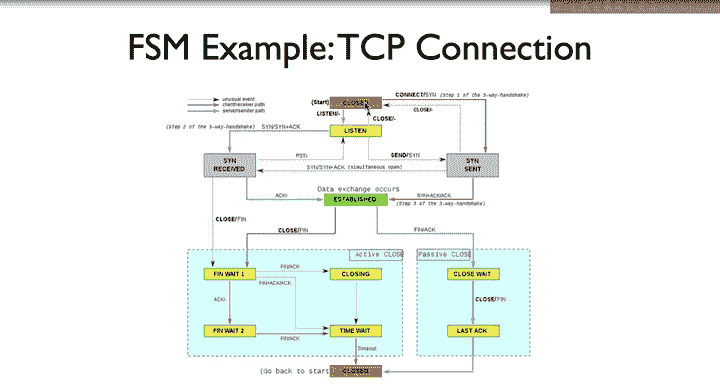

While in the SinNS state， the user program calls close。

So there's an edge from Scent on the close event。

Back to the closed state。

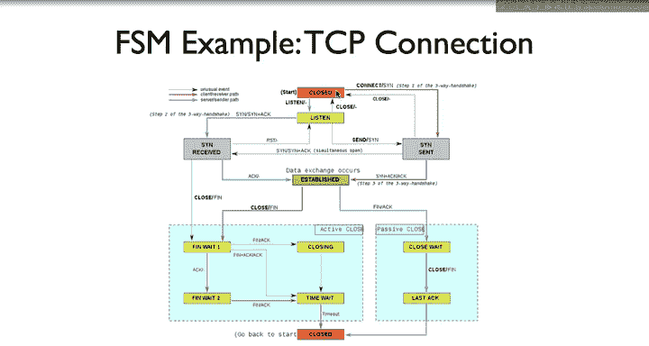

So now our sockets are in the established state， they're exchanging data。

 the six states in blue boxes are how TCP tears down a connection or how it closes it。

It's sometimes useful to talk about tearing down a connection because the word close means something in terms of system calls a connection exists after one side closes it。

 as we'll see。

There's symmetry between how TCP sets up a connection and how it tears it down。

Where connection establishment uses synchronization or S packets。

 connection tearraan uses Finnish or fin packets。

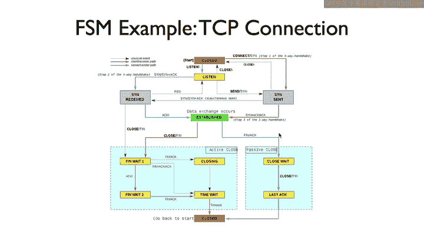

If one of the sides of the connection calls close， itvers along the right edge on the left to the thin weight one state。

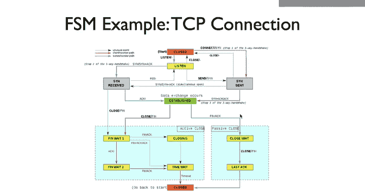

This caused it to send a thin packet to the other side of the connection。

This is called the active closer because it starts the operation。

The other side receives the f and takes the blue edge on the right to the closed weight state。

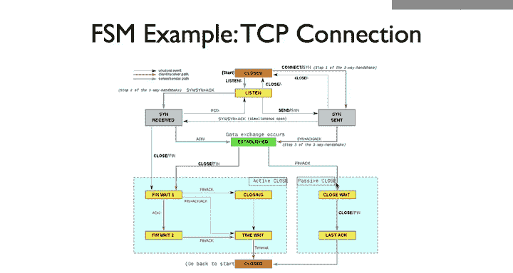

It remains in this state until the program site calls close at which point it sends a fin。

Here's where it gets a little complicated。

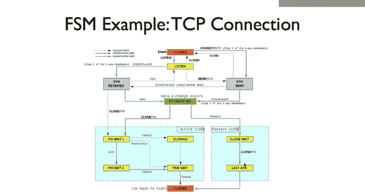

A TCP connection is bidirectional， the active closer has closed its direction of the connection。

 so it can't write any more data。

But it could be the passive closer has more data to send。

 so the passive closer can continue to send data， which the active closer receives and acknowledges。

 or it could close its side of the connection too。

Or it could even have decided to close that connection at the same time。

 such that we have two fin packets crossing each other in the network。

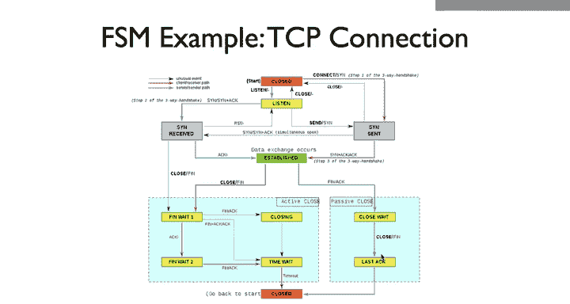

From the thin weight one state。

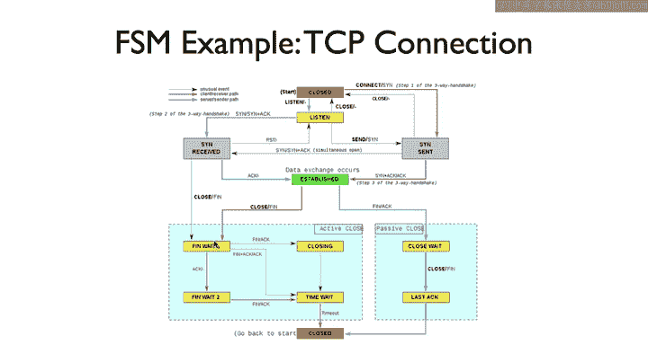

Where the active closure is， there are three possible outcomes。

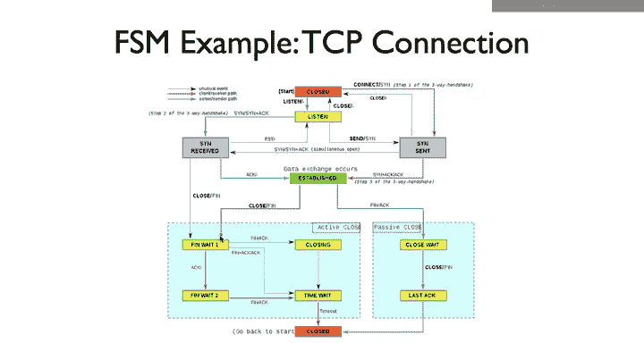

First， the passive closer might acknowledge the f but not send a f。

In this case， the passive closure is in the closed weight state and can continue to send data。

This is the lowermost edge where the active closer enters the thin weight2 state。

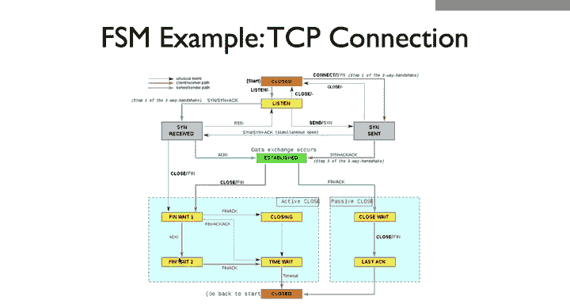

Second， the passive closer might close its side too。

Acknowledging the f and sending a fin of its own。 This is the middle edge to the time weight state。

Finally， it could be that both sides actively closed at almost the same time and send fins to each other。

 In this case， both are in the Finnin weight one state。😊。

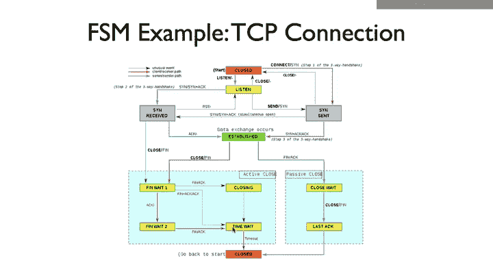

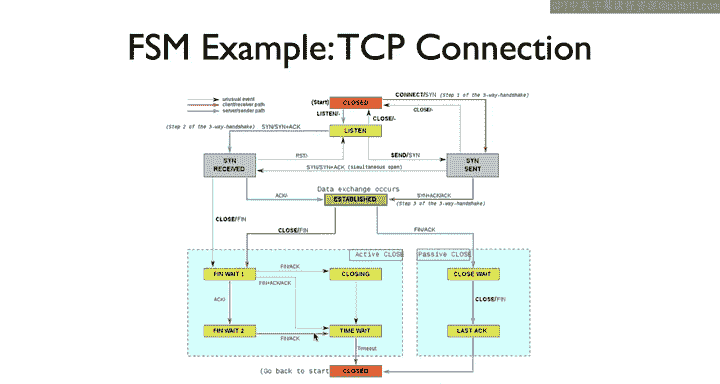

Each one will see a fin from the other side that doesn't act its own f。 In this case。

 we transition to the closing state， and when our fin is acknowledged。

 we transition to the time weight state just as with the middle edge。

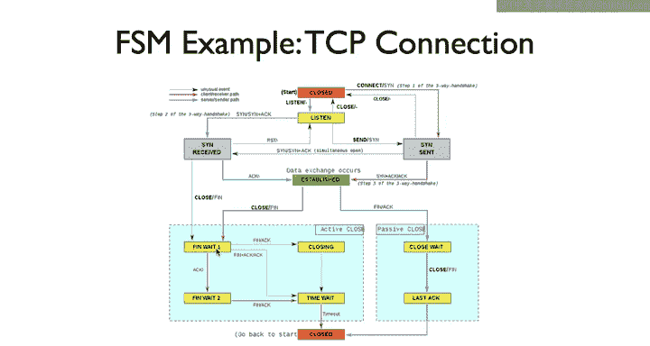

TCP transitions from thin weight2 to time weight when we receive a fin from the other side。

It then stays in the time wait for a period of time until it can safely transition to close。

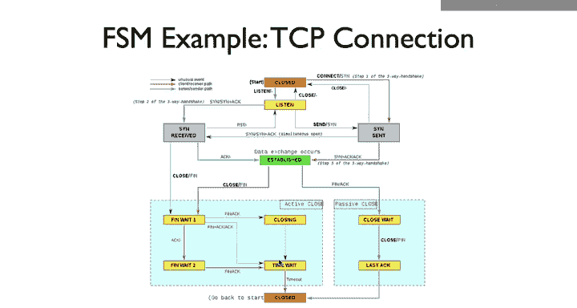

The final blue edge from last act to close。Occurs when the passive closers thin is acknowledged。

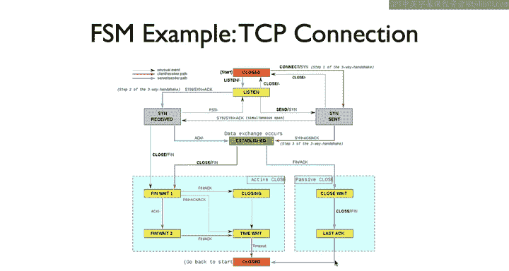

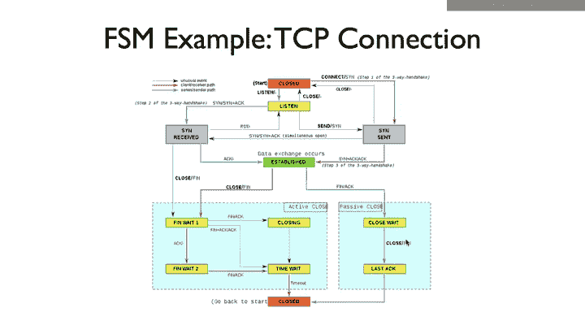

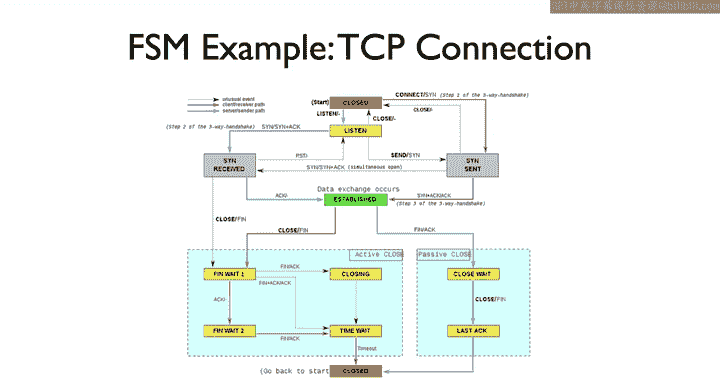

Now on one hand， that's a lot of detail， there are 12 states covering lots of cases。

But I hope you can see how this finitescape machine makes what was previously a few colloquial descriptions and gives them detail and precision。

Trying to implement a properly interoperating TCP based on those descriptions would be really hard。

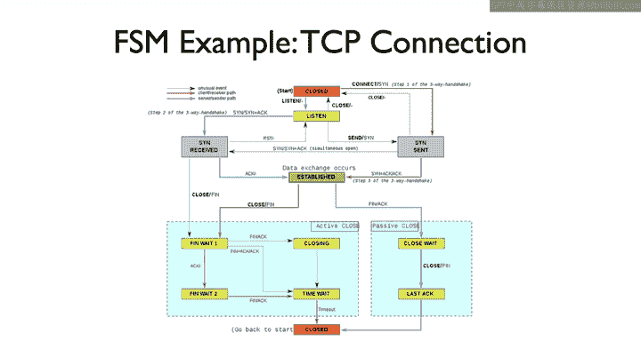

This diagram precisely specifies how TCP behaves， and so it's tremendously useful。

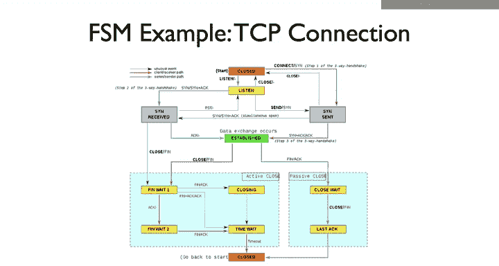

