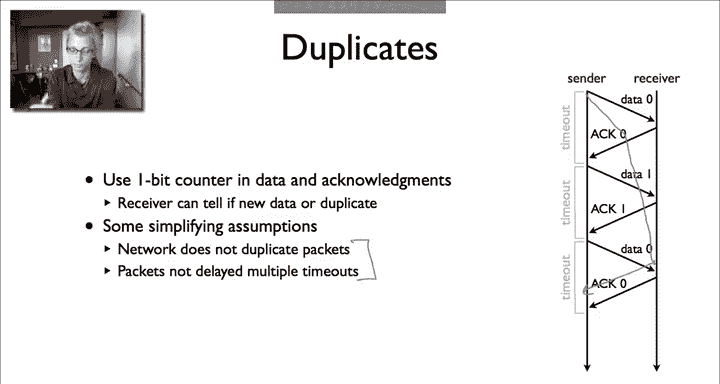

# 斯坦福大学《计算机网络｜Introduction to Computer Networking CS 144 2018》中英字幕deepseek - P33：-033-Stop and wait 64.zh_en - GPT中英字幕课程资源 - BV1bVqNYFEGg

This video is about flow control， one of the basic building blocks of reliable efficient communication describes the basics of flow control。

 as well as its simplest implementation， something called a stop and wait protocol。

The basic problem flow control tries to solve is when a sender can send data faster than the receiver can process it。

 So here we have a case where the sender a。Can send some 500，000 packets per second。

But the receiver B can only receive 200，000 packets per second。

 This might be because B has a slower processor， its networking cardisan is good or for whatever reason。

And so the issue is that if A sends data at this full rate of 500，00 packets per second。Then 300。

000 of those。We're going to have to be dropped at B。

 that is B will not be able to process them and so only 40% of the packets will come through。

 this's a lot of wasted effort on A's part。 it's a lot of wasted effort in the network。

 and it's also going to completely saturate B。 There's no reason for A to be sending data faster than the rate at which B can receive it。

And so， the basic。Appach the flow control takes is to make it that the sender doesn't send packets faster and the receiver can process them。

And the way this usually works is the receiver gives the sender some kind of feedback。

 whether it's implicit feedback or explicit， whether it's to slow down or speed up or to set a it。

So two basic approaches used in most protocols today。

 the first stop and wait talk about in this video， which is very simple， very simple to implement。

 very simple fun data machine。The second is what's called sliding window。

 we'll talk about in the later video， which is a bit more complex。

 but can provide better performance。So just a refresher on finite state machine diagrams。

 so when we draw a finite state machine of a protocol。

 we show the states that it can enter here state1， state two， state 3。

 and then edges between the states have two pieces of information first the event that can cause a state transition on top and then below the action the protocol takes on making that state transition。

The stop point algorithm is very simple。It has at most one packet in flight at any time from the sender to the receiver。

So the basic algorithms a sender sends one packet。It then waits for an acknowledgement from the receiver。

When it receives the acknowledgement， it then if it has more data to send sends another packet。

If it waits for some time and reaches a timeout and hasn't heard an acknowledgement。

 then it assumes that the packet has been lost， it has left the network， it was dropped on a router。

 or it was dropped at the receiver something happened。And where the ament was dropped。

And it resends the data， so there's a timeout， which point it tries again。That's the basic algorithm。

So the receiver has a one state finite state machine。

 which is wait for packets when it receives new data。

It sends an acknowledgement or when it receives data， it sends an acknowledgement for that data。

 and if the data is new， it delivers that data to the application。

The sender finance state machine has two states， in the first state it's waiting for data from the applications。

 this is where it's ready to send， but the data the application has not yet provided a data to send。

When the application calls send。The protocol sends a packet with that data or as much as it can fit in a packet。

 it then enters the weight for a state。In this state， there are two transitions。

 the first is if it receives an acknowledgecment， if the protocol receives an acknowledgement。

 then it does nothing goes back to wait for data if there's more data to send， it'll send new data。

 or if there's no more data to send， it'll wait until the software calls send。

The second transition is when there's a timeout。 So this is the case where it has sent。

A packet of data， but it hasn't received the acknowledgecment。

 it's waiting and it's waiting and it's waiting and it times out and it just tries resending。

So it wants to pick this time out so it's conservative。

 it's pretty sure that the data or the subsequent ament has been lost。

 so it only has one packet in the network at any time。So that's the basic stopping weight algorithm。

 So here are four sample executions。 The first is when there's no loss， everything works perfectly。

 The sender sends its data， the receiver receives it， sends acknowledgement。

 and now the sender if it had more data could send more。Second case， data is lost。 Now。

 the sender sends data。 It's lost in the network。And so the sender times out and tries resending the data。

So it's sitting in that waiting for Act state。The timeout hits and it reends。

Here's a third case where the data is successfully delivered。

 but the acknowledgecknowledment is lost。 And now the sender is in the way for Act state。

It times out， it resends the data。And then this causes the receiver to send a new acknowledgeknowment。

 at which point then the sender gets the acknowledgecment and continues as in the first。

So the fourth case is a little more complicated and actually shows a failure with this the basic algorithm as I described before。

Which is the send Sum data。And the receiver sends an acknowledgement。

But let's say something happens in the network， Sudden a link becomes very slow。

 or there's a big queue somewhere in the network， and the acknowledgecknowment is delayed。

Past the time。Of the timeout。 And so the sender sends some data and acknowledgeknowment comes。

 But the sender resends the data before the acknowledgecment arrives。

 The acknowledgecknowledment then arrives very shortly。

And so now the sender knows that the data was acknowledged and it sends another data packet。

But let's say that in fact， this data packet is lost。So now this firsttransmission。

 this first retransmission of the first data packet， arrives at the receiver。

 the receiver acknowledges it。The sender doesn't know whether this acknowledgement here， this act。

Is for the retransmission here。Of the data， or it's for the new data packet。

And so here we can have an error where if it assumes it was for the reach transmission of the old data。

 something as to keep track of that， something the finance day machines is to keep track of。

If it assumes it's for the new data， it might that data might not have arrived。

 it could be assuming that data has arrived， which hasn't。

So this is a basic problem that comes up in any reliable protocol that comes up in flow control。

Which is how do you detect duplicates， how do you know when acknowledgegments are from retransmissions or duplicated copies of packets versus new data？

And so in the case of stop and wait， we can solve this problem with a one bit counter。

And so the idea is that use this one big counter in all data acknowledgement and acknowledgement packets。

 so sender sends data 0， then it receives Act0， data 1， act1， data 0， act0。

And so now the receiver can tell if this is new data or a duplicate。

And so in that prior case I showed， youll be able to distinguish between the acknowledgeknowment for the retransmission of packet zero and an acknowledgement for the first transmission of packet1。

Now， a single bit counter makes a couple of simplifying assumptions。 This doesn't work all the time。

 Like what if a packet is delayed from many round trip times。 It could be， for example。

 that this data 0。Is delayed all the way to here。And then， the receiver。Ait。

 but it turns out it's actually just a copy of oldt data。

And so this particular 1 bit counter approach makes two simplifying assumptions。 First。

 the network isn't duplicating packets itself。 Second。

 the packets are not being delayed for multiple timeouts。 Now。

 you can solve these problems by increasing the sequence number space。

 But for the simplifying assumptions to the simple protocol operating environment。

This one bit counter can help a lot。

