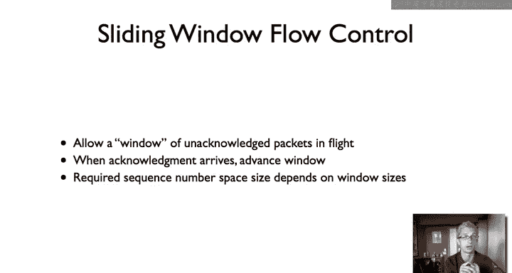

# 斯坦福大学《计算机网络｜Introduction to Computer Networking CS 144 2018》中英字幕deepseek - P34：-034-Sliding window 64.zh_en - GPT中英字幕课程资源 - BV1bVqNYFEGg

This video， I'm going to talk about a slightly advanced flow control algorithm called sliding window used in most high performance protocols today。

So we call a simple flow control algorithm called stop and wait has at most one packet in flight in any time。

 So this is the basic simple protocol you might say algorithm might try to implement the first time you're doing reliable communication。

 So a sender sends a packet or a chunk of data， the receiver sends acknowledgement， the sender。

 if it doesn't receive the acknowledgement times out， tries resending if it gets the acknowledgement。

 it sends more data。And there's some issues with duplicates so you can maintain a counter。

 a one bit counter to figure out if there's a duplicate act or an actual duplicate or new data。

 as long as things aren't duplicated for more than around trip time， stopping way it works。

 it's great， it's simple。So while stop and wait。Works correctly。 It has one major problem。

 Let's say you're trying to communicate between Boston and San Francisco。

And the bottleneck is say 10 mebit per second。 So there's a 10 mebit per second link here。

 or let's say the Boston node can receive at 10。Mgabits per second。

That's the way at which you can process data。And round trip time is 50 milliseconds。

And let's just say for a simplicity's sake， we're sending Ethernet frames。

So that's the size of the data， so which are basically 1。5 kilobytes。Or 12 kilobits。

Now around trip times 50 milliseconds， that means that San Francisco can send one packet 50 in if that packet is received successfully。

 50 milliseconds later it'll get an acknowledgement。

So we have 1000 milliseconds per second divided by 50 milliseconds。

 this means that we can send at most 20 packets per second。On this， on this path。

Then 20 packets per second times 12 kilobits。Kbits per packet。Is equal to 240 kilobits per second。So。

 this。Path between San Francisco and Boston using a stoppingly protocol can send at most 240 kilobits per second。

 assuming no packets are lost， just constant RTT 50 milliseconds。

But the bottleneck is 10 megabits per second。This means that。

This stoppingway protocol is using 2% of the capacity。Of what the communication。

So stop and wait while it works。Can be astoundingly inefficient。

San Francisco could be sending data much faster than what stopping and wait allows。

So the basic solution that most protocols use today for this problem is something called a sliding window。

And sliding windows are a generalization of stop and weights。

 where a stop and weight allows one packet in flight at any time。

 a sliding window protocol allows up to n packets in flight， so when n is equal to1。

 a sliding window protocol behaves like stop and weight。

And so let's say we have a sliding window protocol with an n equal to say， five packets。

This means that San Francisco can have five packets。In flight。 and simultaneously， there can be。

Five acknowledgeledments。Maybe me five acknowledments coming back from Boston。

And the idea here is that if you adapt， if you can set N。To be。The correct value。

 then you can keep the pipe full that is San Francisco could send data to Boston at 10 megabits per second。

So let's say that's Boston's rate， and so Boston can， by configuring the sliding window size。

 can have San Francisco asend data at a rate equal to 10 megabits per second。

And so in this particular case， right if we have an R TT of 50 milliseconds and a bottleneck of 10 megabits per second。

 let's say that we're sending ethernet frames， right，10。Killbits。For packet。

And we have 20 round trip times。That essentially means that the sliding window is going to be 10 megabits per second。

Divided by 20 round trip times。ItsBas which is equal to 500。Killlibbits。Per round trip time。

So we're looking at a sliding window of around 49。So around 41 packets， right。

 40 is 480 kilobits per ontri time， so 41 would be 492。嗯。

And so if we had a sliding window of 40 packets。Then we'd actually be able to sustain a 10 megabit connection from San Francisco to Boston with a round trip time of 50 millisecons。

So just to draw a picture， kind of show what this looks like here。Is the original。

 here's the stop and weight we of this one bit counter， data 0， x0， data 1， act 1， data 0， x 0。

 So the sliding window， let's say we have a sliding window of size3。Well。

 the sender will send three packets。Let's call them D0， D1， D2。

And the receiver can then acknowledge them。Ac zero， Act 1， Act 2。Well。

 as soon as acknowledgement zero arrives， the sender can send data 3。

As soon as acknowledgement 1 arrives， the center can send data 4。

 as soon as acknowledgement2 arrives， then center can send data 5。

This is the basic idea rather than having this one packet。 you could have many packets。

 so in the case of having a sending window of size 40。

 you can imagine there are tons and tons and tons of packets。So。

Let's look at more concretely what this algorithm looks like for both the sender and the receiver just as we did for Stockway。

So a sliding window sender first in a sliding window protocol， every segment has a sequence number。

 so in protocols like TCP， this is usually done in terms of bytes because they can be variable size for simplicity's sake。

 we'll just do it in terms of packet numbers。So there's a sequence number for every segment。

So the sender maintains three variables， the size of its sending window。

The last acknowledgement it received from the receiver。And the last segment it sent。

And the sender's job is to maintain this invariant。

That the last segment sent minus the last acknowledgecment received has to be less than or equal to the send window size。

 So this means that if it has received packet N。packet with a sequence number of n。

 the sender cannot send a packet past n plus SWS。So let's say we have ac window is equal to five and the last acknowledgement that's been received。

Is equal to 11。Then this means that the sender cannot send a packet of pass 12，13，14。16。

 it's not allowed to send 17 until it gets a for 12。When you get a new acknowledgement。

 you advance LAR。As necessary and you buffer up the sending window size segments in case suddenly you get an acknowledgecment and then you want to send a whole bunch of data。

 Let's pretend for a second we have a sending window size。Equal to3。And so。Here's packet Ed says 0，1。

2，3， let's say zero had been sent and acknowledged。So our sending window size is three。

 the last acknowledgement for the receiver is zero。So LER is equal to0。SWS is equal to three。

This just means that the last segment cent is equal to three。

So now when an acknowledgecment arrives safer for one。Then the sending window can advance。

 And so now the protocol can send4。And let's say an acknowledger for four arrives。

 then the window can advance and it can send five， six。And some。Now。

 one thing that's important here is that let's say we have a sun window， which includes five。

 six and seven。And 5 is lost， but 6 and 7 arrive at the receiver and are acknowledged。

The sender cannot advance the window past5 until 5 is acknowledged。

 And so the window is what's called stalling。 the window can stall where although most of the data in the window has been delivered。

 it can't move past the first unacknowledged piece of data so it can advance the window past。

The receiver。Also maintains three variables。It has a received window size。

 the last acceptable segment， so this is the last segment that it will receive and won't drop on the floor if it receives a segment past this value。

 it'll assume something is wrong or it was not going to buffer and it'll just discard it。

Then there's a last segment it's actually received。And so the send。

 the receiver is then maintaining this invariant， that the last acceptable segment minus the last segment received must be less than or equal to the receipt window size。

 and so if you have received window size equal to5 and a last segment received。Equal to three。

Then it's not going to excite anything past  four，5，6，7。So if it receives suddenly segment 10。

 it won't accept it and it'll drop it。Now， if the receive packet is less than this acceptable segment。

 then it'll send an acknowledgement and so if it receives any of these packets。

It will send an acknowledgement。Now， in the basic case， the way most sliding motor protocols work。

These acknowledgecledments are what are called cumulative aledments。

Such that you send an acknowledgement for not the data you received。But rather。

What is the end of the contiguous data that you received is cumulative， if I acknowledge three。

 that means that I have received three in everything before it， not just three。

And so it represents a cumulative state of reception across the entire communication。

So in this example， if a receivers receive one， two， three， and five。And then suddenly receives five。

 it doesn't acknowledge five， it acknowledges three。

Now there are some protocols that can do things like actually do selective acknowledgecknowledments。

 but the basic case is that use cumulative acknowledgecledgments。

 which is cumulatively what is the contiguous chunk of data that you've received？

So one little detail here， TCP doesn't acknowledge the data it's received， but rather n plus one。

 So TCP acknowledgeknowledments are in terms of bytes and so if TCP is received up to byte N。

 it's acknowledgement packets well say n plus one。 So it's the first byte of data that's expected。

 So if you're ever looking at a TCP traces are trying to see how the TP protocol works。

 just keep this in mind the acknowledgement。Value in a TCP header isn't the last byte received the cumulative acknowledgecment rather than next byte。

 the first missing byte。So one of the things we talked about in the stop and W protocol was that a counter of one bit counter was sufficient。

 assuming that packets weren't delayed more than round trip time。

So what about in sliding window protocol， suddenly we've received window， we have a send window。

 how big a sequence number space do we need？So their C window is always greater than one。

 send window is always greater than 1， rather than equal to 1。

 and their C window greater is less than or equal to the send window。

This is because if the receive window is ever greater than the send window， it's a waste。

 the sender would never have those packets in flight。

 and so there's this extra buffer space which will never be used。However。

 there are cases where the receive window can be smaller than the send window and the protocol still works。

 so here's one interesting basic case of that called Go back am。

Well let's say if we receive window of size1。And ascending window that's larger than one。Well。

 in this case we're going to need sending Windows size plus one sequence numbers So what does this protocol look like Well the sender says let's say it as says send window size is equal to three。

So the sender sends 0，1， and2， and let's say those are acknowledged。

 And so the receiver acknowledges0 and acknowledges one and acknowledges2。

But when it acknowledges zero， the sender is going to send three， slide the window of4。

 when it acknowledges one， it's going to send four， and when it acknowledges two。

 it's going to send five。So now let's say that three。Is dropped。Now， the sender， the receiver。

 is going to still receive 4 and 5。 and so I can act 2。It's going to send act2， act 2。

The sender is going to time out， and resend 3。So this is called a go back end protocol because the receive window was size one。

The receiver could not offer 4 or 5。 And so when a single packet is lost in this case，3。

 the sender has to go back and it has to re transmitmit the entire send window worth of packets。

 It has to retransit 3， It'll have to re transmitit 4， and you'll have to re transmitmit 5。

In contrast， if the receiver window size had been three。

 then the receiver could have buffered 4 and 5。 the sender would only have had to retransmit 3。

 then you get an act 5， and it could go on and send 6。7。

And so here in the case of a go back end protocol， you need to send window size plus one sequence numbers。

Because you imagine if you have only the send window size， there's zero， one，2。

And then remember what happened in stop and wait when there's a packet delayed where， hey。

 let's say that the a for0 is delayed。 There's a timeout you retransmit  zero。

 Now you can't distinguish whether or not。The delayed acknowledgement was for the retransmission or for the old data。

So in speaking if the two windows are the same size， you need twice basically their sum。

 and so that's the generalization that you need RWS plus SWS sequence numbers。

 you need sequence number space is least as big as the sum of the window sizes。That's the basic。

Sliding window algorithm and the algorithms that the send and their receiver use and how the center manages the window。

What does this look like in TCP so TCP is a sliding window protocol and uses that for flow control and so here's the TCP header。

And so the way TCP works is the set， the receiver。Specifies a flow control window using the window field and this in terms of bytes。

And so it basically says this is the buffer size that I have on the receiver and so the set of packets that I will accept。

嗯。And the basic rule is that here the data sequence number and the acknowledgement sequence number。

 And so a TCP receiver。Will only handle data equal to the acknowledged sequence number plus the window。

 so the sender isn't allowed to send。Dta。Past act plus window。

That's to make sure it doesn't send data which the receiver is not going to buffer and so there' is a way for the receiver to essentially set what the send window size is。

So let's walk through an example， so here again I'm going to talk in terms of packets rather than in bytes like in TCP。

And here's the sequence number space for the packets from zero up to 29。So let's say that we have。

IllRe window size。Equal to 2。And ascend window size。I equal to 3。

So communication begins and the sender is going to send zero。1。And 2。

Let's say all three of those packets arrive。And so the receiver receives zero。Acknowledge zero。

 it's then going to receive one， acknowledge one， receive two， and acknowledge two。When the sender。

Here's Act 0。 It'll advance the window， the send window， and it'll send3。

When it hears the acknowledgecment for one， it'll advance the window and send。4。

When it hears the acknowledgement for two， it'll advance the window。And send。5ve。

Now let's say that packetet 3 arrives successfully and is acknowledged。

But packet4 is lost in the network。So now we have this case where。嗯。Ac 3 has been sent。

 Packet 4 is lost。 Then packetet 5 arrives at the receiver。Now， the receiver。

He is going to send another acknowledgement3。Again， because of cumulative acknowledgegments。

And so now the sender。Heard Act3。Then another Act 3。Waiits。Time's out。And resends four。

So it'll resend for。let's say four arrives。Now this receiver can acknowledge for so it can act for。

 but because its receive window was of size 2， it actually had five buffered and so it can also acknowledge5。

 and so it'll send act。5。So。A sliding window of flow control algorithm allows an unacknowledged。

 so a whole window of unacknowledged packets to be in flight。

 And so this allows is if you can set that window size appropriately。

 it allows a sender to be able to actually fully utilize the capacity that the receiver has。

 unlike a stoppingaway protocol where you can have most one packet in flight。

When acknowledgements arrive for new data， the sender advances the window。

 generally sliding window protocols use cumulative acknowledgecledgments。

And the exact sequence number space you use depends on the window sizes。

 so it turns out TCP uses a large sequence number space just for easy of use to really be robust against heavily delayed packets。

 but if you're implementing your own protocol， you may be able to get away with something a little bit smaller。

