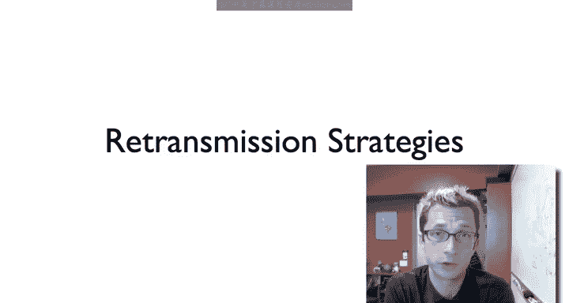
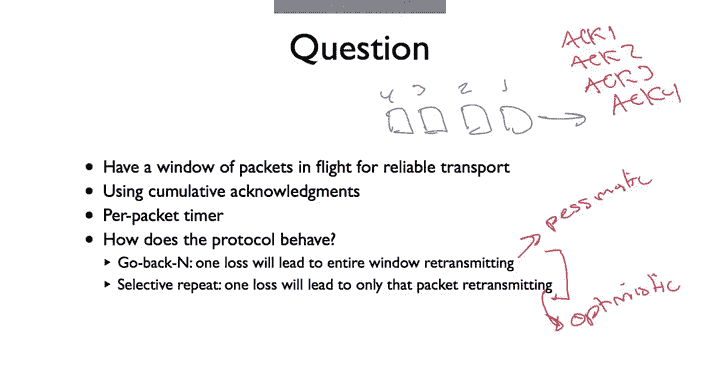
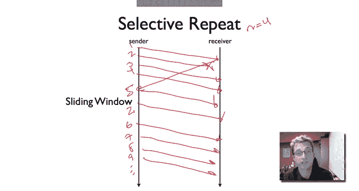
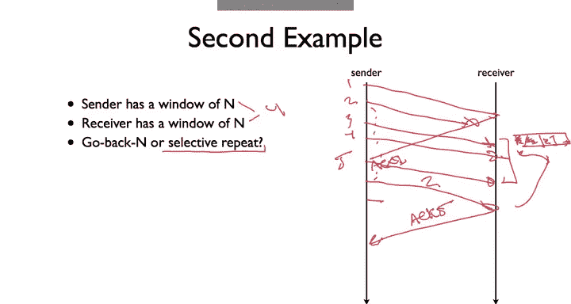

# 斯坦福大学《计算机网络｜Introduction to Computer Networking CS 144 2018》中英字幕deepseek - P35：-035-Reliable comm      Retran.zh_en - GPT中英字幕课程资源 - BV1bVqNYFEGg

So in this video， I'm going to talk about retransmission strategies for transport protocols in order to achieve reliability in particular for sliding window protocols。

The basic question is we have with some sliding window reliable transport。

 a window of packets that are in flight。Say one，2，3，4。And we're using cumulative acknowledgecgments。

 and so all we get is something back such as Act1。Backc 2。Ac 3。Ac 4。

Just the last bite that was successfully received， or last packet that was successfully received。

We're maintaining a retransmission timer for each of these packets based on when they were sent and essentially maintaining a conservative estimate of if we haven't received an acknowledgecment for the packet by this time。

 then this means that it is almost certain that the packet was lost and so we should retransmit it。

And so the question is。Given this set of parameters which are generally used for reliable transport。

 how is the protocol going to behave， what is its retransmission strategy going to look like？

So we'll see is that there are essentially two strategies you end up seeing。

 you end up so set up emerging from different protocol， the first is we go go back in。

So one to think is that go back in is very pessimistic。Approach or pessimistic behavior。

 which is that if a single packet is lost。Then we're going to retransmit the entire outstanding window of packets。

 Go back in so with the window of size N， we lose packet some packet。

 we're going to go back and transmissions， retransmit all of them。The second is selective repeat。

 which way you think it is optimistic。So where go back N assumes that if one packet is lost。

 all of them are lost in the window。 Selective repeat assumes that if one packet is lost。

 only that packet was lost。 So in selective repeat， if we lose a packet， it's not acknowledged。

 we'll retransmit that packet and only that packet。

So let's look at what go back and appears like what's the behavior that you see。

 So let's say that we have a window of size equal to 4。And so the sender sends packet1，2，3，4。

And packet two is lost。So here are our four transmissions。Well， in response to packet one。

 the receiver is going to send acknowledgement。An acknowledgement one。

But it's not going to send acknowledgement too。And so what will happen is at some point。

We're going to have re transmitit timer go off and then in a go back end protocol。

What the sender is going to do is it's going to retransmit the entire outstanding window。

There some kind of timing。And so don't forget， the window is going to include5 because in response to this Act 1。

 it can send5。 but so the transmitter seeing the packet as 2 is lost is going to assume that the entire window is lost。

And we transmit the entire window。This is very conservative， very or very pessimistic。

So now let's see what a selective repeat protocol will do。So， again。N equals 4。

I'm going transmit one， two， three， four。One， two， three， four， packet two is lost。

Packet 1 is acknowledged， which lets us send5。In a selective repeat protocol。

The transmitter is going to retransmit 2。And then we'll continue execution and transmit。6，7，8，9。

 dot dot， dot， dot。So it'll re transmitit only the packets that。Were not acknowledged。

So one question that comes up is why given the selective repeat doesn't sends fewer packets。

 Why would you ever want to do go back in。 Well， there are a couple of reasons， One is that。

Selective repeat， if actually all of those packets were lost if packet 2，3，4 packets 2，3，4。

 and 5 were all lost in order to do each of these retransmissions involves timers and round trip times。

 so it can be much slower if there's a burst of losses。

 a selective repeat protocol often be slower to recover as supposed to go back in assumes that all the packets are lost it retransits all of them and it can get going faster。

And so there's a tradeoff here between sort of the amount of data that you send。

 how quickly you send it， and then how much of it is wasted versus the speed of recovery from significant errors。

So let's walk through two example transport protocols and their configurations and see how they behave。

 what happens。So in this first one， our sender has a window of size n。

 and let's say that n is equal to 4， just like the prior examples。

 and the receiver has a window of size 1， so the receive window size is1。So based on this。

Is the protocol going to behave as go back N or as selective repeat？Well。

 so let's walk through it happens。So the sender， let's say， is going to send  one，2，3，4。One， two。

 three， four。And let's say that packet two is lost。So it doesn't arrive。Well。

 the receiver is going to acknowledge one。Which will allow the sender to send five。

But the receiver is not going to acknowledge too。Now， at some point。

Twos retransmission timers go to fire。And I'll retransmit two。

But the thing is that because the receiver has a received window size of only one。

 it has been unable to buffer packets 3，4 and five。And so when it receives packet2。

 it's going to act2。The sender has not received an acknowledgement for three。

It's going to have to retransmit three。And then the receiver can acknowledge three。At some point。

 the sender can then start using its full window again。

 but the point being that since this first two was lost，3，4 and 5 couldn't be buffered。

 The fact that the receiver has a window size of only one is going to force the sender to retransm every single packet in the window。

 So we're going to see that this behaves is go back n。So let's say a second example， so in this case。

 the sender has a window size of n and the receiver has a window size of n。

 and let's say that for both of them， just again， for simplicityimplic's sake， this is of size 4。

So in this case， will the protocol be go back n or select repeat？So let's walk through what happens。

We have again， one， two， three， four。Two is lost。So we get an acknowledgement for two for one。

 act one。Results in pack of5 being sent， then at some point two's retransmission timer fires。

So we resend two。Now， the receiver has been able to buffer these packets because it has a window of size N。

 And so it had three packets buffered。 It can then。So here is its buffer。It had packets 3，4 and 5。

 Packet 2 arrives。 It can then。Acknowledge。5。So it might be that the sender was a little aggressive。

 maybe it did retransmit3 or four or something， but the point is that it doesn't have to for this to operate correctly if sayage just waited for those retransmission timers or it did slow retransmissions etc。

 that the sender is going to resend only packet2， only the outing packet that was not acknowledged the rest of and buffered at the receiver。

 and so we see that this behaves a selective repeat。So when you're implementing transport protocol。

 say if you're take if youre when you're doing lab2。

 one thing you want to think about is how you handle readtransmission。

 so one of the really important things is that you don't retransmit。Earlier。Then you should。

 by which I mean it's not okay to say start a re transmitmit timer based on packet 1 or packet2。

 And then when two is re transmitmit timer fires， re transmitmit an entire window。

 because it could very well be that 3，4 and 5 have been correctly received or something that' happen。

 but you're going retransmit them anyways。 You're very aggressively putting additional packets in the network。

 You're inflating the number of packs in the network beyond your window size，3。

4 and 5 could still be in the network yet。 you're putting additional copies of them。So in that way。

 you want to be careful about the number of packets you put in the network and be careful about your readtransmission policy。

And so we'll see， what you can see is that on one hand you can assume trying to be very conservative say look。

 if one packet was lost， I'm going to assume that the others were lost。

 and then I'm going to retransmit the entire window with a go back end policy that will happen if say your receiver has a window size of only one or you can maybe be a bit slower and say look one packet was lost。

 I'm going to wait for run trip time transmit that。

 see if I get an acknowledgement see where the acknowledgement puts me and then perhaps just do a selective repeat and transmit only the packet that needs to be transmitted。

