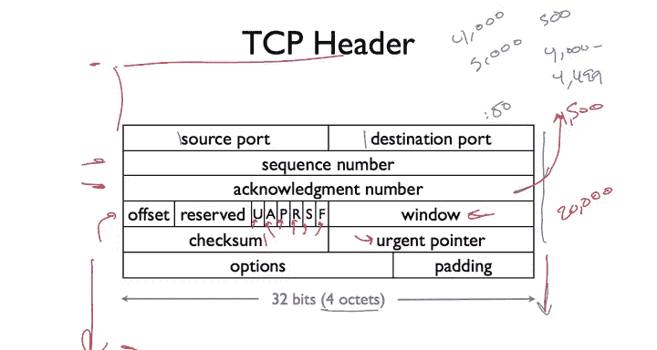

# 斯坦福大学《计算机网络｜Introduction to Computer Networking CS 144 2018》中英字幕deepseek - P36：-036-Reliable comm     TCP he.zh_en - GPT中英字幕课程资源 - BV1bVqNYFEGg

So in this video， I'm going to give a brief overview of the TCP header。 If you want more information。

 there's of course tons of documentation online， but there is just a brief summary of of what the fields in the header and their meaning。

 A standard TCP header is 20 Btes long so we can see here that there are five rows of fourocts each。

 Additionally， you can have options after the TCP header。 I'm not going to go into any of those now。

 the basic TCP header you see in most connections is 20 Bs long。

So the first two fields in TCP are the source port and destination port。

 each of these is our 16 bits or twoocCts， so we talk about connecting to the web port port 80。

 that's the destination port， say of 80。The next two fields are the TCB sequence numbers。

 So these denote from the source of this packet to its destination。

 What is the sequence number of the data contained in this segment。

 as well as what is the acledgment number from that end point。 So， for example， if I。

 if I want to acknowledge that are received up to byte 5000。And then this is sequence number 4000。

Then as I said， I will send sequence number 4，000， acknowledgement number 5，000。

The sequence number denotes what the sequence number is of the first byte of the data region。

 which follows the segment header， so if I had a sequence number of 4000 and there were 500 bytes of data。

 then this would mean byte 4，0 to 4，499。Now， the acknowledgeknowment number。Acknowledges。

The last by received plus  one。 And so if I were to send this segment 4000 to 4499。

 and the other side received it， it would itsend。An acknowledgement number。Of 4500 of 4500。

That is in TCP， the Act is not for the last byte receipt， but that plus one。

 what is the next byte that is needed？So when we talk about TCP a packets。

 what these are is these are TP segments that have no data。

 all they're doing is counting the acknowledgement numbers for this happens if say traffic is un directional。

 I' sending lots of data in one direction， but there isn't data coming back If the flow is bidirectional。

 then these acknowledgement numbers are just going to be added or padded onto or not padded but incorporated into the data segments as they're being sent。

So after the sequence number and acknowledgement number， we have a bunch of fields。

Let's start with the checkum， so the checkum is computed over the TCP pseudo header。

Which is the TCP header， as well as some of the IP header this way just add a little bit of additional resilience for the IP header。

 the IP addresses， etc。So the checkum covers this pseudo header， the TCP header。

 and then the data within the TCP segment， and so the checkum actually in some ways stretches before the packet to the pseudo header filled in from the IP header and then stretches to the end of the segment。

 simpleimple ones complement checkum。The window field is the flow control window。

 it tells the endpoint， so the flow control window。

 the window field within a packet is telling the other endpoint how much received buffer space its sender has。

 so if you say say a window of 20，000 that means that there cannot be more than 20。

000 outstanding unacknowledged bytes in this connection。In that direction。So these bits here， UAP，R。

 S and F， are control bits。So let's start with some of the sort of less less common ones。

 So there's you， which is the urgent bit。 That means that this data is particularly urgent。 So hey。

 lets let's go the application quickly。Then there's P， which is the push bit， so the push bit says。

 hey， please push this data to the receiving application。So the other four bits， there's the act bit。

 the reset bit， the S bit and the thin bit。So the a bit。Here。

This bid is set to one if the acknowledgeknowment number field is valid。

So the ActP is generally set to one for every single segment。

 except for the first one that initiates a connection。Because when you initiate a connection。

 you don't know what the other side sequence number is， so you can't acknowledge anything。

 so the api is not set。So when we talk about TCP setup。

 we'll see that the first packet sent does not have the Actpi set。

 but all other packets in the connection through its termination have the ActP set。

The sin and thin bits are used to set up and tear down connections accordingly， or respectively。

 So the sin bit says。Hey， this is my starting sequence number。Please synchronize to this number。

And so when you first open a connection， you send a packet with the abitt not set。

But with the S bit set and then a sequence number， and you're telling the endpoint。

 I would like to synchronize you to this sequence number which represents my first bitete of data。

The other side can then respond and say， all right。

 I'm going to acknowledge that sequence number and send you one of mine in this case。

 both those fields are valid to which then you can respond and say， okay。

 I'm going to acknowledge your sequence number now you' synchronize we both know when the bytes start。

So one of the things is that you can imagine I could always just start my sequence number at zero for every connection both directions。

 but there turn out to be real security problems with doing that that that means people can guess what your sequence number is they can start interpersing packets。

 it' generally seen as a bad idea。Also because if you have lots of short lived connections。

 these packets with similar sequence numbers can be long lived in the network and you want to be able to filter them out。

So the the F is for fin。 This is for tearing down a connection。 So when you set the fin bit。

 you're telling the other side I have no more data to send。

And so often they exchange is you send the fin， they acknowledge the fin。

 they send later you a fin with no more data send， and then you acknowledge that fin。

The final bit is R， the reset bit。Which says need to reset this connection。

 Something wrong has gone on。So if the urgent bit is set。

 then this urgent pointer points where in the segment that urgent data is。Finally。

 we have the offset field。So the offset field is needed because it's possible for TCP to have options。

 And you don't know from this header necessarily where the options are。

 So what the offset tells you is at what offset within this segment does data begin。

 So if you have options， then the offset tells you the size of those options and your TCP stack knows to look inside their four options。

 the options are paded to be4 bys4octts wide。So that's the basic TB header we have the source and destination ports。

 the sequence numbers， both for the data and then for the acknowledgeknowledgments of the data that you've received。

 the offset field to tell you where data begins， the urgent and push bits for urgent data or data you want to push the application。

 the acknowledgecledment bit indicating the acledment number is valid。

 the S bit for synchronizing the sequence number， the thin bit for tearing down a connection。

 saying that there's no more data to send， the reset bit for resetting a connection。

The window for flow control， check some for making sure that there aren't errors in the data。

 an urgent point or for the urgent bit， and then options。

