# 斯坦福大学《计算机网络｜Introduction to Computer Networking CS 144 2018》中英字幕deepseek - P37：-037-Reliable comm     Connec.zh_en - GPT中英字幕课程资源 - BV1bVqNYFEGg

Since this video， I'm going to dig into the details of TCP Connect setup in teardown。

 This is a deeper look than sort of the initial service model we presented。

 looking at a couple of edge cases and the entire TCP state diagram。

You'm going to look at through a handshake， something called simultaneous open。

 which turns out to be really important today in peer to peer applications。

 and actually show the full TCP state machine for connection set up in tear down。

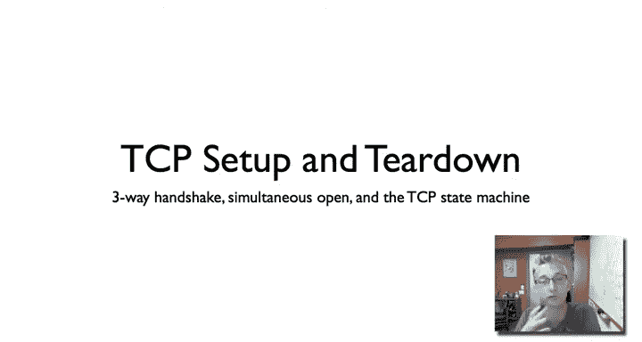

So the high level problem here is if we want to communicate reliably。

 it turns out it's very helpful to have state on one or both ends of the connection。 you can。

 in fact turn， turns out you can communicate reliably with having something stateless on one end or the other。

 but it's much less efficient。 having a little bit of state is great。

 It'll make you have much better throughput， etcter。But if we have this state。

 there's this problem of how do we set up that state， what is it， so connection establishment。

But then also， given the state's going to take up Ram in your machine， when can you tear it down。

 when is can you sort of garbage， collect this state and reuse it。

 So examples of this the memory structures using for your TP connection。

 the buffers or also the port numbers that youve used。

So are these problems of connection establishment and teardown。

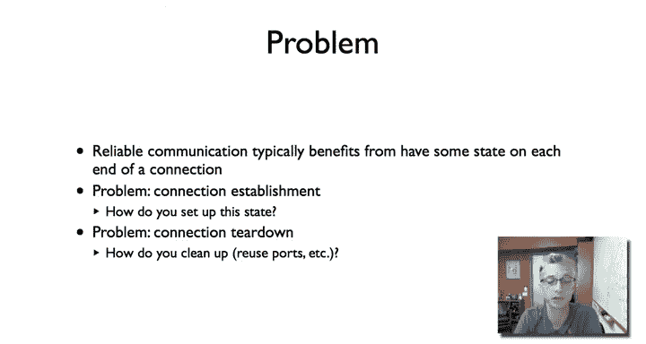

So here's the standard TCP header with its standard 20 byte payload and then options。

So for connection setup， as we've seen before， there are four parts of the header that are used。

 the sequence number， the acknowledgeknowment number， the act bit， and the S bit。

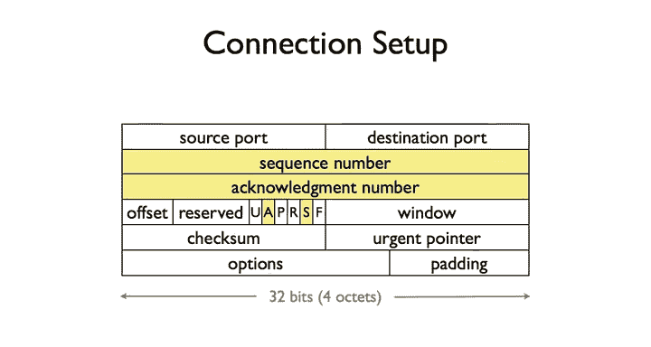

So here I'm going to walk through through a handshake in a little bit more detail as to what happens in the packets that are exchanged。

To recall in the standard 3 ahndric model we have an active opener and a passive opener。

 the passive opener sitting listening， waiting for connection requests such as say a web server。

 The active opener is the one who initiates the request to start the connection。So in the first step。

 the active opener。Sends。A TCP segment with the Sbit set。

To indicate that it's synchronizing the passive side to the beginning of its stream。

 it's saying what is the first sequence number of my stream， and so let's call it S subA。

So you do this rather than just say assume zero for a bunch of reasons， number one。

It's very helpful to randomize your starting sequence number for security reasons。

 it means that people can guess where your stream starts and try to insert data on you。

Also it's useful if there happen to be old packets flying around the internet。

 which sometimes happens to give tremendous delay somewhere。

 if you randomize your starting sequence number， then it becomes very unlikely that some random segment or perhaps a corrupted segment is going to overlap your own sequence window。

So the active side sends a sin saying this is my starting sequence number S subet。

The passive side responds。Also with a sin。Saying， okay。

 that' I'm going to synchronize you my starting sequence numbers that say S of P for passive。

But I'm also going to set the act bit， which means that the acknowledgement sequence number in the packet is valid。

 and I'm going to act S plus1。 recall that a node acknowledges not the last byte received。

 but rather the first byte that hasn't been received。 So by sending act S plus1。

 the passive side has acknowledged that it received the sin， which is effectively byte S sub A。

The active side then responds。 It doesn't need to send a sin because it's synchronized。

 So it sends a packet with sequence number。S P plus 1。 that's commonly the what's used and a。Yes。

I'm sorry。 sendends a pack with S A plus1。An act S P plus 1。

And so now it's acknowledging saying I have received your sin， and I'm acknowledging that。 Now。

 this initial packet， the sequence number is S plus one， but it tends to be of0 length。

So if there were a byte in the packet， it would be S plus 1， but it's not in of length 0。

 This is just a simple control packet。 And so there's the sequence number of which the bytes would start。

 but there are no bytes。So that's the basic connection setup， S， Sin act， AC， A， a+1， P， P plus 1。

 and then an empty segment just for connection establishment。

So turns out TB also supports another way of opening connection。

 something that's called simultaneous open， which as I said。

 is used a lot as we'll see later in the course in peer to peer applications to reverse things called network address translation boxes。

And so the way simultaneous open works is this happens if both the active， if the two sides。

 we call them active and passive， but now they're really both active。

Both know each other's port numbers， so the node on the left knows that the port that the node on the right is issuing a connection request from。

 the node on the right knows the same for the node on the left。

 and they're using the correct port numbers and they do this， they negotiate the say beforehand。

So what happens to simultaneous open is both sides send sins at the same time。

And so here the one on the left sends a sin。Let's call it just a sub again， S sub A。

But at the same time， the northern right sends a sin。S P。Well then on the left response。And it sends。

Sin。S sub贝。Ack。S& P plus one。Similarly， then they're on the right response with sin。S a P。Aack。Eabe。

Plus one at this point， we've now established the connection。

 both sides have synchronize know the starting sequence numbers， they've acknowledged that。

 but note that this takes four messages rather than three。

 So let's see this just a standard through a handshake in practice。

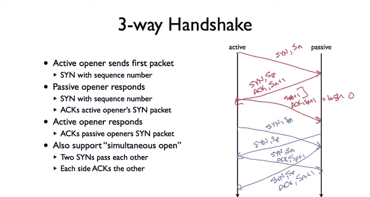

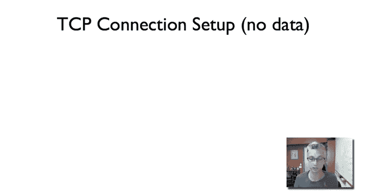

So here I've opened up wire shark filtering on port 80 and a certain IP address。

 And so I'm just going to tell that to port 80 on that host and we'll see the S Sinac Act set up。

 And So there it is。 So here's the first packet sent from my host to the destination。

 And we see that。

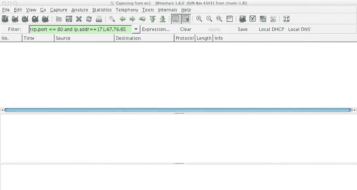

It's an HP port 80， S sequence number0， and there's no a sent， there's no act bit。

 and so the acknowledgement field is invalids， it's not displayed。Now。

 it turns out the sequence number in this packet isn't actually0。

 What tools like wire shark do just to make things easier to read is they use relative sequence numbers。

 They show you what the sequence number is relative to the beginning of the stream。

 And since were just starting the same， we see sequence number 0。

 We dig inside the packet down here at the bottom， you can see。

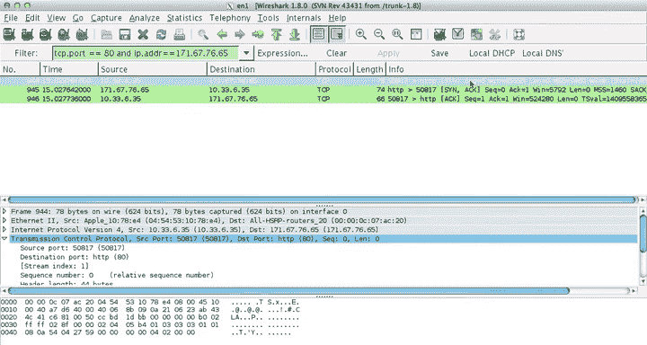

Where shark tells you sequence number0， relative sequence number。

 and if we then look at the actual field， it's CCBD1 dBB， and so it's much larger than zero。Now。

 what we then see is for the second packet that's acknowledging this， it's going to acknowledge。

With CCBD，1， D BC。

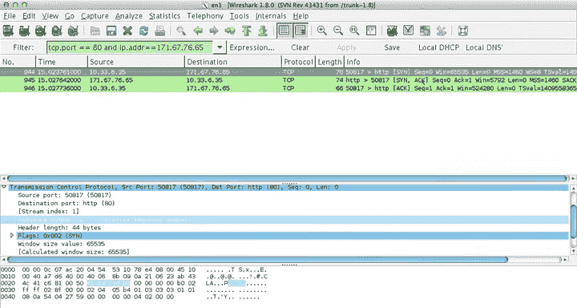

Here， again， it's using relative act numbers， but that's what we see CC，B D1 D， BC。

 it's also sending a sin， So here's the S Act。And so the sequence number， again。

 a relative sequence number of0， but it's 34， 11， 35， Ae。So this is from my host to the server。

 this is the server back with the SynAC， then my host responds to an AC。

And so you can see sequence number one。Acknowledgement number one。

 is's acknowledging the sin that was sent from the server， and it gives a sequence number one。

 but it's a length of 0。 And so it's saying， aha， you know， I。

 this packet contains the stream starting at byte 1， but there's nothing in it。

 So there's actually no Diddia。 So there we see a simple three way handshake。 So now。

 let's look at a T speed connection when there is data。

 So we're going to see the S S act and then some data communication。

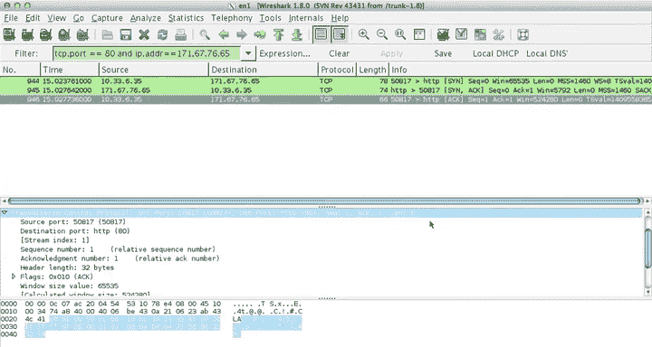

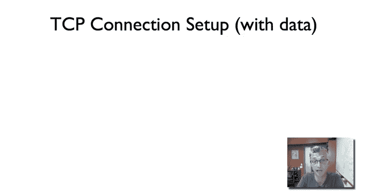

So I'm can to do the same thing as before， except this time rather than tele neting to port 80 where there's no data transferred。

 I'm just going to do a standard web request to port 80。

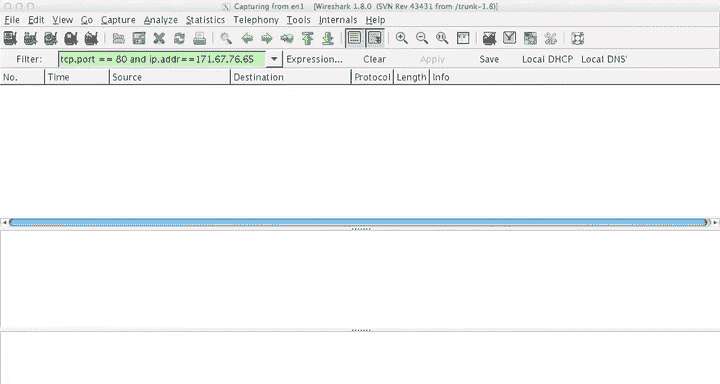

And so here we see。AndTP connection。 And so here we have the S Sak。

As now the connection's been established and then data transmission starts。

 And so here's a packet showing its HTP。 And if we look inside。

This particular TP segment sees sequence number one。So it's the start of the data stream。Length 474。

 so this particular chunk of data was 474 bytes long。So the next sequence number would be 475。

 still act 1。And so there's the data they were sending as their request to the web server。

 then the web server responds。And responds with Act 475。So the next by to expect is 475。

 But sequence number one。 This is just length 0。 This act， it has no data in it。

 This is what we call sort of of just an act packet。And so it has no TCP segment data。

 but is acknowledging the data that it's received。The next packet though。

 from the server actually has data in it， so you can see here length 1448， but sequence number one。

 so it's one to414，4，9。And here's the next TCP segment。 And then we see here putting that together。

 There's the HP response， which it's put together。 And so there we see the connectional establishment。

 And now the sequence and acknowledgement number spaces are walking forward according to the data communication。

 So next， we're going to look at how TCP tears down a connection。

Like a connection setup that's uses at the sequence number， acknowledgeledment number fields。

But unlike connection setup， which uses the synchronization bit to synchronize sequence numbers。

 connectionion Tdon uses the fin bit to denote that there's no more data sense。

 So uses the a and fin bits。

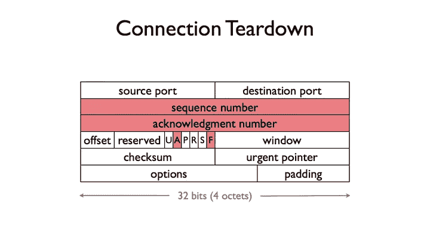

And so when TCP sends a packet with a thin bit， what this means is that that sender has no more data tocent。

 This is the end of the stream。 This is caused when you say call close or shutdown in the application。

But TCB connections， like most reliable connections， are bidirectional。

 And so it's not until both sides have nothing to send that you actually terminate the connection because it can to be one side is done。

 but the other side has more to send。And so it's not until both sides have finned and you've acknowledged those that you can tear things down。

 So a typical tear down exchange looks like this where we say of A and B who are communicating and a closes first。

 And so it sends a packet with the fin bit with sequences number S sub A and acknowledging S sub B。

B then sends a packet to acknowledge this fin。 So x S sub a plus1。Then at some point later。

 B decides it needs to close inside the connection。 So it sends a f sequence number S sub B。

 Accknowledment S sub1 and still acknowledging S A plus1。

 which then a responds saying I'll acknowledge S B plus1。

 So f like sin represents of the last bite of the connection the way that you like sin represents the first bite the way you acknowledge it by acknowledging plus one with Finn。

 you acknowledge that you received it by acknowledging plus one。

Of course you can also have simultaneous clothes where they send the fins in parallel and the same exchange occurs。

Great， so now we've exchanged these messages and we've acknowledged them。

 when can we actually tear down the connection， When can we actually delete the state。

 When can you reuse the ports？

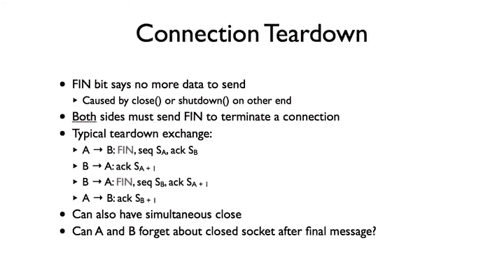

This turns out to be an nontrivi。 You can't do it immediately。 So， for example。

 what happens if this final act is lost in the network？ So I've sent Fin， Then I receive a fin。

And I a it。I can't immediately tear down my connection because what happens if that act is lost。

 the other side's never going to adhere it。 It's never going to know whether the connection was torn down。

Another issue is it could be that we do a thin thinin act and acknowledge and tear down and then these same port pair。

 the same port pair is used immediately for a new connection。

 we want to make sure that we don't by accident then corrupt the data because the sequence number spaces overlap。

So the solution that's used is the active closer goes into something called time weight。

 and what this means is that if I'm the person who sends the fin first。

 then once the connection is torn down， I have to wait a little while before I can reuse my state。

And so you keep the socket around for two withs sort of maximum segment lifetimes or two times sort what you'd expect to be the longest time segments might live in the network which she's on the order of。

 say a minute or so。So this approach of two maximum segment lifetimes can pose problems with servers。

 In particular， if I have a server and says tons and tons of sockets。

 which are in this time weight state， this can slow things down。 if the server was for closing first。

 So there are tricks。 you can send a reset to delete the socket。

 You can set an option to make the linger time to be0。 Another issue is。

 the US might not let you reuse a port because it's still in use。

 There is an option you can do called Sso reuse outer thatll let you to rebind a port numbers。

 This is useful to say you're just debugging something and gosh。

 I don' want to wait two hours because I happen to offend in in this order。

 So let's see what a connection teardown looks like。

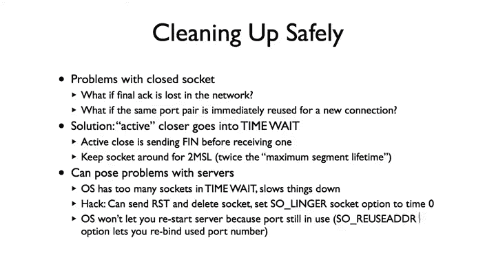

So here's a basic connection setup， S Sin act act， and then here's their teardown。

So because we are avoid our exchanging data， we have a big acknowledgeledment bit set。

 So here's the f。 Here's the initial f from my host when I close the connection。

 And so it sets the fin bit Act1， sequence number1， act1。Then the server in response is also closing。

 so it sends a fin sequence number one act to it。 it's acknowledging my fin。

And then my host responds with an a for that f sequence number 2， act 2。

 So here's a simple three way handshake for tearing down the connection， Fin。

Acknowledging some prior data。Acknowledging the fin， sending your own fin。

 and then acknowledging the fin。So now if we put all of this together。

You can see what the full TCP finance data machine looks like。

 and so this is something you're come across many， many times this is well established a finance data machine that really sort of lays the ground for how you want to set up reliable connections。

And so I'm going to walk through。 it looks pretty complicated when you foresee。

 but it's because there are a couple of cases。 and actually given we've presented before。

 it should all all be pretty simple。 So first， we're starting in the closed state。

 So this is when there are no connections open。 You know， I'm just sitting there。

 my applications not tried to open a connection。So then the first transition here。

To the listen state， this is the passive openers。 This is a server。

 server is listening for connection。 So you can see the action is listen。

 and there's no packets exchanged。If you close it， you then return to the closed state。

 So this if I'm listening for connections， I hear nothing or turn to the closed state。

The other transition of the close state is the active。O， so here's the connect。

 And connect causes a sin packet to be sent。 This is step 1 of the three way handshake。

 So you send a sin， and you're now in the sin send state， S scent state。 This is the active side。

 These red lines are showing the active opener of the three way connection。 So sin sent。

Then if you receive a sin and act says the stage 2， you send an act。

 and now the connection is established。So this path here。This is the active opener。

Now let's watch the passive opener So the passive opener is in the listen state。

And it receives a sin from an active opener。 In response， it sends a sin act。

 enters the S receive state。Then if it receives an acknowledgeknowment for its sin as is stage  three of the three way handshake。

 it's the reflection of this step here， then the connection has been established。Now。

 if you're in the listen state。It's possible that you can also call send to then result in sending a send message。

 or you can also in that way， you're then going to。

 even though you're in the listen state and you can actively open and act in an open state。

So now there's one more path here， which I mentioned the four way simultaneous open。Which is this。

And so this is when both sides have sent sin towards looking at one side of the connection。

And in response to a sin， you get a sin from the other side。 And so this is the two sins crossing。

 So in response， you send sin plus act sin received， Then you act。 And there's the four messages。

 Each has sent a sin。 Each is received a sin。嗯。And then received a S， a send a synac。

 and there's an act and data exchange can occur。 And so now we're in the established state。 Now。

 of course， you can always transition now with like to closes and resets。 But so now at this point。

 we've gone through connectional establishment。Now we're going to go into connection teardown。

And so there are two cases here。One is that if we're the active closer here， we call close。

 that results in a thin message being sent， a thin packet with a thin bit。

 We now enter a thin weight1。The other is， if we receive a fin， then we acknowledge it。

 And we're now in the passive clothes state where the other side is closed。 And then we call。

 when we actually call clothes， we'll send fin， send the less act and be closed。 And so here。

 close weight is we are still allowed to send data， right until we call closed。

 This is the other side is closed， but we haven't。So now when close is called。

 we're in the fin one state， and there are a bunch of transitions out of that。

 One is that we receive a fin。 So we've sent a fin， we received a fence。

 This is the example I showed with the TCP teardown。 So we've sent a fin。 we receive a fin。

 we acknowledge that we're now in the closing state。 we then transition to time weight。

Another is that we receive a thin plus an act， so we can just acknowledge that and enter timely。

The final one is that we receive an act。But no f。 So this is。

 we have closed our side of the connection。 The other side hasn't。 And so sort of the。

This state here is correlated with this state here。 Then when we do receive the fin。

 we acknowledge it enter the time weight state， and then we have the time up before we can actually close and recover the state。

So you can ask what's the difference between this transition to closing and time weight。

 The reason is that this transition to closing is when the two fins pass each other。 So I send a fin。

 the other side f sends me a fin but hasn't acknowledged my fin。

 This is the difference between fin s a and fin plus a slash act。

 And so then I wait for that fin to be acknowledged and then transition to time weight。

Since the full TP finite state machine， it looks really complicated。 me does have 1，2，3，4，5，6，7，8，9。

10，11，12 states。But when you realize it breaks in these two parts， connection establishment。

 connection tear down， and really there's just a bunch of different possible ways the fins can be exchanged。

 it's actually not that complicated。And so I encourage you to open up Wiresha and just open up a couple of web connections just see what's happening with your TCP connections。

 and you'll be able to see how those different connections are traversing this finite state machine。

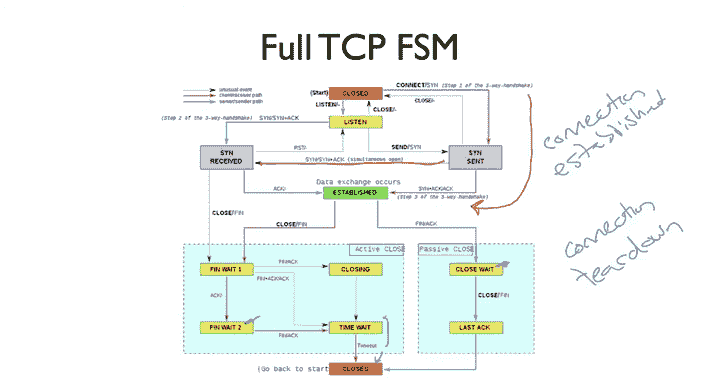