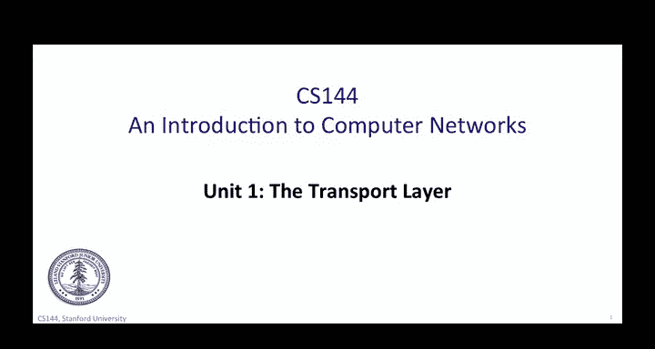
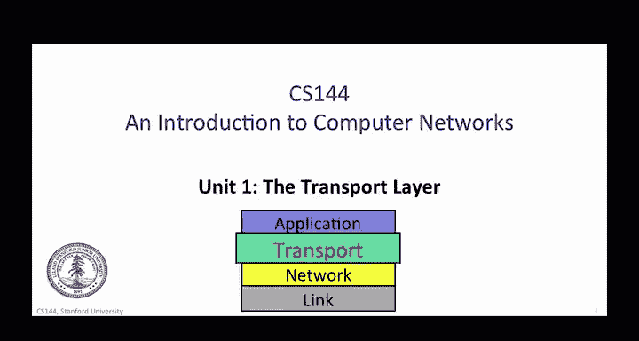
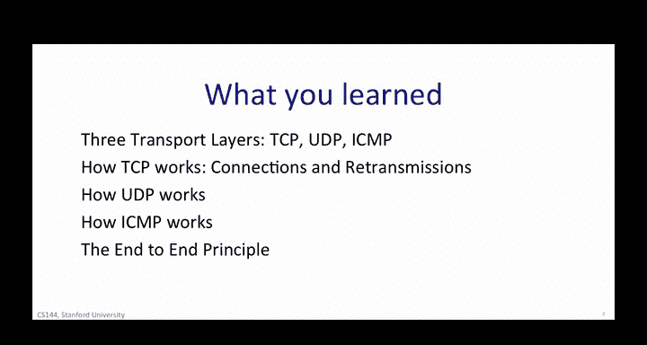
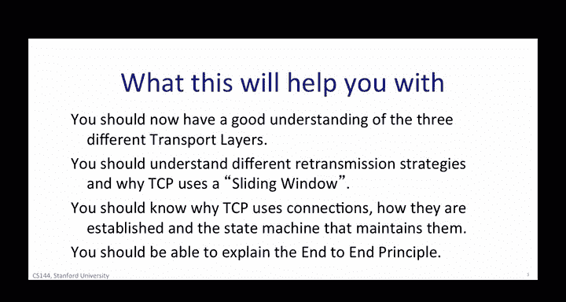

# 斯坦福大学《计算机网络｜Introduction to Computer Networking CS 144 2018》中英字幕deepseek - P38：-038-Transport recap 64.zh_en - GPT中英字幕课程资源 - BV1bVqNYFEGg

In this unit you learned about the transport layer。

 specifically you learned about the three most important transport layers in use today。

 the first TCP or the transmission control protocol is used by over 95% of internet applications。

TCP is almost universally used because it provides the reliable end to end bidirectional by stream service that almost all applications desire。

Most of the videos in this unit were about TCP。 You learned how we detect that a packet was not delivered or was corrupted along the way。

 and you learned about the mechanisms TCP uses to successfully retransmit data until it's correctly delivered。

We spent three videos exploring different methods for reliably delivering data across the unreliable internet。

The second transport layer we studied is UDP or the user Datatagram protocol。

UDP is used by applications that don't need the guaranteed delivery service of TCP。

 either because the application handles retransmissions in its own private way or because the application just doesn't need the reliable delivery。

All UDP does is take application data and create a UDP datagram。

The UDB datagram identifies the application that the data should be sent to at the other end。

 that's about it。Although very few applications use UDP， we saw examples of DNS and DHTP。

 which are both simple request response query protocols。

The third transport layer we started is ICMP or the Internet control message protocol ICMP's main job is to send feedback if things are going wrong。

For example， if a router receives an IP datagram but doesn't know where to send it next。

 then it sends an ICMP message back to the source to let it know。

ICMP is very useful for understanding why end to end communications are not working properly。Finally。

 you learned about one of the most important overarching architectural principles that guided the design of the Internet and continues to guide our thinking today day。

 It's called the end to end principle。 We learned about two versions of the end to end principle。

 The milder version says that there are some functions that can only be correctly implemented at the edges or fringe of the network。

These clearly need to be implemented there。En to N reliable file transfer and security are two examples that we saw。

 it's okay to help these features by adding functions to the network。

 but these can only help not replace the end to N functionality。

The second stronger version of the end to end principles says that if we can implement a function at the end hosts。

 then we should。 The basic idea is that networks should be kept simple。

 streamlined with as few features to go wrong， to slow things down or require upgrading。

 It assumes that the end hosts are quite intelligence such as a laptop or a smartphone and can implement many of the features needed by the application。

In this unit， you studied five main topics。1。Three widely used transport layers TC for reliable delivery of a byte stream between applications。

 UDP as an unreliable delivery of datagrams between applications。

 and ICMP is a way to detect when things go wrong。Two。

 how TCP works with a particular emphasis on how it reliably delivers bytes between two applications。

 you learned how data errors and missing packets are detected and how packets are retransmitted as well as several different retransmission strategies。

 including selectiveive repeatat and Go back N。You learned about how the basic TCP mechanism is to go back in and keeps track of the outstanding unacknowledged bytes using a sliding window you also learned about the TCP state machine that keeps track of the current status of the TCP connection。

Three， you learned how UDP works and why it's used by a small number of applications。4。

He learned how ICMP works and how it helps us detect when communications go wrong to monitor the performance of a route between two end hosts。

Finally， you learned about the end to end principle。

 which is an important overarching principle used in the design of the internet and many other communication systems throughout this class。

 and after you go out into the world to use your networking expertise。

 you'll find many people talking about this principle to help guide their design decisions。

So you should now have a good understanding of three transport layers。

 you should understand different retransmission strategies and why TCP uses a sliding window。

You should know why TCP uses connections， how they are established and the finite state machine that maintains them。

 and finally， you should be able to explain the end to end principle。

