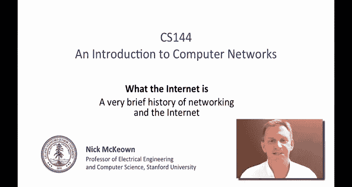
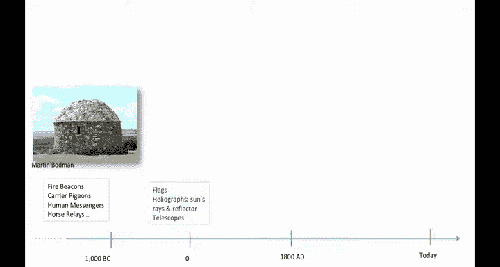
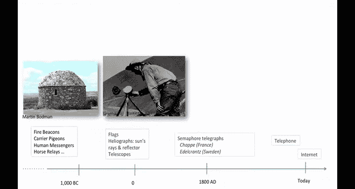
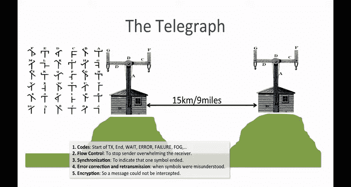
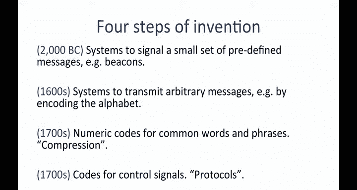
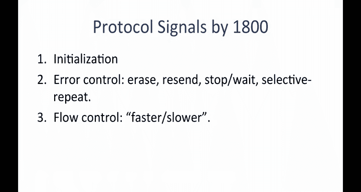
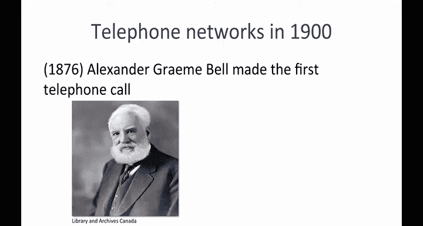
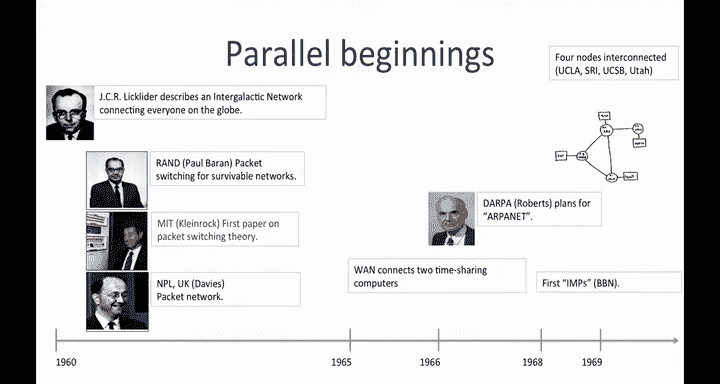
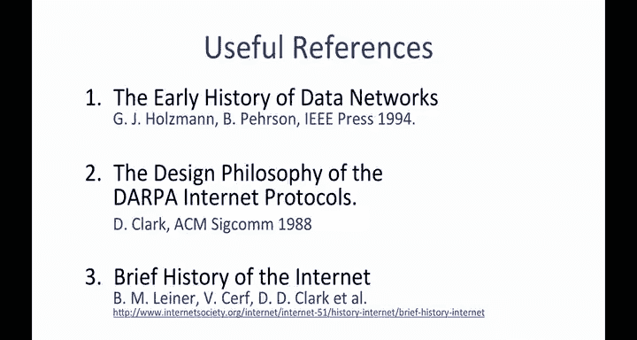

# 斯坦福大学《计算机网络｜Introduction to Computer Networking CS 144 2018》中英字幕deepseek - P41：-041-The History of Networks;.zh_en - GPT中英字幕课程资源 - BV1bVqNYFEGg

You will have heard many times that the internet has transformed society in ways not seen since the invention of the printing press。

In this video， I'm going to give you a brief background on the history of networking leading up to the invention of the internet in the 1960s。

😊。

Let's start with a brief history of how messages were communicated over long distances。

Well today day， we think nothing of sending an email to the other side of the world。3000 years ago。

 it was very hard to communicate over long distances at all。

The first recorded long distance communications are from about a000 BC and were mostly put in place for military offense and defensive purposes。

Fire beacons were used to signal the arrival of an enemy or to synchronize an attack。

 This is an example of a fire beacon in the south of England。Fire beacons carry information fast。

 They work particularly well at night when danger is greatest。

 but they carry very little information。 General， they are on or off， signaling danger。

Carrier pigeons， human messengers， and horse relays have been used around the world for thousands of years because they can carry more information。

But the information travels more slowly than a fire beacon and messengers are prone to interception along the way。

 The message could be read， tampered with or blocked completely。

The earliest recorded relay systems were horses in Egypt and China2 or 3000 years ago。

 They were common throughout history。 In the 13th century。

 Marco Polo described how the great Mongol ruler Kublahan used horse relays。

 His army had relay stations every 40 kilometre with 400 horses waiting for relay riders。

Horse raillays were used all the way up to the 19th century for mail delivery in the famous Pony Express across the USA。

These early systems were limited in the information they could carry or by the speed of delivery such as horses。

 humans and pigeons。Around 2000 years ago， optical methods started to be used such as flags and heliographs。

 which encoded digital information such as letters， words and numbers。

These systems transmit data at the speed of light over limited distances with limited information they're basically simple encodings。

But perhaps the biggest advances in optical communications happened in France around the time of the French Revolution in 1793。

 when Clalaude Shap invented and started building a Semaphore telegraph network。

Claudeshop built towers with a large horizontal beam called the regulator with two smaller arms called indicators。

It looked like a human being giving different signals with their arms。

 The location of the arms indicated a symbol。In 1793。

 the French government built 15 stations to cover 190 kilometers or about 13 to 15 kilometers per station。

By 1804， a 370 kilom network stretched from Paris to Djon。

The system was used to send a variety of messages， including military information and fast breaking news。

Most went towards Paris to report information from the provinces。

The operators became quite skilled that fastest messages could be signaled by one station every 10 to 20 seconds and could cross France in less than 30 minutes。

They could send about 3，000 signs per day corresponding to a few hundred messages。

To make function the network function properly， the optical telegraph systems in France and Sweden developed a number of concepts that are used in networks to this day。

 they needed to develop five concepts in particular。The first were codes。

 These are symbols to indicate characters and control signals like start of transmission。

 end of transmission， weight or conflict。 When two signals arrived at the same time。

 error to cancel the last code， Priity between conflicting messages。

 failure of a tower and acknowledgecledment。And even rain or fog to say。

 we couldn't even see the signal that you sent。The second with flow control。

This stops the sender from overwhelming the receiver。 Basically。

 the receiver tells the sender to slow down because it can't keep up。

 Third was synchronization to tell when one symbol ended and the next one started。

 This helps delineate words made up of several symbols。

The fourth concept was error correction and retransmission to tell the sender when symbols were misunderstood。

 This allows the sender to try sending the symbols again。Finally。

 they even used encryption so that messages could not be intercepted。

 They were particularly worried about news of the stock market eating the newspapers。

By 1830， the Shap opticalical Telegraph network was very extensive covering most of France。

We can characterize four main steps of invention in communication networks up until about the 1700s First from about 2000 BC。

 humans used systems to signal a small set of predefined messages， for example， using fire beacons。

Second， starting in the 1600s， people developed systems to transmit arbitrary messages by encoding the entire alphabet。

By the early 1700s， numeric codes started to be used for common words and phrases。

This was the earliest form of compression because it required less information to be sent over the link。

During the 1700s， codes were developed for control signals。

They could communicate when to start and stop sending， when to slow down。

 how to retransmit and so on。 This was the birth of what we call to day protocols。

 The agreed upon rules governing how two or more parties communicate。

By 1800， there were a number of different optical telegraph systems developed across and developed and deployed across Europe。

 using a variety of different protocol signals， such as these initialization to indicate we're about to start communicating。

 error control， array， resend， stop， weight， selective， repeat。

 These are used to retransmit data that is corrupted along the way。

 as you are already seen in videos about different retransmission strategies。And flow control faster。

 slower to tell the sender we can or can't keep up。

Clearly， there was an enormous step forward in communications when the telephone was invented at the end of the 19th century。

For some time， there had been many attempts to increase the capacity of the electrical telegraph network that now connected many towns across the United States。

 Alexander Graham Bell， shown here， a Scottish born inventor。

 transmitted the first voice call in 1876 in the very celebrated phone call to his colleague。

 Thomas Watson。😊，While his patent was challenged many times。

 most notably by fellow inventor Alicia Gray， the patent stood up to legal challenges and we generally attribute the invention the bell。

Within 10 years， over 150，000 people owned telephones and by 1915。

 the first transcontinental phone call was made from New York to San Francisco。

The series of events and inventions that eventually LED to the Internet started in earnest in about 1960。

In 1962， JCR Lilider at MIT started to write memos and give talks about his concepts of an intergalactic network。

 in which everyone on the globe is interconnected and can access programs and data at any site from anywhere。

He talked of being able to communicate with his own endgalactic network of researchers across the country。

This is widely thought to be the first recorded description of the social interactions that could be enabled by a large communication network。

 very much like the Internet of today。 Lilada became the first head of the computer research programme at DARPA。

 the Defense Advanced Research projectss Agency from 1962。While at DARPA， he convinced I Sutherland。

 Bob Taylor and MIT researcher Larry Roberts of the importance of his new networking concept and they took up the mantle when they succeeded him at DARPA。

In 1964， researcher Paul Barron wrote what is now considered the first academic paper about large scale communication networks。

 The paper isn entitled on Data communicationic Networks。At about the same time。

 Leonard Kleinrock's thesis was published onqueuing theory。

 Donald Davis was working on very similar ideas at the National Physical Laboratory in the UK。

In 1965， working with Thomas Merrill， Larry Roberts connected the T X2 computer in Massachusetts to the Q 32 in California with a low speed dial telephone line。

 creating the first wide area computer network ever built。

Larry Roberts joined DARPA in 1966 to help develop the first Abant plans。

 which were published in 1967。In 1969， the first four nodes were installed at UCLA， SRI， UCSB。

 and University of Utah， and the very first messages sent over the Apanet。

This is what the internet looked like in 1969， it was called the Apanet and was a single closed proprietary network。

By the early 1970s， a number of different packets which data networks started to appear。In 1971。

 the first packet radio network was built between the Hawaiian Islands， and it was called a Lohanet。

The mechanisms developed for the Aloha protocolcol have influenced pretty much every wireless network ever since。

Also， in 1971， the Sglades Research network was built in France。

It was the first to give the end hosts the responsibility for reliable communications and heavily influenced the design of the internet。

In 1974， IBM introduced an entire data network stack called SNA。

 which stands for Systems Network Architecture， its goal was to reduce the cost of building large time sharedd computers with many teletype terminals rather than batch processing with punch cards。

down。Sponsored work on internetneting to create the first network of networks to connect together networks around the world。

The protocols needed for interneting were first described by Vinturf from Stanford and Bob Khan from DARPA in a now famous paper in 1974 with a title。

 a Pro for packetet Network in communicationation。TCP called for reliable in sequence delivery of data and included much of what we call today the network layerer as well。

 In the early days， there was no notion of congestion control。

 It was added to the Internet about 15 years later。By the end of the 1970s。

 TCP and IP were separated， making room for UDP to be added as an unreliable transport service as well。

 originally for Packized Vo。At the time， Vinceurf was an assistant professor here at Stanford。

In fact， the paper that they wrote was written at the Gabania Hotel on El Camminino in Palo Alto。

He moved to DARPpa in 1976 to help shepherd the new Internet project。

 He's now the chief Internet evangelist at Google。 Bobbcalm was already at DApa when the paper was written together。

 they considered the fathers of the modern Internet。In 1983。

 TCPN IP was first deployed across the internet in a flag day。

 which means when everyone upgraded and used the new protocols at the same time。By 1986。

NSFnet was created by the US National Science Foundation to interconnect supercomputers at universities across the US using links running at a blazing speed of 56 kiloB per second。

 Other small networks started pop up all over the place， connecting to the Internet。😊。

By the end of the 1980s， there were about 100，000 connected hosts。😊，And then around 1990。

 Tim Burner's Lee at Cern invented the World W Web with the first browsers appearing in 1993。

 most notably the mosaic browser written by Mark Andreen。

I can still remember the day I first saw a web browser in 1993 when I was a graduate student。

 we knew immediately it would change everything。But we didn't realize how huge that change would be。

For many people， this is the dawning of the Internet。 although， of course。

 we will know it goes back much further than that than the World wide Web。 But within a year。

 over a million people around the world were using the web。And before the end of the 1990s， Yahoo。

 Google， Amazon， ebay were all household names。If you'd like to learn more about the early days of networking and the internet。

 here are three excellent references that I really enjoy。

 I'd highly recommend you read them to learn more about what LED to an amazing transformation of modern society。

😊。

