# 斯坦福大学《计算机网络｜Introduction to Computer Networking CS 144 2018》中英字幕deepseek - P42：-042-Packet Switching   Princi.zh_en - GPT中英字幕课程资源 - BV1bVqNYFEGg

嗯。In this video， I'm going to tell you about what packet switching is and why packet switching is used in the internet。

Packet switching was first described by Paul Baron in the early 1960s。

It describes the way in which packets of information are routed one by one across the internet to their destination。

 just like letters are delivered by the post office。

Packet switching is really important for us to understand because when we choose to use packet switching。

 it dictates many of the properties of the network。

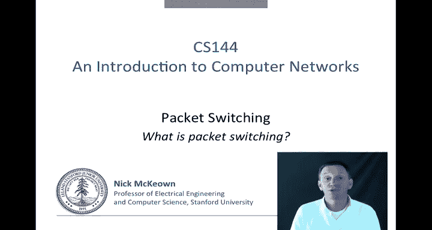

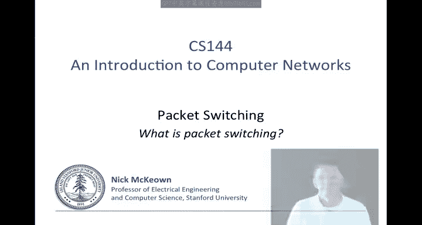

Today I'm going to describe what packet switching is and why it was chosen for the internet。

But first。To set some context， I'm going to tell you about a predecessor of packet switching that was called circuit switching and we're all very familiar with circuit switching because it's what's used in the telephone network。

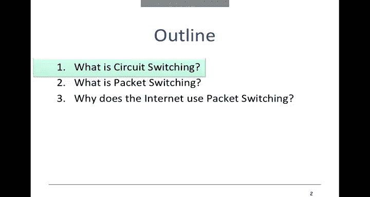

So the most common use of circuit switching is in the telephone。

 the traditional wired telephone network， and we're going to walk through what happens when we place a phone call from the phone on the left to the one on the right。

Now in the picture I've got here， it shows the telephones being connected by a dedicated wire and that wouldn't make for a very interesting telephone system we can only talk to one other person。

 but so in practice the telephones are connected together through a dedicated wire down to a switching center。

So in the early days of telephony， back in the 1880s or so。

 the dedicated wire went to a switchboard operator and the switch board operator was a room full of people who would take a dedicated wire from the input and connect it to the dedicated wire to the phone that you were connecting to。

So it was all manually connected and the main point here is that the wire is dedicated for the phone conversation from the start to the end of the phone call。

Now Maggieggs， of course， we don't have room full of switchboard operators and these instead we use automatic circuit switches that set up the circuit for us from one phone to our friend's phone at the other end。

So it helps to think of a phone call having three phases。First， we pick up the handset。

And dial the number and dialing the number is saying， where do we want to be connected to。

 and this creates a dedicated circuit from one end to the other。

So that dedicated circuit is going to go through all of the circuits along the way and the system has told each of the circuits to connect an incoming wire to an outing wire or an incoming circuit to an outing circuit。

So each switch is going to maintain the state to map that incoming circuit to the correct outgoing circuit。

And then in the second phase， we talk。In a digital phone system， like most phone systems are today。

 are voices sampled and digitized at the first switch。

And then it send over the dedicated circuit as a typically a 64 kilobit per second channel for voice。

So our phone conversation has a dedicated circuit or channel all the way along the path。

 and the circuit is not shared with anyone else。And then finally， when we hang up。

 the circuit has to be removed and any state in the switches along the path has to be removed as well。

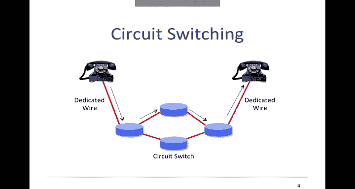

So in practice between the switches。There are trunk lines which are really， really fast。

 In other words， they have a very high data rate。Even the slow ones run at 2 and a half gigabbits per second。

 and the fastest ones to day run at 40 or even 100 gigabbits per second。

Sometimes you'll hear people call these big trunk lines big fat pipes because of the volume of data they can send。

But actually， these big fat pipes are really tiny， skinny little optical fibres thinner than one of your hairs。

Many thousands of phone calls can share that same trunk line between citiesters。

 each in its own dedicated circuit。The key thing here to remember is every phone call has its own dedicated 64 kilo per second circuit that it doesn't have to share with anybody else。

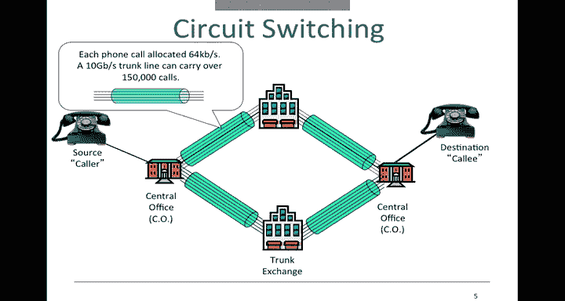

So in summary， we can think of circuit switching as having the following characteristics。

Each call has its own private， guaranteed isolated data rate from end。Second。

 the call has three phases， establish， communicate and close。And third。Originally。

 a circuit was an end to end physical wire， but nowadays， it's made up of a virtual private wire。

 It's going to share that wire with others， but it has its own dedicated circuit within that wire。

There are a few problems with circuit switching，Clearly it's worked very well for the phone system。

 but when we're thinking about using circuit switching for the internet or any computer communications。

There are a few shortcomings that we need to consider。

 so I'm going to go through three main problems。

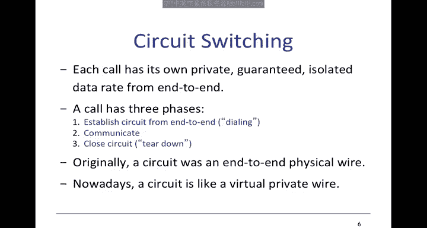

The first one is it's inefficient。When computers communicate， they tend to be very bursty。

We tend to send data in。Bsts of of maybe a few seconds， a few packets， maybe even a few minutes。

 depending on the application that we're running。 For example， if I'm typing over an SSH connection。

 then I'm going to have characters that I'm going to send every now and again。

 sometimes a flurry of characters as I type a word and then long periods of silence in between。

 Or if I'm reading a sequence of web pages， I might have a burst as I fill up one page or burst as I fill up the figures to populate that page。

 and then a little period of pauses while I read those web pages。 So it tends to be very bursty。

And of course， during those times of silence， when I'm not doing anything， there's no activity。

 I've got this dedicated circuit which nobody else can use， so it's very inefficient。

 very inefficient use of the capacity of the network as a whole。

The second thing is computers tend to have very diverse applications that need very different rates。

Commuters communicate at many， many different rates。 so a web server might be streaming video at say。

 1，5 or even 6 megabits per second。And if you compare that with me typing one character every second。

 there's a huge difference in the rates that the network needs to support。

So if we pick a fixed rate circuit。For the video。 and then I use it for typing。

 itll be barely used or vice versa。 Then I wouldn't even be able to stream the video。

 So a fixed rate circuit really isn't much use at all。

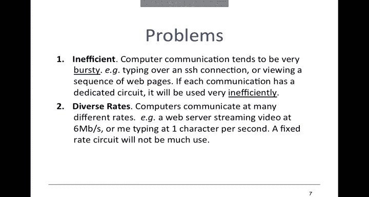

The third one， the third problem with circuit switching is all of the state that we need to maintain。

 we need to maintain some state for every phone call that's going on every time we've established a call。

 we need to set up the circuit mapping from the ingress to the eGgress of every switch along the way。

If a circuit fails or a switch fails or a link fails。

 we need to go in and change all of that state in order to reroute the reroute the callss。

 So we have to manage it。 And then at the end， we need to remember to take the state out。

 If anything fails， then we may find that the state becomes inconsistent， and then we have a problem。

 So state management in circuit switches is is considered a problem。

 And if we had thousands or hundreds of thousands of communications going on at the same time。

 That's just a lot of work that has to be done。So let's take a look at the packet switching in contrast to circuit switching。

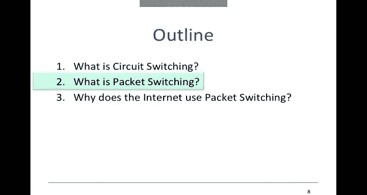

So again， we're going to look at two n systems communicating this in this case。

 we're going to look at this laptop on the left a， and it's going to be talking to the server on the right B。

In practice， these of course， could be anywhere in the internet。To impact switching。

 there's no dedicated circuit to carry our data。Instead， we just send when we're ready。

 and anytime you want， we send a block of data by adding a header to it。

 that's what we call the packet。And the header contains the address of where the packet is going。

 just like an envelope tells the post office where to send the letter。

Packet Sw network consists of the end hosts， the links， and packet switches。When we send a packet。

Its routed one hop at a time。From the source， in this case， the laptop A。

All the way through to the destination B。 if you look at the packet， it has the data in it。

 and it also has the address B of where it's going to。

 We'll see later that packets are a little bit more complicated than this。

 But this is the bare information， the minimum information that it needs。

 the data we want to get to be。 and then the address B of where it's going to。

So when we send the packet， it's going to be routed hop by hop from the source to the destination。

Each packet switch along the way is going to look up the address in a forwarding table。

 so it keeps a local forwarding table in all of the packet switches and here I've got a forwarding table saying if we see the address B。

Then we're going to send it to on the next top to S 2。And this is S2 over over here。Okay。

 so once this switch， S1 sees this packet。It's going to look it up in its table and send it along to switch S2。

this is it going along its way， Sw S2 will have its own table and of course that table is going to be different from S1s because it's going to have a different set of next hops for each of the addresses that it sees。

So then it's going to send it along its way this time to S 4 and then eventually to the correct destination。

So in the internet， there's lots of different types of packet switch。

Some of them are called routers because they deal with addresses that are internet addresses。

 and they may include little routers that we have in our desks on our desks at home or huge routers that are in big wiring closets and big switching centres。

 But we call those routers。 There are also things called ethernet switches。

 And we're going to look at the difference between different types of packet switch in a later lecture。

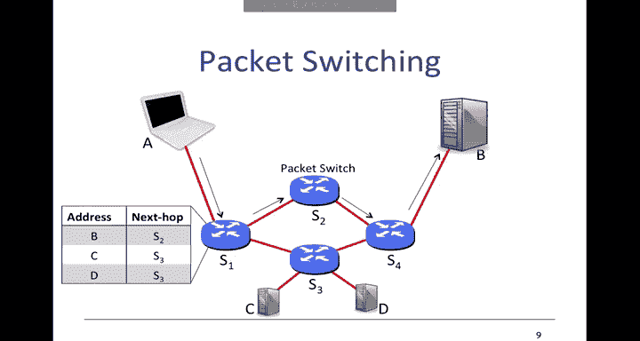

I showed you one packet， and of course。At any instance。

 there's going to be many packets flowing across the internet。

 millions and millions of packets flowing and all sorts of different and they're all being routed hop by hop one at a time by by the packet switches along the path。

 So there'll be many flows of communication going in all sorts of directions at the same time。

 So these packet switches have a lot of work to do And remember they're routing each packet one at a time by picking the next hop that it goes to and sending it on its way。

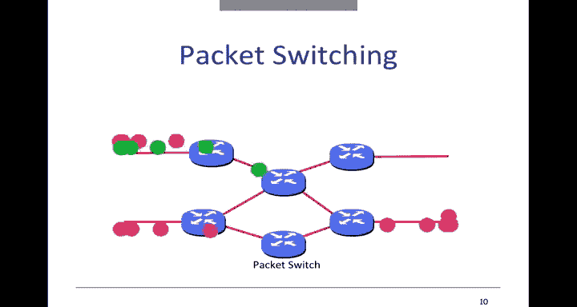

We're going to take a quick look inside packet switches at some of their relevant features。

 so I already told you that packet switches have a forwarding table to tell it where the packet goes next。

They also have to have buffers。So packet switches have buffers。 And let me explain why that is。

 So in the middle here， we've got a packet switch and this packet switch is going to be receiving these two packets。

 and I've got here and here。So we're going to look at what happens as these packets go through the packet switch。

If they both arrive at the same time。And let's say they're arriving at the full line rate of the outgoing link。

Then the packet switch has to hold one of them。While it sends the other。

 can't send them both at the same time， so it's going to send one at a time。

And because it might have many incoming links， the packets。

 which has to have a buffer to hold perhaps many， many packets。

 And we're going to see that these packets， these buffers can be quite large in practice。

So the buffers whole packets， when two or more packets arrive at the same time。

 and particularly during periods of congestion， when there's lots and lots of packets coming in and all of these input links all trying to get to the same output。

 it may actually have quite big buffers to whole packets during those times of congestion。

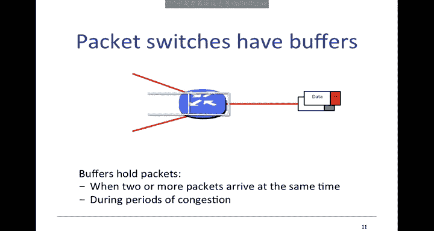

So in summary， packets are routed individually by looking up the address in the router's local forwarding table。

All packets share the full capacity of a link。And third。

 the routers maintained no per communication state。And this is really quite key in a circuit switch。

 Remember， we need to maintain state associated with every circuit along the every every circuit we're maintaining here we note we maintain none。

We just maintain the forwarding table。And that there's no per communication。

 no per packet or no per flow state associated with that communication。

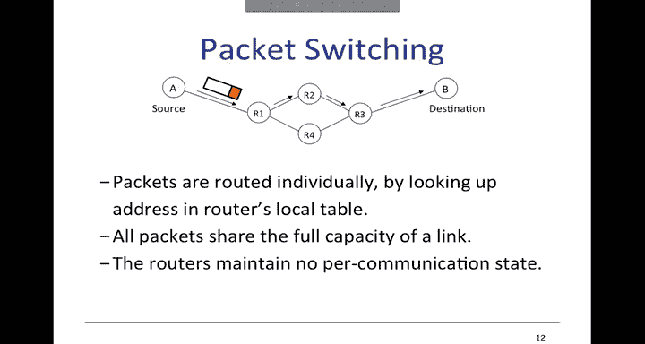

So why does the internet use packet switching Probably pretty obvious by now。

 but I really wanted to spell that out There were three original reasons too that I've got listed here that the internet used packet switching。

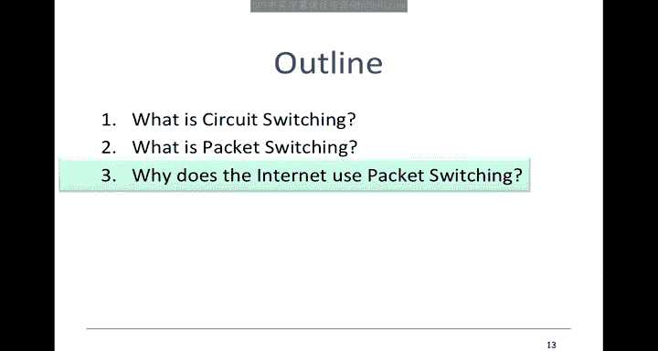

The first two were very very obvious and come from what I've just what I've just described。

 The first one is packet switching allows us to use expensive links efficiently。

So efficient use of expensive links links were assumed to be expensive and scarce。

 the first links that interconnected the packet switches across the backbone of the internet were running at a few kilobits per second。

 so they were expensive and everybody knew that would become they would be a scarce resort。

Resource packet switching allows many， many bursty flows to share that those same links very efficiently。

Because at any one instant， a packet can use the entire link。

 but it can be immediately followed by another packet using the entire link belonging to a different communication。

So it was a famous textbook by Patskers and Gaag had said。

 circuitcuit switching is rarely used for data networks because of very inefficient use of the links。

So the second big reason for using packet switching was it's widely felt that the packet switching allows for more resilient networks。

 networks that are resilient to the failure of links and routers。

And the reason for this is that because each packet is individually routed along the path。

If something happens， if something breaks， a link breaks or a router breaks。Then we can。

 because we have no state in all of the switches for this particular flow。

 we can simply send the packet on a different path。

 we can send it over a different link to a different router and it will find its way eventually。

So for this reason， Tanebaum and another famous textbook had said for high reliability。

 the internet was to be a datagram subnet。 So if some lines and routers were destroyed。

 messages could easily be rerouted。And the third big reason that the Internet used packet switching was the Internet was originally designed as an interconnection of existing networks。

 And at that time， pretty much all。All widely used communication networks。

 all computer networks were packet switched。 And so if the internet was to interconnect all of those existing networks。

 then it too needed to be packet switched as well。 Okay。

 this is the end of the first video about packet switching。 By now。

 you should be able to answer these three questions very easily。In the next few videos。

 we're going to learn more about packet switching， some basic definitions。

 some ways to model packet switching and some properties of packet switching that have been developed over the years。

 See you soon。

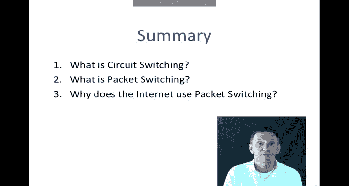