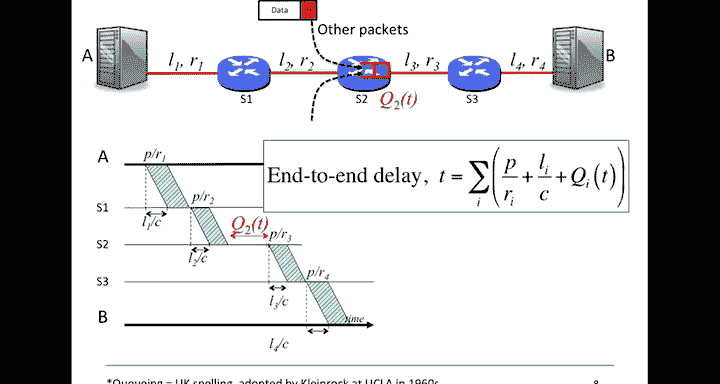
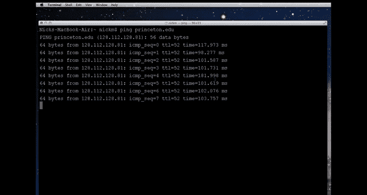
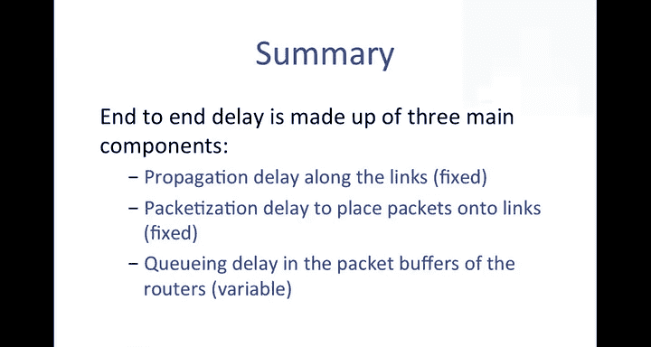

# 斯坦福大学《计算机网络｜Introduction to Computer Networking CS 144 2018》中英字幕deepseek - P43：-043-Packet Switching   Princi.zh_en - GPT中英字幕课程资源 - BV1bVqNYFEGg

In the first video on packet switching， I told you about what packet switching is and why it was used for the internet。

 packetet switching is going to feature very prominently throughout this course。

 so we're going to spend quite a bit of time on it and many of the properties of the internet followed directly from the choice of packet switching。

So in this video I'm going to give you some useful definitions for propagation delay and packetization delay and we're going to use those definitions to come up with an expression for the end to end delay of a packet across a network。

😊，I'm also going to tell you about queuing delay and how it makes the end to end delay unpredictable。

So， let's start with some useful definitions。We'll start with the definition of propagation delay。

So the propagation delay is the time that it takes a single bit of information to travel over a link at propagation speed C。

So look at the picture here and you'll see we have the computer on the left and we're going to consider the time that it takes for a bit to propagate from the one on the left to the one on the right that time the propagation delay or T sub L is simply L over C。

So the propagation delay is simply determined by how long the link is L in our case。

 and the speed that a bit travels， see。We use the variable C in most of the links we're interested in because C is or the speed of propagation is very close to the speed of light。

For example， in a， in a twisted pair of electrical cables。

 a bit propagates at about 70 per cent of the speed of light。 And then an optical fibre。

 the speed of propagation is a tiny bit slower。In most of our examples。

 we'll assume that the bit propagates at two times 10 to the eight meters per second。

 which is close enough。They go there's the bit going along the link， let's have a look at that again。

 so it's the speed at the or the time at which it takes to propagate over the link。So for example。

 if we were considering how long it would take a bit to travel a thousand kilometers or a million meters in an optical fibre。

 where the propagation speed was two times 10 to the8 meters per second，Well。

 T sub L is 1000 times 10 to the  three divided by 2 times 10 to the 8 or5 milliseconds。

In a little bit， we're going to look at some examples。

 and you're going to do some examples in the multiple choice exercises embedded in the video。

Notice that the propagation delay doesn't depend on the data rate of the link。

 Doesn't matter if the link is running at 1 kilo per second or or at 10 gig per second。

 The propagation delay is just a function of the speed of propagation of each bit and the length of the cable。

Another useful definition is the packetization delay。😊。

This is the time from when the first bit of a packet is put onto the link until the last bit is put onto the link。

 Let's take a look at an example here。So see that packet there going onto the link。

The time that it takes to put all of the bits under the link is going to be a function of the number of bits we're putting under the link。

And the distance between them or the number of bits per second that we can put on the link。

So essentially the data rate of a link is determined by how close together we can pack the bits。😊，If。

 for example， the link runss at one gigabit per second。

 we can put one bit onto the link every nine and asecond。

We'll see in a later video about physical links what actually limits the data rate of a link。

So the packetization delay is determined by how fast we can put bits on the link or the data rate are。

If a link runs at 1 kilobit per second， we can put1 thousand new bits onto the link every second。

 if it runs at 10 gigabbits per second， then we can put 10 billion bits onto the link every second。

They look at a couple of examples if we had a 64 byte packet that's 512 bit。 It would take 5。

12 microseconds to be transmitted onto 100 mebits per second link。

 Why is that Well T sub P equals P over R so P in our case is 64 times 8512 divided by R and R would be 100 times 10 to the6。

Another example。A kilobit packet takes 1。024 seconds to be transmitted onto a 1 kilobit per second link。

 So where did this 1。024 come from？Well， this is useful useful example here because the one kilobit per second sorry。

 the one kilobit packet that we see here。One kilobit。

 when we measuring a number of bits in a packet or in memory， one kilobit， as you know。

 is 1024 or  two to the power of 10。So that's why we have 1。

024 seconds in order to transmit it onto a 1 kiloB per second link。 So in this case。

 it's a little bit confusing。1 kilo B per second means 1000 B per second。

 whereas the 1 kilo B in the packet is 1024 B。 This is standard throughout networking and will see this happen over and over again。

So notice that the packetization delay。Is only a function of the length of the packet that's P here。

And the rate at which we can put bits onto the link or R bits per second makes no difference how long the link is or how fast bits propagate along it。

So next we're going to see how we can use our two different types of delay to determine the overall end to end delay。

That's the time it takes a packet to go across a network from the source to the destination。

So the end to end delay is the time from when we send the first bit。On the first link。

 that would be over here。Until the last bit of the packet arrives at the destination B。

So we can calculate the end to end delay by adding up the propagation and packetization delays on every link along the path。

That is， we can look at those numbers that we calculated before for how long it takes a packet from the first bit until first bit is sent until the last bit arrives on this link here。

And then we can add it to the time on here， on here， and on here。So。In our case。

 that's going to depend on the length of the first link and the rate at which it runs。

And then we can use our expressions to calculate the U end to end delay。

 and we're going to come up with an expression that looks like this， the end to end delay。

T equals the sum of the， first of all， the。Delay here， which is the packetization delay。

 the time that it takes to put the packet onto the link。

 and then the time it takes for one bit to propagate along that link。

So we're going to sum up all of those to get the end to end delay。

Let's look at this in in a little bit more example， because I think it'll become a bit clearer。

So in our example here， the packet is going to traverse four length。

So we're going to repeat the process on every link along the path and it's going to look something like this here。

 we're taking a closer look by stretching out the links and the switches and remove the rest of the network just to make a little bit clearer。

This here is a timeline。And this timeline。With time increasing from the left to the right。

 is is going to show how bits propagate and how the whole whole packet propagates from A over to B。

So the first bit is going to take。L1 over C。That's the length of that first length divided by the propagation speed。

 It's going to take that number of seconds to propagate from a to S1。

So here we can see the bit starting from here and then propagating along the link。

 L1 overse is the time， and this is it pre propagating the distance from a to S1。

After we sent the first bit。It's going to take P over R1。

Seconds until we can put the last bit of the packet under the link。So after P over R1。

 we've put the last bit under the link。And then at the time， L 1， C plus P over R 1。

 that last bit will arrive at switch S1。Okay， so at this point。

 by the time we get to this point here。The entire packet has arrived at S1。

So internet routers are what we call store and forward devices。What that means is that the switch S1。

Is going to wait until the whole packet arrives。Until it looks up the address and decides where to send it next。

It could instead start forwarding the packet after just seen the header and not wait for the whole packet to arrive。

 That's something we call cut through switching。 But internet routers generally don't do that in a later video。

 and in some of the exercises， we'll see examples of cut through packet switches。

 But getting back to our example， which is a store and forward network。

 where every switch is going to store and forward the packets。

Switch S1 is going to look at the packet after it's completely arrived and then it's going to send it on to the next link。

 it's going to send it on to S2 so here we can see that packet going on to S2。So just as before。

 it takes L2 over C for the first bit to arrive at S2。

 and then the last bit will arrive P over R 2 seconds later。

And we can just repeat this whole process for each of the links in turn until we get to B。

So the overall end to end delay expression is just the sum of those from end to end。

Which is the same expression we had before。Okay， so it turns out I've only told you part of the story。

Let me tell you the rest of the story， see the thing about packet switching is that your packets share the links with packets from other users。

When several packets show up at the same time wanting to go on the same link， you can see this here。

We've got packets coming from here， maybe from another link entering the packet switch and from here coming into the packet switch from another link。

 all wanting to go on this outgoing link from S2 to S3。When this happens。

 all of the packets are going to have to fight or contend for that outgoing link。

So when several packets show up at the same time wanting to go on the same link in this case。

 from S 2 to S3， then some of the packets have to wait in the routers queue and this little symbol here。

See this a little red symbol here is the picture that I'm going to draw for a queue。

Some people call it a packet buffer in general， let's say first come first serve queue in which the packets are going to depart in the same order that they arrive。

We're going to say that the link from S2 to S3 is congested because there are lots of packets queued waiting to travel along it。

The packet buffer helps prevent us from having to drop any packets。

 the bigger the buffer is the less likely we are to have to drop a packet that wants to travel across the link。

So these packet buffers。They're going to be in all of the switches。 Every packet switch has buffers。

 and they're fundamental to packet switching。If we didn't have packet buffers。

 then we'd lose a packet every time two packets showed up at the same time。

 wanting to travel across a link。So pack it by fi are our friends。

But the packet buffers themselves are going to change our expression for the end to end delay。

If our packet arrives。And the queue has some packets in it。

 then it's going to delay the time that it can be forwarded onto the next link because it can have a wait for the packets that are ahead of it to leave first before our packet gets to go。

So I've just shown this here as Q2 of T， meaning it's going over the link from S2。

 and I've said it's Q2 of T because it's going to vary with time。

 it's going to depend on how many other packets are showing up from other users。

So if there are three packets ahead of us， we'll have to wait for three packetization delays before it's our turn to go。

I've shown this just in one Q， of course this can be in all of the switches along the way。

 just makes the figure a bit more complicated， so I've just shown it in Q2。

So our end to end delay now has a third component to it。 It has in it。

 the packetization delay that we saw before。 that's P over R sub I。Then it has the。

Proropagation and delay over the link。And then it has this new expression， Q I of T。

 which is the delay of the packet in the queue waiting for other packets。

 And this could be 0 if there are no other packets， Of course。 But in general。

 it's going to be some non deterministic value because we don't know whoever else is sending packets at the same time。

So the most important thing to note here is everything is deterministic except thequeing delay。😊。

P over R sub I， L I overs。 They're both deterministic。 It's Q I of T， the queuing delay。

 that is the variable component。And to convince you that really in practice。

 there are there is variability I'm going to show you an example in a moment。 One last thing。

 So you may have noticed that that I use the British spelling forqueuing that's not because I'm English。

 but it's very common when talking about the internet to spellqueuing Q U E U E ING seems like too many vowels。

 I know， but this was the convention adopted by Kangro。

 one of the pioneers and inventors of the Internet back in the 1960s。

 but you'll see both the UK and the US spelling and that's just fine。So in summary。

 heres our overall expression for the end to end delay。

It's taking into consideration the queuing delay at each packet switch along the way。

 It's really important to remember that the queuing delay is unpredictable。

 It depends on the traffic sent by other users in the network。 As far as we're concerned。

 the queuing delay is a random variable。 It's the only random variable in our expression for end to end delay。

 Everything else is deterministic。So in case you don't believe me that the end to end delay is unpredictable。

 we're going to measure it。😊，I'm going to use a very widely used tool called Ping PING to measure the end to end delay between my computer and other computers in the internet。

Ping is going to measure this end to end delay， In fact， is' going to measure the round trip time。

 which is the end to end。 It's a sum of the end to end delay in both directions。

 You'll find the ping command on your computer and you can use it to repeat the measurements I'm about to do on your own computer。

 and it's kind of a fun thing to do。

We can measure the delay of packets across the internet using the ping command I'm going to show you an example of the Ping command right now。

 so I'm going to ping from my computer to Princeton。

edu Princeton is university in New Jersey in the United States it's about 400 kilometers or 2 and a half thousand0 miles from where I am。

And as I do this， you can see over on the right hand side。

 it's showing me the time that it takes for the packets that I send to go to Princeton and back again。

 so let's see if I can highlight these so if you see them like here these are the times of the packets to go there and back again。

So those numbers there are about 100 milliseconds corresponding to the time that it takes for a packet to go there and back or the round trip time。

 let's see how that compares say with by Ping to let's try the University of Shiinghua University in。

Beijing in China， so we're going to see that's a lot further away that's about 10。

000 kilometers away from me or about 6000 miles and you can see that the ping times are much greater so if I can just highlight those we can see those there more like 200 milliseconds。

So I use Ping to measure a few hundred RTT values from my computer at Stanford to Princeton。

 and as I said earlier it's about 4000 kilometers or 2 and a half thousand0 miles away。

The graph shows the CDF， that's the cumulative distribution function。For the values that I measured。

So。0%， this means that none of the values were below this value here。

 which is about 100 milliseconds。And 100 per cent of them were。Less than， let's say。

 300 milliseconds， a little hard to tell on this graph here。

So this shows the range and also the variation in the values that I measured。

 and the overall variance about variation is about 50 milliseconds。

And the 90% of the samples fell between 100 and 120 milliseconds。

Now let's look what happened when I repeated the experiment from Stanford to Tinghua University。

 which is in Beijing in China， it's a lot further away， it's about 10。

000 kilometre away or 6000 miles and as I would expect。

 the RTT values are much larger because the propagation delay is much higher。

But also notice that the R T T samples have much greater variance。 They vary by a lot more。

 Look at this value over here， these， this range of values。

 they're varying by a lot more than the ones over the shorter length from Stanford to Princeton。

So that variation here。Comes from the queuing delay。 My packets are encountering more cues。

More congestion， more other users， more other users traffic when they're going across the Pacific to to China。

My packets meet there， meet other packets in the route buffers along the way。

 and so they get held up。 They have to wait for longer。

 And I guess probably because there are more hops I more likely to encounter other people's packets along the way with a range of about 200 milliseconds。

 it's about 320 down here， and maybe they're going up to about 520 with a range of about 200 milliseconds。

 The queuing delay is making up almost half of the overall end end delay。 That's pretty high。

 In fact， that's kind of unusually high， which is why I showed you this as an example。

 just to get the point across。In summary， the end to end delay is determined by three components。

 The first is the propagation delay along the links。

 which are determined by the lengths of the lengths and the propagation speed。

 The second is the packetization delay， which is determined by the length of the packet and the data rate of each link。

 The third is the queuing delay， which is determined by the congestion and the queuing delay in the buffers and the routers along the path。

This is the end of the video on endoend delaylay in packet switching In the next video I will be explaining what some of the consequences are of this variable queuing delay。

 particularly on real time applications which frequently use playback puffs to absorb this variation。

