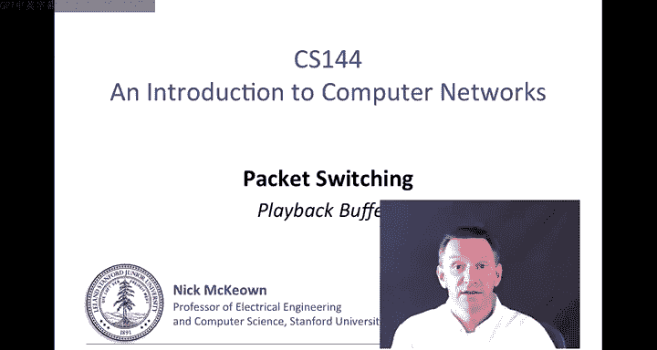
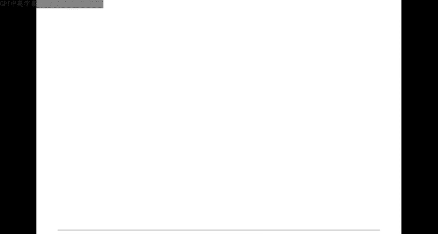
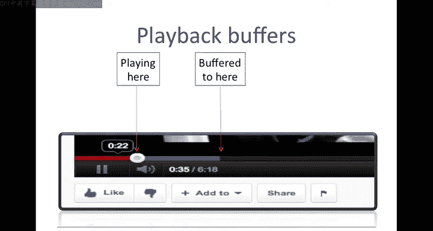
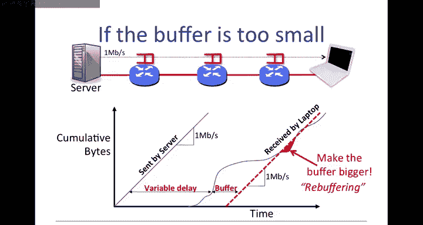
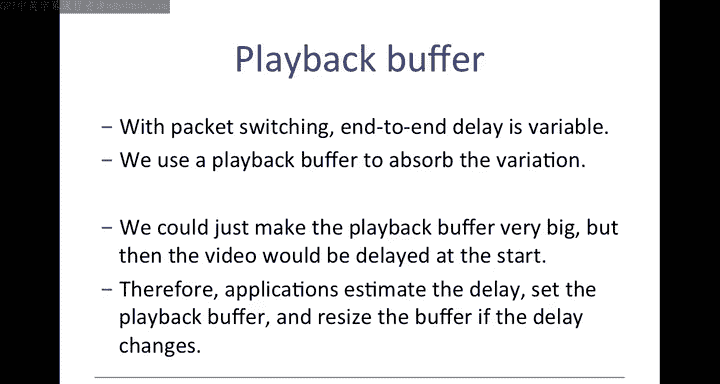
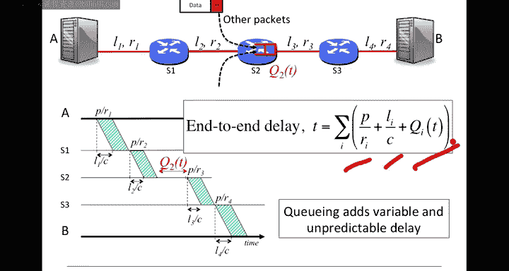
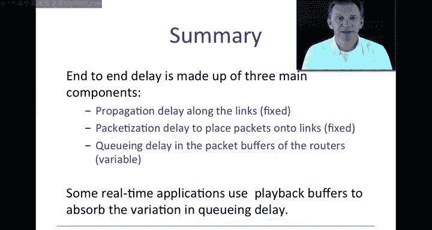

# 斯坦福大学《计算机网络｜Introduction to Computer Networking CS 144 2018》中英字幕deepseek - P44：-044-Packet Switching   Princi.zh_en - GPT中英字幕课程资源 - BV1bVqNYFEGg

By now you know how to calculate the end to end delay of the packet across a network and you know that the queuing delay makes the end to end delay variable。

Most of the applications that we use don't particularly care about this variability in end end delay。

 for example， when we're downloading a webpage or sending an email。

 we wanted to complete quickly but we don't particularly mind if individual packets take 10 or 12 milliseconds to reach the other end。

😊。

But there are some applications that really do care， they have to care about the queuing delay。

 particularly what we call real time applications like streaming video and voice。

So let's take a look at an example over the next few minutes I'm going to explain why queuing delay makes life hard for these applications。

 it serves as a good illustration of queuing delay and how we might mitigate the problem in practice。

Basically， because the applications don't know precisely when the packets are going to show up。

They can't be sure they will have a voice or video sample in time to deliver it to the user。

And so they build up a reserve of packets in something called the playback buffer。

So we're going to take a look at playback buffers。You've actually all seen a playback buffer before。

 this is a this is a little screenshot from the bottom of a YouTube client and the red line on the left over here。

This shows the video that we've already watched。This here is the point of playback。

 this dot shows where we've got to and this area over here。

Is this gray line shows the video that has been buffered。

Or the packets that have been buffered that have not yet been played back to the user。

 and this is the part that we're going to be interested in。 This here is the playback buffer。

So the client deliberately tries to build up that playback buffer to try and get ahead just in case some of the packets are delayed or they don't arrive in time and in case there's some kind of temporary outage。

So when designing the playback buffer， we have to think about how far ahead we want the buffer to get so if we were to build up the buffer all the way over here and build up more packets。

 then we've absorbed more data and we can write out more variability in the queing delay。

If we make it very short down here， if there's a big change or a big change in the queuing delay or a sudden increase in the queuing delay。

 we may run out of packets。Because they may not show up in time。

 so designing this playback buffer is pretty key to making this application work。

So how much we want to accumulate in the buffer will we start playing the back back the video to the user is key。

 So let's take a let's take a closer look at this。This is the point that we're playing。

This is the amount that we've buffered。

This is the contents of the plate my buffer。 if we look down into a little bit more detail。

 so we're going to take as an example this setup here。

So imagine we're watching a YouTube video on the laptop on the right， So we're over here。

And it's streaming video from the server， the YouTube server on the left over， over here。

So we're going to assume that the video is being streamed at one megabit per second。

Now this is just a made up number， there's all sorts of rates that it could be streamed out。

 this is just going to make it easy for us to think about。

And it's going to pass through several routers along the path， one， two。

 and three on the figure here， but it could be many more than that。

 be very common for our packets to go through 10 or 15 routers on the path from YouTube to our client。

And the thing that we're going to be concerned mostly most about is the。The queuing delay here。

 so there's three places where we can experience queuing delay and that variable queuing delay is going to mean that our packets show up at slightly unpredictable times。

So let's look at a graph of what this might look like。

This graph shows the cumulative number of bytes sent by the server over time as a function of time because it's sending at a fixed rate of one mebit per second。

It means that the line is straight， the cumulative number of bits or bytes that it sent as a function of time is a straight line。

 And so after one second it will have sent。I megabit a million bits。

 and after 10 seconds it will have sent 10 million bits。

Because of the variable queuing delay in the network。

 the cumulative arrivals at the laptop look a little bit different。 They might look like this。

So you see this why line that I've got here。 What does this mean It means that if we take the first bite here because they're all arriving in first come first serve order。

 we can just draw horizontally across here and see when a particular bite arrived so this one arrived here after that delay so the X axis is going to tell you how long that particular that particular bite took together notice I'm saying bits and bys it doesn't matter what our units are here。

So if we would take any point on here， let's say this particular this particular bite and we draw horizontally。

 I'm not regular throwing straight lines， but that's supposed to be horizontal and right here is the time at which that particular bite arrived at the laptop。

So you can see that the delay is measured by the horizontal distance， the horizontal distance here。

 and you can see that it's a variable number depending on the queuing delay encountered by each of the individual packets。

We can also see for at a given time。At a given time how big buffer the amount of buffering along the path。

 Basically， how many bytes are in the path from the server to the client。

 and that would be shown by the vertical distance here， because it says that at a particular time。

 this is the number that have been sent。 and this is the number that have been received。

 So we can tell quite a lot of information from this graph。

 And we're going to be seeing some more examples of this time of graph later。

 horizontalor access is the delay。 the vertical access it tells us how many bytes are buffered right now in the network。

Okay， so let's get back to our example。So the biggest component of the delay is the propagation and packetization layer。

 that's the fixed component。So we actually know quite a bit about the shape of this line。

So the the actual shape could look very different。 I just made up this shape。

 However we do know a couple of things first the overall end to end delay can't be less than the paization and propagation delay they're a lower bound so this has a lower bound in the horizontal distance between between the two here whoops。

It also has an upper bound。So the buffers in the routers， the packet buffers here。

 they're of finite size。 So there's a maximum delay that any packet can experience going through one of those buffers。

 So if we add up the maximum of each of these， add it to the packetization delay and the propagation delay。

 it's going to represent an upper bound。 So we have a lower bound and we have an upper bound。

But the upper bound is not very useful because it can be very， very large in practice。

 these routers may have half a second of buffering， so if we're going through many hops。

 it would mean a ridiculous difference between the lower bound and the upper bound。

 so that's of not much use to us。We also know that the cumulative arrivals on the right hand side are non decreasingecreing。

 in other words， this value is always increasing because it's the cumulative number of bytes and obviously we can't have a negative number of bytes show up。

Finally， one more thing that we know is because we know how fast or there is an upper bound on the rate of of that last link。

 it could be 100mbit per second link or a gigabit per second link。

 It tells us that the instantaneous arrival rate here。

 the gradient of this line here can't exceed the speed， the data rate of that link。Okay。

 so with all of those caveats。😊，Let's look at what the client actually needs to do to make all of this work。

So this red line here shows the playback rate of the video to the user。

So this what this tells us is that at this time here。

 it's playing back the first bite that was sent by the server。Which is， of course。

 the first bite received by the receiver。 So if at any point， we take a horizontal line across here。

It will tell us the time that a particular bite was sent， received and then played back。

What that means is that the horizontal distance here tells us。 So in， in， for example， in the。

The horizontal distance here tells us。How long a particular bite has been buffered。

So at any one time， we can tell how long it's sat in the playback buffer before it was played back to the receiver。

We also know how many bys there are in the playback buffer。

 It's the vertical distance here at any one time。 It tells us what the occupancy of the playback buffer is。

 So we can see that the playback buffer was very small to start with。 it accumulates， It accumulates。

 It accumulates， It to a very large value here。 It then gets smaller。

 as we fall behind as we fall behind， fall behind， fall behind almost goes empty here。

 We're very lucky that there must have been some bys that showed up late。 We just avoided。

Under runningning the buffer。 and then at some time we build up a little bit more。

 etca as we go up here。Okay so we're playing back at a constant1 megabits per second。

 that's what's being played back to the user So this is a good example。 we picked the right value。

 we waited long enough， we build up enough buffer， Everything worked out fine in the end。

So if we take a look inside inside the client， it looks roughly like this。

 so the playback buffer is a buffer held in the memory of the client。

 the client is picking the playback point that's this here。

 this is the point at which that it's reached and that's that dot that we see on the YouTube client after the bytes have been taken out of the playback buffer they' put into a video decoder to turn them back into video and then played out on the screen。

Okay， lets look at an example of when things don't quite work out fine。 So the same example again。

 bytes sent by the server on the left received by the laptop on the right。

 but in this particular case we didn't wait long enough before playing out the first byte。

You can see that here we've waited a little less time from when the first bite was received until we play out that first bite。

And of course， once we start playing out the bites， we're committed。

 we've got to play them out at1 megabit per second。

 otherwise we can't keep putting the video on the screen。So on this particular case here。

 everything looks fine to start with， the buffer has a nice occupancy， nice occupancy。

 nice occupancy， it gets smaller and smaller and smaller until eventually at this point here we have a problem。

The buffalo is empty， which means we've got no no bytes to decode and put onto the screen。

 so all of this area here is a time in which we're in deficit。This is not good。

 What does the client do Well we've all seen this before。

 it has to make the buffer bigger and it does this by rebuffing， by freezing the screen。

 waiting for some bites to accumulate and so that it can continue。

Okay so if you've been watching a video over this particular video right now over a slow link or if you're a long way away and you have your packets are going through many routers。

 you might experience a re buffering event watching this video。

 you can fix the problem by streaming at a slower rate or just simply by downloading the video ahead of time。

So in summary， with a playback buffer， when we have packet switching end to end delays variable。

 we use a playback buffer to absorb the variation。We could just make the playback buffer very big。

 but then the video would be delayed at the start。There was the time that we were waiting from the first bite to arrive until we play it down under the screen。

We could make the buffer bigger， but if we were make that buffer bigger。

 then we would have to delay the the starting point of the video。

 which would be kind of annoying when we when we're watching our videos。 So therefore。

 applications try to estimate the delay。 They try and estimate the delay from the server to the laptop。

 set the playback value， and then resize the buffer if the delay changes。

Okay， so now let's go back to our original expression for the end to end delay。

 So now we've seen that it has these three components to it。Packardization delay， propagation delay。

 and then the variable queuing delay。 and the queuing adds variable and unpredictable delay to the path。

And to the packets from end to end。

Okay， so in summary， end to end delay consists of three components。

 the first two are fixed propagation delay， which is the time that it takes for a bit to propagate over a link。

The packetization delay， which is the time that it takes to put a packet onto a link。

 and then thequeuing delay， which is variable， which is dictated by the time that a packet spends in the buffers in the routers along the path。

Some applications， as we saw， use playback buffers to absorb this variable queuing delay to help the applications stream the video back to us at a fixed rate。

So this is the end of packet switching2， I will see you again in packet switching3。

 where I'm going to tell you about a simple deterministic model that helps us understand this variable queuing delay。

