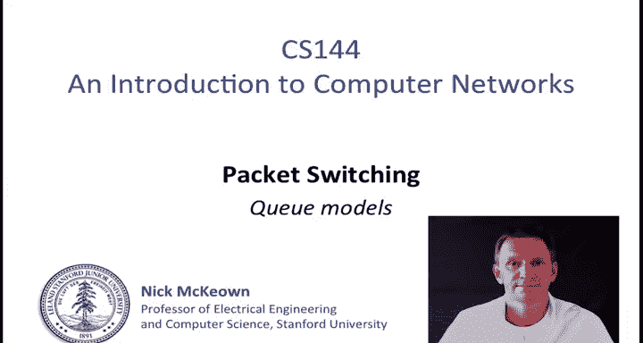
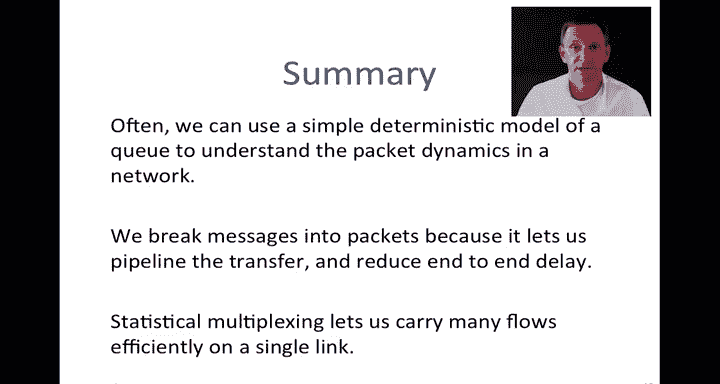
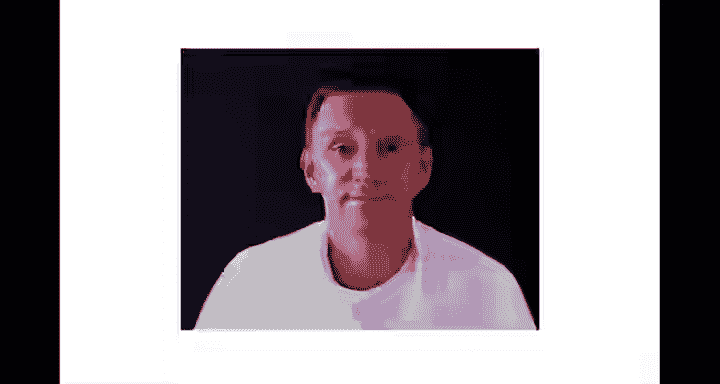

# 斯坦福大学《计算机网络｜Introduction to Computer Networking CS 144 2018》中英字幕deepseek - P45：-045-Packet Switching   Princi.zh_en - GPT中英字幕课程资源 - BV1bVqNYFEGg

。This video is a continuation about packet switching。

 and in this video I'm going to be talking about a number of different Q models。

I'm going to start out by describing a simple deterministic Q model。

 This is something that's going to help us understand the dynamics of many simple queue system。

 It often works as a good way of understanding what's going on in the network。So。Is a router。

 And as we know already， routers have to have queues in the interface the whole packets during times of congestion。

 And this is where the variability in queuing delay takes place。

 So if we can understand the dynamics。 even even just having a rough sense of the dynamics of that queue。

 It really helps us understand the endto end to queuing delay and the dynamics of the network。

 So we're going to take a closer look at this。 and we're going to just create a simple model。

 Here are the main characteristics of this queuee。 So I'm going to draw a queuee like this。

 This is the standard way to draw a queue showing where the packets will be stored。

 in that router queue， this is a fourport router。 So packets could be coming in from any of the interfaces into that queue。

And then they will depart under the outgoing link。 We're going to say that that Q has an occupancy of Q of T。

 So at time T， it has Q packets or bytes in it。It's going to be useful to think about the aggregate or the cumulative departure process。

 that is all of the packets or all of the bites that have departed up until some time T。Similarly。

 it's going to be useful to think of the cumulative arrivals。

 the total number of packets that have arrived up until time T。 Finally。

 because the outgoing link typically has a deterministic and fixed rate。

 which going to say has a fixed rate of R， so they're going to be the main parameters of our model。

We can also also think of a queue as being like a bucket full of water。

 and here's a simple example here， A of T is the cumulative。

Number of bites that have arrived up until time T。D of T is the cumulative number of bytes that have departed up until time T。

 and in this example， they're going to depart at a fixed link rate of R。

At any one time there may be some bites that have arrived but haven't yet departed。

 they're the one sitting in the bucket here and。The occupancy of that bucket is going to be Q of T。

 So this is like a simple model of R Q。 It's just another way of， another way of thinking about it。

 We can draw the evolution of this as a function of time。

 And I'm going to try and sketch how this might look。 So here are going to be the axes of my graph。

As a function of time， we're going to look at the cumulative number of bytes。 So remember。

 this is cumulative。I'm going to first look at the arrival process， A of T。

Bs tend to arrive as part of a packet and they're going to arrive at some particular link arrival rate。

 so I'm going to draw what that cumulative arrival process might look like it could look like anything but here is the bytes arriving a packet。

 this is the gap between the first packet and the second packet here's a bunch more bys arriving a gap maybe it's a long gap this time and then a new packet arriving。

So this is supposed to be a straight line and this would be the arrival rate of the packet on the incoming link and this is the number of bytes。

 so let's say the packet is of length P， the number of bytes of that first packet。

Now let's look at what the departure process might look like。

 I'm going to try and draw I'm just going to label this as A of T。The cumulative arrival process。

 and then in yellow I'm going to try and draw the I'm going to sketch out what the departure process might look like。

We know that the departure process is going to work at an operate at rate R。

So at some point after that first packet has arrived。

 let's assume that it's a store and forward model。 It doesn't matter that's just for the sake of my example。

 So at this time here the packet has arrived and then we'll say， okay。

 it's going to depart at rate R， so that's going to be my gradient there。So that's rate。

 that's radar R。 that packet or right， that packet departing。 at this point， there's nothing left。

 So we're going to wait until there's a whole new packet in the queue and then。

We're going to depart again at rate R。That's going to be radar and so on' going to wait until the whole new packet and it'll be at radar again。

 So this might be one way in which it evolves。 So the point here is not the particular shape of this graph。

 but just to say you can easily sketch the arrival and departure process and what this kind of a cool property of this is that we can immediately from this tell some some nice characteristics of the system first of all。

 we can immediately tell how what the value of Q of T is because at any one time So if we were to pick a particular time。

Q of T is the number of bytes that have arrived， but not yet departed。

 So it's simply D of T minus a of T。 I'm sorry， A of T minus D of T。

 So it's the number that are arrived minus those that have departed。 So， for example。

 if we were to take a line here down to here。 So a vertical supposed to be a vertical line。

That value， that distance between the two of those is Q of T。 So at any one time。

 it's the occupancy of that Q。Similarly， if we look at a particular bite that arrives。

 say at this time here。If we assume that all bys。Arrive and then depart in the same order。

 Then this byte， because it's it's this particular cumulative by。 We know that it departs here。

 So if we take the horizontal distance between these two lines， this is going to tell us the D of T。

 I'll call it little D of T。 the delay through the Q。

So this is a very useful model giving us an intuition。

 I often sketch graphs like this when I'm trying to understand the dynamics of a Q or dynamics of a system。

Okay， then to summarize。We can say that the Q occupancy。So Q occupancy， Q of T。

Equals it's the ones that have arrived， minus the ones that have departed。

 So a nice simple expression for that。 And that D of T。

Is the time spent in the queue by a byte that arrived at time T。 So it's the。It's the time。

Spend in the queue。In the Q。By a bite。Arriving。At time tea。

And that's simply the horizontal distance between those two lines。

Now the assumption of this is always that it's first come first serve or fiIFO。

 we also say first in first out in this context， those have the same meaning。

 So that's true if the bytes didn't arrive and depart in the same order。

 then we couldn't make this statement here about D of T because we don't know that we're referring to the same byte。

Let's go on and look at an example now of how we might use this。

 so in my I'm going to work through an example， we're going to assume that every second。

A100 bit packet is going to arrive to a queue at rate 1000s per second。 In other words。

 this this packet is going to arrive at a rate of 1000 Bs per second， and it's 100 bits long。

We're going to assume the maximum departure rate that was our R is 500 bits per second。

And the question is， what is the average occupancy of the Q， So just reading the question。

 it's not so obvious， but if we。Plot this in the way that I did before。

I'm not going to try and sketch it because I want these numbers to be very clear。

A of T shown in red here， is the arrival process。This here is the packet arriving。

 it's the 100 bit packet arriving at rate 1000 bits per second。

 so therefore it takes a  tenth0 of a second，0。1 of a second to arrive。

The maximum departure rate is 500 bits per second， it's slower， so our departure rate。

 departure D of T。The rate here is that the gradient of that is 500 bits per second。

 so that thousand that 100 bit packet is going to take 0。2 of a second in order to depart。

In the previous example， I showed it as a store and For。

Sttoring forward of each packet here I didn't， and that's just a choice。

 and I just made that choice when answering the question。

 the question isn't clear as to whether which way it is。

So we can now see the time evolution of Q of T， which is the vertical difference between those two lines and the delay of an individual packet。

 But the question is， what is the average occupancy of the Q？Well。

 let's look at how we might solve that I'm going to write this out just so that you have a clear record of this So the solution is this。

During each repeating one second cycle， the queue is going to fill at rate 500 Bs per second for a10 of a second。

 so that was my arrival process here。Then it drains at 500 B per second for。

Then drain at 500 bits per second for 0。1 of a second。Over the first。Two tenths of a second。

 The average key occupancy is therefore 。5 times。0。1 times 500 equals 25 beds。

The queue is empty for eight tenths of a second every cycle that's from here to here。

 and so the average Q occupancy。Q bar of T is。2 of a second when it's 25 bits and 0。

8 of a second when it's 0。 So the average Q occupancy is 5 bits。

Continuing with our theme of simple deterministic Q models。

 I want to explain why it is that small packets can reduce end to end delay。

You may have been wondering why we can't simply send an entire message in one packet。

 why is it that we have to break messages down into smaller packets？There's a very good reason。 good。

 very good reason for this。 And I want to explain this in terms of the end to end delay。

 So on the left， I've got an example of a message of length R。That's being delivered from end to end。

And this is going through three routers，1， 2 and3。And I'm just showing， as we did before。

 the the delay across each link in terms of the packetization layer and the propagation delay over the links as it makes it way across the network。

 We already know the expression for the end to end delay for this。 It's simply made up of。

The sum of all the M over RAs。This is the packetization delay。

 and then the sum of the all of the propagation delays over the links。 So we've seen this before。

If you look at the one on the right， we can see that the packet the message has been broken down into packets of length P。

 so I've broken that same message， it's the same length as before overall。

 this is the message but I've just broken down into packets of length P so the packetization delay over the first link is P over R1 and so now the end to end delay is this expression here P over R for the packetization delay on each link and then li over C for for the proagation delay。

M over P is simply the additional time。For the ones who arrive at again strictly speaking there should be m minus1 over P because it's the remaining packets。

 I'm going to assume that M is much bigger than P so that's basically the same M over P times r3。

 the packetization delay of that packet of that set of packets over the last link。

But the most important thing here is that you can see what's going on in this case on the left。

 the whole message has to be transferred over the first link before it can start on the second link。

 whereas over here。The first packet goes and then is transferred under the second link while the first link is carrying the second packet。

 so we've got a pipelining effect we've got parallelism over the links and so therefore the end to end delay is going to be reduced over a long network with very big messages this will make a very significant difference and so the end to end delay can be reduced by making the packets smaller。

Let's look at this simple example here， I've got a number of flows and flows are in packets coming in on n external links。

 all running at rate R。Gout a packet buffer corresponding to the output Q of the router and then an outgoing link that's running at rate R as well。

 Clearly if all of those ingress links were running at the full rate R。

 then the output link would be overwhelmed and we' start start dropping packets very quickly And in fact。

 there would be a rate of n times R coming in and a rate of1 R going out so itll be dropping them at a rate of n minus1 times R。

But because of the statistical modelplexing and the bursterness of the arrivals。

We can potentially get away with this if the average rates are sufficiently low。So in general。

 we say the reduction in rate that we need at the egress compared to the ingress is because of that statistical multipleing and we call that benefit that statistical multiplexing gain we never know what it's going to be precisely because it's going to depend on the particular arrival process of packets。

And temporarily， if there are temporary oversscription to the output link。

 the buffer can absorb those brief periods， and so a bigger buffer is going to absorb bigger and longer periods when the aggregate rate happens to exceed R。

But because the buffer has a finite size， there's always losses that can occur。

 and that's just a fact of life in packet switching， nothing that we can do about that。

Let's look at a couple of specific examples here。 See the top part at the top here， I've got a。

A communicating arrival process A。Into this roundr buffer that's being drained at right C。

And a separate one that is going through a router that's arriving at B。

 at rate B and being drained at rate C。And I'm showing over here on the left hand side the rates as a function of time and you can see here that the peaks and troughs don't exactly line up so that if we take the sum of the two or the sum of these two flows。

 then we can expect there to be some statistical multipleing gain Let's a look at what that might be because I made up these numbers these are just just to give us an example but if we take a plus B here。

 there was the rate of a plus B and that's the line in pink， that's this one here。

 you can see that the combined the rate of the combined flows R is quite a bit less than2 C。

 In other words， less than the sum of the two peaks So in this case we would say the statistical multiplexing gain equals 2 C over R It's the benefit that we're getting from summing the two of them。

We can actually come up with a different definition and some people use a different definition for statistical multipleplexing gain because in this case。

 you can see we didn't actually take advantage of the fact that there is a buffer we're not using that to buffer any temporary rate that exceeds R so one definition could be that for a given buffer size B。

The ratio of the rates。That need that we need in order to prevent packet loss is the statistical multiplexing gain。

 And that generally will be a lower rate because we can absorb the change。 So， for example。

 in this in this case， imagine that。We were to serve at this rate our prime。Instead。

 so we'll call that i prime where r prime is a little bit less than R。

So long as the amount that we need to buffer here and here when the rate exceeds our prime。

Can be accommodated by the buffer。 then we're okay。 And so in this case for the buffer of size B。

 we might say that instead the multiplexing gain is to C over our prime。

 which is a slightly larger number。Okay， so two definitions of statistical multiplexing gain。

 one where we don't consider the buffer and one where we do。So in summary。

 often we can use a simple deterministic model of a queue to understand the packet dynamics in a network。

 and I'd encourage you to do this， it gives a very good intuitive understanding of what's happening in the network。

 I often use this myself。Second。We learn that we can break messages into packets or rather the reason that we break messages into packets is because it lets us pipeline the transfer of packets from one end to another and reduces the end to end delay。

Finally， statistical multipleing lets us carry many flows efficiently on a single link。

 and this is one of the prime reasons that we use packet switching。

Okay， that's the end of this video。

