# 斯坦福大学《计算机网络｜Introduction to Computer Networking CS 144 2018》中英字幕deepseek - P46：-046-Packet Switching   Princi.zh_en - GPT中英字幕课程资源 - BV1bVqNYFEGg

Continuing with our theme of packet switching in this video I'm going to tell you about some useful propertiess of cues these are going to come in handy whenever we're thinking about how a queue evolves。

 how a packet buffer changes to affect the queuing delay of packets through a network。😊。

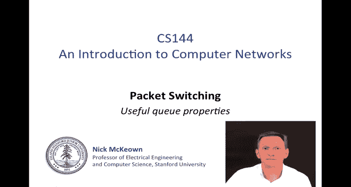

As we was seen before， we can think of a network as a set of queuees interconnected by some links。

 and those links are carrying the traffic or the packets from many。

 many different users and when multiplex together， when statistically multiplex together。

 that whole process of packet arrivals is very， very complicated。😊。

So we usually think of the arrival processes as being random events。

 each one was of course deterministically generated。

 but the aggregate we can think of as a random process。

So it's going to be good for us to understand how cues with random arrival processes work and so that's going to be the topic that I'm going to be discussing today。

 So usually arrival processes are complicated in systems like networks so we often model them using random processes and this study of cues with random arrival processes is called queuing theory。

Andqueuing theory you've probably heard of before has a reputation for having very hairy mathematics。

 but despite that hairy mathematics， cues with random arrival processes have some really interesting properties that's going to be good for us to understand they're going to really help us understand the dynamics of networks。

😊。

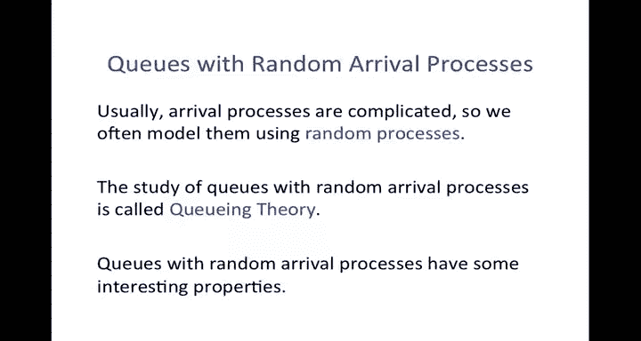

So I'm going to go through a set of properties I'm going to be starting with this one here that the bursterness tends to increase delay and it's at this level that I want you to remember these properties。

 the details of the mathematics we're not going to worry about so much。

 I want you understand these basic intuitive properties of queuing systems。

So it all comes down to the way that the queue evolves。 So I'm going to just sketch here my Q again。

This is the arrivals to the queue of packets you'll hear people call customers as well because queuing theory applies to many other systems so if I say customers I mean packets in this context and so this is our arrivals。

 these are our departures and we're going to be thinking about the evolution of the Q occupancy Q of T as a function of time on this timeline down here I've drawn a sequence of arrivals and departures。

 packet arrivals happening at these blue downward arrows representing the time or the epoch of the arrival and then these red upward arrows being the departures。

 the times at which the queue was serviced and just like in many cues for networks we're going to think of this as representing a link of a fixed rate are which means that the into departurepart opportunities are at one over R apart。

Now let's look at the evolution of the Q the Q here has there's the first arrival。

 the blue one which takes it up to one and then we have the service。

 the up one red arrow which is going to take us to0。

 there's a new arrival which is going to take us back to one again。

 then there's this departure here which is going to take us to zero then back up to one again。

 then zero etc at this point here we've had two arrivals in a row which is going to take us back to a Q occupancy of two and so on。

So this is going to be the evolution of the queue Now let's look at this one here。

 this departure opportunity， the reason I've drawn this as a dotted line。

 this is sometimes people call this a shadow departure it was a departure opportunity when we could have set a packet but the queue was empty so that we never actually sent the packet。

Because we can't actually go down to a negative Q occupancy that that wouldn't be possible。

 and so the Q sticks at zero， even though we missed this opportunity。

It's going to turn out that these missed opportunities are quite important。

 you can't have a negative cu occupancy so some people say you don't get credit for good behavior by not having an arrival during this interval here。

 it meant that the cu occupancyup stuck at zero but we don't get any credit for it and so if we have random arrivals with arrivals that are spread out if we miss an opportunity to send it's tough we never get that back again let's now take a look at the first property I wanted to wanted to explain and that is that burstiness or burstie arrivals tend to increase delay。

I'm going to start with with a very simple example where there is no burstiness。

 where we have the simplest arrival process， which is a sequence of arrivals all exactly one second apart。

 So this is one packet per second。😊，And in fact， it's one packet exactly every second。

 Nothing random about this at all。 Let's look at the sequence of departures。

 I'm going to assume that there is one departure every second。

 So if we were to sketch the Q occupancy here I won't sketch the graph I'll just put the numbers in if we were to sample the occupancy here。

 thered been an arrival but no departure So it would have one and then0 and then it's one again and then0。

10。 So there's long in this the way I've drawn it here。

 there are long periods of0 and then the short periods of one when there's been arrival but no departure。

 but of course I could shift either the arrivals of departures and make those of zeros and ones be of different different durations so they'll just carry on because everything's nice and periodic。

The interesting thing to note here is Q of T， the Q occupancy is either zero or one。

 so we can say it's always less than or equal to one。😊。

And the average Q occupancy is going to be somewhere between0 and1。 We know that for sure。

 just because of the structure of the problem。 So periodic arrivals make for a nice。

 simple understanding of that Q Q evolution。 Now， let's look at a different example when things are more bursty。

So just as before the arrivals are going to be at the rate of one per second。

 but they're going to arrive in bursts and in fact， we're going to have n arrivals。

 we have n arrivals， n arrivals， every n seconds， so n packets every n seconds。

 but they're going to come in these bursts of n in this particular case it's five packets。

 every five seconds。The service opportunities or the departures are going to be the same as before we're going to have one per second。

 So in terms of the rate， the arrival rate and the departure rate。

 everything is exactly the same as before。 It's one packet per second。

 It's just that the burstness of the arrivals is going to change things and let's look at the way in which in which they change。

 So here we've got a sudden burst of arrivals of5。 So depending on whether when we sample it。

 sample the Q occupancy we're going to have Q of t equals0 all the way through to5。

 depending on when we sample。During this time here， it's four， then three， then two， then1， then0。

 and then it's going to go up to five again sometime in here and four and so on and so on and so on。

Okay， so before our Q occupancy was zero or1， but now even with the same arrival rate and even with the same departure rate。

 our Q occupancy can go between zero and5， so our arrival， our average Q occupancy is higher。

And the variance of the key occupancy is higher too， because it's varying all the way across 0 to 5。

 So average and the variance have both increased， even though the rate hasn't changed。

 So clearly the bursterness is going to make a big difference。 And in general。

 we say bursterness increases delay。And that simple example illustrates that it doesn't prove it。

 but hopefully it gives you intuition as to why burstingness will increase delay。

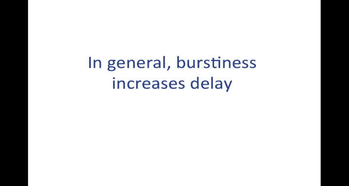

The second property， which is very similar to the first， it's almost the counterbalance of the first。

 is that determinism tends to minimize delay。But it's enough for us to know that in general。

 determinism minimizes delay， in other words， random arrivals wait longer on average than simple periodic arrivals。

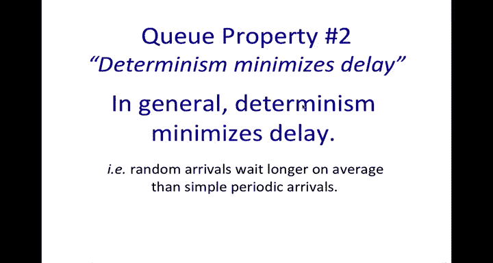

Okay， let me move on to the third property I'd like you to know about。

 and that is a well known result called Little's result。

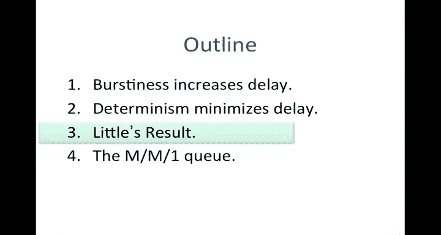

Qes are very complicated and as as I've already given you an indication。

 the mathematics tends to get very hairy， but there are some simple results that you really need to know and it's important for us to understand because they're going to come in handy when we're understanding the basic propertiess of cu'es and this one little's a result is deceptively simple。

😊，So in any queuing system， like the one shown here。There's a following property which is。

Which is a little surprising if I've got a well defined arrival rate， let's call that Lambda。

And I've got a average number of Qes in the system L。And I want to know what the average delay is。

 and I'm going to call this D equals average delay。Of a customer or a packet through the queue。

Then little's result tells us that there is， in general。

 the number of customers in the system equals the average arrival rate。Times。

The average delay of a customer through the queue。That's it。

This deceptively simple result applies for anyqueuing system。

For which there are no customers that are lost。Or dropped。 So if none。Lost or dropped。

So it doesn't matter what the arrival process is。It doesn't matter how bursty， how non bursty。

 so long as it has a well defined arrival rate Lada， then we can make this calculation。

So you can go to any queue and we'll look at some examples in a moment。

And you can calculate the average number in the queue as a function of the arrival rate and the average delay。

 or of course if you know L and Lambda， then you can figure out the average delay that's going to be seen by a customer through this queue。

Now L is the average number that are in the Q plus currently being serviced。

So long as D is the average delay of customers that arrive until they've completed service。

Turns out this result also holds。If we say L is the average time sorry the average number of customers in just the queue but not yet entering service。

 so long as D also equals the average delay through the queue prior to entering service。

 so both of those are true。We're going to be using this result quite a lot throughout the quarter。

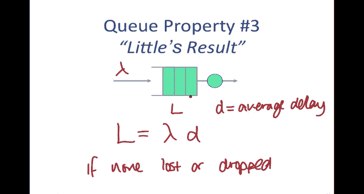

Having told you about those three Pros of cues。Something I need to tell you before we get onto the fourth property and that is the Poisson process you're going to hear a lot about the Poisson process whenever you study cues or any complicated system that we model probabilistically now first of all' going to tell you what the Poisson process is and I'm going to tell you why it's interesting and some caveats about using it。

So the Poisson process is an arrival process in our case and an arrival process we say is Poisson if。

And in fact， an only if。The probability of there being k arrivals in an interval of t seconds is given by this expression here。

 kind of a hairy expression， but the important thing is that we can express this as the expected number of arrivals within an interval t is simply Lambda T where Lambda is the arrival rate。

Also， successive inter arrivalrival times are independence。

 What this means is that once we' have picked one arrival from this expression here。

 this will lead to an arrival event happening。 Then the next arrival is independent of the first one。

 And in fact， if we take a sliding window and move that over the arrival process within any within any period。

 the interrival times within one period or independent of the next。

 That means that there's no burst inness or coupling of one arrival to another。Okay。

 that's what the pressson process is if you pick up any book on probability。

 then you can find a more detailed description if that's something that's new to you。

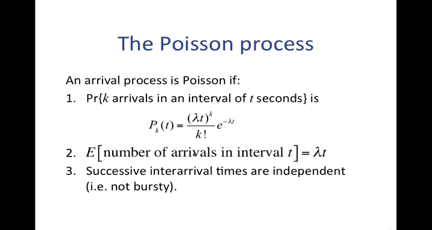

So why the Poisson process， why are we interested in the Poisson process Well the Poisson process happens to model an aggregation of many independent random events very well。

For example， it's used in models of new phone calls arriving to a switch so when we have a telephone switch and we say we want to model the arrival of a new phone call that is being placed through the day。

 then a Poisson process is a very good model of this or the decay of many independent nuclear particles where we have huge number of particles all operating independently of each other。

 they will decay at certain times that decay。As a aggregation of many random events tends to a Poisson processor we have a large number of particles。

 and you may also be familiar with shot noise in an electrical circuit。

 which is also modeled as a Poisson process。The final thing。

 despite the complexity of the equation on the previous slide， it actually makes the math very easy。

 and this is a big reason that it gets used very widely as well。

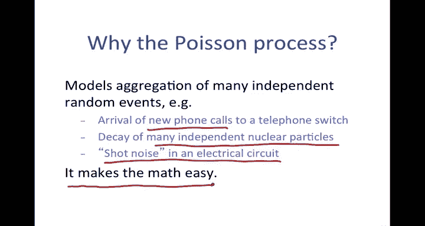

At this point I should give you some warnings。Network traffic is very bursty。

 There's nothing nothing independent about one packet arrival after another。 as we will see later。

 packets tend very frequently to arrive in bursts and many things in the network help actually to keep them that way and make them very bursty So packet arrivals are not and I can't overemphase this。

 They are not pass on。 There's been some classic papers research papers that have shown this。However。

 it does model quite well the arrival of new flows of new communications， for example。

 the interaral times of web requests or sending emails for any one individual。

 they may be somewhat Poisson， but when you take the aggregation of many users putting their network traffic into the network。

 that is actually modeled quite well by a Poisson process。And sometimes。

 sometimes we can use some of the results that apply to cues with Poisson arrivals to give us an intuition and understanding of maybe what's happening even at the packet level。

 but we must do that very， very carefully。

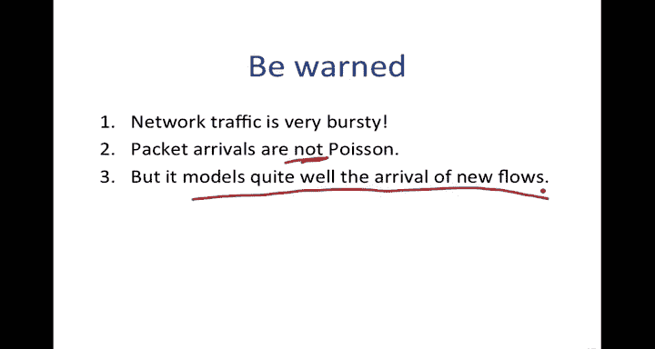

Let's look at a very common example of where we use the Poisson process。

 This is something called the MMm1 Q。 The MMm1 Q is about the simplest type of Q that is commonly analyzed。

 The notation is that the M stands for a Markovvian arrival process which in our case is Poisson Markovvian service process which is exponential in our case。

 which means that the time that it takes to servicer packet is exponentially distributed and each one has a service time independent of all of the others and that there is one server。

 in other words that there's one outgoing line servicing this Q。

This is very widely used because it assumes a nice simple plus on arrival with independent arrivals from one packet to the next。

But it's also used because the math is nice and simple and the result is very intuitive。So。😊。

If we were to analyze this and we can analyze it using using continuous time markov chains。

 we will discover that they。Average delay of a packet going through this Q is given by the simple expression1 over mu minus lambda。

What this tells us is that it's one over the difference between the service rate and the arrival rate。

 so as the load increases and the load gets closer and closer to the service rate。

 then this number will grow very rapidly and if we plot this on a graph。

So as a function of lambda over mu。So that's lambda over mu as we get closer and closer to one。

 in other words， where they're equal， the average delay of a packet through this queue will increase very。

 very steeply。And this is the case for almost any queuing system， not just the MMm1Q。

 the reason that we use the MM1Qs sometimes as a placeholder for a more complicated system is only that the math is simpler and this expression is simple。

 but you see a very similar shape for almost any queuing system。

We can use little as result to figure out what the average Q occupancy is。

 and we know that L equals lambda times D， which in this case is。Simply going to be。Lambda over mu。

Divided by one minus lambda over M mu， the reason for writing it in terms of Lada over a mu is simply that Lada over M mu represents the intensity just as I sketched on the graph here as Lada approaches mu。

 Lada of M mu approaches one and the denominator turns to0 and the Q occupancy and the average delay will blow up and10 towards infinity。

So the M1Q provides us a good intuition， don't ever assume that this is the actual representative measure of the Q occupancy or the average delay。

 but it can often help to give it an intuitive sense of what's going on in a network。😊。

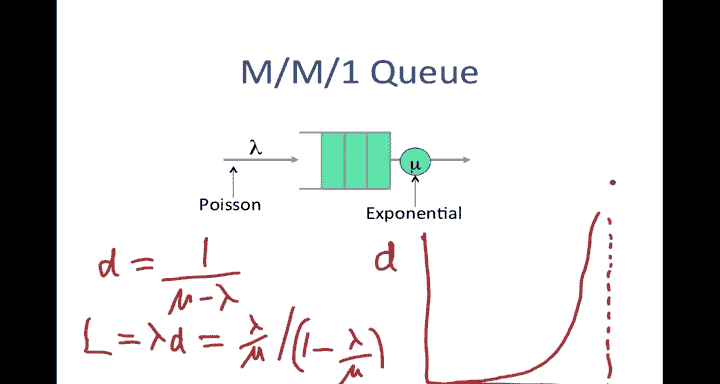

So in summary， the main cu properties I want you to take away from this video are that burstingness tends to increase delay。

 so burst year arrivals tend to makequeuing delays longer。

Little's result gives us a nice relationship between the average occupancy of a Q， L， Lambda。

 the arrival rate and D， the average delay of a customer through that queue。

While packet arrivals are not Poisson， some events are such as web requests and new flow arrivals。

 and Poisson process also forms the basis of the MM1Q。

 which is a simple queuing model that often can give us some intuition about the delay properties of a network。

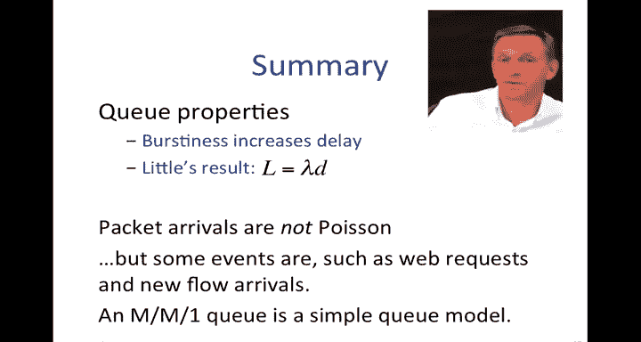

That's the end of this video。