# 斯坦福大学《计算机网络｜Introduction to Computer Networking CS 144 2018》中英字幕deepseek - P47：-047-Packet Switching   Practi.zh_en - GPT中英字幕课程资源 - BV1bVqNYFEGg

To continue on our theme of packet switching in this video。

 I'm going to tell you how packet switches work。 That's things like Ethernet switches。

 Internet routers and so on。😊。

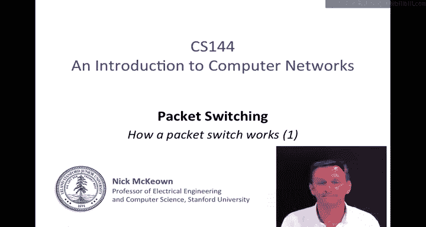

In this video， we're going to learn about what a packet switch looks like， what a packet switch does。

 whether it's an ethernet switch or an internet router， and how a lookups work。

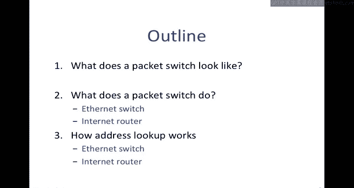

So let's start with a picture of a generic packet switch the three main stages of a packet switch are that when a packet arrives。

 the first thing that we do is look up at the address this means looking at the destination address to figure out where it's going to go next We do this by looking up an forwarding table we send the destination address down to the forwarding table which will tell us the egress link or the port that it's going to and that helps us decide where to send it next。

 the next thing that we may need to do is to update the header So for example。

 if it's an internet router we have to decrement the Ttl and update the checkum。

 the next thing we have to do is to cu the packet This is because there may be some congestion there may be many packets trying to get to this outgoing link at the same time。

 So we use a buffer memory to hold some packets that are waiting their turn to depart on the egress line。

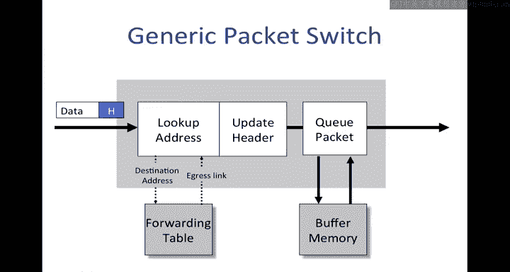

Of course， this one input， one output packet which is not very interesting packet switches in general will have multiple inputs and multiple outputs。

 here's one with three inputs and three outputs， packets will arrive and I've color coded these ones。

 the red packets are going to the red output over here and the blue one is going to the blue output up here。

So just as before the packets are going to be processed the address is going be looked up and we're going to update the header if we need to。

 then we're going to transfer it across that back plane。

 This is supposed to represent a shared bus over which all of these packets are going to pass and then they're going to find their way to the output queue In this case。

 we've got two red packets that are going to contend for the same output So what we'll need to do is we can send the blue one to its output。

 we can send one of the red ones all the way through to its output but because we can only send one packet at a time。

 the other red packet is going to have to wait in the buffer memory until until the first one is gone once it's gone this one can go on its way So this is sort of the generic structure of a packet switch。

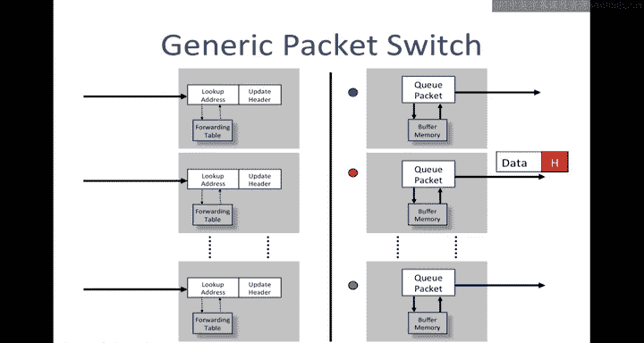

More specifically one very common type of packet switch is an ethernet switch these are the four basic operations that an ethernet switch must perform so it's an ethernet switch is an example of a packet switch it's just a very specific one that's dealing with ethernet ethernet frames so the first thing it does is it examines the header of each arriving frame。

If the Ethernet destination address， if the destination address and these are 48 bit addresses with Ethernet。

 if it finds that address in the forwarding table， it's going to forward the frame to the correct outgoing port or maybe a selection of ports if it's a multicast packet。

If it finds that the Ethernet destination address is not in the table。In an ethernet switch。

 it broadcasts the frames to all ports。Well all ports except the one through which the frame arrived。

 In other words， it doesn't know where to send it。 so it's going to flood it to everybody in the hope of the little Res destination。

How does it populate the table in the first place， Well。

 it does this by learning addresses that it sees on the wire。 more specifically。

 when a packet arrives， the entries in the table are learned by examining the。

Ethanette's source address of a raving packets。So when packets first come through。

 the destination address is not in the table。It's broadcast to everybody。

Hopefully the other end will respond， send a packet back， will see its source address。

 and we will therefore learn that in future we must send packets through that particular port to reach that particular address。

 So these are the four basic operations of an Ethernet switch。

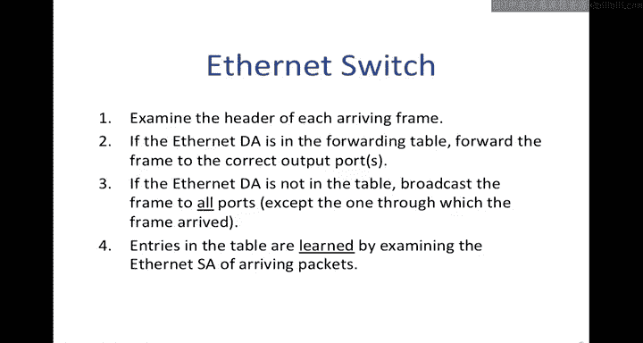

Let's contrast that with an internet router， another type of packet switch， which processes。

The internet the IP destination address instead， so there's seven basic operations。

Because it's dealing with IP dataograms that are encapsulated in ethernet packets。

 first of all it's going to check to see whether the ethernet destination address of the arriving frame belongs to the router in other words。

 is it specifically addressed to this router if it is it accepts it if it doesn't it drops it because it's clearly not destined for us。

The next thing it does is to check that the IP version number is4 if it's an IPV4 router and checks the length of the datagram。

Next， it's going to decrement the TTL。An update the IP head to checkum because the checkum includes the TTL it checks to see if the TTL equals0。

 if it does， it drops the packet， if it doesn't， then it can continue to forward it。

Next it's going to look up in the forwarding table if the IP destination address is in the forwarding table。

 it's going to afford it to the correct egress port or ports if it's multicast。

And this is the correct port to reach the next top because IP is doing hot by hop routing。

Now it's decided which port it's going to depart from。

 it encapsulates the IP datagram back into an ethernet frame and it has to figure out the correct ethernet destination address to use for the next top router。

 we'll learn this process later at something called ARP。

And so it'll encapsulate the IP data Cr into the ethernet frame。

 could create the new ethernet frame and then send it onto the wire。

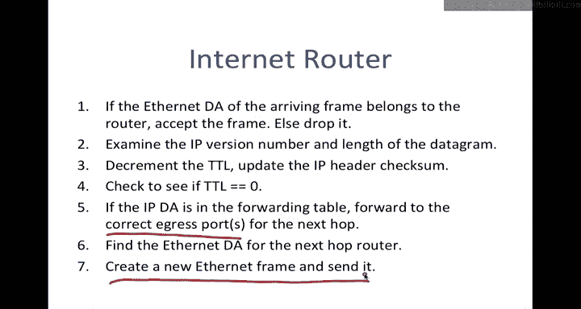

So the basic operations of a packet switcher to look up the address。

 So I're going to ask the question， how is this address looked up in the forwarding table。

 I'm going to show you some examples in the moment。

 The second operation is switching once it's figured out which egress port it needs to go do。

 it now has to send it to that correct output。 It's got to deliver it to that correct output port so it can leave on the correct outgoing link。

I'm going to start with the lookup address and then in the next video。

 we're going to learn about switching。

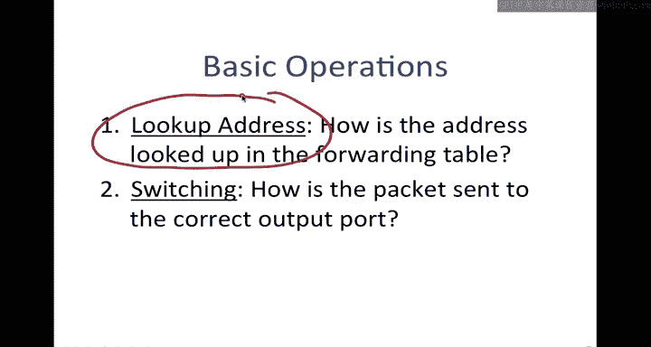

So for ethernet switches， looking up the address is very straightforward。

 It will have a forwarding table， which I've drawn in very simplified form here。

 This is the the match that it's going to perform。 is the this is what it's going to try and match the ethernet destination address on and this is then the action it's going to perform if it finds a match if an incoming ethernet frame has a destination address that matches this one here。

 then。It's going to forward it to port 7。 If it matches on this address here。

 then it's going to forward it to port 3。 I've just drawn the 48 B addresses here as hexadecimal numbers。

Okay， so the internetther forwarding table has a。A number of rows。

 one for each address and for each address it's going to tell it which port that it needs to forward to and if it misses。

 then it broadcasts because that's what Ethernet switches do when they don't know the address to send it to。

Now to do this lookup the way that it performs this lookup is that typically it stores these addresses in a hash table because these are 48 bit addresses but there's nothing like two to the 48 entries。

 they may be 100，000 maybe even a million entries so nothing like two to the power of 48 so it's a very sparse table so typically they store addresses in a hash table it might be a twoway hash to increase the probability of having a hit on the first try and then it will look up the match by looking for an exact match in the hash table In other words it's looking for an exact match on that 48 bit address So that's how lookups are done in an Ethernet switch。

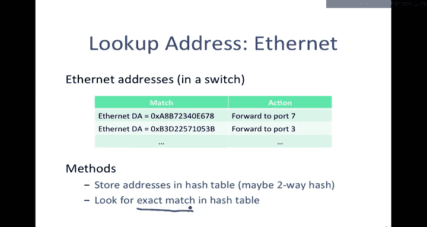

Now let's look at how they're done in an IP router， an internet router。

So IP addresses are a bit more complicated IP addresses we don't just look up on an exact match。

 we look up on what's called a longest prefix match。

 we'll learn about why that is later when we learn about IP addresses。

 but suffice to know right now we're performing a longest prefix match rather than an exact match。

So just as before we've got some matches here of some IP prefixes and I'll tell you what those are in a moment and then this is the action that we would perform so for example if we had a match on this IP destination address。

This one here。 And this is a specific I destination address，127 dot 43 dot 57 dot 99。

 So that'll be a 32 B address。 We're going afford it to this I address。

 So this is actually the I address of the interface of the next router that we're going to。

After it's made this decision， it's going to resolve this。

 it's going to turn this IP address into the equivalent ethernet destination address of that interface so that it knows what to encapsulate the packet into。

 But anyway for inside the forwarding table， it maintains it as an IP address。

 So if we see something that matches here， then this is the action that we perform。

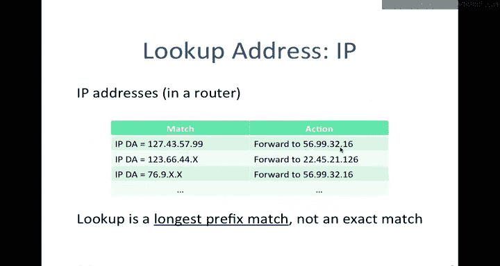

So let's a look bit at what a longest prefix match is。Along here。

 I've got the IP version 4 address number line， In other words。

 all of the possible2 to the 32 different addresses that we can have in an IP destination address。

And what I've got up here are some line segments， these line segments are prefixes。

 and they're always represented as in the following form。

This line segment here corresponds to all of the addresses that start with 65。

 The interpretation of this is。All of those with 65 as the first8 bits。 So if if a packet。

 an incoming destination address has 65 as the first 8 bits of address。

 then it's going to match on this line segment and this line segment represent all the I addresses that start with 65 in their first 8 bit locations。

Similarly， this slide segment here corresponds to all of the IP addresses that their first 16 bits are 128。

9。So there are two to the pair of 16 addresses here， all with the first 16 bits 128。9。

 and so we represent that prefix as 128。9。00 slash 16 corresponding to those first 16 bits。Finally。

 one more example。This one up here， which is a very short line segment。

 is all those addresses that share the first 24 bits。

This means there are two to the8 of them or 256 different addresses that all start with 128 dot9。176。

 Okay， so when a packet arrives with a particular destination address， and here's an example here。

 this one is clearly going to match on this line segment right here。

So this is the address on the number line， this is where it matches here so that we know that the prefix that we've matched on in the table is this one。

 so the table will contain this entry here， this address will match on this entry in the table。

Similarly， this address， 128。9。16。14 is going to match on this line segment here。

Notice that it matched on this one。But this one is a is a longer matching prefix。

 More of the bits match on this one than they do on this one。 This is a longest longer prefix。

 It's 21 Bs prefix， whereas this one is only a 16 B prefix。 So because it matches on both。

 and this is the longest one， the。Address this address here will match on this prefx here in the table。

 So in routing lookups。What we do is we find the longest matching prefix。

 also known as the most specific route amongst all the prefixes that match the destination address。

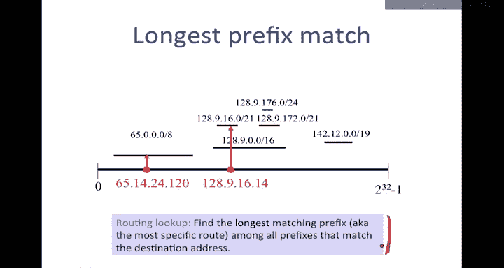

Let's look at how we might implement this in a table and one common implementation is to use what's called a binary try TRIe and there are many variations of this。

 but this is the most common one here Let's say that we had a prefix table that look like this This prefix table is a bit strange because all the prefixes are very short I'm just doing that so that they can be clearly represented in this table So I've got 1。

23，456789，10 different entries in the table and I'm going to populate them on this try right here。

Because the matching of an incoming address is going to have variable length。

 we need a data structure to hold variable length entries。

 So the way that this data structure holds these entries is let's take the 00001。This is 0。

 This is 0。 This is 0。 This is 0。 and then this is  one。 In other words。

 we take the left branch for a 0 in the right branch for a1。

 And so we encode or store this entry A at this particular leaf corresponding to that entry。

 And similarly， at the other extreme， let's take a look at J。That's 1，1，1，1，0，0，0。

0 corresponding to this entry here。 and this is where we'll find J at the leaf。

Once we've got this data structure for storing the entries。

 when a packet comes in with a particular destination address。

 we can just do a bit by bit comparison， traverse this tree and it will tell us which entry is the longest matching prefix。

 If we get to a leaf and find that there's nothing there。

 we go back to the nearest matching one that shared bits in common with that address。

 you might want to experiment with this with these other entries in the table。

 So this is one common way of storing and performing the lookup in for a longest matching prefix and there's another entry another mechanism which is quite commonly used too that's to use a special type of memory device called a tenerary content addressable memory or a Tam。

And a Tcam that heres the table again that we that we had before。

 and we start by storing it in a slightly different representation in the table。

 So entry A would be stored as 4 zeros and01。And here we've rounded everything out the8 bits as if they're8 bit prefixes and this mask value here。

Is telling us which bits in the value above actually matter。

 so wherever there was a0 or1 we put a1 to say these are all valid and wherever we have an X we put a 0。

So these two bits， these two representations here， we can either think of them as a ternary value or two binary values that are stor this entry。

 they tell us which bits have which values and which ones don't matter。😊。

So the process of performing a lookup is kind of brute force。

 we compare an incoming address against every masked entry at the same time in parallel on the table。

 so these specialized memories consume quite a bit of power because they're doing all of that at the same time but they can be really really fast and so they're quite commonly used for doing longest prefix matches in routers。

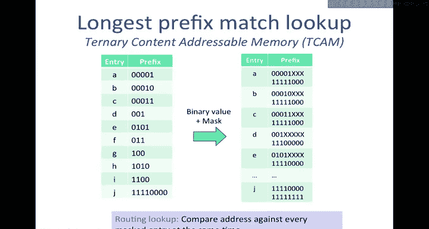

One of that last thing I wanted to point out is there's a sort of an increasing interest these days in what we might call generic lookups you know made the observation before that these tables are holding a match field and an action field and so we can generalize this or abstract this and say pretty much any packet switch is doing a lookup which is a match followed by an action and the match might be on any fields like an IP address or ethernet destination address and an IP address if we wanted and we might have actions like forward or drop or in capture aid or do other things so we can generalize the specification of a packet switch and nowadays packet switch is a design that can do all sorts of different types of forwarding for layer2 layer 3 at the same time or they could they could be for things like。

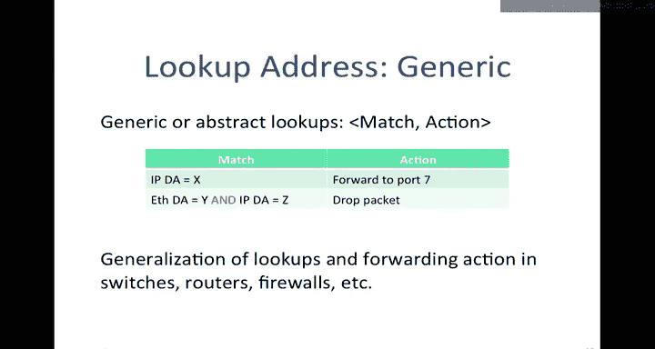

Switchches， routers， firewalls， all sorts of devices like that。 So in summary。

 packet switches perform two basic operations。 They perform the lookups for looking up addresses in a forwarding table。

 and then they switch the packet to the correct outgoing port。At high level。

 Ethernet Swes and internet routers perform very similar operations。

 they're basically processing these packets in a very similar way。😊。

Address lookup is different in switches and routers。

 and we saw some examples of those for both Ethernet addresses and IP addresses。

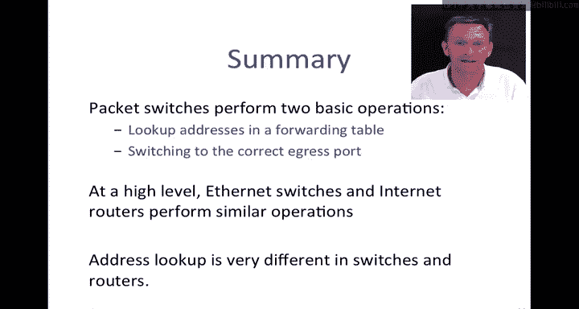

That's the end of this video。