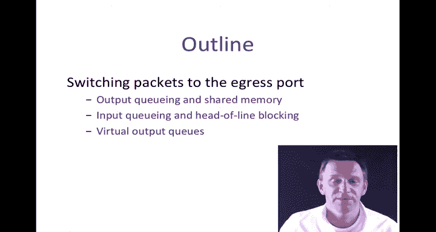
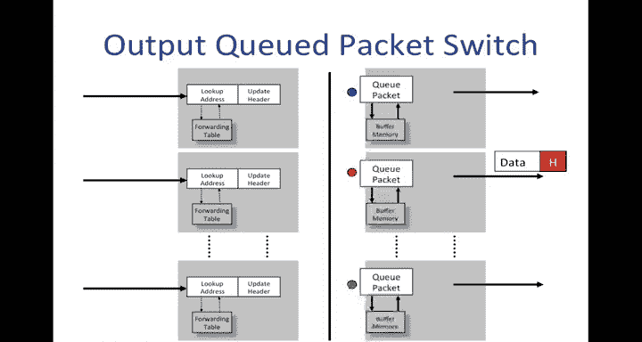
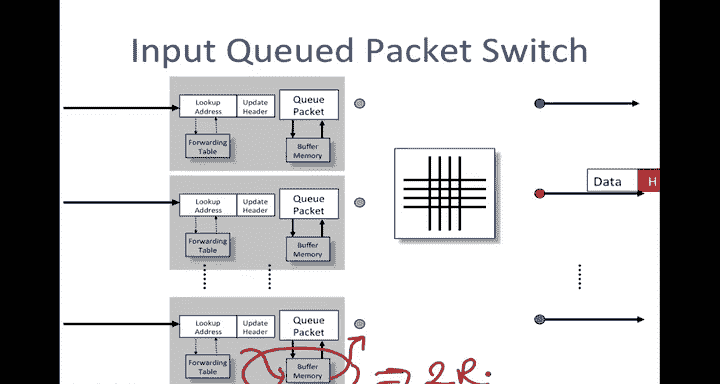
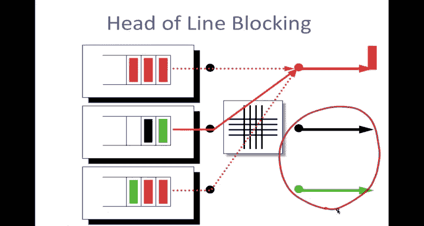
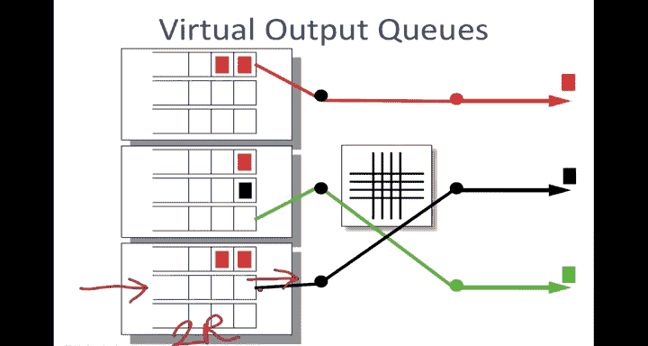
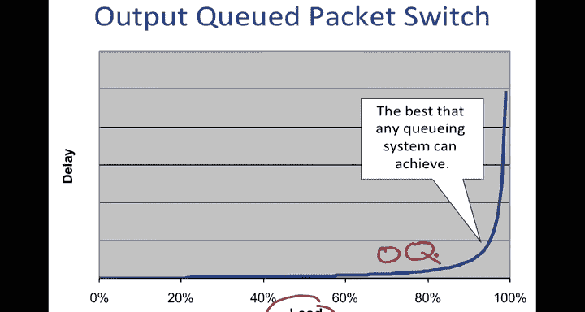
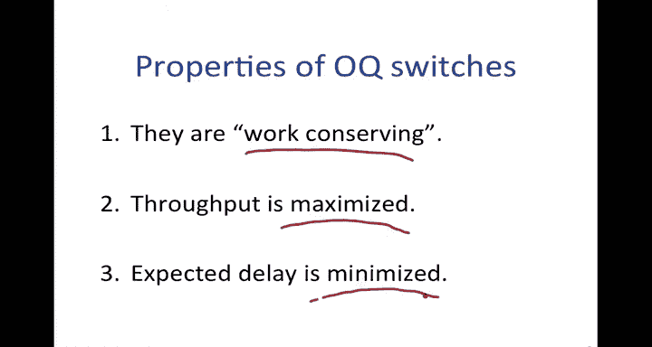
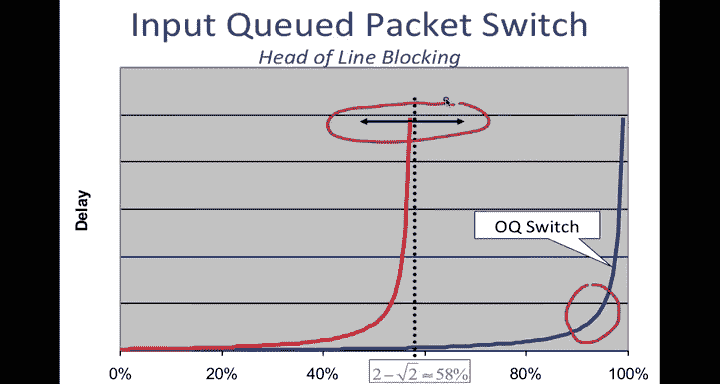
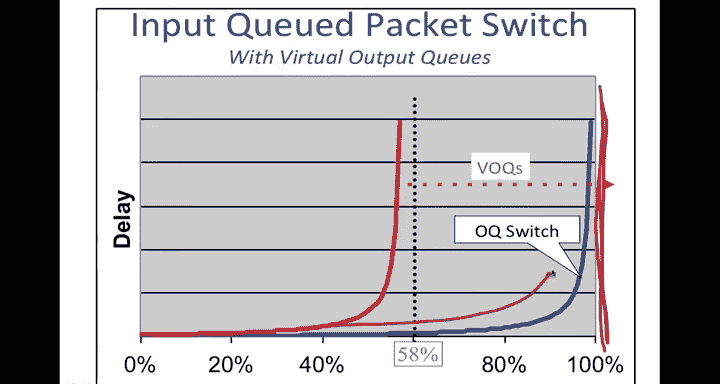
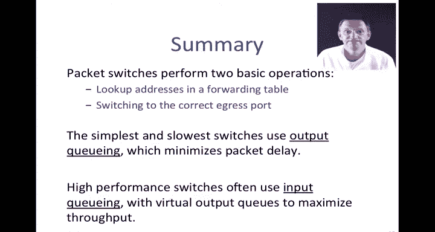

# 斯坦福大学《计算机网络｜Introduction to Computer Networking CS 144 2018》中英字幕deepseek - P48：-048-Packet Switching   Practi.zh_en - GPT中英字幕课程资源 - BV1bVqNYFEGg

This video is a continuation of our first video on how packet switches work。

In the first video we saw that there are two basic operations to a packet switch first packet addresses have to be looked up into a forwarding table and then the packet has to be switched or transferred to the correct output port so that it could be sent under the correct outgoing link。

In the last video we saw how addresses are looked up in tables for ethernet switches and internet routers and in this video I'm going to explain how packets are switched to the correct egress port。

 I'm going look at a number of different techniques， outputqueuing。

 inputqueuing and virtual output cues and and we'll see and get a sense for how these packet switches are actually built。

I'm going to start with the the sort of the basic vanilla switch。

 which is the one I showed you before， we have the address lookup on the left over here。

And then on the this is the forwarding table where we look up the addresses and then we have the packet queuing logic and then the buffer memory where the packets are held during times of congestion。

When packets arrive， here are three packets arriving with different egress ports indicated by the color of the header of the packet。

 so the red one at the top is going to the red port over here， the one in the middle。

So when these packets traverse the back plane， we see that the blue one is able to go to its output。

 one of the red ones can be delivered immediately and the other one is held in the output queue waiting for its turn。

 so as soon as the first two have left this one can then depart in PIFO order。

We often refer to a switch like this as an output cud switch because the queuees are at the output and this has a certain ramification for the performance of the switch。

 let's take a look at that。When we have packets arriving。

 it's possible in the worst case that all the packets coming in at the same time from the outside will be wanting to go to the same output Q。

 Let's say this one here。 So if we have ns each running at rate R。And there are。

 let's say there are n of them。Then in the worst case。

 we could actually have a writing rate of n times R into this output Q。 Similarlyly。

 and we always have a reading rate from this Q of rate R。

 So we So we say in the output cubed switch that this memory。

Must run an aggregate a total rate of up to n plus1 times R。

The somewhat annoying thing or frustrating thing about this is that long term。

 it can't possibly be the case that we're writing into this Q at rate n times R。

 the system could not sustain that。 This only really works if some mechanism is at play like congestion control to hold the average rate of writing into this Q at no more than1 R so it feels as though the maximum rate that we should need is two times R。

That was what we would stray for， unfortunately we were paying this penalty of N and N could be a larger number it could be hundreds or even thousands。

 so this memory has to run much faster。outputcut switches are said to be limited by this problem that they have to have memories that run very。

 very fast， and it becomes quite a challenge when building scalable output Cu switches to find or use memories or create a memory hierarchy that will run fast enough。

One obvious way to solve this problem is to move the cues from the output over to the input。

 Let's take a look at what happens when we do this For obvious reason。

 we call this input cud packet switch。 Now， the the cues where packets will be held are at the input side of the switch。

The advantage of this will perhaps be obvious in a moment if we consider packets arriving to the switch。

Same pattern as before， two reds， one blue。In this case。

 what we would do is all of the packets would， would come through the switch。

 Only one of them needs to be held。 That's the。The one down here waiting for its turn to go across the switch。

 and that's because its output line is busy and there's no queue at the output to hold it。

 So we hold it back at the input。 And then later， when its turn comes。

 it can depart just like it would from an output queue。 So it show in the face of it。

 The good news is that things look like they work the same。

 And the better news is that the buffer memory here。😊。

Is now only has to accept one packet at most one packet from the ingress at a time and has to only send one packet into the switch in a packet time。

 So its speed has been reduced from n plus one times R just down to our minimum and our goal。

 which was two times R。 So a factor of almost n reduction。

 So this makes a huge difference and for this reason people often say that inputcute switches are much more scalable and indeed quite a few big switches are made this way。

 but with a caveat and there is a problem that we're going to have a take a look at right now in an inputcute switch。

 the problem is something called head of line blocking and this problem is something that you'll see in many contexts。

 I want to explain it here。 So you'll recognize it when you see it in other environments。

Let me go through an example， these are three inputs representing the inputs of the switch。

 so these are the input buffers I've taken away everything else on the switch just to make it a little bit clearer and we're going to see packets arrive to these here they are they are red ones going to the red output。

 black ones to the black output， green ones to the green output。And。

Imagine that you have the task of deciding which which packets to go and you look at the packets at the head of line of this and see that they're all red problem is that you can only send one of them at a time。

And so in this particular instance， we'd only be able to send the red one。

Even though there are green and black packets in the system that could go to these unused outputs。

 because we've arranged everything as a single queue， we get this head of line blocking effect。

Natural solution to this， which is pretty widely used， is something called virtual output cus。

 where each input maintains a separate queue for each output。 So in this case。

 we have a three by three switch so this。Q here is a PIOq of packets waiting to go to output1。

 the red output for output2 and for output3。So when packets arrive。

 here are the same set of packets arriving as before。

 but now they get preclassified and placed into a queue corresponding the output they're going to。

 that's why we call them virtual output cues， it's a cu of packets going to all going to the same output。

The good news now is that because each queue holds packets going to the same output。

 no packet can be held up by a packet ahead of it， going to a different output。

 So it can't be held up because it's。😊，Its head of line is em blocked by someone who is stuck。

So now we can look at this and say， aha， we have visibility into all of the head of line packets and we can deliver all three in one go and therefore get a higher instantaneous throughput。

It's an obvious solution， it can be a little tricky to implement in practice。

 but the nice thing is that it overcomes this head of line blocking entirely。

 so the good news overall is we've reduced the speed of the queues to two times a speed of the memories because remember we can only have one packet come in at a time and only one packet depart at a time。

And we're able to sustain the same throughput performance as before。

Just to look at this on a graph， we often see graphs that look like this。

 this is a plot of the delay or the average delay that a packet would experience as a function of the load。

 this is basically how busy the ingress lines are。The best that any queuing system can achieve is this line here。

 and this corresponds to a system in which as the load approaches 100%。

 the delay increases or the average delay increases and is asymptotic to 100%。In fact。

 this is what we will see with an output Cud switch。 An output Cud switch is。

Perfect in the sense that you can't achieve a higher throughput or you can't achieve a lower average delay。

 Let's take a look at the main properties of output Cu switches。 First。

 we say they are work conserving。 work conserving means that an output line is never idle when there is a packet in the system waiting to go to it。

That means there's no blocking internally preventing a packet getting to that line。

 whenever that line is idle， there is no packet in the system waiting for it。As a consequence。

 throughput is maximd because you cannot have a higher throughput than keeping all the lines busy whenever there's a packet available for them。

 and the expected delay is minimized because we're always doing useful work delivering packets under the outgoing line。

Just to recap the performance that we suffer from with head of line blocking。

 this was our perfect output switch output cube switch here on the right。

 this nice performance here with head of line blocking it's a well-known result that the throughput can be reduced In other words。

 this asymptote when things fall apart gets reduced to minus2 minus square root of two or approximately 58%。

 so we lose almost half the performance of the system as a consequence of this head of line blocking the actual number will vary depending on the particular arrival pattern。

 but in general， it's pretty bad news。

But if we use virtual output cues， this 58% gets pushed back up again to the full。

Fll00% of the system， It doesn't entirely match the output cu。

 which the asymptote will still be 100% over over here， actually with virtual output cues。

 the delay will be slightly higher， but the asymptote is to 100%。

I'd like to say a few last words about virtual outputs Vir output cus are actually used very widely and you may even have noticed them when driving on the street。

 so in the US where we drive on the right it's very common to have a left hand turn lane like the one that's shown here This is to hold cars that are arriving。

And that are blocked because of cars coming the other way。

 So these ones are blocked and can't turn left until there's nothing coming the other way。 However。

 cars in this lane here can keep going straight on or can turn right。

 They are not held up or blocked because of a packet ahead of it。

 going to an output that in this case over here， which is temporarily unavailable。

So in in countries where you drive on the left hand side。

 then a right hand time lane is quite common as well so next time you're driving and you see one of these just remember this is virtual outputkeing。

So in summary， we've seen that packet switches perform two basic operations。

 They look up addresses in a forwarding table。 We saw examples of that in the last video for ethernet switches and for internet routers。

 and they also once they've decided where a packet is going， they have to switch it。

 they have to deliver it to the correct egress port so it can go under the correct output link。

The simplest and slowest switches use outputqueuing because this maximizes the throughput and minimizes the expected delay of packets。

 whereas more scalable switches often use input cues with virtual output cues to maximize the throughput。

That's the end of this video。