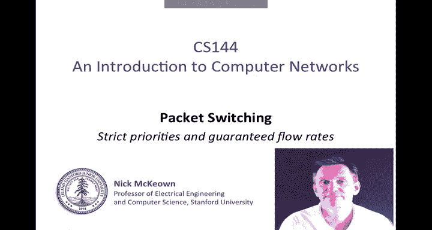
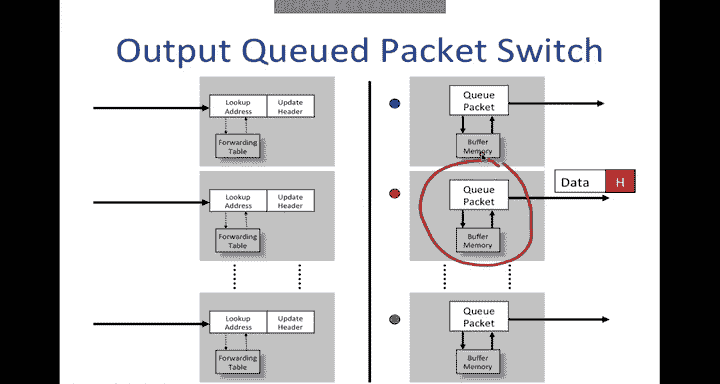
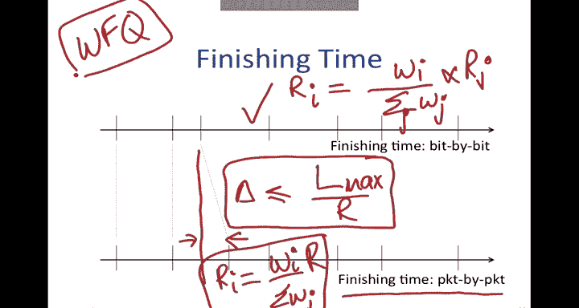
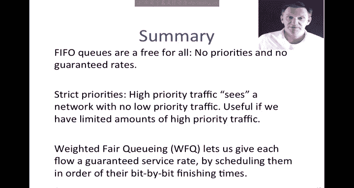

# 斯坦福大学《计算机网络｜Introduction to Computer Networking CS 144 2018》中英字幕deepseek - P49：-049-Packet Switching   Princi.zh_en - GPT中英字幕课程资源 - BV1bVqNYFEGg

In this video I'm going to start out by telling you some of the shortcomings of a PIO output queue and some of the problems that it causes。

 and I'm going to describe two alternatives， switches that provide strict priorities to give high priority and low priority traffic and those that can give a guaranteed rate to each of the flows passing through it。

Let's start by reviewing what an alpacuted packet switch looks like。

 This is an example we saw before where we had three packets arriving。

 their addresses will be looked up and they will be switched to the correct output in this particular case two red packets。

 meaning they'll go to that middle red output and blue one to the top。

One of the red packets gets to go， the other one is held back waiting for the link to be free。

 and then it goes on its way afterwards。So implicit here is the assumption that the output cu is a fiIFO。

 first in first out， and that's a pretty reasonable assumption for most router cues。

 but in what we're going to be looking at next we're going to be focusing on this output cu and seeing what some of the consequences are of it being a PIFO。

So a PIO Q is sometimes called a free for all Q。 If there are many packets flowing through this queue coming from the different inputs so I've drawn here three inputs to the queue representing the three inputs to the other inputs to the switch。

 So these are all packets that are coming through that are part of flows that are going to this one output。

 so we'll see packets coming out of here coming from all of those inputs and presumably at any one time when we have congestion we'll see packets queued up in this PIOq。

If there are many flows passing through the queue， whoever sends at the highest rate。

 whoever sends the most packets will， in fact， receive the highest usage of this output link。

 So in other words， if this one up here is able to get a whole load of packets into here。

 Well this one down here， the bottom input is only able to get a small number。

 this guy up here is going to hog this output link。

So if there's a really big hog of the flow going through。

 a little flow could easily get squeezed out completely。😊，People say that this this kind of50Q。

 while it's nice and simple， it encourages bad behavior because the best thing for a flow to do is to try and crowd out every other flow by sending as fast as it can。

 it would be a little bit like when you're downloading a web page。

 the thing to do would be to try and get your packets。

sent towards you at the highest possible rate to maximize the of the amount of the queue that you can get。

 it's not very friendly behavior， and it doesn't provide a good incentive for good good behavior。Now。

 imagine that some of the traffic was very urgent， for example， some control traffic。

 So let's say we had some urgent red packets here and that we had some less urgent green packets elsewhere。

 maybe there's another one that squeezed in in front of that and a green packet down here and a green packet down here and maybe let's just add in another red packet for good measure。

 So if these ones were more important。 what the fiIOq will do is simply send them out in the order in which they came in。

 So if we were to number the order in which they arrived。 say this was number one。

 this was number two， this was the third one to arrive。 This one was the fourth one。

 this the fifth one and the sixth one， they're obviously youre just going to go out in that order of one。

2，3，4，56 on the out line。 So not very good for the urgent control traffic or perhaps it's some important video traffic。

 So the fiIFO doesn't have any way to distinguish important。

 It just says if you got here first and there was room in the queue， you are the。

Most important packet。So we can't say anything meaningful about the rate of each flow sharing this cu。

😊，One little observation that's going prove useful later。

 And it's why I've labeled this as the size of the Q as B and the rate at which it's being served。

 the outgoing link R。 noticeice that if a packet does make it into the Q。

 So if I have a packet that does make it into the Q， let's say this one ends up at the tail of the Q。

 the maximum time it has to weight is B over R。Rightright， so the delay through that Q。

 we know is less than or equal to B over R。 So we're going to remember this。

 We're going to use this observation later。In this video I'm going to describe two alternatives to simplify for queuing the first one is called strict priorities where we give higher priority to some flows over others。

 and the second one is rate guarantees where we give a guaranteed rate or a guaranteed fraction of the outgoing link to each of the flows。

So basically we're going to take our single PIO that we had before and replace it with a more complicated mechanism here。

 we've simply replaced it with a high priority queue and a low priority queue so the inputs are just the same as before these are where packets arrive from the incoming links but now as a packet arrives。

 we're going to decide whether we to place it into the high priority queue or into a low priority queue and we do this based on bits in the header so when a packet arrives it might have a bit in the header and in IP there's a specific field for this it's called the type of service field。

And we might use that to decide which traffic is high priority and which is low priority We might do this。

 for example， to say that video traffic is more important than email。

 so we might want to put the video in the high priority queue and the email in the low priority queue or we might say that control traffic is more important than data because we always want to have high priority for the management traffic on the network or an operator might say that their gold users that their traffic takes strict preference over their silver customers and so that's a way of classifying users and giving preference to those who pay more。

The way that this actually works is when the packets arrive。

 so they would be placed and I'm going to put I'm going to put red packets in here and I'm going to put green packets in here for lower priority the basic discipline is this。

There's a scheduler that sits at the output here， and it's always going to take packets from the high priority if they are there。

 and it's only going to serve the low priority if there's nothing in the high priority queue。

The consequence is that high priority traffic doesn't see the low priority traffic。

 it's unaffected by it， because we only serve the low priority queue if the high priority queue is empty。

It's as if the high priority traffic has its own private network and doesn't see the low priority traffic at all。

 This is great for many types of many occasions where we want to give strict preference to another one。

 but it does run the danger of starving out the low priority traffic so you can only use it when there's a reasonably small amount of high priority traffic We don't want to completely ho the link and starve out this low priority traffic at all。

 but it is quite widely used and many switches and routes support this capability today。😊。

What if instead of strict priorities， we wanted to have weighted priorities？

What I mean by that is if a packet arrives into this queue here。

And packets arrive into this queue here。I want in some sense。

 for the traffic here to be considered to be twice as important as this here。

 not always having strict preference， but having twice as many opportunities to send。More precisely。

 I'm going to say that the rate at which this Q is served is going to be2 over2 plus1。

 So in other words，2 is a fraction of the total rate。Of the egress link。Likewise。

 I'm going to say that the rate that this one is going to be served is one that's its weight divided by the total weight times the outgoing link rate。

Okay， that's what I'm trying to accomplish。 I can generalize this to many cues as follows。

 This is simply just just increasing it from 2 to N， where Q I。

Is going to receive W sub I bits of service。And that's the that's its its weight。 So， for example。

 W1 here will have a rate R1 is W1 divided by the sum of all of the weights。 All right。

 that is the sum over I of w I times R。All the way down to， of course， W sub n。

 just as before R of n equals w of n over the sum。 I'll just write it like that times R of the outgoing link。

If all the packets were of the same length， this would actually be pretty easy。

 we would simply visit each of the queuees in turn and we will call that a round。

So one round is when we visited all of the queuees in turn。

And then we would send W sub I units so they could be bits or complete packets from each queue in each round。

 So on the outgoing line， we could have。We could have W sub1 bits from here。

 then we would have all the way through to W sub n bits from this one and then all the intervening cues as well。

 and so this would be round when we visited all of the queuees and you can see that the proportion that each queue has been served in that round is in proportion to the weights which is exactly what we wanted。

So if we could serve the packets as bits at a time and actually send them out as bits at a time。

 which of course we can't， but if we could， then this would actually pretty easy to accomplish what we wanted。

😊，We would simply classify the packets as they arrive into the queue that they are destined for。

And then we would serve those cues according to the W subi bits in each round。And then send them out。

Of course， packets are variable length and they don't consist of single bits。 And the problem is。

That real packets vary in size from。ForSomething like 64 bytes all the way to in the case of Ethernet。

 about 1500 bytes， there are jumbo frames that are even longer than this。 But even even here。

 we've got two orders of magnitude difference in packet size。

 So if we were to serve this packet by packet instead of bit by bit。

 it would really mess up the weights and we wouldn't accomplish what we were trying to do。 Clearly。

 we must take into account the packet lengths if we want to prevent long packets from crowding out a short ones。

So let me describe how we， how we do this。 I'm going to first describe it in terms of a kind of a thought experiment。

 I'm going to use this notion of rounds again， where we visit each Q in turn in a round。

And then we're going to send W sub I bits from each Q during that round。

But I'm going to assume that in addition to the cues that I have here， that I have another。

 I'm going to call it a magic cu。Just to remind us that this isn't really a Q。

 it's just going to be a processing element just to help us think about the problem。

 We're going to get rid of this in a in a minute。 So in round the first Q gets to send W sub 1 bits and the last Q gets to send W n bits。

And what we're going to do is we're going to imagine that we're going to serve each of these cues by that number of bits in each round。

And then when we get to an end of packet marker， which is the last bit in the last bit in a packet。

 So this would be the end of packet here。 And then let's say this is the end of packet here。

 Once we've got to that end of packet marker， we will construct complete packets and send them on the outgoing link。

 So that's what this magic cu is going to do。 It's going to turn those bit by bit into packet by packet。

 And so。This will be the end of packet bit here， and this is the end of packet bit here。

But this is recognizing that we can't send them out as bits。

 we wait until a full packet is accumulated and then send them out。So the question is。

 in what order should we be sending these out onto the line， when should we send them？

Because our goal is to meet the rate guarantees where each queue gets that weighted fair share of the outgoing line。

 So in what order should we send this packets in order to accomplish that。

I'm going to describe that next。So just as before， we're going to assume that time proceeds in rounds。

 so our unit of time is going to be rounds。And we're going to figure out。

If we were to service the packets bit by bit。Which round would they have finished in？Okay。

 so if we were to serve them bit by a bit， which round would they have finished in？Well。

 I'm going to start by making an observation that will give you a clue as to how we're going to use this。

Let's consider a packet here that's waiting to go。And that's considered the round in which it starts。

 we'll call that S of k and the round in which it finishes and we'll call that F subK。

Because we're serving everything in rounds and time progresses in rounds。

 we can say the finishing time of this packet is its starting time in rounds plus the length of the packet divided by w of1。

That's because。That first Q will receive exactly W sub 1 Bs of service in each round。

 So its finishing round is its starting round， plus its length divided by the number of bits it gets served per round。

 Okay， so this is the finishing time here。Now let's think about what happens when a packet arrives。

So we're going to try and calculate the starting time of that packet when it arrives， in other words。

 what time will it enter service？And what time will it finish service might be surprising that we can do this。

 but I'm going to show you a way we can calculate both its starting time and its finishing time when it arrives。

So the starting time of that packet， the time at which it starts to end a service is going to depend on what's ahead of it in the queue。

 So if we're keeping track of the finishing time of this packet in rounds。

And we want to know what the starting time of this next packet here and itss finishing time。

 we can do the following calculation。 So this is the finishing time of the K minus1 packet。

 It's the one that's ahead of it in Q。We can say that the starting time of the packet K is going to be simply the finishing time of the packet ahead of it because。

We're proceeding in rounds， so it will be immediately entering service as soon as the one ahead of it is finished。

Unless the queue happens to be empty and there's nothing ahead of us。

 in which case it will enter service Now， there's going to be the max of these two values。

 the max of the finishing time of the packet ahead of it and now。

The second thing that we can say is that the finishing time of k is its starting time plus L over w1 just as before。

Becauseuse we know that's how much so is。 So the combination of these two gives us a recursion that so long as we keep calculating the finishing time and keep track of that。

 we can calculate the starting time and the finishing time of packets as they arrive。

There's a pretty neat property。And then what we're going to do is we're going to service the packets。

 In other words， we're going to take the packets from head of line。 so here is a scheduler。

 it's going to be examining the head of line packets。And it's going to pick the one with the lowest。

F， the lowest finishing time。 So it'll pick the packet with the lowest finishing time。

 So that's what the scheduler does。 So we calculated the F of K when the packet came in。

And then when it gets to the head of line， it's competing with all the head of line packets to leave。

 and the scheduler is simply going to pick the one with the lowest finishing time。

This has the nice property that finishing times can be determined when the packet arrives。

And the packets are served in order of their finishing time。

 which at least intuitively seems like the best thing to do。

 It turns out that it's more more than just intuitively a good thing to do。

I'll show you why it actually is the right thing to do。If we plot the finishing time of the packets。

 if they were being served bit by bit。 In other words。

 the time that the end of packet bit would leave on the outgoing line if the packet was being served bit by bit。

 it might look something like this。 I it just something I sketched。

If we look at the finishing time of the packet by packet scheme where each packet goes and must wait for the packet ahead of it to finish before it can go on the line。

Packets could end up actually departing a little bit later because they could be held up by a packet that's still in service。

 So there could be a little bit of a delta。Between when the packet would finish bit by bit。

 and we know if it's bit by bit， then the rate that it will receive the Q I would receive will be W sub I。

Over the sum of the WJs， in other words， the weight that we're looking for of the outgoing lines。

If this was being met， then we know that would be true。In the packet by packet scheme。

 it can be proved there the difference in the time that it will depart under the packet by packet scheme is no more than。

Lmax， the maximum length packet divided by R later than under the bit by bit scheme。

And that's true for every single packet in the system。

So this is really useful because over a long period of time。

 this tells us that the same number of bits will have departed as under the bit by bit scheme。

 they'll just be jiggleled around a little bit。 there'll be a little variance in the actual departure time。

 but measured over a long period of time。 So under this packet by packet scheme R of I will be the same as it was before。

 So it'll be that weight of I divided by the sum over a Wj of R。

 So this will accomplish exactly the rates that we want。

This scheme is often called WFQ or weighted fairqueuing weighted fairqueuing is a pretty famous technique you can find lots of references to it。

 it's also known as packet by packet generalized processor sharing but if you look under WFQ you can find lots of references to it but what it essentially tells us is tells us a specific mechanism for calculating the finishing time of packets and scheduling them so that we can give weighted fairness weighted usage of the outgoing link and rate guarantees to each of the flows。

In summary，5IOQs are a bit of a free for all， they have no priorities， no guaranteed rates。

 and there's an incentive for a flow to send as many packets as it can into the queue so that it maximizes its share of the outgoing link so they kind of encourage bad behavior。

😊，So instead， it's quite common to use strict priorities。

High priority traffic could see or experience a network with which appears to have no low priority traffic at all。

 it's unaffected by it。 This is useful if we have limited amounts of high priority traffic like control traffic in the network。

But if we want to do something that is more of a weighted priority。

 then we need to use something like weighted forqueuing。

 which lets us give each flow a guaranteed service rate and we do that by scheduling the packets in order of their bit by bit finishing times。

😊。

That's the end of the video。