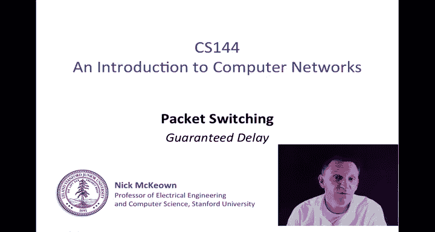
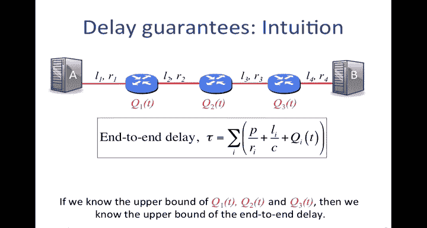
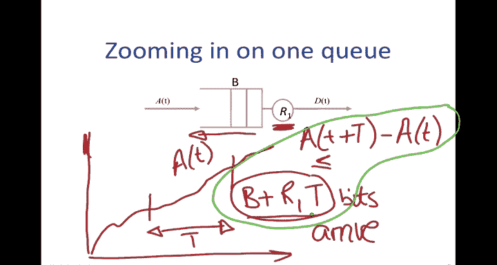
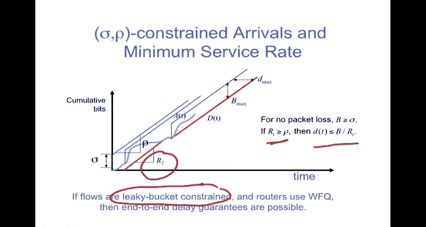
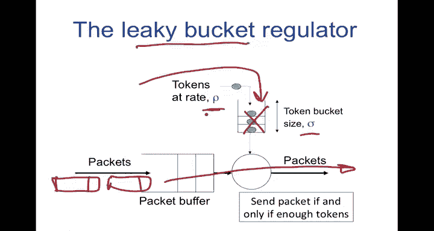
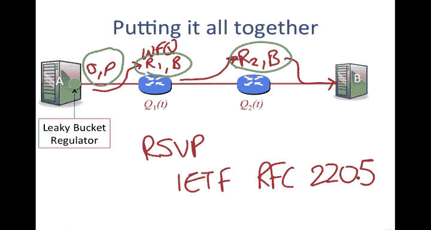
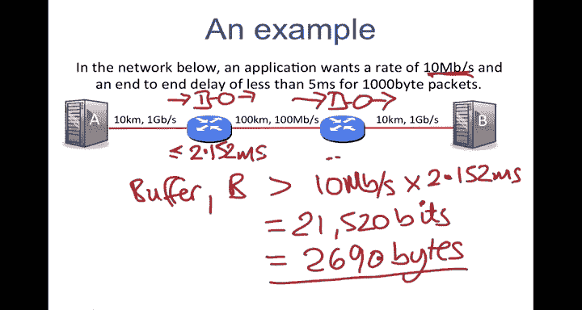
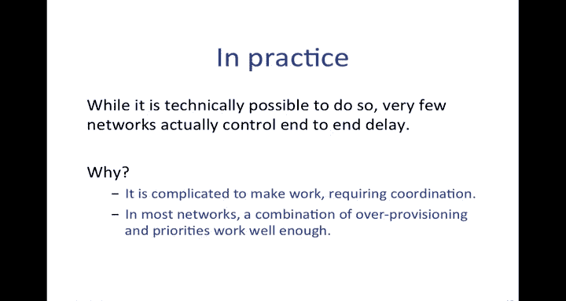
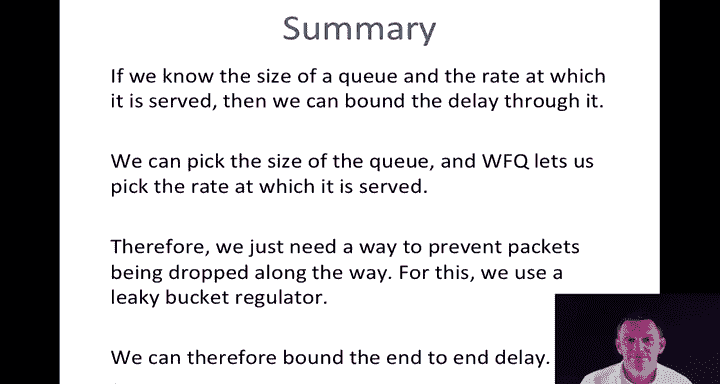

# 斯坦福大学《计算机网络｜Introduction to Computer Networking CS 144 2018》中英字幕deepseek - P50：-050-Packet Switching   Princ.zh_en - GPT中英字幕课程资源 - BV1bVqNYFEGg

In this video I'm going to continue the description of packet switching and in particular I'm going to tell you about how we can guarantee delays from one end of a network to another this may come as a bit of a surprise because in earlier videos I was telling you about how the queuing delay is variable and so we generally cannot control the delay through the network but we're going to use special techniques that rely on the weighted fairqueuing that we learned in the rate guarantee video so you should make sure you watch that one first。

Let me start with giving you some intuition on how delay guarantees are going to work So recall our end to end delay equation。

 which tells us the delay from one end of the network to the other as a function of the packetization delay that is the fixed component of the packet length divided by the rate plus the propagation delay which is the length of the length divided by the propagation delay or the speed of light。

 plus the queuing delay。And the first two terms are defined as fixed fixed functions of the network。

 They depend on things under our control。 Normally the queuing delay is not under our control。

 So if we want to provide an end to end delay guarantee。

 then we're going to have to provide a delay for the queue through every router along the path。Okay。

 so the basic idea is if we know the upper bound on Q1， Q2 and Q3。

 then we know the upper bound of the endtoend delaylay overall from this equation。

So how do we do that？So if in a router I know which cues a packet passes through and I know the size of the buffer。

 so let's say I'm looking at packets that are going to go through this queue here inside the router。

 I know the size of the buffer is going to go through and I know the rate at which that buffer is going to be served。

Then I know the maximum delay that a packet can encounter through this router。

Because WFQ waited forqueuing that we saw in the rate guarantee video gives me a rate R1。

 and then I can simply say that the delay through this router will be bounded by the size of the buffer divided by R1。

 the rate that it achieved。So and remember that that r1 equals the weight that I was going to give to that first one divided by the sum of all the weights times r。

So I can control R r1。I can pick a B， therefore I can pick the delay through the router。

How do I actually do this in practice， let's take a look at that。

So we can control the delay of the packets from things that we already know what we already know how to control is the rate at which a Q is served using WFQ and the size of each Q。

This suggests a model for a router where we classify the packets as they come in。

 So this is the arriving packets， and I'm going to classify them。

 and I'm going to decide the flow to which they belong。

 and then I'm going to stick them into that queue。 so if they had gone into another queue down here。

 that might have been possible， which is going to be serviced at that rate R1。

And this one would be at rate R N。 and then they're going to come together and go onto the outgoing line of rate R。

So if I can set this at the correct rate， I can set the size of the buffer。

 then I can control the delay Any packing packet arriving to the router will have a bounded delay and if we add up all the components of delay correctly using our equation。

 then we can make it work end to end according to what we know This works for packets that make it all the way through。

But here's the problem。What if a packet arrives at such a rate？

That it overflows the buffer here and falls under the ground。In other words。

 that we fill up this buffer just because of the arrival process to this queue。

So this is really the remaining problem that we have to solve because there's no point in having an end end delay guarantee if packets are going to get dropped along the way。

 that's not really a delay guarantee。😊，So we need to figure out how we can prevent that buffer from overflowing。

 and if we can do this， then we've solved our overall problem。

So how do we make sure that no packets are dropped So we're going to zoom in on one Q and take a look at this and we're going to go back to something that we saw before。

 which was our our simple deterministic model of the dynamics of a Q so you'll remember that we had for a Q like this。

 we could model it as the cumulative bytes。 so。Cumulative。bits so by。

 actually I'll say bits because it's going to make it a little easier to explain。

As a function of time。 So this is the time evolution。

 And you remember that we that we said we have the cumulative arrival process。

 which might look something like this。And then we're going to have the cumulative departure process。

 which is going to be the times at which the queue is empty。

 we're going to serve it at some fixed rate， and then it'll pause until there's enough accumulated。

 some accumulate it and then so on， and then it'll pause and so the rate at this point is slightly less than the arrival rate。

So here we have A of T， the arrival process， the cumulative arrival process， and here we have D of T。

 the cumulative departure process， And you'll remember that if we are interested in the delay of individual packets through this queue or in this case。

 individual bits， we take the horizontal distance， this is the time that a bit arrived。

 this is the time that that bit departed because it's a POq that we have。Then the little D of T。

 the delay。It's simply the horizontal distance。And the maximum size of the buffer that we need is the maximum horizontal distance between these two lines because that's the maximum distance between what's arrived and what's departed。

So if that vertical distance grows too big， grows to larger than B。 So this here is Q of T， right。

 the amount that we have in the Q at only one time。 If Q of T grows to be greater than equal to B。

Then we're going to have packets that are going to get dropped onto the floor。

 How are we going to make sure that this doesn't happen？

This is what we're going to look at next and as I said， if we can solve this。

 then we can provide the delay guarantee through the router that we're looking for。

The way that we're going to approach it is as follows。I'm going to resketch this deterministic cu。

Marvel， so this is this is our and I'm going to focus now just on the arrival process。

 So this is a cumulative arrival process A of T。 It just needs to be non decreasing to be to be plausible。

And we're going to say that in any time interval， so in any time interval。

 let's take a time interval like this。If we can guarantee that no more than B。Plus。

R 1 times T where T is the time interval。We can say that no more than B plus r1 time T bits arrive。

Then the buffer can't possibly overflow。So this would be over any time interval T。

Because we know it's being drained at rate r1 so r1 times t will have departed。

 we just need to make sure that we haven't accumulated more than B in any time interval。

 so if we make this T any value and we never violate this。

 then we can be sure that we've never overflowed the Q。So in other words， A of T。

At the time t plus capital T minus the occupancy or the cumulative arrivals at time little T is less than or equal to this expression here。

 B plus r1 times t。So if we can make sure that this guarantee is met， in other words。

 this expression defined here。Is met。Then the queue will never overflow so we know the delay is guaranteed because we're serving at rate R1 and we've given quite a lot of leeway to the arrival process A of T。

 we've constrained it to make sure that it must fit within this requirement that in this timeframe no more than B plus R1t。

 but we've given it some leeway on how it accomplishes this。

So let's look at this in a bit more detail。

We're going to constrain the traffic and we're going to use use a fairly well known technique for doing this。

' something that's called Sigma row regulation。 I'll tell you what Sigma row regulation is it's basically the idea I I just told you。

So if this blue squiggly line here is our arrival process， our cumulative arrival process， A of T。

I'm going to say that the number of bits that can arrive in any period of length t is bounded plus by sigma plus row T。

 so this is just like my B plus row 1 t equation just now。

We can think of this as in any time we can draw that Sigma plus row T by this blue line here。

And we could start it at any point， and you can see that it's basically saying that if we touch it down on any point of A of T。

A of T in the future must lie below that line。 So wherever we start， whereverver we slide this。

 it must always lie。 The A of T must always lie underneath it。 If that is true。

 then this equation holds， and we say that A of T is sigma row regulated。

You can see that A of T has quite a lot of leeway on how it fits under that。

 it just must never exceed it starting from any one point so in our example Sigma equals B and rh equals r1 and the only reason I'm telling you about Sigma rh regulation is that you'll find it commonly described in textbooks as Sigma rh regulation and in our example I just happen to use B and R1 for the QI was looking at。

Okay to reiterate this point then if I've got Sigma row constrained arrivals and a minimum service rate。

 so my minimum service rate here is R1， that's the rate at which the queue is being served。

I've got a。Cumulative arrival process here。The， the。

 the green blue line and then the departure process here， the red line。

And I'm going to constrain A of T to always lie below the sigma row line， the sigma plus row T line。

Remember that this constraint must be held for all times wherever I start the sigma plus row T。

 So if I slide it along， for example， starting here and starting here。

 it must be true on all of those occasions。 But if I do that。

 then I know that the distance between A of T and D of T is less than the distance between this blue line and D of T。

 And so therefore， I can constrain both Bax， That's the maximum Q occupancy I need to never overflow and Dax。

 the maximum delay of any bit through the Q。So in summary。

 for no packet loss I need that B is greater than equal to sigma and if the rate at which I'm serving is greater than this row。

 then the delay is less than or equal to B over r1。

 so I've now bounded the delay based on things that I can control B and R1。

Still doesn't tell me how I'm going to do this。It just tells me that if I can constrain AFT。

 then this will all hold。And so what I'm going to tell you next and describe is that if the flows are what we're going to call leaky bucket constrained and the routers use weighted forqueuing then end to endleg guarantees a possible So what is this leaky bucket constrain Well it turns out the leaky bucket is something that implements the sigma O regulator and therefore makes all of this work。

Let's take a look at what that leaky bucket is。So the leaky bucket regulator looks like this packets are going to arrive。

 so here are my packets arriving here。And they're going to go into the packet buffer。

 And the rule is that I can send or I can take packets out of the buffer only if there are enough tokens and the tokens are being are being made available here at a particular rate row and the token bucket sizes of sigma。

 So the tokens here are just a scheduling mechanism。 The tokens don't go out under the wire。

 This token bucket is just a way of holding and implementing the scheduling mechanism that constrains the traffic。

 So this is something we're going to do at the source at a when it's sending the packets under the line。

 We're going to make sure that they are sigma row constrained using the leaky bucket regulator。

It can send them under the wire if and only if there are enough tokens in its bucket。

So it's going to accumulate at rate row with burst in a sigma， in other words。

 the maximum that it can have in that bucket is sigma。

And then it will send a packet if there are sufficient tokens that allow to send a packet of that size。

 so if the tokens are in bits， then have to have enough tokens to represent the packet that you're trying to send。

And as soon as you send them， then you use up the tokens and you' got to wait for more to be to be put in and you can probably see how this will make sure that we're allowing for bursts of up to sigma。

 but over on the long term rate is only a row and so that will meet the constraint that we want。

 So putting it all together then what have we got。

We have a。Sigma row constrained traffic here。 So this would be our sigma row constrained traffic going in that's coming out of our leaky bucket at a。

Each each router is going to run WFQ waited for queuing in order to make sure that we get a service rate of R1 for that particular flow and a buffer size of at least the B that we need。

And that will be at each one so we'll have R2 here and B。And along the path。

 we're going to take the packets and make sure they're going into the correct queue that is being serviced at that rate。

 so we call that packet classification to put it into the correct queue and then eventually it will find its way。

Then we can use our equation for end to end delay。In order to calculate the entire delay along the path。

So you may be wondering how these values of sigma and row？

And the values of R1 and B and R2 and B get told to the routers and the source along the way So there's actually a protocol for doing this for setting this up initially and this is something that's called RFVP or the resource reservation protocol and there is an ITF RF that will tell us all about what we're supposed to do and it's number 2205。

 you can find this in any textexbook， you can go and look at the RF or if you look it up in in Wikipedia you'll find a good description of this。

 So this is how we populate these values in the first place。

 how it is that end to end the control system is able to install these values along the path。

 So let let's look at a workeded example of this now。

So imagine that in the network below。WeWe want an application to be able to send at a rate of 10 megabits per second。

And have an end to end delay of less than5 milliseconds when it sends  thousand byte packets。

 let's see how we would do that。So first of all， let's calculate the fixed portion because there's nothing we can do about the fixed portion of the end to end delay that's going to be made up by the packetization delay and the propagation delay。

 So let's look at the packetization delay first packetization。Delay。Andd to end is going to be。 Well。

 it's the sum of the packetization delay across all of the links。 So on the first link。

 I've got1 thousand byte packets that I'm sending。 so they are1 thousand times 8 bits。

Divided by the rate that they're going to go over the first link， which is a one gigabit per second。

 So that's 10 to the power of9。And plus， oops， plus， I need。

The same thing for the thousand byte packets going over the100 megabit per second。

 which is 10 to the8 and then I'm going to have the same thing over here for this so I'm just going to multiply this by two because the last link is the same。

And then， I've got the。Proagation， delay。The propagation delay along all of these links。

 which is going to be the。The length of the length， which is 10 kilometers divided by the rate。

So I've got 120 kilometers in total。120 kilometers。

 so that's 10 times 10 to the 30 meters divided by the propagation speed， speed。

 which I'm just going to assume is two times 10 to the eight meters per second。

And so if I add these two together， I've already done that and that comes out as 0。696。

696 milliseconds。 So I've got a fixed propagation delay of 0。696 milliseconds。 And so therefore。

 I need the sum of all the queuing delays along the path to be less than or equal to the difference between that and 5 milliseconds。

 So that needs to be less than 4 point。3，0，4， milliseconds。Okay。

 so we're going to remember this number because I'm going to clear this and then we're going to figure out how to make that work。

So let's choose to split the delay。That at the queuing delay equally amongst the two routers I can actually do this in any way I want。

 it's going to make the math easier if I split it equally， In other words。

 it's going to be just over two milliseconds for each one so let's clear that。

So I'm going to make it so that the through here is less than or equal to 2。1。 What is it。

152 milliseconds and the same thing here， right So I'll just draw that。 That's the same value。

Now I know what the rate is of the flow， it's 10 megabits per second。

 so I know the rate at which the queue is going to be serviced。

 that's going to be 10 mill 10 megabits per second。Now I'm trying to figure out how big B should be。

 how big should the buffer be。So B， the size of the buffer。The buffer in each one。

B needs to be large enough that I never drop anything。

And so it's got to be greater than 10 megabits per second。

 because that's the rate at which it's going to be served。Times the duration of a bit through it。

 while we already know that's 2。152 milliseconds。Okay。

 and so this ends up as 2000 or what is at 21520 bits。Which is。2690 bys。

So I've got roughly three packets worth of delay that I must have so basically what this tells me is using weighted forqueuing I will serve each of these cues at a rate of 10 me per second I know I need to do that in order for the system to meet this 10 megabit per second requirement and I will assign a buffer at each of those routers to be at least 2。

 2690 bytes。At each of those along the path， then if I add up all of the delays。

 my overall end to end delay will be less than or equal to5 milliseconds。

 which is what I was trying to achieve。

So in practice。It's as I've shown you， it's technically possible to provide this end to end delay。

 but actually very few networks actually control the end to end delay In other words。

 this is not really used very widely in practice Why is that Well it turns out it's quite complicated to make it work it requires coordination amongst all of the players all of the network operators。

 the end to end the routers along the way and in practice this hasn't really taken off and in most networks the combination of over provisionvising and priorities of traffic so giving high priority to those that need special treatment has proved to work well enough in most cases。

I wanted to go through and tell you this because if you can understand how this whole weighted fairqueuing mechanism works and how we can provide end to end delay guarantees。

 you understand a lot about the queuing dynamics of a packet switch network and also it's quite likely that some of these ideas will be used in some networks in the future so they should prove useful to you。

And so in summary， if we know the size of a queue and the rate at which it's being served。

 then we can bound the delay through it。We can pick the size of the queue and using weighted fairqueuing。

 we can pick the rate at which the queue is served。

 Therefore we just need a wave to prevent packets from being dropped along the way for this。

 we use a leaky bucket regulator。And with that， we can therefore bound the end to end delay。

That's the end of the video。