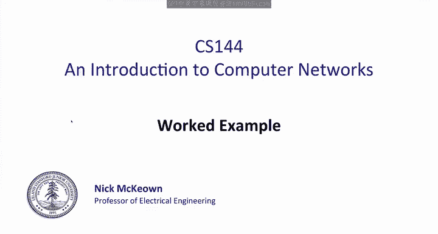
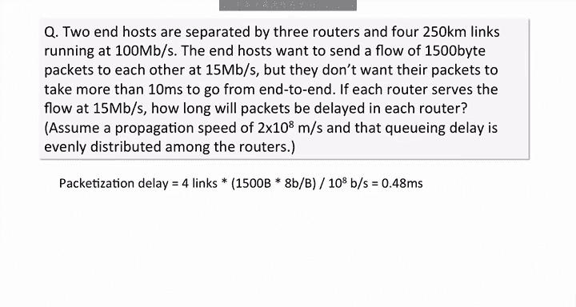

# 斯坦福大学《计算机网络｜Introduction to Computer Networking CS 144 2018》中英字幕deepseek - P51：-051-Delay Guarantees Exampl.zh_en - GPT中英字幕课程资源 - BV1bVqNYFEGg

Let's look at a worked example for delay guarantees。

Two end hosts are separated by three routers and4 250 kilomet links running at 100 Mbit per second。

 The end hosts want to send a flow of 1500 by packets to each other at 15 mebit per second。

 but they don't want their packets to take more than 10 milliseconds to go from end to end。

If each router serves the flow at 15 Mbit per second， how long will packets be laid in each router。

We can assume a propagation speed of2 times 10 to the8 meters per second and that the queuing delay is evenly distributed among the routers。

From the question， we know that a third of the queuing delay will be in each of the routers。So first。

 we need to figure out what the queuing delay is。The queuing delay will be the total delay。

 which is 10 milliseconds， minus the fixed delay， which is the sum of the packetization delay and the propagation delay。

So let's first calculate the packetization delay， which is the time to transmit a 1。

500 byte packet onto each of the four links along the path。For each link。

 the packetization delay is 1，500 bytes times 8 bits per byte。

 divided by 100 megabits per second or 10 to the pair of eight。

This gives us a total packetization delay of 0。48 milliseconds。

Now let's calculate the propagation delay， which is the time taken for one bit to reverse all four links。

The time for each link is 250 kilometers times 100 meters per kilomet divided by the speed of propagation。

The total time will be5 milliseconds across all four links， so a total fixed delay is therefore 5。

48 milliseconds。This means the queuing delay is 10 minus5。48 equals 4。52 milliseconds。

Which we are told is divided equally among the three routers。

 therefore the queuing delay in each router can be no more than 1。

507 milliseconds The answer is therefore 1。507 milliseconds of delay per router。

We could go on and calculate the amount of buffering needed in each router to hold 1。

507 milliseconds of data。Given that the queue is being served at 15 mebits per second。

 this corresponds to 1。507 milliseconds times 15 megabits per second， which is 22，605 bits。

In practice， we'd round this up to at least two packets， which is 24，000 bits per router。

