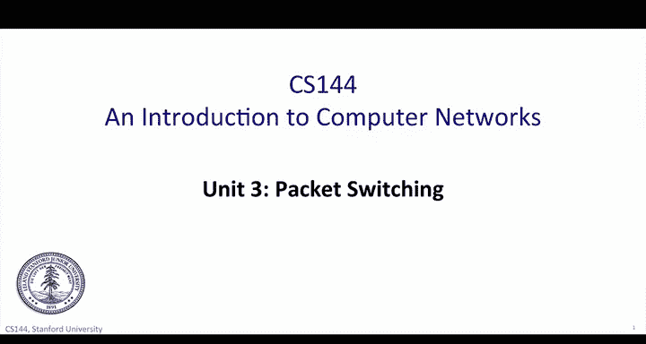
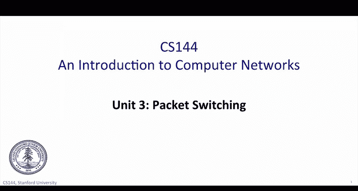
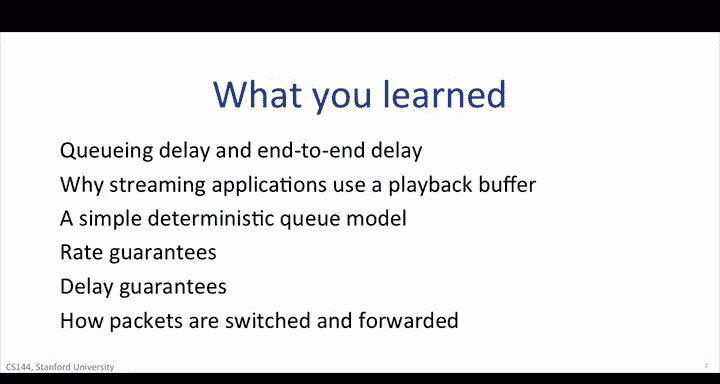
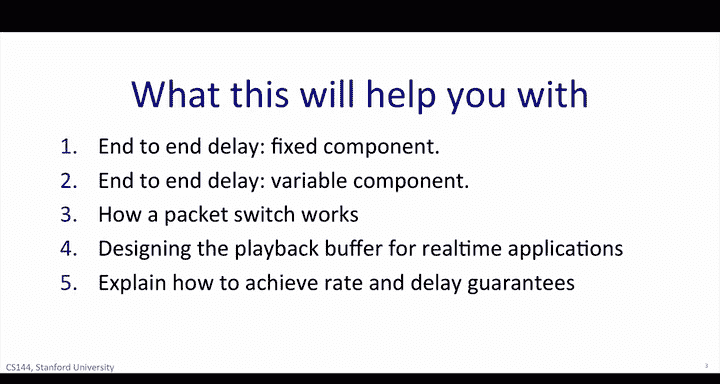

# 斯坦福大学《计算机网络｜Introduction to Computer Networking CS 144 2018》中英字幕deepseek - P52：-052-Packet Switching recap 6.zh_en - GPT中英字幕课程资源 - BV1bVqNYFEGg

In this unit you learned a lot about packet switching。 This was an intense unit。

 We started out with a look at why modern networks， including the internet。

 are built on a foundation of packet switching。 packet switching is simple in the sense that each packet is a self contained unit of data that carries the information necessary for it to reach its destination。

Aacket switchitching is efficient in the sense that it keeps a link busy whenever there's work to be done rather than have dedicated capacity reserved to reach user or application。

Backet switching can potentially help the network recover quickly from failures。

 the simple forwarding paradigm with no per flow state in each router makes it easier to quickly route around Lincoln route failures。

😊，Next， we dived deep， deep， deep into some of the consequences of packet switching。

This took us on a journey that included more math than you'll see in any other unit of this course。

Packet reaching dynamics determine many of the timing and performing characteristics of the internet。

 and so you really really need to have a strong understanding of the packet dynamics。😊。

The main mathematical ideas are not that complicated and it's worth mastering them now so you can build a strong intuition。

😊，You know now， you now know why two packets travelling between the same two end hosts might encounter a different delay。

While the time they spend traversing each link is the same。

 the packets might take different paths and experience different queuing delays in the routers along the way。

It's absolutely crucial that you fully understand the main three components of packet delay。

 the packetization delay， the propagation delay and the queuing delay。

 and that you understand the physical processes that cause them。

You should get into the habit of sketching and using the simple deterministic Q model that I taught you。

 It's a simple geometric construct， and it lets you visualize what's going on。

 It tells us why routers have buffers and gets us thinking about how big they should be。

 It tells us why streaming applications need a playback buffer to give a smooth listening or viewing experience for the user。

😊，We'll use the same method later when we study congestion control as well。Finally。

 we used the simple deterministic model。😊，To learn how a network can go beyond just simple firstcom first serve packet delivery。

 packet switch network can guarantee the rate that each flow receives and even bound the delay of packet experiences from one end of the network to the other these required some careful thinking about don't worry if it took a long time to get the hang of it as there's some difficult concepts at first。

But they're important if you can understand how a packet switch network can provide both rate and delay guarantees。

 then you have a strong understanding of how packet switching works。

You learned a lot in this unit。First， queuing delay and end to end delay。

 you learn that the time it takes for a packet to travel between two end hosts is determined by three components。

First， we have to transmit the packet over each link in turn。

 the time it takes to write the packet onto each link is determined by the time it takes to write each bit multiplied by the number of bits in the packet。

We call this the packetization delay。Second， the bits have to propagate down the cable are through the air to the other end of the link。

 The propagation delay is determined by the speed of propagation。

 which is close to the speed of light and the distance the bits travel。

Make sure the difference between propagation delay and packetization delay is clear in your mind because it's a frequent cause for confusion。

Third， the end to end delay has a variable component， a queuing delay。

 because the internet uses packet switching， the routers have to have buffers to hold packets during time of congestion。

 and so the queuing delay depends on how busy the network is right now Later when we study wireless。

 you'll see that wireless links add more variability the delay because wireless links are noisy so packets frequently need to be retransmitted and they can actually have variable and changing packetization delays。

Real time streaming applications such as Skype， YouTube and Netflix need to deliver continuous real time voice and video to our ears and eyes。

 even though the network delivers packets at unpredictable times。

All streaming applications use a playback buffer to smooth out the variations and packet delay so they can play the video and audio to the user without having to pause and wait for new data in the middle。

You learned how to design a playback buffer， and you learned why it is not possible for the internet to completely avoid pauses in the playback。

 Packs can experience a large delay causing the playback effort buffer to run dry。

If you fully understand how a playback is designed。

 then you have a good understanding of packet dynamics on the internet。

Quuing delay in routers is a complex topic all on its own。

 The few of queuing theories very mathematically rich。

 and you can take classes and read many books just on this topic。In general。

 cues with complicated random arrival processes are complex beasts。

A network consisting of a series of router cus with many computing flows from random users and different applications way hard to understand analyzing closed form。

But our goal here is much less ambitious。 We want you to develop some intuition about how cus evolve and how to become familiar with their dynamics。

 just like the Cud airport security， a router few holds the packet that have arrived。

 but not get departed。If we can keep track of arrivals and departures。

 then we can know how deep the queue is and how long an arriving packet must wait。

The deterministic Q model is a geometric representation of packs in the queue。

 letting us visualize how the Q evolves over time。It's good practice to use this geometric model to help you build your intuition of how the math works。

The deterministic Q model helps us understand rate guarantees。

Sometimes we want a particular flow of packets to receive a particular fraction of the network capacity。

 for example Stanford might have a contract with the AT&T guaranteeing that its traffic will always receive at least 10 gigs per second of service。

Over the link that attaches this to AT& T that's easy to do。

 we simply connect it with a 10 gigit gigabit per second link。

ATT&T could also make this guarantee by putting all the Stanford packets into a queue in their routers。

 making sure they have 10 gigabits per second of service。

This can be done in very aggregated traffic like all of Stanford's packets。

 or can be done in individual applications， we might ask Comcast to provide at least one mebit per second to stream our Netflix videos。

You learned how to serve every Q&A router at a minimum rate。If all packets were the same length。

 this would be trivial。But different packets have different lengths。

 and so we need to take into consideration how long each packet is。

This is where weighted for queue income comess in。It tells us the correct order to serve packets in the router queuees so as it take into consideration the length of individual packets。

This same idea can be extended to provide play guarantees。

Now we know how to control the rate at which a queue is served。

 we can control the maximum delay a packet can experience in the queue。

 It is simply the length of the queue divided by the rate。

All we need to do is limit the length of the queue so we can bound the delay。Finally。

 you learned how packets are switched and forwarded。As you saw。

 Ethernet switches and Internet routers work in very similar ways when a packet arrives。

 it looks at the destination address and its forwarding table if it finds the address it forceds the packet to its destination。

 holding it in a buffer if the outgoing link is currently busy。

Ethernet Ethernet switches and internetnet routers differ in which address they use and how they organize the forwarding tables。

And of course， an internet routeutr is to decrement the TTL field to prevent loops。

 but at a high level packet switches all operate in roughly the same way。

The things you learned in this unit will help you in several ways。one。

You can take the description of a network， the rates and length of the length。

 and the length of a packet， and you can figure out the fixed component of the packet's end to end delay。

You can visualize the variable queuing delay by sketching the queue。

 which is the most common cause for variable end to end delay in a network。😊。

You can explain how a packet switch works， such as an ethernet switch or an internet router。

You can design a payback offer for a real time application。

And you can explain how a flow traversing a packet switch network can be delivered at a minimum rate。

 and you can explain how individual packets could have a bounded delay from end to end。

