# 斯坦福大学《计算机网络｜Introduction to Computer Networking CS 144 2018》中英字幕deepseek - P55：-055-Congestion Control   Basi.zh_en - GPT中英字幕课程资源 - BV1bVqNYFEGg

In the next few videos we're going to be looking at congestion control congestion control is a really important topic for networking because whenever we have a network。

 particularly a packet switched network like the internet。

 it will always encounter congestion either for short periods or long periods。

Controlling that congestion to stop the network from collapsing is really， really important。

 And so we're going to be learning about what congestion is。And how to control it。

 basic approaches to congestion control， and then we're going to look specifically at what happens in the internet and congestion control happens inside the TCP protocol and TCP has explicit support for congestion control and we're going to be looking at how it does that and how that's evolved over time and then what some of the consequences are of those decisions。

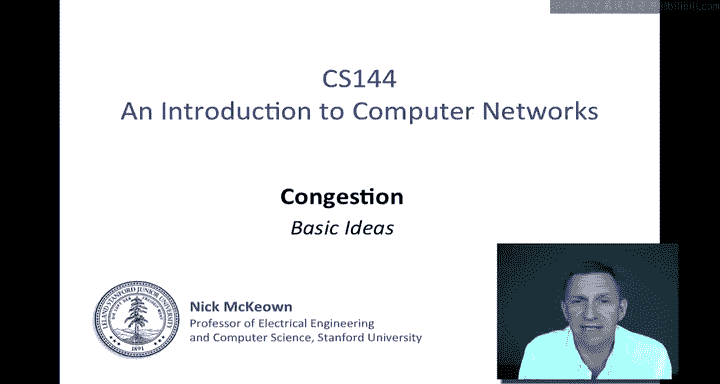

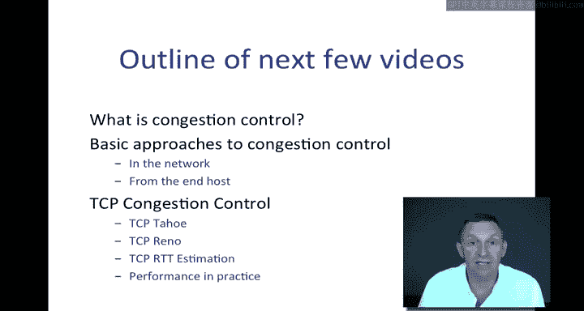

Let's start by thinking about what congestion is Congestion can take place at multiple timescales。

 I'm going to offer you three examples here， and the first one is at a very short time scale when packets are colliding at a router。

 So for example， imagine that we've got two packets。

 the first one arriving here in red and the second one arriving shortly afterwards。

 both detined into the same output。And because they've both arrived at the same time。

 one of them will get to leave， the other one will be queued。

 and there'll be a temporary buildup of the queue in the router。

A second form of congestion at a slightly longer time scale is at the flow level operating at the timescale of round trip times or multiple round trip times。

If you think of a flow as a communication like a TCP flow where the communication is taking place over a fairly long period over multiple round trip times。

 for example， downloading a webpage or sending an email。

 then the rate of the flow might change and I've shown one here in red and one here in green and these may both be passing through the buffer of a router trying to get out to the same outgoing link。

 if their combined rates exceed the outgoing link rate as seems to be the case here then the buffer will build up and eventually it will overflow。

 and so we'll need to do something to prevent those flows from continuing to overwhelm that link otherwise we're just going to drop a whole load of packets and have a collapse and the performance of the network。

The third type is at a much longer timescale， which is sort of a human timescale when there are just simply too many users using a link during a peak hour。

 this might be a link connecting to a very busy web server like CNN。com or Google。

com and in the morning people might come in and all want to access the same link while they're reading their coffee and it might overwhelm it and so this would be at a longer timescale。

The one that we're going to be most interested in when we're talking about congestion control is this one in the middle。

We're going to look at how congestion can be controlled for TCP flows in particular that are lasting multiple round trip times where we have the opportunity to communicate to the sender or send information back to the sender or for the sender simply to learn that it should change the amount of data that it puts into the network so as to prevent sustained congestion from happening of the routers。

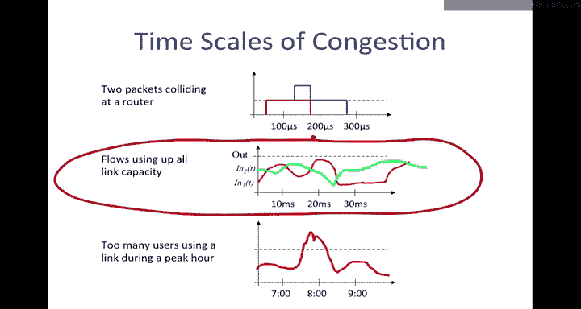

Let's take this a little bit further and think about what congestion is by way of an example。

So we look at the example here where sources A and B。Are trained to send to the same destination， X。

And their flows， are they're both wanting to send at 12 mebits per second。At a sustained rate。

 but the link from the router to X is only capable of sending it 12 megabit per second。 By the way。

 there's nothing magical about the numbers 12 here other than it's going to make the math a little bit easier So a has consented a sustained rate of 12 B consented a sustained rate of 12 and this link here which is the the departure rate from the router buffer。

And the just before the outgoing link is only able to send at rate 12。

So if we look at one of our deterministic Q models and just assume that this is at a sustained rate。

 so this will be T， and this will be the cumulative。The cumulative data sent。

 so we'll just think of this as the cumulative bits sent on a link。We will have。A1 of T。

It will accumulate at 12 megabits per second， so the gradient of this will be 12 megabits per second。

And so will A2 of T， I'm not going to try and draw that superimpose that。But so will D of T？

So if we look at the sum of a1 plus a2。So this would be a1。Plus a2。And of course， this here。

 let me draw this in a different color。This would be D of T。

And we can see that there will be a queue that will build up。Q of T。

And Q of T is just going to grow and grow and grow。

is going to keep growing as because the the arrival rate is exceeding the departure rate。

 so hence eventually packets will be dropped and retransmitted。Notice that the。

The transmissions are going to add to the traffic in the network because there's going to be more traffic sent down here because of these retransmissions and it's going to make it even more congested so congestion can actually have a feedback effect of making things worse by causing even more traffic to be sent into the network。

Also， it means that that the。That the arrival rate here。

 although it will be a sustained arrival rate into the queue。

 it must in some sense be truncated because the departure rate obviously can't exceed 12 megabits per second。

Now let's assume for a moment that the buffers are infinite。

Think about what we would actually like to have happen here。Let's say that instead of a1 of T。

 this is rate R1 the first that A would like to send in it， and we'll call this one R2。

And we'll say that the rate here is R because then of course， these could be any values in practice。

It's reasonable to expect that if r1 and r2 are both larger than r over 2。

 then we would give each one of them， we would actually assign to each one of them the rate R over 2。

Right so if they both want more than half of that outgoing link。

 then it would seem to make sense that they would both get R2 R over2 So this example is very simple in general congestion can happen at any point in the network with one flow。

 two flows or any number of flows Some of the flows might have their bottleneck at this particular congested router others might not they might have flows that that they might be congested at a different router somewhere else in the network So let's look at a slightly more complicated example。

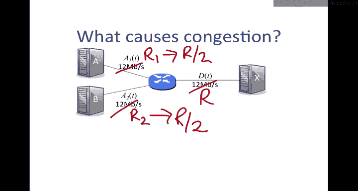

Let's first look at what's going on。We've got our。Sources A and B again。

 wanting to send 12 megabits per second。And we got a third source now wanting to send a 12 megabits per second。

 and we've got a second router and all the links， both of the links here are 12 mebits per second again。

First， notice that there are definitely going to be packets dropped if the flows from A。

 B and C run at the sustained 12 mebits per second。

 Clearly there's congestion in the network and they are all going to contribute to that congestion。

Second， notice that any packets from A&B that make it through the first router。

And are then dropped at the second router。 So if they are then dropped because of the congestion at the second link are going to be a waste of network traffic。

 In other words， they've used this precious congested resource here。 If they're then dropped here。

 then there was no， not really any point in sending them。

 So it's worth while thinking about how we get the information back to the source so that it isn't going to send unnecessary traffic through the network only to be dropped at a downstream router。

Third。Notice that it's not obvious what the split of the last link should be。

If the routers simply split the usage at each bottleneck， in other words， we split it 50，50。

 then at this point here over this link here， we would see six mebits from A and6 megabits from per second from B。

And that if we were to split here 50，50， then we would see 6 megabit per second from C。

 and we would see。Half of whatever came in through the second router。

 So we would see3 from a and3 from B summing to 12。 It's not clear that that's what we want。

 It might be that we actually want each of them to get four。

 That might be a more reasonable thing so that they each get equal access of that last routeout。

 So it's going to be important to think about how we divide up the capacity that's available。

Now let's make it slightly more complicated。Imagine that we've got an extra。

Sender D that wants to send just at1 megabit per second。

So D wants to send less than at a rate which is less than the others。

 So what rate should it be allowed to send out？We might say that everyone should send it at less than their requested rate because the link is congested。

 in other words， because the link over here is going to be congested because there's 12， 24， 36。

 37 megabits per second that wants to flow over it， everybody should run slower as a consequence。

On the other hand， we might say that because D is asking for less than its fair share of the link。

 so there's one link here and four of them because it's asking for less than three megabits per second。

 maybe we should give it its full one。So we're going to see some more examples of this in a definition of fairness in a little while。

 Something else to note is that congestion is unavoidable in a packet switch network， I mean。

 arguably it's actually a good thing。

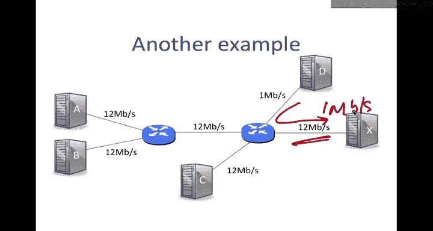

We use packet switching because it makes efficient use of the links because of statistical multiplexing。

Therefore， the buffers in the routers are frequently occupied and quite likely to overflow。 in fact。

 if the buffers were always empty。Then the links would be quiet much of the time。

 So delay would be low， but our usage of the network would be low。

 and so therefore we'd be using the network quite inefficiently。

 If buffers are always occupied while the delay is high。

 we'd be seeing the network used very efficiently because it would be busy all of the time。

 So we're going to see congestion is is there an inevitable property of the network and having a little bit of congestion is a good thing because it keeps the usage of the network high。

 We just need to be able to control it to stop us making the delay so high。

 the drop so high that the network becomes unusable。

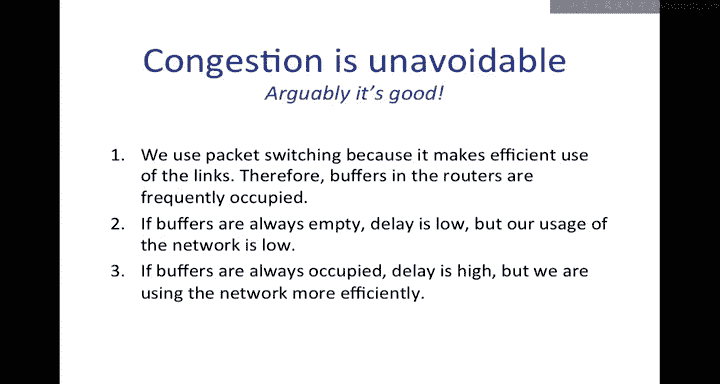

So some observations of what we've seen so far， congestion is inevitable and arguably desirable。

 congestion happens at different timescales from packets colliding to some flows sending too quickly to flash crowds appearing in the network。

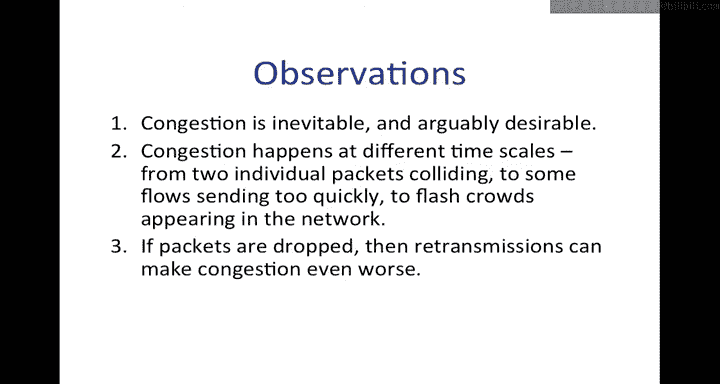

If packets are dropped， then retransmissions can make congestion even worse。When packets are dropped。

 they waste resources upstream before they were dropped。 So that's a bad thing。

 And we're going to need a definition of fairness to decide how we want flows to share a bottleneck link。

Next， we're going to explore the kind of fairness that we would like in the network because this is going to help us think about how to design a congestion control mechanism。

So let's consider an example of when I have three routers in a network。

Here are the three routers connected by links， and the first link Im going to assume is of rate 2。

 the second one of rate1。And then I'm going to have three。Sources， A， B and C， all connected。

 and they're going to be sending flows like this through the network。First one goes。

 Bs goes through the second router and then stops， Cs comes in at the second router and then goes out through the third。

So the question is what would be a fair allocation of rates if they all want to send that maximum maximum rate through the network Let's think about the rates that we're going to assign to each of these each of these flows the first allocation is one in which I'm going to give a flow of 0。

25 B a flow a rate of 1。75 and C a rate of 0。75。 See I've not exceeded the rate on any one of them there's a total of one here and a total of two here and the total throughput here is。

1。75 plus 07 is2 and a half is 2。75。Now let me consider a different rate allocation。

 and I'll call that one two。 and in this rate allocation， I give a 0。5。I give C。5。

And I'm going to give B 1。5。This has a total of。1。5 plus。5 is 22。

5 so it's actually lower overall throughput， but if you look at this link here。

 which is kind of the bottleneck link of the network， I've given the same to C as I have to a。

 and so we might say that this one is more fair。So there's a trade off here between fairness。

 one in which we're giving equal usage of the bottleneck links versus the throughput。

Where we're trying to maximize the overall throughput。

 and essentially we can see here that a is being penalized in the second in the first one。

 where the first allocation where it only has a rate of 0。

25 because it's going through multiple links in the network。

We can therefore see that fairness and throughput can be at odds with each other。

 so before we start designing or comparing ways to control congestion。

 we could do with a definition of the kind of fairness that we would like to achieve。

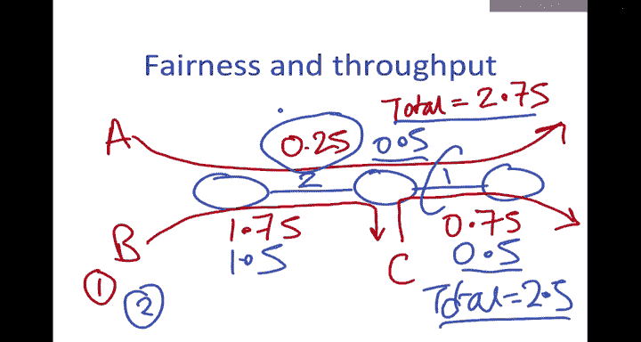

So the definition that we're going to use is called max min fairness or maximizing the minimum。

 and it's a widely used definition of fairness。 While it's not the only definition we could use。

 it makes sense because it tries to maximizeim the rate of the little flows while Mark making sure that every flow that would like it can have an equal share of its bottleneck link。

So the formal definition is shown here， an allocation is maximum fare if you cannot increase the rate of one flow without decreasing the rate of another flow with a lower rate。

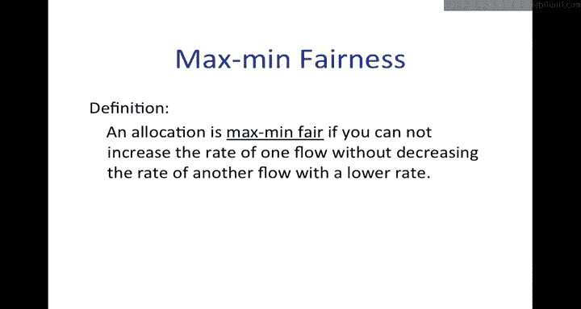

Let's look at what that would mean in my example before。

 actually the second allocation that I showed you was in fact Max FA。

Because if we increase the rate of B。So if we were to try and increase this one here。Beyond 1。5。

 we would have to decrease R of a。The rate of a。And so this is a， we can only increase。

Whenever we increase one， we will decrease one that is lower。And therefore。

 this is the maximum fair allocation。What it essentially means is that links that share a bottleneck。

 so for example here。Will have an equal share if they want to use all of that link or more more than their fair share。

 They will be curtailed to their fair share。 So they're each getting half of that。

 Let me show you an example on a single link， which will be easier to understand。

 So they're a very simple and intuitive definition on a on a single link。 So if we have a router。

 let me draw a router here。

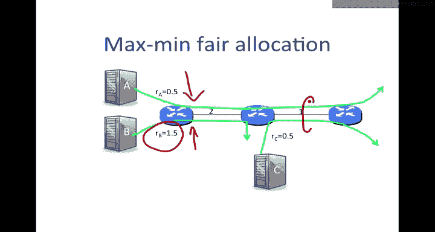

And I have。A and B that want to connect to that router。At。5 Mbit per second。 I'll just say 。5 and1。

And then it has a link of rate one coming out of it。And then let's consider that there's a third one。

 C that wants to connect to it at 02。 So the combined。

Rate that we would like to send through here from A， B and C is 1。7。

 but we've only got a rate of one。 So what would be the fair share。 Well， C is the minimum。

 So we're going to start by allocating the minimum。And C wants less than its fair share。

 in other words， the fair share would be a third each， it wants 0。2， which is less than a third。

 so we're going to allocate to it 0。2。That's going to leave 0。8 on this link。

And the fair share of the other two would now be 04， half of 08 each A wants more than that。

 So it's going to be curtailed to 0。4。And B also once more than than the 0。4。 So it's going to get 0。

4 as well。 So the total is going to sum to one， if we increase。The rate of any of them。

Then it would be at the expense of a slower flow， and so this is the maximum fare allocation。

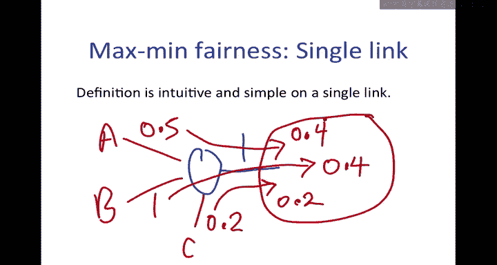

Now that you understand what congestion is in the next few videos I'm going to look at different ways to design congestion control algorithms。

 So we're going to start from start looking at some different techniques and end up with how TCP works and look at that in some detail and then look at some of the consequences of those designs。

 It's worthwhile having some goals so that we can bear them in mind when we're designing the algorithms and when we're comparing one against another So we're going to list here some of which we've seen and some of which will be new but pretty obvious in why why we're considering the first one is we want high throughput we want to keep links busy。

Because we want to make efficient use of the network and we want flows to be fast and to complete quickly。

Second one is that we would like it to be fair and we're going to typically use our maximum fairness goal because it gives a nice balance between pretty good throughput through the network。

 but also making sure that all the flows that are contending for a bottleneck link get treated fairly and the little ones get a good access to that link。

We would like the congestion control mechanism to respond quickly to changing network conditions。

 if other flows arrive and the congestion increases。

 we need to be able to back off a little bit so that we don't cause too much congestion in the network and if other flows go away and finish and more capacity becomes available。

 we'd like to be able to use use that quickly so that we can make efficient usage of the network。

 and finally， we want the control to be distributed。

 We can't rely on there being some central arbiter that is going to decide the rates for the entire network。

 We need this to operate in a distributed fashion in order for it to be scalable and these are the sorts of things we're going to consider over the next few videos。

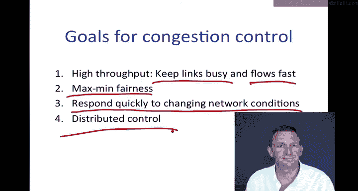