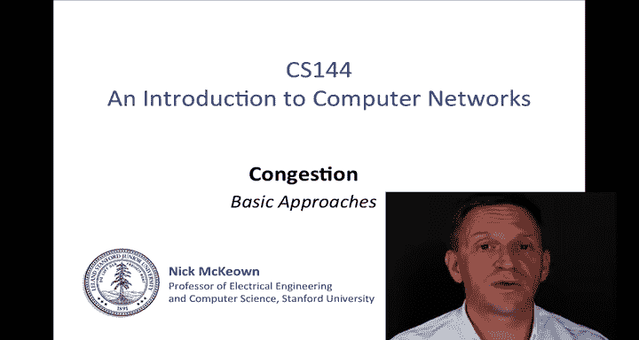
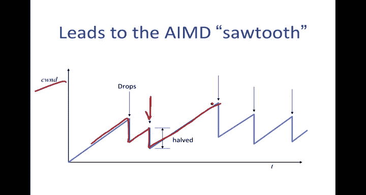
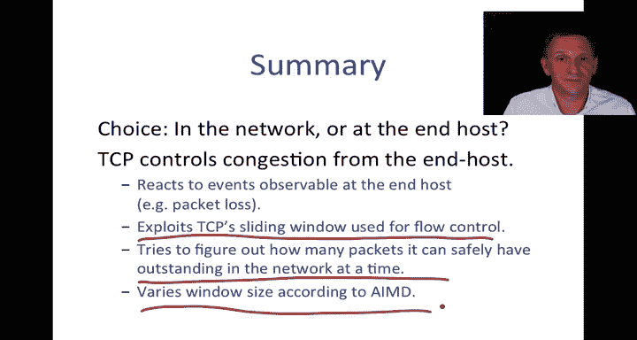

# 斯坦福大学《计算机网络｜Introduction to Computer Networking CS 144 2018》中英字幕deepseek - P56：-056-Congestion Control   Basi.zh_en - GPT中英字幕课程资源 - BV1bVqNYFEGg

In the last video， I told you about different types of congestion。

 the different time scales that it can occur at and what some of the consequences might be。

We then looked a little bit at the characteristics of congestion control algorithms that we might like to try and design。

 so we said that we wanted Hy throughput， we wanted them to be fair amongst the flows competing for the bottleneck links。

 we wanted the control of congestion to be distributed so that it can scale。In this video。

 we're going to start looking at basic approaches to controlling congestion。

We're going to consider whether the congestion control should take place in the network with specific support at the routers or whether it should be done at the end hosts。

And then I'm going to tell you a little bit about how TCP does it。

 we're going to start with the basic mechanism called AIMD or additive increase multiplicative decrease。

 and we're going to study how that works over the next couple of videos before we look in more detail at how TCP congestion control really works in practice。

😊。

So I'm going to start with a consideration of where to put congestion control。In fact。

 you may have already been wondering why it is that we can't simply use fairqueuing。

Notice that we've already seen a way to give everyone a fair share of the outgoing link by simply decomposing the output buffer into per flow cues as are shown here。

 so that I've got multiple flows going through the network。

Then each flow would be placed into its own Q， and then we use a fairqueuing scheduler to divide up that egress rate。

 let's say R amongst all of the flows that are contending for it。

 And so if they're all wanting to send at rate greater than R over 2。

 then they would each receive R over2 because that's what a fairqueuing scheduler would do。And。

 in fact。This will give us a not only a fair behavior。

 it will actually give us the maximum fare at every link across the flows。

 it'll give us good throughput whenever there is work to be done。

 it will always keep the outgoing line busy we say it's work conserving so it'll give good throughput on each of the links。

So what's wrong with this basic mechanism？Well， the first thing is that it isn't responsive。

 it's simply going to divide up the links， but there's nothing here that will tell the sources the rate at which they should send or give them any indication of how many packets they should send。

In fact， if they do send。 So if these are each trying to send at the full blast rate。

 So if there are packets coming in from all directions， trying to trying to use these links。

 then packets will simply be dropped onto the floor as the buffers overflow。

 we'll end up use wasting a lot of the upstream bandwidth。

 delivering packets over links that eventually get dropped down stream。

 So we need a way of signaling back to the sources。To say。

Give them some indication of the rate at which they should send or the number of outstanding packets that they can have in the network。

So in network based congestion control， there is explicit feedback that comes from the routers to indicate congestion in the network。

 So for example， if I have a source A and destination B and then some routers in between with some links like this。

So imagine that there are some flows in the network that are coming in from different directions going through this router。

 causing some congestion to take place right here。One thing that we can do is if there is congestion is to try and signal back to a。

Some signal。To say there is congestion in the network。

 you need to reduce the number of packets that you have outstanding or reduce the reader which you send them。

 And so the question is what would we send？And how would we get it back to to a。We could。

 for example， say I'm dropping a packet or it could be an indication of the occupancy of the buffer or it could mark that we've just crosseded some threshold and so we're getting more congested Any of these would be examples of congestion Another one might be that the outgoing link has a certain amount of capacity left over and as the capacity gets used up。

 we send a signal back to say how much of that capacity is available or it could be a function of all of the signals that I've just mentioned。

So the next question is， how do we get that signal back and how many bits do we use to represent it？

If we're sending back the whole Q occupancy， we'd really like to be able to send a sizable integer value to indicate what the current occupancy is that would take a lot of bits and it might be complicated。

 so in practice generally people look for schemes that use one or a couple of bits to signal back to the source and then next question is how do you get them back to the source。

 there's no point in creating a whole packet just to send it back to the source if we can piggyback on packets that are already going by So it's fairly common to use packets for example。

 if if there's a TCP packet that's coming through or some kind of two way communication to piggyback onto packets going in one direction such that they get sent back in the acknowgments and and eventually get back to the source There's one particular technique that's called ECN or explicit congestion notification in which the routers indicate whether they have have some degree of congestion for example crossing a threshold they then mark bits in packets。

Going towards the destination， which then copies those bits back into the acknowledgecknowments going in the other direction。

The original scheme that was designed to work somewhat like this was called deckbit and that was。

proposedposed more than 20 years ago as a single bit mechanism to signal to the source to slow down。

So nice advantage of a scheme like this is it's simple to understand。

 we can see that the signal will directly control the behavior of the source。

It should be pretty responsive to change because we can detect the onset of congestion in the network and be able to tell the source it's distributed in the sense that the signal is coming back from all of the routers in the network and it only affects the source and so the source can make up its decision that make up its mind on how it will process that signal and it can be made to be maximum fair so can it can be made to be fair for example。

 measure the rate of each flow through the router and pass back the maximum fair allocation for each flow。

 there are other ways that are simpler， for example。

 using fairqueing as I described before so the network based could certainly work。On the other hand。

It's worth asking the question of whether we actually need the network to provide any congestion notification。

 In other words， can we support congestion control without any support from the network at all merely by implementing a mechanism at the end hosts where it's just going to simply observe the network behavior。

So going to the example that I had before， if I have end hosts。A and B。And then routers in between。

If I'm able to observe behavior of the network。Such that it's enough to be able to decide at what rate I send or how many outstanding packets I have in the network。

 then perhaps we can implement a congestion control mechanism this way。

This is nice because if it doesn't depend on the behaviour of the routers or it doesn't behave on them sending specific information back。

 we can evolve and adapt it over time without having to change the network in between。

We're going to see that TCP does this， TCP actually does congestion control purely at the end host by observing the network behavior。

What it's going to do is if packets are dropped along the way。

It's going to observe this through either a timeout or it will see a sequence of acknowledgeknowledgments that are all the same coming back because the data was missing and so B is going to keep acknowledging an earlier piece of data which we can interpret as data missing and therefore needing to retransmit it so if there's been data thats dropped。

 a could interpret this as congestion and then slow down the rate or have a fewer number of outstanding packets so that it will reduce the congestion in the network。

So basically a is going to observe， it's going to's a little bit like it's observing the behavior in the network and seeing what happens in terms of timeouts and duplicate acknowledgecments and anything that indicate a drop。

 it could also see an increase in delay or variance。

 any of the things that would indicate to it that congestion is occurring so that it can change its behavior accordingly。

In TCP's case， it actually has to do this because IP offers no support by default。

 IP offers no indication of congestion in the network， so when TCP was first conceived。

 it was actually by necessity that it would control congestion this way。

So let me give you a quick introduction to TCP congestion control TCP implements congestion control at the end hosts because the network provides no support。

It reacts to events observable at the end host， in particular it's going to use packet loss or if it believes that there were packets that were dropped。

It's going to exploit TCP's sliding window that we use for flow control and retransmissions。

 it's going to exploit the fact that that's there and it's going to overload it with a means to control congestion and I'm going to be explaining that shortly。

And the way it's going to do this is it's going to try and figure out how many packets。

It can safely have outstanding in the network at any time。And this is an important concept。

 let me repeat it， it's going to try and figure out how many packets it can safely have outstanding in the network at any time。

Now we're familiar with this already with the sliding window used in TCP。

 and this is just a reminder of how the sliding window works。

Recall that the window is sliding over a stream of bytes。

 So this is the underlying stream of bytes that we're sending， and that is increasing to the right。

 So byte 0 was somewhere over here。And the window is telling us。

Data that has that has been acknowledged。 So this is earlier data， which has been fully acknowledged。

This is outstanding data that has been sent but not yet acknowledged。

This is data that's okay to send， in other words it's data that we perhaps haven't sent yet。

 but because it's inside the window we're allowed to send it if we want。

And then there is data that is not okay to send yet because it's ahead of the window。

 the window hasn't slid over the top of this yet because we're still await for outstanding acknowledgements over here。

Okay so the sliding window tells us not only which bytes can be outstanding but also how many bytes that's the window size。

 and you will recall that the receiver is going to send back information about what's called the Re window to tell us how many bytes we can have outstanding such that we don't overrun the receiver。

And we're going to see in a minute that we're going to reuse that mechanism in a different way at the sender。

But just give her a rough idea of what's going on with the TCP sliding window。

Here is a view on a timeline of what's taking place when packets are sent and received。

 and it's going to give us a feeling for how this is going to work。

So A is allowed to send up to a Windows worth of data and have it outstanding before it receives any acknowledgecknowgments。

 so here is that window of data。And when those packets are sent。

 of course each one of them is going to lead to an acknowledgement。

 so sometime later we are going to get the acknowledgecgments and then we're going to send the next windows worth of data。

So if the round trip time is much bigger than the window size。In other words。

 the time is much bigger than the amount of data that it takes to fill that pipe。

 Then there will be this big delay in between， and TCP will basically move forward by sending a window in a burst。

 pausing and waiting for acknowledgecknowledgments， sending a window in a burst。

 having a pause and then just repeating like that。 So that's in this particular case。Now。

 let's consider a different case。 and that is when the。Round trip time equals the window size。

 in other words， the window is exactly able to fill up the pipe。

 the number of outstanding packets that were allowed to have in the network precisely fills the pipe。

In this particular case， the first acknowledgecment will come back just after the last packet has been sent。

 and so we're able to send in a continuous stream， and so there are no pauses。

 therefore we're using the network more fully than in this case when we've got this idle time。

So this gives us a hint as to our ability to keep the network full。

 some people would interpret this as a rate because it's the window size divided by the round trip time and we're going to consider that a little bit later so that's the basic idea of how this is going to work。

More specifically with TCP congestion control， TCP is going to vary the number of outstanding packets in the network by varying the window size。

And it's going to set the window size instead of just being the advertised window。

 which is what it used before， which came from the receiver to stop overwhelming the receiver。

 It's also going to take into consideration something called the congestion window。

 This is something which is calculated at the source。

 So the advertised window comes from the receiver and at the source of the transmitter。

 it's going to calculate the congestion window that's often abbreviated to C windd。

 CwND stands for congestion window。And then it will take whichever is the smaller value。

 in other words， if the network is congested， then it's going to use sea windd and if the network is not congested。

 then it will be dominated by the receive window， the one advertised by the receiver So the next question to ask is okay。

 how do we decide the value for sea windd， how are we going to use sea windd in order to change the window size to control congestion in the network？

And the scheme that we're going to use is called AIMD。

 and this is a sort of a classic technique in networking that's used for controlling congestion in a TCP network。

And it could be used in any network that uses sliding windows。

AIMD stands for additive increasencre and multiplicative decrease。

Let's start with the additive increase。The way that the window size is going to evolve is as follows or rather sea wind。

If every time a packet is received correctly by the sender， it's going to increase the window size。

 in fact， seawind by1 over w。What this means is that every time a complete window worth of data has been accepted。

 has been correctly received。And acknowledged。Then the sender is going to increase its window size by one。

It'll increase it by one over w for every packet because there are W packets。

 then by the end of the window， it will have increased it by one。 So this is the additive increase。

 it's going to slowly increase when things are going well。

If things are going badly and packets are dropped， then it's going to use this as a signal of congestion。

And if that happens， it's going to reduce the sea wind by a factor of two， it's going to halve it。

What this will look like is if we draw the window as a function of time。

 so this will be the sea windd as a function of time。It's going to start by increasing。

Every time we have a success and then when we have a drop， so here is the drop taking place here。

It's going to drop down。Do half its half of its value。 So if this is the peak value。

 then this value down here would be w peak over2。And then it's going to start increasing again and increasing increasing until it has another drop。

 and then it's going to increase again and increase again and it could go up to a higher value because now the network maybe allow more outstanding packets come down to a different value and then go up and then there might be another drop so it doesn't always going to go in this nice neat symmetrical so tooth。

This is where the drops are taking place and it's halving at each case。

 so here is the additive increase， here is the multiplicative decrease， the additive increase。

 the multiplicative decrease。This is often referred to as the TCP saw tooooth or the AIMD sawre tooooth just because of its shape。

If we zoom in， let's take a closer look at what's going on at each step。

 So let's take a closer look at what's going on here。 It is actually proceeding by going in steps。

Remember it's going in steps such that every packet time it's going to increase by1 over w and I'm going to simplify that by saying every Rtt this horizontal dimension is time it's going to increase by one。

 the window size is going to increase by one because every time we've acknowledged a complete packet windows worth of data it's going to increase the window size by one so it's going to go forward in these steps of Rtt along the horizontal part of the stair and then it's going to go up by one and then Rtt and so on。

So this leads to what's often called the AIMD sore tooooth or the TCP sore tooooth that can look like this。

 this is an evolution of sea wind。Remember that's the congestion window as a function of time so here was the additive increase。

 we had a drop， we dropped down to half the value， we had an additive increase。

 we drop down because of a drop that took place packet drop that took place here。

Then we go up again through the additive increase and you can see here that the available window size。

 in other words， the amount of data that the source can have outstanding in the network is varying presumably because the network conditions are changing。

 there are other flows in the network or maybe even the capacity of the links is changing maybe their wireless links。

 for example。

So in summary， we have choice when we're implementing a congestion control algorithm。

 we can implement it in the network or we can implement it at the end host TCP controls congestion from the end hostt because IP offers it no support by default so it gives it no signals or indication of congestion other than dropping packets。

 so it merely reacts to events that are observable at the end host in particular packet loss。

It exploits TCP's sliding window。And it' that's used for flow control and it's going to overload that sliding window by changing the window size to try and control congestion。

 It tries to figure out how many packets it can safely have outstanding in the network at a time。

 and it's going to vary that window size according to the additive increase multiplicative decrease algorithm。

 and we're going to be studying that more in the next two videos。

