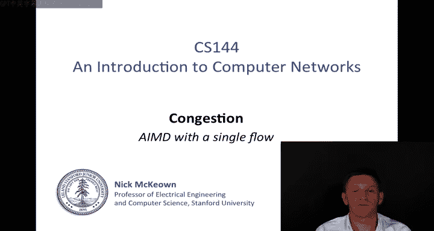
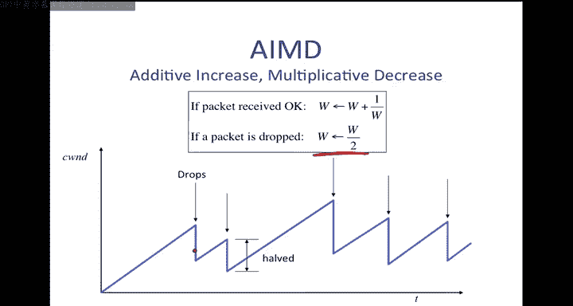
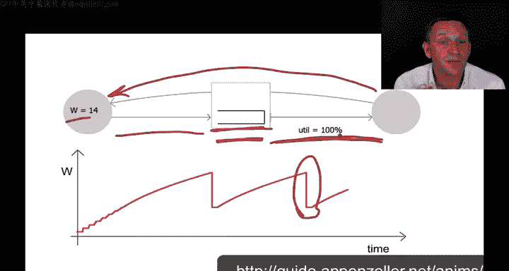
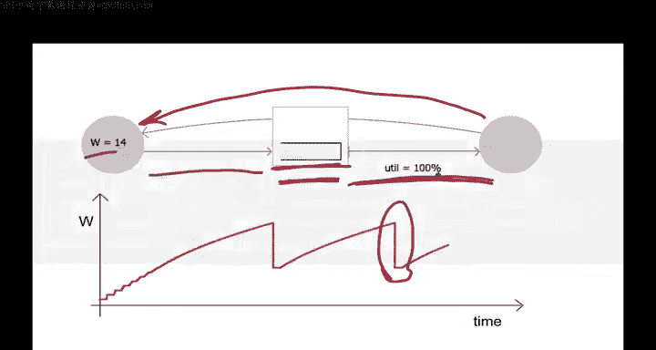
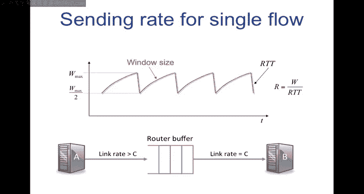
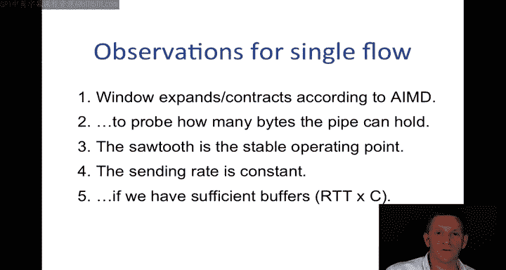

# 斯坦福大学《计算机网络｜Introduction to Computer Networking CS 144 2018》中英字幕deepseek - P57：-057-Congestion Control   Dyna.zh_en - GPT中英字幕课程资源 - BV1bVqNYFEGg

In the last video， I told you how we can use the additive increase multiplicative decrease method to modulate the size of the TCP sliding window and therefore control the number of bytes that are outstanding in the network。

If we want to increase the number of bytes that are outstanding。

 we might contribute to more congestion if there is congestion and we want to reduce it then we might reduce the number of outstanding bys in other words。

 reduce the window size So using this window size modulation we can vary the number of outstanding bytes and therefore effect or control the amount of congestion in the network noticeice this has been done by the end hostst only without any explicit support from the network。

In order to understand how AIMD works and then later how TCP congestion control works。

 we're going to start by looking in some detail at how AIMD works with a single flow。

If we can understand how it works with a single flow。

 then we have a chance of understanding how it works in a more complicated network with many。

 many flowers through a router at the same time。

So we saw before AIMD works as follows each time a packet is received okay。

 we increase the window by 1 over w， therefore once we've received a whole window worth of packets。

 the window size will be increased by one。Every time the packet is dropped。

We're going to decrease the window size。Multipicatively， we're going to reduce it by a factor of two。

 and this is the dynamics that we saw before。Now let's look at an animation of the AIMD process working in practice。

We're going to take a good look at this animation of a single AIMD flow over a single bottleneck link。

If we look on the let me explain what's going on with figure。

 the congestion window size W is shown on the graph down here， varying as a function of time。

 so this is sea wind， the congestion window。And this is the same as the value here at the source。

 so this is the source， this is the destination， and this is the router in between。

The router has a buffer and it's going to buffer packets that are waiting to go on the egress link。

 the egress link is this one here， and this is the bottleneck link between the source and the destination。

This link here on the left is running faster than the link on the right。

 which is why every now and again there's a buildup of packets in this buffer because they're arriving faster than they are departing The reason that the packets look littleer on the left than they do on the right is just supposed to represent the fact that the link on the left is running faster than the one on the right in other it's at a higher data rate and so the packetization delay is shorter and so the packets appear a little bit shorter on the left so packets are going to flow from the source to the destination they're the blue ones。

And then for each packet there is an acknowledgement coming back to the source。

 that's what the red ones are at the top and you can see that the arrival of the acknowledgeknowledgments is clocking transmission of the next packet。

 so we often say that an algorithm like this is self clocking and we'll see later the TCP is self clocking the packets are triggered by an acknowledgement coming back。

Okay now that I've explained this I'm going to restart it so that we can look at some of the dynamics I'm actually going to give you a URL to this same animation so you can play around with us on your own time。

So starting again。We can see that the that the。Window size here is telling us how many packets there can be outstanding in the network。

 And I like to think of it as that there's a kind of a bag that is representing the network as a whole。

 and we're trying to figure out how big that bag is。

 How many packets can we put into that bag before they overflow and drop on the floor。

 And I find this a useful way to think about AIMD。 So we're basically trying to figure out where those packets can be and how many there can be in in the link。

 And really， there's only a couple of two or three different places that they can be。 First of all。

 the packets can be on this link here on this fixed there's fixed capacity pipe。

 There are a certain number of packets that we could fit under that end that pipe。

 There are a certain number that we could put here。

And there are a certain number that are represented by the acknowledgecknowledgments coming in the opposite direction。

 So all of those are fixeded。 The only variable portion is how many that we have currently got in the buffer in the middle。

 So it's like a concertina。 There's this concertina that to start with that concertina is closed。

 and we're putting the packets into the network。 And then as we as we fill up the links after the links are full。

 the only place they can go is into the buffer and the buffer will absorb for every extra window extra time that we open the window。

 we are essentially putting an extra packet into that packet buffer。

 So initially when the window is at its minimum value， all the links are full。

 but the buffer is empty。😊，If we increase the window by size one。The links are fools。

 so it can't be placed into the into the link。 the only place that it can be placed is into the buffer。

 so the buffer will increase by one if we then increase the window by one again。

It'll go into the buffer， increasere it by one again。 It'll go into the buffer。 Eventually。

 the buffer overflows。We drop a packet and then the AIMD rules are that we drop the outstanding window size by half。

 Eventually the buffer will go empty again， and then we start again。

 So really all we're doing by changing the window size is modulating the occupancy of the buffer at the bottleneck。

We look here on the simulation， we can see that， we can see that happening。

So right now the window size is9 so that we will see at any instant there are nine packets and acknowledgecknowments outstanding in the network。

 but because the links are full， this outgoing link here is full， our bottleneck link is full。

The only place that those packets can go。Once we increase the window size is here。

 so we've filled it up any additional ones are inside the buffer and every now and again you'll see that we've received a full window worth and then we increase the there we go we will increase the window size by one it's currently at 13 in a moment it'll increase to 14 and every time we increase the window size the buffer will have one more packet in it。

And down here you can see that every time we receive a full Windows worth。

 it will actually go up by one， and therefore that's how the window is going to evolve over time。

So we're almost getting to the point where the buffer is full。

 we've got to a point where the window is 16 and at the moment the rate at which packets are coming in is exactly matching the rate at which they're going out。

In a moment we're going to actually put one extra packet into the network and you see it got dropped and the knowledge of that drop is propagating through the network。

 it will now go on to the outgoing link， it will come back actually through the absence of it acknowledgement but that doesn't matter and so therefore the window size will be halved that's what's going on over here。

The buffer will have。We'll drain because we're only allowed to have half as many outstanding packets in the network。

 therefore we stop sending the buffer drained because it drains at the full rate。

And then we start the whole process off again。The first thing I want you to notice is that the outgoing link is kept busy all the time。

100% of the time， even though this window process is concerting。

 it's going full up and then full down when we have a drop full up and then full down so even though this window is going through this sore tooooth motion。

 the egress， the bottlene link in the network is staying busy all the time。In other words。

 the rate at which packets are being sent is staying constant and this is a really important property of AIMD。

 particularly with a single link， it's not really adjusting the rate。

 it's actually affecting the number of packets that can be outstanding in the network and this subtle distinction will become very important in a moment when I tell you a little bit more about the dynamics of AIMD and then it'll help us understand what's going on when there are multiple flows in the network。

To increase our understanding of what's going on。 let's look at the dynamics of that single flow。

 This is from a s in a well known network simulator called N S of a single TCP flow over a bottleneck link。

 The graph at the top here is telling us the evolution of the congestion window or sea windd like we had before。

 That's the red one。 The green one is the RTT， the round trip time。

This red line here is the utilization of the bottleneck link in other words。

 how busy is that bottleneck link kept and down here is the occupancy of the buffer and we can see that evolving so it's very similar to the simulation that we just saw。

 the animation that we just saw。So notice that the congestion window。

Is moving in this beautiful so tooooth。But because every time we put one more packet into the network。

We increased the occupancy of the buffer。So every time we increase W。

 the only place that that extra packet can go is in the buffer。

 so it's going to move in perfect lockstep with sea windd。

But because we're increasing the occupancy of the buffer we're increasing the delay that packets experience as they go through the network。

 so therefore the RTT， the round trip time is also going and following the same exactly the same shape。

😊，So seawind and the RTT actually follow the same shape。

The consequence of this is that the sending rate for a single flow。

Wwhichch we can define to be the number of bytes that we send in one window divided by the round trip time。

 because the round trip time is varying with the window size。

 W over RRTT is actually going to be a constant。 This is actually going to be a constant。

Why is that the reason that it's constant is because W and RTT are moving in lockstep。

 they're essentially the same。And we saw that in the animation the egress link was kept busy at all times。

 so we're not really modulating the rate， in fact we don't want to modulate the rate when everything is constant and we've only got a single flow。

 we want to keep the outgoing link busy。All that the window is doing is probing to see how big the bag is。

 how many more bytes we can put into the network without it overflowing。

 and it's constantly probing and changing that window size。

 just in case the conditions change and the capacity increases and therefore there's more room in the bag to put more packets。

Just just to belabor the point a little， the window size is going to move like this。

 RTT will move like this in lockstep， and so this rate is a constant。So from this。

 we can also make another observation， and that is how big should the buffer be so that。

The whole system will behave correctly。 So we saw last time that the buffer occupancy was moving in lockstep with a window size process。

 this picture down here is essentially the same as our animation。

 our bottleneck link over here our link here with a faster rate， the router buffer between A and B。

 So if we were to to look at that again in our simulation and look at the behavior。

 the graph on graphs on the left are the same as the ones we saw before。 And in this case。

 the buffer occupancy equals Rtt times C。 In other words。

 it's just enough to hold enough packets that will fit into the round trip when the buffer is empty。

If we were to make the buffer a little bit smaller and that's what we're doing here。

 so the buffer is smaller。Then。What happens is that the buffer after there's been a drop。

 which is taking place here。When the window size decreases and is halved according to the AMD rules。

The buffer will fall because we have fewer outstanding pipes in the network。Therefore。

 the source will stop sending packets， the buffer will drain。

 but it's draining and empty for some period， so if the router buffer is empty。

 it means the egress link， our bottleneck link， our precious resource， is actually not being used。

 and so the utilization will drop from 100% during that time。

So if we want to prevent this from happening and have 100 per cent at all times。

 we need to make sure that this doesn't happen。 Therefore。

 we need to make sure that the buffer never goes empty and we need a behaviour like this from which we need a buffer of R T T time C。

 Now， why it's specifically R T T time C， you'll see in a problem set a little bit later。

 But the basic intuition is that the buffer occupancy， the size of the buffer。

Must from the peak to the trough， must be the same as the distance from the peak to the trough here to be able to ride out the time when the window size is halved and we have fewer outstanding packets placed into the network。

 And that distance there turns out to be RTT times C。 And we'll see that later in a problem set。

Let's summarize what we've learnedt for a single flow。

The window is going to expand and contract according to AIMD。

 the additive increase multiplicative decrease， which is going to modulate the size of the TCP sliding window in order to determine how many outstanding bys they can be in the network essentially we're probing how many bytes that the pipe can hold from end to end and we' constantly be going to be probing by changing the size of that window。

 we're going to carefully increase it， see how much space there is if we find that we overfill it。

 we're going to drop back down again and then we're going to keep trying to probe it to see if there's more capacity that's available So we're going to tentatively additively increase and then if we find that we're going into trouble we're going to very quickly in a very responsive way。

 drop back down again to be able to reduce the number of outstanding bytes in the network as quickly as we can。

So the sword tooooth is actually the stable operating point of TCP。

 there's nothing out of control just because it's oscillating。

 it's exactly the behavior that we want under a stable operating condition。😊。

And the sending rate is in fact constant so long as we have enough buffers in the network。

 which is RTT times C。 So these are all the observations for a single flow in the next video we're going to see how things are a little bit different when we have many flows in the network。

