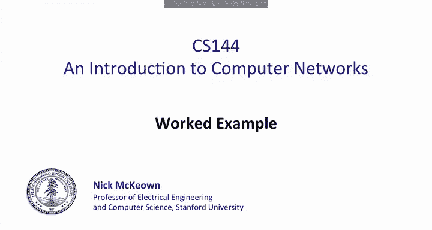
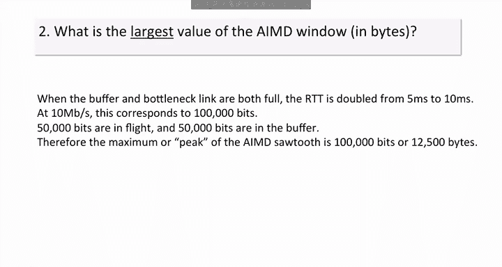
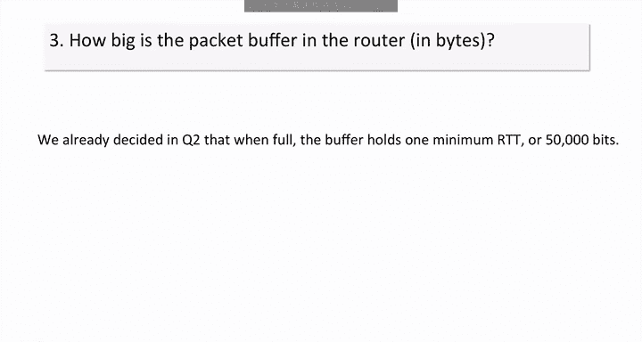
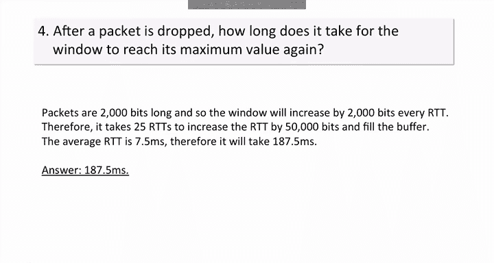
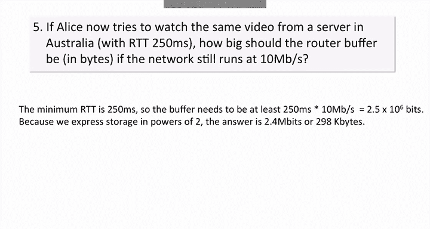
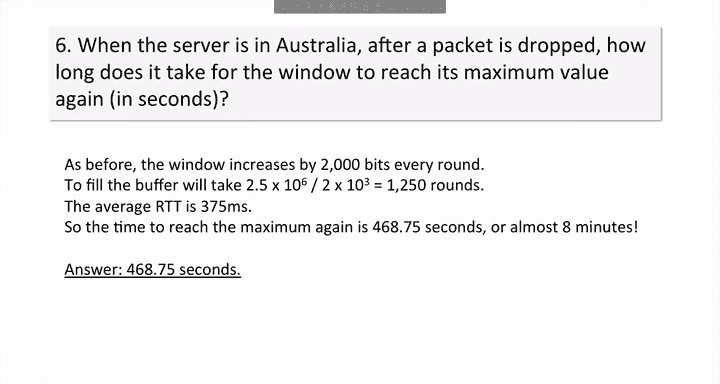

# 斯坦福大学《计算机网络｜Introduction to Computer Networking CS 144 2018》中英字幕deepseek - P58：-058-Single AIMD flow worked.zh_en - GPT中英字幕课程资源 - BV1bVqNYFEGg

In this video， I will provide a workped example for a single flow with AIMD congestion control。

Alice is streaming a high definition video at 10 M per second from a remote server in San Francisco。

 All packets are 250 by long。 She measures the ping time to the server。

 and the minimum time she measures is 5 milliseconds。Once the AIMD window reaches steady state。

 for the rest of the video， the sawre tooooth oscillates between constant minimum and maximum values。

The buffer is perfectly sized so that it is just big enough to never go empty。Part one。

 what is the smallest value of the AIMD window in bytes？Well。

 the minimum pinking time of5 milliseconds is when the buffer is empty。

 but the bottleneck link is full。😊，At 10 megabits per second， there's therefore 50。

000 bits in the pipe。This means the minimum or trough of the AIMD saw tooooth is 50。

000 bits or 26250 bytes， so therefore the answer is 6，250 Btes。Part two。

 what is the largest value of the AIMD window in bytes？

When the buffer and bottleneck link are both full， the RTT is doubled from 5 milliseconds to 10 milliseconds。

At10 mebits per second， this corresponds to 100，000 bits。

5if0000 bits are in flight and 50000 bits are in the buffer。Therefore。

 the maximum or peak of the AIMD saw tooth is 100，000 bits or 12，500 bytes。

Part 3， how big is the packet buffer in the router in bys Well。

 we already decided in question2 that when it's full， the buffer holds one minimum RTT or 50000 bits。

Part4 after a packet is dropped， how long does it take for the window to reach its maximum value again？

Packets are 2000 bits long， and so the window will increase by 2000 bits every RTT。Therefore。

 it takes 25 RTTs to increase the RTT by 50，000 bits and fill the buffer。The average RTT is 7。

5 milliseconds， therefore it will take 187。5 milliseconds。

Part 5， if Alice now tries to watch the same video from a server in Australia with R T T 250 milliseconds。

 how big should the router buffer be in bites if the network still runs at 10 Mbit per second。

Well the minimum RTT is 250 milliseconds， so the buffer needs to be at least 250 milliseconds times 10 mebits per second equals 2。

5 times 10 to the6 bits。😊，Because we express storage in powers of two， the answer is 2。

4 megabits or 298 kilobytes。

Part 6， when the server is in Australia after a packet is dropped。

 how long does it take for the window to reach its maximum value again in seconds？As before。

 the window increases by 2000 Bs every round to fill the buffer will take 2。5 times 10 to the 6。

Divided by two times 10 to the three equals 1250 rounds。The average RTT is 375 milliseconds。

 so the time to take to reach the maximum again is 468。75 seconds or almost 8 minutes。😊。

The answer might surprise you。😊，It takes a long time for the AAMD flow to recover from a single packet drop。

This would be a real problem in practice， which motivates us to look for better and quicker ways for TCP to recover from drop packets。

