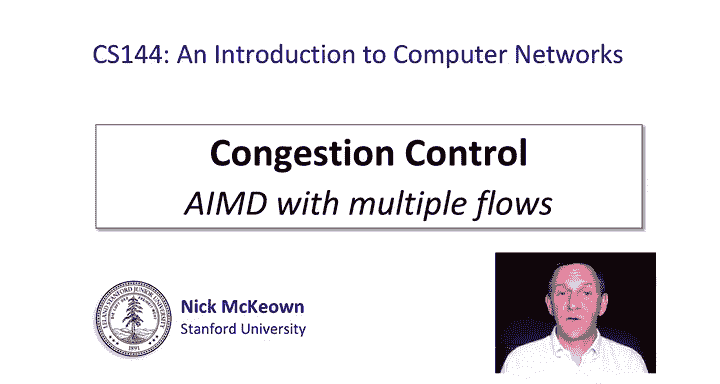
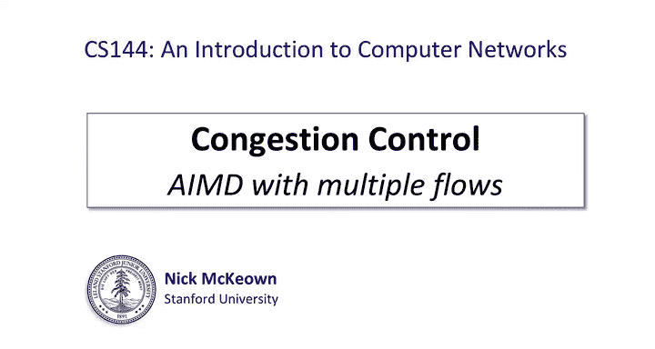
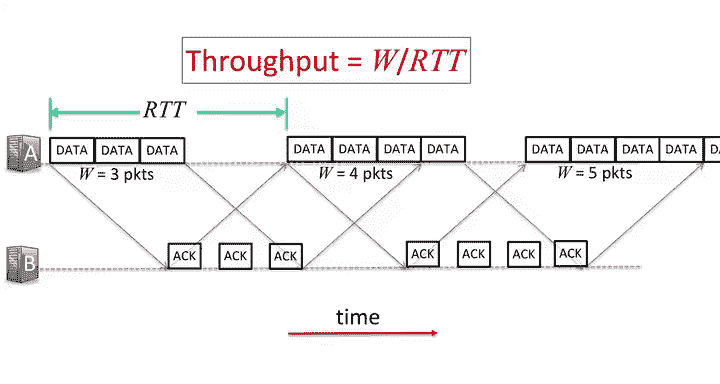
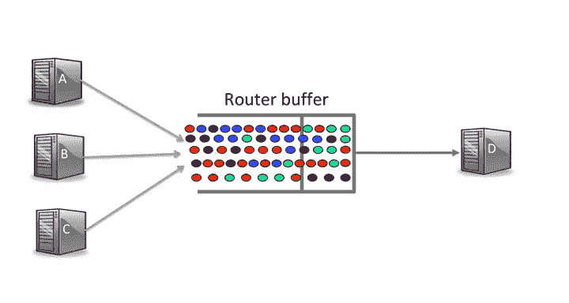
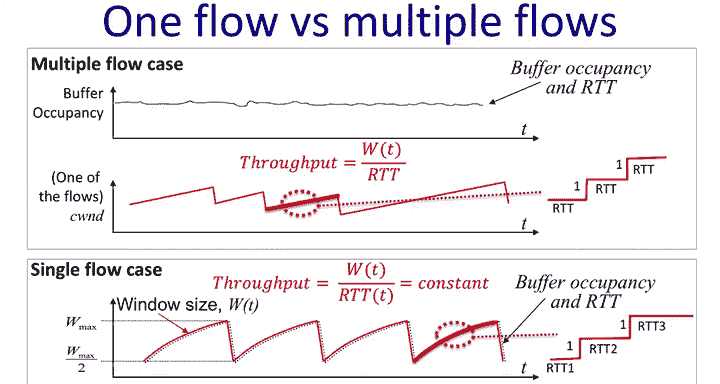
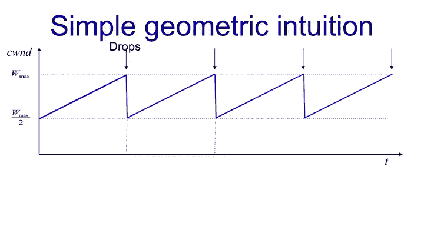
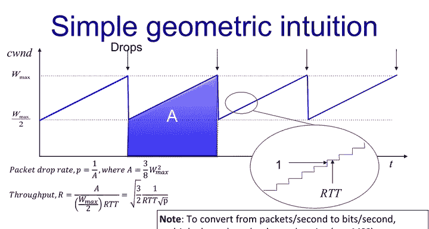
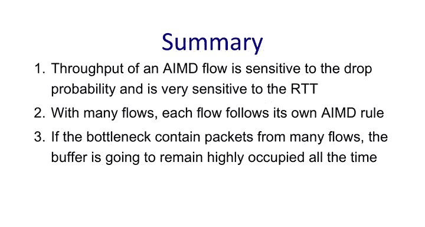

# 斯坦福大学《计算机网络｜Introduction to Computer Networking CS 144 2018》中英字幕deepseek - P59：-059-AIMD Multiple Flows 64.zh_en - GPT中英字幕课程资源 - BV1bVqNYFEGg

In the last video， I explained how the AIMD algorithm controls congestion in the special case when we have only one flow in the network。

AIMD， which as you recall is short for additive increase with multiplicative degrees。

 controls congestion by controlling the window size。

 and therefore it controls the number of outstanding packets in the network。

Outstanding packets are also called unacknowledged packets because they're the packets that we've sent。

 but for which we've not yet received an acknowledgement to tell us that they arrive safely at their destination。

While it's common to hear people say that AIMD controls the rate at which packets are sent。

 it's not strictly true， you'll hear this mistake made a lot。

All AIMD does is to control the number of outstanding packets in the network。

 and that's really important to remember。When the network is empty and uncongested。

 it has room for a flow to send more packets to have more outstanding unacknowledged packets in the network。

But when the network is full of packets and it's congested。

 we have to reduce the number of packets that our flows have outstanding so that we don't overfill the buffers because that's where they're being held and if we overfill them。

 then of course we're going to drop packets。😊，It's in this way that AIMD there is the window size。

In order to find out how much room there is to place additional packets or bytes in the network。

 so it's constantly probing to figure out how big it can make the window size because that's the only thing it has to control。

The single flow case helped us understand the basics of AIMD。

 it particularly helps us understand networks in which there's one dominant flow in the network at the time。

 for example， in your home network when you're streaming streaming video。

But out in the crazy wilds of the internet， it's very common for a router to have thousands or even a million flows passing through it at the same time。

This situation is very far removed from that simple case with a single dominant flow。 And。

 and you'd expect that the dynamics of AIMD would be very different when there are so many flows present。

 And you'd be right。 The dynamics are very， very different when a network carries many flows at the same time。

 And so in this video， I'm going to explain how AIMD works in this case in a network with multiple flows。

First， let's recap how we calculate the throughput of a flow。

Imagine that server A has packets to send a server B right now， the window size is three packets。

 which server A sends。😊，B replies with three acknowledgegments which arrive after one round trip time or ItT。

Sever eight can now increase the window size by one packet and sends four packets。After another RTT。

 it can send five packets and so on until the window size grows to fill all the buffers and a packet has to be dropped you can see that in any cycle the throughput equals the window size divided by the RTT。

😊，Let's take a look at the packet buffer insider router that is a bottleneck for lots of flows。😊。

At any one time， the router buffer has lots of packets in it from lots and lots of different flows。😊。

It's not uncommon。For' a router buffer to be able to hold hundreds of thousands of packets and they will come from many。

 many different flows is just a logjam through this buffer In the picture I've used different colors to represent packets from different flows I don't have enough colors in PowerPoint to show all the different flows。

 but you can see immediately that the packets belonging to any one individual flow only make up a tiny fraction of all the packets in the buffer。

😊，You can imagine that if 10，000 flows are sharing a buffer with room for 10，000 packets。

 each flow will typically have just one packet in the buffer at a time。Occasionally。

 a packet will arrive and find the buffer full。 The packet is dropped and its flow will halve its window size。

😊，With so many flows in the system， you can see that the flows will experience packet drops pretty much at random。

😊，It just depends on when a flow's packet happens to arrive and find the buffer full Most of the time the buffer won't be full。

 but just occasionally a flow gets unlucky and its packet arrives when the buffer is full and the flow's packet has dropped。

😊。

Remember that each flow followss its own independent AIMD soooth process。

When a flow has one of its packets dropped， the flow will halve its window size。

 but all the other flows will be unaffected。They'll keep merrily increasing their window size until they get a drop too。

 the more flows there are， the smoother the occupancy of the queue will be with each flow experience occasional random drops。

😊，If we zoom in on any one individual flow， as I've done here in red。

 then you can see that it will still follow the AIMD S tooooth。

But the drops will happen at random times because it really depends on when the flow happens to encounter a packet drop and halves its window size。

And so and this is a really important point to remember it's very reasonable to think of the RTT the round trip time as being essentially constant when there are many flows。

😊，There are minor fluctuations when a packet is dropped。

 but the rest of the time the congested buffer is full。So as a consequence。

 we can assume that the RTT stays constant for packets passing through the congested router。

This means that the throughput of a flow， which in each cycle is equal to its window size divided by RTT。

 will be directly proportional to the window size In other words。

 the average throughput is the average window size divided by the constant RTT。

You should contrast this with the single flow case that we saw in the last video。

 which was completely different。We saw that the RTT changed in lockstep with the AIMD So tooooth。

In both cases， we can accurately say that the throughput equals the window size divided by the RTT。

 but in the single flow case the window size moves in lockstep with the RTT。

 whereas in the multiple flow case the window size varies， but the RTT stays constant。

One more thing for me to point out in the picture， you may have noticed that I'm drawing the saw tooth a little differently in this video when I drew it for a single flow。

 the top edge was curved because RTT increased with window size。

 each horizontal step was longer than the one before。

When we have multiple flows we can assume that the RTT is constant and so each horizontal step is the same length。

 and the sore tooth is a triangle with straight edges。Now， let's look at the throughput of a flow。

 The throughput is simply the number of bytes or packets it sends per second in the first RTT。

 it sends three packets when the packets are successfully acknowledged。

 it can send four packets in the next RTT and so on。

You can see the why the throughput is inversely proportional to the RTT。

It's worth asking how the throughput depends on the drop probability as well。

So I'm now going to show you a simple， intuitive， geometric relationship between throughput。

And R TT and the drop probability。

Here is our familiar AM D model showing the saw tooooth going through the additive increase multiplicative decrease。

I'm assuming weveed the AMD phase and each time the window size reaches Wm。

 the buffer fills and a packet is dropped。 The window size is hald the W max over2。

 And remember there is a packet drop at each peak of the sort too leading to a halving of the window size。

The first observation is that the shaded area shown here。

Tells us how many packets we send in one cycle between two successive packet drops。

The line is really a staircase of window sizes with the window size increasing by one at each step。

The width of the shaded area is RTT times W max over 2。

 because it takes W max over two steps for the window size to climb from W max over 2 back to W max again。

Remember， we're assuming RTT is a constant because there are lots of flows in the networks。

The height of the shaded area is W max。 And so the area A is simply3 over 8 times W max squared。

 One way to think about it is that the lower square is w max over two on each side。

 so has an area of W max squared over 4。 The area is 1。5 times the size of the lower square，1。

5 times a quarter is 3/8。 So a equals38s of W max squared。Now we know A。

 we can write an expression for throughput because we know that we send a bytes every W max over two times Rtt seconds。

Thput equals a divided by W max over to RTT。The second observation that we can make is that we know the relationship between area A and the packet drop probability。

This is because exactly one packet is dropped every time we send eight packets。In other words。

 P equals1 over a。Were now ready to derive the throughput as a function of RTTmp。In practice。

 we don't know what W max is， but because we know a as a function of P。

 we can substitute P into the equation and we end up with a rate equation that looks like this。😊。

Throughput equals the square root of3 over2， divided by RTT times the square root of p。

So look at it for a moment， it's more than just an equation。

 it tells us something about the property of AIMD when we have a large number of flows。

 it tells us first that the rate that a flow experiences is proportional to one over its RTT。

 In other words， the bigger the RTT， the lower the rate。

It means that when we're communicating with a server that's further away， we can expect a lower rate。

This is not the property that we want from a congestion control algorithm。

 We don't necessarily want to penalize flows that are further away。

 And so this is generally considered a weakness of AIMD。

The second thing to notice about the throughput equation is that throughput is quite sensitive to the drop probability2。

 one over square root of P。😊，It also might seem a little paradoxical if the drop probability goes to zero。

 does that mean the rate goes to infinity？But if you think about it。

 this is exactly what AIMD does if there are no drops。

 the window size will just keep growing and growing forever and the window size will tend to infinity。

In other， there'll be no brakes on the sender and it will send as fast as it possibly can all the time。

This confirms what we already know， which is the packet drops are an essential part of how AIMD congestion control works。

The packet drops indicate to the sender that the window sizes open up too far and we have too many outstanding packets in the networks we need to ratchet it down and that is what congestion and control is all about。

So in summary， what have we learned about AIMD so far？

We've learnedt that the throughput of an AIMD flow is sensitive to the drop probability and very sensitive to the RTT。

We've learned that when the network is carrying many flows。

 each flow follows the AIMD rules just like the single flow。

 the window will contract and expand according to the AIMD equations。

 while the sender probes how many bytes it can safely place into the pipe between the sender and the receiver。

We've also learned that if the bottleneck contains packets belonging to many different flows。

 then the buffer is going to remain highly occupied all the time。

This means the RTT seen by packets is about the same。

 and we can safely assume RTT is constant in this case。

Now you've learned about AIMD， you're going to see in the next few videos that it is one of the main mechanisms underlying TCP's congestion control algorithms。

There are quite a few other mechanisms that we're going to be learning about too over the next few videos。

 AIMD is one of them。 You're going to be learning that there are lots of other tricks in the TCP toolbox that have been introduced over the years to turn it into an extremely effective congestion control mechanism。

