# 斯坦福大学《计算机网络｜Introduction to Computer Networking CS 144 2018》中英字幕deepseek - P60：-060-Congestion Control   TCP.zh_en - GPT中英字幕课程资源 - BV1bVqNYFEGg

So in this video， I'm talk about congestion control。

 particularly the basic motivation for congestion control and transport protocol and protocols in general。

 and then walk through the first example of a protocol that really identified and tackled this problem。

 TCP， particular version TCP called TCP Tahoe。And I'll talk about the first mechanism that TCP Tahoe uses to try and deal with congestion。

 something called slowlow start。

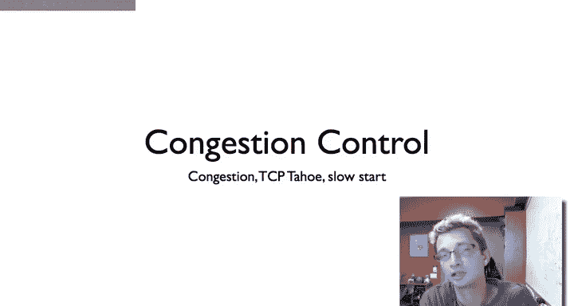

So the basic motivation for congestion control is that flow control。Tells an endpoint， say。

It's going to tell Boston is going to tell San Francisco the amount of data they can accept。

 And so flow control。Specifies the limitations of the endpoint。However。

 it can very well be that this node in Boston is able to receive data much。

 much faster than the network can support it。 So， for example， while this node in Boston might have。

 you know， a buffer that allows it to receive 100 packets。P RRTT per RTT。

It could be that some bottleneck link on the path from San Francisco to Boston can really only support about five packets per RTT。

And the idea is that if San Francisco communicates with Boston。

 this node in San Francisco communicates with node Boston at a rate which flow control would allow。

 then it's going to send packets much faster than or it can support。

 Most of these packets are going to be dropped and it's going to spend a lot of its time doing retransmission to to recover from these heavy errors。

 You don't want to saturate the network because everything will work less efficiently than if most packets arrive。

 It will require less control overhead， the rule will generally work better。

And so the basic idea of congestion control is that endpoints should control their data rate so that they do not overload the network。

 this will generally increase the performance of the network。

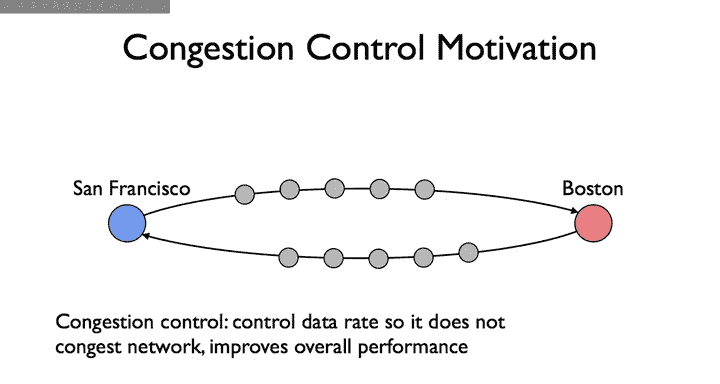

So if we just take a step back in terms of congestion control。

 what really LED to it as this very important area of study and of engineering in the internet。

 it all comes from TCP。 So basic history of TCP in 1974 established through a handshake， you know S。

 sync act。In 1978， TCP and IP were split were split。

 it used to be that the internet just at that point， the architect just supported TCP。

 but they realized oh， we need to split them because we need stuff like UDP。Then January 1， 1983。

 that was the switch date when suddenly the entire aRPt switched over to TCPI， IPV4。

Three years after that， the internet began to suffer congestion collapse where links were saturated。

 they were sending， operating at line speed， yet no worse useful work was being done。 instead。

 all the packets being transmitted were unnecessary retransmissions or acknowledgeknowledgments so you're seeing full utilization of links while simultaneously no application level throughput。

So then Van Jacobson in the seminal paper， fixed TCP， figured out what was going on。

 and he published the semiminnal TCP paper which described TCP Tahoe。

 so these names Tahoe and Reno come from the versions of hardware for Berkeley Uniix that these TCP implementations occurred on。

And so you read about Tahoe， Reno and then after you started getting names like New Reno， Vegas。

 Daytona just to follow that theme， but Tahoe and Reno were denoted sort by versions theerke of Berkeley Uniuchs that were distributed in the hardware there were。

So then about a couple years after this first TCP Tahoe， a fast recovery and fast food transmits。

 something that's in a future TCP version Ill talk about a later video TP Reno。

 which are common today， but the time there are new ideas were added and so if you look basically all TCP implementations today have the mechanisms that are in TCP Tahoe and TP Reno。

And so we're going to go through them in this series of videos。

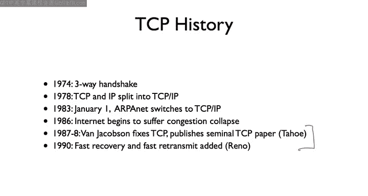

So there are basically three questions that a transport protocol needs to answer if it's going to provide reliable transport。

RightThe first is， when should it send new data， that is， when should it send data。

 which it has never put on the artwork before， Second is， when should it send a retransmission。

 When should it try to retransit data has sent before。And finally。

 when should it send acknowledgements for data that it successfully received。

 these are these basic things of to， when is it going to generate packets。

Whether they're data packets， readtransmissions of data packets， or ament。Now， of course。

 often we talk about data and acknowledgement packets as being independent， but in Tpe， they're not。

 The acknowledgecknowledments are simply a field in the header， and you can of course。

 piggyback data and acknowledgecments， but often we just talk about data acknowledgement separately。

 just pretending that the flow as un directional， although often it might not be。

 it might be bidirectional。The point being that it can be that you have no data to send。

 but you do need to send an acknowledgement。

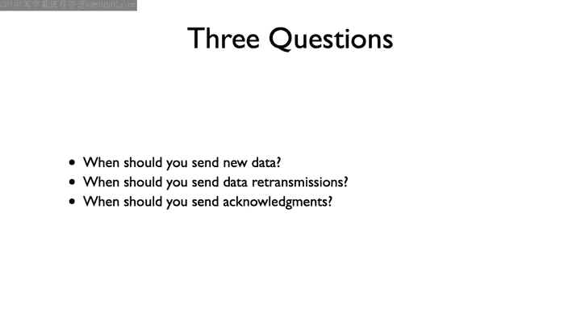

So what did TCP look like before TCP Tahoe？So essentially。

 what happens is you set up a connection through a handshake。

 and an endpoint now has the flow control window size tonot by the window field of a TCP。Heer。

And so what pretaho， what TP would do is this seem like a simple thing。

 It would just send the full window of packets。 So if the window said aha Im 30 kilobytes。

It would send 30 kilobys worth of packets， so this it obeying the flow control。

It would then start a retransit timer for each packet。

And then if it didn't receive an acknowledgement for that packet by the time the transmit retransmit time required。

 it would then retransmit that packet。And so the basic problem this encounters what happens if the flow control window is much larger than what the network can support。

 It might be that your endpoint has space for 30 kilo， but the link is already saturated。

 You can't suddenly just dump another 30 kilos on it。 I mean， these numbers might seem small now。

 but back then were you had 50 had relatively slow links in comparison to today's speed。

 So think of this more of like your window suddenly would advertise 30 meby。

 You don't necessarily want to dump 30 meby onto your DSL or your cable modem link immediately。

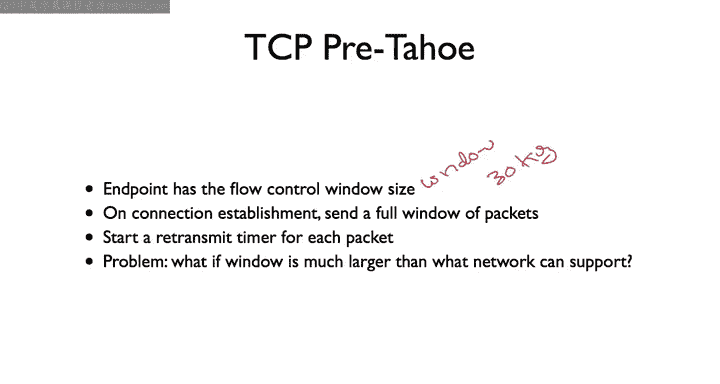

So if you implement that algorithm， you just send the window of packets。 What happens。 Well。

 so here's a picture。 So here it's showing on the X axis is time and seconds。

 and the y axis is the packet sequence number in terms of kilobyte。

 So the sequence number of the byte that TCP has sent。

And so what you see is on connection establishment。

 it immediately sends a full buffer of packets about 20 kilobytes worth。

And then it's getting some acknowledgecments so it's sending some more data。

 but then suddenly its window is a certain size， the flow control window。And it hasn't。

Received an acknowledgecknowgment for this。This segment here。And so at this point。

 TCP is blocked right that heres the'm these dots are showing the packet that are transmitted。

 so at this point it' blocked in that it is sent up to the last acknowledge byte plus the window size and it can't send anymore。

 And the reason is that this packet probably was lost。So then here basically， here's the timeout。

And it retransmits that packet。Then as you can see， it's able to send a whole bunch more packets。

 it gets a whole bunch of acknowledgeknowgments or it gets a cumulative acknowledgecledment allowing the window to move forward。

 etc cetera， et cetera。 But the basic point to see here is that there are these huge saw tooths。

That you see big bursts of packets followed by idle timeouts。

 big bursts of packets followed by idle timeouts。And that many of these packets are redundant。

 like this particular packet here is sent three times。Now， this one is also sent three times。

 So you're seeing lots of additional retransmissions。 and overall。

 the protocol is not performing very well。 it's sending all these packets。

 But if you look at the actual slope of this line， the sense of the data out sending。

 the slope isn't very high。 If TCP were're operating at line speed， operating at the correct speed。

 it should be falling this line here。 But instead， it's following a line with a much lower slope。

 it's actually sending data much slower than it should be able to。

So this is what was observed that TCP is very slow because it's sending lots of retransmissions unnecessarily and there are lots of timeouts。

So based on this， Van Jacobson proposed three improvements。

 the first is the idea of a congestion window， the second is better timeout estimation and the last is self pocket。

I'm going to walk through each of those congestion。

 the congestion window and talk about in this video in future videos。

 I'll talk about timeout estimation and self clocking。

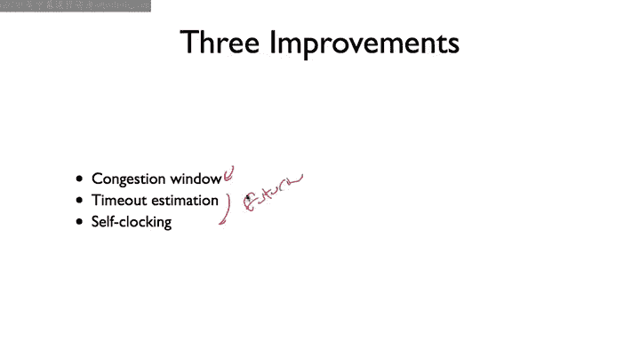

So the congestion window。So the basic insight is that the flow control window is only about the endpoint and so what。

You want to do is have TCP estimate a congestion window that is， how much can the network support？

in sense of how quickly can I send data and have the network to deliver it reliably？

And then the sender windows can be the minimum of these two in since there's no point sending data faster than the network can support or there any point sending data faster than the end host can support。

And then what you do is， based on this idea of a congestion window。

 you separate how you behave in terms of sending packets and the size of this congestion window into two states。

 The first is something called slow start。The second is congestion of winds。

Use slow start when you're doing connection startup or when there's a packet of timeout when something has gone very wrong and you want to just back off completely and then figure out what it is the network can support。

Congestion avoidance in contrast， is when the network， when you're behaving pretty well。

 that is you're operating close to the network capacity。

 and so you don't want to start sending things much faster or much slower。

 you're operating close to what you think the congestion window of the network is。

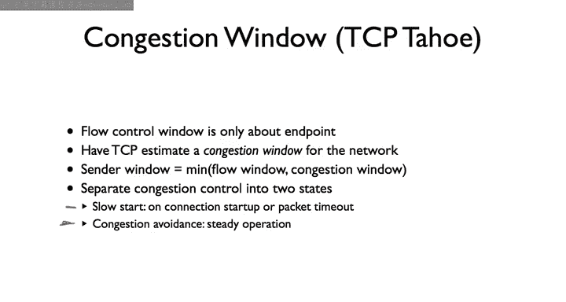

So the idea of slow Start is that what the node does is rather than start its window at the flow control window size。

It starts its window at size of a minimum maximum segment size。

 So basically one segment one packet's worth of data today， nodes might start with two or four。

 there's some sort rules about that，2，3 or 4。 but the original version started at one。And then。

Every time a packets acknowledge， every time you receive a new acknowledgement。

 you increase this window by the maximum segment size。

And what this means in terms of practice is that in the first round trip time。

 you're going to send a single packet， you'll be acknowledged。 Now your segment side。

 Now your window size is 2。 So you'll send two packets。 They'll both be acknowledged。

 You increase by two。 Now you'll send four packets。 They'll be acknowledged。

 You'll then send eight packets。 So there is exponential growth。

And so that's what you're seeing here。 So here's one packet， two packets， or there's one，2，4。

 you know，8， et cetera， this exponential growth scaling up。So in a logarithmic number of steps。

 you can hopefully discover what is the congestion window size of the network。So this might seem。

 mean exponential growth is not slow。 And so the name can be a little confusing。

 The reason it's called slow is that it's slow compared to the prior。

 which is actually the much faster mode of TCP today。

 but compared to sending an entire flow control window of packets doing this exponential scale up through a longerar than than number of steps was comparatively so。

 So it's an interesting sort of historic compared to modern modern idea。

And so we can see in this figure。 this is also from Van Jacobson's paper that。

The packet sequence number， you know， is increasing this way you see this exponentialal growth and then using slow start。

 you end up plus then the congestion avoidance state that I'll talk about in a moment。

 you end up hitting this nice steady state。 And while it takes you a little bit of time to discover what the line speed is。

 Eventually， the behavior of the protocol is very close to this line speed。

 And it's operating close to capacity， It's not overwhelming it and you're not seeing these saw tooooths of terrible performance。

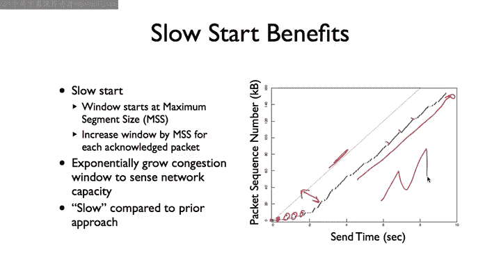

So that's the slow start state。Since in the slow star state。

 you are increasing the congestion window by a maximum segment size for each acknowledgeknowment。

 this leads to an exponential increase in the window size。

The second state that you can be in is called congestion avoidance。And in this model。

 when you're in the congestion avoidance state， you increase the congestion window by the maximum segment size squared divided by the congestion window for each acknowledgeledment with this behavior results is rather than increase by the window by maximum segment size for each acknowledgeledment。

 you end up increasing the maximum segment size for each round tripp time。

 So it's an additive increase， whereas this is growing the window size exponentially。

 this is growing the window size linearly。

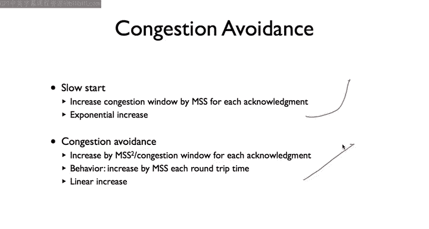

So we have these two states。Slow start and congestion avoidance。

 how do we transition between them Well really there are these two goals。

 why dont use slow start to quickly find what the network congestion capacity is that is how fast can we send things before the network enters congestion and starts buffering packets and dropping packets。

And so then once we are close to that capacity， want is congestion points to very carefully probe。

 So we're below the congestion points， let's just start slowly increasing until we reach it。

 Then maybe you drop down a little bit and start slowly increasing until we reach it。

 We basically can use that to stay close to that value and be close to the network capacity。

And we have three signals to accomplish this。 right， The first is。

 if we're seeing increasing acknowledgecknowledgments， that means that data transfer is going well。

 Maybe we can speed things up a bit。The second is if we have duplicate acknowledgecknowledments。

 remember TP using cumulative acknowledgements。 so if we're seeing many acknowledments for the same piece of data that means TCP is receiving segments。

 but one of them is missing。So this means something was lost or delayed。

The final signal is a timeout， if we've sent a whole bunch of packets or a window of packets and we've heard nothing and there's a timeout that means something very wrong has happened or maybe way off of what the congestion is moving or has suddenly become congested because it itself can have dynamic traffic。

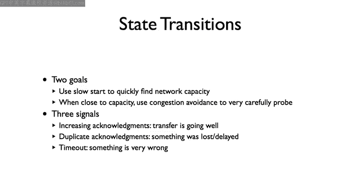

So， this is the。TCB Tahoe financein State machine。 I'm going to walk through a bit by bit。

So when you open a TCP tahoe connection， you start in the slow start state with a maximum with a window of a maximum segment size。

And recall that your actual window will never grow larger than your flow control window。

 the minimum of the flow control window and congestion control window。

 So this is controlling the congestion control window size。

Then every time we're in the slow start state and we receive an acknowledgement。

We increased the congestion window， the sea wind。By the maximum segment size。

 this is the exponential increase here。Then we have a parameter SS threshold。

 which is this stands for slow start threshold。 If the congestion window grows larger than the slow start threshold。

Then we transition to the congestion avoidance state。 This means that， hey。

 we suddenly have a big enough congestion window。Then we should slow down our growth。

And so we transitioned to congestion of winds。Now， in the congestion avoidance state。

 if we receive an acknowledgement increase the congestion window by maximum segment size square divided the congestion window。

 this is the linear increase。And so we see that the window size will look like this over time effectively。

 where here is when we hit S S。Thrash。this part corresponds this state and this part corresponds to this state。

嗯。But now what happens if we're in the congestion avoidn state and this linear increase？

Goes beyond the congestion capacity of the network。

 Well what's going to happen is we're going to see a timeout or a triple duplicate act。

 a triple duplicate act。 This implies a packet was lost。 We're seeing these these many acknowgments。

And so what TCP Tahoe does on seeing either a timeout or triple Dbukaac。

Is it resets the congestion window to be1。And it sets the SS threshold to be the old condition when they're divided by two。

And so what this is going to do is after say this， we see this。Linear growth。 and then at this point。

 say we say a triple duplicate act。What will happen is that TCB Tahoe is going to set。

These blue is going to set S S thresh to be half of what the congestion window is at that time。

It's then going to reenter。Slow start。Do an exponential increase until it reaches this SS thresholdreash。

 which then SS threshold， which point will then enter congestion avoidance and do a linear increase。

And so the way to think of this is that。Upon this triple duplicate act or this timeout。

The TB taho has discovered what it thinks is too much too fastt transmission rate。

 Its window is too big。 So then what it does is it says， okay。

 I'm going to exponentially grow my window until I reach half of that point。

 and then I'll start linearly increasing it。Is that way you can hopefully quickly get back to。

 you know， close to capacity a logarithmic number of steps。 but then you don't want to get too close。

 And so you start at half of half of what that old value was and then start linearly increasing again。

 So this is the basic finite data machine for TCB toho。

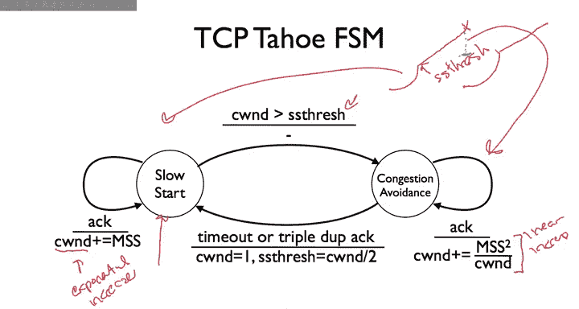

So here I will walk through a simple example。 So we start with a sender。

 and let's just say S S threash。Is equal to4。When it starts up， so it's first。

 it's going to send a single TCP segment， single maximum segment size segment， the receiver。

 let's just call this one。 I'll number them as packets for simplicity。

 The receiver sends an acknowledgement。So at this point， here our congestion window。To go to1 Now。

 since we're in the slow start state， it'll become2。Becomes 2。

 And so the sender can send two packets。3。And four， the receiver receives them。I'm sorry。2 and 3。

The receiver receives them， sends acknowledgecments。 Now our congestion window is four。

Which means that we will send。4 packets。hi would be 45，6，7。 Now at this point。

 congestion window has reached the slow start threshold。

Which means that TC B Tahoe is going to exit the slow start state and enter the congestion of woodenden state。

 And so when these acknowledments come back。It's going to increase the window by one。

 and so rather than send eight packets， congestion window will be5。And itll send five packets。

 so let's just say I'll just draw one arrow here。Of packets，8，9，10，11。12。

Now let's say that packet 8 is lost。 It's dropped in the network。

 You've actually reached our congestion point。 Well what will happen Well。

 the receiver is going to acknowledge 8。 It's going to acknowledge that8 was received in November this TtP。

 so the act would actually say9， but I'll just write write 8 for simplicitys。 It's going say， aha。

 I've received 8。Then 10， 11 and 12 arrive。Now， TCP is going to then send acknowledgecledment 8。

eight。8， because it's cumulative acknowledgecledgments that hasn't received9 can only say I've received 8。

 I've received date， received date。 This is a triple duplicate acknowledgement。

 We have three duplicates。So what now T Bta is going to do is is's going to transition back to the slow start state。

 My congestion into is 5。So I'm going to set my。Slow start threshold。

To be equal to half of the congestion window， right。

 So let's just say we're going to set it to basically to 2。5。And enter this slow start state again。

 So I'll send a single packet。

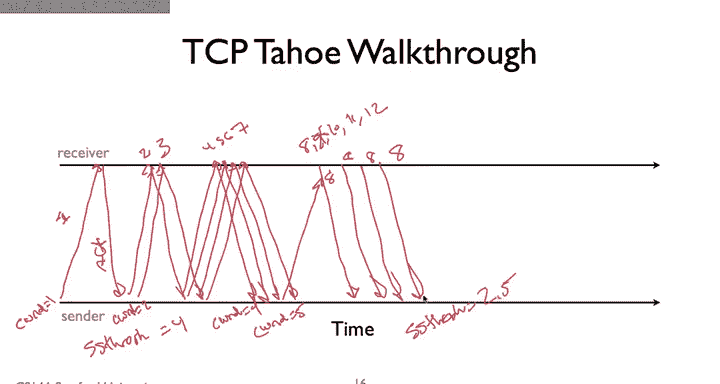

Right。Now this packet is going to be sent on a timeout。

 so essentially I'm waiting for the acknowledgement9， I haven't heard it。

 I'll time out and I will send I will resend9。Then that's the number of packets I can have outstanding。

 Then if an acknowledgement for9 comes back。I can set my congestion window to two。

But this acknowledgeledment won't be just be for none because it's received 10 and 11 and 12。

 So that acknowledgement is actually going to say is acknowledge 12。

So I now have my congestion window to 2。 I know 12 has been received。 I can send 13。And 14。

 and I'm back in the slow start state until I reach this SS threshold。

 which point will transition back to congestion of winds。 So that's a basic walkthrough of TCV Tahoe。

And how it behaves， it's moving between slow start and congestion avoidance and how it's using triple duplicate acts in order to infer that something has gone wrong and return back to the slow start state using that to infer that there's congestion and slowdown。

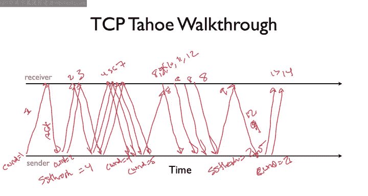

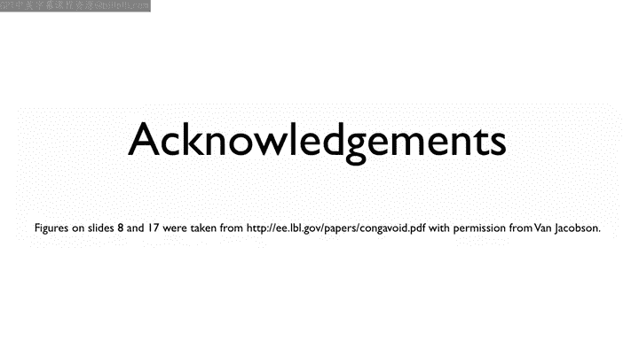