# 斯坦福大学《计算机网络｜Introduction to Computer Networking CS 144 2018》中英字幕deepseek - P61：-061-Congestion Control   RTT.zh_en - GPT中英字幕课程资源 - BV1bVqNYFEGg

So in this video， I'm going to talk about two additional mechanisms that TCP Tahoe introduced to control congestion。

Better R TT around trip time estimation and self clocking。

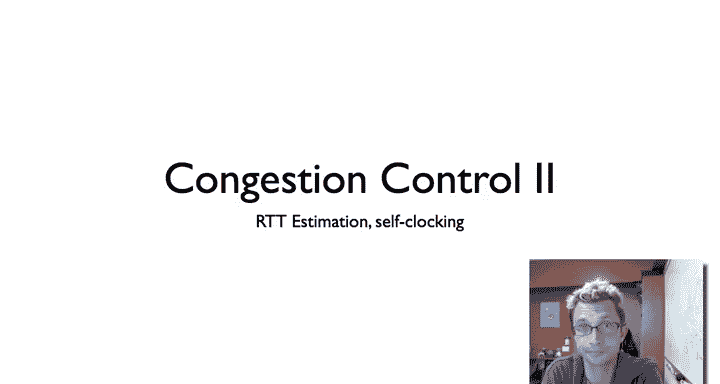

To recall， the TCP Tahoe introduce three basic mechanisms that allowed it to tame congestion and essentially allow the internet to work again。

The prior video talked about a congestion window and this idea of the slow start and connection of wooden states。

Now let's talk about the second mechanism， timeout estimation。

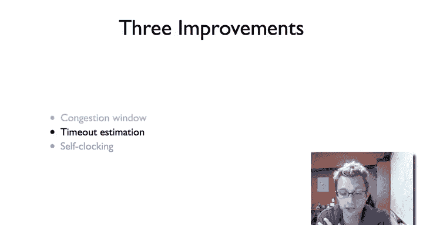

So it turns out that estimating around trip time is really critical for retransmissions and for timeouts。

If your round trip time is estimated to be too short。

 that is you estimate to be shorter than what it is。

 then this means that you're going to waste capacity。

 you are going to think that the packet wasn't successfully received when it has been and retransment unnecessarily。

This is then going to trigger slow start， so this is really that in since if I have a nice window size。

 I'm sending data， but my RTT estimates are too short， I'm now entering slow startne。Now。

 if the RTT estimation is too long， that's also a problem because it could be that really I could have retransmited a long time ago the packet didn't get there。

 but say let's say I estimated an RTT of five minutes when it's only a couple hundred milliseconds。

 your protocol is going to sit there dead for five minutes before it issues a timeout and tries to do a retransmission。

So this is fine， but the real challenge is that especially on the internet as we've seen with packet switching。

 RTT can be highly dynamic。 Furthermore， it can very significantly load。

 even as you are starting to send things faster， you can change your own RTT。

 even if the rest of the world remain the same。 And so how do you estimate RTT very inexpensively very quickly given these constraints。

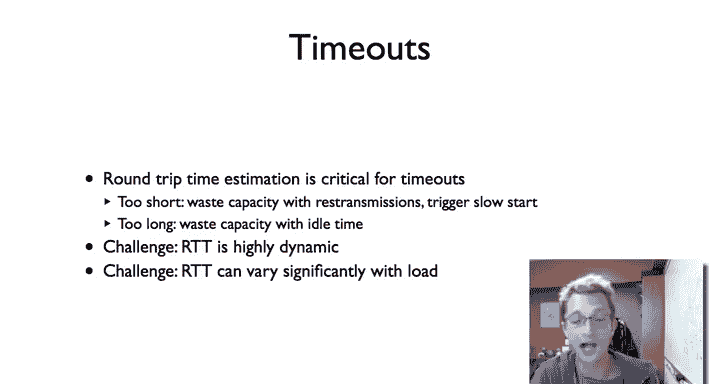

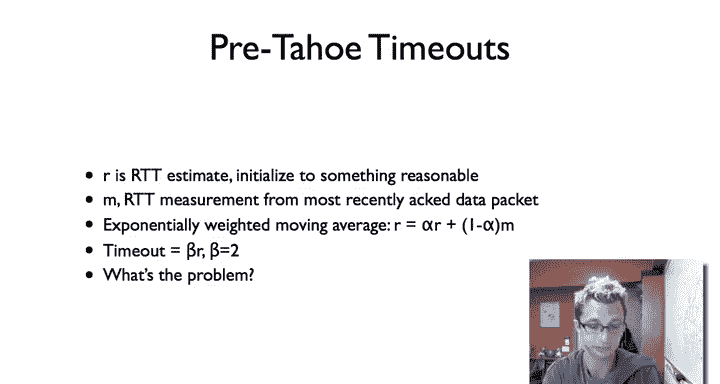

So before TCB Tahoe， there was a very simple mechanism。

 which is that R is your RTT estimate and you just initialize it to something reasonable like， okay。

 we'll guess 500 milliseconds or something。Then you are generating a measurement from the most recently Acted data packet so you would say。

 okay， I sent packet5 at this time， I now got the act at time plus 57 milliseconds or say 200 milliseconds and then going to estimate M will be 57 or 200 milliseconds。

I then maintain an exponentially weighted moving average。 So alpha R plus 1 minus alpha Ms。

 This is basically saying， take my existing estimate and incorporate some fraction of my new estimate。

 So if say， let's just say R is equal to 100。Milliseconds。

And my measurement is equal to 80 milliseconds。And alpha。

 which are the weighting of history to the present sample， let's just say alpha is equal to 0。9。

 so I'm going to weight history a lot as a way to sort of smooth out noise。

 then the new R is going to be 0。9 times 100 milliseconds plus 0。1 times 80 milliseconds。

Seged to 98 milliseconds。And so this one sample at 80 milliseconds is going to sort of go110 of the way between R and M。

So you can imagine a lower alpha value means that you're going to weight the current measurements more versus a higher alpha value weight history more。

Then your timeout is based on this factor beta R and beta was 2。

 and so if you see that you don't get an acknowledgecment for twice your average。

 then you assume there's a timeout and then you trigger a timeout。

So this seems like a totally reasonable algorithm， you know first blush。So what's the problem？

It turns out that the problem is that。The fact that R is a certain value should not say anything about what the distribution of R TT values is like。

 So one way to imagine is， let's say， you know， here's a graph And I'm looking at a distribution of the round trip times of packets。

 They're not constant。 They're varying over time。Well， in some cases， I might have。

 here's my my average， let's call it a。 I might have a distribution like this。Where in fact。

 if I were to look at 2A。That less than 0。00001% of packets take that long。

 At which point beta a beta of 2 is a tremendously conservative estimate。

But it could also be of a slightly different case where here。

 let's just say I have another link or another path， which is B。

 where my distribution looks more like this。Where if I look at 2 B。Some say 20%。

Of packets tend to have an RTT of that law。Depending on the dynamics of the network。

 you can have very different distributions of RRTTs and this approach didn't keep that in mind。

 and so for TCP connections that had very， very tight distributions。

 beta is way too conservative and you end up being idle when you don't need to be。

 It estimates too large in RRTT。But when the RTT has a very broad distribution。

 a beta equals 2 is far too aggressive and you end up retransmiting unnecessarily。

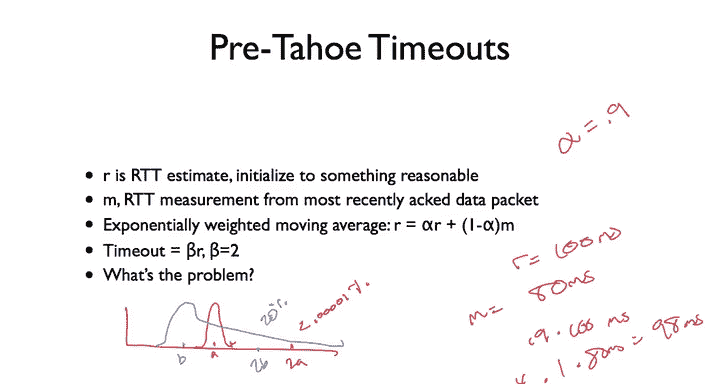

So TCP Tahoe solved this problem by essentially including the notion of the variance of the RTT in its estimates。

 and so this is the algorithm that was proposed and which is used and essentially what you're going to do is just like before you're doing an exponentially weighted moving average。

 you have this RTT estimate。And what you're doing is also measuring your error in the estimate。

 and so given I have this estimate R and I to measurement in M， I measure the error to be M minus R。

 and I multiply it by this gain factor and because these terms I'm essentially multiplying by minus R。

 there's the alpha factor that we saw in the prior approach。And then we measure the variance。

 and so the variance is， again， with way the average is the gain factor of the error minus the variance。

But the so the basic idea here is we're measuring not only an exponentially weighted wing average of R。

But we are also measuring an exponentially weight moving average of the variance over time。

And then our timeout is equal to the average plus four times the variance， or beta is 4。 So this way。

 if we have。As before， if we have a very tight distribution。Then with a variance like this。

 then we're going to time out when the packet when the variance is just when you have a packet that's just four times the variance out。

Similarly， if you have a very broad distribution。Your variance is going to be out here。

 then you'll end up timing out when the very when the it's four times that value。

 and so very it's very likely that the packet was actually lost。In the case of tremendous congestion。

 you're not getting estimates you nothing is happening， you exponentially increase this timeout。

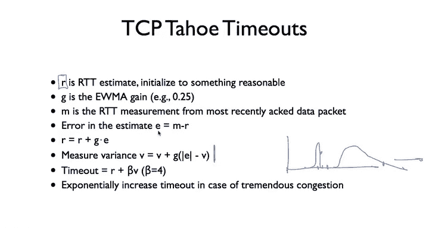

So here are to graph from Ven Jacob's paper， which show the performance of this R TT estimation。

 And so what the。Faint line on the bottom shows is the actual measured RTTs of packets from acknowledgeknowments。

 and the solid line above shows the timeout estimate for the TCP algorithm。

And so the idea is that a perfect world that the timeout would would。Perfectly mirror this。

 such that gosh， we didn't get it。 And if we just wait a little longer than we know to re transmitit。

So two points， this figure on the left， you can see that there's this huge gap。

 So TP is sitting aislele for a long time when really it could have retransmed much sooner。

There's also cases where it crosses。 So this is kind of bad where this means that the packetca took longer。

 You know， the estimate was， in fact， was too short。And so if you look。

 this is the pretahoe algorithm on the right is the post is the Tahoe algorithm。

 you see that it's tracking the RtT is much， much better。

 right that the gap here between the observed RTTs and the timeouts is much closer。

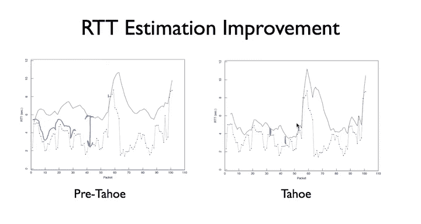

So the third improvement that TPtaho brought was something called self clocking。

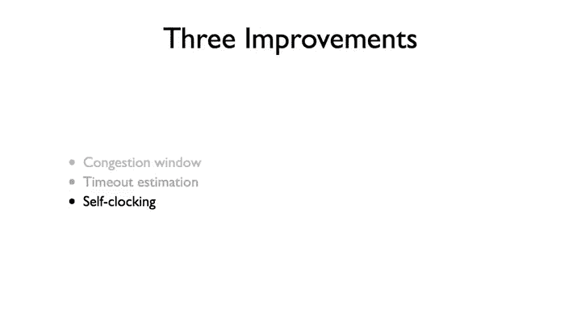

And this， in some ways， the greatest conceptual contribution of TCP Tahoe， this idea that。

You want to essentially clock out the packets that you send based on the acknowledgecknowments you receive。

And so this is the and this is the sort of the conceptual model that Van shapepes and laid out。

 So let's say I have a sender that has a really big pipe we show by sort of being fat here where the volume of these packets is constant and the receivers is a fat pipe。

But there is this bottleneck link in the middle。 Well， since there is this bottleneck link。

 what's going to happen is these packets that are sent very fast from the sender are going to be stretched out in time。

 They're going to take longer。 and they're then going to be spaced out in time at the receiver。

 The receiver。 if it generates acgments directly in response to these packets。

 then it's going to be sending acknowledgecledgments back with the same timing that's receiving them。

 which is determined by this conges by this the bottleneck congestion link。

Then those acts are going to arrive。 they traverse the bottleneck link you can see they're much shorter。

 so they're not filling it they only take a part of it。

 and then these acknowledgecknowledgments arrive at the sender corresponding to the frequency that packets arriving at the receiver。

And then if the sender。Sends new packets timed by these acknowledgments。

 which essentially is going to inherently rate limit itself for space up packets in time so that they're entering this bottleneck link at the right rate that is just as a packet's leaving like here。

Which then falls through the neck。 A new packet starts arriving。

And it's this idea of self clocking that you don't put a new packet in the network until one comes out and you clock yourself based on this。

Is what allows TCP in a very simple mechanism to not stuff lots of packets into the network and to not suddenly send huge bursts of packets that saturate this link because you can imagine there is some Q here。

And so even if TSP knows， oh， I can only send five packets per round trip time。

 if it sends a burst of five packets， then those packets might fall off the end of this queue。

 but if its are spaced out properly due to this timing。

 then it's going to be feeding them out at a nice steady rate。

 which will fill this pipe without overfilling the queue。

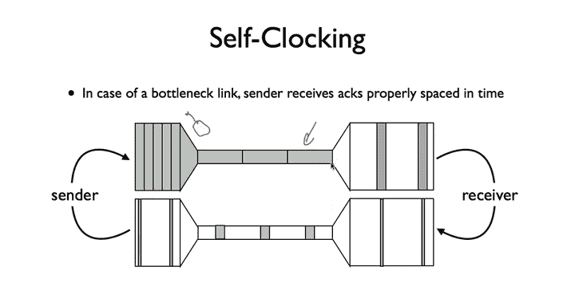

And so the principle here is you only want to put data into the network when data is left。

 otherwise you're increasing the amount of data the network in you're causing congestion。

And so you send new data directly in response to acknowledgecledgments。

But also it's important that you send acknowledgecgments aggressively。

 such as we saw with duplicate acknowledgecledments， they're a really important signal to the sender。

 And so if you are receiving additional segments and the segments that you have missing segment。

 you should send acknowledgeknowledgments for those segments aggressively so it sees that there are duplicate acknowledgecknowledgments that it gets a signal that something has been missed。

It also knows on receiving those acknowledgments， those duplicate acknowledgegments that packets have left the network and it can make decisions accordingly。

 so this is those three mechanisms of a congestion window。

 better RtT estimation that considers variances on self-clocking or really the foundation of TCP Tahoe and so in 1970 in 1987 at T8 Van Jacobson fixed TCP with these as well as a few other tricks and published the seminal TP paper on TCP Tahoe and this is basically solved TCP congestion control problem。

 the internet started working again and this actually spawned a huge area of research in TCP in this whole idea of how do you manage your sending rate to not congeest the network。

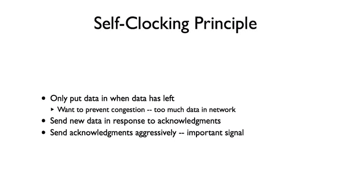

And so in this next， I've just talked about the first version TSP Tahoe， but there's a long history。

 so the next video I'm going to talk about TSP Reno， new Reno to closer to what's done today。

They add a couple new mechanisms。And so if this is interesting。

 I totally recommend reading Van Jacobson's original paper congestion。

 avoidance and control sort of lays out a little bit of the story of what they saw and then these mechanisms and how they solve and how they solved it。

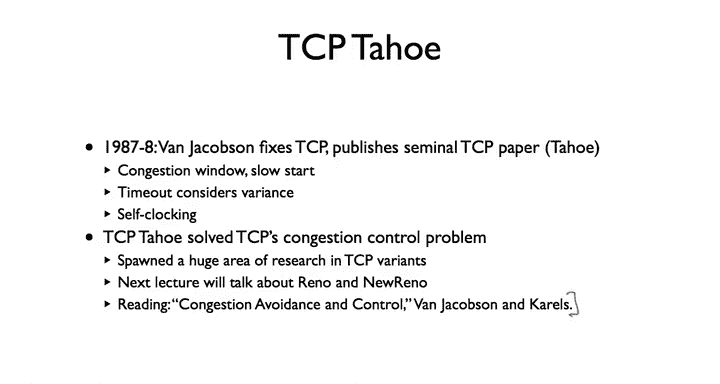

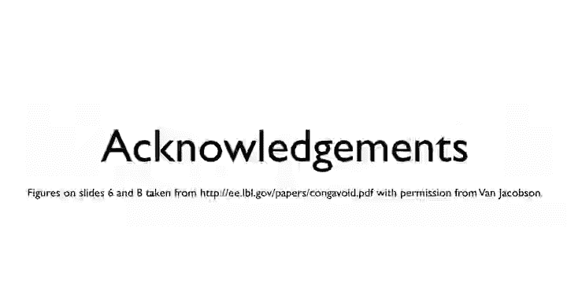