# 斯坦福大学《计算机网络｜Introduction to Computer Networking CS 144 2018》中英字幕deepseek - P62：-062-Congestion Control   TCP.zh_en - GPT中英字幕课程资源 - BV1bVqNYFEGg

So in this video， I'm want to talk about some more modern versions of TCP TCP Reno and new Reno。

 where TCP Taho solved the congestion control problems such that TCP could operate。

 the internet could work again， it wasn't necessarily as high performance as it could be。

 since it was a bit more conserved than it needed to be。

 and so since then there have been improvements to TCP。

 although still keeping the original mechanisms of TCP Tahoe to make to have it send data more quickly and have higher performance。

So I'm going to walk through two of those additions。 One is something called TP Reno。

 and then TCP Ne Reno。

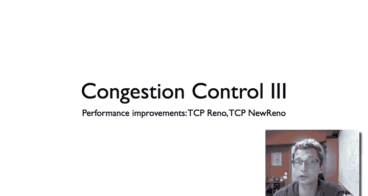

To recall for TCB Tahoe。If。The protocol is running。

 and you encounter a timeout or a triple duplicate Act， which implies that there's a loss packet。

 You do three things。 You set your slow start threshold to be the congestion window divided by  two。

 says determining when you're going to enter the congestion avoid in the state as the congestion window grows again。

 you set the congestion window to one and you enter the slow start state。

The idea here is that you're sending along， you're sending data。

Let's just say here is the window size。You're sending data， something happens， there's an event。

You set your threshold to be half of your original window size。

 You set your congestion window to be one。 You enter slow start again， exponential growth。

 And then when you reach this threshold。You do additive increase again。

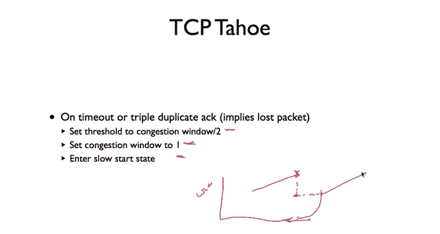

So that's TP Tahoes behavior。And so here's a picture just showing that a little more clearly。

 So here we start with the congestion window of size 1。 we're in the slow start state。Then there's。

 say， a triple duplicatelic Act。Our timeout。We set the congestion window to be size one again。

 but we have a slow start threshold here， which is half of this value。So if this is x。

 this is x over 2。 So we do exponential growth again until we reach this point。

 which point now we're in congestion avoidance。Linear increase。Now here we have a timeout。

The window size is staying stable， boom， drop down to congestion window size one again。Slow start。

Congestion avoidance， timeout， et cetera。 So we see this behavior of whenever we have a triple duplicate a or a timeout。

 we end up reducing the congestion nu to a size1。Going through slow start and then entering congestion of winds。

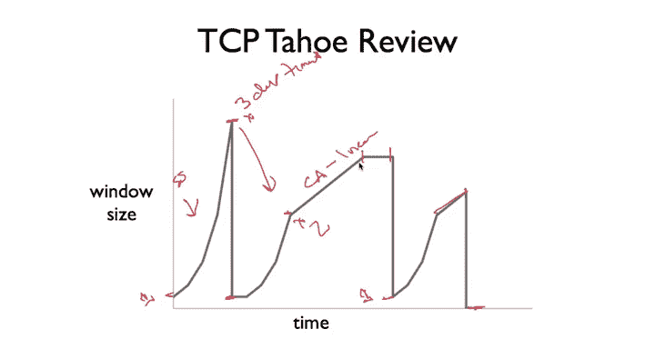

So TP Reno generally behaves similar to TP Tahoe with。One exception， which is that on a timeout。

 it behaves the same way that it sets this congestion window to be size1 and does slow start again。

 The assumption here is， hey， things have gone very wrong If I have a timeout。

 And so I'm just going to assume nothing about the network and pretend as if things were just starting from the beginning。

嗯。What Tpirno does differently is on a triple duplicate act。It assumes， look， a segment was lost。

 but other segments are arriving。 Chances are I'm close to what my speed should be。

 I don't need to drop my congestion window to size 1。 Instead。

 I still set the threshold to be congestion window divided by  two， as before。

But I set my congestion window itself to congestion window divided by two。

Since it's called fast recovery， rather than entering slow start again。

 I just have my congestion window。Then as another mechanism， there called fast transmit。

 which it won't wait for the timeout on a triple duplicateate act says， look。

 I have a triple duplicate act， it means that that segment is' really likely to be lost。

 so I'm just going to retransmit it immediately。And what this behavior means is that on a triple duplicateliccadeac TCP Reno will stay in the congestion avoid state isn't going to require a logggar length number of steps to enter that state。

 which means the window size is bigger， fast re transmitit means it's not going to have to wait for a timeout。

 And so in theory， the idea is that it's not going to have a couple of round trip times where it's then ramping up。

 and so its overall throughput will be higher。

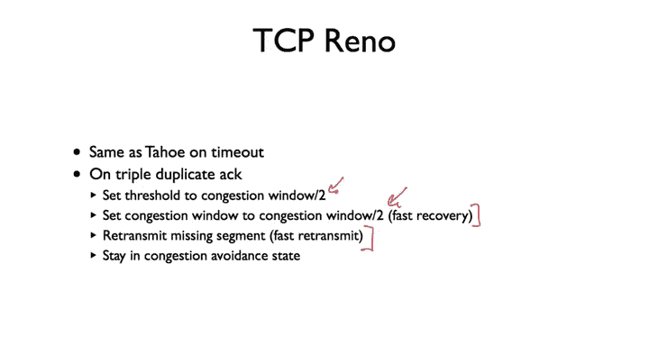

And so what this is a picture shen how TP Reno behaves under similar circumstances。

 Where here we see we start in the slow start state。 Here's slow start。

 Then we have a triple duplicate act。And rather than drop down to a congestion window of size 1。

 it sets if our congestion window here was x， it sets the congestion window to be x divided by 2。

And since that is the slow start threshold， this causes the protocol to reenter congetion to enter congestion avoidance。

Then here we see a triple duplicatekaac。Do the fast re transmit， we get the acknowledgeknowment。

 We're growing the window again。 Then here we have a timeout。 And when a timeout。

 TP reno behaves in the same way in that it says it says something has gone drastically wrong。

 I set my congestion window to be 1。And enter the slow start state again。

So here we have a slow start condition of winds， congestion of winds。Time out。

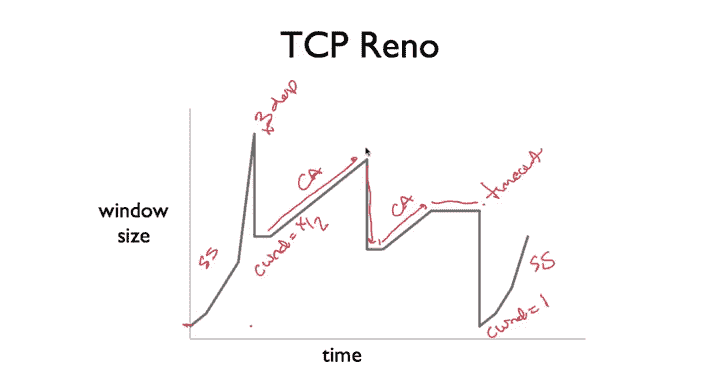

And triple duplicate。Since our TSP reno behaves。So let's walk through that。So my sender。

Sends packet1。I get an acknowledgement one。I send。2 and3。I get acknowledgements two and three。

I then send。4，5，6，7。嗯。And let's say that packet4 is lost。Well。

 the receiver is still going to send acledgments， But in response to 5，6 and 7。

 it's going to send Act 3。Ac 3。Three times。 so triple duplicate Act So at this point。

 when condition window is1， here was2。 Here was4。 Now， on receiving this triple duplicate Act。

 TP of reno is going the set conditionge window would be 2。Immediately re transmitmit packet  four。

 right， fast retransmit。 So here's the fast re transmitmit， no time out。

Then hopefully we will get an Act 7。At which point now we have a congestion window size of size 2 and we'll send。

Packets， eight and nine。

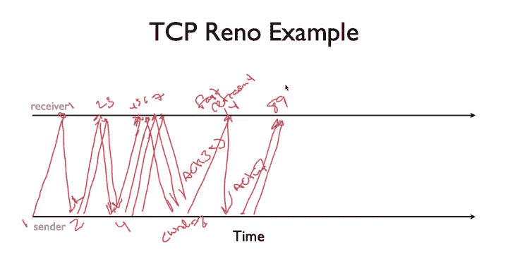

So TSP Reno significantly improves TSP's through you don't have to enter the slow start state and drop your condition into the size one just when a single segment is lost。

TSP new Reno improves things even a little bit more。Essentially。

 it behaves the same as Ta Reno and timeout when you're in the fast recovery state。

It does something a little fancy with your congestion window。When you enter fast recovery。

 so this is when there's a triple duplicateate Act。On every duplicate act that you receive。

 you inflate the congestion window by the maximum segment size。

Then when the last packet that's outstanding is acknowledge。

 you return to the congestion avoidance state， you set your congestion went go back to the value set when entering fast recovery。

And essentially， what this is going to do is。If I have a large window of outstanding packets。

 let's say， I have a very large window。In this case， let's just say， let's say I have eight packets。

 it's not a super large window， but it's for drawing it's reasonable。And this packet here is lost。

 right， so let's call this packet peex right so this packet is lost。

Each of these packets are going to trigger duplicate acknowledgements。

And as now TCP Nuna receives these duplicate acknowledgecknowgments。

 it's going to start inflating its congestion window size。

 and as it inflates the congestion window size， what that's going to let it do is start sending new packets。

The idea here is we have evidence that packets are leaving the network。

 and so it's okay to send new packets。 We don't want to send them too quickly。

 Ex we're close to the congestion point of the network。But otherwise。

 what happens is when we do a fast rate transmit， we essentially have to wait for an entire RTT before we can send a new packet。

We have to do this retransmission， and then when we get the acknowledgement。

 we can now move the window forward。And so there's this whole RTT where essentially TCP sits idle。

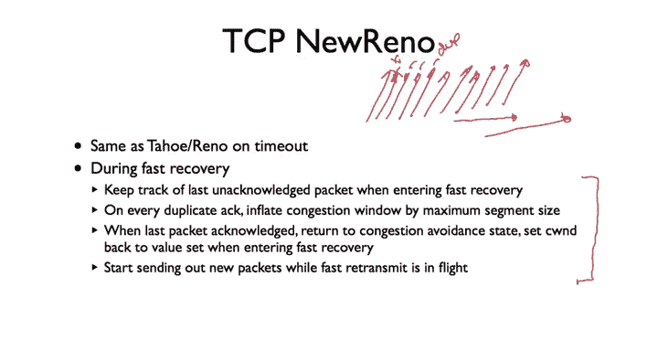

And you see that。In this example here we gosh， we have this situation where long。

 there are these idle periods waiting for the retransmission。

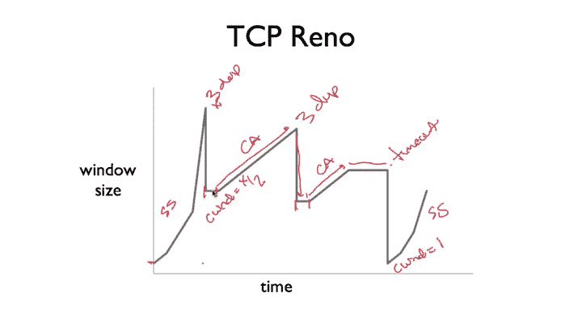

And so essentially what this tweet coto us to walk through explicitly in a second allows TP Nurino to do is to start sending out new packets while the fast food transmit is in flight。

 It starts inflating the congestion window to be bigger that even though this was the last acknowledged packet。

 it can start sending new packets。 But then once we get a proper acknowledgecment， like。

 let's say we get an acknowledgement for this segment here。

Then it suddenly reduces the congestion window size to the right size。

 so it's not like we've suddenly saturated the network。

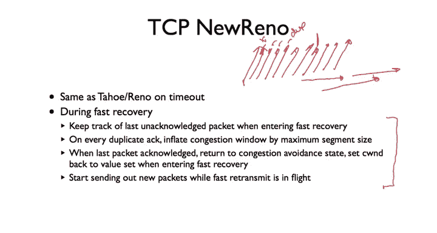

So let's walk through what this looks like。 So let's say we have a congestion window of size。16。

And the encounter a triple duplicatelicate Act。So the rules mean we're going to set the congestion window to be 8。

 So at this point we have a triple duplicate Act， the congestion window becomes8。

And we're going to do fastly transmit。And so tripleac comes in， and we send out。Fastory transmit。

Meanwhile， while that faster transit packet is outstanding。

We're receiving additional acknowledgments。The window size was 16。

 and so we had a triple duplicate act。Essentially we expect to receive order 16 or 15 duplicate acts。

 And so as those start streaming in， what we're going to do is increase the congestion window by one for each。

 and so we encounter those three triple duplicate。 So over this interval here。

 the congestion window is going to increase plus one for each of those duplicate acknowledgecknowledgments。

 which means it's going to increase up to。23。So this might seem really big。

 so then we've inflated our congestion window from 16 to 23。

But think about what this means in terms of the sequence number space。So， we had。

This window of packets， right， And this was the last acknowledged packet here。

 Let's just call it packet 1。 right， Then we've started。And we have an outstanding window of size 16。

 right so we can send from one right so we can safely send from packet 1 to 16。

So when we got that last acknowledgecledment for one， you know， we could send 16。

 everything is So when one was acknowledged it allowed us to send 17。 so everything is good。

Now we have a triple duplicate Act， and we're not going to be able to send anything past 17 until the congestion window grows beyond 17。

 And so it's starting at one。And the congestion window has shrunk to 8。

 And so this means that the valid packets were allowed to send。A two， three， four，5， six， seven。

 eight， and nine。Right。That's not very helpful。And so now。

 as these additional acknowledments come in， we're going to start inflating this。

 So we're going to allow ourselves to send to 10 to 11th to 12 to 13 to 14， et cetera， et cea。

 et cetera。 until when we get， say， the8。Duplicate acknowledgecledment。 now suddenly。

We have increased our congestion window size， back up to 16。Which means that， well。

 we could resend 17。 And then when we get the 9， we've increased it to 17。

 which means that we can now send packet 18。And so this will then increase up to 23。

 and essentially what this does is it inflates the congestion window。So we can send up to Packca 24。

And if you look at this carefully。Packets 17， 18， 19， 2021， 22， 2324， that's eight packets。

Which is equal to what the actual congestion window size is。

And the idea is that by inflating in this way， given that we haved it and now we're adding plus one。

The last half of acknowledgeknowledments that arrive will allow us to clock out new packets。

And so essentially， then and as soon as the faster chance acknowledgement comes in。

 we just reset everything， gosh， things are acknowledge our condition into a size8。

 we can start moving forward。But essentially， what this does is this inflating of the window。

After a triple duplicate acknowledgement。Allows TP Nu Reno to continue to send data while the fast transmit is in flight and the amount of data it's going to send is equal to and it's clocked by again。

 acknowledgement's coming in so you know packets are leaving the network。

The expected congestion window size for the next round trip time， assuming that the retrans。

 the fast retransmiter packet is delivered successfully。

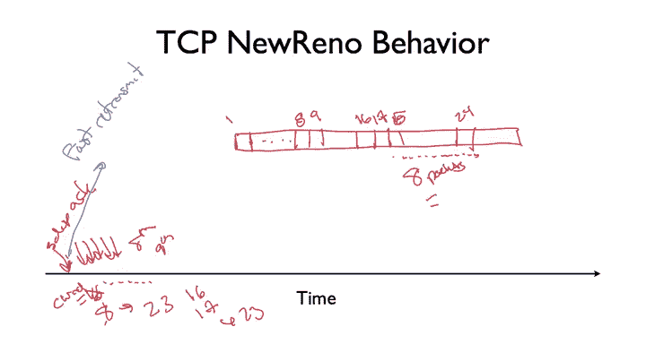

So that's TCP， Reno and Nu Reno Nu Reno is generally used on many systems today。

 or at least the basis for TCP today I'll talk a little bit more about more advanced TCP that deals with some modern network considerations。

 but in a Linux system or a Windows systems Mac OS systems。

 the basic TCP algorithm that's running is very， very similar to Nu Reno。

It turns out the congestion control is a really hard problem。

 and it's one of the hardest problems for to build to a robust network system。

The basic approach that you see that has been adopted and which seems very。

 very powerful and very robust is this idea of added increased multiplicative decrease that you increase a window additively。

But then reduce it multiplicatively。 So you respond very quickly when things go badly and carefully increase it。

And so the trick is that when you're doing this is how to keep the pipe falling and improve throughput。

 So there's things like fast re transmit， don't wait for a time out just to send very。

 very resend quickly and also things like congestion window inflation。 gosh。

 I don't want to waste a whole round trip time waiting for the fast re transmit acknowledgecledment I know stuff leaving the network。

 I'm going to start sending out some new packets Oh allow these packets packets have left the network。

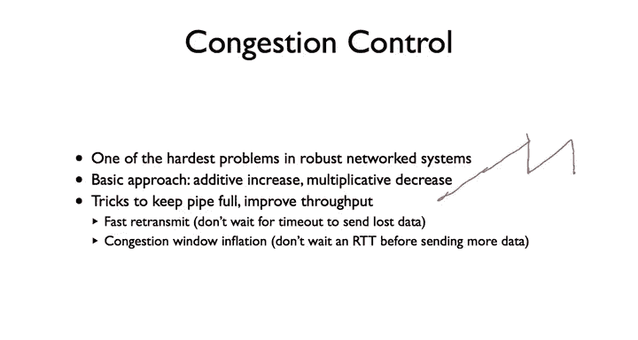