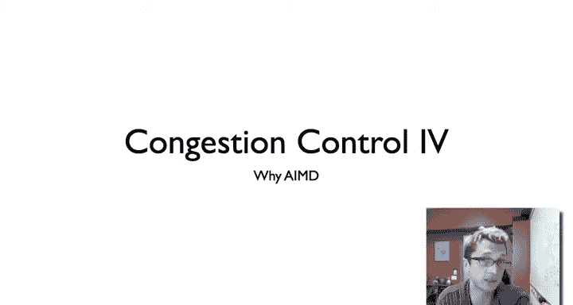
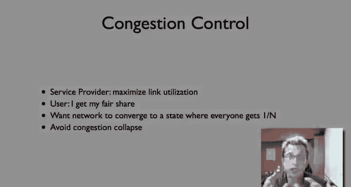
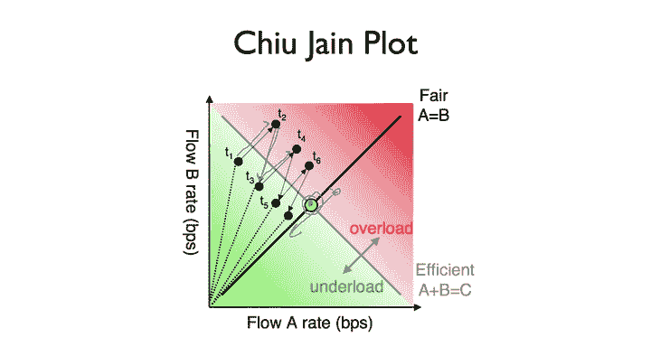

# 斯坦福大学《计算机网络｜Introduction to Computer Networking CS 144 2018》中英字幕deepseek - P63：-063-Congestion Control   AIMD.zh_en - GPT中英字幕课程资源 - BV1bVqNYFEGg

So in the video about TP Reno and new Reno， I said that add the increased multiplicative decrease turns out to be a really powerful and very effective mechanism for congestion control。

 This video， I'm trying to give you a sort of intuition as to why。

 why it turns out to work so well and why it is that it's generally used on the Internet。

So the way to think about this problem of congestion control is that there really are two conflicting requirements in the network。

 The first is a service provider。 What they want to do is they want to maximize their length utilization that is they want their network to be completely utilized。

 they don't want to have idle capacity， which is unused。

But users want to get a fair share of that， you know。

 a service provider would be happy if one user just got the entire pipe。

 but then you're going to lose all of your clients and users will be unhappy。

And so the idea is that you'd like an algorithm for congestion control that has the links operate close to utilization。

But we' converge to a point where every user assuming everything else is equal will get approximately one anth if there're end users。

 and in doing this is going to avoid congestion cos that they're still doing useful data。

 So these are the basic parameters of the problem。 We want to maximize link utilization of highlink utilization。

 Meanwhile， everyone gets a fair share of that link utilization。

 and we want to make sure that the network does not ro itself into the ground。

So what should your congestion window size be， So it turns out the optimal congestion window size。

 as you talked about before， is the bandwidth to light product。

 And this is basically the idea that let's say I have my bandwidth between San Francisco and Boston is 10 megabys per second。

And the delay is 100 milliseconds。Well， this means that if I can support 10 megabys per second and a congestion window lasts 100 milliseconds。

 then my congestion window should essentially be 1 megaby， right。

 the product of 100 megabytes per second times 100 milliseconds。 Similarlyly。

 if my bandwidth is 6 mebytes。P second。And my delay is 90 milliseconds。

Then I should be sending approximately a congestion window of 540 kilobys。

And this falls out from these values and then if I'm sending one megabyte per congestion window and there are 10 conditioned windows I'll be sending 10 mebytes per second。

 then I'll be sending 10 mebys per second Similarlyly。

 if my congestion would is 540 kilobytes and this a congestion would to be 90 milliseconds。

 they'll break down to 6 megabytes per second。So now a way to think about how a congestion window works over time。

 or rather how pairs of congestion windows work over time is something called a Qu Jane plot。

And this is really part of the thing which sort of laid out some one of the papers that laid out this first idea or sort of why AMD is a good idea。

 it really a nice graphical way。So we want to do is plot。

 we have two flows that are competing for the network and we're going to plot the rate of flow A based on its say congestion window size and the rate on the X axis and the rate of flow B on the Y axis is's going to be a scatter plot。

Now， if the network is fair， a will be equal to B。That is the rate which a gets will be equal to the rate which B gets。

 And so the point， the scatter point dot， should fall on this line。Now。

 and that's the user requirement。Now， if we are maintaining the service provider requirement as we're actually running network at capacity。

 then it should be that a plus B， the sum of these two flows equal to the capacity of the network so this is the service provider。

Requirement。And so what we' would like is a congestion control algorithm that causes， you know。

 starting wherever we are in this design where you pick some random point is going to cause flow A and flow B to gravitate towards this desired point in the center where we are fair and efficient we fully utilizing the link。

And so what you can show this is that if we're to the right of the efficiency line that means we've overloaded the network。

 so chance our packets are going to be dropped， we're going to see triple duplicate Xs。

 if we're in the green region that we've underloaded the network。

And so we want to get to this point where we're operating right at the error capacity。

 but we have fair capacity。Now what this shows you this series of T1 through T6， etc。

 is how additive increase multiplicative decrease behaves。

 so let's just pick this arbitrary point T1 where flow B is operating at well above its fair share。

 as you can see this distance and the flow A is operating well below its fair share as you can see by this distance here。

So what's going to happen， Both are in additive increase mode。

 and they're both going to additively increase。Their congestion window size and their flow rate until at some point。

 the network becomes overloaded and it drops some packets。

 At which point then they multiplicatively decrease their window size and go back into additive increase。

 And so here's the multiplicative decrease。And then they additively increase。 Now。

 because the multiplicative decrease decreases B's rate more than A。 It's a multiplicative factor。

This then makes the plot the comparison of A and B closer to fair。

 you can see T3 here is bringing the pair of flows closer to the fair line。

 and that's we're seeing is since we're reducing each flow by a multiplicative factor over time and then increasing by an additive factor over time。

They oscillate between overload and underload in sense。

 if they're going to push the network until it's just a little bit overloaded。

 then they back off a little bit。 And over time， this scaling this multiplicative decrease causes them to converge towards this point。

And so in fact， in the end case， what we willll see is that depending on exactly what overload point causes a triple duplicate acknowledgecgments because there will be some cues。

 et ceter， you'll see these two flows oscillating along the fair line， underloading the network。

 then increasing， then overloading it outly back off， increasing。And so over time。

 additive increase multiplicative decrease causes a pair of flows or a set of flows to achieve both desired properties。

 They get a fair share of the capacity of the network。They end up moving along this line here。

 but also through their additive increase， they're going to be close to the network capacity They're going to go a little bit past then a little bit back a little bit past。

But generally speaking， additive increased multiplicative decrease will cause flows to converge on this point。

 the desired equilibrium point of the network。

