# 斯坦福大学《计算机网络｜Introduction to Computer Networking CS 144 2018》中英字幕deepseek - P64：-064-Skills     Reading and RF.zh_en - GPT中英字幕课程资源 - BV1bVqNYFEGg

So this video is about how to read an RFC or request for comments。

 the standards document of the ITA of the internet。

So reading RFCs is critical if you want to get a deeper understanding of how the internet works。

 how its protocols are specified， but they are a document that's evolved over several decades to have certain structures and certain approaches and this video is going to explain what that looks like and why。

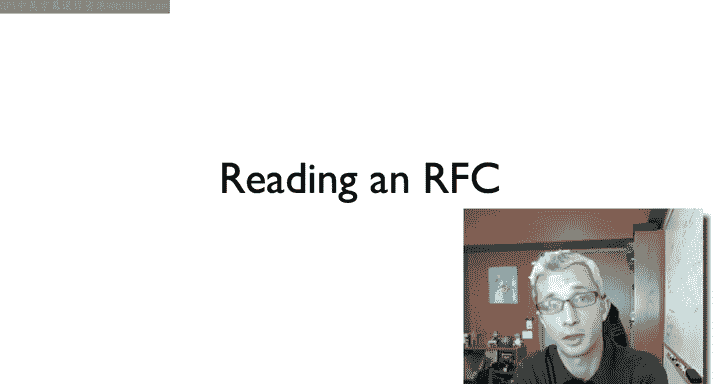

There's actually an RF， request for comments， 2555。

 which describes the history of RFC sort of a historical retrospective。

 The first one first RF RF1 was entitled host Software。

 And this quote from RF 1 talks about where that name came from。

 The idea that these documents aren't statements of control or assertion of control would rather part of a dialogue。

And while RFs today are a bit more formal than this first one on some thoughts on how to structure host software that still remains。

 there's nobody who enforces RFcs Rather their statements of a group of people about what you need to do to interoperate。

 you can always write things that don't follow RFs。 But if you want to interoperate。

 this is what you do need to do。So over time， RFCs have come to have a standardized format。

 so there's the structure of the document， concerns of intellectual property。

 and also specific terms that RFCs use， often you see them in capital words that have capital letters have very specific meaning are all defined at RFC 2119。

Modern RFCs for example， always are required to have two sections。

 security considerations and considerations for Iana， so security has obvious reasons。

 Iana is if this RFC needs new value registries， say protocol fields or whether it allocates fields and other protocols。

Now， one thing that often a first time reader doesn't quite realize。

 and it can be a bit confusing is that they' are actually multiple types of RFCs。

 and they actually have very different meanings and very different implications towards the standards process of the internet。

So for example， there are proposed standards， standards track。

 informational experimental and best current practice。

 and the way to think of those is there's a spectrum of whether or not there's an idea a couple people have proposed。

 say experimental， whether or not it's a specification。

 or it's simply some valuable information that's an informational RFC can be not a protocol。

 but rather just some valuable information for the community。Then you have proposed standards。

 so here's something which a group of people believe should become a common standard of the internet and then standards track and the transition between proposed standards and standards track or standards track is sort of further along the process towards becoming a really stable standard of the internet has to do with how many implementation there are。

 whether they can interoperate， and there's some formal process for making the transition。

There are also RFCs that are best current practice， which state based on our current knowledge today。

 These are the things that you really want to do best practice， best practices。 So for example。

 there are best current practices about how to implement TCP and its congestion control algorithms。

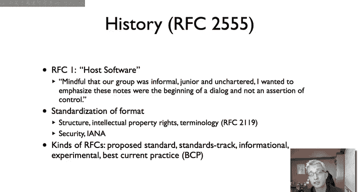

So。That's what an RFC looks like。 This is the basic process that an RFC takes or a document takes to create an RFC。

 This is a bit simplified， and this is actually my personal experience when working on the RFC for this algorithm that came out of my research trickle。

And so generally what happens is that the document starts as a draft。

 and so when you see documents in the IATTF named draft， they are not RFCs。

 they are not formal documents， instead they are works in progress and correspondingly they actually time out so people don't update the draft eventually it disappears off the IETF servers。

And so you start with a draft， I mean， you know it's that it's draft levis。

 this means that it's a personal draft， private it's a personal submission that somebody。

 just a person or maybe a few people are suggesting this document might be of interest to the internet。

And then there's some information， in this case， Levis。

 that's me Ro was the IETF working group that it was the draft that's being proposed for。

 the routing over low power and loss links， and then a descriptive name trickle。

 the trickle algorithm， and then a number， so this is version zero of this draft so the first version of it。

Then。You can submit that to a working group for some consideration discussion。

 maybe it iterates a couple of times， make some improvements， some modifications。

 and the numbers increment so trickle 00， trickle 01， trickle 02。Then at some point。

 the chair of a working group can say or ask the working group。

 do we think that this is something which should become a working group work item that is this a document or an idea or a protocol which the working group thinks is part of its charter and should make more formal？

When it becomes a working group document， then the name changes from draft someone's name。

 Draft Levis to draftt IETF to show that this is now a document under the full auspices of a working group。

 and you can see that it's still the role working group at this point。

 the version number resets to 00。Then it goes through revisions。

 you presented it at working group meetings， you get feedback， comments on the mailing lists。

 questions， concerns， the document iterates over versions 01，02。

03 at some point the working group chair or one of the working group chairs。

 they decide that the document is ready for publication。And so the working group chair can say， look。

 I feel like this document's been through a lot of revision， we agree。

 it seems like it's a good position， it's something that's part of the working group's work。

 we want to make this an RFC。At that point， there's a last call issued first to the working group and then to the IATTF。

 so the working group is given a chance of period to respond any final comments to improve the document。

After which then it's given a last call to the entire IETF。

 anyone can comment on it and suggest things to improve it。

After it's passed through those last calls， that is all of the issues that people have seen have been addressed to the satisfaction of the working group chair。

 It goes to the IESG， the steering group， the Internet engineeringing steering group。

 which has representatives from all of the major areas of the Internet。

 so you have both tremendous depth， people who say experts in transport experts in realtime application infrastructure。

 But then because it's all of the experts， it also has tremendous breadth。

 everything from the network to operations to。To transport。So the ISG reviews it， gives feedback。

 gives comments， sometimes they refuse to publish it as an RFC， they say that this is not。

 this has substantive issues which we see， you need to completely rework it， but if things go well。

 the ISG gives some comments you address those comments and then the document is approved as an RFC or request for comments。

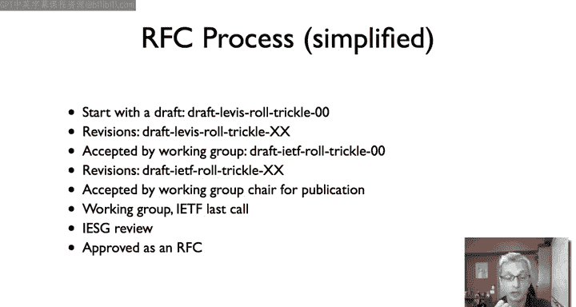

So as described in RFC 20119， there are certain terms which are used in RFCs which have very specific meanings with respect to interoperability and proposed standards。

 and so these are those terms and when they're used they're used in all caps so the first is must required and shall。

 if you see this term used in an RFC， then this is an absolute requirement if a protocol or an implementation does not follow this statement。

 then it not it does not follow the RFC it is not compliant。Then there should recommended it。

And so the shouldn and recommend are things you really generally want to do。

 it's really advised that you do it， but it's understood that there might be times when you don't for whatever reason。

 and so the terminology that's used in 2119 is that you really should understand the implications of not doing this if you're going to choose to not do it。

And then finally， there's May optional， and so this is it's totally up to you， you can do it。

 you can not do it， it is not required for interoperability in any way。And so when you read an RFC。

 it's important to see these terms and how they're used and then understand what the RFC is really saying you have to do to be compliant。

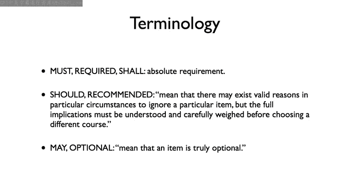

So I thought as an example， we could walk through RC 5681。 This is TCP congestion control。

 As you can see， its standards track。 So this is pretty well along and is written back in 2009 by a bunch of folks who。

Big wigs in the internet。And so one thing you can see is。In fact。

 the history of this document in terms of drafts， so it is draft IETF。

 and it went through all of these revisions and you can see what the revisions are。

 the earlier vision that this is what this obsolete is 2581。

 and so this particular IETF draft went through seven revisions before becoming an RFC。

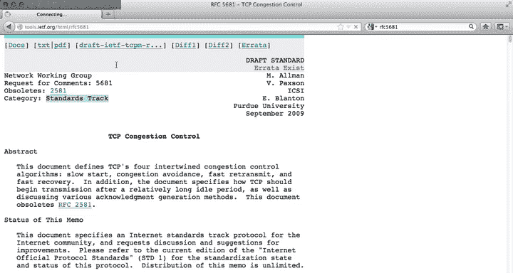

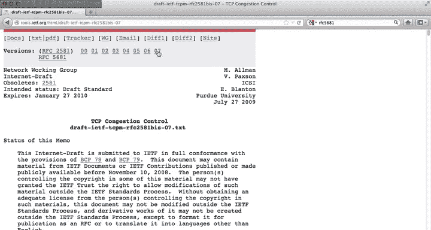

So let's go back to the RFC， so as you can see there's an abstract of stating what it's about。

 other copyright notes， but intellectual property， some background。

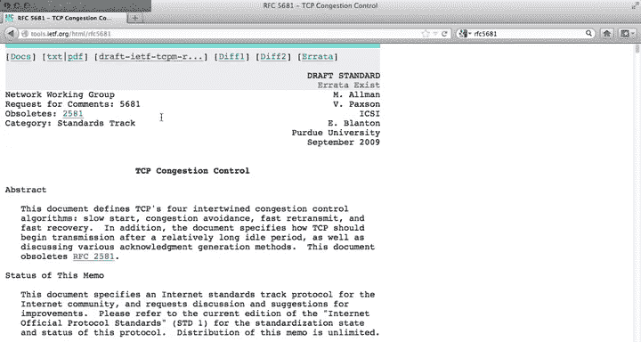

It defines a bunch of terms which are used in this， but if we jump forward。So here， say in section 3。

It's defining the congestion control algorithms of TCP， slow star congestion， avoidance。

 fast transmit and fast recovery。 And so， you know， for example。

 one of the first requirements this document states is that。

It's okay for a TCP sender to send more slowly than what these algorithms say in order to back off more aggressively to congestion。

 but it must not be more aggressive that these what this document describes are basically upper bounds of what TCP should do。

 should never send faster than this because to do so might cause a problem。

 So then here's another specification。 It says the initial value of the congestion window。

 So when you start a TCP connection， what the congestion window is initial window is。

 it must be set following these parameters。 So basically if you have large segment sizes。

 then it should be two segments， if you have medium size segments， it can be up to three segments。

 and if you have small segments it can be up to four segments。

 iss a statement of if you want to follow TCP congestion control properly。

 here's what your initial segment size can be the initial congestion window size。

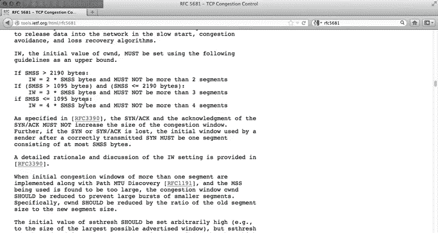

So those are examples of must and must nots。 Here's an example of a should。

So this SS thrash is saying， what is the initial slow start threshold。

 the initial threshold at which we're going to transition from slow start to congestion avoidance。

And so this document says that the initial value should be very， very high。

 so that you just do slow start until essentially you get a loss。

 and then you drop into congestion avoidance， however。You know it can be smaller if you'd like。

 and so it should be set arbitrarily high， but you cannot set it arbitrarily high。

 You should understand however the implications of what will happen if you do this。

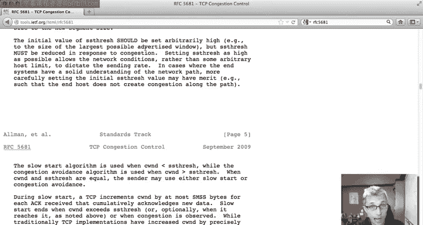

Finally， here's an example of， in fact， a may and a should and a must not。

 So thiss talking about when TCP is in congestion avoidance and it's incrementing its congestion window。

 it says， oh， you may increment congestion window by certain number of bytes。

 in fact you don't have to you could just not if you want to。

 you could not increase it but it should increment it once per RTT by this equation equation and it must not increment it more than this amount。

 so this is basically saying hey， here's the upper bound and you should not ever do it more than that upper bound。

 but you generally want to follow this equation， you should follow this equation So all this aside。

Remember， so this document is saying something about how large the congestion。

 how large the initial window size should be。 It must be this number of segments。

 two segments for large segment sizes 3 for medium size 4 for small segments。 But remember。

 this is just an RF you can say that somebody isn't compliant。

 but there nobody is going to enforce it。 In fact， if you look at this web page here。

 there is this really interesting blog from about two years ago。

 about how Google and Microsoft were're not following this RFc。 So if you want you can look this up。

 this is Ben Strong's blog if you search for Google Microsoft congestion window cheat。

 And essentially what he found is that when you first connect to Google or Microsoft sites。

 their initial window is much is significantly larger than two。

 that they will send you more than two segments essentially so that they can send you their whole web page in just one round trip time and not having to wait for the congestion window to increase。

 And so he walks through all the experimental evidence that he gathered。

 and he shows that these guys were not following the rules And there's been。

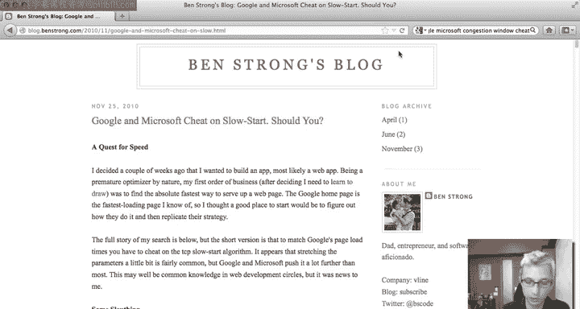

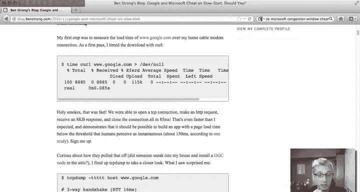

cus the IETF about maybe we need to increase these sizes， networks are getting faster。

 but the point here being that just because it's written in an RFC and says you must do something doesn't necessarily mean that everyone always does。

