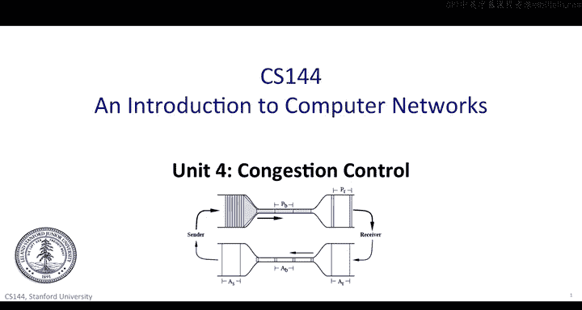
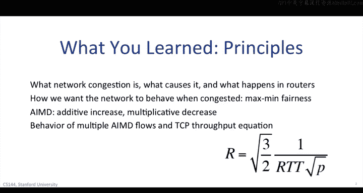
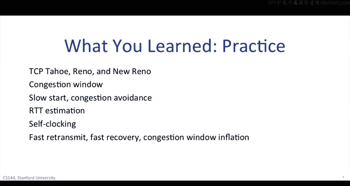

# 斯坦福大学《计算机网络｜Introduction to Computer Networking CS 144 2018》中英字幕deepseek - P65：-065-Congestion Control 64.zh_en - GPT中英字幕课程资源 - BV1bVqNYFEGg

。In this unit， you've seen how transport and packet switching interact through congestion control。

Flow control is about the end hosts， it ensures that the source host doesn't overwhelm the destination host by sending more than it can receive。

Congestion control on the other hand， is about preventing the source hosts from overwhelming the links and routers in between。

When a source host put too many packets into the network or when lots of sources put packets into the network。

 they can fill up the raiculees until they overflow。In TCP。

 a congestion control algorithm running on the sending host tells it how many packets it can have outstanding in the network so as not to overfill the router queuees。

TCP will always lead to some packets being dropped because this is the feedback signal it uses to know when the router curees are full。

But when it's working well， TCP keeps the packet drop rate low， links nice and full。

 and allows the flow to have a high throughput。

First， Nick explained the principles of network congestion you learned what happens in a router structure receiving packets faster than it can send them。

If the congestion is short lived， then a router can absorb the extra traffic into a queue and drain the queue。

If the congestion is long lived， long lived enough that the queue overflows。

 then the router has to drop some packets。Nick introduced a very valuable way to think about this。

Rather than come up with a scheme for dropping packets。

 think about what you want the overall network behavior to be。

We want the network to be fair and explain what that means introducing the concept of maximum fairness。

Maximman fairness says that the network is fair if you can't increase the rate of a flow without decreasing the rate of a flow with a lower rate。

There are a lot of ways to achieve this goal， and networks today have many different mechanisms。

But we focused on one in particular， how TCP can control the number of outstanding packets in the network。

You learnearn the basic algorithm TCP uses called additive increase， multiplicative decrease。

 or AIMD。When running smoothly， TCP increases the number of bites it can have outstanding by one segment size per round trip time。

When TCP detects a packet is dropped， it has the number of bytes it can have outstanding。

You learn what this behavior looks like using a TCP sawooth diagram。

 while each individual flow has a saw tooooth。Over a link that it shares many flows。

 these all average out to a consistently high use of the link。Using the sawtooth。

 we drive TCP's throughput using symbol AIMD。If you assume that the network drops packets at a uniform rate P。

 then the throughput of a TCB flow。Is the square root of three/ halves？

Times the inverse of the RTT times the square root of P。If you've increase round trip time。

 throughput goes down。This equation makes a lot of simplifying assumptions。

 but it turns out to be generally pretty accurate in many cases。

 into a very valuable tool when thinking about how a network might behave。

You've learned how TCP realizes these principles in practice。

 Phil told you about the internet collapsing in the late 19980s due to congestion and the fixes made to TCP。

 which are still in use today。You learned about three versions of TCP， TCP Tahoe， TCP， Reno。

 and TCP New Reno。The first important idea we covered is that a TCP endpoint maintains a congestion window。

A TCP flow could have n unacknowledged bytes outstanding in the network。

 where n is the minimum of its flow control window and its congestion control window。

You don't put more packets into the network than the other end can handle。

 or more than the links and routers can handle in between。

You learn how TCP controls the size of this congestion control window using two states。

Slow start and congestion avoidance Slow start lets TCP quickly find something close to the right congestion window size。

Well， congestion avoidance uses AIMD。TCP starts in slow start and transitions to congestion avoidance when it first detects a loss。

You learn how TCP estimates the round trip time of its connection。

 it needs this estimate to figure out when an acknowledgement times out by keeping track of both the average。

 as well as the variance of how long it takes to receive an act for a segment。

 TCP can avoid unnecessary retransmissions as well as not wait too long。

You learn how TCP controls when it puts packets into the network using a technique called self clocking。

You first saw self clocking when I showed you an animation of TCP's behavior。

 fill them walk you through some examples， with self clocking TCP only puts a new packet into the network when it receives an acknowledgegment or when there's a timeout。

This is really helpful in preventing congestion， as it means。

 TCP only puts packets into the network when packets have left the network。😊，Finally。

 we covered three app optimizations added in TCP Reno and TCP new Reno。

Fast re transmitmit lets TCP keep on making progress when only one packet has been dropped。

Rather than wait for a timeout， TCP retransmits a segment when it detects three duplicate acknowledgeledments for the previous segment。

 this is a sign that TCP is continuing to receive segments but hasn't received that particular one。

Using fast recovery， TCP Reno doesn't drop back into slow start or on three duplicate acts。

 it just cuts the congestion window in half and stays in congestion's avoidance。Finally。

 TCP New Reno adds an additional optimization， window inflation。

 such that three duplicate X don't cause TCP to lose an RTT worth of transmissions as it waits for the missing segment to be hacked。

😊，Now what's really fascinating about congestion is that it's something that was discovered as the internet evolved。

Nobody had really thought something like this might happen or how to control it。

It was an emergent behavior once the network became large and heavily used enough。Nowadays。

 it's a basic concept to networking， seen as critical to building robust systems that have high performance。

Modern versions of TCP are a bit more advanced than what we've talked about in class。

 but mostly they've evolved to handle much， much faster networks。

The TCP versions shipped in operating systems have TCP Reno or TCP new Reno in their algorithms with new additional features and modes of operations to handle very fast networks。

 Take a look at the Linux source code and you'll see these algorithms in there。

But what's also neat is that these nitty gritty algorithms have a sound conceptual basis and theory behind them。

 On one hand， we can talk about RTT variance estimation， fast recovery and self clocking。

 On the other， we're also talking about AAMD flows that can converge to maximum fairness。

